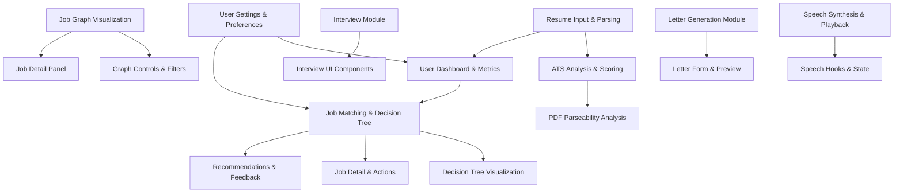

# Overview

This project implements a comprehensive platform for managing, analyzing, and visualizing professional resumes and job data. It integrates multiple subsystems including resume parsing and analysis, job matching and decision support, interactive job graph visualization, interview facilitation, and user dashboard components. The architecture is modular, with distinct UI components, hooks for state and data management, and backend API endpoints supporting AI-driven analysis and data persistence.

## Architecture Overview

**Diagram: High-level architecture showing major subsystems and their interactions**

Sources: `apps/registry/app/[username]/ats/hooks/useATSAnalysis.js:9-52`, `apps/registry/app/[username]/dashboard/DashboardModule/hooks/useDashboardData.js:8-19`, `apps/registry/app/[username]/decisions/hooks/useDecisionTree.js:28-531`, `apps/registry/app/[username]/jobs-graph/hooks/useJobGraphData.js:11-47`, `apps/registry/app/[username]/interview/InterviewModule/hooks/useInterviewMessages.js:7-91`, `apps/registry/app/[username]/letter/components/useLetterGeneration.js:5-38`, `apps/registry/app/pathways/hooks/useSpeech.js:8-131`, `apps/registry/app/hooks/useSettings.js:4-30`

## Key Subsystems

**Landing Page UI**: Comprises components such as `CTASection`, `FeaturesGrid`, and various footer sections (`BrandSection`, `CommunitySection`, `LegalSection`, `ResourcesSection`) that present the project’s value proposition and community links. These components use styled cards and iconography to engage users and direct them to login or explore the JSON Resume schema. (`apps/registry/app/LandingPageModule/components/*.jsx`)

**ATS Analysis**: The `useATSAnalysis` hook asynchronously sends resume data to an ATS evaluation API, managing loading and error states. It returns a score and rating indicating how well a resume aligns with ATS parsing standards. Complementary `usePDFAnalysis` evaluates PDF parseability, enhancing resume quality assessment. (`apps/registry/app/[username]/ats/hooks/useATSAnalysis.js`, `usePDFAnalysis.js`)

**Dashboard & Metrics**: The dashboard aggregates resume metrics such as total experience, skills, certifications, and projects. Cards like `OverviewCard`, `SkillsCard`, and `StatsCard` display these metrics. The `useDashboardData` hook fetches and computes these metrics from the user's resume data. (`apps/registry/app/[username]/dashboard/DashboardModule/components/*.js`, `useDashboardData.js`)

**Decision Tree & Job Matching**: The decision tree subsystem evaluates candidate-job matches using AI-driven criteria. The `useDecisionTree` hook manages nodes and edges representing evaluation steps, animates decision paths, and handles match results. The `useJobMatching` hook scores and ranks jobs based on resume and user preferences. UI components include `DecisionTreePane`, `JobsPane`, `JobDetail`, and `PreferencesPanel`. (`apps/registry/app/[username]/decisions/hooks/useDecisionTree.js`, `useJobMatching.js`, `components/*.jsx`)

**Job Graph Visualization**: This subsystem visualizes job data as a graph with nodes and edges representing jobs and their relationships. Hooks like `useJobGraphData`, `useGraphFiltering`, and `useGraphStyling` manage data fetching, filtering, and styling. Components such as `GraphVisualization`, `GraphControls`, and `JobDetailPanel` provide interactive exploration. Advanced algorithms for clustering and pathfinding support graph layout and analysis. (`apps/registry/app/[username]/jobs-graph/hooks/*.js`, `components/graph/*.jsx`)

**Interview Module**: Provides UI and hooks for conducting mock interviews. Components like `InterviewInput`, `MessageList`, and `PositionSwitch` handle user input and role toggling. The `useInterviewMessages` hook manages message state, streaming AI responses, and input handling. (`apps/registry/app/[username]/interview/InterviewModule/components/*.jsx`, `hooks/useInterviewMessages.js`)

**Letter Generation**: The letter module includes `LetterForm` and `LetterPreview` components for generating and displaying cover letters. The `useLetterGeneration` hook manages asynchronous generation requests with tone selection and loading state. (`apps/registry/app/[username]/letter/components/*.jsx`, `hooks/useLetterGeneration.js`)

**Speech Synthesis**: The speech subsystem enables text-to-speech for resume content or interview responses. The `useSpeech` hook manages speech state, audio playback, and API interaction. The `useVoiceSetup` hook detects browser support and loads available voices. (`apps/registry/app/pathways/hooks/useSpeech.js`, `useVoiceSetup.js`)

**User Settings and Job States**: User preferences and job state management are handled by hooks like `useSettings` and `useJobStates`. These manage local storage and server synchronization of user settings and job interaction states (read, interested, hidden). (`apps/registry/app/hooks/useSettings.js`, `useJobStates.js`)

## Child Pages

- Landing Page Components — Detailed descriptions of UI components on the landing page.
- ATS Analysis — In-depth explanation of ATS scoring and PDF parseability analysis.
- Dashboard Module — Metrics calculation and dashboard UI components.
- Decision Tree & Job Matching — AI evaluation, decision tree management, and job ranking.
- Job Graph Visualization — Graph data processing, filtering, styling, and UI.
- Interview Module — Interview UI and message handling.
- Letter Generation — Cover letter generation workflow and UI.
- Speech Synthesis — Text-to-speech integration and voice management.
- User Settings & Job States — User preferences and job interaction state management.