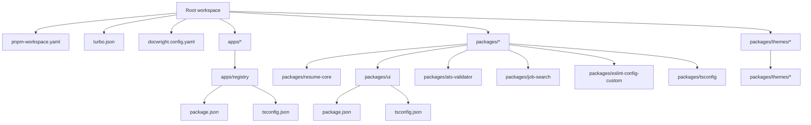
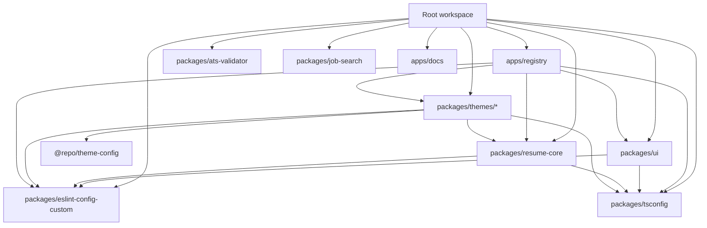

# Repository Structure

This page documents the key configuration, manifest, and metadata files that define the project layout, build orchestration, and package boundaries within the JSON Resume monorepo. It covers the root-level and package-level `package.json` files, TypeScript configuration files, the monorepo workspace definition, and the Docwright documentation configuration. This documentation does not cover source code implementation details or runtime behavior of the application logic.

## Purpose and Scope

This page explains the role and key settings of the main project manifest files (`package.json`), TypeScript configuration (`tsconfig.json`), monorepo workspace (`pnpm-workspace.yaml`), build orchestration (`turbo.json`), and documentation tooling (`docwright.config.yaml`). It clarifies how these files define package boundaries, dependencies, build scripts, and tooling integration across the monorepo.

For details on build orchestration and task execution, see the Turbo Build system documentation. For theme packages and UI component packages, see their respective package manifests and source directories. For the registry app’s runtime configuration, see the `apps/registry/package.json` and `tsconfig.json`.

## Architecture Overview

The repository is structured as a monorepo managed by pnpm and Turbo Build. It contains multiple packages under `packages/` and `packages/themes/`, as well as applications under `apps/`. Each package and app has its own `package.json` defining dependencies, scripts, and exports. TypeScript configuration is layered with base configs extended by app- or package-specific `tsconfig.json` files.

The build and development lifecycle is orchestrated by Turbo Build (`turbo.json`), which defines tasks, caching, and environment variables for the entire monorepo. Documentation generation is configured via Docwright (`docwright.config.yaml`), which scans selected directories and outputs generated MDX content into the docs app.

**Diagram: High-level layout of monorepo configuration files and package boundaries**

Sources: `package.json`, `pnpm-workspace.yaml`, `turbo.json`, `docwright.config.yaml`, `apps/registry/package.json`, `apps/registry/tsconfig.json`, `packages/ui/package.json`, `packages/ui/tsconfig.json`

## Root-Level Package Manifest (`package.json`)

The root `package.json` defines the monorepo’s global scripts, dev dependencies, and core dependencies shared across packages. It is marked private to prevent accidental publishing.

### Key Sections

- **Scripts**: Uses Turbo Build CLI (`turbo run`) to run lifecycle commands (`build`, `dev`, `lint`, `typecheck`, `check`). Also includes formatting commands using Prettier and Husky setup for Git hooks.
- **DevDependencies**: Includes Turbo Build, ESLint, Husky, Playwright, Prettier, Storybook, and TypeScript typings. These tools are used across the monorepo for linting, testing, formatting, and UI component development.
- **Dependencies**: Core runtime dependencies like Next.js, React, React DOM, and dotenv.
- **pnpm.overrides**: Pin specific dependency versions to avoid conflicts or known issues, e.g., Handlebars, UglifyJS, PostCSS, Next.js, Playwright, and Styled Components.

### Interaction

Developers run root-level scripts to orchestrate builds and tests across all packages. The overrides ensure consistent dependency versions across the workspace. The root manifest acts as the entry point for monorepo-wide tooling and dependency management.

## Monorepo Workspace Definition (`pnpm-workspace.yaml`)

This YAML file defines the workspace packages for pnpm. It includes:

- `apps/*` — all applications under the `apps` directory
- `packages/*` — all packages under the `packages` directory
- `packages/themes/*` — all theme packages under `packages/themes`

This configuration enables pnpm to manage dependencies and linking across these directories, facilitating local package resolution and workspace installs.

## Turbo Build Configuration (`turbo.json`)

Turbo Build orchestrates task execution and caching across the monorepo.

### Key Settings

- **globalDependencies**: Watches for changes in environment files matching `**/.env.*local` to invalidate caches.
- **globalEnv**: Lists environment variables that affect task execution, including database URLs, API keys, CI flags, and logging tokens.
- **tasks**: Defines task configurations:
  - `db:generate`: disables caching (likely due to side effects).
  - `build`: depends on upstream builds and caches outputs excluding `.next/cache`.
  - `lint`: inputs include JS/TS files and ESLint configs; outputs cache files.
  - `typecheck`: inputs include TS/JS files and TS configs; outputs TS build info cache.
  - `check`: depends on `lint` and `typecheck`.
  - `test`: inputs include test files and configs; outputs coverage reports.
  - `dev` and `test:e2e`: marked persistent and uncached for live development and end-to-end testing.

### Interaction

Turbo runs these tasks in parallel or sequence as configured, leveraging caching to speed up repeated runs. It ensures consistent environment variables and dependency tracking across packages.

## Docwright Documentation Configuration (`docwright.config.yaml`)

Docwright is configured to generate documentation from source code and metadata.

### Key Settings

- **version**: 1 (Docwright config schema version).
- **codeDir**: `.` — scans the entire repository root.
- **docsDir**: `apps/docs/content/docs` — outputs generated MDX documentation here.
- **provenanceDir**: `.docwright` — stores internal metadata.
- **languages**: JavaScript and TypeScript source files are scanned.
- **ignore**: Extensive ignore patterns exclude node_modules, build artifacts, test files, scripts, environment files, marketing apps, docs app source, and public assets to reduce AI cost and focus on core code.
- **customLensDir**: `.docwright/lenses` — custom lenses for documentation generation.
- **lenses**: Includes `deepwiki` lens for deep-dive documentation style.
- **ai**: Uses OpenAI GPT-4.1-mini model with concurrency 3 for AI-assisted doc generation.
- **validation**: Structural validation enabled.
- **adapter**: Uses `fumadocs` adapter to generate docs for the Fumadocs site with default theme.

### Interaction

Docwright scans the selected source files, applies lenses, and generates structured documentation in MDX format for the docs app. The ignore patterns prevent unnecessary files from inflating AI processing costs.

## Application: Registry App (`apps/registry/package.json` and `tsconfig.json`)

The registry app is a Next.js application with Prisma integration, responsible for the main user-facing registry functionality.

### `package.json`

- **Name and version**: `registry` v1.0.1, marked private.
- **Scripts**:
  - `dev`: runs Next.js development server with webpack.
  - `build`: runs Prisma client generation followed by Next.js production build.
  - `start`: starts Next.js production server.
  - `lint`: runs ESLint with zero warnings allowed and caching.
  - `typecheck`: runs TypeScript type checking without emitting files.
  - `postinstall`: runs Prisma generate with data proxy after install.
  - `db:generate`: manual Prisma generate command.
  - `test`, `test:ui`, `test:coverage`: run Vitest tests with UI and coverage options.
  - `test:e2e`: runs Playwright end-to-end tests.
  - `cleanup:gists`: runs a custom Node script to clean up deleted gists, with dry-run option.
- **Dependencies**: Extensive list including Next.js, React, Prisma client, Supabase helpers, Tailwind CSS, AI SDKs, JSON Resume themes (workspace references), and many UI and utility libraries.
- **DevDependencies**: Babel presets, Playwright, ESLint config, testing libraries, TypeScript, Vitest, and related tooling.

### `tsconfig.json`

- Extends a shared Next.js TypeScript config (`tsconfig/nextjs.json`).
- Adds the Next.js plugin for enhanced support.
- Defines path aliases `~/*` and `@/*` pointing to the root of the app directory.
- Enables strict null checks and skips library type checking for faster builds.
- Includes Next.js environment types, config files, and all TS/JS source files.
- Excludes node_modules, other apps, test files, and Vitest config files.

### Interaction

Developers interact with this app by running the scripts for development, build, linting, testing, and database client generation. The TypeScript config ensures type safety and module resolution aligned with Next.js conventions.

## UI Package (`packages/ui/package.json` and `tsconfig.json`)

The UI package provides shared React components and styles used across apps and themes.

### `package.json`

- Private package named `@repo/ui`.
- Main entry point and types at `src/index.ts`.
- Exports include stylesheets, PostCSS and Tailwind configs, and grouped exports for components and library utilities.
- Scripts include UI component addition via `shadcn-ui`, Storybook development and build.
- Peer dependency on React 18 or 19.
- Dev dependencies include ESLint config, Storybook addons, TypeScript, PostCSS, Tailwind CSS, and testing tools.
- Runtime dependencies include Radix UI primitives, Lucide icons, Next Themes, Sonner notifications, Tailwind utilities, and animation plugins.

### `tsconfig.json`

- Extends a shared React library TypeScript config.
- Defines base URL and path alias `@repo/ui/*` to `src/*`.
- Includes source and Storybook config files.
- Excludes node_modules, dist, and Storybook static output.

### Interaction

This package is developed and tested independently with Storybook. It provides reusable UI components and styles consumed by apps and themes.

## Core Resume Package (`packages/resume-core/package.json`)

The core package defines framework-agnostic resume components, design tokens, primitives, and validators.

### Key Points

- Exports multiple entry points for tokens, primitives, styles, and CSS tokens.
- Scripts for testing, linting, and Storybook development.
- Peer dependencies on React 18 or 19.
- Depends on styled-components for styling primitives.
- Dev dependencies include ESLint config, Storybook, React, TypeScript, Vite, and Vitest.

### Interaction

This package provides the foundational building blocks for resume themes and components, enabling consistent styling and validation.

## ESLint Configuration Package (`packages/eslint-config-custom/package.json`)

This package provides a custom ESLint configuration used across the monorepo.

### Key Points

- Private package named `@repo/eslint-config-custom`.
- Depends on ESLint plugins and configs for Prettier, Turbo, React, and TypeScript.
- Provides multiple config files (`library.js`, `next.js`, `react-internal.js`) for different contexts.
- Includes a lint script to run ESLint.

### Interaction

Packages and apps extend this config to enforce consistent linting rules and code quality standards.

## ATS Validator Package (`packages/ats-validator/package.json`)

This package provides utilities for validating Applicant Tracking System (ATS) compatibility of resume HTML.

### Key Points

- Named `@resume/ats-validator`.
- Exports a module with main entry `src/index.js`.
- Depends on `cheerio` for HTML parsing.
- Dev dependency on Vitest for testing.
- Provides test scripts for running and watching tests.

### Interaction

Used to validate that generated resume HTML meets ATS requirements, ensuring compatibility with job application systems.

## Job Search CLI Package (`packages/job-search/package.json`)

This package implements a CLI tool to search Hacker News jobs matched against a JSON Resume.

### Key Points

- Named `@jsonresume/jobs`.
- Provides CLI binaries `jsonresume-jobs` and `jobs`.
- Depends on AI SDKs, Ink (React-based CLI UI), and React.
- Requires Node.js 18 or higher.
- Published publicly with MIT license.

### Interaction

Users run the CLI to find job listings relevant to their resume, leveraging AI and terminal UI components.

## Theme Configuration Package (`packages/theme-config/package.json`)

This package centralizes shared theme configuration and metadata for JSON Resume themes.

### Key Points

- Named `@repo/theme-config`.
- Exports main module and submodules for metadata and themes.
- Contains lint script.
- Private package with MIT license.

### Interaction

Themes import this package to access shared configuration data and metadata, ensuring consistency across theme implementations.

## Theme Packages (`packages/themes/*/package.json`)

The repository contains numerous JSON Resume theme packages under `packages/themes/` and `packages/themes/stackoverflow`. Each theme package:

- Is named with the prefix `jsonresume-theme-` or `@jsonresume/`.
- Defines a version and description reflecting its design focus and target audience.
- Uses ES module format (`type: module`).
- Declares peer dependencies on React and React DOM (usually versions 18 or 19).
- Depends on `@jsonresume/core` and `styled-components` for core components and styling.
- Provides build scripts using Vite and React plugin.
- Exports source and distribution entry points, typically `src/index.jsx` and `dist/index.js`.
- Includes dev dependencies for Vite, React plugin, and ESLint config.
- Some themes are private, others are public and published.
- Keywords and descriptions indicate the theme’s aesthetic and professional focus (e.g., academic, creative, minimalist, executive).

### Interaction

Themes are independently developed and built, then consumed by the registry app or other tools to render resumes with different visual styles. They share core dependencies and configuration for consistency.

## TypeScript Configuration Packages (`packages/tsconfig/package.json` and others)

The `packages/tsconfig` package provides shared TypeScript configuration presets used by apps and packages.

- Private package with MIT license.
- Extended by app and package `tsconfig.json` files for consistent compiler options.

## Summary of Key Scripts and Build Flow

- Root scripts invoke Turbo Build to run tasks across packages.
- Each package defines its own build, lint, test, and publish scripts.
- The registry app uses Prisma for database client generation and Next.js for SSR.
- Themes use Vite for building React-based resume themes.
- UI package uses Storybook for component development.
- Testing is done with Vitest and Playwright for unit and end-to-end tests.
- Docwright generates documentation from source code with AI assistance.

## Key Relationships

The monorepo is structured to maximize reuse and modularity:

- The root manifest and workspace files define the overall package boundaries and orchestrate builds.
- The registry app depends on UI components, themes, and core packages.
- Themes depend on the core resume package and shared theme configuration.
- The UI package provides reusable components for apps and themes.
- ESLint config and TypeScript config packages provide shared tooling standards.
- The job search and ATS validator packages provide specialized CLI and validation utilities.
- Docwright integrates with the docs app to generate and maintain documentation from source.

**Diagram: Package dependency and build relationships within the monorepo**

Sources: `package.json`, `apps/registry/package.json`, `packages/ui/package.json`, `packages/resume-core/package.json`, `packages/themes/*/package.json`, `packages/eslint-config-custom/package.json`, `packages/tsconfig/package.json`

---

This documentation captures the essential configuration and manifest files that define the repository structure, build orchestration, and package boundaries. It clarifies how the monorepo is organized, how packages relate, and how tooling is configured to maintain consistency and enable scalable development.