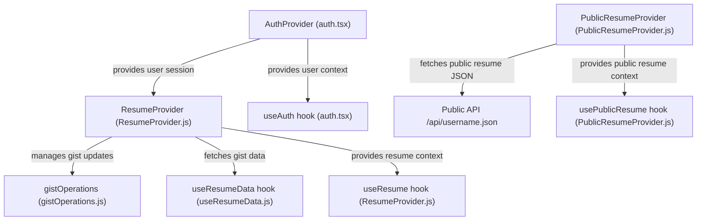
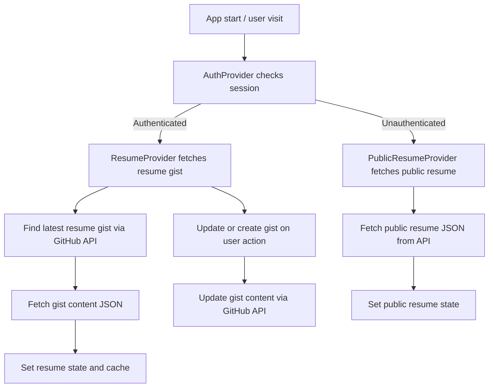
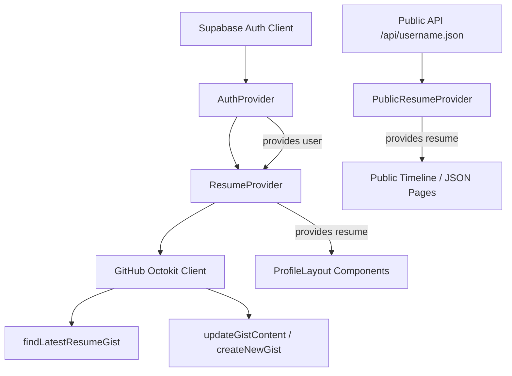
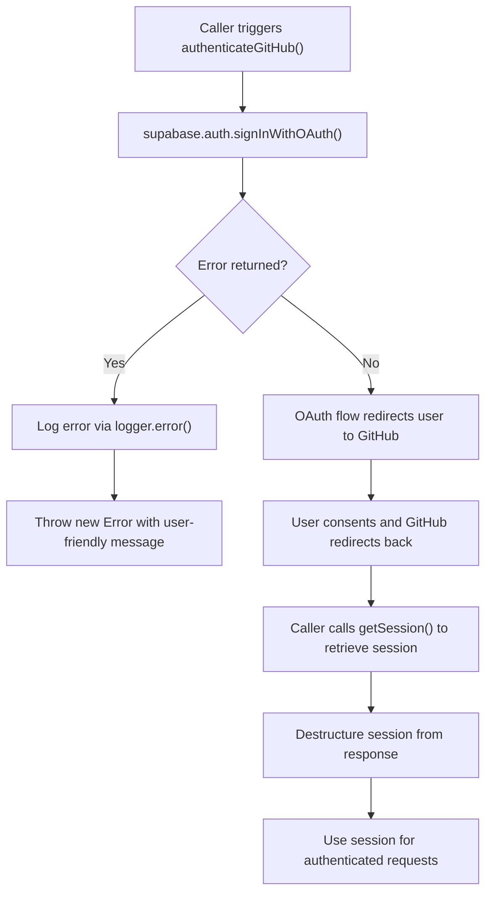

# Core Runtime

The core runtime module manages authentication, session state, and resume data provisioning within the application. It orchestrates user login via GitHub OAuth, maintains session context, and provides mechanisms to fetch, update, and cache resume data stored as GitHub gists. This module supports both authenticated user sessions and public read-only resume views.

## Purpose and Scope

This page documents the core runtime components responsible for authentication, session management, and resume data provisioning. It covers the React context providers for authentication and resume data, GitHub OAuth integration, gist operations for resume storage, and hooks for managing resume state. It does not cover UI components or unrelated application features.

For UI layout and presentation of resumes, see the Profile Layout and Timeline components. For detailed GitHub gist interaction utilities, see the gistOperations and gistFinder modules.

## Architecture Overview

The core runtime consists of three main context providers: `AuthProvider` for authentication state, `ResumeProvider` for authenticated resume data management, and `PublicResumeProvider` for public, unauthenticated resume access. These providers rely on GitHub OAuth via Supabase and GitHub's REST API (Octokit) to fetch and update resume data stored as JSON in GitHub gists.



**Diagram: Core runtime context providers and their interactions with GitHub and public API endpoints**

Sources: `apps/registry/app/context/auth.tsx:7-48`, `apps/registry/app/providers/ResumeProvider.js:14-67`, `apps/registry/app/providers/PublicResumeProvider.js:7-86`, `apps/registry/app/providers/ResumeProviderModule/utils/gistOperations.js:7-82`

---

## Authentication Context

The authentication context manages the current user's session state using Supabase's authentication client, which integrates GitHub OAuth.

| Field | Type | Purpose |
|-------|------|---------|
| `user` | `User \| null` | The authenticated user object from Supabase, or `null` if unauthenticated. `apps/registry/app/context/auth.tsx:7-10` |
| `loading` | `boolean` | Indicates whether the authentication state is still being resolved. `apps/registry/app/context/auth.tsx:7-10` |

### AuthContext

`AuthContext` is a React context initialized with default values: `user` as `null` and `loading` as `true`. It provides authentication state to consuming components.

### AuthProvider

`AuthProvider` is a React component that wraps children with `AuthContext.Provider`, managing authentication state internally.

- **State:**
  - `user` (`User | null`): Tracks the current authenticated user.
  - `loading` (`boolean`): Tracks whether authentication state is being resolved.

- **Lifecycle:**
  - On mount, calls `supabase.auth.getSession()` to retrieve any active session and sets `user` and `loading` accordingly.
  - Subscribes to `supabase.auth.onAuthStateChange` to listen for login/logout events, updating `user` and `loading` in response.
  - Cleans up the subscription on unmount.

- **Returns:** A provider wrapping `children` with the current `user` and `loading` state.

This component ensures that authentication state is globally available and reactive to changes, enabling downstream components to react to login status.

### useAuth

`useAuth` is a hook that returns the current authentication context value from `AuthContext`. It throws if used outside an `AuthProvider`.

Sources: `apps/registry/app/context/auth.tsx:7-48`

---

## Resume Data Provider

The resume data provider manages fetching, caching, and updating resume data stored as GitHub gists for authenticated users.

| Field | Type | Purpose |
|-------|------|---------|
| `resume` | `object \| null` | The current resume data JSON object. `apps/registry/app/providers/ResumeProvider.js:33-34` |
| `gistId` | `string \| null` | The GitHub gist ID associated with the resume. `apps/registry/app/providers/ResumeProvider.js:33-34` |
| `loading` | `boolean` | Indicates if resume data is being fetched or updated. `apps/registry/app/providers/ResumeProvider.js:33-34` |
| `error` | `string \| null` | Error message if fetching or updating fails. `apps/registry/app/providers/ResumeProvider.js:33-34` |
| `username` | `string \| null` | GitHub username associated with the resume. `apps/registry/app/providers/ResumeProvider.js:33-34` |
| `updateGist` | `async function` | Updates the existing gist content with new resume JSON. `apps/registry/app/providers/ResumeProvider.js:36-43` |
| `createGist` | `async function` | Creates a new gist with sample resume data. `apps/registry/app/providers/ResumeProvider.js:45-52` |

### ResumeContext

`ResumeContext` is a React context initialized with default values representing an empty or loading state and no-op async functions for `updateGist` and `createGist`.

### useResume

`useResume` is a hook that returns the current resume context from `ResumeContext`. It throws if used outside a `ResumeProvider`.

### ResumeProvider

`ResumeProvider` is a React component that wraps children with `ResumeContext.Provider`, managing resume data state and operations.

- **Inputs:**
  - `children`: React nodes to render.
  - `targetUsername`: The GitHub username whose resume data should be fetched.

- **Internal state and hooks:**
  - Uses `useResumeData(targetUsername)` to fetch and manage resume data, gist ID, loading, error, and username state.
  - Destructures `resume`, `setResume`, `gistId`, `setGistId`, `loading`, `error`, and `username` from the hook.

- **Methods:**
  - `updateGist(resumeContent)`: Attempts to update the existing gist with new resume JSON content. On failure, logs the error with username context and rethrows.
  - `createGist(sampleResume)`: Attempts to create a new gist with provided sample resume data. On failure, logs the error with username context and rethrows.

- **Context value:**
  - Provides the current resume data, gist ID, loading and error states, username, and the two async methods for gist operations.

- **Returns:**
  - A provider wrapping `children` with the resume context value.

This provider abstracts the complexity of interacting with GitHub gists and session state, exposing a clean API for components to read and update resume data.

Sources: `apps/registry/app/providers/ResumeProvider.js:14-67`, `apps/registry/app/providers/ResumeProviderModule/hooks/useResumeData.js:10-99`, `apps/registry/app/providers/ResumeProviderModule/utils/gistOperations.js:7-82`

---

## Public Resume Provider

The public resume provider fetches resume data from a public API endpoint without requiring authentication. It supports read-only access suitable for public dashboards.

| Field | Type | Purpose |
|-------|------|---------|
| `resume` | `object \| null` | The fetched public resume JSON data. `apps/registry/app/providers/PublicResumeProvider.js:14-22` |
| `loading` | `boolean` | Indicates if the public resume is being fetched. `apps/registry/app/providers/PublicResumeProvider.js:14-22` |
| `error` | `string \| null` | Error message if fetching fails. `apps/registry/app/providers/PublicResumeProvider.js:14-22` |

### PublicResumeContext

`PublicResumeContext` is a React context initialized with default values representing a loading state and no resume data.

### usePublicResume

`usePublicResume` is a hook that returns the current public resume context from `PublicResumeContext`. It throws if used outside a `PublicResumeProvider`.

### PublicResumeProvider

`PublicResumeProvider` is a React component that wraps children with `PublicResumeContext.Provider`, managing public resume fetching.

- **Inputs:**
  - `username`: The GitHub username whose public resume is to be fetched.
  - `children`: React nodes to render.

- **State:**
  - `resume`: Holds the fetched resume data or `null`.
  - `loading`: Tracks fetch progress.
  - `error`: Holds error messages or `null`.

- **Effect:**
  - On mount and whenever `username` or `searchParams` change, triggers `fetchPublicResume`.

- **fetchPublicResume** (async function):
  - Sets `loading` to `true` and clears previous errors.
  - Reads optional `gistname` query parameter from URL search params.
  - Constructs API URL: `/api/{username}.json` optionally with `gistname` query.
  - Fetches the resume JSON from the API.
  - On HTTP 404, throws "Resume not found" error.
  - On other HTTP errors, throws with status text.
  - Parses JSON response and sets `resume`.
  - On error, logs with username and gistname context, sets `error`.
  - Finally, sets `loading` to `false`.

- **Context value:**
  - Provides `resume`, `loading`, and `error`.

- **Returns:**
  - A provider wrapping `children` with the public resume context.

This provider enables unauthenticated components to access resume data safely and reactively, handling loading and error states.

Sources: `apps/registry/app/providers/PublicResumeProvider.js:7-86`

---

## GitHub Authentication Utilities

This module encapsulates GitHub OAuth authentication via Supabase and session retrieval.

### authenticateGitHub

- **Purpose:** Initiates GitHub OAuth sign-in with `gist` scope via Supabase.
- **Behavior:**
  - Calls `supabase.auth.signInWithOAuth` with provider `github`.
  - Requests offline access and consent prompt.
  - On error, logs the failure and throws a user-friendly error.
- **Returns:** A Promise resolving when the OAuth flow is initiated or rejecting on failure.

### getSession

- **Purpose:** Retrieves the current Supabase authentication session.
- **Behavior:**
  - Calls `supabase.auth.getSession()`.
  - Returns the `session` object from the response.
- **Returns:** A Promise resolving to the current session or `null` if none.

These utilities abstract Supabase OAuth details and provide consistent error handling and logging.

Sources: `apps/registry/app/providers/ResumeProviderModule/utils/githubAuth.js:4-33`

---

## GitHub Gist Operations

This module manages creating and updating GitHub gists containing resume JSON data, using Octokit authenticated with the user's GitHub token.

### updateGistContent

- **Purpose:** Updates the content of the user's latest resume gist or creates a new one if none exists.
- **Parameters:**
  - `resumeContent` (string): JSON string of the resume to store.
  - `setGistId` (function): React state setter for gist ID.
  - `setResume` (function): React state setter for resume data.
- **Behavior:**
  - Retrieves current session and GitHub token.
  - If no token, triggers GitHub authentication and returns early.
  - Instantiates Octokit with token.
  - Finds the latest gist ID containing `resume.json` via `findLatestResumeGist`.
  - If found:
    - Updates the gist file `resume.json` with new content.
    - Sets gist ID state.
  - If not found:
    - Creates a new public gist with `resume.json` file.
    - Sets gist ID state.
  - Parses the JSON content and updates resume state.
- **Errors:** Propagates errors from Octokit or authentication.

### createNewGist

- **Purpose:** Creates a new public gist with sample resume data.
- **Parameters:**
  - `sampleResume` (object): Resume data to serialize and store.
  - `setGistId` (function): React state setter for gist ID.
  - `setResume` (function): React state setter for resume data.
- **Behavior:**
  - Retrieves current session and GitHub token.
  - If no token, triggers GitHub authentication and returns early.
  - Instantiates Octokit with token.
  - Creates a new public gist with `resume.json` file containing formatted JSON.
  - Sets gist ID and resume state.
  - Returns gist creation response data.
- **Errors:** Propagates errors from Octokit or authentication.

These functions encapsulate gist lifecycle management, handling token presence, gist discovery, and error logging.

Sources: `apps/registry/app/providers/ResumeProviderModule/utils/gistOperations.js:7-82`

---

## Gist Finder Utility

This utility locates the most recent GitHub gist owned by the authenticated user that contains a `resume.json` file.

### findLatestResumeGist

- **Purpose:** Searches the authenticated user's gists for the most recently updated gist containing `resume.json`.
- **Parameters:**
  - `octokit` (Octokit instance): Authenticated GitHub API client.
- **Behavior:**
  - Lists up to 100 gists sorted by update time descending.
  - Filters gists to find one containing a file named `resume.json` (case-insensitive).
  - Returns the gist ID of the first matching gist.
  - Returns `null` if none found.
- **Logging:** Emits info and debug logs for search start, gist count, and results.

This function supports resume gist discovery for update and fetch operations.

Sources: `apps/registry/app/providers/ResumeProviderModule/utils/gistFinder.js:4-38`

---

## Resume Data Hook

The `useResumeData` hook manages fetching, caching, and state of resume data for an authenticated user.

| Field | Type | Purpose |
|-------|------|---------|
| `resume` | `object \| null` | Current resume JSON data. `apps/registry/app/providers/ResumeProviderModule/hooks/useResumeData.js:11-11` |
| `setResume` | `function` | Setter for resume state. `apps/registry/app/providers/ResumeProviderModule/hooks/useResumeData.js:11-11` |
| `gistId` | `string \| null` | Current gist ID storing the resume. `apps/registry/app/providers/ResumeProviderModule/hooks/useResumeData.js:12-12` |
| `setGistId` | `function` | Setter for gist ID state. `apps/registry/app/providers/ResumeProviderModule/hooks/useResumeData.js:12-12` |
| `loading` | `boolean` | Indicates fetch or update progress. `apps/registry/app/providers/ResumeProviderModule/hooks/useResumeData.js:13-13` |
| `setLoading` | `function` | Setter for loading state. `apps/registry/app/providers/ResumeProviderModule/hooks/useResumeData.js:13-13` |
| `error` | `string \| null` | Error message if fetch fails. `apps/registry/app/providers/ResumeProviderModule/hooks/useResumeData.js:14-14` |
| `setError` | `function` | Setter for error state. `apps/registry/app/providers/ResumeProviderModule/hooks/useResumeData.js:14-14` |
| `username` | `string \| null` | GitHub username associated with the resume. `apps/registry/app/providers/ResumeProviderModule/hooks/useResumeData.js:15-15` |
| `setUsername` | `function` | Setter for username state. `apps/registry/app/providers/ResumeProviderModule/hooks/useResumeData.js:15-15` |

### fetchData (internal async function)

- **Purpose:** Fetches the latest resume gist data for the target username.
- **Behavior:**
  - Returns early if no `targetUsername`.
  - Retrieves current session and GitHub token.
  - Returns early if no token.
  - Compares session username with `targetUsername`; proceeds only if they match.
  - Creates Octokit client with token.
  - Uses `retryWithBackoff` to find the latest gist ID containing `resume.json`.
  - If found, sets gist ID state.
  - Uses `retryWithBackoff` to fetch gist data JSON.
  - Sets resume state, username state, and caches resume locally.
  - Logs errors and sets error state on failure.
  - Sets loading to false on completion.

### Hook behavior

- Runs `fetchData` on mount and whenever `targetUsername` changes.
- Returns state and setters for resume, gist ID, loading, error, and username.

This hook centralizes resume data lifecycle management, including retries, caching, and error handling.

Sources: `apps/registry/app/providers/ResumeProviderModule/hooks/useResumeData.js:10-99`, `apps/registry/app/providers/ResumeProviderModule/hooks/useResumeData/fetchGistData.js:3-20`, `apps/registry/app/providers/ResumeProviderModule/hooks/useResumeData/cacheResume.js:1-10`

---

## Public Resume Fetching

The `fetchPublicResume` function inside `PublicResumeProvider` asynchronously fetches public resume JSON data from the API.

- **Behavior:**
  - Sets loading state to true and clears errors.
  - Reads optional `gistname` query parameter.
  - Constructs API URL with or without `gistname`.
  - Fetches resume JSON from the API.
  - Throws "Resume not found" error on 404.
  - Throws generic error on other HTTP failures.
  - Parses and sets resume state.
  - Logs errors with username and gistname context.
  - Sets error state on failure.
  - Sets loading to false finally.

This function encapsulates public resume retrieval with robust error handling and logging.

Sources: `apps/registry/app/providers/PublicResumeProvider.js:34-68`

---

## Layout Components (Context Consumers)

The `Layout` and `InnerLayout` components in the `[username]/ProfileLayout.js` file consume the `ResumeProvider` context to render the user's profile page.

- `Layout` wraps children with `ResumeProvider` for the target username.
- `InnerLayout` consumes resume context and:
  - Detects if the current page is public (bypasses wrapper).
  - Shows loading or error messages.
  - If no resume, renders `AuthRequired` component.
  - Otherwise, renders profile card, navigation menu, and children.
  - Uses Gravatar fallback for user image if none provided.

These components demonstrate how resume and auth contexts integrate into the UI layer.

Sources: `apps/registry/app/[username]/ProfileLayout.js:12-64`

---

## Timeline and JSON Views (Public Resume Consumers)

The timeline and JSON view pages consume `PublicResumeProvider` context to render public resume data.

- `Timeline` component displays a career timeline using the public resume.
- `JsonView` component renders the raw JSON resume in a read-only Monaco editor.
- Both handle loading, error, and empty states gracefully.
- Both wrap children with `PublicResumeProvider` in their respective layouts.

These components illustrate how public resume data is consumed without authentication.

Sources: `apps/registry/app/[username]/timeline/page.js:13-37`, `apps/registry/app/[username]/json/page.js:13-46`

---

## How It Works

The core runtime orchestrates authentication and resume data provisioning through layered React contexts and GitHub API interactions.



**Diagram: Core runtime flow from authentication to resume data provisioning**

Sources: `apps/registry/app/context/auth.tsx:17-44`, `apps/registry/app/providers/ResumeProvider.js:32-67`, `apps/registry/app/providers/PublicResumeProvider.js:27-86`, `apps/registry/app/providers/ResumeProviderModule/hooks/useResumeData.js:10-99`

### Authentication Flow

- On app load, `AuthProvider` calls Supabase to get the current session.
- It sets `user` and `loading` state accordingly.
- It subscribes to auth state changes to update context reactively.

### Resume Data Flow (Authenticated)

- `ResumeProvider` uses `useResumeData` hook with the target username.
- The hook fetches the current session and checks if the session user matches the target username.
- If matched, it uses Octokit with the GitHub token to find the latest gist containing `resume.json`.
- It fetches the gist content JSON and sets resume state.
- Resume data is cached in localStorage keyed by username.
- `ResumeProvider` exposes methods to update or create gists, which:
  - Check for token presence, triggering GitHub OAuth if missing.
  - Use Octokit to update or create gists.
  - Update React state accordingly.

### Public Resume Flow (Unauthenticated)

- `PublicResumeProvider` fetches resume JSON from a public API endpoint.
- It supports an optional `gistname` query parameter to select a specific gist.
- It manages loading and error states.
- Provides resume data context for public views.

---

## Key Relationships

The core runtime depends on:

- Supabase client for authentication session management.
- GitHub OAuth for user authentication and token acquisition.
- Octokit GitHub REST API client for gist operations.
- React context and hooks for state management and propagation.
- Public API endpoints for unauthenticated resume access.

It is consumed by:

- UI layout components that render user profiles and resumes.
- Public-facing pages that display resumes without authentication.
- Resume editing components that invoke gist update/create operations.



**Relationships between authentication, resume data providers, GitHub API, and UI consumers**

Sources: `apps/registry/app/context/auth.tsx:7-48`, `apps/registry/app/providers/ResumeProvider.js:14-67`, `apps/registry/app/providers/PublicResumeProvider.js:7-86`, `apps/registry/app/providers/ResumeProviderModule/utils/gistOperations.js:7-82`

---

## Symbol Documentation

### AuthContextType (type_alias)

Defines the shape of the authentication context state.

- `user`: The authenticated user object from Supabase or `null` if unauthenticated.
- `loading`: Boolean indicating if authentication state is being resolved.

`apps/registry/app/context/auth.tsx:7-10`

---

### AuthContext (variable)

React context holding authentication state with default values `{ user: null, loading: true }`.

`apps/registry/app/context/auth.tsx:12-15`

---

### AuthProvider (function)

Manages authentication state and provides it via `AuthContext.Provider`.

- **State:**
  - `user`: Authenticated user or `null`.
  - `loading`: Boolean loading flag.
- **Effects:**
  - On mount, fetches current session and sets state.
  - Subscribes to auth state changes to update user and loading.
  - Cleans up subscription on unmount.
- **Returns:** Provider wrapping children with `{ user, loading }`.

`apps/registry/app/context/auth.tsx:17-44`

---

### useAuth (function)

Hook returning the current authentication context value from `AuthContext`.

Throws if used outside an `AuthProvider`.

`apps/registry/app/context/auth.tsx:46-48`

---

### ResumeContext (variable)

React context for resume data with default empty state and no-op async methods.

`apps/registry/app/providers/ResumeProvider.js:14-22`

---

### useResume (function)

Hook returning the current resume context from `ResumeContext`.

Throws if used outside a `ResumeProvider`.

`apps/registry/app/providers/ResumeProvider.js:24-30`

---

### ResumeProvider (function)

Manages resume data state and gist operations for authenticated users.

- Uses `useResumeData` hook to fetch and manage resume state.
- Defines async methods:
  - `updateGist(resumeContent)`: Updates existing gist content.
  - `createGist(sampleResume)`: Creates a new gist with sample data.
- Provides context value with resume data, gist ID, loading, error, username, and methods.
- Wraps children with `ResumeContext.Provider`.

`apps/registry/app/providers/ResumeProvider.js:32-67`

---

### `{ resume, setResume, gistId, setGistId, loading, error, username }` (variable)

Destructured state and setters returned by `useResumeData` hook.

- `resume`: Current resume JSON object or `null`.
- `setResume`: Setter for resume state.
- `gistId`: Current gist ID or `null`.
- `setGistId`: Setter for gist ID.
- `loading`: Loading flag.
- `error`: Error message or `null`.
- `username`: GitHub username or `null`.

`apps/registry/app/providers/ResumeProvider.js:33-34`

---

### updateGist (variable)

Async function to update the user's existing resume gist content.

- Calls `updateGistContent` utility.
- Logs errors with username context.
- Throws errors to caller.

`apps/registry/app/providers/ResumeProvider.js:36-43`

---

### createGist (variable)

Async function to create a new resume gist with sample data.

- Calls `createNewGist` utility.
- Logs errors with username context.
- Throws errors to caller.

`apps/registry/app/providers/ResumeProvider.js:45-52`

---

### value (variable)

Context value object provided by `ResumeProvider` containing:

- `resume`, `gistId`, `loading`, `error`, `username`
- Async methods `updateGist` and `createGist`

`apps/registry/app/providers/ResumeProvider.js:54-62`

---

### PublicResumeContext (variable)

React context for public resume data with default loading state.

`apps/registry/app/providers/PublicResumeProvider.js:7-11`

---

### usePublicResume (function)

Hook returning the current public resume context from `PublicResumeContext`.

Throws if used outside a `PublicResumeProvider`.

`apps/registry/app/providers/PublicResumeProvider.js:13-21`

---

### context (variable)

Context value returned by `useContext` inside `useResume` and `usePublicResume` hooks.

`apps/registry/app/providers/ResumeProvider.js:25-25`, `apps/registry/app/providers/PublicResumeProvider.js:14-14`

---

### PublicResumeProvider (function)

Provides public resume data fetched from API without authentication.

- State: `resume`, `loading`, `error`.
- Uses `useSearchParams` to read optional `gistname` query parameter.
- Defines async `fetchPublicResume` function to fetch resume JSON.
- Effect triggers fetch on `username` or `searchParams` change.
- Provides context value with `resume`, `loading`, and `error`.
- Wraps children with `PublicResumeContext.Provider`.

`apps/registry/app/providers/PublicResumeProvider.js:27-86`

---

### `[resume, setResume]` (variable)

State and setter for public resume data inside `PublicResumeProvider`.

`apps/registry/app/providers/PublicResumeProvider.js:28-28`

---

### `[loading, setLoading]` (variable)

State and setter for loading flag inside `PublicResumeProvider`.

`apps/registry/app/providers/PublicResumeProvider.js:29-29`

---

### `[error, setError]` (variable)

State and setter for error message inside `PublicResumeProvider`.

`apps/registry/app/providers/PublicResumeProvider.js:30-30`

---

### searchParams (variable)

URL search parameters from Next.js `useSearchParams` hook.

`apps/registry/app/providers/PublicResumeProvider.js:31-31`

---

### fetchPublicResume (variable)

Async function fetching public resume JSON from API.

- Reads optional `gistname` query parameter.
- Constructs API URL accordingly.
- Fetches and parses JSON.
- Handles HTTP errors with specific messages.
- Logs errors with context.
- Updates state accordingly.

`apps/registry/app/providers/PublicResumeProvider.js:34-68`

---

### gistname (variable)

Optional gist name query parameter extracted from URL.

`apps/registry/app/providers/PublicResumeProvider.js:39-39`

---

### url (variable)

Constructed API URL for fetching public resume JSON.

`apps/registry/app/providers/PublicResumeProvider.js:40-42`

---

### response (variable)

Fetch response object from API call.

`apps/registry/app/providers/PublicResumeProvider.js:44-44`

---

### data (variable)

Parsed JSON resume data from API response.

`apps/registry/app/providers/PublicResumeProvider.js:53-53`

---

### value (variable)

Context value object provided by `PublicResumeProvider` containing:

- `resume`, `loading`, `error`

`apps/registry/app/providers/PublicResumeProvider.js:75-79`

---

### RESUME_GIST_NAME (variable)

Constant string `'resume.json'` representing the filename used in gists.

`apps/registry/app/providers/ResumeProviderModule/constants.js:1-1`

---

### authenticateGitHub (variable)

Async function initiating GitHub OAuth sign-in via Supabase.

- Requests `gist` scope with offline access and consent prompt.
- Logs and throws on error.

`apps/registry/app/providers/ResumeProviderModule/utils/githubAuth.js:4-26`

---

### `{ error }` (variable)

Error object destructured from Supabase OAuth sign-in response.

`apps/registry/app/providers/ResumeProviderModule/utils/githubAuth.js:6-16`

---

### getSession (variable)

Async function retrieving current Supabase auth session.

- Returns session object or `null`.

`apps/registry/app/providers/ResumeProviderModule/utils/githubAuth.js:28-33`

---

### `{ data: { session } }` (variable)

Destructured session data from Supabase auth response.

`apps/registry/app/providers/ResumeProviderModule/utils/githubAuth.js:29-31`

---

### updateGistContent (variable)

Async function updating or creating a GitHub gist with resume content.

- Retrieves current session and token.
- Authenticates if token missing.
- Uses Octokit to find latest gist.
- Updates gist if found, else creates new gist.
- Updates React state with gist ID and parsed resume.
- Logs operations and errors.

`apps/registry/app/providers/ResumeProviderModule/utils/gistOperations.js:7-59`

---

### currentSession (variable)

Current Supabase session object retrieved inside gist operations.

`apps/registry/app/providers/ResumeProviderModule/utils/gistOperations.js:12-12`

---

### octokit (variable)

Octokit GitHub API client instantiated with user token.

`apps/registry/app/providers/ResumeProviderModule/utils/gistOperations.js:19-19`, `apps/registry/app/providers/ResumeProviderModule/utils/gistOperations.js:69-69`

---

### latestGistId (variable)

ID of the latest resume gist found via gist finder.

`apps/registry/app/providers/ResumeProviderModule/utils/gistOperations.js:20-20`, `apps/registry/app/providers/ResumeProviderModule/utils/gistOperations.js:41-49`

---

### `{ data: newGist }` (variable)

Response data from creating a new gist.

`apps/registry/app/providers/ResumeProviderModule/utils/gistOperations.js:41-49`

---

### updatedResume (variable)

Parsed resume JSON from updated gist content.

`apps/registry/app/providers/ResumeProviderModule/utils/gistOperations.js:57-57`

---

### createNewGist (variable)

Async function creating a new public gist with sample resume data.

- Retrieves current session and token.
- Authenticates if token missing.
- Uses Octokit to create gist with formatted JSON.
- Updates React state with gist ID and resume.
- Returns gist creation response data.

`apps/registry/app/providers/ResumeProviderModule/utils/gistOperations.js:61-82`

---

### `{ data }` (variable)

Response data from gist creation.

`apps/registry/app/providers/ResumeProviderModule/utils/gistOperations.js:70-77`

---

### findLatestResumeGist (variable)

Async function searching for the most recent gist containing `resume.json`.

- Lists user gists sorted by update time.
- Filters for gist with `resume.json` file.
- Returns gist ID or `null`.
- Logs search progress and results.

`apps/registry/app/providers/ResumeProviderModule/utils/gistFinder.js:4-38`

---

### `{ data: gists }` (variable)

List of gists returned from GitHub API.

`apps/registry/app/providers/ResumeProviderModule/utils/gistFinder.js:9-13`

---

### resumeGist (variable)

The gist object containing `resume.json` found in the search.

`apps/registry/app/providers/ResumeProviderModule/utils/gistFinder.js:19-23`

---

### useResumeData (variable)

Hook managing resume data fetching, caching, and state for authenticated users.

- Tracks `resume`, `gistId`, `loading`, `error`, `username`.
- On `targetUsername` change, fetches session and gist data.
- Uses retries with exponential backoff for gist search and fetch.
- Caches resume data locally.
- Handles errors and loading state.

`apps/registry/app/providers/ResumeProviderModule/hooks/useResumeData.js:10-99`

---

### `[gistId, setGistId]` (variable)

State and setter for gist ID inside `useResumeData`.

`apps/registry/app/providers/ResumeProviderModule/hooks/useResumeData.js:12-12`

---

### `[username, setUsername]` (variable)

State and setter for GitHub username inside `useResumeData`.

`apps/registry/app/providers/ResumeProviderModule/hooks/useResumeData.js:15-15`

---

### fetchData (variable)

Internal async function in `useResumeData` that performs the main data fetching logic.

- Checks for `targetUsername`.
- Retrieves current session and token.
- Validates session username matches target.
- Uses Octokit to find latest gist and fetch data with retries.
- Updates state and caches resume.
- Handles errors and loading state.

`apps/registry/app/providers/ResumeProviderModule/hooks/useResumeData.js:18-85`

---

### currentSession (variable)

Current Supabase session inside `fetchData`.

`apps/registry/app/providers/ResumeProviderModule/hooks/useResumeData.js:25-25`

---

### githubUsername (variable)

GitHub username extracted from session metadata.

`apps/registry/app/providers/ResumeProviderModule/hooks/useResumeData.js:32-32`

---

### octokit (variable)

Octokit client instantiated with GitHub token inside `fetchData`.

`apps/registry/app/providers/ResumeProviderModule/hooks/useResumeData.js:35-35`

---

### latestGistId (variable)

ID of the latest resume gist found inside `fetchData`.

`apps/registry/app/providers/ResumeProviderModule/hooks/useResumeData.js:39-42`

---

### resumeData (variable)

Fetched resume JSON data inside `fetchData`.

`apps/registry/app/providers/ResumeProviderModule/hooks/useResumeData.js:52-55`

---

### fetchGistData (variable)

Async function fetching gist JSON content by gist ID using Octokit.

- Finds `resume.json` file in gist.
- Fetches raw URL and parses JSON.
- Throws on fetch failure.

`apps/registry/app/providers/ResumeProviderModule/hooks/useResumeData/fetchGistData.js:3-20`

---

### resumeFile (variable)

The gist file object for `resume.json`.

`apps/registry/app/providers/ResumeProviderModule/hooks/useResumeData/fetchGistData.js:6-8`

---

### response (variable)

Fetch response for raw gist file content.

`apps/registry/app/providers/ResumeProviderModule/hooks/useResumeData/fetchGistData.js:14-14`

---

### cacheResume (variable)

Function caching resume data in `localStorage` keyed by username.

- Stores JSON string with resume, gist ID, and username.

`apps/registry/app/providers/ResumeProviderModule/hooks/useResumeData/cacheResume.js:1-10`

---

### Layout (function)

Top-level layout component wrapping children with `ResumeProvider` for a username.

`apps/registry/app/[username]/ProfileLayout.js:12-20`

---

### InnerLayout (function)

Consumes resume context to render profile layout or fallback UI.

- Detects public pages to bypass wrapper.
- Shows loading, error, or auth-required states.
- Renders profile card, navigation menu, and children.
- Uses Gravatar fallback for user image.

`apps/registry/app/[username]/ProfileLayout.js:22-64`

---

### pathname (variable)

Current URL pathname from Next.js `usePathname` hook.

`apps/registry/app/[username]/ProfileLayout.js:23-23`

---

### `{ resume, loading, error }` (variable)

Resume context values consumed in `InnerLayout`.

`apps/registry/app/[username]/ProfileLayout.js:24-24`

---

### PUBLIC_PAGES (variable)

Array of public page route segments that bypass profile layout.

`apps/registry/app/[username]/ProfileLayout.js:27-27`

---

### isPublicPage (variable)

Boolean indicating if current page is public.

`apps/registry/app/[username]/ProfileLayout.js:28-30`

---

### image (variable)

User image URL from resume or Gravatar fallback.

`apps/registry/app/[username]/ProfileLayout.js:37-39`

---

### Container (variable)

Styled div container used in timeline and JSON pages.

`apps/registry/app/[username]/timeline/page.js:9-11`, `apps/registry/app/[username]/json/page.js:9-11`

---

### Timeline (variable)

Public timeline page component consuming `usePublicResume`.

- Handles loading, error, and empty states.
- Renders `PublicViewBanner` and timeline component.

`apps/registry/app/[username]/timeline/page.js:13-37`

---

### `{ username }` (variable)

Username parameter extracted from route params.

`apps/registry/app/[username]/timeline/page.js:14-14`, `apps/registry/app/[username]/json/page.js:14-14`

---

### TimelineLayout (function)

Layout component wrapping children with `PublicResumeProvider` for timeline pages.

`apps/registry/app/[username]/timeline/layout.js:3-9`

---

### JsonView (variable)

Public JSON resume view component.

- Uses Monaco editor to display read-only JSON.
- Handles loading, error, and empty states.
- Renders `PublicViewBanner`.

`apps/registry/app/[username]/json/page.js:13-46`

---

### JsonLayout (function)

Layout component wrapping children with `PublicResumeProvider` for JSON pages.

`apps/registry/app/[username]/json/layout.js:3-9`

---

### SimpleVerticalTimeline (variable)

Component rendering a vertical career timeline from resume work experiences.

- Maps work experiences to timeline items alternating sides.
- Uses UI components for timeline structure and styling.
- Shows position, dates, summary, and status.

`apps/registry/app/[username]/timeline/Timeline.js:16-63`

---

### workExperiences (variable)

Array of work experience objects from resume.

`apps/registry/app/[username]/timeline/Timeline.js:17-17`

---

### side (variable)

Determines timeline item side ('left' or 'right') based on index parity.

`apps/registry/app/[username]/timeline/Timeline.js:33-33`

---

### opposite (variable)

Opposite side of timeline item for heading placement.

`apps/registry/app/[username]/timeline/Timeline.js:34-34`

## `authenticateGitHub` (variable)

**Purpose**:  
`authenticateGitHub` is an asynchronous function that initiates OAuth authentication with GitHub via Supabase's authentication client. It encapsulates the entire sign-in flow, including scope requests, redirect handling, and error management, ensuring that the application can securely obtain GitHub authorization tokens with offline access.

**Primary file**:  
`apps/registry/app/providers/ResumeProviderModule/utils/githubAuth.js:4-26`

### Detailed Behavior

- Calls `supabase.auth.signInWithOAuth` with the provider set to `'github'`.
- Requests the OAuth scope `'gist'`, which grants access to GitHub Gist API endpoints.
- Sets the `redirectTo` option to the current window origin, ensuring the user returns to the same domain after authentication.
- Passes additional query parameters:
  - `access_type: 'offline'` to request a refresh token for long-lived access.
  - `prompt: 'consent'` to force the user to explicitly consent on each authentication attempt.
- Destructures the `error` property from the response to detect any issues during sign-in.
- Throws the error if present, triggering the catch block.
- In the catch block, logs the error with a structured logger including the error message and an action tag `'github_auth_failed'`.
- Throws a new, user-friendly error message: `'Failed to authenticate with GitHub. Please try again.'`.

### Failure Modes and Edge Cases

- If the Supabase OAuth sign-in call returns an error (e.g., network failure, invalid client configuration, or user denial), the function logs the error and throws a new error to propagate failure upstream.
- The function does not return any value on success; it resolves to `undefined`. The caller must handle the post-authentication state separately.
- The use of `window.location.origin` assumes a browser environment and will fail or behave unexpectedly in non-browser contexts.
- The forced consent prompt ensures fresh user approval but may degrade user experience if called repeatedly.

### Implementation excerpt

```js
export const authenticateGitHub = async () => {
  try {
    const { error } = await supabase.auth.signInWithOAuth({
      provider: 'github',
      options: {
        scopes: 'gist',
        redirectTo: window.location.origin,
        queryParams: {
          access_type: 'offline',
          prompt: 'consent',
        },
      },
    });

    if (error) throw error;
  } catch (error) {
    logger.error(
      { error: error.message, action: 'github_auth_failed' },
      'GitHub authentication error'
    );
    throw new Error('Failed to authenticate with GitHub. Please try again.');
  }
};
```

**Key behaviors:**

- Initiates OAuth sign-in with GitHub requesting `'gist'` scope and offline access. `apps/registry/app/providers/ResumeProviderModule/utils/githubAuth.js:4-20`
- Handles and logs errors with structured metadata for observability. `apps/registry/app/providers/ResumeProviderModule/utils/githubAuth.js:21-26`
- Throws a sanitized error message to avoid leaking internal error details to the user interface. `apps/registry/app/providers/ResumeProviderModule/utils/githubAuth.js:24-26`

---

## `{ error }` (variable)

**Purpose**:  
`error` is a destructured variable capturing the error object returned by the Supabase OAuth sign-in method. It represents any failure encountered during the GitHub authentication attempt.

**Primary file**:  
`apps/registry/app/providers/ResumeProviderModule/utils/githubAuth.js:6-16`

### Role and Usage

- Extracted from the result of `supabase.auth.signInWithOAuth`.
- If `error` is non-null, it indicates that the OAuth sign-in process failed due to reasons such as invalid credentials, network issues, or user cancellation.
- The presence of `error` triggers an immediate throw, transferring control to the catch block for logging and error wrapping.

### Characteristics

- The `error` object includes a `message` property describing the failure reason.
- It is scoped locally within the `try` block of `authenticateGitHub`.
- The variable is not returned or exposed outside the function; it serves only for internal error detection.

**Key behaviors:**

- Captures sign-in failure details from Supabase's OAuth API call. `apps/registry/app/providers/ResumeProviderModule/utils/githubAuth.js:6-16`
- Triggers error handling flow when present. `apps/registry/app/providers/ResumeProviderModule/utils/githubAuth.js:14-16`

---

## `getSession` (variable)

**Purpose**:  
`getSession` is an asynchronous function that retrieves the current authenticated session from Supabase's client. It provides the caller with the session object containing authentication state and user metadata.

**Primary file**:  
`apps/registry/app/providers/ResumeProviderModule/utils/githubAuth.js:28-33`

### Behavior and Return Value

- Calls `supabase.auth.getSession()` which returns a Promise resolving to an object with a `data` property.
- Destructures the nested `session` property from `data`.
- Returns the `session` object, which can be `null` if no active session exists.
- The function returns a Promise resolving to either a session object or `null`.

### Session Object Details

- The session object typically contains:
  - Access token and refresh token.
  - User information such as ID, email, and metadata.
  - Expiration timestamps.
- The exact shape depends on Supabase's authentication schema.

### Edge Cases

- If no user is authenticated, `session` will be `null`.
- The function does not throw; any errors from `getSession()` would propagate as rejected Promises.
- The caller must handle the possibility of a `null` session to avoid runtime errors.

### Implementation excerpt

```js
export const getSession = async () => {
  const {
    data: { session },
  } = await supabase.auth.getSession();
  return session;
};
```

**Key behaviors:**

- Retrieves the current authentication session from Supabase. `apps/registry/app/providers/ResumeProviderModule/utils/githubAuth.js:28-33`
- Returns `null` if no session exists, signaling unauthenticated state. `apps/registry/app/providers/ResumeProviderModule/utils/githubAuth.js:29-31`

---

## `{ data: { session } }` (variable)

**Purpose**:  
This destructured variable extracts the `session` property nested inside the `data` object returned by `supabase.auth.getSession()`. It isolates the active authentication session for further use.

**Primary file**:  
`apps/registry/app/providers/ResumeProviderModule/utils/githubAuth.js:29-31`

### Role in Authentication Flow

- Represents the core authentication state returned by Supabase.
- Used internally by `getSession` to simplify access to the session object.
- The nested destructuring pattern reflects the structure of Supabase's response:
  - The top-level object contains a `data` property.
  - `data` contains the `session` property.
- This pattern avoids intermediate variables and clarifies the expected response shape.

### Characteristics

- `session` can be an object or `null`.
- The destructuring assumes the presence of `data` and `session` keys; if the API changes, this pattern will throw.
- This variable is scoped locally within `getSession`.

### Example of the destructuring pattern

```js
const {
  data: { session },
} = await supabase.auth.getSession();
```

This extracts `session` directly from the nested `data` object returned by the Supabase client.

**Key behaviors:**

- Extracts the active session from the Supabase response payload. `apps/registry/app/providers/ResumeProviderModule/utils/githubAuth.js:29-31`
- Enables `getSession` to return the session object directly without exposing the full response structure. `apps/registry/app/providers/ResumeProviderModule/utils/githubAuth.js:29-33`

---

## How It Works: GitHub Authentication Flow



**Diagram: End-to-end flow of GitHub OAuth authentication and session retrieval**

Sources: `apps/registry/app/providers/ResumeProviderModule/utils/githubAuth.js:4-33`

---