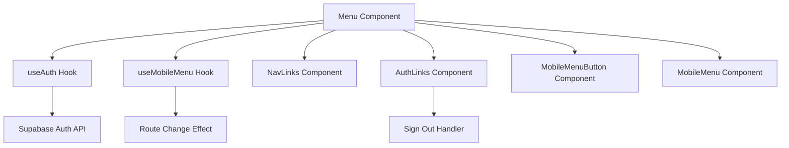
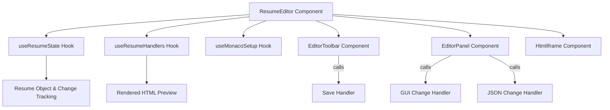
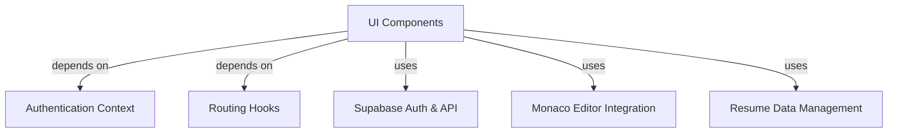

# UI Components

The UI Components module provides reusable interface elements and hooks that compose the application's navigation menus, resume editor, and AI chat editor. These components manage user authentication state, responsive menu toggling, resume editing modes, and chat interactions, integrating with external services and internal state management hooks.

## Purpose and Scope

This page documents the internal mechanisms of the UI components responsible for rendering and managing the application interface, including navigation menus, authentication links, the resume editor, and AI chat editor components. It covers the hooks and components that handle state, user interaction, and rendering logic for these UI elements.

It does not cover backend services, API implementations, or unrelated UI components outside the navigation and resume editing scope. For authentication logic details, see the Authentication subsystem. For resume data management, see the Resume Data Handling page.

## Architecture Overview

The UI Components subsystem orchestrates user interface elements through a layered structure of hooks and components. The `Menu` component serves as the entry point for navigation, leveraging hooks like `useAuth` for user state and `useMobileMenu` for responsive menu toggling. Navigation links and authentication links are rendered via dedicated components `NavLinks` and `AuthLinks`. The `ResumeEditor` component manages the editing interface, coordinating state via `useResumeState` and change handlers via `useResumeHandlers`. These components interact with Monaco editor setup and rendering components.

```mermaid
flowchart TD
    Menu["Menu Component"] -->|uses| useAuth["useAuth Hook"]
    Menu -->|uses| useMobileMenu["useMobileMenu Hook"]
    Menu --> NavLinks["NavLinks Component"]
    Menu --> AuthLinks["AuthLinks Component"]
    Menu --> MobileMenuButton["MobileMenuButton Component"]
    Menu --> MobileMenu["MobileMenu Component"]

    ResumeEditor["ResumeEditor Component"] --> useResumeState["useResumeState Hook"]
    ResumeEditor --> useResumeHandlers["useResumeHandlers Hook"]
    ResumeEditor --> EditorToolbar["EditorToolbar Component"]
    ResumeEditor --> EditorPanel["EditorPanel Component"]
    ResumeEditor --> HtmlIframe["HtmlIframe Component"]
    ResumeEditor --> useMonacoSetup["useMonacoSetup Hook"]
```

**Diagram: Component and hook relationships within the UI Components subsystem**

Sources: `apps/registry/app/components/Menu.js:12-49`, `apps/registry/app/components/MenuModule/hooks/useAuth.js:9-49`, `apps/registry/app/components/MenuModule/hooks/useMobileMenu.js:8-18`, `apps/registry/app/components/MenuModule/components/NavLinks.js:7-35`, `apps/registry/app/components/MenuModule/components/AuthLinks.js:11-52`, `apps/registry/app/components/ResumeEditor.js:14-74`, `apps/registry/app/components/ResumeEditorModule/hooks/useResumeState.js:5-45`, `apps/registry/app/components/ResumeEditorModule/hooks/useResumeHandlers.js:6-82`

## Menu Component and Navigation

### Purpose

The `Menu` component manages the top-level navigation bar, including user authentication links and responsive mobile menu toggling.

### Primary files

- `apps/registry/app/components/Menu.js:12-49`
- `apps/registry/app/components/MenuModule/hooks/useAuth.js:9-49`
- `apps/registry/app/components/MenuModule/hooks/useMobileMenu.js:8-18`
- `apps/registry/app/components/MenuModule/components/NavLinks.js:7-35`
- `apps/registry/app/components/MenuModule/components/AuthLinks.js:11-52`

### Key behaviors

- The `Menu` component uses the `useAuth` hook to obtain the current user and sign-out handler, and `useMobileMenu` to manage the mobile menu's open state. It hides itself on the `/pathways` route. `apps/registry/app/components/Menu.js:12-49`
- `useAuth` provides user authentication state and a `handleSignOut` function that signs out the user via Supabase and redirects to the login page. It fetches session and subscription data on mount. `apps/registry/app/components/MenuModule/hooks/useAuth.js:9-49`
- `useMobileMenu` maintains a boolean `isOpen` state for the mobile menu, automatically closing the menu when the route changes. `apps/registry/app/components/MenuModule/hooks/useMobileMenu.js:8-18`
- `NavLinks` renders navigation links from a predefined list, supporting both internal and external links with appropriate anchor or router link components. Each link includes an icon and label. `apps/registry/app/components/MenuModule/components/NavLinks.js:7-35`
- `AuthLinks` renders authentication-related links conditionally based on user presence. If no user is logged in, it shows a GitHub sign-in button. If logged in, it shows user-specific links and a sign-out button. `apps/registry/app/components/MenuModule/components/AuthLinks.js:11-52`

### How It Works

The `Menu` component initializes by calling `useAuth` to retrieve the current user and sign-out handler, and `useMobileMenu` to get the mobile menu state and toggle function. It reads the current pathname to conditionally hide the menu on specific routes.

The component renders a container with a `Logo` component, desktop navigation links via `NavLinks`, and authentication links via `AuthLinks`. The mobile menu button toggles the `isOpen` state, which controls the visibility of the `MobileMenu` component.

When the pathname changes, `useMobileMenu` resets `isOpen` to false, closing the mobile menu automatically. The sign-out button in `AuthLinks` triggers the `handleSignOut` function from `useAuth`, which signs out the user and redirects to the login page.

**Flow of data and control in the Menu component and related hooks**

Sources: `apps/registry/app/components/Menu.js:12-49`, `apps/registry/app/components/MenuModule/hooks/useAuth.js:9-49`, `apps/registry/app/components/MenuModule/hooks/useMobileMenu.js:8-18`, `apps/registry/app/components/MenuModule/components/NavLinks.js:7-35`, `apps/registry/app/components/MenuModule/components/AuthLinks.js:11-52`

## Resume Editor

### Purpose

The `ResumeEditor` component provides a dual-mode interface for editing a resume, supporting both GUI and JSON editing modes, with live preview and save functionality.

### Primary files

- `apps/registry/app/components/ResumeEditor.js:14-74`
- `apps/registry/app/components/ResumeEditorModule/hooks/useResumeState.js:5-45`
- `apps/registry/app/components/ResumeEditorModule/hooks/useResumeHandlers.js:6-82`

### Data structures

| Field           | Type       | Purpose                                                                                      |
|-----------------|------------|----------------------------------------------------------------------------------------------|
| `resume`        | `object`   | Current resume state, parsed from initial input or default resume. `apps/registry/app/components/ResumeEditorModule/hooks/useResumeState.js:6-16`  |
| `originalResume`| `string`   | JSON string of the original resume for change detection. `apps/registry/app/components/ResumeEditorModule/hooks/useResumeState.js:18-28`           |
| `hasChanges`    | `boolean`  | Flag indicating if the current resume differs from the original. `useResumeState.js:30`      |
| `content`       | `string`   | HTML string rendered from the resume for live preview. `useResumeHandlers.js:20`             |

### Key behaviors

- `useResumeState` initializes the resume state from a string or object, falling back to a default resume on parse errors, and tracks whether changes have been made compared to the original. `apps/registry/app/components/ResumeEditorModule/hooks/useResumeState.js:5-45`
- `useResumeHandlers` manages the rendered HTML preview of the resume and provides callbacks for applying changes from GUI or JSON editors. It logs debug information and handles JSON parsing errors gracefully. `apps/registry/app/components/ResumeEditorModule/hooks/useResumeHandlers.js:6-82`
- `ResumeEditor` coordinates editor mode state, saving state, and integrates Monaco editor setup. It renders the toolbar, editor panel, and live HTML preview iframe side-by-side. `apps/registry/app/components/ResumeEditor.js:14-74`
- The save handler serializes the current resume to JSON and calls an external `updateGist` function to persist changes, updating the original resume state and resetting the change flag on success. Errors are logged with user context. `apps/registry/app/components/ResumeEditor.js:33-45`

### How It Works

On initialization, `ResumeEditor` calls `useResumeState` with the initial resume data, which parses and stores the resume object and its original JSON string, setting a change flag if they differ. It also sets up Monaco editor integration via `useMonacoSetup`.

`useResumeHandlers` watches the resume state and renders it to HTML for preview. It exposes handlers for changes from the GUI editor (`handleGuiChange`), JSON editor (`handleJsonChange`), and applying batched changes (`handleApplyChanges`).

The component renders an `EditorToolbar` with controls for switching editor modes and saving. The main area splits into two panels: the editor panel on the left, which switches between GUI and JSON modes, and the live HTML preview on the right rendered inside an iframe.

When the user triggers save, the resume is serialized and passed to `updateGist`. On success, the original resume state is updated and the change flag cleared. Errors during save or parsing are logged with user context.

**Data flow and component interactions in the ResumeEditor**

Sources: `apps/registry/app/components/ResumeEditor.js:14-74`, `apps/registry/app/components/ResumeEditorModule/hooks/useResumeState.js:5-45`, `apps/registry/app/components/ResumeEditorModule/hooks/useResumeHandlers.js:6-82`

## Key Relationships

The UI Components subsystem depends on authentication context and routing hooks to manage user state and navigation. It integrates with external services like Supabase for authentication and gist updates for resume persistence. The resume editor components depend on Monaco editor integration and internal resume state hooks for data management and rendering.

**Subsystem dependencies and integration points**

Sources: `apps/registry/app/components/MenuModule/hooks/useAuth.js:9-49`, `apps/registry/app/components/ResumeEditor.js:14-74`