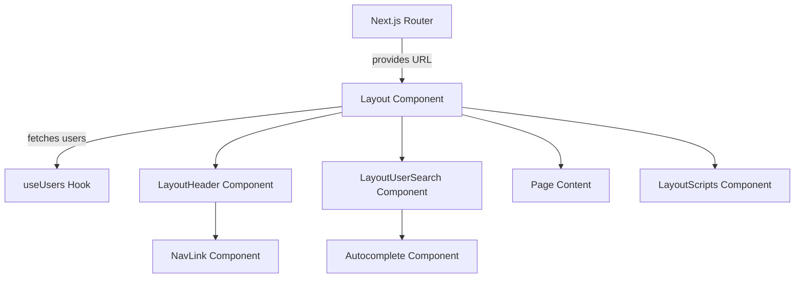
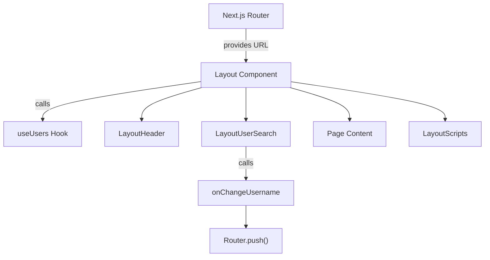
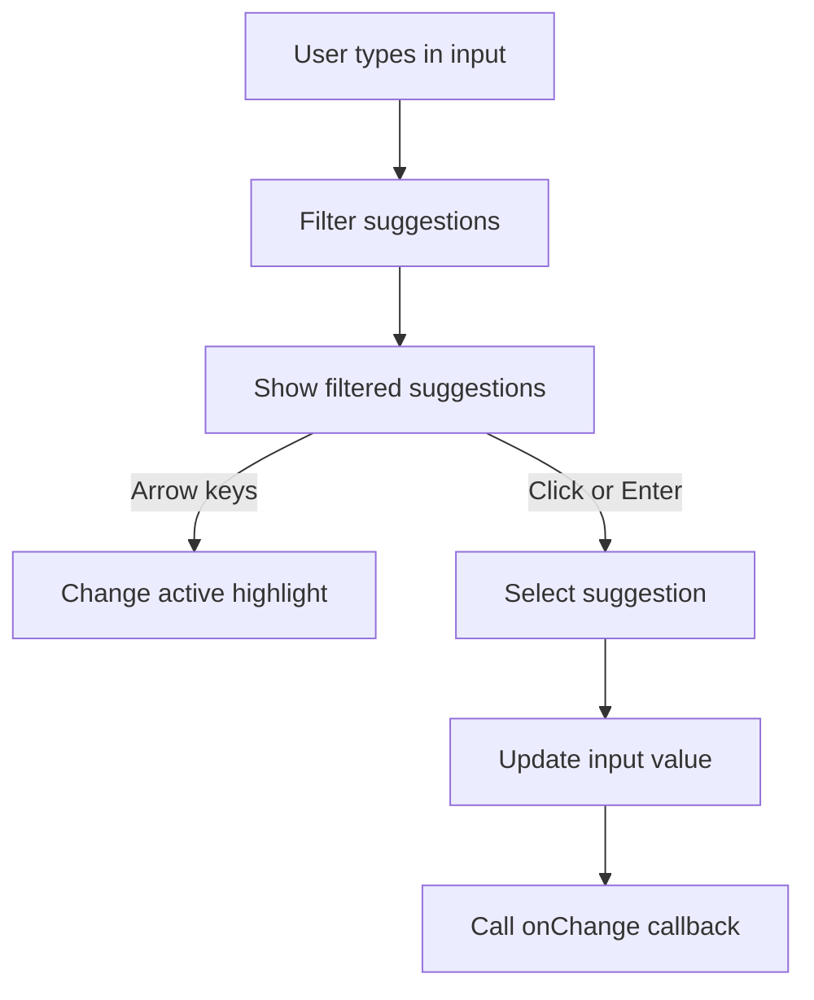
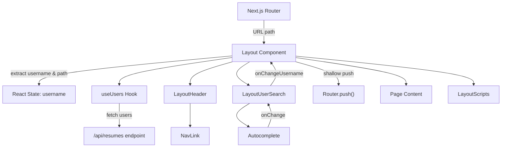
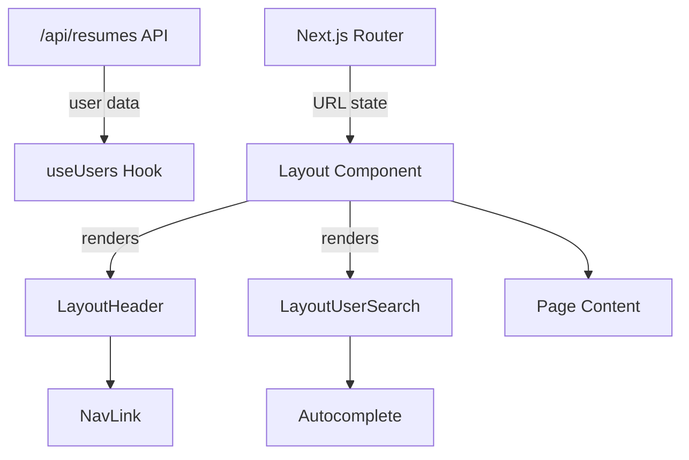

# Layout and Navigation

This module implements the layout components and navigation user interface for the application, including the page structure, header, user search, and embedded scripts. It manages user context via URL routing and provides interactive elements such as autocomplete user selection and navigation links. The components coordinate to render a consistent UI framework around dynamic page content.

## Purpose and Scope

This page documents the layout and navigation UI components responsible for rendering the page header, user selection, navigation links, and page content container. It covers the main `Layout` component and its subcomponents: `LayoutHeader`, `LayoutUserSearch`, and `LayoutScripts`. It also details the supporting hooks and UI primitives like `Autocomplete` and `NavLink`.

This page does not cover unrelated UI components such as `Hero`, `Dropdown`, or `ButtonGroup`, nor does it document styling details beyond their role in layout components.

For routing and URL management, see the Router and Navigation page. For autocomplete input behavior, see the Autocomplete UI page.

## Architecture Overview

The layout and navigation subsystem orchestrates user context extraction from the URL, user list fetching, and rendering of header and user search UI. The main `Layout` component acts as the root container, embedding the header, user search, page content, and scripts.



**Diagram: Component relationships and data flow in layout and navigation UI**

Sources: `apps/registry/src/ui/Layout.js:9-46`, `apps/registry/src/ui/Layout/LayoutHeader.jsx:4-18`, `apps/registry/src/ui/Layout/LayoutUserSearch.jsx:5-26`, `apps/registry/src/ui/Layout/LayoutScripts.jsx:3-31`, `apps/registry/src/ui/Layout/useUsers.js:3-16`

---

## Layout Component

The `Layout` component is the root UI container that manages page structure, user context, and navigation state. It extracts the current username and page path from the URL, fetches the list of users, and renders the header, user search, and page content accordingly.

**Primary file:** `apps/registry/src/ui/Layout.js:9-46`

| Field / Variable | Type | Purpose |
|------------------|------|---------|
| `router` | `NextRouter` | Provides current URL and routing utilities via `useRouter()`. `apps/registry/src/ui/Layout.js:10` |
| `parts` | `string[]` | URL path segments split by `/`, used to extract username and page path. `apps/registry/src/ui/Layout.js:11` |
| `path` | `string` | The second URL segment after username, indicating the current page (e.g., "jobs"). `apps/registry/src/ui/Layout.js:12` |
| `[username, setUsername]` | `[string, function]` | React state holding the current username extracted from the URL. `apps/registry/src/ui/Layout.js:13` |
| `users` | `Array<{username: string}>` | List of user objects fetched from the API via `useUsers` hook. `apps/registry/src/ui/Layout.js:15` |
| `onChangeUsername` | `function` | Callback to update the username in state and push a shallow route change to update the URL accordingly. `apps/registry/src/ui/Layout.js:17-26` |

### Key behaviors

- Extracts username and page path from the URL using Next.js router's `asPath` split by `/`. The username is the first segment after the root, and the page path is the second segment. `apps/registry/src/ui/Layout.js:10-13`
- Maintains `username` as React state initialized from the URL, allowing controlled updates via `onChangeUsername`. `apps/registry/src/ui/Layout.js:13-14`
- Fetches the list of users asynchronously using the `useUsers` hook, which performs an API call to `/api/resumes`. `apps/registry/src/ui/Layout.js:15`, `apps/registry/src/ui/Layout/useUsers.js:3-16`
- The `onChangeUsername` callback triggers a shallow route push to update the URL path to `/${value}/${path}`, preserving the current page but changing the username context. It also updates the local `username` state. `apps/registry/src/ui/Layout.js:17-26`
- Renders the layout structure with a fixed header containing `LayoutHeader` and `LayoutUserSearch`, the main content area for children, and the `LayoutScripts` component for analytics and global styles. `apps/registry/src/ui/Layout.js:28-45`

### How It Works

1. On mount, `Layout` reads the current URL path from `router.asPath` and splits it into segments.
2. It extracts the username and page path from these segments and initializes React state for `username`.
3. The `useUsers` hook fetches the list of users asynchronously and returns it.
4. The `LayoutHeader` receives the current `username` to render navigation links scoped to that user.
5. The `LayoutUserSearch` receives the current `username`, the list of `users`, and the `onChangeUsername` callback to allow changing the user context.
6. When the user selects a different username via `LayoutUserSearch`, `onChangeUsername` updates the URL with a shallow push and updates the local state.
7. The main page content is rendered inside the `Content` styled container.
8. `LayoutScripts` injects analytics scripts and global CSS styles.



**Execution flow through the Layout component and its subcomponents**

Sources: `apps/registry/src/ui/Layout.js:9-46`, `apps/registry/src/ui/Layout/useUsers.js:3-16`

---

## useUsers Hook

The `useUsers` hook encapsulates fetching the list of users from the `/api/resumes` endpoint and exposing it as React state.

**Primary file:** `apps/registry/src/ui/Layout/useUsers.js:3-16`

| Field / Variable | Type | Purpose |
|------------------|------|---------|
| `[users, setUsers]` | `[Array, function]` | React state holding the array of user objects fetched from the API. `apps/registry/src/ui/Layout/useUsers.js:4` |
| `fetchUsers` | `async function` | Asynchronous function that fetches user data from `/api/resumes` and updates state. `apps/registry/src/ui/Layout/useUsers.js:7-11` |
| `response` | `Response` | The fetch API response object from the `/api/resumes` request. `apps/registry/src/ui/Layout/useUsers.js:8` |
| `data` | `Array` | Parsed JSON data from the API response, representing user objects. `apps/registry/src/ui/Layout/useUsers.js:9` |

### Key behaviors

- Initializes `users` state as an empty array. `apps/registry/src/ui/Layout/useUsers.js:4`
- On component mount, triggers `fetchUsers` asynchronously to fetch user data from `/api/resumes`. `apps/registry/src/ui/Layout/useUsers.js:6-14`
- Parses the JSON response and updates `users` state with the data. `apps/registry/src/ui/Layout/useUsers.js:8-10`
- Returns the current `users` state to the caller.

Sources: `apps/registry/src/ui/Layout/useUsers.js:3-16`

---

## LayoutHeader Component

`LayoutHeader` renders the fixed header bar containing the site logo and navigation links scoped to the current username.

**Primary file:** `apps/registry/src/ui/Layout/LayoutHeader.jsx:4-18`

| Prop | Type | Purpose |
|------|------|---------|
| `username` | `string` | The current username used to build navigation link URLs. `apps/registry/src/ui/Layout/LayoutHeader.jsx:4-18` |

### Key behaviors

- Renders a clickable logo linking to the external JSON Resume website. `apps/registry/src/ui/Layout/LayoutHeader.jsx:7-10`
- Renders navigation links for "Jobs", "Interview", "Letter", and "Suggestions" pages, each scoped under the current username path (e.g., `/${username}/jobs`). `apps/registry/src/ui/Layout/LayoutHeader.jsx:11-17`
- Uses the `NavLink` component to render links with active state styling based on the current route.

Sources: `apps/registry/src/ui/Layout/LayoutHeader.jsx:4-18`

---

## LayoutUserSearch Component

`LayoutUserSearch` provides a user selection interface with autocomplete and quick links to view the selected user's resume or raw JSON.

**Primary file:** `apps/registry/src/ui/Layout/LayoutUserSearch.jsx:5-26`

| Prop | Type | Purpose |
|------|------|---------|
| `username` | `string` | The current username displayed and used as the default value in the autocomplete input. `apps/registry/src/ui/Layout/LayoutUserSearch.jsx:5-26` |
| `users` | `Array<{username: string}>` | The list of users used as suggestions in the autocomplete input. `apps/registry/src/ui/Layout/LayoutUserSearch.jsx:5-26` |
| `onChangeUsername` | `function` | Callback invoked when the username selection changes. `apps/registry/src/ui/Layout/LayoutUserSearch.jsx:5-26` |

### Key behaviors

- Displays a label "Using the resume of" followed by an autocomplete input for selecting usernames. `apps/registry/src/ui/Layout/LayoutUserSearch.jsx:9-15`
- The autocomplete input is pre-populated with the current `username` and uses the `users` list to provide suggestions. `apps/registry/src/ui/Layout/LayoutUserSearch.jsx:14-19`
- Provides two navigation links: one to view the rendered resume page (`/${username}`) and one to view the raw JSON resume (`/${username}.json`). `apps/registry/src/ui/Layout/LayoutUserSearch.jsx:20-25`
- The autocomplete component calls `onChangeUsername` when the user selects a different username, triggering URL and state updates upstream.

Sources: `apps/registry/src/ui/Layout/LayoutUserSearch.jsx:5-26`

---

## LayoutScripts Component

`LayoutScripts` injects third-party analytics scripts and global CSS styles into the page.

**Primary file:** `apps/registry/src/ui/Layout/LayoutScripts.jsx:3-31`

### Key behaviors

- Asynchronously loads the Clicky analytics script with a specific data ID. `apps/registry/src/ui/Layout/LayoutScripts.jsx:5-10`
- Provides a `<noscript>` fallback with a 1x1 pixel tracking image for users with JavaScript disabled. `apps/registry/src/ui/Layout/LayoutScripts.jsx:11-19`
- Injects global CSS styles to reset body margin and padding, set background color, and apply a default font family. `apps/registry/src/ui/Layout/LayoutScripts.jsx:20-30`

Sources: `apps/registry/src/ui/Layout/LayoutScripts.jsx:3-31`

---

## NavLink Component

`NavLink` is a styled wrapper around Next.js `Link` that applies active styling based on the current route.

**Primary file:** `apps/registry/src/ui/NavLink.js:5-32`

| Variable | Type | Purpose |
|----------|------|---------|
| `LinkElement` | `styled.a` | Styled anchor element with color and hover styles, and bold font when active. `apps/registry/src/ui/NavLink.js:5-20` |
| `{ asPath }` | `string` | Current URL path from Next.js router. `apps/registry/src/ui/NavLink.js:23` |
| `path` | `string` | Extracted second segment of the current path for active link comparison. `apps/registry/src/ui/NavLink.js:24` |
| `slugPath` | `string` | Extracted second segment of the `href` prop for comparison. `apps/registry/src/ui/NavLink.js:25` |
| `ariaCurrent` | `string|undefined` | Set to `"page"` if the link matches the current path segment, otherwise undefined. `apps/registry/src/ui/NavLink.js:26` |
| `NavLink` | `function` | Component rendering a Next.js `Link` with `LinkElement` styled anchor and active state. `apps/registry/src/ui/NavLink.js:22-32` |

### Key behaviors

- Uses Next.js `useRouter` to access the current path and determine if the link is active by comparing the second path segment. `apps/registry/src/ui/NavLink.js:23-26`
- Applies `aria-current="page"` attribute and bold font weight to the active link for accessibility and visual indication. `apps/registry/src/ui/NavLink.js:26-31`
- Styles links with no underline, black color by default, and red on hover. `apps/registry/src/ui/NavLink.js:5-20`

Sources: `apps/registry/src/ui/NavLink.js:5-32`

---

## Autocomplete Component

`Autocomplete` is a controlled input component that provides filtered suggestions from a list and supports keyboard and mouse selection.

**Primary file:** `apps/registry/src/ui/Autocomplete.js:45-125`

| State Variable | Type | Purpose |
|----------------|------|---------|
| `[active, setActive]` | `number` | Index of the currently highlighted suggestion in the filtered list. `apps/registry/src/ui/Autocomplete.js:46` |
| `[filtered, setFiltered]` | `string[]` | List of suggestions filtered based on the current input value. `apps/registry/src/ui/Autocomplete.js:47` |
| `[isShow, setIsShow]` | `boolean` | Flag indicating whether the suggestion list is visible. `apps/registry/src/ui/Autocomplete.js:48` |
| `[input, setInput]` | `string` | Current value of the input field. `apps/registry/src/ui/Autocomplete.js:49` |

| Method | Purpose |
|--------|---------|
| `onChangeInput` | Updates input value, filters suggestions case-insensitively, resets active index, and shows suggestions. `apps/registry/src/ui/Autocomplete.js:51-60` |
| `onClick` | Handles click on a suggestion, sets input to selected value, hides suggestions, and calls `onChange` callback. `apps/registry/src/ui/Autocomplete.js:62-67` |
| `onChooseValue` | Sets input value and calls external `onChange` callback with the selected value. `apps/registry/src/ui/Autocomplete.js:69-72` |
| `onKeyDown` | Handles keyboard navigation: Enter selects current suggestion, Up/Down arrows move active highlight. `apps/registry/src/ui/Autocomplete.js:74-84` |
| `renderAutocomplete` | Renders the suggestion list or "Not found" message based on filtered results and visibility state. `apps/registry/src/ui/Autocomplete.js:86-113` |

### Key behaviors

- Filters suggestions dynamically as the user types, matching substrings case-insensitively. `apps/registry/src/ui/Autocomplete.js:51-55`
- Supports keyboard navigation with arrow keys and selection with Enter key. `apps/registry/src/ui/Autocomplete.js:74-84`
- Highlights the active suggestion visually and updates highlight on mouse hover and keyboard navigation. `apps/registry/src/ui/Autocomplete.js:86-113`
- Calls the external `onChange` callback whenever a new value is selected, either by click or keyboard. `apps/registry/src/ui/Autocomplete.js:69-72`
- Displays a "Not found" message when no suggestions match the input. `apps/registry/src/ui/Autocomplete.js:106-111`

### Styling

- The container positions the suggestions absolutely below the input.
- Suggestions are styled with borders, hover background color changes, and bold font for the active item.



**Flow of user interaction and internal state updates in Autocomplete**

Sources: `apps/registry/src/ui/Autocomplete.js:45-125`

---

## Button Component

The `Button` component is a styled button element with primary red styling, hover effects, and disabled state styling.

**Primary file:** `apps/registry/src/ui/Button.js:3-40`

| Styled Element | Purpose |
|----------------|---------|
| `Button` | Styled button with red background, white text, rounded corners, and hover transitions. Disabled state grays out the button and disables pointer events. `apps/registry/src/ui/Button.js:3-30` |

| Component | Purpose |
|-----------|---------|
| `Component` | Functional component wrapping the styled `Button`, forwarding `children`, `disabled`, and `onClick` props. `apps/registry/src/ui/Button.js:32-40` |

### Key behaviors

- Applies a red background with white text and rounded corners by default. `apps/registry/src/ui/Button.js:3-30`
- On hover, darkens the background color with a smooth transition. `apps/registry/src/ui/Button.js:10-18`
- When disabled, changes background and border to gray, disables pointer events, and changes cursor to default. `apps/registry/src/ui/Button.js:20-28`
- The component forwards `disabled` and `onClick` props to the underlying button element. `apps/registry/src/ui/Button.js:32-40`

Sources: `apps/registry/src/ui/Button.js:3-40`

---

## Styled Layout Containers

The layout uses styled-components to define structural containers and style the header, user search, links, and content areas.

**Primary file:** `apps/registry/src/ui/Layout/styles.js:3-88`

| Styled Component | Purpose |
|------------------|---------|
| `Container` | Root container wrapping the entire layout. `apps/registry/src/ui/Layout/styles.js:3` |
| `Header` | Fixed header bar with yellow background, full width, and height 80px. Contains header content. `apps/registry/src/ui/Layout/styles.js:36-44` |
| `HeaderContainer` | Flex container inside header for logo and navigation links, max width 800px, horizontally spaced. `apps/registry/src/ui/Layout/styles.js:5-15` |
| `Logo` | Styled anchor for the site logo with no underline and hover color change. `apps/registry/src/ui/Layout/styles.js:46-59` |
| `Links` | Flex container for navigation links spaced evenly, width 300px. `apps/registry/src/ui/Layout/styles.js:61-73` |
| `UserSearchContainer` | Full width container with white background for the user search area. `apps/registry/src/ui/Layout/styles.js:17-20` |
| `UserSearch` | Flex container for user search input and links, max width 800px, spaced horizontally. `apps/registry/src/ui/Layout/styles.js:22-34` |
| `UserSelect` | Inline-block container with margin and padding wrapping the autocomplete input, fixed width 140px. `apps/registry/src/ui/Layout/styles.js:82-88` |
| `Content` | Main content container with max width 800px, centered, with top margin and padding. `apps/registry/src/ui/Layout/styles.js:75-80` |

Sources: `apps/registry/src/ui/Layout/styles.js:3-88`

---

## How It Works: Layout and Navigation Flow

The layout and navigation subsystem begins with the Next.js router providing the current URL path. The `Layout` component parses this path to extract the username and page segment, initializing state accordingly. It then invokes the `useUsers` hook to asynchronously fetch the list of users from the backend API.

The `Layout` renders the fixed header via `LayoutHeader`, passing the current username to generate navigation links scoped to that user. Below the header, `LayoutUserSearch` renders an autocomplete input populated with usernames from the fetched user list. This component allows switching the user context, which triggers a shallow route update and state change in `Layout`.

The main page content is rendered inside a styled container below the header. The `LayoutScripts` component injects analytics scripts and global CSS styles to the page.

The `Autocomplete` component inside `LayoutUserSearch` manages input state, filters suggestions dynamically, and supports keyboard and mouse selection. It calls back to `LayoutUserSearch`, which propagates the username change to `Layout`, triggering a URL update and re-render of the navigation links.

Navigation links use the `NavLink` component, which compares the current route segment to the link target to apply active styling and accessibility attributes.



**Data and control flow through layout and navigation components**

Sources: `apps/registry/src/ui/Layout.js:9-46`, `apps/registry/src/ui/Layout/useUsers.js:3-16`, `apps/registry/src/ui/Layout/LayoutHeader.jsx:4-18`, `apps/registry/src/ui/Layout/LayoutUserSearch.jsx:5-26`, `apps/registry/src/ui/Autocomplete.js:45-125`

---

## Key Relationships

The layout and navigation subsystem depends on Next.js routing (`useRouter`, `Router.push`) to extract and update URL state. It depends on the backend API `/api/resumes` to fetch the list of users for autocomplete suggestions.

It provides the UI framework for all pages by wrapping page content with consistent header, user selection, and navigation links. The `Layout` component is the root wrapper for all page components in the registry app.

The `Autocomplete` component is a reusable UI primitive used by `LayoutUserSearch` but can be used elsewhere for any filtered input selection.

The `NavLink` component is a styled wrapper around Next.js `Link` that provides active link styling and accessibility attributes, used by `LayoutHeader` for navigation.



**Subsystem dependencies and dependents**

Sources: `apps/registry/src/ui/Layout.js:9-46`, `apps/registry/src/ui/Layout/useUsers.js:3-16`, `apps/registry/src/ui/NavLink.js:5-32`, `apps/registry/src/ui/Autocomplete.js:45-125`

## `Label`

`Label` is a styled React component defined using the `styled-components` library. It encapsulates the styling for a standard HTML `<label>` element, providing consistent typography and spacing for form labels across the UI.

**Purpose**: To provide a reusable, styled label element with preset font size, color, weight, margin, and display properties, ensuring visual consistency and accessibility in form layouts.

**Primary file**: `apps/registry/src/ui/Label.js:3-9`

| Field       | Type     | Purpose                                                                                  |
|-------------|----------|------------------------------------------------------------------------------------------|
| font-size   | CSS px   | Sets the font size to 16 pixels for readability and UI consistency.                      |
| color       | CSS hex  | Applies a medium gray color `#555` to the label text for subtle emphasis.                |
| font-weight | CSS int  | Uses `bold` weight to distinguish the label from other text elements.                    |
| margin-bottom | CSS px | Adds 10 pixels of space below the label to separate it visually from the input element.  |
| display     | CSS prop | Sets to `block` to ensure the label occupies full width and stacks vertically with inputs.|

**How It Works**:  
`Label` is a styled-component wrapping the native `<label>` tag. When rendered, it applies the CSS rules defined in the template literal, overriding default browser styles. This component is intended to be used wherever a form label is required, ensuring uniform appearance without inline styles or separate CSS files.

**Example usage**:
```jsx
import Label from './Label';

<Label htmlFor="username">Username</Label>
<input id="username" type="text" />
```

**Key behaviors:**
- Applies consistent font styling and spacing to labels. `apps/registry/src/ui/Label.js:3-9`
- Uses block display to align labels vertically above inputs. `apps/registry/src/ui/Label.js:3-9`

Sources: `apps/registry/src/ui/Label.js:3-9`

---

## `newFilteredSuggestions`

`newFilteredSuggestions` is a local variable within the `onChangeInput` event handler of the `Autocomplete` component. It represents the subset of suggestions filtered based on the current user input.

**Purpose**: To hold the filtered list of suggestions that match the user's input, enabling dynamic autocomplete dropdown updates.

**Primary file**: `apps/registry/src/ui/Autocomplete.js:53-55`

**How It Works**:  
When the input value changes, `onChangeInput` captures the new input string and filters the `suggestions` prop array. The filtering is case-insensitive and includes any suggestion containing the input substring. This filtered array is assigned to `newFilteredSuggestions`, which is then used to update the component state `filtered`.

```js
const newFilteredSuggestions = suggestions.filter(
  (suggestion) => suggestion.toLowerCase().indexOf(input.toLowerCase()) > -1
);
```

This filtering approach allows partial matches anywhere in the suggestion string, not just prefix matches. It ensures that the autocomplete dropdown reflects relevant options as the user types.

**Tradeoffs and Edge Cases**:
- The filtering is linear and case-insensitive, which is efficient for small to moderate suggestion lists but could degrade performance with very large arrays.
- Suggestions that contain the input substring anywhere are included, which may produce unexpected matches if suggestions are long or complex.
- Empty input results in no filtering (empty string matches all), but the dropdown only shows when `input` is non-empty and `isShow` is true.

**Key behaviors:**
- Filters suggestions on every input change to update the dropdown options. `apps/registry/src/ui/Autocomplete.js:53-55`
- Performs case-insensitive substring matching. `apps/registry/src/ui/Autocomplete.js:53-55`

Sources: `apps/registry/src/ui/Autocomplete.js:51-60`

---

## `className`

`className` is a local variable used inside the `renderAutocomplete` function of the `Autocomplete` component. It determines the CSS class applied to each suggestion list item (`<li>`) to visually indicate the currently active (highlighted) suggestion.

**Purpose**: To conditionally assign the `'active'` CSS class to the suggestion item that matches the current keyboard navigation index, enabling visual highlighting.

**Primary file**: `apps/registry/src/ui/Autocomplete.js:92-92`

**How It Works**:  
Within the `renderAutocomplete` function, the component maps over the filtered suggestions array. For each suggestion, it compares the current index with the `active` state index. If they match, `className` is set to `'active'`; otherwise, it remains undefined (no class).

```js
let className;
if (index === active) {
  className = 'active';
}
```

This `className` is then applied to the `<li>` element, which triggers CSS styles defined in the `Container` styled component to highlight the active suggestion with a dark gray background and bold font weight.

**CSS Behavior**:
- `.autocomplete > .active` and `.autocomplete li:hover` share styles that highlight the item.
- The active class is essential for keyboard navigation feedback.

**Edge Cases**:
- If `active` is out of bounds (e.g., negative or beyond filtered length), no item receives the active class.
- The variable is reset on each render, ensuring only one item is highlighted at a time.

**Key behaviors:**
- Assigns `'active'` class to the suggestion matching the current keyboard navigation index. `apps/registry/src/ui/Autocomplete.js:92-92`
- Enables visual feedback for keyboard and mouse hover states. `apps/registry/src/ui/Autocomplete.js:4-43`

Sources: `apps/registry/src/ui/Autocomplete.js:86-113`