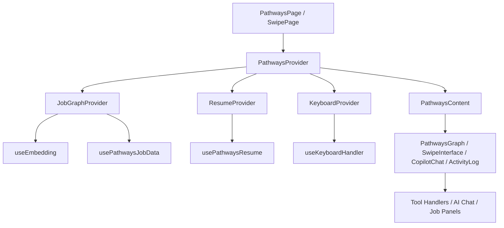
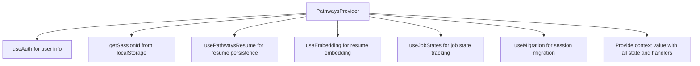
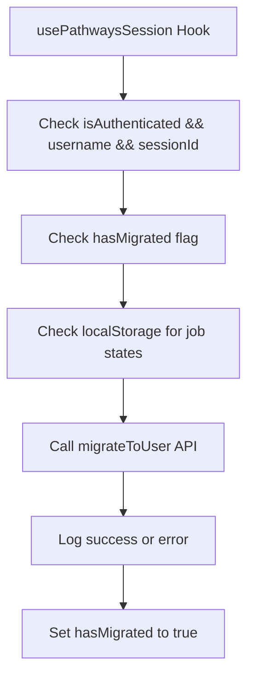
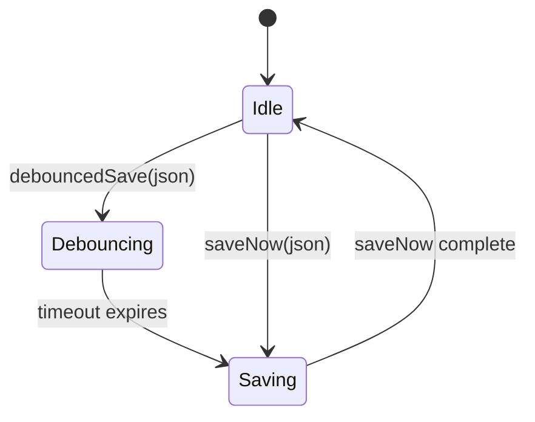
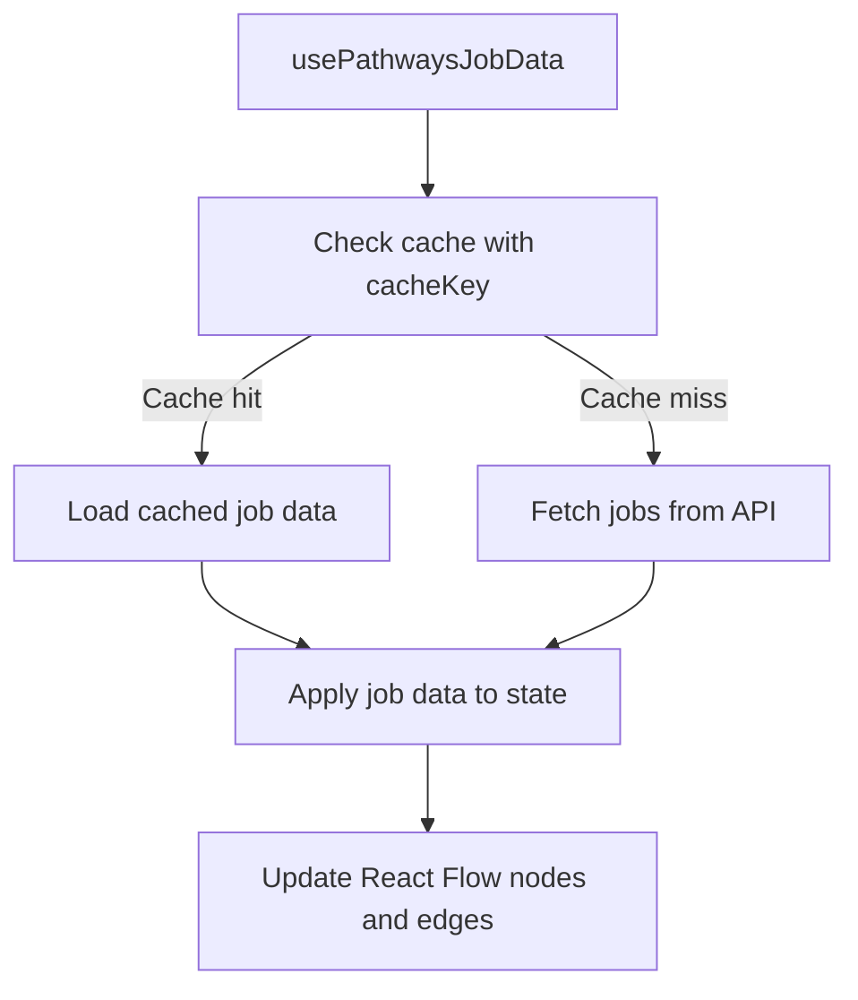
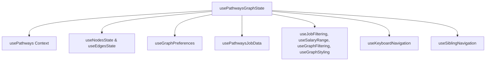
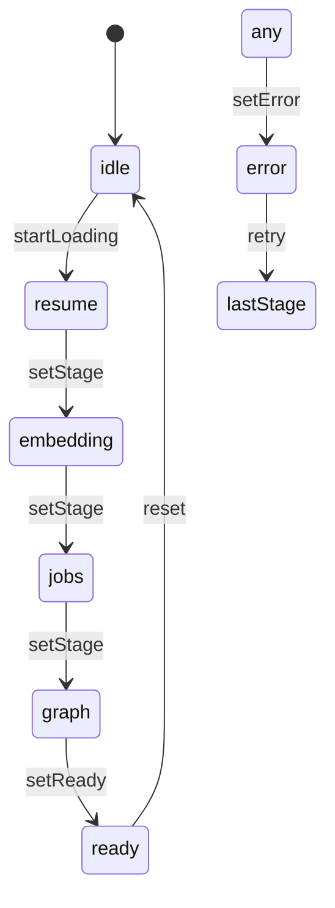
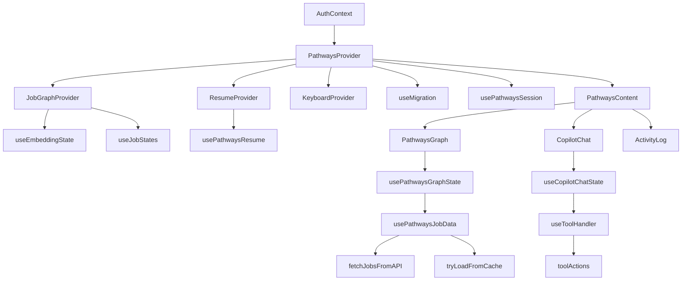

# Pathways Subsystem

The Pathways subsystem implements the core logic, context providers, hooks, components, and services that power the Pathways feature. It orchestrates resume management, job matching, AI-powered chat, and user interaction within the career exploration interface. This subsystem handles data persistence, embedding generation, job graph construction, user session migration, and UI state management.

## Purpose and Scope

This page documents the internal architecture and key mechanisms of the Pathways subsystem, including context providers, hooks, UI components, and service integrations. It covers how user resumes are loaded, saved, and embedded; how job data is fetched and filtered; how AI chat and voice features are integrated; and how user sessions and migrations are managed.

It does not cover the underlying AI models, external API implementations, or unrelated UI components outside the Pathways feature. For authentication and session management, see the Auth subsystem. For job graph visualization details, see the Job Graph subsystem. For AI chat internals, see the Copilot Chat subsystem.

## Architecture Overview

The Pathways subsystem composes multiple React contexts—ResumeContext, JobGraphContext, KeyboardContext—wrapped by a combined `PathwaysProvider`. This provider manages user session state, resume persistence, embedding generation, job state tracking, and keyboard navigation.

The main UI entry points are `PathwaysPage` and `SwipePage`, which mount the provider and render either the graph-based or swipe-based job exploration interfaces. The `PathwaysContent` component manages tab navigation and mobile view toggling.

Hooks like `usePathwaysResume`, `useEmbedding`, `usePathwaysJobData`, and `useCopilotChatState` encapsulate asynchronous data fetching, caching, and state synchronization. Tool handlers process AI-invoked commands to update resumes or job states.



**Diagram: High-level component and context relationships in the Pathways subsystem**

Sources: `apps/registry/app/pathways/page.js:1-14`, `apps/registry/app/pathways/context/PathwaysContext.js:21-144`, `apps/registry/app/pathways/Pathways.js:7-137`

---

## PathwaysPage

**Purpose:** Entry point React component that initializes the Pathways feature by mounting the `PathwaysProvider` and rendering the main `Pathways` UI along with a toast notification system.

- Wraps children with `PathwaysProvider` to supply context.
- Renders the `Pathways` component which contains the main UI.
- Includes a `Toaster` positioned at bottom-right for user notifications.

```jsx
export default function PathwaysPage() {
  return (
    <PathwaysProvider>
      <Pathways />
      <Toaster position="bottom-right" richColors closeButton />
    </PathwaysProvider>
  );
}
```

Sources: `apps/registry/app/pathways/page.js:7-14`

---

## TABS

**Purpose:** Defines the tab navigation structure for the main Pathways UI.

- Array of tab objects with `key` and `label`.
- Tabs: Graph, Feedback, Preview, Resume.

| Field | Type | Purpose |
|-------|------|---------|
| key | `string` | Unique identifier for the tab. `apps/registry/app/pathways/Pathways.js:15-20` |
| label | `string` | Display label for the tab. `apps/registry/app/pathways/Pathways.js:15-20` |

Sources: `apps/registry/app/pathways/Pathways.js:15-20`

---

## PathwaysContent

**Purpose:** Main UI component managing tab state, mobile view toggling, and rendering the appropriate content for each tab.

- Manages internal state:
  - `activeTab` (string): currently selected tab key.
  - `mobileView` (string): toggles between 'main' workspace and 'chat' on mobile.
  - `isActivityOpen` (boolean): controls visibility of the activity log panel.
- Consumes Pathways context for resume data, user/session IDs, and resume saving state.
- Uses `useResumeSave` hook for debounced saving and pending change tracking.
- Calls `usePathwaysSession` to handle session migration on authentication.
- Renders tab content dynamically via `renderTab` function.
- Layout adapts for mobile with toggle buttons for workspace/chat.
- Includes `PathwaysHeader`, `CopilotChat`, and `ActivityLog` components.

### State Variables

| Variable | Type | Description | Location |
|----------|------|-------------|----------|
| activeTab | `string` | Currently active tab key. Defaults to 'graph'. | `apps/registry/app/pathways/Pathways.js:23` |
| setActiveTab | `function` | Setter for `activeTab`. | `apps/registry/app/pathways/Pathways.js:23` |
| mobileView | `string` | Mobile view mode, either 'main' or 'chat'. Defaults to 'main'. | `apps/registry/app/pathways/Pathways.js:24` |
| setMobileView | `function` | Setter for `mobileView`. | `apps/registry/app/pathways/Pathways.js:24` |
| isActivityOpen | `boolean` | Whether the activity log panel is open. | `apps/registry/app/pathways/Pathways.js:25` |
| setIsActivityOpen | `function` | Setter for `isActivityOpen`. | `apps/registry/app/pathways/Pathways.js:25` |

### Context Values (from `usePathways`)

| Property | Type | Description | Location |
|----------|------|-------------|----------|
| resume | `object` | Current resume data object. | `apps/registry/app/pathways/Pathways.js:27-37` |
| resumeJson | `string` | JSON string representation of the resume. | `apps/registry/app/pathways/Pathways.js:27-37` |
| updateResume | `function` | Updates resume object locally. | `apps/registry/app/pathways/Pathways.js:27-37` |
| updateResumeJson | `function` | Updates resume JSON string and parses it. | `apps/registry/app/pathways/Pathways.js:27-37` |
| setResumeJson | `function` | Setter for `resumeJson`. | `apps/registry/app/pathways/Pathways.js:27-37` |
| setFullResume | `function` | Replaces the entire resume and persists. | `apps/registry/app/pathways/Pathways.js:27-37` |
| isResumeSaving | `boolean` | Indicates if resume save is in progress. | `apps/registry/app/pathways/Pathways.js:27-37` |
| userId | `string|null` | Current user ID or null if anonymous. | `apps/registry/app/pathways/Pathways.js:27-37` |
| sessionId | `string|null` | Current session ID for anonymous users. | `apps/registry/app/pathways/Pathways.js:27-37` |

### Resume Save Hook

| Property | Type | Description | Location |
|----------|------|-------------|----------|
| hasPendingChanges | `boolean` | Whether there are unsaved changes. | `apps/registry/app/pathways/Pathways.js:39-43` |
| debouncedSave | `function` | Debounced function to save resume JSON. | `apps/registry/app/pathways/Pathways.js:39-43` |

### renderTab Function

Renders the content for the active tab:

- `'graph'` → `<PathwaysGraph />`
- `'feedback'` → `<FeedbackHistory />`
- `'preview'` → `<ResumePreview resumeData={resume} />`
- `'resume'` → `<ResumeEditorTab />` with props for editing and saving resume JSON.

### Layout

- Header with `PathwaysHeader` and activity open handler.
- Mobile toggle buttons for switching between workspace and chat views.
- Main section with tab navigation and tab content.
- Sidebar with `CopilotChat` for chat interface.
- `ActivityLog` panel controlled by `isActivityOpen`.

```mermaid
flowchart TD
  A[PathwaysContent] --> B[usePathways Context]
  A --> C[useResumeSave Hook]
  A --> D[usePathwaysSession Hook]
  A --> E[PathwaysHeader]
  A --> F[Tab Navigation]
  F -->|activeTab| G[renderTab()]
  G -->|graph| H[PathwaysGraph]
  G -->|feedback| I[FeedbackHistory]
  G -->|preview| J[ResumePreview]
  G -->|resume| K[ResumeEditorTab]
  A --> L[Mobile View Toggle]
  A --> M[CopilotChat]
  A --> N[ActivityLog]
```

**Diagram: Component and hook interactions within PathwaysContent**

**Key behaviors:**
- Tracks active tab and mobile view state to conditionally render UI sections. `apps/registry/app/pathways/Pathways.js:22-137`
- Uses `usePathways` context to access resume data, user/session IDs, and resume saving state. `apps/registry/app/pathways/Pathways.js:27-37`
- Debounces resume JSON saves to reduce API calls while typing. `apps/registry/app/pathways/Pathways.js:39-43`
- Handles session migration on authentication via `usePathwaysSession`. `apps/registry/app/pathways/Pathways.js:23-25`
- Provides chat interface alongside main workspace with responsive layout. `apps/registry/app/pathways/Pathways.js:50-137`

Sources: `apps/registry/app/pathways/Pathways.js:22-137`

---

## PathwaysContext and PathwaysProvider

**Purpose:** React context and provider that centralize Pathways state including user session, resume persistence, embedding management, job states, and migration.

- Provides a single context `PathwaysContext` for all Pathways consumers.
- Tracks user authentication state and session ID.
- Manages resume loading, saving, and local updates via `usePathwaysResume`.
- Generates and caches resume embeddings via `useEmbedding`.
- Tracks job states (read, interested, hidden) via `useJobStates`.
- Supports migration of anonymous session data to authenticated user via `useMigration`.
- Exposes functions to update resume, prompt job feedback, and clear pending feedback.
- Bundles all state and handlers into a `value` object passed to context consumers.

### Context Properties

| Property | Type | Purpose | Location |
|----------|------|---------|----------|
| sessionId | `string|null` | Current session ID for anonymous users. | `apps/registry/app/pathways/context/PathwaysContext.js:29` |
| userId | `string|null` | Authenticated user ID or null. | `apps/registry/app/pathways/context/PathwaysContext.js:25` |
| isAuthenticated | `boolean` | Whether user is authenticated. | `apps/registry/app/pathways/context/PathwaysContext.js:27` |
| username | `string|null` | Authenticated username or null. | `apps/registry/app/pathways/context/PathwaysContext.js:26` |
| resume | `object` | Current resume data, fallback to sample if none. | `apps/registry/app/pathways/context/PathwaysContext.js:48-49` |
| resumeJson | `string` | JSON string of resume for editor. | `apps/registry/app/pathways/context/PathwaysContext.js:50-52` |
| isResumeLoading | `boolean` | Loading state for resume fetch. | `apps/registry/app/pathways/context/PathwaysContext.js:37-45` |
| isResumeSaving | `boolean` | Saving state for resume updates. | `apps/registry/app/pathways/context/PathwaysContext.js:37-45` |
| updateResume | `function` | Update resume locally and JSON string. | `apps/registry/app/pathways/context/PathwaysContext.js:82-88` |
| updateResumeJson | `function` | Update resume JSON string and parse. | `apps/registry/app/pathways/context/PathwaysContext.js:91-102` |
| saveResumeChanges | `function` | Persist resume changes to backend. | `apps/registry/app/pathways/context/PathwaysContext.js:37-45` |
| applyAndSave | `function` | Apply diff locally and save. | `apps/registry/app/pathways/context/PathwaysContext.js:37-45` |
| setFullResume | `function` | Replace full resume and save. | `apps/registry/app/pathways/context/PathwaysContext.js:37-45` |
| embedding | `number[]|null` | Resume embedding vector. | `apps/registry/app/pathways/context/PathwaysContext.js:61-68` |
| isEmbeddingLoading | `boolean` | Embedding generation loading state. | `apps/registry/app/pathways/context/PathwaysContext.js:61-68` |
| embeddingStage | `string` | Current embedding generation stage. | `apps/registry/app/pathways/context/PathwaysContext.js:61-68` |
| graphVersion | `number` | Version counter to trigger graph refresh. | `apps/registry/app/pathways/context/PathwaysContext.js:61-68` |
| refreshEmbedding | `function` | Force refresh embedding generation. | `apps/registry/app/pathways/context/PathwaysContext.js:61-68` |
| triggerGraphRefresh | `function` | Increment graph version to refresh graph. | `apps/registry/app/pathways/context/PathwaysContext.js:61-68` |
| jobStates | `Record<string,string>` | Map of job IDs to their states. | `apps/registry/app/pathways/context/PathwaysContext.js:37-45` |
| markAsRead | `function` | Mark a job as read. | `apps/registry/app/pathways/context/PathwaysContext.js:37-45` |
| markAsInterested | `function` | Mark a job as interested. | `apps/registry/app/pathways/context/PathwaysContext.js:37-45` |
| markAsHidden | `function` | Mark a job as hidden. | `apps/registry/app/pathways/context/PathwaysContext.js:37-45` |
| clearJobState | `function` | Clear job state. | `apps/registry/app/pathways/context/PathwaysContext.js:37-45` |
| getJobState | `function` | Get current state of a job. | `apps/registry/app/pathways/context/PathwaysContext.js:37-45` |
| isRead | `function` | Check if job is marked read. | `apps/registry/app/pathways/context/PathwaysContext.js:37-45` |
| isInterested | `function` | Check if job is marked interested. | `apps/registry/app/pathways/context/PathwaysContext.js:37-45` |
| isHidden | `function` | Check if job is marked hidden. | `apps/registry/app/pathways/context/PathwaysContext.js:37-45` |
| readJobIds | `Set<string>` | Set of job IDs marked read. | `apps/registry/app/pathways/context/PathwaysContext.js:37-45` |
| interestedJobIds | `Set<string>` | Set of job IDs marked interested. | `apps/registry/app/pathways/context/PathwaysContext.js:37-45` |
| hiddenJobIds | `Set<string>` | Set of job IDs marked hidden. | `apps/registry/app/pathways/context/PathwaysContext.js:37-45` |
| migrateToUser | `function` | Migrate anonymous session data to user account. | `apps/registry/app/pathways/context/PathwaysContext.js:79-79` |
| pendingJobFeedback | `object|null` | Pending job feedback to prompt user. | `apps/registry/app/pathways/context/PathwaysContext.js:30-30` |
| promptJobFeedback | `function` | Set pending job feedback. | `apps/registry/app/pathways/context/PathwaysContext.js:104-106` |
| clearPendingJobFeedback | `function` | Clear pending job feedback. | `apps/registry/app/pathways/context/PathwaysContext.js:108-110` |

### Provider Behavior

- Initializes session ID from localStorage on mount.
- Loads resume from backend or falls back to sample resume.
- Serializes resume to JSON string for editor.
- Updates resume locally and persists changes asynchronously.
- Generates and caches semantic embedding for resume.
- Tracks job states and provides mutation functions.
- Supports migration of local job states to authenticated user.
- Bundles all state and handlers into a single context value.



**Diagram: PathwaysProvider internal composition and data sources**

**Key behaviors:**
- Loads or generates session ID for anonymous users and tracks authenticated user info. `apps/registry/app/pathways/context/PathwaysContext.js:21-144`
- Loads resume data from backend, falling back to a sample resume if none exists. `apps/registry/app/pathways/context/PathwaysContext.js:37-52`
- Generates semantic embedding for the resume, caching results to optimize performance. `apps/registry/app/pathways/context/PathwaysContext.js:61-68`
- Tracks job states (read, interested, hidden) and exposes mutation functions. `apps/registry/app/pathways/context/PathwaysContext.js:37-45`
- Supports migrating anonymous session job states to authenticated user accounts. `apps/registry/app/pathways/context/PathwaysContext.js:79-79`

Sources: `apps/registry/app/pathways/context/PathwaysContext.js:21-144`

---

## SAMPLE_RESUME

**Purpose:** Provides a default resume data object used as a fallback for anonymous users or when no resume is loaded.

- Contains typical JSON Resume fields: basics, work, education, skills.
- Includes example data for a fictional full-stack developer "Jane Doe".
- Used to initialize resume state when no user data is available.

### Structure Overview

| Field | Type | Description | Location |
|-------|------|-------------|----------|
| basics | `object` | Basic personal info: name, label, email, phone, URL, location, summary, profiles. | `apps/registry/app/pathways/context/sampleResume.js:3-40` |
| work | `array` | List of work experiences with company, position, dates, summary, highlights. | `apps/registry/app/pathways/context/sampleResume.js:41-60` |
| education | `array` | Education entries with institution, area, study type, dates. | `apps/registry/app/pathways/context/sampleResume.js:61-67` |
| skills | `array` | Skills with name, level, and keywords. | `apps/registry/app/pathways/context/sampleResume.js:68-69` |

**Example excerpt:**

```json
{
  "basics": {
    "name": "Jane Doe",
    "label": "Full-Stack Developer",
    "email": "jane.doe@example.com",
    "phone": "+1-555-0123",
    "url": "https://janedoe.dev",
    "location": { "city": "San Francisco", "region": "CA", "countryCode": "US" },
    "summary": "Experienced full-stack developer with 5+ years building scalable web applications.",
    "profiles": [
      { "network": "GitHub", "username": "janedoe", "url": "https://github.com/janedoe" },
      { "network": "LinkedIn", "username": "janedoe", "url": "https://linkedin.com/in/janedoe" }
    ]
  },
  "work": [
    {
      "name": "Tech Solutions Inc.",
      "position": "Senior Software Engineer",
      "startDate": "2022-03-01",
      "summary": "Lead development of microservices architecture.",
      "highlights": [
        "Architected microservices reducing response time by 40%",
        "Led migration to containerized architecture"
      ]
    }
  ],
  "education": [
    {
      "institution": "University of California, Berkeley",
      "area": "Computer Science",
      "studyType": "Bachelor",
      "startDate": "2016-09-01",
      "endDate": "2020-05-01"
    }
  ],
  "skills": [
    {
      "name": "JavaScript",
      "level": "Expert",
      "keywords": ["TypeScript", "React", "Node.js"]
    }
  ]
}
```

Sources: `apps/registry/app/pathways/context/sampleResume.js:2-69`

---

## usePathwaysSession

**Purpose:** React hook that manages automatic migration of anonymous session data to an authenticated user upon login.

- Reads session ID, authentication status, and username from Pathways context.
- Tracks whether migration has already occurred to avoid duplicate attempts.
- Checks for localStorage data indicating pending migration.
- Calls migration API to transfer local job states to user account.
- Logs success or failure of migration.
- Returns current session ID, authentication status, and username.

### Internal Variables

| Variable | Type | Description | Location |
|----------|------|-------------|----------|
| sessionId | `string|null` | Current session ID from context. | `apps/registry/app/pathways/hooks/usePathwaysSession.js:15` |
| isAuthenticated | `boolean` | Whether user is authenticated. | `apps/registry/app/pathways/hooks/usePathwaysSession.js:15` |
| username | `string|null` | Authenticated username. | `apps/registry/app/pathways/hooks/usePathwaysSession.js:15` |
| hasMigrated | `Ref<boolean>` | Tracks if migration has been performed. | `apps/registry/app/pathways/hooks/usePathwaysSession.js:16` |

### Migration Check

- `hasLocalStorageData()` scans localStorage keys for any starting with `pathways_job_` indicating local job states.
- Migration triggers only once per session after authentication.



**Key behaviors:**
- Ensures migration only occurs once per login session. `apps/registry/app/pathways/hooks/usePathwaysSession.js:15-50`
- Detects presence of local job states in localStorage to decide if migration is needed. `apps/registry/app/pathways/hooks/usePathwaysSession.js:55-66`
- Handles migration errors gracefully and logs them. `apps/registry/app/pathways/hooks/usePathwaysSession.js:15-50`

Sources: `apps/registry/app/pathways/hooks/usePathwaysSession.js:14-66`

---

## useResumeSave

**Purpose:** Manages debounced saving of resume JSON with immediate save on demand and safe persistence on page unload.

- Tracks pending JSON changes and last saved JSON string.
- Provides `debouncedSave` function to delay save calls during typing.
- Provides `saveNow` function for immediate save.
- On page unload, attempts to send unsaved changes via `navigator.sendBeacon`.
- Uses refs to maintain current user and session IDs for unload handler.
- Prevents saving invalid JSON by catching parse errors.

### Internal Variables

| Variable | Type | Description | Location |
|----------|------|-------------|----------|
| saveTimeoutRef | `Ref` | Timeout ID for debounced save. | `apps/registry/app/pathways/hooks/useResumeSave.js:9` |
| lastSavedJsonRef | `Ref<string|null>` | Last successfully saved JSON string. | `apps/registry/app/pathways/hooks/useResumeSave.js:10` |
| pendingJsonRef | `Ref<string|null>` | JSON string pending save. | `apps/registry/app/pathways/hooks/useResumeSave.js:11` |
| hasPendingChanges | `boolean` | Whether there are unsaved changes. | `apps/registry/app/pathways/hooks/useResumeSave.js:12` |
| userIdRef | `Ref<string|null>` | Current user ID for unload save. | `apps/registry/app/pathways/hooks/useResumeSave.js:15` |
| sessionIdRef | `Ref<string|null>` | Current session ID for unload save. | `apps/registry/app/pathways/hooks/useResumeSave.js:16` |

### Save Logic

- `saveNow(json)` parses JSON and calls `setFullResume` to persist immediately.
- `debouncedSave(json)` schedules `saveNow` after 500ms of inactivity.
- `handleBeforeUnload` sends unsaved changes using `navigator.sendBeacon` to avoid data loss on page close.



**Key behaviors:**
- Debounces save calls to reduce API load during rapid editing. `apps/registry/app/pathways/hooks/useResumeSave.js:41-49`
- Ensures unsaved changes are sent on page unload using `sendBeacon`. `apps/registry/app/pathways/hooks/useResumeSave.js:53-78`
- Avoids saving invalid JSON by catching parse errors. `apps/registry/app/pathways/hooks/useResumeSave.js:24-38`

Sources: `apps/registry/app/pathways/hooks/useResumeSave.js:8-88`

---

## usePathwaysResume

**Purpose:** Hook to load, manage, and save the user's resume data with backend synchronization.

- Loads resume from API based on session or user ID.
- Tracks loading, saving, error, and last saved timestamps.
- Provides `saveChanges` to persist partial diffs.
- Provides `applyAndSave` to apply diffs locally and save.
- Provides `setFullResume` to replace entire resume.
- Supports local updates for immediate UI feedback.

### State Variables

| Variable | Type | Description | Location |
|----------|------|-------------|----------|
| resume | `object|null` | Current resume data or null if not loaded. | `apps/registry/app/pathways/hooks/usePathwaysResume.js:13` |
| isLoading | `boolean` | Whether resume is being loaded. | `apps/registry/app/pathways/hooks/usePathwaysResume.js:14` |
| isSaving | `boolean` | Whether save operation is in progress. | `apps/registry/app/pathways/hooks/usePathwaysResume.js:15` |
| error | `string|null` | Error message if loading or saving failed. | `apps/registry/app/pathways/hooks/usePathwaysResume.js:16` |
| lastSaved | `Date|null` | Timestamp of last successful save. | `apps/registry/app/pathways/hooks/usePathwaysResume.js:17` |
| fetchedWithRef | `Ref` | Tracks last sessionId/userId used to fetch resume. | `apps/registry/app/pathways/hooks/usePathwaysResume.js:18` |

### Methods

| Method | Returns | Purpose | Location |
|--------|---------|---------|----------|
| saveChanges(diff, explanation, source) | `Promise<{success: boolean, resume?: object, error?: string}>` | Saves partial resume changes to backend. | `apps/registry/app/pathways/hooks/usePathwaysResume.js:55-77` |
| applyAndSave(diff, explanation, source) | `Promise<{success: boolean, resume?: object, error?: string}>` | Applies changes locally and saves. | `apps/registry/app/pathways/hooks/usePathwaysResume.js:82-89` |
| setFullResume(newResume, source) | `Promise<{success: boolean, resume?: object, error?: string}>` | Replaces full resume and saves. | `apps/registry/app/pathways/hooks/usePathwaysResume.js:94-121` |
| updateLocal(newResume) | `void` | Updates resume locally without saving. | `apps/registry/app/pathways/hooks/usePathwaysResume.js:123` |

### Loading Logic

- Fetches resume from API when `sessionId` or `userId` changes.
- Avoids duplicate fetches if parameters unchanged.
- Handles errors by logging and setting error state.

```mermaid
flowchart TD
  A[usePathwaysResume] --> B[Effect: fetch resume on sessionId/userId change]
  B --> C[Fetch resume from API]
  C --> D[Set resume state or error]
  A --> E[saveChanges(diff)]
  E --> F[PATCH resume API]
  F --> G[Update local resume on success]
  A --> H[applyAndSave(diff)]
  H --> I[Apply changes locally]
  I --> E
  A --> J[setFullResume(newResume)]
  J --> K[Replace resume via PATCH API]
```

**Key behaviors:**
- Prevents redundant resume fetches by tracking last fetched parameters. `apps/registry/app/pathways/hooks/usePathwaysResume.js:27-29`
- Applies partial changes optimistically before saving to backend. `apps/registry/app/pathways/hooks/usePathwaysResume.js:82-89`
- Handles full resume replacements for file uploads or resets. `apps/registry/app/pathways/hooks/usePathwaysResume.js:94-121`

Sources: `apps/registry/app/pathways/hooks/usePathwaysResume.js:12-136`

---

## saveChanges

**Purpose:** Saves partial resume changes to the backend API.

- Accepts a diff object, explanation string, and source string.
- Sets saving state and clears errors before request.
- Calls `patchResume` helper to send PATCH request.
- Updates local resume state on success.
- Returns success status and error message if any.

**Key behaviors:**
- Handles API errors by logging and setting error state. `apps/registry/app/pathways/hooks/usePathwaysResume.js:55-77`
- Updates last saved timestamp on successful save.

Sources: `apps/registry/app/pathways/hooks/usePathwaysResume.js:55-77`

---

## setFullResume

**Purpose:** Replaces the entire resume with a new resume object and persists it.

- Accepts new resume object and optional source string (default 'file_upload').
- Sets saving state and clears errors before request.
- Sends full resume as diff with `replace: true` flag.
- Updates local resume state on success.
- Returns success status and error message if any.

**Key behaviors:**
- Used for file upload or manual reset of resume data. `apps/registry/app/pathways/hooks/usePathwaysResume.js:94-121`
- Handles API errors gracefully and logs them.

Sources: `apps/registry/app/pathways/hooks/usePathwaysResume.js:94-121`

---

## usePathwaysPreferences

**Purpose:** Hook to load, persist, and update user preferences related to the Pathways graph UI.

- Loads preferences from backend API on mount if user ID is available.
- Provides debounced saving of preference updates to backend.
- Manages local state for filter text, salary gradient toggle, remote-only filter, hide filtered toggle, time range, and viewport.
- Exposes handlers to update individual preferences and viewport.
- Cleans up pending save timeouts on unmount.

### State Variables

| Variable | Type | Description | Location |
|----------|------|-------------|----------|
| preferences | `object|null` | Loaded preferences object from backend. | `apps/registry/app/pathways/hooks/usePathwaysPreferences.js:14` |
| isLoading | `boolean` | Loading state for preferences fetch. | `apps/registry/app/pathways/hooks/usePathwaysPreferences.js:15` |
| saveTimeoutRef | `Ref` | Timeout ID for debounced save. | `apps/registry/app/pathways/hooks/usePathwaysPreferences.js:16` |
| pendingPrefsRef | `Ref` | Pending preference updates to save. | `apps/registry/app/pathways/hooks/usePathwaysPreferences.js:17` |

### Methods

| Method | Purpose | Location |
|--------|---------|----------|
| savePreferences(newPrefs) | Debounced save of preferences to backend. | `apps/registry/app/pathways/hooks/usePathwaysPreferences.js:44-73` |
| updatePreference(key, value) | Update a single preference and trigger save. | `apps/registry/app/pathways/hooks/usePathwaysPreferences.js:76-85` |
| updateViewport(viewport) | Update viewport preference and trigger save. | `apps/registry/app/pathways/hooks/usePathwaysPreferences.js:88-97` |

**Key behaviors:**
- Debounces saves to avoid excessive API calls. `apps/registry/app/pathways/hooks/usePathwaysPreferences.js:44-73`
- Initializes local state from loaded preferences only once. `apps/registry/app/pathways/hooks/usePathwaysPreferences.js:14-38`
- Cleans up save timeout on unmount. `apps/registry/app/pathways/hooks/usePathwaysPreferences.js:100-105`

Sources: `apps/registry/app/pathways/hooks/usePathwaysPreferences.js:10-115`

---

## savePreferences

**Purpose:** Debounced function to save user preferences to the backend API.

- Merges new preferences with pending ones.
- Clears existing debounce timeout.
- After delay, sends POST request with updated preferences.
- Logs errors if save fails.

**Key behaviors:**
- Ensures only one save request is active at a time. `apps/registry/app/pathways/hooks/usePathwaysPreferences.js:44-73`
- Uses JSON payload with `Content-Type: application/json`.

Sources: `apps/registry/app/pathways/hooks/usePathwaysPreferences.js:44-73`

---

## usePathwaysJobData

**Purpose:** Hook to fetch, cache, and manage job data for the Pathways graph based on resume embedding and filters.

- Accepts embedding vector, resume, graph version, node/edge setters, and time range.
- Maintains job list, job info map, nearest neighbors, loading state, error, and loading stage.
- Uses cache keys based on resume hash and time range to avoid redundant fetches.
- Attempts to load from cache before fetching from API.
- Applies fetched data to React Flow nodes and edges.
- Supports forced refresh and automatic refetch on parameter changes.

### State Variables

| Variable | Type | Description | Location |
|----------|------|-------------|----------|
| jobs | `array|null` | List of all jobs matching resume. | `apps/registry/app/pathways/hooks/usePathwaysJobData.js:30` |
| jobInfo | `object` | Map of job IDs to job metadata. | `apps/registry/app/pathways/hooks/usePathwaysJobData.js:31` |
| nearestNeighbors | `object` | Map of job IDs to nearest neighbor jobs. | `apps/registry/app/pathways/hooks/usePathwaysJobData.js:32` |
| isLoading | `boolean` | Loading state for job fetch. | `apps/registry/app/pathways/hooks/usePathwaysJobData.js:33` |
| error | `string|null` | Error message if fetch failed. | `apps/registry/app/pathways/hooks/usePathwaysJobData.js:34` |
| loadingStage | `string|null` | Current loading stage for UI feedback. | `apps/registry/app/pathways/hooks/usePathwaysJobData.js:35` |
| loadingDetails | `object` | Additional details about loading progress. | `apps/registry/app/pathways/hooks/usePathwaysJobData.js:36` |

### Methods

| Method | Purpose | Location |
|--------|---------|----------|
| fetchJobs(forceRefresh) | Fetches jobs from cache or API, updates state. | `apps/registry/app/pathways/hooks/usePathwaysJobData.js:61-132` |



**Key behaviors:**
- Uses resume embedding and time range to build cache keys. `apps/registry/app/pathways/hooks/usePathwaysJobData.js:65-65`
- Avoids duplicate fetches by tracking last cache key and fetch in progress. `apps/registry/app/pathways/hooks/usePathwaysJobData.js:65-65`
- Applies job data to React Flow nodes and edges for graph rendering. `apps/registry/app/pathways/hooks/usePathwaysJobData.js:85-102`
- Handles errors by logging and showing toast notifications. `apps/registry/app/pathways/hooks/usePathwaysJobData.js:114-117`

Sources: `apps/registry/app/pathways/hooks/usePathwaysJobData.js:22-155`

---

## fetchJobs

**Purpose:** Internal function within `usePathwaysJobData` that performs the actual job data fetching and caching logic.

- Checks cache for existing graph data keyed by resume hash and time range.
- If cache hit, loads cached data and applies it.
- Otherwise, fetches jobs from API endpoint with embedding and time range.
- Converts API response to React Flow format.
- Caches new data and updates state.
- Handles loading stages and errors.

**Key behaviors:**
- Prevents concurrent fetches with `isFetchingRef`. `apps/registry/app/pathways/hooks/usePathwaysJobData.js:61-132`
- Triggers refetch if parameters change during fetch. `apps/registry/app/pathways/hooks/usePathwaysJobData.js:125-137`
- Updates loading stage and details for UI feedback. `apps/registry/app/pathways/hooks/usePathwaysJobData.js:61-132`

Sources: `apps/registry/app/pathways/hooks/usePathwaysJobData.js:61-132`

---

## usePathwaysGraphState

**Purpose:** Hook that consolidates graph state management, filtering, styling, and keyboard navigation for the Pathways job graph.

- Consumes Pathways context for embedding, job states, resume, and feedback.
- Uses React Flow hooks to manage nodes and edges state.
- Retrieves user graph preferences and applies filtering and styling.
- Fetches job data via `usePathwaysJobData`.
- Converts job state sets to prefixed IDs for filtering.
- Applies job filtering, salary range filtering, and graph filtering.
- Applies styling to nodes and edges based on state and preferences.
- Integrates keyboard navigation and sibling navigation hooks.
- Provides event handlers for node clicks and marking jobs read.
- Calculates job counts and loading indicators.

### State Variables

| Variable | Type | Description | Location |
|----------|------|-------------|----------|
| nodes | `array` | React Flow nodes state. | `apps/registry/app/pathways/hooks/usePathwaysGraphState.js:32` |
| edges | `array` | React Flow edges state. | `apps/registry/app/pathways/hooks/usePathwaysGraphState.js:33` |
| selectedNode | `object|null` | Currently selected node in graph. | `apps/registry/app/pathways/hooks/usePathwaysGraphState.js:34` |
| reactFlowInstance | `object|null` | React Flow instance for viewport control. | `apps/registry/app/pathways/hooks/usePathwaysGraphState.js:35` |
| prefs | `object` | User graph preferences state. | `apps/registry/app/pathways/hooks/usePathwaysGraphState.js:38` |
| deferredFilterText | `string` | Deferred filter text for performance. | `apps/registry/app/pathways/hooks/usePathwaysGraphState.js:39` |

### Returned Object Properties

Includes context values, UI state setters, filtered and styled nodes/edges, loading state, and handlers.



**Key behaviors:**
- Filters nodes based on user input, remote-only flag, and time range. `apps/registry/app/pathways/hooks/usePathwaysGraphState.js:59-83`
- Styles nodes and edges dynamically based on job states and selection. `apps/registry/app/pathways/hooks/usePathwaysGraphState.js:85-100`
- Supports keyboard navigation and sibling node traversal. `apps/registry/app/pathways/hooks/usePathwaysGraphState.js:112-127`
- Computes job counts and loading indicators for UI display. `apps/registry/app/pathways/hooks/usePathwaysGraphState.js:130-142`

Sources: `apps/registry/app/pathways/hooks/usePathwaysGraphState.js:19-181`

---

## useMigration and migrateToUser

**Purpose:** Hook and function to migrate anonymous session job states to an authenticated user account.

- `useMigration` returns `migrateToUser` callback.
- `migrateToUser` sends local job states and session ID to backend API for migration.
- On success, clears local job states and session ID from localStorage.
- Logs errors and returns success status.

```mermaid
flowchart TD
  A[useMigration] --> B[migrateToUser(newUsername)]
  B --> C[getLocalJobStates from localStorage]
  B --> D[POST /api/job-states/migrate with sessionId, username, states]
  D --> E[Clear local job states and session ID]
  E --> F[Return migration result]
```

**Key behaviors:**
- Prevents migration if no session ID is available. `apps/registry/app/pathways/hooks/useMigration.js:14-50`
- Handles API errors and logs them. `apps/registry/app/pathways/hooks/useMigration.js:14-50`

Sources: `apps/registry/app/pathways/hooks/useMigration.js:14-50`

---

## useLoadingMachine

**Purpose:** Manages a finite state machine for loading stages with progress and error handling.

- Defines loading stages: idle, resume, embedding, jobs, graph, ready.
- Tracks status: idle, loading, ready, error.
- Provides actions to start loading, set stage, mark ready, set error, reset, and retry.
- Tracks progress percentage and message for UI.
- Remembers last stage before error for retry logic.

| Field | Type | Purpose | Location |
|-------|------|---------|----------|
| status | `LoadingStatus` | Current status of loading. | `apps/registry/app/pathways/hooks/useLoadingMachine.ts:21-27` |
| stage | `LoadingStage` | Current loading stage. | `apps/registry/app/pathways/hooks/useLoadingMachine.ts:21-27` |
| error | `Error|null` | Error object if in error state. | `apps/registry/app/pathways/hooks/useLoadingMachine.ts:21-27` |
| progress | `number` | Progress percentage 0-100. | `apps/registry/app/pathways/hooks/useLoadingMachine.ts:21-27` |
| message | `string` | Status message for UI. | `apps/registry/app/pathways/hooks/useLoadingMachine.ts:21-27` |



**Key behaviors:**
- Provides consistent progress and messaging for UI loading indicators. `apps/registry/app/pathways/hooks/useLoadingMachine.ts:66-170`
- Supports retrying from last stage before error. `apps/registry/app/pathways/hooks/useLoadingMachine.ts:66-170`

Sources: `apps/registry/app/pathways/hooks/useLoadingMachine.ts:11-170`

---

## useFileUploadHandler and handleApplyResumeData

**Purpose:** Manages file upload workflow for resume parsing and applying parsed data.

- Tracks pending parsed resume data and applying state.
- `handleFileUpload` sets pending resume data and shows toast notification.
- `handleApplyResumeData` sends a chat message with parsed resume data for AI processing.
- `handleDismissParseResult` clears pending resume data.

**Key behaviors:**
- Supports asynchronous application of parsed resume data via chat message. `apps/registry/app/pathways/hooks/useFileUploadHandler.js:26-48`
- Shows user feedback on successful parse or upload errors. `apps/registry/app/pathways/hooks/useFileUploadHandler.js:14-23`

Sources: `apps/registry/app/pathways/hooks/useFileUploadHandler.js:9-62`

---

## useEmbedding and refreshEmbedding

**Purpose:** Manages generation, caching, and state of resume embeddings.

- Computes hash of resume to detect changes.
- Checks cache for existing embedding before generating.
- Calls API to generate embedding if not cached or forced refresh.
- Updates embedding state and loading stages.
- Provides `refreshEmbedding` to manually trigger embedding regeneration.
- Provides `triggerGraphRefresh` to increment graph version.

**Key behaviors:**
- Avoids redundant embedding generation by caching results keyed by resume hash. `apps/registry/app/pathways/hooks/useEmbedding.js:29-106`
- Handles API errors by logging and showing toast notifications. `apps/registry/app/pathways/hooks/useEmbedding.js:29-106`
- Automatically refreshes embedding when resume changes. `apps/registry/app/pathways/hooks/useEmbedding.js:29-106`

Sources: `apps/registry/app/pathways/hooks/useEmbedding.js:29-106`

---

## useCopilotChatState

**Purpose:** Manages state and side effects for the AI copilot chat interface.

- Tracks input text, messages, loading states, speech synthesis, voice recording, and file upload.
- Integrates conversation persistence with backend.
- Uses AI chat SDK with initial messages and transport.
- Handles speech synthesis toggling, voice selection, and playback.
- Manages voice recording and transcription.
- Processes tool invocations from AI messages.
- Handles file upload and resume parsing integration.
- Provides handlers for submitting messages, toggling recording, loading more messages, and clearing conversation.

### State Variables

| Variable | Type | Description | Location |
|----------|------|-------------|----------|
| input | `string` | Current chat input text. | `apps/registry/app/pathways/hooks/useCopilotChatState.js:25` |
| allMessages | `array` | Combined older and current chat messages. | `apps/registry/app/pathways/hooks/useCopilotChatState.js:156` |
| isLoadingConversation | `boolean` | Whether conversation is loading. | `apps/registry/app/pathways/hooks/useCopilotChatState.js:43-52` |
| isSpeechEnabled | `boolean` | Whether speech synthesis is enabled. | `apps/registry/app/pathways/hooks/useCopilotChatState.js:78-87` |
| isRecording | `boolean` | Whether voice recording is active. | `apps/registry/app/pathways/hooks/useCopilotChatState.js:100-105` |
| pendingResumeData | `object|null` | Parsed resume data pending application. | `apps/registry/app/pathways/hooks/useCopilotChatState.js:122-128` |

### Handlers

| Handler | Purpose | Location |
|---------|---------|----------|
| handleSubmit(text) | Sends chat message and clears input. | `apps/registry/app/pathways/hooks/useCopilotChatState.js:131-137` |
| handleToggleRecording() | Toggles voice recording state. | `apps/registry/app/pathways/hooks/useCopilotChatState.js:138-141` |
| handleLoadMore() | Loads older messages for infinite scroll. | `apps/registry/app/pathways/hooks/useCopilotChatState.js:142-146` |
| handleFileUpload(data) | Handles uploaded resume files. | `apps/registry/app/pathways/hooks/useCopilotChatState.js:26-48` |
| handleApplyResumeData(data) | Applies parsed resume data via chat message. | `apps/registry/app/pathways/hooks/useFileUploadHandler.js:26-48` |

**Key behaviors:**
- Integrates multiple hooks for chat, speech, recording, file upload, and tool handling. `apps/registry/app/pathways/hooks/useCopilotChatState.js:24-193`
- Automatically saves conversation and triggers embedding refresh on resume changes. `apps/registry/app/pathways/hooks/useChatEffects.js:8-93`
- Processes AI tool calls embedded in chat messages. `apps/registry/app/pathways/hooks/useToolHandler.js:13-126`

Sources: `apps/registry/app/pathways/hooks/useCopilotChatState.js:24-193`

---

## useConversationPersistence and related functions

**Purpose:** Manages loading, saving, and pagination of chat conversation messages with backend persistence.

- Loads initial conversation messages on mount.
- Saves conversation messages with debounce to backend.
- Supports loading older messages for infinite scroll.
- Allows clearing conversation history.
- Tracks loading, saving, error, and pagination state.

### State Variables

| Variable | Type | Description | Location |
|----------|------|-------------|----------|
| isLoading | `boolean` | Loading initial conversation. | `apps/registry/app/pathways/hooks/useConversationPersistence.js:23` |
| isSaving | `boolean` | Saving conversation state. | `apps/registry/app/pathways/hooks/useConversationPersistence.js:25` |
| initialMessages | `array|null` | Loaded initial messages. | `apps/registry/app/pathways/hooks/useConversationPersistence.js:26` |
| hasMore | `boolean` | Whether more older messages are available. | `apps/registry/app/pathways/hooks/useConversationPersistence.js:28` |
| currentOffset | `number` | Current pagination offset. | `apps/registry/app/pathways/hooks/useConversationPersistence.js:29` |

### Methods

| Method | Purpose | Location |
|--------|---------|----------|
| saveConversation(messages) | Debounced save of messages to backend. | `apps/registry/app/pathways/hooks/useConversationPersistence.js:74-120` |
| loadMore() | Loads older messages for pagination. | `apps/registry/app/pathways/hooks/useConversationPersistence.js:123-147` |
| clearConversation() | Deletes conversation history from backend. | `apps/registry/app/pathways/hooks/useConversationPersistence.js:150-171` |

**Key behaviors:**
- Caps stored messages to prevent unbounded growth. `apps/registry/app/pathways/hooks/useConversationPersistence.js:74-120`
- Handles API errors with user notifications. `apps/registry/app/pathways/hooks/useConversationPersistence.js:74-120`
- Supports infinite scroll loading of older messages. `apps/registry/app/pathways/hooks/useConversationPersistence.js:123-147`

Sources: `apps/registry/app/pathways/hooks/useConversationPersistence.js:18-193`

---

## useActivityLog and related functions

**Purpose:** Provides logging and retrieval of user activities within Pathways for audit and UI display.

- Tracks activities, loading state, pagination, and errors.
- Batches activity logs for efficient network usage.
- Fetches activities with pagination and filtering.
- Supports infinite scroll loading and refresh.
- Logs activities with debounce to backend API.

### State Variables

| Variable | Type | Description | Location |
|----------|------|-------------|----------|
| activities | `array` | List of logged activities. | `apps/registry/app/pathways/hooks/useActivityLog.js:14` |
| isLoading | `boolean` | Loading state for activity fetch. | `apps/registry/app/pathways/hooks/useActivityLog.js:15` |
| hasMore | `boolean` | Whether more activities are available. | `apps/registry/app/pathways/hooks/useActivityLog.js:16` |
| total | `number` | Total number of activities. | `apps/registry/app/pathways/hooks/useActivityLog.js:17` |
| error | `string|null` | Error message if fetch failed. | `apps/registry/app/pathways/hooks/useActivityLog.js:18` |

### Methods

| Method | Purpose | Location |
|--------|---------|----------|
| logActivity(type, details) | Adds activity to batch and sends to backend. | `apps/registry/app/pathways/hooks/useActivityLog.js:27-64` |
| fetchActivities(reset) | Fetches activities with pagination, optionally resetting list. | `apps/registry/app/pathways/hooks/useActivityLog.js:67-116` |
| loadMore() | Loads more activities for infinite scroll. | `apps/registry/app/pathways/hooks/useActivityLog.js:119-123` |
| refresh() | Refreshes activity list from start. | `apps/registry/app/pathways/hooks/useActivityLog.js:126-129` |

**Key behaviors:**
- Batches multiple activity logs within 500ms intervals to reduce network calls. `apps/registry/app/pathways/hooks/useActivityLog.js:27-64`
- Supports pagination with offset and limit parameters. `apps/registry/app/pathways/hooks/useActivityLog.js:67-116`
- Handles errors gracefully and logs them. `apps/registry/app/pathways/hooks/useActivityLog.js:67-116`

Sources: `apps/registry/app/pathways/hooks/useActivityLog.js:11-152`

---

## logActivity

**Purpose:** Adds a single activity event to a batch queue and sends it to the backend API in a debounced manner.

- Accepts activity type and optional details.
- Pushes activity to `pendingActivities` queue.
- Uses a 500ms debounce timer to send batch or single activity.
- Sends POST for single activity, PUT for batch.
- Catches and logs network errors.

Sources: `apps/registry/app/pathways/hooks/useActivityLog.js:27-64`

---

## fetchActivities

**Purpose:** Fetches a page of activities from the backend API with pagination support.

- Accepts `reset` flag to clear existing activities.
- Uses offset and limit parameters for pagination.
- Updates activities state and pagination refs.
- Handles errors by logging and setting error state.

Sources: `apps/registry/app/pathways/hooks/useActivityLog.js:67-116`

---

## useFeedbackHistory and fetchFeedback

**Purpose:** Hook to fetch and manage the user's job feedback history.

- Loads feedback data from backend API for given user ID.
- Tracks loading and error states.
- Provides a `refresh` function to reload feedback.

**Key behaviors:**
- Fetches feedback on mount and when user ID changes. `apps/registry/app/pathways/hooks/useFeedbackHistory.js:11-52`
- Handles API errors by logging and setting error state. `apps/registry/app/pathways/hooks/useFeedbackHistory.js:16-39`

Sources: `apps/registry/app/pathways/hooks/useFeedbackHistory.js:11-52`

---

## useMessageInitialization

**Purpose:** Initializes chat messages from persisted conversation data once loading completes.

- Uses a ref to ensure initialization happens only once.
- Sets messages state with persisted messages.
- Resets initialization flag if conversation is cleared.

Sources: `apps/registry/app/pathways/hooks/useChatEffects.js:8-34`

---

## useAutoSave

**Purpose:** Automatically saves chat conversation when messages change and conversation is not loading.

- Triggers saveConversation callback when messages length > 1 and not loading.

Sources: `apps/registry/app/pathways/hooks/useChatEffects.js:39-49`

---

## useResumeChangeDetection

**Purpose:** Detects changes in resume data and triggers embedding refresh after a delay.

- Compares previous and current resume JSON.
- Calls `refreshEmbedding` after 1 second delay on change.

Sources: `apps/registry/app/pathways/hooks/useChatEffects.js:54-66`

---

## useJobFeedbackPrompt

**Purpose:** Sends a chat message prompting user feedback about a job when requested.

- Listens for `pendingJobFeedback` changes.
- Sends formatted message describing job and sentiment.
- Clears pending feedback after sending.

Sources: `apps/registry/app/pathways/hooks/useChatEffects.js:71-93`

---

## useChatSpeech

**Purpose:** Automatically speaks assistant messages when speech is enabled and streaming completes.

- Extracts text from message parts or content.
- Avoids repeating speech for same text.
- Delays speech by 300ms after message completion.
- Resets spoken text when speech is disabled.

Sources: `apps/registry/app/pathways/hooks/useChatSpeech.js:9-64`

---

## useSpeech and speakText

**Purpose:** Manages speech synthesis state and audio playback for the copilot.

- Tracks enabled state, generation state, selected voice.
- Sends text to speech API and plays audio.
- Handles audio playback events and errors.
- Provides toggle, stop, and cleanup functions.

**speakText** asynchronously sends text and voice to speech API, creates audio element, and plays it.

Sources: `apps/registry/app/pathways/hooks/useSpeech.js:8-131`

---

## useVoiceRecording, transcribeAudio, startRecording

**Purpose:** Manages voice recording and transcription workflow.

- Starts/stops recording using MediaRecorder.
- Converts audio to WAV format for transcription.
- Sends audio blob to transcription API.
- Calls callback with transcribed text.
- Handles permission errors and transcription failures.

Sources: `apps/registry/app/pathways/hooks/useVoiceRecording.js:8-143`

---

## useToolHandler

**Purpose:** Centralized hook to process AI tool invocations embedded in chat messages.

- Maintains a set of handled tool call IDs to avoid duplicates.
- Registers handlers for tools: updateResume, filterJobs, showJobs, refreshJobMatches, saveJobFeedback.
- On new messages, detects tool parts with input available and calls corresponding handler.
- Handlers update resume, filter jobs, refresh matches, or save feedback accordingly.

Sources: `apps/registry/app/pathways/hooks/useToolHandler.js:13-126`

---

## useSiblingNavigation and findNextSibling

**Purpose:** Provides navigation utilities to find and move to sibling nodes in the job graph.

- Finds parent edge of current node.
- Finds all siblings (children of same parent).
- Sorts siblings by horizontal position.
- Returns next sibling node or null if none.
- Provides functions to navigate to a node or next sibling with viewport centering.

Sources: `apps/registry/app/pathways/hooks/useSiblingNavigation.js:6-79`

---

## useMatchInsights and generateInsights

**Purpose:** Fetches and caches AI-generated insights explaining why a job matches the user's resume.

- Checks cache on job change and loads cached insights if available.
- Provides function to generate insights via API call.
- Tracks loading, error, and expanded UI state.
- Toggles expanded state or triggers generation on demand.

Sources: `apps/registry/app/pathways/hooks/useMatchInsights.js:8-92`

---

## useGraphPreferences and handleClearFilters

**Purpose:** Manages user preferences for graph filters and viewport with persistence.

- Loads preferences from backend via `usePathwaysPreferences`.
- Manages local state for filter text, salary gradient, remote-only, hide filtered, time range, and viewport.
- Saves preferences on change with debounce.
- Provides handlers to clear filters and update viewport.

Sources: `apps/registry/app/pathways/hooks/useGraphPreferences.js:9-86`

---

## applyFilterAction, executeFilterJobs, executeSaveJobFeedback

**Purpose:** Implements tool actions to filter jobs, apply actions, and save job feedback.

- `applyFilterAction` applies a given action (mark read, interested, hidden, unmark) to a list of job IDs.
- `executeFilterJobs` finds matching jobs by criteria and applies actions, optionally saving batch feedback.
- `executeSaveJobFeedback` saves individual job feedback and updates job state accordingly.

Sources: `apps/registry/app/pathways/hooks/toolActions.js:8-128`

---

## fetchJobsFromAPI

**Purpose:** Fetches job matching data from the backend API using resume embedding and time range.

- Sends POST request with embedding and time range.
- Receives graph data, job info map, all jobs, and nearest neighbors.
- Converts graph data to React Flow format.
- Reports loading stages for UI.

Sources: `apps/registry/app/pathways/hooks/fetchPathwaysJobs.js:37-80`

---

## usePathways

**Purpose:** Facade hook that combines authentication, resume, job graph, keyboard, and migration contexts into a single interface.

- Provides user/session info, resume data and methods, embedding and job states, graph version and refresh, job feedback, keyboard state, and migration function.
- Maintains backwards compatibility with legacy `usePathways` hook.

Sources: `apps/registry/app/pathways/contexts/usePathwaysFacade.ts:19-113`

---

## useEmbeddingState

**Purpose:** Extracted hook managing embedding generation and caching, used by JobGraphContext.

- Similar to `useEmbedding` but typed and extracted for provider separation.
- Checks cache, generates embedding, handles loading states and errors.

Sources: `apps/registry/app/pathways/contexts/useEmbeddingState.ts:27-99`

---

## useKeyboardHandler

**Purpose:** Attaches global keyboard event listeners and delegates key presses to registered handlers based on focus area.

- Handles navigation keys (arrows, enter, escape).
- Handles action keys (r, i, h).
- Handles search focus and help toggle.
- Prevents interference with input fields except for Escape.

Sources: `apps/registry/app/pathways/contexts/useKeyboardHandler.ts:16-112`

---

## PathwaysProvider (contexts/index.tsx)

**Purpose:** Combined React context provider composing KeyboardProvider, ResumeProvider, and JobGraphProvider.

- Initializes session ID.
- Passes user and session info to child providers.
- Wraps children with all contexts for Pathways feature.

Sources: `apps/registry/app/pathways/contexts/index.tsx:38-64`

---

## JobGraphProviderWrapper

**Purpose:** Intermediate component that accesses resume from ResumeContext and passes it to JobGraphProvider.

- Ensures JobGraphProvider receives up-to-date resume data.

Sources: `apps/registry/app/pathways/contexts/index.tsx:70-96`

---

## ResumeContextValue and ResumeProvider

**Purpose:** Provides resume data and editing state via React context.

- Loads resume using `usePathwaysResume`.
- Falls back to sample resume if none loaded.
- Manages JSON string for editor.
- Provides update functions for resume and JSON.
- Exposes save and apply functions.

Sources: `apps/registry/app/pathways/contexts/ResumeContext.tsx:23-140`

---

## KeyboardProvider and KeyboardContext

**Purpose:** Manages keyboard focus area, shortcut registration, and action handlers.

- Tracks focus area (graph, chat, details, search, none).
- Tracks whether help modal is open.
- Registers and unregisters keyboard shortcuts.
- Provides handlers for navigation and actions.
- Uses `useKeyboardHandler` to attach global keyboard events.

Sources: `apps/registry/app/pathways/contexts/KeyboardContext.tsx:14-141`

---

## JobGraphContextValue and JobGraphProvider

**Purpose:** Provides embedding state, job states, graph versioning, and job feedback via context.

- Uses `useEmbeddingState` for embedding management.
- Tracks graph version to trigger refresh.
- Manages pending job feedback prompts.
- Uses `useJobStates` for job state management.
- Exposes mutation functions for job states and feedback.

Sources: `apps/registry/app/pathways/contexts/JobGraphContext.tsx:26-149`

---

## WhyMatch Component

**Purpose:** UI component that displays AI-generated insights explaining why a job matches the user's resume.

- Shows loading, error, and expanded states.
- Allows refreshing insights.
- Supports compact button mode or full detailed view with bullets.

Sources: `apps/registry/app/pathways/components/WhyMatch.js:13-142`

---

## PathwaysGraph Component

**Purpose:** Renders the interactive job graph using React Flow with controls, job panels, and loading/error states.

- Uses `usePathwaysGraphState` hook for state and handlers.
- Displays loading screen or empty state if embedding is missing.
- Renders graph nodes and edges with custom styling.
- Includes controls for filtering and viewport.
- Shows job detail panel on node selection.
- Wrapped in error boundary for robustness.

Sources: `apps/registry/app/pathways/components/PathwaysGraph.js:16-154`

---

## PathwaysHeader Component

**Purpose:** Header bar for Pathways UI with navigation, user info, sign-in/out, and activity panel toggle.

- Shows link back to Registry home.
- Displays username and sign-out button if authenticated.
- Shows sign-in button otherwise.
- Includes buttons for swipe mode and activity log.

Sources: `apps/registry/app/pathways/components/PathwaysHeader.js:9-87`

---

## FeedbackHistory Component

**Purpose:** Displays a virtualized table of the user's job feedback history with loading, error, and empty states.

- Fetches feedback via `useFeedbackHistory`.
- Supports refresh and retry.
- Uses `react-virtuoso` for efficient rendering.
- Shows sentiment badges and formatted dates.

Sources: `apps/registry/app/pathways/components/FeedbackHistory.js:11-164`

---

## CopilotChat Component

**Purpose:** Sidebar chat interface for AI copilot interaction with resume integration.

- Uses `useCopilotChatState` for chat state and handlers.
- Shows loading state initially.
- Renders chat header, messages, file upload, parse results, agent status, and input.
- Supports speech synthesis and voice recording.

Sources: `apps/registry/app/pathways/components/CopilotChat.js:10-110`

---

## ResumePreview Component

**Purpose:** Renders a formatted preview of the user's resume with sections for basics, work, education, skills, awards, volunteer, and publications.

- Delegates rendering to section components.
- Displays resume data in a clean, readable layout.

Sources: `apps/registry/app/pathways/components/ResumePreview/index.js:11-30`

---

## Summary

The Pathways subsystem integrates multiple React contexts, hooks, and components to provide a rich career exploration experience. It manages user resumes, generates semantic embeddings, fetches and filters job data, supports AI chat with voice capabilities, and tracks user activity and feedback. The architecture emphasizes caching, debounced persistence, and seamless migration from anonymous sessions to authenticated users. The UI adapts responsively with tabbed navigation and swipe interfaces, backed by robust error handling and loading states.

## Key Relationships

The Pathways subsystem depends on:

- Authentication context for user identity.
- Backend APIs for resume, job data, embeddings, and feedback.
- React Flow for graph visualization.
- AI chat SDK for copilot interaction.
- LocalStorage for session and job state caching.

It provides:

- Contexts consumed by UI components for resume and job graph state.
- Hooks used by chat and graph components for data fetching and interaction.
- Tool handlers invoked by AI chat messages to update resume and job states.



**Relationships between Pathways contexts, hooks, and UI components**

Sources: `apps/registry/app/pathways/contexts/index.tsx:19-96`, `apps/registry/app/pathways/contexts/usePathwaysFacade.ts:19-113`