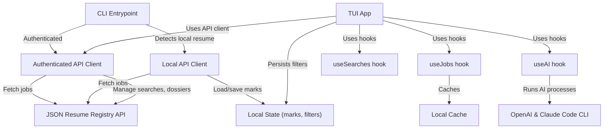
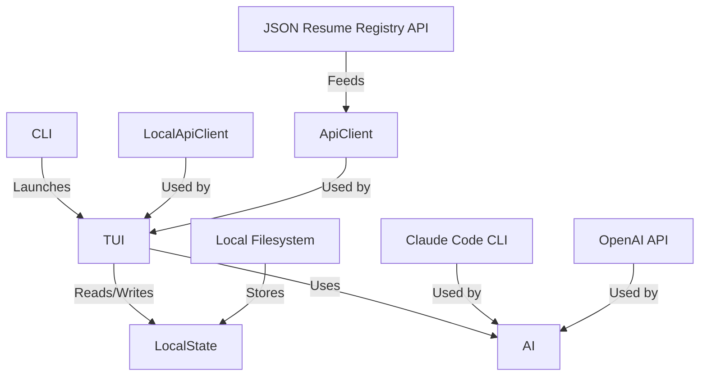

# Job Search Subsystem

The Job Search Subsystem implements the core logic, data management, filtering, user interface components, and AI utilities for searching, viewing, and managing job postings matched to a user's JSON Resume. It supports both local and authenticated modes, integrates with external APIs, caches results, and provides a terminal user interface (TUI) with advanced features such as AI-powered summaries and dossiers.

## Purpose and Scope

This page documents the internal mechanisms of the Job Search Subsystem, covering local state management, API clients (both local and authenticated), filtering logic, caching, authentication, CLI commands, and the TUI components including AI integration. It does not cover the JSON Resume schema itself or unrelated subsystems like resume editing or the registry backend.

For UI components and interaction patterns, see the TUI components documentation. For API client details, see the API and localApi modules. For AI features, see the useAI hook and related utilities.

## Architecture Overview

The subsystem consists of several layers:

- **Local State Management** (`localState.js`, `filters.js`, `cache.js`): Handles persistent storage of job marks, filters, and cached job data in the user's home directory.
- **API Clients** (`api.js`, `localApi.js`): Abstracts communication with the JSON Resume registry API or local mode using a resume JSON object.
- **Authentication** (`auth.js`): Manages API key retrieval, validation, and interactive login.
- **CLI Entrypoint** (`bin/cli.js`): Parses commands and arguments, dispatches to commands or launches the TUI.
- **TUI Components and Hooks** (`tui/*.js`): Implements the interactive terminal UI, including job lists, detail views, filters, search profiles, AI panels, and state management hooks.
- **AI Utilities** (`tui/useAI.js`): Provides AI-powered job summarization, dossier generation, and batch review using OpenAI and Claude Code CLI.

```mermaid
flowchart TD
  subgraph Local State
    LS1[localState.js]
    LS2[filters.js]
    LS3[cache.js]
  end

  subgraph API Clients
    API1[api.js]
    API2[localApi.js]
  end

  subgraph Auth
    AUTH[auth.js]
  end

  subgraph CLI
    CLI[bin/cli.js]
  end

  subgraph TUI
    TUI1[App.js]
    TUI2[useJobs.js]
    TUI3[useSearches.js]
    TUI4[useAI.js]
    TUI5[JobList.js]
    TUI6[JobDetail.js]
    TUI7[FilterManager.js]
    TUI8[SearchManager.js]
    TUI9[AIPanel.js]
  end

  CLI -->|uses| AUTH
  CLI -->|uses| API1
  CLI -->|uses| API2
  CLI -->|launches| TUI1
  TUI1 -->|uses| API1
  TUI1 -->|uses| API2
  TUI1 -->|uses| LS2
  TUI1 -->|uses| LS3
  TUI1 -->|uses| TUI2
  TUI1 -->|uses| TUI3
  TUI1 -->|uses| TUI4
  TUI2 -->|uses| LS3
  API2 -->|uses| LS1
  API2 -->|uses| LS2
  AUTH -->|reads/writes| LS1
  LS2 -->|reads/writes| LS1

```

**Diagram: High-level component relationships and data flows in the Job Search Subsystem**

Sources: `packages/job-search/src/localState.js:1-40`, `packages/job-search/src/api.js:1-77`, `packages/job-search/src/localApi.js:1-78`, `packages/job-search/src/auth.js:1-115`, `packages/job-search/bin/cli.js:1-432`, `packages/job-search/src/tui/App.js:1-558`

---

## Local State Management

### Purpose

Manages persistent local storage of job marks, filters, and cached job data in the user's home directory under `.jsonresume`. This enables offline or local-mode operation and state persistence across sessions.

### Components

| Symbol | Type | Purpose |
|--------|------|---------|
| `DIR` | `string` | Base directory path for local state files (`~/.jsonresume`). `localState.js:5`, `filters.js:5`, `cache.js:5`, `auth.js:6` |
| `FILE` | `string` | File path for local marks JSON (`local-marks.json`). `localState.js:6` |
| `ensureDir()` | `function` | Creates the local state directory if missing, ignoring errors. `packages/job-search/src/localState.js:8-12` |
| `load()` | `function` | Reads and parses local marks JSON, returns `{ jobId: state }` or empty object on failure. `packages/job-search/src/localState.js:14-20` |
| `save(data)` | `function` | Writes local marks JSON to disk, ensuring directory exists. `packages/job-search/src/localState.js:22-25` |
| `getMarks()` | `function` | Returns all job marks as `{ jobId: state }`. `packages/job-search/src/localState.js:28-30` |
| `setMark(jobId, state)` | `function` | Sets the mark state for a job ID and persists it. `packages/job-search/src/localState.js:33-37` |
| `marks` | `variable` | Local marks cache loaded from disk. `localState.js:34` (used internally) |

The filters module similarly manages filter state:

| Symbol | Type | Purpose |
|--------|------|---------|
| `DIR` | `string` | Directory path for filters file (`~/.jsonresume`). `filters.js:5` |
| `FILE` | `string` | Filters JSON file path (`filters.json`). `filters.js:6` |
| `ensureDir()` | `function` | Ensures filters directory exists. `packages/job-search/src/filters.js:8-12` |
| `loadFilters()` | `function` | Loads filter state, migrating old formats to new shape with default and searches keys. Returns `{ default, searches }`. `packages/job-search/src/filters.js:23-37` |
| `saveFilters(state)` | `function` | Persists filter state to disk. `packages/job-search/src/filters.js:39-42` |
| `getFiltersForSearch(state, searchId)` | `function` | Retrieves active filters for a given search ID or default. `packages/job-search/src/filters.js:45-48` |
| `setFiltersForSearch(state, searchId, active)` | `function` | Returns new filter state with updated active filters for a search ID or default. `packages/job-search/src/filters.js:51-59` |
| `raw` | `variable` | Raw JSON data loaded from filters file. `filters.js:25` |
| `next` | `variable` | Updated filter state object. `filters.js:52` |

The cache module manages cached job results:

| Symbol | Type | Purpose |
|--------|------|---------|
| `CACHE_DIR` | `string` | Directory path for cache files (`~/.jsonresume/cache`). `cache.js:5` |
| `CACHE_TTL` | `number` | Cache time-to-live in milliseconds (2 hours). `cache.js:6` |
| `ensureDir()` | `function` | Ensures cache directory exists. `packages/job-search/src/cache.js:8-12` |
| `cacheKey(params)` | `function` | Generates a cache filename key based on query params. `packages/job-search/src/cache.js:14-19` |
| `getCached(params)` | `function` | Returns cached job data if fresh, else null. `packages/job-search/src/cache.js:21-29` |
| `setCache(params, data)` | `function` | Writes job data to cache with timestamp. `packages/job-search/src/cache.js:31-37` |
| `updateCachedJob(params, jobId, updates)` | `function` | Updates a single job entry in cached data. `packages/job-search/src/cache.js:39-49` |
| `parts` | `variable` | Parts of cache key used internally. `cache.js:15` |
| `file` | `variable` | Cache file path. `cache.js:23`, `cache.js:34`, `cache.js:41` |
| `raw` | `variable` | Raw JSON cache content. `cache.js:24`, `cache.js:42` |
| `{ timestamp, data }` | `variable` | Parsed cache metadata and data. `cache.js:25` |
| `cache` | `variable` | Parsed cache object for update. `cache.js:43` |

### Key Behaviors

- Local marks and filters are stored as JSON files under the user's home directory, ensuring persistence without external dependencies. `packages/job-search/src/localState.js:5-37`, `packages/job-search/src/filters.js:5-59`
- The cache stores job search results keyed by query parameters, with a TTL of 2 hours to balance freshness and performance. `packages/job-search/src/cache.js:5-49`
- Updates to job marks propagate to both local marks and cached job data to keep UI state consistent. `packages/job-search/src/cache.js:39-49`
- Filters support migration from old formats and separate storage per search profile or default. `packages/job-search/src/filters.js:23-59`

### Relationships

Local state modules are used by the local API client to persist marks and filters without requiring server authentication. The cache module is used by the TUI's job fetching hook to avoid redundant network requests. The auth module reads and writes config files in the same directory.

Sources: `packages/job-search/src/localState.js:1-40`, `packages/job-search/src/filters.js:1-60`, `packages/job-search/src/cache.js:1-50`

---

## API Clients

### Purpose

Abstracts communication with the JSON Resume job registry API or local mode, providing a uniform interface for fetching jobs, job details, marking jobs, managing search profiles, and dossiers.

### Authenticated API Client (`createApiClient`)

Defined in `api.js`, this client uses an API key for authenticated requests.

| Method | Returns | Purpose |
|--------|---------|---------|
| `fetchJobs(params)` | `Promise<{ jobs: Job[] }>` | Fetches jobs matching query parameters, supports pagination, filtering, reranking. `packages/job-search/src/api.js:3-77` |
| `fetchJobDetail(id)` | `Promise<Job>` | Fetches detailed job information by ID. `packages/job-search/src/api.js:3-77` |
| `markJob(id, state, feedback)` | `Promise<Job>` | Updates the mark state and optional feedback for a job. `packages/job-search/src/api.js:3-77` |
| `fetchMe()` | `Promise<{ resume, username }>` | Retrieves the authenticated user's resume and username. `packages/job-search/src/api.js:3-77` |
| `listSearches()` | `Promise<{ searches }>` | Lists saved search profiles. `packages/job-search/src/api.js:3-77` |
| `createSearch(name, prompt)` | `Promise<{ search }>` | Creates a new search profile with a name and prompt. `packages/job-search/src/api.js:3-77` |
| `updateSearch(id, updates)` | `Promise<Search>` | Updates a search profile by ID. `packages/job-search/src/api.js:3-77` |
| `deleteSearch(id)` | `Promise<void>` | Deletes a search profile by ID. `packages/job-search/src/api.js:3-77` |
| `enrichJob(id, enriched)` | `Promise<void>` | Patches job metadata with enrichment data. `packages/job-search/src/api.js:3-77` |
| `fetchDossier(id)` | `Promise<{ content }>` | Fetches a dossier for a job. `packages/job-search/src/api.js:3-77` |
| `saveDossier(id, content)` | `Promise<void>` | Saves dossier content for a job. `packages/job-search/src/api.js:3-77` |

The client internally uses a generic `request` function that handles URL construction, headers (including authorization), JSON parsing, and error handling.

### Local API Client (`createLocalApiClient`)

Defined in `localApi.js`, this client operates without authentication, using a local resume JSON object and local marks storage.

| Property/Method | Description |
|-----------------|-------------|
| `mode` | `'local'` string literal indicating local mode. `packages/job-search/src/localApi.js:9-78` |
| `fetchJobs(params)` | Fetches jobs by POSTing the local resume and filters to the server, overlays local marks onto results. `packages/job-search/src/localApi.js:9-78` |
| `fetchJobDetail(id)` | Returns a stub with just the ID, as no detail endpoint exists in local mode. `packages/job-search/src/localApi.js:9-78` |
| `markJob(id, state, feedback)` | Sets local mark state for a job. `packages/job-search/src/localApi.js:9-78` |
| `fetchMe()` | Returns the local resume and username `'local'`. `packages/job-search/src/localApi.js:9-78` |
| `listSearches()` | Returns empty searches array; search profiles unsupported locally. `packages/job-search/src/localApi.js:9-78` |
| `createSearch()`, `updateSearch()`, `deleteSearch()` | Throw errors indicating search profiles require registry account. `packages/job-search/src/localApi.js:9-78` |
| `fetchDossier()`, `saveDossier()` | Store dossiers only in memory; no persistence. `packages/job-search/src/localApi.js:9-78` |

### Internal Variables in `createLocalApiClient`

- `base` — base URL for API requests, defaults to `DEFAULT_BASE_URL`. `localApi.js:10`
- `body` — request payload for job fetch including resume and filters. `packages/job-search/src/localApi.js:15-19`
- `res` — fetch response object. `packages/job-search/src/localApi.js:25-29`
- `text` — raw response text. `localApi.js:30`
- `data` — parsed JSON response. `localApi.js:31`
- `marks` — local marks overlayed onto jobs. `localApi.js:40`
- `jobs` — jobs array with local state merged. `packages/job-search/src/localApi.js:41-44`

### Key Behaviors

- The authenticated client uses RESTful endpoints with bearer token authorization, supporting full CRUD on searches and dossiers. `packages/job-search/src/api.js:3-77`
- The local client uses a POST `/jobs` endpoint with the resume JSON to fetch matches and stores marks locally, disabling search profiles and dossier persistence. `packages/job-search/src/localApi.js:9-78`
- Both clients expose identical method signatures for seamless substitution. `packages/job-search/src/api.js:3-77`, `packages/job-search/src/localApi.js:9-78`

### Relationships

The CLI and TUI layers instantiate one of these clients depending on authentication and local resume presence. The local client depends on local state modules for marks persistence.

Sources: `packages/job-search/src/api.js:1-77`, `packages/job-search/src/localApi.js:1-78`

---

## Authentication and API Key Management

### Purpose

Manages API key retrieval, validation, and interactive login flow for authenticated access to the JSON Resume registry.

### Components

| Symbol | Type | Purpose |
|--------|------|---------|
| `DIR` | `string` | Directory path for config file (`~/.jsonresume`). `auth.js:6` |
| `CONFIG_FILE` | `string` | Config JSON file path (`config.json`). `auth.js:7` |
| `ensureDir()` | `function` | Ensures config directory exists. `packages/job-search/src/auth.js:9-13` |
| `loadConfig()` | `function` | Loads saved config JSON or returns empty object. `packages/job-search/src/auth.js:15-21` |
| `saveConfig(config)` | `function` | Saves config JSON to disk. `packages/job-search/src/auth.js:23-26` |
| `prompt(question)` | `function` | Prompts user interactively on stderr, returns trimmed input string. `packages/job-search/src/auth.js:28-36` |
| `ensureApiKey(baseUrl)` | `async function` | Ensures a valid API key is available by checking env var, saved config, or prompting for GitHub username and generating a key. Returns API key string. `packages/job-search/src/auth.js:44-115` |
| `config` | `object` | Loaded config object with `apiKey` and `username`. `auth.js:51` |
| `res` | `Response` | Fetch response for API key validation. `packages/job-search/src/auth.js:55-57` |
| `username` | `string` | GitHub username input by user. `auth.js:70` |
| `resumeRes` | `Response` | Fetch response for resume existence check. `auth.js:82` |
| `keyRes` | `Response` | Fetch response for API key generation. `packages/job-search/src/auth.js:92-96` |
| `err` | `object` | Error response JSON from key generation failure. `auth.js:99` |
| `{ key }` | `object` | Generated API key from server. `auth.js:106` |

### Key Behaviors

- The environment variable `JSONRESUME_API_KEY` takes precedence if set. `packages/job-search/src/auth.js:44-115`
- Saved config keys are validated by fetching `/api/v1/me`; stale keys trigger login. `packages/job-search/src/auth.js:44-115`
- Interactive login prompts for GitHub username, verifies resume existence, then requests an API key from the server. `packages/job-search/src/auth.js:44-115`
- Generated keys and usernames are saved to config for future use. `packages/job-search/src/auth.js:44-115`
- The prompt uses `readline` on stderr to avoid interfering with stdout output. `packages/job-search/src/auth.js:28-36`

### Relationships

The CLI uses `ensureApiKey` to obtain credentials before creating the authenticated API client. The config file shares the `.jsonresume` directory with local state files.

Sources: `packages/job-search/src/auth.js:1-115`

---

## CLI Entrypoint and Commands

### Purpose

Parses command-line arguments, dispatches commands, manages local resume detection, and launches either the interactive TUI or CLI commands.

### Key Components and Variables

| Symbol | Type | Purpose |
|--------|------|---------|
| `VERSION` | `string` | CLI version string. `bin/cli.js:9` |
| `BASE_URL` | `string` | API base URL, configurable via env or arg. `packages/job-search/bin/cli.js:11-14` |
| `getArg(name)` | `function` | Retrieves the value of a named CLI argument. `packages/job-search/bin/cli.js:18-22` |
| `hasFlag(name)` | `function` | Checks presence of a flag argument. `packages/job-search/bin/cli.js:24-26` |
| `findLocalResume()` | `async function` | Attempts to locate a local resume JSON from explicit path or default files in CWD. Returns parsed resume or null. `packages/job-search/bin/cli.js:30-57` |
| `_apiKey` | `string` | Cached API key. `bin/cli.js:61` |
| `getApiKey()` | `async function` | Retrieves or generates API key using `ensureApiKey`. `packages/job-search/bin/cli.js:63-68` |
| `api(path, options)` | `async function` | Performs authenticated fetch to API with bearer token. `packages/job-search/bin/cli.js:70-88` |
| `formatSalary()`, `formatLocation()`, `stateIcon()` | `functions` | CLI-specific formatting helpers. `packages/job-search/bin/cli.js:92-115` |
| `cmdSearch()`, `cmdDetail()`, `cmdMark()`, `cmdMe()`, `cmdUpdate()`, `cmdLogout()`, `cmdHelp()` | `async functions` | Implement CLI commands for searching, viewing details, marking jobs, showing user info, updating resume, logging out, and help. `packages/job-search/bin/cli.js:119-375` |
| `main()` | `async function` | Main entrypoint that dispatches commands or launches TUI, handling local resume mode and authentication. `packages/job-search/bin/cli.js:379-432` |

### Key Behaviors

- The CLI supports commands: `search`, `detail`, `mark`, `me`, `update`, `logout`, and `help`. `packages/job-search/bin/cli.js:119-375`
- Local resume detection enables running the TUI without authentication, using the local API client. `packages/job-search/bin/cli.js:30-57`, `packages/job-search/bin/cli.js:379-432`
- The TUI is launched by importing and rendering the `App` component with appropriate API client. `packages/job-search/bin/cli.js:379-432`
- Commands support flags for filtering, output format (JSON), and feedback on marks. `packages/job-search/bin/cli.js:119-375`
- Errors in commands print to stderr and exit with non-zero status. `packages/job-search/bin/cli.js:70-88`

### Relationships

The CLI depends on the auth module for API key management, the API and localApi clients for data fetching, and the TUI for interactive mode. It uses local state indirectly via the local API client.

Sources: `packages/job-search/bin/cli.js:1-432`

---

## TUI State Hooks and Data Fetching

### useSearches Hook

Manages the list of saved search profiles, including loading, creation, deletion, and filter updates.

| Symbol | Type | Purpose |
|--------|------|---------|
| `useSearches(api)` | `function` | React hook returning `{ searches, loading, create, remove, updateFilters, refetch }`. `packages/job-search/src/tui/useSearches.js:3-56` |
| `[searches, setSearches]` | `state` | Array of search profiles. `tui/useSearches.js:4` |
| `[loading, setLoading]` | `state` | Loading state boolean. `tui/useSearches.js:5` |
| `fetch()` | `async function` | Loads search profiles from API, sets state. `packages/job-search/src/tui/useSearches.js:7-17` |
| `create(name, prompt)` | `async function` | Creates a new search profile via API and updates state. `packages/job-search/src/tui/useSearches.js:23-34` |
| `remove(id)` | `async function` | Deletes a search profile and updates state. `packages/job-search/src/tui/useSearches.js:36-44` |
| `updateFilters(id, filters)` | `async function` | Updates filters for a search profile via API. `packages/job-search/src/tui/useSearches.js:46-53` |

### useJobs Hook

Manages fetching, caching, filtering, reranking, and marking of jobs for the current active filters and tab.

| Symbol | Type | Purpose |
|--------|------|---------|
| `useJobs(api, activeFilters, tab, searchId, getDossierStatus)` | `function` | React hook returning job data and actions. `packages/job-search/src/tui/useJobs.js:4-189` |
| `[allJobs, setAllJobs]` | `state` | Full array of jobs fetched. `tui/useJobs.js:5` |
| `[loading, setLoading]` | `state` | Loading state boolean. `tui/useJobs.js:6` |
| `[reranking, setReranking]` | `state` | Reranking in progress boolean. `tui/useJobs.js:7` |
| `[error, setError]` | `state` | Error message string or null. `tui/useJobs.js:8` |
| `rerankAbort` | `ref` | Abort token for reranking requests. `tui/useJobs.js:9` |
| `params` | `object` | API query parameters derived from filters and search ID. `packages/job-search/src/tui/useJobs.js:12-24` |
| `paramsKey` | `string` | JSON stringified params for memoization. `tui/useJobs.js:26` |
| `fetchJobs(force)` | `async function` | Fetches jobs from API or cache, triggers reranking if applicable. `packages/job-search/src/tui/useJobs.js:28-81` |
| `startRerank(currentJobs)` | `function` | Initiates background reranking of jobs with cancellation support. `packages/job-search/src/tui/useJobs.js:83-110` |
| `jobs` | `array` | Filtered jobs according to tab and client-side filters. `packages/job-search/src/tui/useJobs.js:117-168` |
| `markJob(id, state, feedback)` | `async function` | Marks a job state locally and on server, updates cache. `packages/job-search/src/tui/useJobs.js:170-184` |
| `forceRefresh()` | `function` | Forces a fresh fetch bypassing cache. `tui/useJobs.js:186` |

### Key Behaviors

- Jobs are fetched with parameters derived from active filters and search profile, supporting pagination and reranking. `packages/job-search/src/tui/useJobs.js:12-81`
- Cached results are used if fresh; reranked results are cached separately. `packages/job-search/src/tui/useJobs.js:21-29`, `packages/job-search/src/tui/useJobs.js:42-48`
- Reranking is performed asynchronously with cancellation tokens to avoid race conditions. `packages/job-search/src/tui/useJobs.js:83-110`
- Client-side filtering applies additional constraints such as remote-only, minimum salary, and keyword search. `packages/job-search/src/tui/useJobs.js:117-168`
- Marking a job updates local state, cache, and server asynchronously, with fallback to refetch on failure. `packages/job-search/src/tui/useJobs.js:170-184`

### Relationships

These hooks are used by the main TUI `App` component to provide reactive job data and actions. They depend on the API clients and local cache modules.

Sources: `packages/job-search/src/tui/useSearches.js:3-56`, `packages/job-search/src/tui/useJobs.js:4-189`

---

## AI Integration and Utilities

### Purpose

Provides AI-powered job summarization, dossier generation, batch review, and export features using OpenAI and Claude Code CLI, integrated into the TUI.

### Core Functions

| Symbol | Type | Purpose |
|--------|------|---------|
| `buildResumeText(resume)` | `function` | Constructs a textual summary of the resume for AI input. `packages/job-search/src/tui/useAI.js:6-28` |
| `buildJobText(job, rawContent)` | `function` | Constructs a textual representation of a job posting for AI input. `packages/job-search/src/tui/useAI.js:30-47` |
| `useAI(resume)` | `function` | React hook managing AI state, providing methods for summarization, dossier, batch review, export, and cancellation. `packages/job-search/src/tui/useAI.js:49-551` |
| `summarizeJob(job)` | `async function` | Generates a concise AI analysis of a job's fit to the resume using OpenAI. `packages/job-search/src/tui/useAI.js:63-110` |
| `dossier(job, api)` | `async function` | Generates a detailed research dossier using Claude Code CLI, caching results and saving to server. `packages/job-search/src/tui/useAI.js:112-417` |
| `batchReview(jobs)` | `async function` | Produces an AI ranking and verdict for a batch of jobs. `packages/job-search/src/tui/useAI.js:419-461` |
| `exportDossier(job)` | `function` | Exports the current dossier text to a markdown file. `packages/job-search/src/tui/useAI.js:475-489` |
| `cancel()` | `function` | Cancels any running AI process (e.g., Claude CLI). `packages/job-search/src/tui/useAI.js:463-470` |
| `regenerateDossier(job, api)` | `function` | Clears cached dossier and restarts generation. `packages/job-search/src/tui/useAI.js:517-528` |

### Internal State and Helpers

- `text`, `loading`, `error`, `mode` — React state for AI output, loading status, errors, and mode ('ai' or 'cover'). `packages/job-search/src/tui/useAI.js:50-53`
- `hasKey` — Boolean indicating presence of OpenAI API key in environment. `tui/useAI.js:54`
- `childRef` — Ref to the spawned Claude CLI child process. `tui/useAI.js:55`
- `dossierCache` — In-memory cache mapping job IDs to dossier text and status. `tui/useAI.js:58`
- `bumpTick` — State updater to trigger re-renders on dossier cache changes. `packages/job-search/src/tui/useAI.js:60-61`
- `processLine(line)` — Parses streaming JSON lines from Claude CLI output, updating text and status. `packages/job-search/src/tui/useAI.js:308-347`
- `prompt` — Large multi-section prompt template for Claude Code dossier generation. `packages/job-search/src/tui/useAI.js:205-277`

### Key Behaviors

- Summarization uses OpenAI GPT-4o-mini with a system prompt to produce concise fit analyses. `packages/job-search/src/tui/useAI.js:63-110`
- Dossier generation uses the Claude Code CLI as a subprocess, streaming JSON output parsed line-by-line to update UI. `packages/job-search/src/tui/useAI.js:112-417`
- Dossiers include structured enrichment data extracted from the AI output and saved back to the server. `packages/job-search/src/tui/useAI.js:112-417`
- Batch review ranks multiple jobs with OpenAI, providing a one-line verdict per job. `packages/job-search/src/tui/useAI.js:419-461`
- Export writes dossier content to a sanitized markdown filename based on company name. `packages/job-search/src/tui/useAI.js:475-489`
- Cancellation kills the Claude CLI process to abort dossier generation. `packages/job-search/src/tui/useAI.js:463-470`
- The hook exposes status queries for dossiers to enable UI icons and state. `packages/job-search/src/tui/useAI.js:509-515`

### Relationships

The AI hook is used by the TUI `App` and `AIPanel` components to provide AI features. It depends on the API client for fetching job details and saving dossiers. It requires environment variables for OpenAI and the Claude Code CLI installed locally.

Sources: `packages/job-search/src/tui/useAI.js:1-551`

---

## TUI Components and Interaction

### Purpose

Implements the terminal user interface for browsing, filtering, marking, and analyzing jobs with keyboard-driven navigation and AI integration.

### Major Components

- **App** (`App.js`): Root component managing global state, views, tabs, filters, searches, AI, and orchestrating subcomponents. `packages/job-search/src/tui/App.js:56-554`
- **JobList** (`JobList.js`): Displays paginated, scrollable job lists with columns for score, title, company, location, age, salary, and status icons. Supports batch selection and marking. `packages/job-search/src/tui/JobList.js:302-445`
- **JobDetail** (`JobDetail.js`): Shows detailed job information with scrolling, marking, and link opening. `packages/job-search/src/tui/JobDetail.js:12-195`
- **FilterManager** (`FilterManager.js`): Manages active filters with add/edit/delete UI and keyboard navigation. `packages/job-search/src/tui/FilterManager.js:33-266`
- **SearchManager** (`SearchManager.js`): Manages saved search profiles with creation, switching, and deletion. `packages/job-search/src/tui/SearchManager.js:7-207`
- **AIPanel** (`AIPanel.js`): Displays AI-generated summaries and dossiers with scrolling, export, and regeneration controls. `packages/job-search/src/tui/AIPanel.js:6-140`
- **Header** (`Header.js`): Displays app title, active tab, filter pills, and keyboard shortcut hints. `packages/job-search/src/tui/Header.js:11-107`
- **StatusBar** (`StatusBar.js`): Shows keyboard hints, loading/reranking status, job counts, AI availability, and error messages. `packages/job-search/src/tui/StatusBar.js:63-118`
- **Toast** (`Toast.js`): Displays transient messages for user feedback. `packages/job-search/src/tui/Toast.js:29-56`
- **HelpModal** (`HelpModal.js`): Shows keyboard shortcut help overlay. `packages/job-search/src/tui/HelpModal.js:55-100`

### Key Behaviors

- The `App` component manages view state (`list`, `detail`, `filters`, `searches`, `ai`, `help`), tab selection, inline search, and coordinates hooks for jobs, searches, AI, and toasts. It handles keyboard input globally and dispatches to subcomponents. `packages/job-search/src/tui/App.js:56-554`
- Job lists support scrolling, selection, batch marking, and dynamic column widths based on terminal size and reranking presence. `packages/job-search/src/tui/JobList.js:15-445`
- Job details show rich metadata, skills, descriptions, and support scrolling and marking. `packages/job-search/src/tui/JobDetail.js:12-195`
- Filters and search profiles are managed with keyboard-driven UIs supporting add/edit/delete, with persistence synced to local storage and server. `packages/job-search/src/tui/FilterManager.js:33-266`, `packages/job-search/src/tui/SearchManager.js:7-207`
- AI panels stream output from AI processes, support scrolling, exporting, and regeneration, and display loading and error states. `packages/job-search/src/tui/AIPanel.js:6-140`
- Status bar and toast components provide contextual keyboard hints and feedback messages. `packages/job-search/src/tui/StatusBar.js:63-118`, `packages/job-search/src/tui/Toast.js:29-56`
- Help modal overlays keyboard shortcut documentation and can be dismissed with escape or question mark. `packages/job-search/src/tui/HelpModal.js:55-100`

### Internal State and Variables

- `TABS` and `TAB_LABELS` define available tabs and their labels. `packages/job-search/src/tui/App.js:27-44`
- `useJobs` hook provides job data and actions to `App`. `packages/job-search/src/tui/App.js:125-133`
- `useAI` hook provides AI state and actions to `App`. `packages/job-search/src/tui/App.js:124-124`
- `useSearches` hook manages search profiles. `packages/job-search/src/tui/App.js:78-78`
- `toast` and `showToast` manage transient messages. `packages/job-search/src/tui/App.js:134-134`
- Keyboard input handlers in `App` manage global shortcuts and view transitions. `packages/job-search/src/tui/App.js:200-350`

### Relationships

The TUI components consume API clients and hooks for data. They rely on local state modules for persistence and AI utilities for advanced features. The CLI launches the TUI in interactive mode.

Sources: `packages/job-search/src/tui/App.js:56-554`, `packages/job-search/src/tui/JobList.js:15-445`, `packages/job-search/src/tui/JobDetail.js:12-195`, `packages/job-search/src/tui/FilterManager.js:33-266`, `packages/job-search/src/tui/SearchManager.js:7-207`, `packages/job-search/src/tui/AIPanel.js:6-140`, `packages/job-search/src/tui/StatusBar.js:63-118`, `packages/job-search/src/tui/Toast.js:29-56`, `packages/job-search/src/tui/HelpModal.js:55-100`

---

## Exporting Job Shortlists

### Purpose

Exports the user's shortlisted jobs (marked as interested, applied, or maybe) to a markdown file for offline tracking or sharing.

### Implementation Details

- The `exportShortlist(allJobs)` function filters jobs by their mark state into interested, applied, and maybe groups. `packages/job-search/src/export.js:8-65`
- It formats each job with title, company, job ID, match score, Hacker News post URL, salary, location, and skills. `packages/job-search/src/export.js:16-33`
- The output markdown file is named `job-hunt-YYYY-MM-DD.md` based on the current date. `packages/job-search/src/export.js:9-10`
- Sections are created for each group with counts and formatted job entries. `packages/job-search/src/export.js:35-62`
- The file is written synchronously to the current working directory. `packages/job-search/src/export.js:62-65`
- Returns the filename written for user feedback.

### Internal Variables

- `date` — ISO date string for filename. `export.js:9`
- `filename` — constructed markdown filename. `export.js:10`
- `interested`, `applied`, `maybe` — filtered job arrays. `packages/job-search/src/export.js:12-14`
- `formatJob` — function formatting a single job to markdown. `packages/job-search/src/export.js:16-33`
- `sections` — array of markdown sections. `export.js:35`
- `content` — final markdown content string. `export.js:62`

### Key Behaviors

- Only jobs with explicit mark states of interested, applied, or maybe are included. `packages/job-search/src/export.js:12-14`
- Skills are joined as a comma-separated list or replaced with a dash if missing. `packages/job-search/src/export.js:18-19`
- The export includes a footer linking back to the JSON Resume Job Search project. `packages/job-search/src/export.js:59-61`

### Relationships

The export function is invoked from the TUI's export command handler and uses formatting utilities from `formatters.js`.

Sources: `packages/job-search/src/export.js:8-65`

---

## Formatting Utilities

### Purpose

Provides reusable formatting functions for salary, location, job state icons and colors, text truncation, and age formatting.

### Functions

| Function | Purpose |
|----------|---------|
| `formatSalary(salary, salaryUsd)` | Formats salary as `$XXk` if USD amount given, else returns raw string or dash. `packages/job-search/src/formatters.js:1-5` |
| `formatLocation(loc, remote)` | Joins city and country code, appends remote info in parentheses. Returns dash if empty. `packages/job-search/src/formatters.js:7-13` |
| `stateIcon(state)` | Returns a Unicode icon representing job mark state. `packages/job-search/src/formatters.js:15-24` |
| `stateColor(state)` | Returns a color string for job mark state. `packages/job-search/src/formatters.js:26-35` |
| `truncate(str, len)` | Truncates string to length with ellipsis. `packages/job-search/src/formatters.js:37-40` |
| `formatAge(postedAt)` | Returns human-readable age string (e.g., "1d ago", "2w ago"). `packages/job-search/src/formatters.js:42-52` |
| `stateLabel(state)` | Returns a human-readable label for job mark state. `packages/job-search/src/formatters.js:54-63` |

### Internal Variables

- `icons` — mapping of states to icons. `packages/job-search/src/formatters.js:16-22`
- `colors` — mapping of states to colors. `packages/job-search/src/formatters.js:27-33`
- `days` — used internally for age calculation. `packages/job-search/src/formatters.js:44-46`
- `labels` — mapping of states to labels. `packages/job-search/src/formatters.js:55-61`
- `parts` — used internally in `formatLocation`. `formatters.js:8`

### Key Behaviors

- The icon and color mappings cover states: interested, applied, not_interested, dismissed, maybe. `packages/job-search/src/formatters.js:15-35`
- Age formatting rounds to days, weeks, or months with special cases for today and 1 day ago. `packages/job-search/src/formatters.js:42-52`
- Location formatting gracefully handles missing city or country code. `packages/job-search/src/formatters.js:7-13`

Sources: `packages/job-search/src/formatters.js:1-63`

---

## How It Works: Job Search Flow



**Diagram: End-to-end flow from CLI entrypoint through API clients, local state, TUI hooks, and AI integration**

Sources: `packages/job-search/bin/cli.js:1-432`, `packages/job-search/src/localApi.js:1-78`, `packages/job-search/src/api.js:1-77`, `packages/job-search/src/localState.js:1-37`, `packages/job-search/src/filters.js:1-59`, `packages/job-search/src/cache.js:1-49`, `packages/job-search/src/tui/App.js:56-554`, `packages/job-search/src/tui/useJobs.js:4-189`, `packages/job-search/src/tui/useSearches.js:3-56`, `packages/job-search/src/tui/useAI.js:1-551`

### Flow Description

1. **CLI Startup**: The CLI parses arguments and detects if a local resume JSON is present. If so, it creates a local API client; otherwise, it ensures an API key and creates an authenticated client. It then launches the TUI. `packages/job-search/bin/cli.js:30-57`, `packages/job-search/bin/cli.js:379-432`

2. **API Client Usage**: The TUI uses the API client to fetch jobs, job details, mark jobs, and manage search profiles and dossiers. The local client overlays local marks and disables search profiles. `packages/job-search/src/localApi.js:9-78`, `packages/job-search/src/api.js:3-77`

3. **Local State Persistence**: Marks and filters are loaded and saved from disk under `~/.jsonresume`. The cache stores job search results keyed by query parameters with a TTL. `packages/job-search/src/localState.js:1-37`, `packages/job-search/src/filters.js:23-59`, `packages/job-search/src/cache.js:21-49`

4. **Job Fetching and Filtering**: The `useJobs` hook derives API parameters from active filters and search profiles, fetches jobs from the API or cache, applies client-side filters, and manages reranking asynchronously. `packages/job-search/src/tui/useJobs.js:4-189`

5. **Search Profiles**: The `useSearches` hook manages saved search profiles, allowing creation, deletion, and filter updates synced with the server. `packages/job-search/src/tui/useSearches.js:3-56`

6. **AI Features**: The `useAI` hook provides job summarization via OpenAI, dossier generation via Claude Code CLI subprocess, batch review, and dossier export. It manages streaming output, caching, and error handling. `packages/job-search/src/tui/useAI.js:1-551`

7. **TUI Interaction**: The `App` component orchestrates views, tabs, filters, searches, AI, and user input. Subcomponents render job lists, details, filters, searches, AI panels, and help overlays with keyboard navigation. `packages/job-search/src/tui/App.js:56-554`

8. **Exporting**: The export function generates a markdown file summarizing shortlisted jobs for offline use. `packages/job-search/src/export.js:8-65`

---

## Key Relationships

The Job Search Subsystem depends on:

- The JSON Resume Registry API for job data, search profiles, and dossiers.
- Local filesystem for persisting marks, filters, cache, and config.
- External AI services (OpenAI) and CLI tools (Claude Code) for AI features.
- React and Ink for TUI rendering and input handling.

It provides:

- CLI commands for scripted job search and management.
- An interactive TUI for browsing, filtering, marking, and AI-assisted analysis.
- Local mode operation for users without registry accounts.



**Relationships between external dependencies and internal components in the Job Search Subsystem**

Sources: `packages/job-search/src/api.js:1-77`, `packages/job-search/src/localApi.js:1-78`, `packages/job-search/src/auth.js:1-115`, `packages/job-search/src/tui/useAI.js:1-551`, `packages/job-search/bin/cli.js:1-432`

---

## Summary

This documentation covers the core mechanisms of the Job Search Subsystem, detailing local state persistence, API client abstractions, authentication flows, CLI command dispatch, TUI state management hooks, AI integration, and UI components. The system balances local and authenticated modes, supports rich filtering and search profiles, and integrates AI to enhance job matching and research. The architecture is modular, with clear separation of concerns and robust error handling to support interactive and scripted workflows.