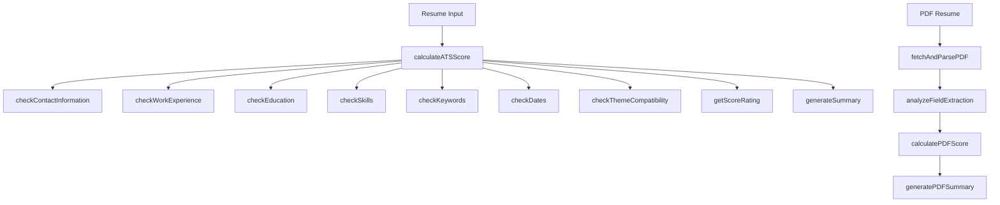
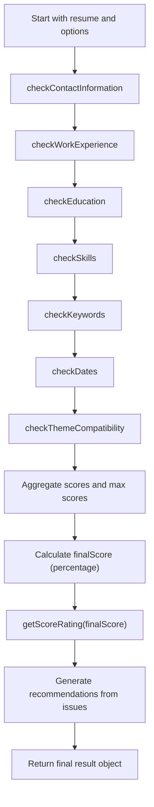
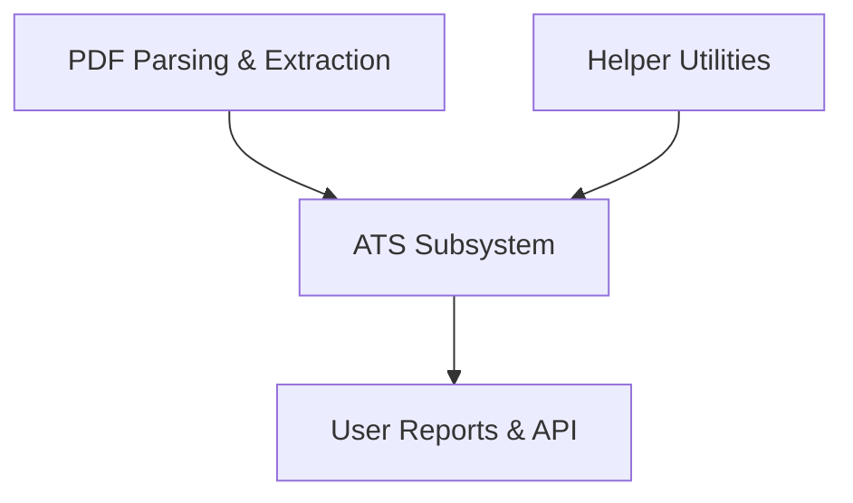

# ATS Subsystem

The ATS Subsystem evaluates resumes for Applicant Tracking System (ATS) compatibility by scoring various structural and content elements. It performs checks on contact information, work experience, education, skills, keywords, date formatting, and theme compatibility, generating a comprehensive score, rating, and actionable recommendations to improve ATS performance.

## Purpose and Scope

This page documents the internal mechanisms of the ATS Subsystem responsible for scoring resumes, performing structural and content checks, parsing PDF resumes, and analyzing extracted text for ATS compatibility. It covers the scoring logic, individual checks, PDF parsing utilities, and summary generation. It does not cover the user interface or external API integration beyond the core scoring and analysis logic.

For PDF parsing details, see the PDF Parsing and Analysis subsystem. For scoring utilities and helpers, see the Scoring Utilities page.

## Architecture Overview

The ATS Subsystem orchestrates multiple specialized checks on resume data, aggregates their results into a unified score, and produces a rating and recommendations. It also supports PDF resume parsing and field extraction analysis to complement JSON resume input.

**Diagram: High-level data flow and component relationships in the ATS Subsystem**

Sources: `apps/registry/lib/ats/scoring.js:26-91`, `apps/registry/lib/ats/checks/*.js:10-84`, `apps/registry/lib/ats/utils/*.js:10-60`, `apps/registry/app/api/ats/pdf/utils/*.js:10-126`

## Resume Scoring Orchestration

### calculateATSScore

**Purpose**: Orchestrates the full ATS scoring process by invoking individual checks on a resume, aggregating their scores, and producing a final score, rating, detailed checks, and recommendations.

**Primary file**: `apps/registry/lib/ats/scoring.js:26-91`

| Variable | Type | Purpose |
|---------|-------|---------|
| `checks` | `Array` | Collects results of each individual check including score, maxScore, issues, and pass status. `apps/registry/lib/ats/scoring.js:27` |
| `totalScore` | `number` | Accumulates the sum of scores from all checks. `apps/registry/lib/ats/scoring.js:28` |
| `maxScore` | `number` | Accumulates the sum of maximum possible scores from all checks. `apps/registry/lib/ats/scoring.js:29` |
| `finalScore` | `number` | Normalized score as a percentage (0-100) based on totalScore/maxScore. `apps/registry/lib/ats/scoring.js:74` |
| `rating` | `string` | Human-readable rating derived from finalScore (e.g., Excellent, Good). `apps/registry/lib/ats/scoring.js:77` |
| `recommendations` | `Array` | Flattened list of all issues from checks that have problems. `apps/registry/lib/ats/scoring.js:80-82` |

**Key behaviors:**
- Invokes seven distinct checks covering contact info, work experience, education, skills, keywords, dates, and theme compatibility, each returning a score object. `apps/registry/lib/ats/scoring.js:26-68`
- Aggregates individual scores and max scores to compute a final normalized score. `apps/registry/lib/ats/scoring.js:69-74`
- Uses `getScoreRating` to convert the numeric score into a qualitative rating. `apps/registry/lib/ats/scoring.js:75-77`
- Extracts issues from all checks to generate actionable recommendations. `apps/registry/lib/ats/scoring.js:78-82`
- Returns a comprehensive result object including score, rating, checks, recommendations, and a summary generated by `generateSummary`. `apps/registry/lib/ats/scoring.js:83-91`

**How It Works:**

**Diagram: Call flow for resume scoring orchestration**

Sources: `apps/registry/lib/ats/scoring.js:26-91`

## Individual Checks

Each check evaluates a specific aspect of the resume and returns a structured result with a score, maximum possible score, any issues found, and a pass/fail flag.

### Contact Information Check

**Purpose**: Validates presence and format of critical contact fields: name, email, phone, and location.

**Primary file**: `apps/registry/lib/ats/checks/contactInfo.js:12-77`

| Field | Description |
|-------|-------------|
| Name | Required; awards 5 points if present and non-empty. Missing triggers a critical issue. |
| Email | Required; validated with regex via `isValidEmail`. Awards 5 points if valid, else critical issue. |
| Phone | Recommended; awards 5 points if present, else warning. |
| Location | Recommended; awards 5 points if city, region, or country is present, else warning. |

**Key behaviors:**
- Uses `isValidEmail` helper to validate email format. `apps/registry/lib/ats/utils/helpers.js:10-12`
- Assigns a maximum of 20 points distributed evenly across four fields. `apps/registry/lib/ats/checks/contactInfo.js:14-15`
- Issues are categorized by severity: critical for missing name/email, warning for phone/location. `apps/registry/lib/ats/checks/contactInfo.js:13-77`

Sources: `apps/registry/lib/ats/checks/contactInfo.js:12-77`, `apps/registry/lib/ats/utils/helpers.js:10-12`

### Work Experience Check

**Purpose**: Assesses completeness and quality of work experience entries including company name, position, start date, and description/highlights.

**Primary file**: `apps/registry/lib/ats/checks/workExperience.js:10-84`

| Field | Points | Description |
|-------|--------|-------------|
| Presence of any work experience | 5 | Awards points if at least one work entry exists. |
| Company name per job | 3 | Required for each job; missing triggers warnings. |
| Position/title per job | 3 | Required for each job; missing triggers warnings. |
| Start date per job | 3 | Required for each job; missing triggers warnings. |
| Description or highlights per job | 3 | Requires either summary or highlights; missing triggers warnings. |

**Key behaviors:**
- Iterates over all work entries, accumulating points and collecting per-job issues. `apps/registry/lib/ats/checks/workExperience.js:15-65`
- Caps total score at 20 points. `apps/registry/lib/ats/checks/workExperience.js:70-74`
- Issues include detailed messages and suggested fixes for missing fields. `apps/registry/lib/ats/checks/workExperience.js:25-65`

Sources: `apps/registry/lib/ats/checks/workExperience.js:10-84`

### Education Check

**Purpose**: Validates presence and completeness of education entries including institution name and degree or study area.

**Primary file**: `apps/registry/lib/ats/checks/education.js:10-55`

| Field | Points | Description |
|-------|--------|-------------|
| Presence of any education entries | 5 | Awards points if at least one education entry exists. |
| Institution name per entry | 5 | Required for each education entry. |
| Degree or study area per entry | 5 | Requires either studyType or area. |

**Key behaviors:**
- Iterates over education entries, awarding points for presence of institution and degree/area. `apps/registry/lib/ats/checks/education.js:15-50`
- Caps total score at 15 points. `apps/registry/lib/ats/checks/education.js:51-54`
- Issues include informational messages for missing education or incomplete entries. `apps/registry/lib/ats/checks/education.js:10-55`

Sources: `apps/registry/lib/ats/checks/education.js:10-55`

### Skills Check

**Purpose**: Evaluates skills section for presence, diversity of skill categories, and number of skill keywords.

**Primary file**: `apps/registry/lib/ats/checks/skills.js:10-65`

| Criterion | Points | Description |
|-----------|--------|-------------|
| Presence of any skills | 5 | Awards points if skills array is non-empty. |
| Multiple skill categories (≥3) | 5 | Awards points if at least three skill categories exist; partial points and info issue otherwise. |
| Number of skill keywords (≥10) | 5 | Awards full points if 10+ keywords across all categories; partial points and info issue otherwise. |

**Key behaviors:**
- Aggregates keywords count across all skill categories. `apps/registry/lib/ats/checks/skills.js:40-45`
- Issues include warnings for missing skills and info-level suggestions for improving categories and keywords. `apps/registry/lib/ats/checks/skills.js:10-65`

Sources: `apps/registry/lib/ats/checks/skills.js:10-65`

### Keywords and Content Check

**Purpose**: Checks for sufficient length and keyword density in summary, work highlights, and overall resume text.

**Primary file**: `apps/registry/lib/ats/checks/keywords.js:12-77`

| Criterion | Points | Description |
|-----------|--------|-------------|
| Summary length (≥50 characters) | 5 | Awards points if summary is sufficiently long; partial points and info issue otherwise. |
| Work highlights count (≥5) | 5 | Awards points if total highlights across work entries ≥5; partial points and info issue otherwise. |
| Overall word count (≥200 words) | 5 | Awards points if total extracted text word count ≥200; info issue otherwise. |

**Key behaviors:**
- Uses `extractAllText` helper to aggregate all textual content from resume sections. `apps/registry/lib/ats/utils/helpers.js:19-42`
- Issues include warnings for missing summary and info-level suggestions for improving highlights and content length. `apps/registry/lib/ats/checks/keywords.js:12-77`

Sources: `apps/registry/lib/ats/checks/keywords.js:12-77`, `apps/registry/lib/ats/utils/helpers.js:19-42`

### Date Formatting Check

**Purpose**: Ensures work and education entries include start dates to improve ATS parsing accuracy.

**Primary file**: `apps/registry/lib/ats/checks/dates.js:10-52`

| Criterion | Points Deduction | Description |
|-----------|------------------|-------------|
| Missing start date in work entry | -2 per entry | Deducts points and issues warnings for each work entry missing startDate. |
| Missing start and end dates in education entry | -1 per entry | Deducts points and issues info messages for education entries missing both dates. |

**Key behaviors:**
- Starts with a perfect score of 10 and deducts points for missing dates. `apps/registry/lib/ats/checks/dates.js:12-13`
- Ensures score does not drop below zero. `apps/registry/lib/ats/checks/dates.js:44-47`
- Issues include warnings for work and informational messages for education date omissions. `apps/registry/lib/ats/checks/dates.js:10-52`

Sources: `apps/registry/lib/ats/checks/dates.js:10-52`

### Theme Compatibility Check

**Purpose**: Scores the ATS-friendliness of the resume's theme based on known compatibility lists.

**Primary file**: `apps/registry/lib/ats/checks/theme.js:10-61`

| Theme Category | Score | Description |
|----------------|-------|-------------|
| Known ATS-friendly themes | 5 | Full score if theme matches a known friendly theme. |
| Known problematic themes | 1 | Low score with warning if theme is known to cause ATS issues. |
| Unknown themes | 3 | Neutral score with informational message. |

**Key behaviors:**
- Maintains explicit lists of friendly and problematic themes. `apps/registry/lib/ats/checks/theme.js:16-30`
- Issues include warnings for problematic themes and info messages for unknown themes with suggestions. `apps/registry/lib/ats/checks/theme.js:30-60`

Sources: `apps/registry/lib/ats/checks/theme.js:10-61`

## Scoring Utilities

### getScoreRating

**Purpose**: Converts a numeric score (0-100) into a qualitative rating string.

**Primary file**: `apps/registry/lib/ats/utils/scoring.js:10-16`

| Score Range | Rating |
|-------------|--------|
| 90 and above | Excellent |
| 75 to 89 | Good |
| 60 to 74 | Fair |
| 40 to 59 | Poor |
| Below 40 | Needs Improvement |

Sources: `apps/registry/lib/ats/utils/scoring.js:10-16`

### generateSummary

**Purpose**: Produces a textual summary of the resume's ATS compatibility based on the final score and failed checks.

**Primary file**: `apps/registry/lib/ats/utils/scoring.js:24-45`

**Key behaviors:**
- Returns a congratulatory message for scores ≥90. `apps/registry/lib/ats/utils/scoring.js:25-28`
- Provides a positive but cautionary message for scores ≥75. `apps/registry/lib/ats/utils/scoring.js:29-32`
- Lists failed check names for scores ≥60 to guide improvements. `apps/registry/lib/ats/utils/scoring.js:33-39`
- Prioritizes top three failed checks for scores below 60. `apps/registry/lib/ats/utils/scoring.js:40-45`

Sources: `apps/registry/lib/ats/utils/scoring.js:24-45`

### Helpers: isValidEmail and extractAllText

**isValidEmail**

**Purpose**: Validates email format using a regex pattern.

**Primary file**: `apps/registry/lib/ats/utils/helpers.js:10-12`

**extractAllText**

**Purpose**: Aggregates all textual content from a resume's major sections into a single string for keyword density analysis.

**Primary file**: `apps/registry/lib/ats/utils/helpers.js:19-42`

**Key behaviors:**
- Collects summary, label, work positions, summaries, highlights, education study types and areas, and skill names and keywords. `apps/registry/lib/ats/utils/helpers.js:19-42`

Sources: `apps/registry/lib/ats/utils/helpers.js:10-42`

## How It Works: End-to-End Resume Scoring Flow

The scoring process begins with the `calculateATSScore` function receiving a resume object and optional parameters such as theme. It sequentially invokes seven specialized checks:

1. `checkContactInformation` validates essential contact fields, scoring presence and format.
2. `checkWorkExperience` evaluates each work entry for completeness and quality.
3. `checkEducation` assesses education entries for institution and degree information.
4. `checkSkills` measures skills presence, category diversity, and keyword richness.
5. `checkKeywords` analyzes summary length, work highlights, and overall text density.
6. `checkDates` verifies presence of start dates in work and education entries.
7. `checkThemeCompatibility` scores the resume's theme against known ATS-friendly and problematic themes.

Each check returns a structured result with a score, maximum score, issues found, and pass/fail status. `calculateATSScore` aggregates these scores and normalizes them to a percentage scale. It then derives a qualitative rating via `getScoreRating` and compiles all issues into a flat list of recommendations. Finally, it generates a summary message contextualizing the score and failed checks.

This comprehensive result object enables downstream components to present detailed ATS compatibility feedback and improvement suggestions.

Sources: `apps/registry/lib/ats/scoring.js:26-91`, `apps/registry/lib/ats/checks/*.js:10-84`, `apps/registry/lib/ats/utils/scoring.js:10-45`

## Key Relationships

The ATS Subsystem depends on utility functions for email validation and text extraction to support keyword and content checks. It integrates with PDF parsing and field extraction modules to analyze resumes submitted as PDFs, converting extracted text into structured analysis and scoring.

Downstream, the subsystem provides detailed scoring results, ratings, and recommendations that feed into user-facing reports and API responses for resume evaluation.

**Relationships between ATS Subsystem and adjacent components**

Sources: `apps/registry/lib/ats/utils/helpers.js:10-42`, `apps/registry/app/api/ats/pdf/utils/*.js:10-126`