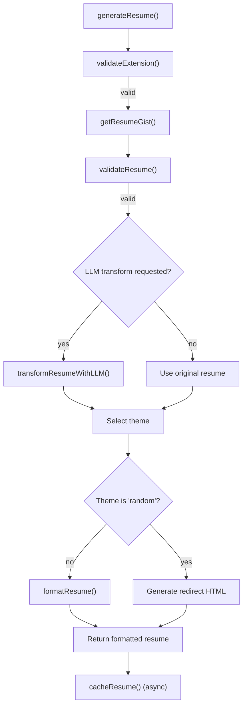
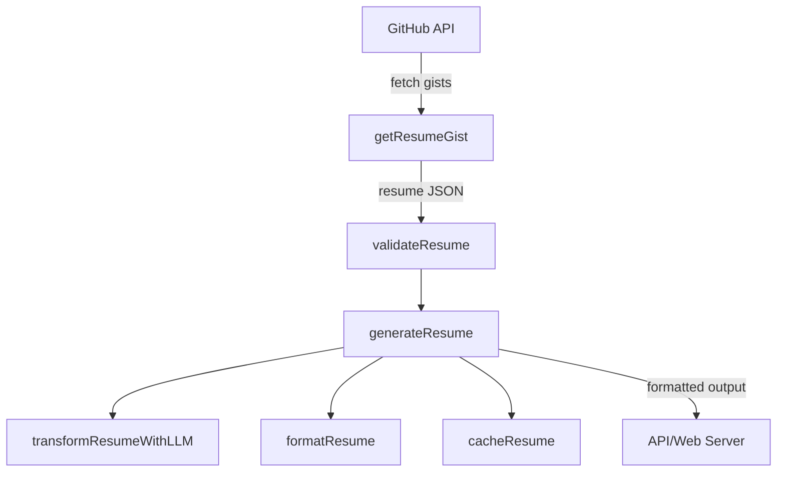
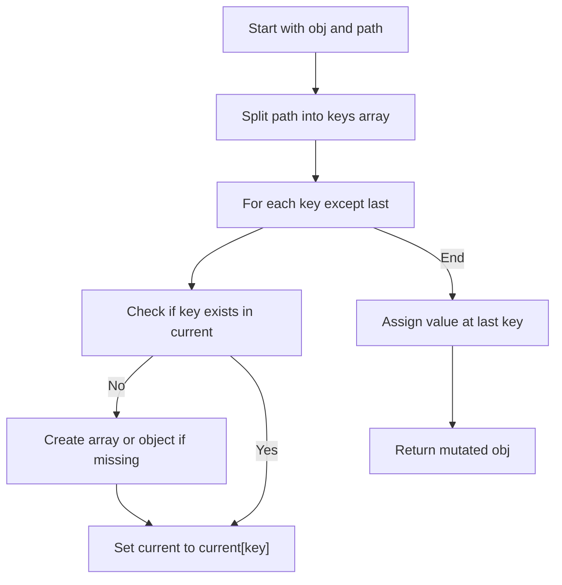
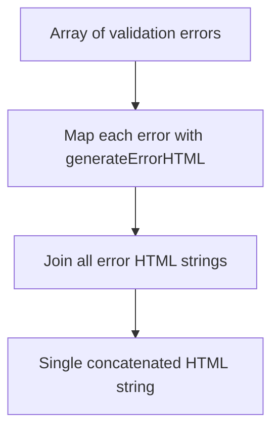
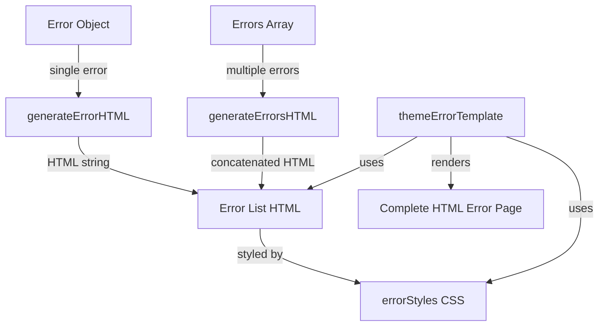
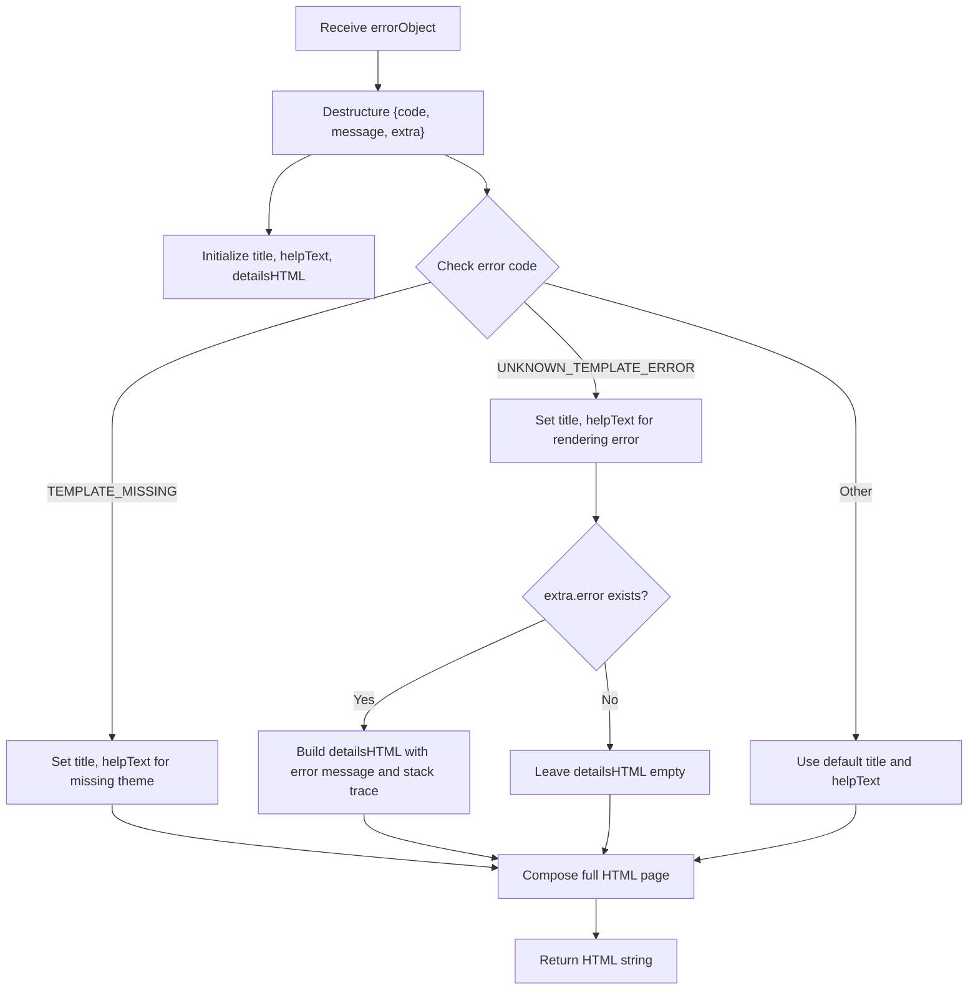

# Resume Generation

The resume generation subsystem orchestrates the process of retrieving, validating, optionally transforming, formatting, and caching user resumes. It supports multiple output formats, theme selection including random theme redirection, and integration with a large language model (LLM) for resume transformation based on user prompts.

## Purpose and Scope

This page documents the internal mechanisms of the resume generation pipeline, including validation of input parameters and resume data, fetching resumes from GitHub Gists, optional transformation using an LLM, formatting according to selected themes and output formats, and caching of resume data. It does not cover the implementation details of individual formatters or theme rendering engines beyond error handling. For error handling templates and theme error rendering, see the errorTemplate and themeErrorTemplate pages.

## Architecture Overview

The resume generation pipeline is composed of several cooperating components: input validation, resume retrieval from GitHub Gists, resume validation against a JSON schema, optional transformation via an LLM, formatting with a selected formatter and theme, and asynchronous caching of the resume data. The main entry point is the `generateResume` function, which coordinates these stages.



**Diagram: Data flow through the resume generation pipeline**

Sources: `apps/registry/lib/generateResume.js:10-125`, `apps/registry/lib/generateResume/validation.js:20-50`, `apps/registry/lib/getResumeGist.js:9-63`, `apps/registry/lib/generateResume/transformResumeWithLLM.js:63-123`, `apps/registry/lib/generateResume/formatResume.js:4-37`, `apps/registry/lib/generateResume/cacheResume.js:3-31`

## generateResume

**Purpose:** The central orchestrator that generates a resume output for a given username, output format, and optional query parameters including theme, gist name, and LLM prompt.

**Primary file:** `apps/registry/lib/generateResume.js:10-125`

**Key behaviors:**

- Extracts `theme`, `gistname`, and `llm` parameters from the query object.
- Validates the requested output extension using `validateExtension()`. Returns an error if invalid.
- Selects the appropriate formatter for the requested extension; returns an error if none exists.
- Retrieves the resume JSON from the user's GitHub Gist via `getResumeGist()`. Returns an error if retrieval fails.
- Validates the retrieved resume JSON against the schema using `validateResume()`. Returns validation errors if any.
- If an LLM prompt is provided, transforms the resume using `transformResumeWithLLM()`.
- Determines the theme to use based on query, resume metadata, or defaults to 'elegant'.
- If the theme is 'random', generates a redirect HTML page to a randomly selected theme.
- Asynchronously caches the raw resume data using `cacheResume()` without blocking the response.
- Formats the (possibly transformed) resume using the selected formatter and options.
- Returns the formatted content and headers or error objects as appropriate.

**How It Works:**

1. The function begins by destructuring the `theme`, `gistname`, and `llm` parameters from the query.
2. It validates the requested output format extension and ensures a formatter exists.
3. It calls `getResumeGist(username, gistname)` to fetch the resume JSON from GitHub.
4. The resume is validated against the JSON schema using `validateResume()`.
5. If an LLM prompt is provided, it calls `transformResumeWithLLM(resume, llm)` to apply user-specified transformations.
6. The theme is selected from the query, resume metadata, or defaults.
7. If the theme is 'random', it returns a redirect HTML page to a randomly chosen theme.
8. The resume is asynchronously cached to Supabase for future use.
9. Finally, the resume is formatted using the selected formatter and returned.

```javascript
const generateResume = async (username, extension = 'template', query = {}) => {
  const { theme, gistname, llm } = query;
  const formatter = formatters[extension];

  const { error: extensionError } = validateExtension(extension);
  if (extensionError) return extensionError;

  if (!formatter) {
    return buildError(ERROR_CODES.UNKNOWN_FORMATTER);
  }

  const { error: gistError, resume } = await getResumeGist(username, gistname);
  if (gistError) {
    return buildError(gistError);
  }

  const { error: validationError } = validateResume(resume);
  if (validationError) return validationError;

  let transformedResume = resume;
  if (llm) {
    transformedResume = await transformResumeWithLLM(resume, llm);
  }

  let selectedTheme = theme || transformedResume.meta?.theme || 'elegant';
  selectedTheme = selectedTheme.toLowerCase();

  if (selectedTheme === 'random') {
    const randomTheme = getRandomTheme();
    const redirectUrl = `/${username}?theme=${randomTheme}${gistname ? `&gistname=${gistname}` : ''}`;
    const redirectHtml = `...`; // HTML redirect page

    return {
      content: redirectHtml,
      headers: [{ key: 'Content-Type', value: 'text/html; charset=utf-8' }],
    };
  }

  (async () => {
    await cacheResume(username, resume);
  })();

  const options = { ...query, theme: selectedTheme, username };
  return formatResume(transformedResume, formatter, options);
};
```

Sources: `apps/registry/lib/generateResume.js:10-125`

## Extension Validation

**Purpose:** Ensures that the requested output format extension is supported by the system.

**Primary file:** `apps/registry/lib/generateResume/validation.js:20-26`

The system maintains a set of valid extensions (`EXTENSIONS`). The `validateExtension` function checks if the requested extension is in this set. If not, it returns an error object indicating an invalid extension.

```javascript
const validateExtension = (extension) => {
  if (!EXTENSIONS.has(extension)) {
    return { error: buildError(ERROR_CODES.INVALID_EXTENSION) };
  }
  return { error: null };
};
```

Sources: `apps/registry/lib/generateResume/validation.js:20-26`

## Resume Validation

**Purpose:** Validates the structure and content of the resume JSON against a predefined JSON schema to ensure correctness.

**Primary file:** `apps/registry/lib/generateResume/validation.js:28-50`

**Key behaviors:**

- Allows bypassing validation if the resume metadata contains `meta.skipValidation` set to true.
- Uses the `jsonschema` Validator to validate the resume against the schema.
- Returns detailed validation errors wrapped in an error object if validation fails.
- Returns no error if validation passes or is skipped.

```javascript
const validateResume = (resume) => {
  if (resume?.meta?.skipValidation === true) {
    logger.info(
      { skipValidation: true },
      'Schema validation bypassed via meta.skipValidation flag'
    );
    return { error: null };
  }

  const v = new Validator();
  const validation = v.validate(resume, schema);

  if (!validation.valid) {
    return {
      error: buildError(ERROR_CODES.RESUME_SCHEMA_ERROR, {
        validation: validation.errors,
      }),
    };
  }

  return { error: null };
};
```

Sources: `apps/registry/lib/generateResume/validation.js:28-50`

## Resume Caching

**Purpose:** Asynchronously caches the raw resume JSON data in a Supabase database keyed by username to support future features like resume history or analytics.

**Primary file:** `apps/registry/lib/generateResume/cacheResume.js:3-31`

**Key behaviors:**

- Skips caching if the `SUPABASE_KEY` environment variable is not set, avoiding errors in CI or test environments.
- Lazily imports the Supabase client to reduce startup overhead.
- Uses Supabase's `upsert` method to insert or update the resume record keyed by username.
- Logs errors if caching fails but does not propagate them, ensuring caching is non-blocking.

```javascript
const cacheResume = async (username, resume) => {
  const supabaseKey = process.env.SUPABASE_KEY;
  if (!supabaseKey) {
    logger.debug('Skipping resume caching: SUPABASE_KEY not configured');
    return;
  }

  try {
    const { createClient } = require('@supabase/supabase-js');
    const supabaseUrl = 'https://itxuhvvwryeuzuyihpkp.supabase.co';
    const supabase = createClient(supabaseUrl, supabaseKey);

    await supabase
      .from('resumes')
      .upsert(
        {
          username,
          resume: JSON.stringify(resume),
          updated_at: new Date(),
        },
        { onConflict: 'username' }
      )
      .select();
  } catch (error) {
    logger.error({ error: error.message, username }, 'Failed to cache resume');
  }
};
```

Sources: `apps/registry/lib/generateResume/cacheResume.js:3-31`

## Resume Formatting

**Purpose:** Converts the resume JSON into the requested output format using the selected formatter and theme, handling errors related to missing or faulty themes.

**Primary file:** `apps/registry/lib/generateResume/formatResume.js:4-37`

**Key behaviors:**

- Calls the formatter's `format` method with the resume and options.
- Catches and logs errors during formatting.
- Returns a specific error if the theme is missing.
- Returns a generic template error with full error details for other failures.
- Returns the formatted content and optional headers on success.

```javascript
const formatResume = async (resume, formatter, options) => {
  let formatted = {};
  const themeName = options?.theme || 'unknown';

  try {
    formatted = await formatter.format(resume, options);
  } catch (e) {
    logger.error(
      { themeName, error: e.message, stack: e.stack },
      'Theme rendering error'
    );

    if (e.message === 'theme-missing') {
      return {
        error: buildError(ERROR_CODES.TEMPLATE_MISSING, { themeName }),
      };
    }

    return {
      error: buildError(ERROR_CODES.UNKNOWN_TEMPLATE_ERROR, {
        themeName,
        error: {
          message: e.message,
          stack: e.stack,
          name: e.name,
        },
      }),
    };
  }

  return { content: formatted.content, headers: formatted.headers || [] };
};
```

Sources: `apps/registry/lib/generateResume/formatResume.js:4-37`

## Resume Transformation with LLM

**Purpose:** Applies user-specified transformations to the resume JSON using a large language model (LLM), returning a modified resume with only the requested changes applied.

**Primary file:** `apps/registry/lib/generateResume/transformResumeWithLLM.js:63-123`

**Key behaviors:**

- Skips transformation if the `OPENAI_API_KEY` environment variable is not set.
- Skips transformation if the prompt is empty or invalid.
- Sends only essential resume fields (basics, first 5 work entries, first 10 skills, education) to the LLM to reduce token usage.
- Uses a system prompt instructing the LLM to return only a JSON object with changed fields.
- Parses the LLM response to extract JSON changes enclosed in markdown code blocks.
- Applies the changes to a deep copy of the original resume using a helper function.
- Logs timing and errors during the transformation process.
- Returns the original resume if any error occurs.

```javascript
async function transformResumeWithLLM(resume, prompt) {
  if (!process.env.OPENAI_API_KEY) {
    logger.warn('OPENAI_API_KEY not set, skipping LLM transformation');
    return resume;
  }

  if (!prompt || typeof prompt !== 'string' || prompt.trim().length === 0) {
    return resume;
  }

  const startTime = Date.now();

  try {
    logger.info(
      { prompt: prompt.substring(0, 100) },
      'Starting LLM resume transformation'
    );

    const essentialResume = {
      basics: resume.basics,
      work: resume.work?.slice(0, 5),
      skills: resume.skills?.slice(0, 10),
      education: resume.education,
    };

    const result = await generateText({
      model: openai('gpt-4.1-mini'),
      system: SYSTEM_PROMPT,
      prompt: `Resume:\n${JSON.stringify(
        essentialResume,
        null,
        2
      )}\n\nRequest: ${prompt}\n\nReturn ONLY a JSON object with the changed fields.`,
    });

    const duration = Date.now() - startTime;
    logger.info(
      { duration, prompt: prompt.substring(0, 100) },
      'LLM transformation completed'
    );

    const text = result.text.trim();
    const jsonMatch = text.match(/```(?:json)?\s*([\s\S]*?)```/) || [
      null,
      text,
    ];
    const jsonStr = jsonMatch[1].trim();
    const changes = JSON.parse(jsonStr);

    return applyChanges(resume, changes);
  } catch (error) {
    logger.error(
      { error: error.message, prompt: prompt.substring(0, 100) },
      'LLM transformation failed'
    );
    return resume;
  }
}
```

Sources: `apps/registry/lib/generateResume/transformResumeWithLLM.js:63-123`

## GitHub Gist Resume Retrieval

**Purpose:** Fetches the resume JSON from a user's GitHub Gist, optionally using a specified gist filename, handling errors related to network, JSON parsing, and gist existence.

**Primary file:** `apps/registry/lib/getResumeGist.js:9-63`

**Key behaviors:**

- Requests the list of gists for the user via GitHub API, optionally using a GitHub token for authentication.
- Searches the gists for a file matching the requested gist name.
- Returns an error if the gist or file does not exist.
- Fetches the raw JSON content of the gist file.
- Returns errors for JSON parsing failures or unknown gist errors.
- Returns the parsed resume JSON on success.

```javascript
const getResumeGist = async (username, gistname = RESUME_GIST_NAME) => {
  let gistData = null;
  try {
    gistData = await axios.get(
      `https://api.github.com/users/${username}/gists?per_page=100`,
      {
        headers: {
          ...(GITHUB_TOKEN ? { Authorization: 'Bearer ' + GITHUB_TOKEN } : {}),
        },
      }
    );
  } catch (e) {
    logger.error({ error: e.message, username }, 'Failed to fetch gists');
    return buildError(ERROR_CODES.INVALID_USERNAME);
  }

  if (!gistData.data) {
    return buildError(ERROR_CODES.GIST_UNKNOWN_ERROR);
  }

  const resumeUrl = find(gistData.data, (f) => {
    return f.files[gistname];
  });

  if (!resumeUrl) {
    return buildError(ERROR_CODES.NON_EXISTENT_GIST);
  }

  const gistId = resumeUrl.id;

  let resumeRes = {};

  try {
    const fullResumeGistUrl = `https://gist.githubusercontent.com/${username}/${gistId}/raw?cachebust=${new Date().getTime()}`;

    resumeRes = await axios({
      method: 'GET',
      headers: { 'content-type': 'application/json' },
      url: fullResumeGistUrl,
    });
  } catch (e) {
    if (e.message?.includes('JSON') || e.name === 'SyntaxError') {
      return buildError(ERROR_CODES.RESUME_NOT_VALID_JSON);
    }
    return buildError(ERROR_CODES.GIST_UNKNOWN_ERROR);
  }

  if (typeof resumeRes.data !== 'object' || resumeRes.data === null) {
    return buildError(ERROR_CODES.RESUME_NOT_VALID_JSON);
  }

  return { resume: resumeRes.data };
};
```

Sources: `apps/registry/lib/getResumeGist.js:9-63`

## Key Relationships

The resume generation subsystem depends on:

- The GitHub API for fetching user gists (`getResumeGist`).
- The JSON schema and validator for resume validation (`validateResume`).
- Formatters keyed by output extension for rendering resumes (`formatResume`).
- The OpenAI API for optional LLM-based resume transformation (`transformResumeWithLLM`).
- Supabase for asynchronous caching of resume data (`cacheResume`).
- Error construction utilities for consistent error reporting (`buildError`).

It is a core component feeding formatted resume content to downstream consumers such as web servers or API endpoints.



**Relationships to adjacent subsystems**

Sources: `apps/registry/lib/generateResume.js:10-125`, `apps/registry/lib/getResumeGist.js:9-63`, `apps/registry/lib/generateResume/validation.js:28-50`

## `setByPath`, `keys`, `current`, `i`, `nextKey`, `isNextArray` in apps/registry/lib/generateResume/transformResumeWithLLM.js

### Introduction

These symbols collectively implement a utility to deeply set a value within a nested JavaScript object using a dot-notation path string. This mechanism is critical for applying partial updates to deeply nested resume objects based on changes computed by the LLM. It handles both object and array structures dynamically, ensuring the path exists before assignment.

### `setByPath` (function)

**Purpose**: Mutates an object by setting a value at a nested location specified by a dot-separated path string, creating intermediate objects or arrays as needed.

**Parameters**:  
- `obj` (`Object`): The target object to modify.  
- `path` (`string`): Dot-notation string specifying the nested property path (e.g., `"work.0.summary"`).  
- `value` (`any`): The value to assign at the specified path.

**Behavior**:  
- Splits the `path` into keys by `.` delimiter.  
- Iterates through all keys except the last, traversing or creating nested objects or arrays as necessary.  
- Determines whether to create an array or object for the next key by checking if the next key is a numeric index (`isNextArray`).  
- Assigns the `value` to the final key in the path.

**Edge cases and tradeoffs**:  
- Numeric keys are interpreted as array indices, enabling support for array item updates.  
- If intermediate keys do not exist, they are created as empty arrays or objects based on the next key type, which avoids runtime errors but may silently create unexpected structures if the path is malformed.  
- Does not validate existing types at intermediate keys; overwrites if incompatible.

```js
function setByPath(obj, path, value) {
  const keys = path.split('.');
  let current = obj;

  for (let i = 0; i < keys.length - 1; i++) {
    const key = keys[i];
    const nextKey = keys[i + 1];
    const isNextArray = !isNaN(parseInt(nextKey, 10));

    if (!(key in current)) {
      current[key] = isNextArray ? [] : {};
    }
    current = current[key];
  }

  current[keys[keys.length - 1]] = value;
}
```

### `keys` (variable)

**Purpose**: Holds the array of keys derived from splitting the dot-notation path string inside `setByPath`.

**Type**: `string[]`

**Scope**: Local to `setByPath`.

**Role**: Drives the traversal and creation of nested objects or arrays by enumerating each segment of the path.

### `current` (variable)

**Purpose**: Tracks the current nested object or array being traversed or created during the path iteration in `setByPath`.

**Type**: `Object | Array`

**Scope**: Local to `setByPath`.

**Role**: Moves stepwise down the nested structure, allowing assignment or creation of intermediate containers.

### `i` (variable)

**Purpose**: Loop index variable used in `setByPath` to iterate over the path keys except the last.

**Type**: `number`

**Scope**: Local to `setByPath`.

**Role**: Controls traversal depth and indexing into the keys array.

### `nextKey` (variable)

**Purpose**: Holds the next key in the path during iteration, used to determine if the next container should be an array or object.

**Type**: `string`

**Scope**: Local to `setByPath`.

**Role**: Enables lookahead to decide container type for the next level in the nested structure.

### `isNextArray` (variable)

**Purpose**: Boolean flag indicating whether the next key in the path is numeric, implying the next container should be an array.

**Type**: `boolean`

**Scope**: Local to `setByPath`.

**Role**: Guides dynamic creation of arrays vs objects when intermediate keys are missing.

---

**Diagram: Data flow inside `setByPath` for nested path assignment**



**Caption**: Internal control flow of `setByPath` showing key splitting, traversal, container creation, and final assignment.  
Sources: `apps/registry/lib/generateResume/transformResumeWithLLM.js:24-40`

---

## `ERROR_CODE_MESSAGES` in apps/registry/lib/error/buildError.js

### Introduction

`ERROR_CODE_MESSAGES` is a frozen object mapping predefined error codes to human-readable error messages. It centralizes error message definitions for consistent user-facing feedback across the resume registry system.

### Description

- **Type**: `Readonly<Record<string, string>>` — an immutable object mapping error code strings to message strings.  
- **Purpose**: Provides descriptive, user-friendly messages corresponding to internal error codes used throughout the system.  
- **Usage**: Used by the `buildError` function to construct error objects with standardized messages.

### Contents

| Error Code           | Message                                                                                         |
|----------------------|-------------------------------------------------------------------------------------------------|
| INVALID_USERNAME     | "This is not a valid Github username"                                                          |
| NON_EXISTENT_GIST    | "You have no gists named resume.json or your gist is private"                                  |
| GIST_UNKNOWN_ERROR   | "Cannot fetch gist, no idea why"                                                               |
| RESUME_SCHEMA_ERROR  | "Your resume does not conform to the schema, visit https://jsonresume.org/schema/ to double check why. But the error message below should contain all the information you need." |
| TEMPLATE_MISSING     | "This theme is currently unsupported. Please visit this Github issue to request it https://github.com/jsonresume/jsonresume.org/issues/36 (unfortunately we have recently (11/2023) disabled a bunch of legacy themes due to critical flaws in them, please request if you would like them back.)" |
| UNKNOWN_TEMPLATE_ERROR | "Cannot format resume, the theme you are using has encountered an error. You will have to get in contact with the theme developer yourself or you may be missing fields that the template requires." |
| INVALID_EXTENSION    | "We only support the following extensions: json, html, yaml, tex, txt, qr, rendercv, agent, template" |
| UNKNOWN_FORMATTER    | "This is a valid extension but we do not have a formatter for it. Please visit github issues."  |
| RESUME_NOT_VALID_JSON | "Your resume is not valid JSON. Find an online JSON validator to help you debug this."          |

### Characteristics

- The object is frozen to prevent runtime modification, ensuring message consistency.  
- Messages include URLs for user guidance and contextual information for troubleshooting.  
- Error codes are used as keys elsewhere in the system to identify specific failure modes.

---

## `errorsHTML` and `errorCount` in apps/registry/lib/errorTemplate.js

### Introduction

Within the `errorTemplate` function, `errorsHTML` and `errorCount` represent the rendered HTML for individual validation errors and the total number of such errors, respectively. They form the core of the error reporting UI for resume validation failures.

### `errorsHTML` (variable)

**Purpose**: Contains the concatenated HTML markup representing each validation error in the resume.

**Type**: `string`

**Scope**: Local to `errorTemplate` function.

**Value source**: Generated by calling `generateErrorsHTML` with the array of validation errors (`errorObject.extra.validation`).

**Role**: Injected into the error page template to display detailed error messages in a user-readable format.

### `errorCount` (variable)

**Purpose**: Holds the count of validation errors present in the resume.

**Type**: `number`

**Scope**: Local to `errorTemplate` function.

**Value source**: Computed as the length of the validation errors array (`errorObject.extra.validation.length`).

**Role**: Used to dynamically render pluralization and summary information in the error page, such as "1 validation error" vs "N validation errors".

---

## `generateErrorHTML` in apps/registry/lib/errorTemplate/generateErrorHTML.js

### Introduction

`generateErrorHTML` is a function that produces a detailed HTML snippet for a single validation error object. It formats error metadata and user-friendly messages into structured markup for display in the resume validation error page.

### Signature

```js
export const generateErrorHTML = (error, index) => string;
```

- `error` (object): A validation error object containing properties such as `property`, `message`, `instance`, `schema`, and `stack`.  
- `index` (number): The zero-based index of the error in the error list, used for numbering.

### Behavior and Structure

- Extracts and transforms the error's `property` path into a more readable format by removing the `"instance."` prefix and replacing dots with arrows (`→`).  
- Uses the `message` property directly as a user-friendly error description.  
- Checks if the error has an `instance` value to optionally display the current invalid value.  
- Renders a collapsible `<details>` section containing technical details: the full property path, expected schema snippet (if present), and error stack trace (if present).  
- Wraps all content in a list item `<li>` with CSS classes for styling.

### Output Example (simplified)

```html
<li class="error-item">
  <div class="error-header">
    <span class="error-number">1.</span>
    <span class="error-path">basics → email</span>
  </div>
  <div class="error-message">Invalid email format</div>
  <div class="error-value">
    <strong>Current value:</strong>
    <code>"not-an-email"</code>
  </div>
  <details class="error-details">
    <summary>Technical details</summary>
    <div class="technical-info">
      <div><strong>Property:</strong> instance.basics.email</div>
      <div><strong>Expected schema:</strong> <code>{...}</code></div>
      <div><strong>Stack:</strong> ValidationError: ...</div>
    </div>
  </details>
</li>
```

### Supporting Variable Descriptions

- `propertyPath`: Raw JSON Schema property path from the error object, defaulting to `"root"` if missing.  
- `readablePath`: Transformed property path for display, with `"instance."` prefix removed and dots replaced by arrows.  
- `friendlyMessage`: The error's user-facing message string.  
- `hasInstance`: Boolean indicating presence of the `instance` property, which holds the invalid value.

---

### `generateErrorsHTML` (variable)

**Purpose**: Aggregates multiple validation errors into a single HTML string by mapping over the array of errors and invoking `generateErrorHTML` on each.

**Type**: `(errors: Array<object>) => string`

**Behavior**:  
- Accepts an array of validation error objects.  
- Returns a concatenated string of `<li>` elements representing each error.

---

**Diagram: Error HTML generation flow**



**Caption**: Flow of generating a complete HTML fragment for all validation errors by mapping individual errors to HTML and concatenating.  
Sources: `apps/registry/lib/errorTemplate/generateErrorHTML.js:1-55`, `apps/registry/lib/errorTemplate.js:4-44`

---

## resume-generation (supplement)

This supplement documents internal variables and functions related to error HTML generation and theme error rendering within the resume-generation system. These symbols are primarily responsible for transforming error objects into user-friendly HTML representations, styling those representations, and generating comprehensive error pages for theme-related failures. This documentation focuses on the internal mechanics of these utilities, including how error details are extracted, formatted, and styled for display in the web UI or error pages.

For the core resume generation flow, see the main resume-generation documentation. For theme error handling, see the theme error rendering subsystem documentation.

---

## `propertyPath` (variable) in apps/registry/lib/errorTemplate/generateErrorHTML.js

**Purpose:**  
`propertyPath` extracts the raw property path string from an error object to identify the location within the resume data where the error occurred.

**Details:**  
- Derived from `error.property` if present; otherwise defaults to the string `'root'`.  
- Represents the JSON path to the erroneous property in dot notation, often prefixed with `"instance."`.  
- Serves as the canonical source for generating a more human-readable path (`readablePath`).  

**Example:**  
If an error object has `property: "instance.basics.email"`, then `propertyPath` will be `"instance.basics.email"`. If no property is specified, it will be `"root"`.

**Usage Context:**  
Used internally within `generateErrorHTML` to identify the error location for display and further processing. It is not exposed externally.

Sources: `apps/registry/lib/errorTemplate/generateErrorHTML.js:3-3`

---

## `readablePath` (variable) in apps/registry/lib/errorTemplate/generateErrorHTML.js

**Purpose:**  
`readablePath` converts the raw `propertyPath` into a more user-friendly, visually clear string that indicates the path to the error within the resume data.

**Details:**  
- Removes the `"instance."` prefix from the path to avoid redundant technical jargon.  
- Replaces all remaining dots (`.`) with the Unicode right arrow character (`→`) surrounded by spaces, improving readability and visual hierarchy.  
- If the resulting string is empty (e.g., when the original path was `"instance"`), it falls back to the label `"Document root"`.  

**Example:**  
Given `propertyPath = "instance.basics.email"`, `readablePath` becomes `"basics → email"`.  
Given `propertyPath = "root"`, `readablePath` becomes `"Document root"`.

**Usage Context:**  
Displayed prominently in the error header within the generated HTML to help users quickly identify the error location.

Sources: `apps/registry/lib/errorTemplate/generateErrorHTML.js:4-6`

---

## `friendlyMessage` (variable) in apps/registry/lib/errorTemplate/generateErrorHTML.js

**Purpose:**  
`friendlyMessage` holds the user-facing error message extracted directly from the error object.

**Details:**  
- Assigned from `error.message` without modification.  
- Represents a concise, human-readable explanation of the validation or processing failure.  
- Does not perform additional formatting or sanitization here; it is assumed safe for direct HTML insertion.  

**Example:**  
If an error object has `message: "should be string"`, then `friendlyMessage` will be `"should be string"`.

**Usage Context:**  
Rendered inside the `.error-message` div in the generated error HTML, providing the main textual description of the error.

Sources: `apps/registry/lib/errorTemplate/generateErrorHTML.js:9-9`

---

## `hasInstance` (variable) in apps/registry/lib/errorTemplate/generateErrorHTML.js

**Purpose:**  
`hasInstance` is a boolean flag indicating whether the error object includes a current value instance related to the error.

**Details:**  
- Evaluates to `true` if `error.instance` is neither `undefined` nor `null`.  
- This check distinguishes between errors that have a concrete value snapshot and those that do not.  
- The presence of `instance` allows displaying the actual erroneous value in the error details.  

**Example:**  
If `error.instance = "abc@example.com"`, then `hasInstance` is `true`.  
If `error.instance = null` or `error.instance` is missing, `hasInstance` is `false`.

**Usage Context:**  
Controls conditional rendering of the "Current value" section in the error HTML, showing the JSON-stringified value of the erroneous data.

Sources: `apps/registry/lib/errorTemplate/generateErrorHTML.js:10-10`

---

## `generateErrorHTML` (variable) in apps/registry/lib/errorTemplate/generateErrorHTML.js

**Purpose:**  
`generateErrorHTML` is a function that transforms a single error object into a detailed, styled HTML list item representing that error for display in an error report.

**Signature:**  
```js
(error: Object, index: number) => string
```

**Parameters:**  
- `error`: An error object containing properties such as `property`, `message`, `instance`, `schema`, and optionally `stack`.  
- `index`: The zero-based index of the error in the error list, used for numbering.

**Returns:**  
A string of HTML representing the error, including header, message, current value (if present), and expandable technical details.

**Internal Variables and Their Roles:**  
- `propertyPath`: Raw property path string from the error, defaulting to `'root'`.  
- `readablePath`: Human-readable path derived from `propertyPath` with `"instance."` removed and dots replaced by arrows.  
- `friendlyMessage`: The user-facing error message from `error.message`.  
- `hasInstance`: Boolean flag indicating presence of `error.instance`.

**HTML Structure Generated:**  
- `<li class="error-item">`: Root container for the error.  
- `.error-header`: Contains the error number and the readable property path.  
- `.error-message`: Displays the friendly error message.  
- `.error-value`: Conditionally included if `hasInstance` is true; shows the JSON-stringified current value of the erroneous property.  
- `<details class="error-details">`: Expandable section with technical details including:  
  - Property path.  
  - Expected schema (if present), JSON-formatted with indentation.  
  - Stack trace (if present).

**Edge Cases and Failure Modes:**  
- If `error.property` is missing or empty, the path defaults to `'root'` and displays as `"Document root"`.  
- If `error.instance` is `null` or `undefined`, the current value section is omitted to avoid misleading empty displays.  
- If `error.schema` or `error.stack` are missing, their respective sections are omitted gracefully.  
- The function does not sanitize inputs; it assumes error properties are safe for HTML insertion or properly escaped elsewhere.

**Example Output Fragment:**  
```html
<li class="error-item">
  <div class="error-header">
    <span class="error-number">1.</span>
    <span class="error-path">basics → email</span>
  </div>
  <div class="error-message">should be string</div>
  <div class="error-value">
    <strong>Current value:</strong>
    <code>"abc@example.com"</code>
  </div>
  <details class="error-details">
    <summary>Technical details</summary>
    <div class="technical-info">
      <div><strong>Property:</strong> instance.basics.email</div>
      <div><strong>Expected schema:</strong> <code>{ ... }</code></div>
      <div><strong>Stack:</strong> Error stack trace here</div>
    </div>
  </details>
</li>
```

**Usage Context:**  
Called by `generateErrorsHTML` to produce HTML for each error in a list. Intended for embedding in error report pages or UI components.

Sources: `apps/registry/lib/errorTemplate/generateErrorHTML.js:1-51`

---

## `generateErrorsHTML` (variable) in apps/registry/lib/errorTemplate/generateErrorHTML.js

**Purpose:**  
`generateErrorsHTML` aggregates multiple error objects into a single concatenated HTML string representing all errors as list items.

**Signature:**  
```js
(errors: Array<Object>) => string
```

**Parameters:**  
- `errors`: An array of error objects, each expected to have the shape consumed by `generateErrorHTML`.

**Returns:**  
A single string containing the concatenated HTML of all errors rendered as list items.

**Implementation Details:**  
- Maps over the `errors` array, invoking `generateErrorHTML` for each error with its index.  
- Joins the resulting array of HTML strings without any separator, producing a continuous block of list items.

**Example:**  
Given two errors in the array, the output will be two `<li class="error-item">...</li>` fragments concatenated.

**Usage Context:**  
Used to render the full list of validation or processing errors in the resume generation UI or reports.

Sources: `apps/registry/lib/errorTemplate/generateErrorHTML.js:53-55`

---

## `errorStyles` (variable) in apps/registry/lib/errorTemplate/errorStyles.js

**Purpose:**  
`errorStyles` is a large multiline string containing CSS styles that define the visual presentation of error reports generated by the error HTML templates.

**Content Overview:**  
- Global box-sizing reset for consistent layout.  
- Body styling with a system font stack and a gradient background.  
- Container styling for the error report box with padding, border-radius, and shadow.  
- Specific styles for warning boxes, headings, help text, and links.  
- List styling to remove default bullets and spacing.  
- `.error-item` styling for individual error entries, including border, background, padding, and hover shadow effect.  
- Flexbox layout for error headers aligning error number and path.  
- Monospace font usage for error paths and code blocks to improve readability.  
- Color theming with red tones for errors and blue tones for links and summaries.  
- Styling for expandable `<details>` and `<summary>` elements, including cursor and hover effects.  
- Technical info box styling with monospace font, background, padding, and scrollable code blocks.

**Key Style Classes and Their Roles:**

| CSS Class         | Purpose                                                                                   |
|-------------------|-------------------------------------------------------------------------------------------|
| `.error-container`| Main container for the error report with white background and shadow.                     |
| `.cache-warning`  | Special warning box with blue background and border for cache-related messages.           |
| `h1`              | Error page title styling with red color and spacing.                                     |
| `.help-text`      | Paragraphs providing guidance or help, styled with muted color and link styles.           |
| `ul`              | Removes default list styles for error lists.                                             |
| `.error-item`     | Individual error entry box with red left border and hover shadow.                         |
| `.error-header`   | Flex container for error number and path.                                                |
| `.error-number`   | Bold red numbering of errors.                                                            |
| `.error-path`     | Monospace, light background for property path display.                                   |
| `.error-message`  | Red text for the main error message.                                                     |
| `.error-value`    | Box showing the current erroneous value with monospace code styling.                     |
| `details`         | Margin and styling for expandable technical details.                                     |
| `.technical-info` | Box containing JSON schema and stack trace with monospace font and scrollable code blocks.|

**Edge Cases and Considerations:**  
- The styles assume modern browser support for CSS features like `details` and `summary`.  
- Scrollable code blocks prevent layout breakage on long JSON or stack traces.  
- Hover effects improve usability but do not affect accessibility semantics.

**Usage Context:**  
Injected into error pages or UI components to ensure consistent and readable error presentation.

Sources: `apps/registry/lib/errorTemplate/errorStyles.js:1-172`

---

## `{ code, message, extra }` (variable) in apps/registry/lib/themeErrorTemplate.js

**Purpose:**  
This destructured object extracts key properties from the `errorObject` parameter passed to `themeErrorTemplate`, representing the core error metadata for theme-related failures.

**Details:**  
- `code` (string): A symbolic error code indicating the type of theme error, e.g., `'TEMPLATE_MISSING'` or `'UNKNOWN_TEMPLATE_ERROR'`.  
- `message` (string): A human-readable error message describing the failure.  
- `extra` (object | undefined): An optional object containing additional context or metadata about the error, such as `themeName` or an embedded `error` object with stack trace.

**Example:**  
```js
{
  code: 'TEMPLATE_MISSING',
  message: 'Theme not found',
  extra: { themeName: 'modern' }
}
```

**Usage Context:**  
Used to customize the error page title, help text, and detailed error information based on the error type and context.

Sources: `apps/registry/lib/themeErrorTemplate.js:10-10`

---

## `title` (variable) in apps/registry/lib/themeErrorTemplate.js

**Purpose:**  
`title` holds the main heading text for the generated HTML error page, reflecting the nature of the theme error.

**Details:**  
- Initialized to a default value `'⚠️ Theme Error'`.  
- Conditionally overridden based on the `code` property of the error:  
  - `'TEMPLATE_MISSING'` sets title to `'🎨 Theme Not Found'`.  
  - `'UNKNOWN_TEMPLATE_ERROR'` sets title to `'💥 Theme Rendering Error'`.  
- The title is inserted into the `<title>` tag and the main `<h1>` heading of the error page.

**Usage Context:**  
Provides immediate visual context to users about the type of theme error encountered.

Sources: `apps/registry/lib/themeErrorTemplate.js:13-13`

---

## `helpText` (variable) in apps/registry/lib/themeErrorTemplate.js

**Purpose:**  
`helpText` contains the explanatory HTML content displayed beneath the title on the theme error page, guiding users on the cause and potential remedies.

**Details:**  
- Defaults to the raw `message` string from the error object.  
- For `'TEMPLATE_MISSING'` errors, it is replaced with a detailed HTML snippet explaining possible reasons for the missing theme, including:  
  - Nonexistent npm package.  
  - Deprecated or removed theme.  
  - Misspelled theme name.  
  - Links to request support or browse available themes.  
- For `'UNKNOWN_TEMPLATE_ERROR'`, it explains common causes such as missing required fields, theme bugs, or incompatible data formats.  
- If an embedded error object is present in `extra.error`, it appends detailed error message and stack trace sections with developer-oriented guidance.

**Usage Context:**  
Displayed prominently in the error page body to assist users in diagnosing and resolving theme errors.

Sources: `apps/registry/lib/themeErrorTemplate.js:14-14`

---

## `detailsHTML` (variable) in apps/registry/lib/themeErrorTemplate.js

**Purpose:**  
`detailsHTML` holds optional, detailed HTML markup containing technical error information such as error messages and stack traces for theme rendering errors.

**Details:**  
- Initialized as an empty string.  
- Populated only for `'UNKNOWN_TEMPLATE_ERROR'` when `extra.error` is present.  
- Includes:  
  - A boxed section with the error message, escaped for HTML safety.  
  - An expandable `<details>` element containing the stack trace, also escaped.  
  - A concluding help paragraph suggesting trying a different theme or reporting the issue.  
- Uses the internal `escapeHTML` function to prevent XSS vulnerabilities by escaping special characters in error messages and stack traces.

**Usage Context:**  
Inserted into the error page to provide developers and advanced users with the raw error context necessary for debugging theme rendering issues.

Sources: `apps/registry/lib/themeErrorTemplate.js:15-15`

---

## How It Works: Error HTML Generation and Theme Error Rendering



**Diagram: Data flow from error objects through HTML generation and styling to final error page output**

Sources: `apps/registry/lib/errorTemplate/generateErrorHTML.js:1-55`, `apps/registry/lib/errorTemplate/errorStyles.js:1-172`, `apps/registry/lib/themeErrorTemplate.js:9-170`

- The system receives error objects from validation or theme rendering failures.  
- `generateErrorHTML` converts each error into a detailed HTML list item, extracting and formatting key properties (`propertyPath`, `readablePath`, `friendlyMessage`, `hasInstance`).  
- `generateErrorsHTML` aggregates multiple such items into a single HTML block.  
- `errorStyles` provides comprehensive CSS styling to ensure consistent and readable presentation of error reports.  
- `themeErrorTemplate` composes a full HTML error page for theme errors, using destructured `{ code, message, extra }` to customize the page title, help text, and detailed error sections (`detailsHTML`).  
- The final output is a complete, styled HTML page suitable for display in browsers, providing both user-friendly messages and developer diagnostics.

---

## `themeErrorTemplate` (function)

**Purpose**: Generates a comprehensive, user-friendly HTML error page tailored for theme-related errors encountered during resume rendering. It transforms structured error data into a styled, informative webpage that aids users and developers in diagnosing and resolving theme issues.

**Primary file**: `apps/registry/lib/themeErrorTemplate.js:9-157`

### Overview

`themeErrorTemplate` accepts an error object produced by the build error pipeline and returns a complete HTML document as a string. This document visually communicates the nature of the theme error, contextual help, and detailed debugging information when available. It centralizes error presentation logic for theme failures, ensuring consistent UX across different error scenarios.

### Input Parameter

| Field | Type | Purpose |
|-------|------|---------|
| `errorObject` | `Object` | The error object generated by `buildError()`, containing `code`, `message`, and optional `extra` data. `apps/registry/lib/themeErrorTemplate.js:10-10` |

The function destructures the input as:

```js
const { code, message, extra } = errorObject;
```

- `code` (string): Identifies the error type.
- `message` (string): The primary error message.
- `extra` (object | undefined): Additional contextual data, such as theme name or nested error details.

### Internal Variables

| Variable | Type | Purpose |
|----------|------|---------|
| `title` | `string` | The HTML page title and main heading, initialized to a generic theme error label. `apps/registry/lib/themeErrorTemplate.js:13-13` |
| `helpText` | `string` | HTML snippet providing user guidance or explanation, initialized to the error message. `apps/registry/lib/themeErrorTemplate.js:14-14` |
| `detailsHTML` | `string` | HTML block containing detailed error information, such as stack traces, initially empty. `apps/registry/lib/themeErrorTemplate.js:15-15` |

### Behavior by Error Code

The function distinguishes error handling based on `code`:

#### `TEMPLATE_MISSING`

- Sets `title` to "Theme Not Found".
- Constructs `helpText` with HTML explaining possible reasons for the missing theme:
  - Nonexistent npm package.
  - Deprecated or removed theme.
  - Misspelled theme name.
- Provides links to request theme support or browse available themes.
- Does not populate `detailsHTML`.

#### `UNKNOWN_TEMPLATE_ERROR`

- Sets `title` to "Theme Rendering Error".
- Sets `helpText` to explain common causes:
  - Missing required resume fields.
  - Bugs in theme code.
  - Incompatible resume data format.
- If `extra.error` exists, `detailsHTML` includes:
  - An error details box with the escaped error message.
  - A collapsible stack trace for developers if available.
  - A help paragraph suggesting trying different themes or reporting bugs.

### HTML Output Structure

The returned HTML string includes:

- `<!DOCTYPE html>` and `<html lang="en">` root.
- `<head>` with:
  - UTF-8 charset and viewport meta tags.
  - `<title>` set to `title`.
  - Injected CSS styles from `errorStyles` import.
  - Inline styles for error presentation, including:
    - `.help-list` for bullet points.
    - `.error-details-box` for error detail container.
    - `.error-message-box` for message formatting.
    - `.stack-trace` for collapsible stack trace with syntax highlighting.
- `<body>` containing:
  - A container with `<h1>` for the error title.
  - A div with `helpText` HTML.
  - The optional `detailsHTML` block.

### Styling and UX Considerations

- Uses semantic HTML and ARIA-friendly elements (`<details>`, `<summary>`) for stack trace toggling.
- Applies color-coded styling to error messages and stack traces for readability.
- Escapes all injected error strings to prevent XSS vulnerabilities.
- Provides actionable links for users to seek support or switch themes.

### Edge Cases and Failure Modes

- If `extra.themeName` is missing or undefined, the template substitutes `"unknown"` to avoid empty placeholders.
- If `extra.error.message` is missing, falls back to `extra.error.toString()` for error message display.
- If `extra.error.stack` is absent, omits the stack trace section gracefully.
- If the error code is unrecognized, defaults to a generic theme error page with minimal help text.
- The function assumes `errorObject` is well-formed; no explicit validation or error handling inside the template.

### Internal Flowchart



**Diagram: Control flow and decision branches inside `themeErrorTemplate`**

Sources: `apps/registry/lib/themeErrorTemplate.js:9-157`

---

## `{ code, message, extra }` (variable)

**Purpose**: Represents the destructured components of the input error object passed to `themeErrorTemplate`. These variables capture the core error metadata and contextual information required to generate the error page.

**Location**: `apps/registry/lib/themeErrorTemplate.js:10-10`

### Description

- `code` (`string`): The error type identifier, used to select the appropriate error message and page layout.
- `message` (`string`): The primary human-readable error message describing the failure.
- `extra` (`object | undefined`): Optional additional data providing context such as:
  - `themeName` (`string`): The name of the theme involved in the error.
  - `error` (`Error` object): Nested error details including message and stack trace.

### Usage

These variables are extracted immediately from the input parameter to drive conditional logic for error page customization. Their presence and values determine the content and structure of the generated HTML.

### Edge Cases

- `extra` may be `undefined` or missing expected fields, requiring safe optional chaining (`extra?.themeName`).
- `code` values outside the recognized set result in a generic error page.

Sources: `apps/registry/lib/themeErrorTemplate.js:9-15`

---

## `title` (variable)

**Purpose**: Holds the string used as the HTML document title and main heading (`<h1>`) in the error page generated by `themeErrorTemplate`.

**Location**: `apps/registry/lib/themeErrorTemplate.js:13-13`

### Description

- Initialized to a default string `"⚠️ Theme Error"`.
- Overwritten conditionally based on the error `code`:
  - `"🎨 Theme Not Found"` for `TEMPLATE_MISSING`.
  - `"💥 Theme Rendering Error"` for `UNKNOWN_TEMPLATE_ERROR`.
- Used verbatim in the `<title>` tag and the page’s main heading.

### Role in UX

The `title` variable provides immediate visual context to the user about the nature of the error, improving clarity and reducing confusion.

Sources: `apps/registry/lib/themeErrorTemplate.js:13-40`

---

## `helpText` (variable)

**Purpose**: Contains the HTML snippet that explains the error to the user, providing guidance, possible causes, and links to resources.

**Location**: `apps/registry/lib/themeErrorTemplate.js:14-14`

### Description

- Initially set to the raw error message string.
- Replaced with detailed HTML content depending on the error `code`:
  - For `TEMPLATE_MISSING`, explains why the theme could not be loaded and offers links to request support or browse themes.
  - For `UNKNOWN_TEMPLATE_ERROR`, lists common causes of rendering failures.
- Rendered inside a `<div class="help-text">` in the output HTML.

### Characteristics

- Contains semantic HTML elements: paragraphs, unordered lists, strong tags, and anchor links.
- Uses template literals to interpolate dynamic values like `extra?.themeName`.
- Provides actionable information to users, reducing support burden.

Sources: `apps/registry/lib/themeErrorTemplate.js:14-70`

---

## `detailsHTML` (variable)

**Purpose**: Holds an optional HTML block with detailed error diagnostics, including error messages and stack traces, intended primarily for developers or advanced users.

**Location**: `apps/registry/lib/themeErrorTemplate.js:15-15`

### Description

- Initialized as an empty string.
- Populated only when the error `code` is `UNKNOWN_TEMPLATE_ERROR` and `extra.error` is present.
- Contains:
  - A container with a heading "Error Details".
  - A box showing the escaped error message.
  - A collapsible `<details>` element with the escaped stack trace if available.
  - A help paragraph suggesting alternative themes or issue reporting.
- Injected into the final HTML output below the main help text.

### Security Considerations

- All error messages and stack traces are escaped using `escapeHTML` to prevent injection attacks.

### UX Considerations

- The stack trace is hidden by default, reducing noise for typical users but accessible for debugging.
- The error details box uses distinct styling to visually separate it from general help text.

Sources: `apps/registry/lib/themeErrorTemplate.js:70-150`

---

## `escapeHTML` (function)

**Purpose**: Sanitizes input strings by escaping HTML special characters to prevent cross-site scripting (XSS) vulnerabilities when injecting dynamic content into the error page.

**Primary file**: `apps/registry/lib/themeErrorTemplate.js:162-170`

### Signature

```js
function escapeHTML(str: string): string | any
```

### Parameters

- `str` (`string`): The input string to sanitize. If the input is not a string, it is returned unchanged.

### Returns

- A string with the following substitutions applied:
  - `&` → `&amp;`
  - `<` → `&lt;`
  - `>` → `&gt;`
  - `"` → `&quot;`
  - `'` → `&#039;`
- Non-string inputs are returned as-is, preserving their original type.

### Implementation Details

The function uses a chain of `.replace()` calls with global regexes to replace all occurrences of the special characters. This ensures that any user-supplied or error-derived content embedded in the HTML is safe from injection.

### Usage Context

`escapeHTML` is used exclusively within `themeErrorTemplate` to sanitize error messages and stack traces before embedding them in the HTML output.

### Edge Cases

- Passing non-string values (e.g., `undefined`, `null`, objects) returns the value unchanged, which may lead to unexpected output if not handled upstream.
- The function does not perform any other transformations beyond escaping these five characters.

Sources: `apps/registry/lib/themeErrorTemplate.js:162-170`

---