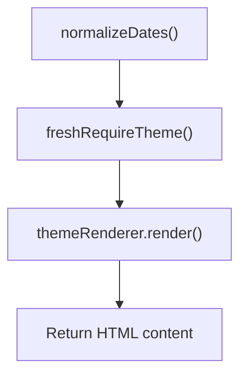
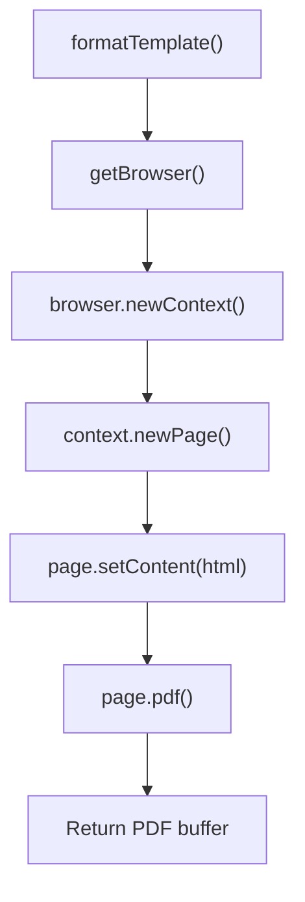
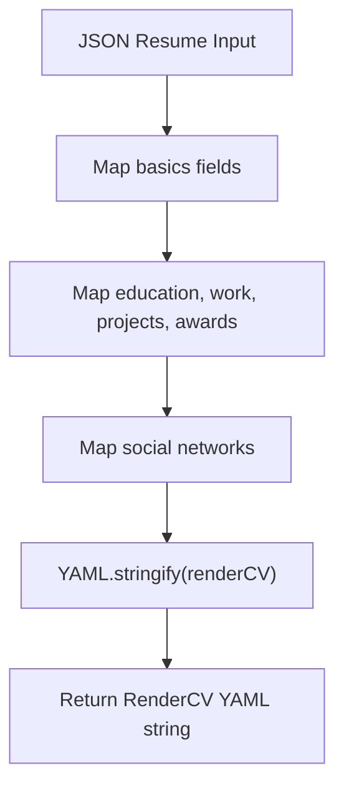
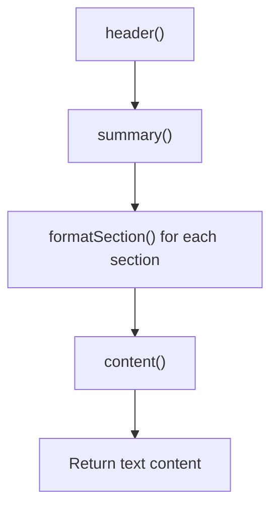
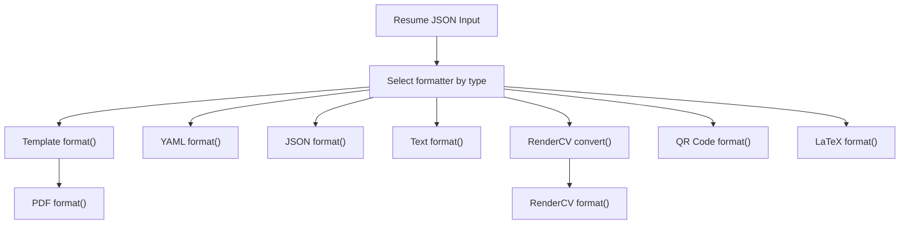
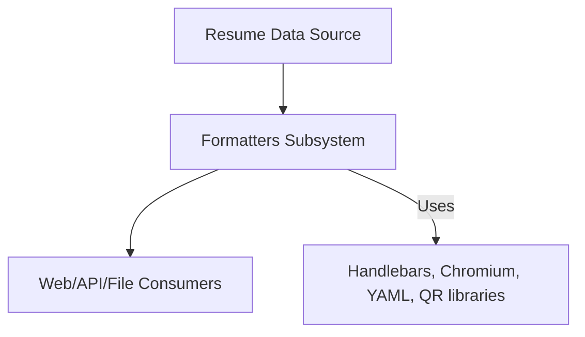
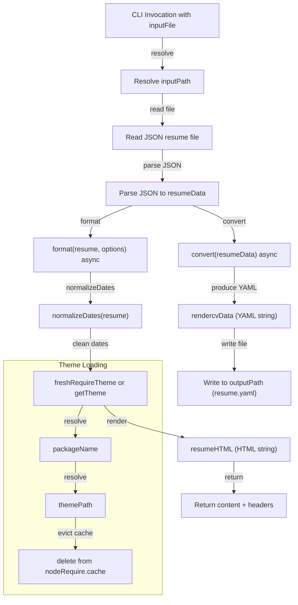

# Formatters

This module implements a collection of resume formatters that transform JSON resume data into various output formats including PDF, YAML, JSON, plain text, LaTeX, RenderCV YAML, and QR code images. Each formatter adapts the resume data to the conventions and requirements of its target format, supporting different use cases such as web rendering, printing, or data interchange.

## Purpose and Scope

This page documents the internal mechanisms of the resume formatters subsystem, detailing how each formatter processes input resume data and produces output in its respective format. It covers the core formatting functions, helper utilities for date normalization and theme rendering, and the RenderCV conversion pipeline. It does not cover the broader resume registry or storage mechanisms. For the overall resume processing pipeline, see the Pipeline Stages page.

## Architecture Overview

The formatters subsystem consists of multiple independent formatter implementations, each exporting a `format` function that accepts a resume object and optional parameters, returning formatted content and metadata. The main formatter types include:

- Template-based HTML formatters using themes and Handlebars templates.
- PDF formatter that renders HTML to PDF using a Chromium headless browser.
- YAML and JSON formatters that serialize the resume data.
- Text formatter that produces a plain-text resume.
- RenderCV formatter that converts JSON Resume to RenderCV YAML format.
- QR code formatter that generates a QR image linking to a resume URL.
- LaTeX formatter producing TeX source.

The RenderCV conversion is implemented in a separate converter package, which maps JSON Resume fields to RenderCV schema and serializes to YAML.

```mermaid
flowchart TD
    ResumeInput["Resume JSON Input"] -->|format()| TemplateFormatter["Template Formatter (HTML)"]
    ResumeInput -->|format()| PDFFormatter["PDF Formatter"]
    ResumeInput -->|format()| YAMLFormatter["YAML Formatter"]
    ResumeInput -->|format()| JSONFormatter["JSON Formatter"]
    ResumeInput -->|format()| TextFormatter["Text Formatter"]
    ResumeInput -->|convert()| RenderCVConverter["RenderCV Converter"]
    RenderCVConverter -->|YAML output| RenderCVFormatter["RenderCV Formatter"]
    ResumeInput -->|format()| QRFormatter["QR Code Formatter"]
    ResumeInput -->|format()| LaTeXFormatter["LaTeX Formatter"]
    TemplateFormatter -->|HTML| PDFFormatter
```

**Diagram: High-level data flow and relationships among resume formatters**

Sources: `apps/registry/lib/formatters/template/format.js:8-107`, `apps/registry/lib/formatters/pdf.js:4-57`, `apps/registry/lib/formatters/yaml.js:1-5`, `apps/registry/lib/formatters/text.js:1-100`, `packages/converters/jsonresume-to-rendercv/convert.js:15-86`

## Template Formatter

The template formatter produces HTML output by rendering the resume data through a selected theme implemented as a Handlebars template. It normalizes date fields to ISO string format and supports theme selection with fallback to a default theme.

**Primary file:** `apps/registry/lib/formatters/template/format.js:8-107`

| Field | Type | Purpose |
|-------|------|---------|
| `normalizeDates(resume)` | function | Converts Date objects in resume date fields to ISO strings for consistent rendering. `apps/registry/lib/formatters/template/format.js:8-36` |
| `THEME_PACKAGES` | object | Maps theme names to their corresponding npm package names for dynamic loading. `apps/registry/lib/formatters/template/format.js:56-62` |
| `freshRequireTheme(themeName)` | function | Dynamically loads the theme package fresh to avoid stale module cache. `apps/registry/lib/formatters/template/format.js:64-79` |
| `format(resume, options)` | async function | Main entry point that normalizes dates, loads the theme, and renders the resume HTML. `apps/registry/lib/formatters/template/format.js:81-107` |



**Execution flow through the template formatter**

Key behaviors:
- Normalizes all date fields in major resume sections to ISO strings to ensure consistent date formatting in templates. `apps/registry/lib/formatters/template/format.js:8-36`
- Supports multiple themes by dynamically requiring theme packages, allowing extensibility and customization. `apps/registry/lib/formatters/template/format.js:56-79`
- Renders the resume data into HTML using the selected theme's Handlebars template. `apps/registry/lib/formatters/template/format.js:81-107`

Relationships:
- The template formatter is a dependency for the PDF formatter, which uses its HTML output as input.
- Themes are external packages loaded at runtime.

Sources: `apps/registry/lib/formatters/template/format.js:8-107`

## PDF Formatter

The PDF formatter generates a PDF document from the resume by first rendering HTML via the template formatter and then using a headless Chromium browser to convert the HTML to PDF.

**Primary file:** `apps/registry/lib/formatters/pdf.js:4-57`

| Field | Type | Purpose |
|-------|------|---------|
| `chromiumModule` | variable | Holds the Chromium module reference, lazily loaded for browser automation. `pdf.js:4` |
| `getBrowser()` | async function | Launches a Chromium browser instance for PDF rendering. `apps/registry/lib/formatters/pdf.js:6-14` |
| `format(resume, options)` | async function | Orchestrates HTML rendering and PDF generation, returning a PDF buffer. `apps/registry/lib/formatters/pdf.js:16-57` |



Key behaviors:
- Lazily loads Chromium module and launches a headless browser only when needed to optimize resource usage. `apps/registry/lib/formatters/pdf.js:4-14`
- Uses the template formatter to produce HTML content for the resume. `apps/registry/lib/formatters/pdf.js:16-17`
- Creates a new browser context and page for each PDF generation to isolate rendering. `apps/registry/lib/formatters/pdf.js:22-23`
- Generates a PDF buffer with configurable options such as page size and margins. `apps/registry/lib/formatters/pdf.js:27-31`

Relationships:
- Depends on the template formatter for HTML generation.
- Provides PDF output for downstream consumers such as web servers or file storage.

Sources: `apps/registry/lib/formatters/pdf.js:4-57`

## YAML Formatter

The YAML formatter serializes the resume JSON into a human-readable YAML string using the `json-to-pretty-yaml` library.

**Primary file:** `apps/registry/lib/formatters/yaml.js:1-5`

| Field | Type | Purpose |
|-------|------|---------|
| `format(resume)` | async function | Converts the resume JSON to a pretty YAML string and returns it with empty headers. `apps/registry/lib/formatters/yaml.js:1-5` |

Key behaviors:
- Uses a third-party library to convert JSON to pretty YAML format. `yaml.js:2`
- Returns the YAML string as content with no HTTP headers. `apps/registry/lib/formatters/yaml.js:3-5`

Relationships:
- Independent formatter that provides a textual serialization alternative.
- Used for exporting resumes in a widely supported data format.

Sources: `apps/registry/lib/formatters/yaml.js:1-5`

## RenderCV Converter and Formatter

The RenderCV converter transforms a JSON Resume into the RenderCV YAML schema, mapping fields such as basics, education, work experience, publications, projects, and awards. The converter outputs a YAML string representing the RenderCV format.

**Primary file:** `packages/converters/jsonresume-to-rendercv/convert.js:15-86`

| Field | Type | Purpose |
|-------|------|---------|
| `networks` | object | Maps JSON Resume social network names to RenderCV equivalents. `packages/converters/jsonresume-to-rendercv/convert.js:3-13` |
| `convert(jsonResume)` | async function | Converts JSON Resume data to RenderCV YAML string. `packages/converters/jsonresume-to-rendercv/convert.js:15-86` |
| `renderCV` | object | Intermediate RenderCV data structure constructed from JSON Resume fields. `packages/converters/jsonresume-to-rendercv/convert.js:16-82` |
| `content` | string | YAML string serialization of the RenderCV data. `convert.js:83` |



Key behaviors:
- Maps social network names from JSON Resume to RenderCV equivalents using a predefined dictionary. `packages/converters/jsonresume-to-rendercv/convert.js:3-13`
- Converts major resume sections into RenderCV schema fields, preserving key information. `packages/converters/jsonresume-to-rendercv/convert.js:15-82`
- Serializes the RenderCV object to YAML format for output. `convert.js:83`

Relationships:
- Used by the RenderCV formatter in the registry to produce RenderCV YAML output.
- Supports interoperability with the RenderCV ecosystem.

Sources: `packages/converters/jsonresume-to-rendercv/convert.js:15-86`

## Text Formatter

The text formatter produces a plain-text representation of the resume, formatting sections such as work, volunteer, projects, education, awards, certificates, publications, and skills into human-readable text blocks.

**Primary file:** `apps/registry/lib/formatters/text.js:1-100`

| Field | Type | Purpose |
|-------|------|---------|
| `header(resume)` | function | Formats the resume header section. `apps/registry/lib/formatters/text.js:1-15` |
| `summary(resume)` | function | Formats the summary section. `apps/registry/lib/formatters/text.js:17-27` |
| `formatSection(items, title, mergedKeys)` | function | Formats a generic section with optional merged keys for inline display. `apps/registry/lib/formatters/text.js:29-63` |
| `works(resume)` | function | Formats work experience section. `apps/registry/lib/formatters/text.js:65-66` |
| `volunteers(resume)` | function | Formats volunteer experience section. `apps/registry/lib/formatters/text.js:67-68` |
| `projects(resume)` | function | Formats projects section. `apps/registry/lib/formatters/text.js:69-70` |
| `education(resume)` | function | Formats education section. `apps/registry/lib/formatters/text.js:71-72` |
| `awards(resume)` | function | Formats awards section. `apps/registry/lib/formatters/text.js:73-74` |
| `certificates(resume)` | function | Formats certificates section. `apps/registry/lib/formatters/text.js:75-76` |
| `publications(resume)` | function | Formats publications section. `apps/registry/lib/formatters/text.js:77-78` |
| `skills(resume)` | function | Formats skills section. `text.js:79` |
| `content(resume)` | function | Aggregates all formatted sections into full text. `apps/registry/lib/formatters/text.js:81-96` |
| `format(resume)` | async function | Main entry point returning the formatted text content. `apps/registry/lib/formatters/text.js:98-100` |



Key behaviors:
- Supports merging of multiple keys into a single line for compact display. `apps/registry/lib/formatters/text.js:31-42`
- Formats each resume section into a readable text block with section titles. `apps/registry/lib/formatters/text.js:29-96`
- Returns the full text content asynchronously for integration with async pipelines. `apps/registry/lib/formatters/text.js:98-100`

Relationships:
- Provides a lightweight textual alternative to HTML or PDF formats.
- Can be used for console output or plain-text exports.

Sources: `apps/registry/lib/formatters/text.js:1-100`

## JSON Formatter

The JSON formatter serializes the resume object into a pretty-printed JSON string.

**Primary file:** `apps/registry/lib/formatters/json.js:1-6`

| Field | Type | Purpose |
|-------|------|---------|
| `format(resume)` | async function | Returns the JSON string of the resume with indentation. `apps/registry/lib/formatters/json.js:1-6` |

Key behaviors:
- Uses `JSON.stringify` with indentation for human-readable JSON output. `apps/registry/lib/formatters/json.js:1-6`
- Returns content with no additional headers.

Relationships:
- Provides the canonical JSON resume format output.

Sources: `apps/registry/lib/formatters/json.js:1-6`

## QR Code Formatter

The QR code formatter generates a QR image linking to a resume URL based on a username.

**Primary file:** `apps/registry/lib/formatters/qr.js:3-20`

| Field | Type | Purpose |
|-------|------|---------|
| `format(resume, { username })` | async function | Generates a QR code image stream for the resume URL. `apps/registry/lib/formatters/qr.js:3-20` |
| `code` | variable | QR code image stream generated from the URL. `apps/registry/lib/formatters/qr.js:4-9` |

Key behaviors:
- Constructs a URL to the resume hosted on the registry using the username. `apps/registry/lib/formatters/qr.js:4-9`
- Uses the `qr.image` library to produce a PNG image stream of the QR code. `apps/registry/lib/formatters/qr.js:4-9`

Relationships:
- Used for embedding resume links in physical or digital media.

Sources: `apps/registry/lib/formatters/qr.js:3-20`

## LaTeX Formatter

The LaTeX formatter produces a LaTeX source string for the resume.

**Primary file:** `apps/registry/lib/formatters/tex.js:1-3`

| Field | Type | Purpose |
|-------|------|---------|
| `format()` | async function | Returns LaTeX source string for the resume. `apps/registry/lib/formatters/tex.js:1-3` |

Key behaviors:
- Currently defined but not implemented with detailed logic.
- Returns a placeholder or empty LaTeX string.

Relationships:
- Intended for generating printable LaTeX resumes.

Sources: `apps/registry/lib/formatters/tex.js:1-5`

## Template Theme Configuration and Selection

The theme configuration defines available themes and their properties, while the theme selector loads themes dynamically.

**Primary files:**  
- `apps/registry/lib/formatters/template/themeConfig.js:55-114` (THEMES object)  
- `apps/registry/lib/formatters/template/getTheme.js:3-12` (getTheme function)

Key behaviors:
- Defines a set of themes with metadata such as display name and package name. `apps/registry/lib/formatters/template/themeConfig.js:55-114`
- Provides a function to retrieve theme configuration by name, defaulting to a standard theme. `apps/registry/lib/formatters/template/getTheme.js:3-12`

Sources: `apps/registry/lib/formatters/template/themeConfig.js:55-114`, `apps/registry/lib/formatters/template/getTheme.js:3-12`

## Agent Formatter

The agent formatter generates a textual agent summary of the resume, optionally including a username and resume URL.

**Primary file:** `apps/registry/lib/formatters/agent.js:4-171`

| Field | Type | Purpose |
|-------|------|---------|
| `format(resume, options)` | async function | Produces a text summary of the resume with optional username and URL. `apps/registry/lib/formatters/agent.js:4-171` |
| `resumeJson` | string | JSON stringified resume for internal use. `agent.js:5` |
| `username` | string | Username extracted from options or defaults to 'unknown'. `agent.js:6` |
| `resumeUrl` | string | URL constructed from username for resume access. `agent.js:7` |
| `name` | string | Resume owner's name or fallback string. `agent.js:8` |
| `{ text }` | object | Generated text content from internal text generation utility. `apps/registry/lib/formatters/agent.js:10-165` |

Key behaviors:
- Serializes resume to JSON and constructs a URL for the resume based on username. `apps/registry/lib/formatters/agent.js:5-7`
- Generates a textual summary using an internal text generation function. `apps/registry/lib/formatters/agent.js:10-165`

Sources: `apps/registry/lib/formatters/agent.js:4-171`

## How It Works: End-to-End Formatting Flow



- The resume JSON is passed to the selected formatter's `format` function.
- For HTML and PDF output, the template formatter normalizes dates and renders HTML, which the PDF formatter then converts to PDF using Chromium.
- YAML and JSON formatters serialize the resume data directly.
- The RenderCV formatter first converts JSON Resume to RenderCV YAML using the converter package.
- The text formatter formats each resume section into plain text blocks.
- The QR formatter generates a QR code image linking to the resume URL.
- The LaTeX formatter returns LaTeX source (currently minimal implementation).

**Diagram: Overall formatting pipeline and data flow**

Sources: `apps/registry/lib/formatters/template/format.js:8-107`, `apps/registry/lib/formatters/pdf.js:4-57`, `apps/registry/lib/formatters/yaml.js:1-5`, `apps/registry/lib/formatters/text.js:1-100`, `packages/converters/jsonresume-to-rendercv/convert.js:15-86`

## Key Relationships

The formatters subsystem depends on external libraries such as Handlebars for templating, Chromium for PDF rendering, and YAML serializers. It interacts upstream with the resume data source and downstream with output consumers such as web servers, file exporters, or API clients.



**Relationships to adjacent subsystems**

Sources: `apps/registry/lib/formatters/template/format.js:8-107`, `apps/registry/lib/formatters/pdf.js:4-57`

## `{ content: html }` (variable) in apps/registry/lib/formatters/pdf.js

**Purpose**: Holds the HTML string content generated from a resume using the template formatter, serving as the input for PDF rendering.

This variable is destructured from the result of calling the `formatTemplate` function with a resume and options. It contains the fully rendered HTML markup representing the resume, which is then loaded into a headless browser page for PDF generation.

**Details**:
- Extracted as `{ content: html }` from the promise returned by `formatTemplate(resume, options)`.
- The HTML content includes all styling and layout as defined by the selected theme.
- Used as the source content for the Playwright page's `setContent` method to render the resume visually before PDF conversion.

**Example**:
```js
const { content: html } = await formatTemplate(resume, options);
// html now contains the complete resume HTML string
```

Sources: `apps/registry/lib/formatters/pdf.js:17`


## `pdfBuffer` (variable) in apps/registry/lib/formatters/pdf.js

**Purpose**: Stores the raw PDF data buffer generated by the headless Chromium browser after rendering the resume HTML.

After the Playwright page finishes loading the HTML content, the `page.pdf()` method is called with specific options to produce a PDF. The resulting buffer contains the binary PDF data, which is then wrapped in a Node.js Buffer for downstream consumption.

**Details**:
- Obtained by awaiting `page.pdf()` with options:
  - `format: 'A4'` for page size.
  - `printBackground: true` to include CSS backgrounds.
  - Zero margins on all sides.
- Wrapped with `Buffer.from()` to ensure a proper Node.js Buffer instance.
- Returned as part of the final output object under the `content` key.

**Example**:
```js
const pdfBuffer = await page.pdf({
  format: 'A4',
  printBackground: true,
  margin: { top: '0px', right: '0px', bottom: '0px', left: '0px' },
});
return { content: Buffer.from(pdfBuffer), headers: [...] };
```

Sources: `apps/registry/lib/formatters/pdf.js:27-31`


## `mergedSet` (variable) in apps/registry/lib/formatters/text.js

**Purpose**: Represents a set of keys whose values should be merged into a single line when formatting a resume section.

Within the `formatSection` function, `mergedSet` is constructed from the `mergedKeys` array to efficiently check which keys should be combined into a single "merged line" string for each item in the section.

**Details**:
- Created as `new Set(mergedKeys)`.
- Used to exclude merged keys and the `type` key from individual key-value pair output.
- Enables concise formatting by grouping related fields (e.g., startDate and endDate) into a single line.

**Example**:
```js
const mergedSet = new Set(mergedKeys);
```

Sources: `apps/registry/lib/formatters/text.js:31`


## `mergedLine` (variable) in apps/registry/lib/formatters/text.js

**Purpose**: Holds the concatenated string of merged key values for a single item in a resume section.

Inside `formatSection`, for each item, `mergedLine` is constructed by joining the values of keys specified in `mergedKeys` with a " - " separator. This line appears as a header or summary line for the item before listing other fields.

**Details**:
- If `mergedKeys` is empty, `mergedLine` is `undefined`.
- Filters out undefined, null, or empty string values before joining.
- If all merged keys are missing or empty, `mergedLine` becomes `undefined`.
- Appears as the first line of the item's formatted block.

**Example**:
```js
const mergedLine = mergedKeys.length
  ? mergedKeys
      .map((k) => item[k])
      .filter((v) => v !== undefined && v !== null && v !== '')
      .join(' - ') || undefined
  : undefined;
```

Sources: `apps/registry/lib/formatters/text.js:37-42`


## `dateFields` (variable) in apps/registry/lib/formatters/template/format.js

**Purpose**: Enumerates the field names within resume sections that represent date values requiring normalization.

This array defines which keys in resume items should be inspected and converted to string representations to avoid issues with date objects during template rendering.

**Details**:
- Contains: `'startDate'`, `'endDate'`, `'date'`, `'releaseDate'`.
- Used by `normalizeDates` to identify fields that may hold Date objects or non-string date representations.
- Ensures compatibility with Handlebars helpers and themes expecting string dates.

**Example**:
```js
const dateFields = ['startDate', 'endDate', 'date', 'releaseDate'];
```

Sources: `apps/registry/lib/formatters/template/format.js:9`


## `normalized` (variable) in apps/registry/lib/formatters/template/format.js

**Purpose**: Holds a shallow copy of the input resume with all date fields normalized to string format.

`normalized` is the working copy of the resume object that `normalizeDates` mutates by converting Date objects and other non-string date representations into ISO date strings.

**Details**:
- Created by shallow copying the input resume: `{ ...resume }`.
- Each section listed in `sections` is processed to normalize date fields.
- Ensures the original resume object remains unmodified.
- Returned as the normalized resume for downstream rendering.

**Example**:
```js
const normalized = { ...resume };
```

Sources: `apps/registry/lib/formatters/template/format.js:19`


## `copy` (variable) in apps/registry/lib/formatters/template/format.js

**Purpose**: Represents a shallow copy of a single item within a resume section, used to safely mutate date fields during normalization.

Within the `normalizeDates` function, each item in a section array is copied to avoid mutating the original resume data directly. The copy is then processed to convert date fields to strings.

**Details**:
- Created as `{ ...item }` inside a `.map()` over section items.
- Date fields in `copy` are converted if they are Date objects or objects convertible to strings.
- Returned as the normalized item for the new section array.

**Example**:
```js
const copy = { ...item };
for (const field of dateFields) {
  if (copy[field] instanceof Date) {
    copy[field] = copy[field].toISOString().split('T')[0];
  } else if (copy[field] && typeof copy[field] === 'object') {
    copy[field] = String(copy[field]);
  }
}
return copy;
```

Sources: `apps/registry/lib/formatters/template/format.js:23`


## `nodeRequire` (variable) in apps/registry/lib/formatters/template/format.js

**Purpose**: Provides a reference to the native Node.js `require` function, bypassing Webpack or other bundler overrides.

This variable ensures that the module cache can be manipulated directly to evict cached modules, enabling fresh loading of themes and their dependencies.

**Details**:
- Uses the global `__non_webpack_require__` if available (in Webpack environments).
- Falls back to the standard `require` otherwise.
- Allows deleting entries from `nodeRequire.cache` to force reloading modules.

**Example**:
```js
const nodeRequire =
  typeof __non_webpack_require__ !== 'undefined'
    ? __non_webpack_require__
    : require;
```

Sources: `apps/registry/lib/formatters/template/format.js:50-53`


## `packageName` (variable) in apps/registry/lib/formatters/template/format.js

**Purpose**: Holds the resolved NPM package name for a given theme, used to dynamically require the theme module.

Within `freshRequireTheme`, `packageName` is looked up from the `THEME_PACKAGES` map by the theme name. It is then used to resolve and require the theme package.

**Details**:
- Maps theme names like `'macchiato'` to package names like `'jsonresume-theme-macchiato'`.
- If the theme is not in `THEME_PACKAGES`, `packageName` is `undefined`.
- Used to resolve the module path for cache eviction and fresh loading.

**Example**:
```js
const packageName = THEME_PACKAGES[themeName];
```

Sources: `apps/registry/lib/formatters/template/format.js:65`


## `hbsPath` (variable) in apps/registry/lib/formatters/template/format.js

**Purpose**: Stores the resolved file path of the `handlebars` module in the Node.js require cache.

Used to delete the cached Handlebars module before requiring a theme package, ensuring that each theme loads a fresh Handlebars instance and registers its helpers without conflicts.

**Details**:
- Obtained by `nodeRequire.resolve('handlebars')`.
- Used alongside `themePath` to delete cached modules.
- Prevents helper registration conflicts caused by shared global Handlebars instances.

**Example**:
```js
const hbsPath = nodeRequire.resolve('handlebars');
delete nodeRequire.cache[hbsPath];
```

Sources: `apps/registry/lib/formatters/template/format.js:69`

## Supplemental Documentation for formatters: themePath, resumeHTML, inputFile, inputPath, outputPath, resumeData, rendercvData

This supplement documents several key variables used internally in the formatters and JSON resume conversion modules. These variables represent critical points of data flow and resource resolution that were omitted from the initial documentation generation. Understanding these variables clarifies how themes are resolved and loaded, how resume HTML output is produced, and how JSON resumes are converted to RenderCV YAML format.

---

### `themePath` (variable) in apps/registry/lib/formatters/template/format.js

**Purpose**:  
`themePath` holds the resolved absolute path to the installed Node.js package of a JSON Resume theme. It is used internally to identify and evict the theme module from Node.js's require cache, enabling a fresh import of the theme and its dependencies.

**Context and Usage**:  
Within the `freshRequireTheme(themeName)` function, `themePath` is assigned by calling `nodeRequire.resolve(packageName)`, where `packageName` is the NPM package name corresponding to the theme (e.g., `'jsonresume-theme-macchiato'`). This resolution step converts the package name into the full path of the main entry file of the theme package on disk.

After resolution, `themePath` is used to delete the cached module from `nodeRequire.cache`:

```js
delete nodeRequire.cache[themePath];
```

This deletion forces Node.js to reload the theme package the next time it is required, ensuring that any Handlebars helpers registered by the theme are freshly applied without interference from previously loaded themes.

**Failure Modes and Edge Cases**:  
- If the theme package is not installed or cannot be resolved, `nodeRequire.resolve(packageName)` throws an error, which is caught by the `try/catch` block in `freshRequireTheme`, causing the function to return `null`.  
- If the cache eviction fails or is incomplete, stale Handlebars helpers may persist, causing rendering conflicts between themes.

**Example**:  
For the theme `'macchiato'`, `themePath` might resolve to `/node_modules/jsonresume-theme-macchiato/index.js`, which is then evicted from the cache before re-requiring.

**Source**: `apps/registry/lib/formatters/template/format.js:69-70`


---

### `resumeHTML` (variable) in apps/registry/lib/formatters/template/format.js

**Purpose**:  
`resumeHTML` stores the final rendered HTML string output of the resume after applying the selected theme's rendering function to the normalized resume data.

**Context and Usage**:  
Within the exported async `format` function, after obtaining a theme renderer instance (`themeRenderer`), the resume data is first normalized by `normalizeDates(resume)` to ensure all date fields are strings. Then, the theme's `render` method is called with the normalized resume, producing `resumeHTML`:

```js
const resumeHTML = themeRenderer.render(normalizeDates(resume));
```

This HTML string represents the fully formatted resume ready for delivery or storage.

**Characteristics**:  
- The HTML output is theme-dependent and may vary widely in structure and styling.  
- The normalization step prevents runtime errors in themes that expect date fields as strings rather than Date objects or complex types.

**Usage in Return Value**:  
`resumeHTML` is returned as the `content` property of the object from `format`, alongside HTTP headers specifying cache control and content type:

```js
return {
  content: resumeHTML,
  headers: [
    { key: 'Cache-control', value: 'public, max-age=90' },
    { key: 'Content-Type', value: 'text/html' },
  ],
};
```

**Source**: `apps/registry/lib/formatters/template/format.js:92`


---

### `inputFile` (variable) in packages/converters/jsonresume-to-rendercv/index.js

**Purpose**:  
`inputFile` holds the raw command-line argument string representing the path to the JSON resume file to be converted.

**Context and Usage**:  
At the top of the CLI script, `inputFile` is assigned from `process.argv[2]`, which is the third argument passed to the Node.js process (the first two being the node executable and script path):

```js
const inputFile = process.argv[2];
```

This variable is the entry point for the conversion pipeline, specifying which JSON resume file to read and convert.

**Failure Modes and Edge Cases**:  
- If `inputFile` is undefined or empty (no argument provided), the script logs an error and exits with status 1, enforcing mandatory input.

**Example**:  
If the CLI is invoked as `node jsonresume-to-rendercv.js ./resume.json`, `inputFile` will be `'./resume.json'`.

**Source**: `packages/converters/jsonresume-to-rendercv/index.js:7`


---

### `inputPath` (variable) in packages/converters/jsonresume-to-rendercv/index.js

**Purpose**:  
`inputPath` is the absolute filesystem path resolved from the `inputFile` argument, ensuring consistent and unambiguous file access.

**Context and Usage**:  
`inputPath` is computed using Node.js's `path.resolve` function, which resolves the relative or absolute `inputFile` path against the current working directory:

```js
const inputPath = path.resolve(inputFile);
```

This absolute path is used to read the JSON resume file from disk.

**Failure Modes and Edge Cases**:  
- If the resolved path does not exist or is inaccessible, the subsequent `fs.readFile` call will fail, triggering an error log and process exit.  
- Relative paths are resolved relative to the process's current working directory, which may differ depending on how the CLI is invoked.

**Example**:  
If the current directory is `/home/user` and `inputFile` is `'./resume.json'`, `inputPath` becomes `/home/user/resume.json`.

**Source**: `packages/converters/jsonresume-to-rendercv/index.js:14`


---

### `outputPath` (variable) in packages/converters/jsonresume-to-rendercv/index.js

**Purpose**:  
`outputPath` is the absolute path where the converted RenderCV YAML resume will be saved.

**Context and Usage**:  
`outputPath` is set to the absolute path of a file named `resume.yaml` in the current working directory, regardless of the input file location:

```js
const outputPath = path.resolve(process.cwd(), 'resume.yaml');
```

This fixed output location centralizes the converted resume output, simplifying downstream usage.

**Failure Modes and Edge Cases**:  
- If the current working directory is not writable, the `fs.writeFile` call will fail, causing an error log and process exit.  
- The output filename is hardcoded; concurrent runs may overwrite this file unless the working directory is changed.

**Example**:  
If the CLI is run from `/home/user/projects`, `outputPath` will be `/home/user/projects/resume.yaml`.

**Source**: `packages/converters/jsonresume-to-rendercv/index.js:15`


---

### `resumeData` (variable) in packages/converters/jsonresume-to-rendercv/index.js

**Purpose**:  
`resumeData` holds the parsed JavaScript object representation of the JSON resume file read from disk.

**Context and Usage**:  
After reading the input file as UTF-8 text, the script attempts to parse the JSON string into an object:

```js
resumeData = JSON.parse(data);
```

This object is the input to the conversion function `convert`, which transforms it into RenderCV YAML format.

**Failure Modes and Edge Cases**:  
- If the input file contains invalid JSON, `JSON.parse` throws an error, which is caught and logged, causing the process to exit.  
- The script does not validate the schema of `resumeData`; malformed or incomplete resumes may cause errors downstream in `convert`.

**Example**:  
For an input JSON file containing:

```json
{
  "basics": { "name": "Alice" },
  "work": [ ... ]
}
```

`resumeData` will be the corresponding JavaScript object with these fields.

**Source**: `packages/converters/jsonresume-to-rendercv/index.js:23`


---

### `rendercvData` (variable) in packages/converters/jsonresume-to-rendercv/index.js

**Purpose**:  
`rendercvData` contains the converted resume data in RenderCV YAML format as a string, produced by the asynchronous `convert` function.

**Context and Usage**:  
After parsing the JSON resume into `resumeData`, the script calls the `convert` function, which returns a Promise resolving to the YAML string:

```js
const rendercvData = await convert(resumeData);
```

This string is then written to disk at `outputPath`.

**Failure Modes and Edge Cases**:  
- If `convert` rejects or throws, the script does not explicitly catch this error, which may cause unhandled rejection warnings or process termination.  
- The conversion logic is external to this script; errors or data loss in `convert` affect the fidelity of `rendercvData`.

**Example**:  
If `convert` transforms the JSON resume into a YAML string representing the same data, `rendercvData` will be that YAML text.

**Source**: `packages/converters/jsonresume-to-rendercv/index.js:31`


---

## How It Works: Theme Resolution and Resume Conversion Flow



**Diagram: Data flow from CLI input file through conversion and formatting, including theme resolution and cache eviction**

Sources: `apps/registry/lib/formatters/template/format.js:64-79,81-107`, `packages/converters/jsonresume-to-rendercv/index.js:7-40`


---