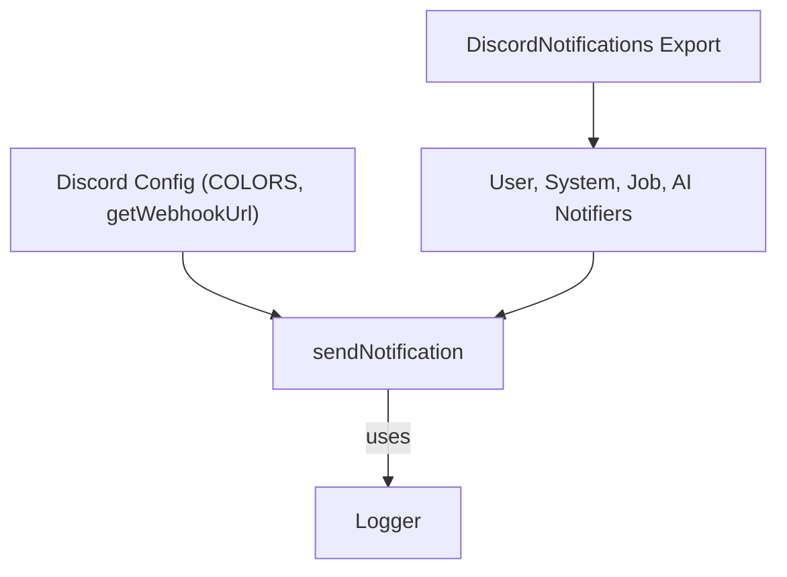
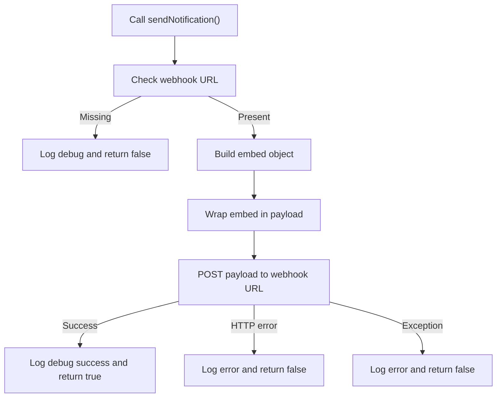
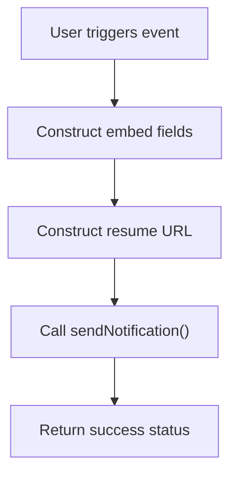
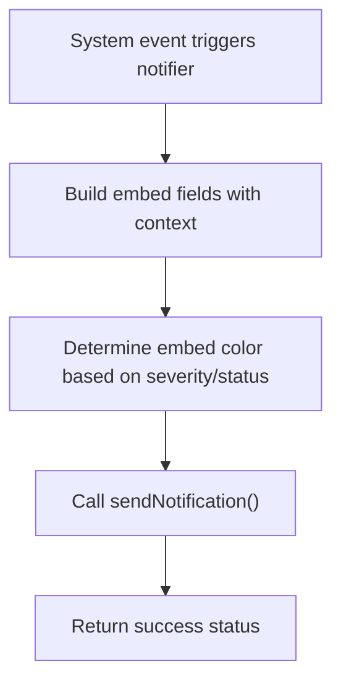
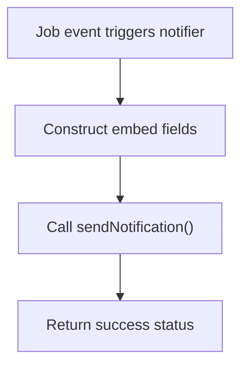
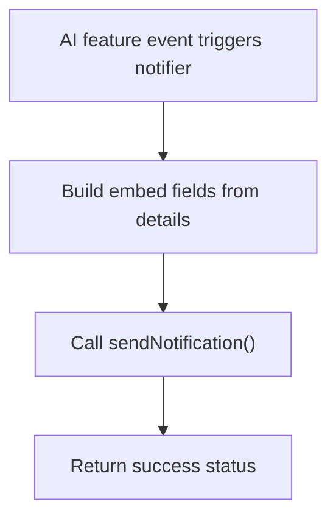
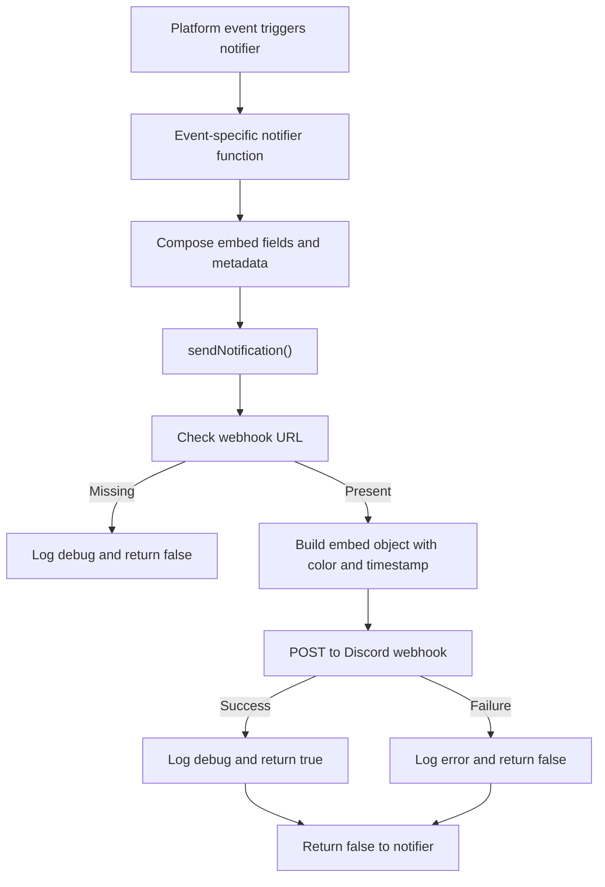
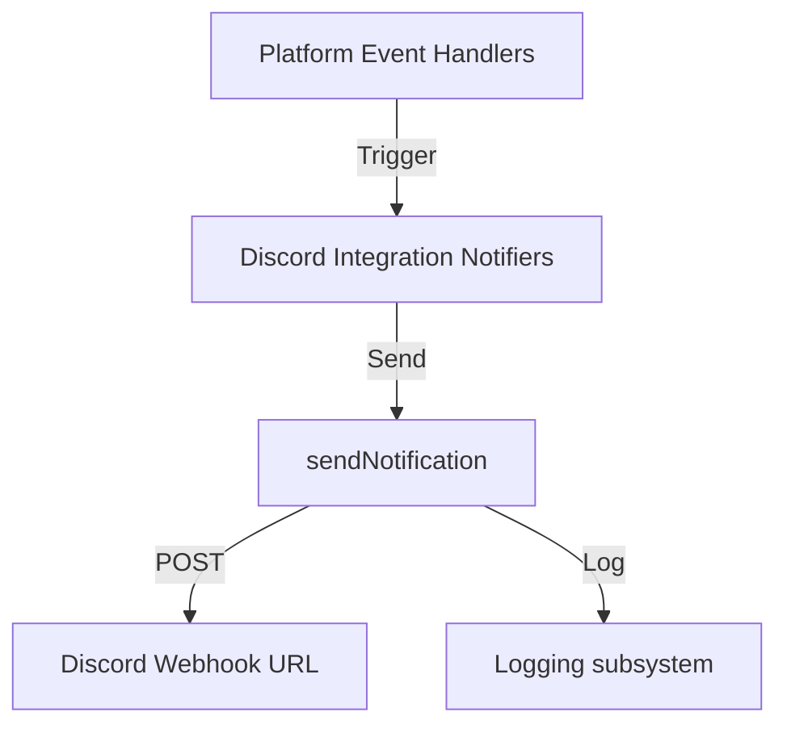

# Discord Integration

This module implements a comprehensive Discord notification system for the platform, enabling real-time alerts and updates about user activity, system health, job board events, and AI-driven features. It sends richly formatted messages to configured Discord webhooks, facilitating monitoring and operational awareness through Discord channels.

## Purpose and Scope

This page documents the internal mechanisms of the Discord notification subsystem, detailing the notification sender, configuration, and categorized notifiers for various event types. It covers the orchestration of message construction, dispatch, and error handling within the Discord integration. It does not cover the external Discord API itself or unrelated logging and environment configuration.

For configuration details, see the Discord Configuration page. For user activity notifications, see the User Activity Notifiers page. For system health alerts, see the System Health Notifiers page. For job-related notifications, see the Job Activity Notifiers page. For AI feature notifications, see the AI Features Notifiers page.

## Architecture Overview

The Discord Integration subsystem consists of three main layers: configuration, notification sending, and categorized notifiers. The configuration layer provides constants and environment-based webhook URL retrieval. The sender layer formats and dispatches messages to Discord webhooks. The notifier layer exposes specialized functions for distinct event categories, each composing notification payloads and invoking the sender.



**Diagram: Discord Integration layers and their dependencies**

Sources: `apps/registry/lib/discord/config.js:6-19`, `apps/registry/lib/discord/sender.js:14-72`, `apps/registry/lib/discord/notifiers.js:1-40`, `apps/registry/lib/discord/notifications.js:1-53`

---

## Discord Configuration

**Purpose:** Provides constants for Discord embed colors and retrieves the webhook URL from environment variables.

**Primary file:** `apps/registry/lib/discord/config.js:6-19`

| Field       | Type     | Purpose                                                                                  |
|-------------|----------|------------------------------------------------------------------------------------------|
| COLORS      | Object   | Maps notification types ('SUCCESS', 'INFO', 'WARNING', 'ERROR') to Discord color codes. |
| getWebhookUrl | Function | Returns the Discord webhook URL from `process.env.DISCORD_WEBHOOK_URL` or null if unset. |

**Key behaviors:**
- Defines color constants as hexadecimal integers matching Discord embed color requirements.
- Retrieves webhook URL dynamically from environment, allowing runtime configuration without code changes.

Sources: `apps/registry/lib/discord/config.js:6-19`

---

## Notification Sender

**Purpose:** Formats and sends notifications to the Discord webhook URL with rich embeds, handling errors and logging outcomes.

**Primary file:** `apps/registry/lib/discord/sender.js:14-72`

| Variable/Parameter | Type            | Purpose                                                                                          |
|--------------------|-----------------|------------------------------------------------------------------------------------------------|
| `sendNotification`  | Async function  | Sends a Discord embed notification with title, description, color, optional fields, and URL.   |
| `webhookUrl`        | string or null  | The Discord webhook URL retrieved from configuration at runtime.                               |
| `colorValue`        | number          | Numeric color code for the embed, resolved from the `COLORS` map based on input color string.  |
| `embed`             | Object          | The Discord embed object containing title, description, color, fields, timestamp, and optional URL. |
| `payload`           | Object          | The JSON payload sent to Discord, wrapping the embed in an `embeds` array.                     |
| `response`          | Response object | The HTTP response from the Discord webhook POST request.                                       |

### sendNotification function

- **Parameters:** An object with:
  - `title` (string): Notification title shown in the embed header.
  - `description` (string): Main notification message body.
  - `color` (string, default `'info'`): One of `'success'`, `'info'`, `'warning'`, `'error'` controlling embed color.
  - `fields` (array of objects): Additional embed fields, each with `name`, `value`, and optional `inline` boolean.
  - `url` (string, optional): URL linked from the embed title.

- **Returns:** Promise resolving to a boolean indicating success (`true`) or failure (`false`).

- **Behavior:**
  - Retrieves the webhook URL via `getWebhookUrl()`. If unset, logs a debug message and returns `false` immediately.
  - Maps the provided color string to a numeric color code using the `COLORS` constant, defaulting to `INFO` color if unrecognized.
  - Constructs an embed object with the given title, description, color, fields, and current timestamp. Adds URL if provided.
  - Wraps the embed in a payload object under the `embeds` array.
  - Sends a POST request to the webhook URL with JSON payload and appropriate headers.
  - On HTTP failure (non-OK response), logs an error with status details and returns `false`.
  - On network or other exceptions, logs the error message and returns `false`.
  - Logs debug information on successful notification dispatch and returns `true`.

- **Failure modes:**
  - Missing webhook URL disables notifications silently with debug logging.
  - Network errors or Discord API failures cause error logs and return `false`.
  - Payload size or field length limits are not explicitly handled; Discord API may reject oversized messages.

```js
const webhookUrl = getWebhookUrl();

if (!webhookUrl) {
  logger.debug('Discord webhook URL not configured, skipping notification');
  return false;
}

const colorValue = COLORS[color.toUpperCase()] || COLORS.INFO;

const embed = {
  title,
  description,
  color: colorValue,
  fields,
  timestamp: new Date().toISOString(),
};

if (url) {
  embed.url = url;
}

const payload = {
  embeds: [embed],
};

try {
  const response = await fetch(webhookUrl, {
    method: 'POST',
    headers: { 'Content-Type': 'application/json' },
    body: JSON.stringify(payload),
  });

  if (!response.ok) {
    logger.error(
      { status: response.status, statusText: response.statusText },
      'Failed to send Discord notification'
    );
    return false;
  }

  logger.debug({ title }, 'Discord notification sent successfully');
  return true;
} catch (error) {
  logger.error({ error: error.message, title }, 'Error sending Discord notification');
  return false;
}
```

**Diagram: Notification sending flow**



Sources: `apps/registry/lib/discord/sender.js:14-72`, `apps/registry/lib/discord/config.js:6-19`

---

## User Activity Notifiers

**Purpose:** Provide specialized notifications for user-related events such as signups, resume publishing, and resume updates.

**Primary file:** `apps/registry/lib/discord/notifiers/userActivity.js:9-113`

| Function               | Returns           | Purpose                                                                                 |
|------------------------|-------------------|-----------------------------------------------------------------------------------------|
| `notifyUserSignup`      | `Promise<boolean>` | Sends notification when a new user signs up, including username and signup method.      |
| `notifyResumePublished` | `Promise<boolean>` | Sends notification when a user publishes a resume, including visibility and theme info. |
| `notifyResumeUpdated`   | `Promise<boolean>` | Sends notification when a user updates a resume, throttled to avoid spam.               |

### notifyUserSignup

- **Parameters:**
  - `username` (string): The new user's username.
  - `details` (object, optional): Additional signup details; supports `method` (string) indicating signup method, defaulting to `'GitHub OAuth'`.

- **Behavior:**
  - Constructs embed fields for username and signup method.
  - Builds a resume URL linking to the user's public resume page.
  - Sends a success-colored notification titled "New User Signup" with description and fields.

- **Returns:** Promise resolving to `true` if notification sent successfully, otherwise `false`.

### notifyResumePublished

- **Parameters:**
  - `username` (string): User who published the resume.
  - `details` (object, optional): Publication details; supports `visibility` (string, default `'public'`) and optional `theme` (string).

- **Behavior:**
  - Builds fields for username, visibility, and optionally theme.
  - Constructs resume URL.
  - Sends a success-colored notification titled "Resume Published" with description and fields.

- **Returns:** Promise resolving to boolean success.

### notifyResumeUpdated

- **Parameters:**
  - `username` (string): User who updated the resume.
  - `details` (object, optional): Update details; supports `updateType` (string) and `changesCount` (number).

- **Behavior:**
  - Builds fields for username, update type, and number of changed sections.
  - Constructs resume URL.
  - Sends an info-colored notification titled "Resume Updated" with description and fields.
  - Intended to be throttled externally to prevent notification spam on frequent updates.

- **Returns:** Promise resolving to boolean success.

```js
const fields = [
  { name: 'Username', value: username, inline: true },
  { name: 'Method', value: details.method || 'GitHub OAuth', inline: true },
];

const resumeUrl = `https://registry.jsonresume.org/${username}`;

return await sendNotification({
  title: '👤 New User Signup',
  description: 'A new user has joined the platform',
  color: 'success',
  fields,
  url: resumeUrl,
});
```

**Diagram: User activity notification flow**



Sources: `apps/registry/lib/discord/notifiers/userActivity.js:9-113`

---

## System Health Notifiers

**Purpose:** Notify critical system events such as errors, deployments, and security vulnerabilities to facilitate monitoring and incident response.

**Primary file:** `apps/registry/lib/discord/notifiers/systemHealth.js:9-162`

| Function                    | Returns           | Purpose                                                                                   |
|-----------------------------|-------------------|-------------------------------------------------------------------------------------------|
| `notifyCriticalError`        | `Promise<boolean>` | Sends detailed notification about critical runtime errors including stack trace preview.  |
| `notifyDeployment`           | `Promise<boolean>` | Sends deployment status notifications with commit and environment details.               |
| `notifySecurityVulnerability` | `Promise<boolean>` | Sends alerts about security vulnerabilities with severity and fix availability.           |

### notifyCriticalError

- **Parameters:**
  - `error` (Error object): The error instance to report.
  - `context` (object, optional): Additional context such as `endpoint` (string) and `user` (string).

- **Behavior:**
  - Builds fields for error type, truncated message (max 1024 chars), optional endpoint and user.
  - Includes a truncated stack trace preview (max 1024 chars) formatted as a code block.
  - Sends an error-colored notification titled "Critical Error" with description and fields.

- **Returns:** Promise resolving to boolean success.

### notifyDeployment

- **Parameters:**
  - `status` (string): Deployment status, either `'success'` or `'failure'`.
  - `details` (object, optional): Deployment metadata including `environment` (string), `commit` (string), `message` (string), and optional `url` (string).

- **Behavior:**
  - Determines success boolean and emoji based on status.
  - Builds fields for environment, abbreviated commit hash (first 7 chars), and truncated commit message (max 200 chars).
  - Sends a notification with title reflecting success or failure, appropriate color, description, and optional URL.

- **Returns:** Promise resolving to boolean success.

### notifySecurityVulnerability

- **Parameters:**
  - `vulnerability` (object): Details of the vulnerability, including `severity` (string), `package` (string), `cve` (string), `fixAvailable` (boolean), `description` (string), and optional `url` (string).

- **Behavior:**
  - Builds fields for severity, package name, CVE identifier, fix availability (yes/no), and truncated description (max 500 chars).
  - Determines if severity is critical or high to mark notification as error color and prepend "(CRITICAL)" to title.
  - Sends a warning or error-colored notification with appropriate title and description.

- **Returns:** Promise resolving to boolean success.

```js
const fields = [
  { name: 'Error Type', value: error.name || 'Error', inline: true },
  { name: 'Message', value: error.message.substring(0, 1024), inline: false },
  // Optional context fields added conditionally
];

if (error.stack) {
  const stackPreview = error.stack.substring(0, 1024);
  fields.push({
    name: 'Stack Trace',
    value: `\`\`\`\n${stackPreview}\n\`\`\``,
    inline: false,
  });
}

return await sendNotification({
  title: '🚨 Critical Error',
  description: 'A critical error occurred in production',
  color: 'error',
  fields,
});
```

**Diagram: System health notification flow**



Sources: `apps/registry/lib/discord/notifiers/systemHealth.js:9-162`

---

## Job Activity Notifiers

**Purpose:** Notify about job board events including new job postings discovered and job-resume similarity match computations.

**Primary file:** `apps/registry/lib/discord/notifiers/jobActivity.js:9-88`

| Function           | Returns           | Purpose                                                                                  |
|--------------------|-------------------|------------------------------------------------------------------------------------------|
| `notifyJobsFound`   | `Promise<boolean>` | Sends notification about newly found job postings with source and top companies/roles.   |
| `notifyJobMatches`  | `Promise<boolean>` | Sends notification about job similarity matches computed with processing details.        |

### notifyJobsFound

- **Parameters:**
  - `count` (number): Number of new jobs found.
  - `details` (object, optional): Additional info including `source` (string), `topCompanies` (array of strings), and `topRoles` (array of strings).

- **Behavior:**
  - Builds fields for new jobs count, source, top companies (up to 5), and top roles (up to 5).
  - Sends a success-colored notification titled "New Jobs Found" with description and fields.
  - Links to the job board URL.

- **Returns:** Promise resolving to boolean success.

### notifyJobMatches

- **Parameters:**
  - `matchCount` (number): Number of job matches computed.
  - `details` (object, optional): Processing details including `processingTime` (ms) and `embeddingDimensions` (number).

- **Behavior:**
  - Builds fields for matches count, processing time, and embedding dimensions.
  - Sends an info-colored notification titled "Job Matches Computed" with description and fields.

- **Returns:** Promise resolving to boolean success.

```js
const fields = [
  { name: 'New Jobs', value: count.toString(), inline: true },
  { name: 'Source', value: details.source, inline: true },
  { name: 'Top Companies', value: details.topCompanies.slice(0, 5).join(', '), inline: false },
  { name: 'Top Roles', value: details.topRoles.slice(0, 5).join(', '), inline: false },
];

return await sendNotification({
  title: '💼 New Jobs Found',
  description: `${count} new job posting${count !== 1 ? 's' : ''} discovered`,
  color: 'success',
  fields,
  url: 'https://registry.jsonresume.org/jobs',
});
```

**Diagram: Job activity notification flow**



Sources: `apps/registry/lib/discord/notifiers/jobActivity.js:9-88`

---

## AI Features Notifiers

**Purpose:** Notify about AI-driven feature usage including cover letter generation, interview sessions, AI suggestions acceptance, and generic feature usage.

**Primary file:** `apps/registry/lib/discord/notifiers/aiFeatures.js:9-161`

| Function                  | Returns           | Purpose                                                                                   |
|---------------------------|-------------------|-------------------------------------------------------------------------------------------|
| `notifyCoverLetterGenerated` | `Promise<boolean>` | Notifies when a user generates an AI cover letter with job and model details.             |
| `notifyInterviewSession`   | `Promise<boolean>` | Notifies when a user starts an interview practice session with position and duration info.|
| `notifyAISuggestionsAccepted` | `Promise<boolean>` | Notifies when a user accepts AI-generated resume suggestions with change counts.          |
| `notifyFeatureUsage`       | `Promise<boolean>` | Generic notifier for any AI feature usage, including arbitrary string details.            |

### notifyCoverLetterGenerated

- **Parameters:**
  - `username` (string): User generating the cover letter.
  - `details` (object, optional): Includes `jobTitle` (string), `company` (string), and `model` (string).

- **Behavior:**
  - Builds fields for user, job title (truncated to 100 chars), company, and AI model.
  - Sends an info-colored notification titled "Cover Letter Generated".

- **Returns:** Promise resolving to boolean success.

### notifyInterviewSession

- **Parameters:**
  - `username` (string): User starting the session.
  - `details` (object, optional): Includes `position` (string) and `duration` (number, minutes).

- **Behavior:**
  - Builds fields for user, position, and session duration.
  - Sends an info-colored notification titled "Interview Session Started".

- **Returns:** Promise resolving to boolean success.

### notifyAISuggestionsAccepted

- **Parameters:**
  - `username` (string): User accepting suggestions.
  - `details` (object, optional): Includes `suggestionType` (string) and `changesApplied` (number).

- **Behavior:**
  - Builds fields for user, suggestion type, and number of changes applied.
  - Sends an info-colored notification titled "AI Suggestions Accepted".

- **Returns:** Promise resolving to boolean success.

### notifyFeatureUsage

- **Parameters:**
  - `featureName` (string): Name of the AI feature used.
  - `details` (object, optional): Arbitrary usage details; `username` is extracted separately, other string values are added as fields.

- **Behavior:**
  - Builds fields starting with user if provided.
  - Iterates over other string properties in `details`, capitalizing keys and truncating values to 1024 chars.
  - Sends an info-colored notification titled with the feature name.

- **Returns:** Promise resolving to boolean success.

```js
const fields = [
  { name: 'User', value: username, inline: true },
];

if (details.jobTitle) {
  fields.push({ name: 'Job Title', value: details.jobTitle.substring(0, 100), inline: true });
}

return await sendNotification({
  title: '📝 Cover Letter Generated',
  description: 'AI-generated cover letter created',
  color: 'info',
  fields,
});
```

**Diagram: AI features notification flow**



Sources: `apps/registry/lib/discord/notifiers/aiFeatures.js:9-161`

---

## DiscordNotifications Export

**Purpose:** Aggregates all Discord notification functions into a single exported object for convenient import and backward compatibility.

**Primary file:** `apps/registry/lib/discord/notifications.js:1-53`

| Variable              | Type   | Purpose                                                                                  |
|-----------------------|--------|------------------------------------------------------------------------------------------|
| `DiscordNotifications` | Object | Contains all notification functions including `sendNotification` and categorized notifiers. |

- Exports named functions individually and as part of the `DiscordNotifications` object.
- Provides a default export of `DiscordNotifications` for legacy consumers.
- Functions included cover user activity, system health, job activity, and AI features.

Sources: `apps/registry/lib/discord/notifications.js:1-53`

---

## How It Works

The Discord Integration subsystem operates as follows:

1. **Configuration retrieval:** The webhook URL is fetched dynamically from environment variables via `getWebhookUrl()`. Color codes for embeds are statically defined in `COLORS`.

2. **Notification composition:** Event-specific notifier functions construct embed fields and metadata relevant to the event type. They build URLs linking to user resumes or job boards when applicable.

3. **Notification dispatch:** Notifiers invoke `sendNotification()` with a structured payload including title, description, color, fields, and optional URL.

4. **Message formatting:** `sendNotification()` maps the color string to a numeric code, assembles the embed with timestamp, and wraps it in a payload.

5. **HTTP POST:** The payload is sent to the Discord webhook URL using a POST request with JSON content type.

6. **Error handling:** Network or API errors are caught and logged. Missing webhook URL disables notifications with debug logging.

7. **Result propagation:** Each notifier returns a Promise resolving to a boolean indicating success or failure of the notification dispatch.



**Diagram: End-to-end flow of Discord notification dispatch**

Sources: `apps/registry/lib/discord/sender.js:14-72`, `apps/registry/lib/discord/notifiers/userActivity.js:9-113`, `apps/registry/lib/discord/notifiers/systemHealth.js:9-162`, `apps/registry/lib/discord/notifiers/jobActivity.js:9-88`, `apps/registry/lib/discord/notifiers/aiFeatures.js:9-161`

---

## Key Relationships

The Discord Integration subsystem depends on:

- **Logger:** For debug and error logging during notification dispatch (`apps/registry/lib/logger.js`).
- **Environment configuration:** For webhook URL retrieval via environment variables.
- **Fetch API:** For HTTP POST requests to Discord webhooks.

It is consumed by:

- Platform event handlers and services that trigger notifications on user activity, system health incidents, job board updates, and AI feature usage.
- Monitoring and alerting infrastructure that relies on Discord channels for real-time operational visibility.



**Relationships showing dependencies and consumers of the Discord Integration subsystem**

Sources: `apps/registry/lib/discord/sender.js:14-72`, `apps/registry/lib/discord/notifiers.js:1-40`, `apps/registry/lib/logger.js`

## `isSuccess` (variable) in apps/registry/lib/discord/notifiers/systemHealth.js

The `isSuccess` variable is a boolean flag used within the `notifyDeployment` function to represent the outcome of a deployment operation. It is derived by comparing the `status` parameter against the string `'success'`. This flag controls the notification's visual and textual presentation, including the emoji, title, description, and color.

### Context and Usage

- **Location:** Declared on line 63 within `notifyDeployment` in `apps/registry/lib/discord/notifiers/systemHealth.js`.
- **Type:** `boolean`
- **Value:** `true` if `status === 'success'`, otherwise `false`.
- **Scope:** Local to the `notifyDeployment` function.

### Role in `notifyDeployment`

`isSuccess` determines:

- The emoji used in the notification title: `'✅'` for success, `'❌'` for failure.
- The notification title suffix: `'Successful'` if true, `'Failed'` if false.
- The notification description text: a success message or a failure prompt.
- The notification color: `'success'` for success, `'error'` for failure.

### Example Excerpt

```js
const isSuccess = status === 'success';
const emoji = isSuccess ? '✅' : '❌';

return await sendNotification({
  title: `${emoji} Deployment ${isSuccess ? 'Successful' : 'Failed'}`,
  description: isSuccess
    ? 'New version deployed successfully'
    : 'Deployment failed, please investigate',
  color: isSuccess ? 'success' : 'error',
  fields,
  url: details.url,
});
```

This snippet shows how `isSuccess` gates multiple aspects of the notification content and style, ensuring consistent signaling of deployment outcomes to Discord channels.

### Failure Modes and Edge Cases

- If `status` is any string other than `'success'`, `isSuccess` will be `false`, causing the notification to indicate failure.
- The function does not validate `status` beyond this equality check, so unexpected strings default to failure mode.
- The `details` object fields are conditionally included but do not affect `isSuccess`.

Sources: `apps/registry/lib/discord/notifiers/systemHealth.js:62-101`


## `isCritical` (variable) in apps/registry/lib/discord/notifiers/systemHealth.js

The `isCritical` variable is a boolean flag computed inside the `notifySecurityVulnerability` function to classify the severity of a reported security vulnerability. It signals whether the vulnerability is considered critical enough to warrant heightened alerting and a more urgent notification style.

### Context and Usage

- **Location:** Declared on lines 149-151 within `notifySecurityVulnerability` in `apps/registry/lib/discord/notifiers/systemHealth.js`.
- **Type:** `boolean`
- **Value:** `true` if the vulnerability severity is `'critical'` or `'high'` (case-insensitive), otherwise `false`.
- **Scope:** Local to the `notifySecurityVulnerability` function.

### Role in `notifySecurityVulnerability`

`isCritical` influences:

- The notification title, appending `(CRITICAL)` when true.
- The notification description, using a more urgent message for critical vulnerabilities.
- The notification color, set to `'error'` for critical and `'warning'` otherwise.

### Computation Logic

```js
const isCritical = ['critical', 'high'].includes(
  vulnerability.severity?.toLowerCase()
);
```

This logic normalizes the severity string to lowercase and checks membership in a predefined criticality set. The use of optional chaining (`?.`) ensures that if `severity` is `undefined` or `null`, the expression safely evaluates to `false`.

### Failure Modes and Edge Cases

- If `vulnerability.severity` is missing or not a string, `isCritical` will be `false`, causing the notification to downgrade to a warning level.
- Severity strings outside `'critical'` or `'high'` (e.g., `'medium'`, `'low'`, `'unknown'`) do not trigger critical alerts.
- The function does not throw or error on missing severity but defaults to non-critical notification styling.

### Example Excerpt

```js
const isCritical = ['critical', 'high'].includes(
  vulnerability.severity?.toLowerCase()
);

return await sendNotification({
  title: `🔒 Security Vulnerability ${isCritical ? '(CRITICAL)' : ''}`,
  description: isCritical
    ? '⚠️ Critical security vulnerability detected'
    : 'Security vulnerability detected',
  color: isCritical ? 'error' : 'warning',
  fields,
  url: vulnerability.url,
});
```

This excerpt demonstrates how `isCritical` gates the notification's urgency and visual emphasis.

Sources: `apps/registry/lib/discord/notifiers/systemHealth.js:108-162`