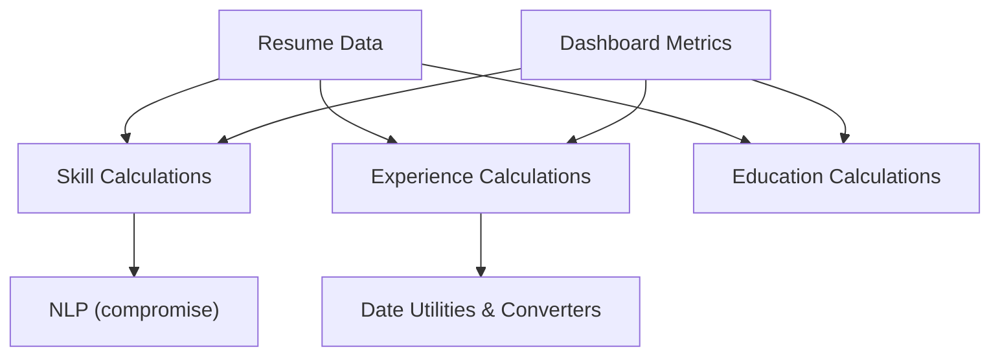
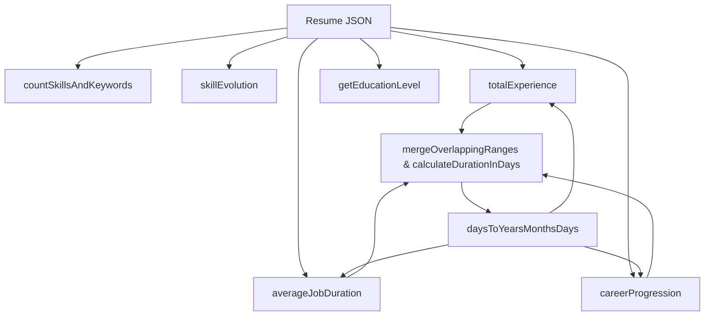
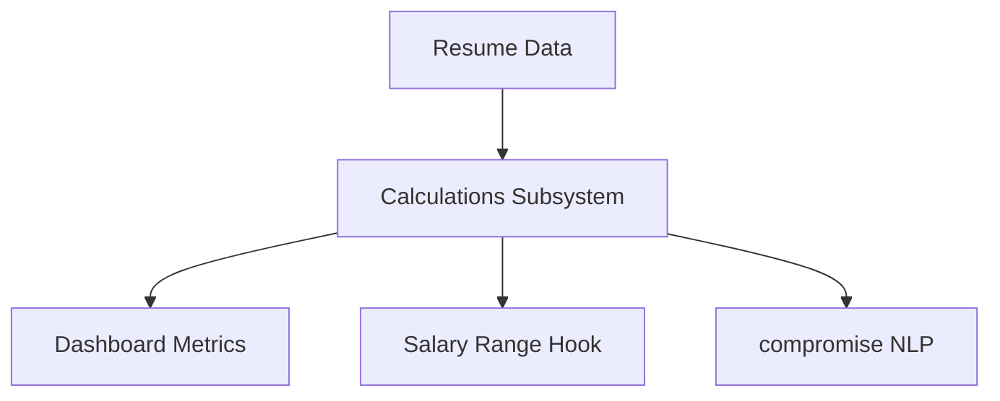

# Calculations

This module provides utility functions for analyzing and transforming resume data related to skills, experience, education, and date conversions. It supports counting skills and keywords, extracting skill evolution over time using natural language processing, computing total and average work experience durations, summarizing career progression by job title, determining the highest education level attained, and converting between various date and time representations. These calculations underpin dashboard metrics and job data visualizations elsewhere in the system.

## Purpose and Scope

This page documents the internal mechanisms for skill, experience, and education calculations, as well as date utilities and converters used throughout the registry application. It covers all exported functions and their private helpers from the calculation-related source files, detailing their data flows, algorithms, and edge cases. It does not cover UI components, data fetching, or persistence layers. For dashboard metrics aggregation, see the metrics utilities page. For salary range computations, see the salary range hook documentation.

## Architecture Overview

The calculations subsystem is organized into four main areas, each implemented in dedicated source files:

- Skill calculations (`skillCalculations.js`) handle skill counting and skill evolution extraction using NLP.
- Experience calculations (`experienceCalculations.js`) compute total experience, average job duration, and career progression summaries.
- Education calculations (`educationCalculations.js`) determine the highest education level from resume data.
- Date utilities and converters (`dateUtils.js`, `converters.js`) provide foundational date range merging, duration calculations, and conversions between days and years/months/days.

These components interoperate by passing resume data objects and intermediate date ranges, with date utilities underpinning experience calculations. The skill evolution mechanism uniquely applies NLP to job summaries and highlights to infer skills by year.

**Diagram: Data flow and component relationships within the calculations subsystem**

Sources: `apps/registry/lib/calculations/skillCalculations.js:8-66`, `apps/registry/lib/calculations/experienceCalculations.js:12-87`, `apps/registry/lib/calculations/educationCalculations.js:6-21`, `apps/registry/lib/calculations/dateUtils.js:7-55`, `apps/registry/lib/calculations/converters.js:6-13`

---

## Skill Calculations

Skill calculations focus on counting skills and keywords and extracting skill evolution over time from textual job descriptions using NLP.

### countSkillsAndKeywords

**Purpose:** Counts the total number of skills and associated keywords in a resume.

**Primary file:** `apps/registry/lib/calculations/skillCalculations.js:8-21`

| Variable      | Type       | Purpose                                                                                   |
|---------------|------------|-------------------------------------------------------------------------------------------|
| `skills`      | `Array`    | Extracted from `resume.skills` or empty array if missing; each element represents a skill. |
| `totalSkills` | `number`   | Accumulates the count of skills found in the resume.                                     |
| `totalKeywords` | `number` | Accumulates the total number of keywords across all skills.                              |

**Key behaviors:**
- Initializes `skills` from `resume.skills` or defaults to an empty array to avoid null/undefined errors.
- Iterates over each skill, incrementing `totalSkills` by one.
- For skills with a `keywords` array, adds the length of that array to `totalKeywords`.
- Returns an object containing both counts.

This function assumes `resume.skills` is an array of objects where each may optionally have a `keywords` array. It tolerates missing or empty skills gracefully.

Sources: `apps/registry/lib/calculations/skillCalculations.js:8-21`

---

### skillEvolution

**Purpose:** Extracts a timeline of skill acquisition by analyzing job summaries and highlights using NLP to identify nouns as potential skills, grouped by job start year.

**Primary file:** `apps/registry/lib/calculations/skillCalculations.js:28-66`

| Variable         | Type          | Purpose                                                                                      |
|------------------|---------------|----------------------------------------------------------------------------------------------|
| `workHistory`    | `Array`       | Extracted from `resume.work`; array of job objects with start dates and descriptions.        |
| `skillMap`       | `Map<number, Set<string>>` | Maps each start year to a set of unique skill strings extracted from job text.          |
| `startDate`      | `Date`        | Parsed start date of a job.                                                                  |
| `startYear`      | `number`      | Year extracted from `startDate`.                                                            |
| `jobSummary`     | `string`      | Job summary text or empty string if missing.                                                |
| `jobHighlights`  | `string`      | Concatenated job highlights or empty string if missing.                                     |
| `text`           | `string`      | Combined job summary and highlights for NLP processing.                                     |
| `doc`            | `nlp.Document`| NLP document created from `text` using the `compromise` library.                            |
| `potentialSkills`| `Array<string>`| Extracted nouns and proper nouns from `doc` representing candidate skills.                   |
| `evolution`      | `Array<Object>`| Array of objects with `year` and `skills` array, sorted by year ascending.                  |

**Key behaviors:**
- Iterates over each job in `workHistory`.
- Extracts the job's start year from its start date.
- Initializes a set in `skillMap` for the year if not present.
- Concatenates job summary and highlights into a single text blob.
- Uses `compromise` NLP to extract all nouns from the text, treating them as potential skills.
- Adds each extracted skill to the set for that year, ensuring uniqueness.
- After processing all jobs, converts the map entries to an array of `{ year, skills }` objects.
- Sorts the resulting array by year ascending before returning.

**Tradeoffs and edge cases:**
- The NLP extraction relies on noun identification, which can include false positives (common nouns not representing skills).
- Skills are grouped strictly by job start year, ignoring job end dates or overlapping periods.
- Jobs without summaries or highlights contribute no skills.
- The use of a `Set` per year prevents duplicate skills within the same year but does not aggregate across years.

Sources: `apps/registry/lib/calculations/skillCalculations.js:28-66`

---

## Experience Calculations

Experience calculations compute total work experience, average job duration, and career progression summaries by job title, leveraging date utilities for accurate duration handling.

### totalExperience

**Purpose:** Calculates total non-overlapping work experience duration from a resume's work history.

**Primary file:** `apps/registry/lib/calculations/experienceCalculations.js:12-27`

| Variable       | Type           | Purpose                                                                                      |
|----------------|----------------|----------------------------------------------------------------------------------------------|
| `workHistory`  | `Array`        | Extracted from `resume.work` or empty array if missing.                                      |
| `dateRanges`   | `Array<Object>`| Array of `{ startDate: Date, endDate: Date }` objects representing job periods.              |
| `mergedRanges` | `Array<Object>`| Result of merging overlapping date ranges to avoid double counting overlapping jobs.        |
| `totalDays`    | `number`       | Sum of durations in days across merged date ranges.                                         |

**Key behaviors:**
- Maps each job to a date range, parsing start and end dates; uses current date if end date is missing.
- Calls `mergeOverlappingRanges` to combine overlapping or contiguous date ranges into non-overlapping intervals.
- Sums the durations of merged ranges using `calculateDurationInDays`.
- Converts total days into years, months, and days using `daysToYearsMonthsDays`.
- Returns an object with `{ years, months, days }`.

**Edge cases:**
- Jobs with missing or invalid dates will cause `Date` parsing to produce `Invalid Date`, potentially resulting in NaN durations.
- Overlapping jobs are merged to prevent double counting, which is critical for accurate total experience.
- If no work history exists, returns zero durations.

Sources: `apps/registry/lib/calculations/experienceCalculations.js:12-27`

---

### averageJobDuration

**Purpose:** Computes the average duration of jobs in a resume's work history.

**Primary file:** `apps/registry/lib/calculations/experienceCalculations.js:34-49`

| Variable       | Type     | Purpose                                                                                      |
|----------------|----------|----------------------------------------------------------------------------------------------|
| `workHistory`  | `Array`  | Extracted from `resume.work`.                                                                |
| `totalDays`    | `number` | Sum of durations in days across all jobs.                                                   |
| `startDate`    | `Date`   | Parsed start date of a job.                                                                  |
| `endDate`      | `Date`   | Parsed end date of a job or current date if missing.                                        |
| `averageDays`  | `number` | Average duration in days calculated by dividing totalDays by number of jobs.                 |

**Key behaviors:**
- Returns zero durations if `workHistory` is empty or missing.
- Iterates over each job, summing durations in days.
- Calculates average days by dividing total days by job count.
- Converts average days to years, months, and days using `daysToYearsMonthsDays`.
- Returns the average duration object.

**Edge cases:**
- Jobs with missing end dates use the current date, which can inflate average durations if jobs are ongoing.
- Jobs with invalid dates will cause NaN durations, potentially corrupting the average.

Sources: `apps/registry/lib/calculations/experienceCalculations.js:34-49`

---

### careerProgression

**Purpose:** Summarizes career progression by aggregating total duration spent per job title across the resume's work history.

**Primary file:** `apps/registry/lib/calculations/experienceCalculations.js:56-87`

| Variable          | Type                    | Purpose                                                                                      |
|-------------------|-------------------------|----------------------------------------------------------------------------------------------|
| `workHistory`     | `Array`                 | Extracted from `resume.work` or empty array if missing.                                      |
| `progressionMap`  | `Map<string, {years:number, months:number}>` | Maps job titles to accumulated durations.                             |
| `startDate`       | `Date`                  | Parsed start date of a job.                                                                  |
| `endDate`         | `Date`                  | Parsed end date or current date if missing.                                                 |
| `durationInDays`  | `number`                | Duration of a single job in days.                                                            |
| `{ years, months }` | `Object`               | Converted duration from days to years and months.                                           |
| `currentDuration` | `{ years: number, months: number }` | Current accumulated duration for a job title.                              |
| `progression`     | `Array<Object>`         | Array of `{ title, duration }` objects representing total time spent per job title.          |

**Key behaviors:**
- Iterates over each job, calculating duration in days and converting to years and months.
- Accumulates durations per job title in `progressionMap`.
- Normalizes months exceeding 12 into additional years.
- Converts the map to an array of progression entries.
- Returns the progression array.

**Edge cases:**
- Jobs with missing or invalid dates produce inaccurate durations.
- Months are normalized only after accumulation, which can cause intermediate states with months > 12.
- Jobs with identical titles are aggregated regardless of chronology or employer.

Sources: `apps/registry/lib/calculations/experienceCalculations.js:56-87`

---

## Education Calculations

### getEducationLevel

**Purpose:** Determines the highest education level attained by selecting the education entry with the latest end date.

**Primary file:** `apps/registry/lib/calculations/educationCalculations.js:6-21`

| Variable           | Type    | Purpose                                                                                      |
|--------------------|---------|----------------------------------------------------------------------------------------------|
| `latestEducation`  | Object  | Tracks the education entry with the most recent end date.                                    |
| `eduEndDate`       | Date    | Parsed end date of the current education entry being compared.                               |
| `latestEduEndDate` | Date    | Parsed end date of the currently selected latest education entry.                            |

**Key behaviors:**
- Returns a default message if `resume.education` is missing or empty.
- Iterates over education entries, comparing end dates to find the latest.
- Returns the `studyType` field of the latest education entry.

**Edge cases:**
- Entries with missing or invalid `endDate` fields may cause incorrect comparisons.
- Does not consider education quality or level beyond the latest end date.
- Assumes `studyType` is a string describing the education level.

Sources: `apps/registry/lib/calculations/educationCalculations.js:6-21`

---

## Date Utilities

Date utilities provide foundational functions for calculating durations and merging date ranges.

### calculateDurationInDays

**Purpose:** Computes the duration in days between two dates.

**Primary file:** `apps/registry/lib/calculations/dateUtils.js:7-9`

- Accepts `startDate` and optional `endDate` (defaults to current date).
- Returns the difference in milliseconds converted to days.
- Does not round; returns fractional days.

Edge cases include invalid date inputs producing NaN results.

Sources: `apps/registry/lib/calculations/dateUtils.js:7-9`

---

### daysToYearsMonthsDays

**Purpose:** Converts a total number of days into an approximate breakdown of years, months, and days.

**Primary file:** `apps/registry/lib/calculations/dateUtils.js:16-23`

| Variable               | Type   | Purpose                                                  |
|------------------------|--------|----------------------------------------------------------|
| `years`                | number | Integer years calculated by dividing total days by 365. |
| `remainingDaysAfterYears` | number | Days remaining after extracting years.                  |
| `months`               | number | Integer months calculated by dividing remaining days by 30. |
| `days`                 | number | Remaining days after extracting months.                  |

- Uses fixed 365 days/year and 30 days/month approximations.
- Rounds days to nearest integer.
- Does not handle leap years or variable month lengths.

Sources: `apps/registry/lib/calculations/dateUtils.js:16-23`

---

### mergeOverlappingRanges

**Purpose:** Merges an array of date ranges into a minimal set of non-overlapping ranges.

**Primary file:** `apps/registry/lib/calculations/dateUtils.js:30-55`

| Variable       | Type           | Purpose                                                                                      |
|----------------|----------------|----------------------------------------------------------------------------------------------|
| `sorted`       | `Array<Object>`| Input ranges sorted by start date ascending.                                                |
| `merged`       | `Array<Object>`| Accumulates merged date ranges.                                                             |
| `currentRange` | `Object`       | Tracks the current range being merged.                                                      |
| `i`            | `number`       | Loop index over sorted ranges.                                                              |
| `nextRange`    | `Object`       | Next range to compare for overlap with `currentRange`.                                      |

**Key behaviors:**
- Returns empty array if input is empty.
- Sorts input ranges by start date ascending.
- Iterates over sorted ranges, merging overlapping or contiguous intervals by extending `currentRange.endDate`.
- Pushes non-overlapping ranges to `merged`.
- Returns filtered array removing any falsy values.

**Edge cases:**
- Assumes valid `startDate` and `endDate` on all ranges.
- Overlapping includes ranges where `currentRange.endDate` equals or exceeds `nextRange.startDate`.
- Does not merge if ranges are strictly disjoint.

Sources: `apps/registry/lib/calculations/dateUtils.js:30-55`

---

## Converters

### convertYearsToYearsMonthsDays

**Purpose:** Converts a decimal number of years into an object with integer years, months, and days.

**Primary file:** `apps/registry/lib/calculations/converters.js:6-13`

| Variable     | Type   | Purpose                                                  |
|--------------|--------|----------------------------------------------------------|
| `years`      | number | Integer part of total years.                              |
| `totalMonths`| number | Fractional part converted to months.                      |
| `months`     | number | Integer months extracted from totalMonths.               |
| `days`       | number | Remaining days calculated from fractional months.        |

- Uses 12 months per year and 30 days per month approximations.
- Rounds days to nearest integer.
- Useful for converting fractional year durations into human-readable components.

Sources: `apps/registry/lib/calculations/converters.js:6-13`

---

## Dashboard Metrics Integration

### getMetrics

**Purpose:** Aggregates multiple calculation functions to produce a comprehensive set of metrics for dashboard display.

**Primary file:** `apps/registry/app/[username]/dashboard/DashboardModule/utils/metrics.js:13-32`

- Calls `totalExperience`, `averageJobDuration`, `careerProgression`, and `getEducationLevel` with the resume.
- Extracts counts of jobs, projects, skills, certifications, awards, publications, and volunteer entries.
- Includes static or derived fields such as most frequent job title, most recent skill, top industries, and geographic mobility.
- Returns a flat object with all metrics.

Sources: `apps/registry/app/[username]/dashboard/DashboardModule/utils/metrics.js:13-32`

---

## Salary Range Hook

### useSalaryRange

**Purpose:** React hook that calculates and manages salary range data from job information, providing percentile-based filtering to mitigate outliers.

**Primary file:** `apps/registry/app/[username]/jobs-graph/hooks/useSalaryRange.js:10-56`

| Variable/Function | Type                  | Purpose                                                                                      |
|-------------------|-----------------------|----------------------------------------------------------------------------------------------|
| `salaryData`      | `State`               | Holds min, max, 5th and 95th percentiles, histogram, and raw salaries.                       |
| `filterRange`     | `State`               | User-selected salary filter range or `null` if no filter applied.                            |
| `range`           | `Object`              | Calculated salary range with percentiles from job info.                                     |
| `resetFilter`     | `Callback`            | Resets the filter range to `null`.                                                          |
| `setFilter`       | `Callback`            | Sets the filter range; clears filter if full range is selected.                             |
| `[salaryData, setSalaryData]` | `Array`      | React state tuple for salary data.                                                          |
| `[filterRange, setFilterRange]` | `Array`     | React state tuple for filter range.                                                         |

**Key behaviors:**
- Initializes salary data state with zeroed values.
- On job info changes, recalculates salary range using `calculateSalaryRangeWithPercentiles`.
- Updates salary data state only if min or max are non-zero.
- Provides filter controls to set or reset salary range filters.
- Exposes a boolean `hasFilter` indicating if a filter is active.

**Edge cases:**
- Handles empty or missing job info by early return without state updates.
- Uses percentile-based range to exclude outliers from filtering.
- Filter reset clears user selection to show full range.

Sources: `apps/registry/app/[username]/jobs-graph/hooks/useSalaryRange.js:10-56`

---

## How It Works

The calculations subsystem processes resume data through a pipeline of specialized functions, each responsible for a distinct aspect of data transformation and aggregation.

**Diagram: Data flow through calculations functions**

- The resume JSON is the input to all calculation functions.
- Skill calculations first count skills and keywords, then extract skill evolution by analyzing job text with NLP.
- Experience calculations convert job date ranges into merged intervals to avoid double counting, then compute total and average durations.
- Career progression aggregates durations per job title, normalizing months to years.
- Education calculation selects the latest education entry by end date.
- Date utilities provide reusable functions for duration calculations and range merging.
- Duration converters transform raw day counts or fractional years into human-readable year/month/day objects.

Sources: `apps/registry/lib/calculations/skillCalculations.js:8-66`, `apps/registry/lib/calculations/experienceCalculations.js:12-87`, `apps/registry/lib/calculations/educationCalculations.js:6-21`, `apps/registry/lib/calculations/dateUtils.js:7-55`, `apps/registry/lib/calculations/converters.js:6-13`

---

## Key Relationships

The calculations subsystem depends on the `compromise` NLP library for skill extraction. It is consumed by higher-level components such as dashboard metrics aggregation and job graph salary range hooks.

- The skill calculations module directly imports and uses `compromise` for noun extraction.
- Experience calculations rely on date utilities for accurate duration computations.
- Education calculations operate independently on education arrays.
- The dashboard metrics utility aggregates outputs from multiple calculation functions.
- The salary range hook uses calculation results indirectly via job info processing.

Sources: `apps/registry/lib/calculations/skillCalculations.js:8-66`, `apps/registry/lib/calculations/experienceCalculations.js:12-87`, `apps/registry/app/[username]/dashboard/DashboardModule/utils/metrics.js:13-32`, `apps/registry/app/[username]/jobs-graph/hooks/useSalaryRange.js:10-56`