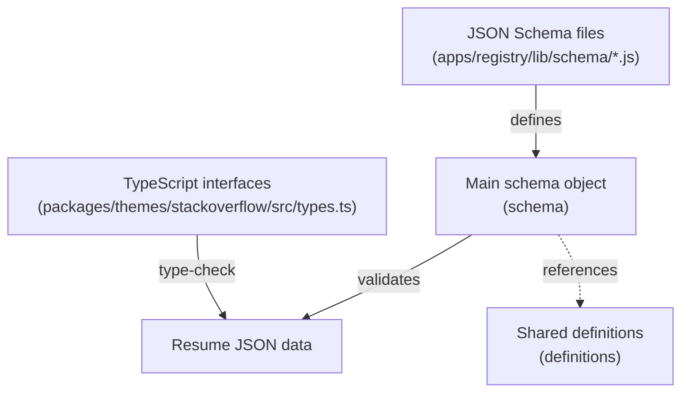
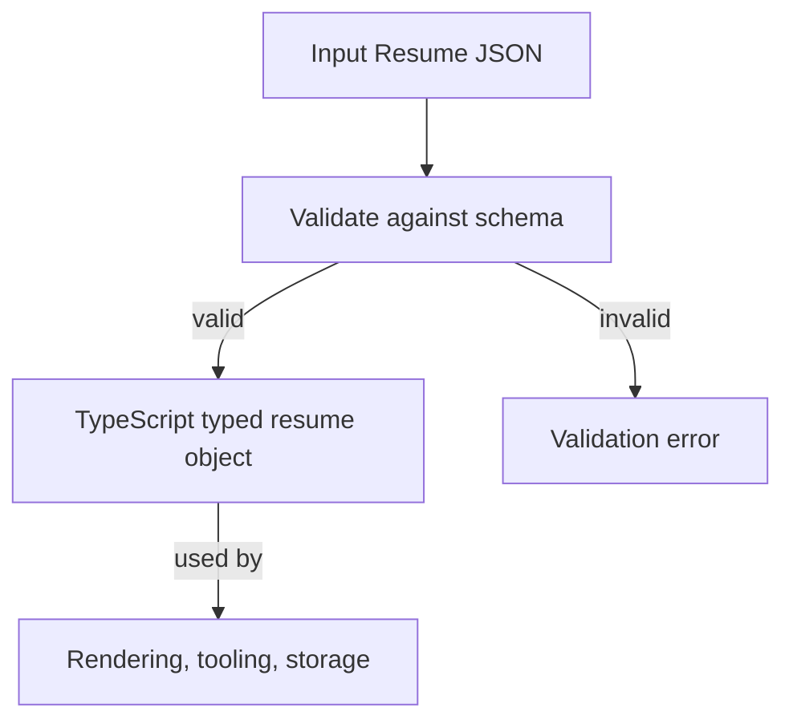
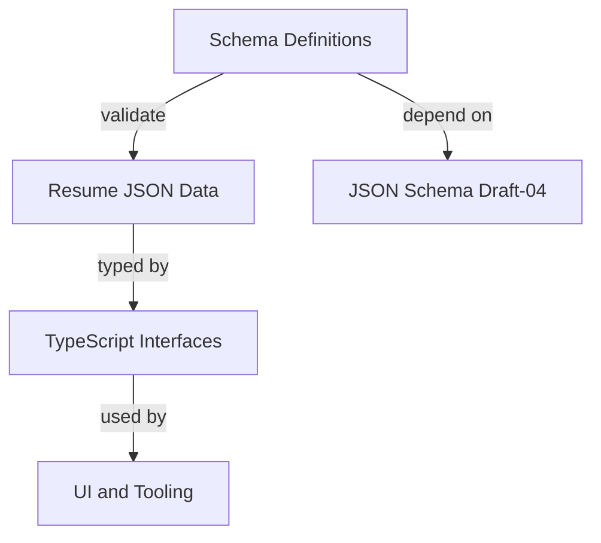

# Schema Definitions

This module defines the JSON schema and TypeScript types that model the structure of resumes within the system. It provides a comprehensive, strongly typed contract for all resume sections, including personal information, work history, education, skills, and metadata. These schemas enable validation, tooling, and consistent data interchange across components that consume or produce resume data.

## Purpose and Scope

This page documents the schema definitions and related TypeScript interfaces representing various resume sections. It covers the JSON Schema objects used for validation in the registry app (`apps/registry/lib/schema/*.js`) and the corresponding TypeScript interfaces used in the Stack Overflow theme (`packages/themes/stackoverflow/src/types.ts` and related files). It does not cover resume rendering, persistence, or transformation logic.

For how these schemas integrate into the resume processing pipeline, see the Pipeline Stages page. For UI components consuming these types, see the Theme Components page.

## Architecture Overview

This subsystem bridges JSON Schema validation and TypeScript typing for resume data. The JSON Schema definitions reside in the registry app under `apps/registry/lib/schema/`, split by resume section. The main schema object aggregates these section schemas and shared definitions. The TypeScript interfaces mirror these schemas, providing static typing for resume data in the Stack Overflow theme package.

**Diagram: Relationship between JSON Schema files, main schema, shared definitions, and TypeScript interfaces**

Sources: `apps/registry/lib/schema.js:16-43`, `apps/registry/lib/schema/definitions.js:4-12`, `packages/themes/stackoverflow/src/types.ts:46-88`

---

## Main Schema Object (`schema`)

**Purpose:** Defines the root JSON Schema object for validating complete resume JSON documents, aggregating all section schemas and shared definitions.  
**Primary file:** `apps/registry/lib/schema.js:16-43`

The `schema` object is a JSON Schema Draft-04 schema describing the entire resume structure. It disallows additional properties beyond those defined, ensuring strict validation.

| Field            | Type           | Purpose                                                                                      |
|------------------|----------------|----------------------------------------------------------------------------------------------|
| `$schema`        | `string`       | URI linking to the JSON Schema Draft-04 specification used for validation.                   |
| `additionalProperties` | `boolean` | Set to `false` to forbid properties not explicitly declared in `properties`.                |
| `definitions`    | `object`       | Shared schema definitions reused across sections (e.g., date format).                       |
| `properties`     | `object`       | Maps each resume section to its JSON Schema object.                                         |
| `title`          | `string`       | Human-readable title of the schema ("Resume Schema").                                       |
| `type`           | `string`       | Root type, always `"object"` for the resume document.                                       |

The `properties` field includes the following keys, each referencing a JSON Schema object imported from section-specific files:

- `$schema`: string URI of the schema version.
- `basics`: personal information schema.
- `work`: work experience schema.
- `volunteer`: volunteer work schema.
- `education`: education history schema.
- `awards`: awards schema.
- `certificates`: certificates schema.
- `publications`: publications schema.
- `skills`: skills schema.
- `languages`: languages schema.
- `interests`: interests schema.
- `references`: references schema.
- `projects`: projects schema.
- `meta`: metadata schema.

This structure enforces a strict contract for resume JSON documents, facilitating validation and tooling interoperability.

**Key behaviors:**
- Aggregates all section schemas into a single root schema object. `apps/registry/lib/schema.js:16-43`
- Disallows unknown properties at the root level to prevent schema drift. `apps/registry/lib/schema.js:20`
- References shared definitions for common patterns like ISO 8601 date strings. `apps/registry/lib/schema.js:21-22`
- Exports as the default export for consumption by validation tools. `apps/registry/lib/schema.js:43`

Sources: `apps/registry/lib/schema.js:16-43`

---

## Shared Definitions (`definitions`)

**Purpose:** Provides reusable JSON Schema fragments for common data types used across resume sections, primarily the ISO 8601 date format variant.  
**Primary file:** `apps/registry/lib/schema/definitions.js:4-12`

The `definitions` object currently contains:

| Field    | Type     | Purpose                                                                                                   |
|----------|----------|-----------------------------------------------------------------------------------------------------------|
| `iso8601` | `string` | A string matching a flexible ISO 8601 date pattern allowing year-only, year-month, full date, or empty string for ongoing roles. |

The `iso8601` pattern accepts:

- Full date: `YYYY-MM-DD` (e.g., 2014-06-29)
- Year and month: `YYYY-MM` (e.g., 2023-04)
- Year only: `YYYY` (e.g., 2023)
- Empty string: `""` (used to indicate ongoing roles without an end date)

This flexibility supports partial date information common in resumes.

**Key behaviors:**
- Defines a regex pattern enforcing allowed ISO 8601 date formats with optional components. `apps/registry/lib/schema/definitions.js:7-11`
- Enables reuse of this pattern via `$ref` in other section schemas.

Sources: `apps/registry/lib/schema/definitions.js:4-12`

---

## Basics Section Schema (`basics`)

**Purpose:** Defines the schema for the personal information section of a resume, including contact details, location, and social profiles.  
**Primary file:** `apps/registry/lib/schema/basics.js:4-91`

The `basics` schema is an object allowing additional properties beyond those explicitly declared, reflecting the variability of personal data.

| Field       | Type           | Purpose                                                                                                  |
|-------------|----------------|----------------------------------------------------------------------------------------------------------|
| `name`      | `string`       | Full name of the individual.                                                                             |
| `label`     | `string`       | Professional label or job title (e.g., "Web Developer").                                                 |
| `image`     | `string`       | URL to a JPEG or PNG image representing the individual.                                                  |
| `email`     | `string`       | Email address, validated as an email format.                                                             |
| `phone`     | `string`       | Phone number stored as a string, allowing any formatting.                                                |
| `url`       | `string`       | URL to personal website or homepage, validated as URI.                                                   |
| `summary`   | `string`       | Short biography or summary (2-3 sentences).                                                             |
| `location`  | `object`       | Nested object describing physical location with optional fields:                                        |
|             |                | - `address`: multiline address string (supports `\n` for line breaks).                                  |
|             |                | - `postalCode`: postal or ZIP code.                                                                     |
|             |                | - `city`: city name.                                                                                      |
|             |                | - `countryCode`: ISO-3166-1 alpha-2 country code (e.g., US, AU).                                        |
|             |                | - `region`: general region such as state or province.                                                   |
| `profiles`  | `array`        | Array of social network profiles, each an object with:                                                  |
|             |                | - `network`: social network name (e.g., Facebook).                                                      |
|             |                | - `username`: user handle on the network.                                                               |
|             |                | - `url`: URL to the profile, validated as URI.                                                          |

The schema allows additional properties at both the root and nested levels to accommodate extended or custom fields.

**Key behaviors:**
- Supports flexible personal information with optional fields. `apps/registry/lib/schema/basics.js:5-90`
- Validates email and URL fields with appropriate formats. `apps/registry/lib/schema/basics.js:18-32`
- Supports multiline addresses using newline characters. `apps/registry/lib/schema/basics.js:38-44`
- Allows multiple social profiles with structured network, username, and URL. `apps/registry/lib/schema/basics.js:53-89`

Sources: `apps/registry/lib/schema/basics.js:4-91`

---

## Work Experience Schema (`work`)

**Purpose:** Defines the schema for the work experience section, representing past employment entries with details and accomplishments.  
**Primary file:** `apps/registry/lib/schema/work.js:4-54`

The `work` schema is an array of objects, each describing a single work experience entry. Additional properties are allowed for extensibility.

| Field       | Type           | Purpose                                                                                                  |
|-------------|----------------|----------------------------------------------------------------------------------------------------------|
| `name`      | `string`       | Employer or company name (e.g., Facebook).                                                              |
| `location`  | `string`       | Location of the employer (e.g., Menlo Park, CA).                                                        |
| `description` | `string`     | Description of the company or role (e.g., Social Media Company).                                        |
| `position`  | `string`       | Job title or position held (e.g., Software Engineer).                                                   |
| `url`       | `string`       | URL to the company or role, validated as URI.                                                          |
| `startDate` | `string`       | Start date in ISO 8601 format (referencing shared `iso8601` definition).                                |
| `endDate`   | `string`       | End date in ISO 8601 format or empty string for ongoing roles.                                         |
| `summary`   | `string`       | Overview of responsibilities in the role.                                                              |
| `highlights`| `array`        | Array of strings listing accomplishments or notable achievements.                                       |

The schema forbids additional items beyond those declared in the array, ensuring a fixed structure per work entry.

**Key behaviors:**
- Represents work history as a strict array of structured objects. `apps/registry/lib/schema/work.js:5-53`
- Supports partial or ongoing dates via flexible ISO 8601 strings. `apps/registry/lib/schema/work.js:26-31`
- Allows multiple highlights to capture achievements per role. `apps/registry/lib/schema/work.js:38-52`

Sources: `apps/registry/lib/schema/work.js:4-54`

---

## Volunteer Work Schema (`volunteer`)

**Purpose:** Defines the schema for volunteer work entries, structurally similar to work experience but with distinct semantics.  
**Primary file:** `apps/registry/lib/schema/volunteer.js:4-46`

The `volunteer` schema is an array of objects with the following fields:

| Field         | Type           | Purpose                                                                                              |
|---------------|----------------|----------------------------------------------------------------------------------------------------|
| `organization`| `string`       | Name of the organization volunteered for (e.g., Facebook).                                         |
| `position`    | `string`       | Volunteer role or position (e.g., Software Engineer).                                              |
| `url`         | `string`       | URL to the organization or role, validated as URI.                                                 |
| `startDate`   | `string`       | Start date in flexible ISO 8601 format.                                                           |
| `endDate`     | `string`       | End date in flexible ISO 8601 format or empty string for ongoing roles.                            |
| `summary`     | `string`       | Overview of volunteer responsibilities.                                                           |
| `highlights`  | `array`        | Accomplishments or achievements during volunteer work.                                            |

Additional properties are allowed to support extended data.

**Key behaviors:**
- Mirrors the work schema structure but scoped to volunteer roles. `apps/registry/lib/schema/volunteer.js:5-45`
- Supports flexible date formats and ongoing roles. `apps/registry/lib/schema/volunteer.js:22-33`
- Allows multiple highlights to emphasize volunteer contributions. `apps/registry/lib/schema/volunteer.js:38-45`

Sources: `apps/registry/lib/schema/volunteer.js:4-46`

---

## Education Schema (`education`)

**Purpose:** Defines the schema for educational background entries, including institutions, study areas, and courses.  
**Primary file:** `apps/registry/lib/schema/education.js:4-49`

The `education` schema is an array of objects with these fields:

| Field       | Type           | Purpose                                                                                              |
|-------------|----------------|----------------------------------------------------------------------------------------------------|
| `institution`| `string`      | Name of the educational institution (e.g., Massachusetts Institute of Technology).                  |
| `url`       | `string`       | URL to the institution or program, validated as URI.                                               |
| `area`      | `string`       | Field of study or area (e.g., Arts).                                                               |
| `studyType` | `string`       | Degree or study type (e.g., Bachelor).                                                             |
| `startDate` | `string`       | Start date in flexible ISO 8601 format.                                                           |
| `endDate`   | `string`       | End date in flexible ISO 8601 format.                                                             |
| `score`     | `string`       | Grade point average or score (e.g., 3.67/4.0).                                                    |
| `courses`   | `array`        | List of notable courses or subjects studied.                                                      |

Additional properties are allowed for extensibility.

**Key behaviors:**
- Captures detailed education history with optional fields. `apps/registry/lib/schema/education.js:5-48`
- Supports partial dates and ongoing education via flexible ISO 8601 strings. `apps/registry/lib/schema/education.js:26-35`
- Allows listing of courses to highlight relevant academic work. `apps/registry/lib/schema/education.js:40-48`

Sources: `apps/registry/lib/schema/education.js:4-49`

---

## Awards Schema (`awards`)

**Purpose:** Defines the schema for professional awards received, including title, date, and awarding entity.  
**Primary file:** `apps/registry/lib/schema/awards.js:4-30`

The `awards` schema is an array of objects with these fields:

| Field     | Type           | Purpose                                                                                              |
|-----------|----------------|----------------------------------------------------------------------------------------------------|
| `title`   | `string`       | Name or title of the award (e.g., One of the 100 greatest minds of the century).                    |
| `date`    | `string`       | Date awarded in flexible ISO 8601 format.                                                          |
| `awarder` | `string`       | Entity or organization granting the award (e.g., Time Magazine).                                   |
| `summary` | `string`       | Brief description or reason for the award.                                                        |

Additional properties are allowed.

**Key behaviors:**
- Lists awards as an array of structured objects. `apps/registry/lib/schema/awards.js:5-29`
- Supports flexible date formats. `apps/registry/lib/schema/awards.js:15-23`

Sources: `apps/registry/lib/schema/awards.js:4-30`

---

## Certificates Schema (`certificates`)

**Purpose:** Defines the schema for professional certificates earned, including issuer and date.  
**Primary file:** `apps/registry/lib/schema/certificates.js:4-31`

The `certificates` schema is an array of objects with these fields:

| Field   | Type           | Purpose                                                                                              |
|---------|----------------|----------------------------------------------------------------------------------------------------|
| `name`  | `string`       | Name of the certificate (e.g., Certified Kubernetes Administrator).                                |
| `date`  | `string`       | Date issued in flexible ISO 8601 format.                                                           |
| `url`   | `string`       | URL to certificate details or verification, validated as URI.                                      |
| `issuer`| `string`       | Organization issuing the certificate (e.g., CNCF).                                                 |

Additional properties are allowed.

**Key behaviors:**
- Captures certificates as an array of structured entries. `apps/registry/lib/schema/certificates.js:5-30`
- Supports flexible date formats and URL validation. `apps/registry/lib/schema/certificates.js:15-27`

Sources: `apps/registry/lib/schema/certificates.js:4-31`

---

## Publications Schema (`publications`)

**Purpose:** Defines the schema for publications authored or contributed to, including publisher and release date.  
**Primary file:** `apps/registry/lib/schema/publications.js:4-36`

The `publications` schema is an array of objects with these fields:

| Field       | Type           | Purpose                                                                                              |
|-------------|----------------|----------------------------------------------------------------------------------------------------|
| `name`      | `string`       | Title of the publication (e.g., The World Wide Web).                                               |
| `publisher` | `string`       | Publisher or outlet (e.g., IEEE, Computer Magazine).                                               |
| `releaseDate`| `string`      | Publication date in flexible ISO 8601 format.                                                     |
| `url`       | `string`       | URL to the publication, validated as URI.                                                         |
| `summary`   | `string`       | Short summary describing the publication content.                                                 |

Additional properties are allowed.

**Key behaviors:**
- Lists publications as an array of detailed entries. `apps/registry/lib/schema/publications.js:5-35`
- Supports flexible date formats and URL validation. `apps/registry/lib/schema/publications.js:20-34`

Sources: `apps/registry/lib/schema/publications.js:4-36`

---

## Skills Schema (`skills`)

**Purpose:** Defines the schema for professional skills, including proficiency level and related keywords.  
**Primary file:** `apps/registry/lib/schema/skills.js:4-31`

The `skills` schema is an array of objects with these fields:

| Field     | Type           | Purpose                                                                                              |
|-----------|----------------|----------------------------------------------------------------------------------------------------|
| `name`    | `string`       | Name of the skill (e.g., Web Development).                                                        |
| `level`   | `string`       | Proficiency level (e.g., Master).                                                                  |
| `keywords`| `array`        | List of keywords related to the skill (e.g., HTML).                                               |

Additional properties are allowed.

**Key behaviors:**
- Captures skills as an array with structured details. `apps/registry/lib/schema/skills.js:5-30`
- Supports keyword arrays to describe skill facets. `apps/registry/lib/schema/skills.js:20-29`

Sources: `apps/registry/lib/schema/skills.js:4-31`

---

## Languages Schema (`languages`)

**Purpose:** Defines the schema for languages spoken, including fluency level.  
**Primary file:** `apps/registry/lib/schema/languages.js:4-22`

The `languages` schema is an array of objects with these fields:

| Field     | Type           | Purpose                                                                                              |
|-----------|----------------|----------------------------------------------------------------------------------------------------|
| `language`| `string`       | Name of the language (e.g., English, Spanish).                                                    |
| `fluency` | `string`       | Fluency level (e.g., Fluent, Beginner).                                                           |

Additional properties are allowed.

**Key behaviors:**
- Lists languages with optional fluency descriptors. `apps/registry/lib/schema/languages.js:5-21`

Sources: `apps/registry/lib/schema/languages.js:4-22`

---

## Interests Schema (`interests`)

**Purpose:** Defines the schema for personal interests, including related keywords.  
**Primary file:** `apps/registry/lib/schema/interests.js:4-25`

The `interests` schema is an array of objects with these fields:

| Field     | Type           | Purpose                                                                                              |
|-----------|----------------|----------------------------------------------------------------------------------------------------|
| `name`    | `string`       | Name of the interest (e.g., Philosophy).                                                          |
| `keywords`| `array`        | List of keywords related to the interest (e.g., Friedrich Nietzsche).                             |

Additional properties are allowed.

**Key behaviors:**
- Captures interests with optional keyword arrays. `apps/registry/lib/schema/interests.js:5-24`

Sources: `apps/registry/lib/schema/interests.js:4-25`

---

## References Schema (`references`)

**Purpose:** Defines the schema for professional references, including the referee's name and their testimonial.  
**Primary file:** `apps/registry/lib/schema/references.js:4-23`

The `references` schema is an array of objects with these fields:

| Field       | Type           | Purpose                                                                                              |
|-------------|----------------|----------------------------------------------------------------------------------------------------|
| `name`      | `string`       | Name of the reference person (e.g., Timothy Cook).                                                |
| `reference` | `string`       | Text of the reference or testimonial.                                                             |

Additional properties are allowed.

**Key behaviors:**
- Lists references as an array of name and testimonial pairs. `apps/registry/lib/schema/references.js:5-22`

Sources: `apps/registry/lib/schema/references.js:4-23`

---

## Projects Schema (`projects`)

**Purpose:** Defines the schema for career projects, including roles, dates, and descriptive metadata.  
**Primary file:** `apps/registry/lib/schema/projects.js:4-71`

The `projects` schema is an array of objects with these fields:

| Field       | Type           | Purpose                                                                                              |
|-------------|----------------|----------------------------------------------------------------------------------------------------|
| `name`      | `string`       | Project name (e.g., The World Wide Web).                                                          |
| `description`| `string`      | Short summary of the project.                                                                      |
| `highlights`| `array`        | List of notable features or accomplishments.                                                      |
| `keywords`  | `array`        | Special elements or technologies involved.                                                        |
| `startDate` | `string`       | Project start date in flexible ISO 8601 format.                                                   |
| `endDate`   | `string`       | Project end date in flexible ISO 8601 format.                                                     |
| `url`       | `string`       | URL to project details, validated as URI.                                                         |
| `roles`     | `array`        | Roles held on the project (e.g., Team Lead, Speaker).                                             |
| `entity`    | `string`       | Company or entity affiliation (e.g., greenpeace).                                                |
| `type`      | `string`       | Project type (e.g., volunteering, presentation).                                                  |

Additional properties are allowed.

**Key behaviors:**
- Captures detailed project metadata for career highlights. `apps/registry/lib/schema/projects.js:5-70`
- Supports multiple roles and keywords to describe involvement. `apps/registry/lib/schema/projects.js:50-70`

Sources: `apps/registry/lib/schema/projects.js:4-71`

---

## Meta Schema (`meta`)

**Purpose:** Defines the schema for metadata about the resume document, including versioning and tooling information.  
**Primary file:** `apps/registry/lib/schema/meta.js:4-24`

The `meta` schema is an object with these fields:

| Field        | Type     | Purpose                                                                                              |
|--------------|----------|----------------------------------------------------------------------------------------------------|
| `canonical`  | `string` | URL to the latest version of the resume document, validated as URI.                                |
| `version`    | `string` | Semantic version string of the schema (e.g., v1.0.0).                                             |
| `lastModified`| `string` | ISO 8601 timestamp indicating last modification (format YYYY-MM-DDThh:mm:ss).                      |

Additional properties are allowed.

**Key behaviors:**
- Captures version and canonical URL for tooling and validation. `apps/registry/lib/schema/meta.js:5-23`

Sources: `apps/registry/lib/schema/meta.js:4-24`

---

## TypeScript Interfaces

The TypeScript interfaces mirror the JSON Schema definitions, providing static typing for resume data in the Stack Overflow theme package. They enable type-safe manipulation and validation at compile time.

### Resume Interface (`Resume`)

**Purpose:** Represents the entire resume document as a strongly typed object with optional sections.  
**Primary file:** `packages/themes/stackoverflow/src/types.ts:46-88`

| Field          | Type                          | Purpose                                                                                              |
|----------------|-------------------------------|----------------------------------------------------------------------------------------------------|
| `$schema`      | `string | undefined`           | Optional URI to the schema version validating this resume.                                         |
| `basics`       | `Basics | undefined`          | Optional personal information section.                                                             |
| `work`         | `Work[] | undefined`          | Optional array of work experience entries.                                                         |
| `volunteer`    | `Volunteer[] | undefined`     | Optional array of volunteer work entries.                                                          |
| `education`    | `EducationProps[] | undefined`| Optional array of education entries.                                                               |
| `awards`       | `Award[] | undefined`         | Optional array of awards received.                                                                 |
| `certificates` | `Certificate[] | undefined`   | Optional array of certificates earned.                                                             |
| `publications` | `Publication[] | undefined`   | Optional array of publications authored.                                                           |
| `skills`       | `Skill[] | undefined`         | Optional array of professional skills.                                                             |
| `languages`    | `Language[] | undefined`      | Optional array of languages spoken.                                                                |
| `interests`    | `Interest[] | undefined`      | Optional array of personal interests.                                                              |
| `references`   | `Reference[] | undefined`     | Optional array of professional references.                                                        |
| `projects`     | `Project[] | undefined`       | Optional array of career projects.                                                                 |
| `meta`         | `Meta | undefined`            | Optional metadata about the resume document.                                                       |

All fields are optional, allowing partial resumes. Undefined signals absence of the section.

**Key behaviors:**
- Provides a comprehensive type for the entire resume document. `packages/themes/stackoverflow/src/types.ts:46-88`
- Uses optional fields to accommodate incomplete data. `packages/themes/stackoverflow/src/types.ts:46-88`

Sources: `packages/themes/stackoverflow/src/types.ts:46-88`

---

### Basics Interface (`Basics`)

**Purpose:** Represents the personal information section with contact and profile details.  
**Primary file:** `packages/themes/stackoverflow/src/types/base-types.ts:97-128`

| Field       | Type           | Purpose                                                                                              |
|-------------|----------------|----------------------------------------------------------------------------------------------------|
| `name`      | `string | undefined` | Full name.                                                                                        |
| `label`     | `string | undefined` | Professional label or job title.                                                                  |
| `image`     | `string | undefined` | URL to profile image.                                                                             |
| `email`     | `string | undefined` | Email address.                                                                                     |
| `phone`     | `string | undefined` | Phone number as string.                                                                            |
| `url`       | `string | undefined` | URL to personal website.                                                                           |
| `summary`   | `string | undefined` | Short biography.                                                                                   |
| `location`  | `Location | undefined` | Nested location object.                                                                            |
| `profiles`  | `Profile[] | undefined` | Array of social profiles.                                                                          |

Sources: `packages/themes/stackoverflow/src/types/base-types.ts:97-128`

---

### Work Interface (`Work`)

**Purpose:** Represents a single work experience entry.  
**Primary file:** `packages/themes/stackoverflow/src/types/work-types.ts:28-64`

| Field       | Type           | Purpose                                                                                              |
|-------------|----------------|----------------------------------------------------------------------------------------------------|
| `name`      | `string | undefined` | Employer or company name.                                                                          |
| `location`  | `string | undefined` | Location of the employer.                                                                          |
| `description`| `string | undefined` | Description of the company or role.                                                               |
| `position`  | `string | undefined` | Job title.                                                                                        |
| `url`       | `string | undefined` | URL to company or role.                                                                            |
| `startDate` | `Iso8601 | undefined` | Start date.                                                                                       |
| `endDate`   | `Iso8601 | undefined` | End date.                                                                                         |
| `summary`   | `string | undefined` | Overview of responsibilities.                                                                     |
| `highlights`| `string[] | undefined` | Accomplishments.                                                                                  |
| `keywords`  | `string[] | undefined` | Keywords related to the work experience.                                                         |

Sources: `packages/themes/stackoverflow/src/types/work-types.ts:28-64`

---

### Volunteer Interface (`Volunteer`)

**Purpose:** Represents a single volunteer work entry.  
**Primary file:** `packages/themes/stackoverflow/src/types/work-types.ts:3-26`

| Field         | Type           | Purpose                                                                                              |
|---------------|----------------|----------------------------------------------------------------------------------------------------|
| `organization`| `string | undefined` | Name of the organization.                                                                         |
| `position`    | `string | undefined` | Volunteer role.                                                                                   |
| `url`         | `string | undefined` | URL to organization or role.                                                                      |
| `startDate`   | `Iso8601 | undefined` | Start date.                                                                                       |
| `endDate`     | `Iso8601 | undefined` | End date.                                                                                         |
| `summary`     | `string | undefined` | Overview of responsibilities.                                                                     |
| `highlights`  | `string[] | undefined` | Accomplishments.                                                                                  |

Sources: `packages/themes/stackoverflow/src/types/work-types.ts:3-26`

---

### Project Interface (`Project`)

**Purpose:** Represents a career project with descriptive metadata and roles.  
**Primary file:** `packages/themes/stackoverflow/src/types/project-types.ts:3-38`

| Field       | Type           | Purpose                                                                                              |
|-------------|----------------|----------------------------------------------------------------------------------------------------|
| `name`      | `string | undefined` | Project name.                                                                                      |
| `description`| `string | undefined` | Short summary.                                                                                    |
| `highlights`| `string[] | undefined` | Notable features.                                                                                 |
| `keywords`  | `string[] | undefined` | Technologies or elements involved.                                                                |
| `startDate` | `Iso8601 | undefined` | Start date.                                                                                       |
| `endDate`   | `Iso8601 | undefined` | End date.                                                                                         |
| `url`       | `string | undefined` | URL to project details.                                                                            |
| `roles`     | `string[] | undefined` | Roles held.                                                                                       |
| `entity`    | `string | undefined` | Company or entity affiliation.                                                                    |
| `type`      | `string | undefined` | Project type (e.g., volunteering, presentation).                                                  |

Sources: `packages/themes/stackoverflow/src/types/project-types.ts:3-38`

---

### EducationProps Interface (`EducationProps`)

**Purpose:** Represents an education entry with institution, study details, and courses.  
**Primary file:** `packages/themes/stackoverflow/src/types/education-types.ts:3-31`

| Field       | Type           | Purpose                                                                                              |
|-------------|----------------|----------------------------------------------------------------------------------------------------|
| `institution`| `string | undefined` | Name of institution.                                                                              |
| `url`       | `string | undefined` | URL to institution or program.                                                                    |
| `area`      | `string | undefined` | Field of study.                                                                                   |
| `studyType` | `string | undefined` | Degree or study type.                                                                             |
| `startDate` | `Iso8601 | undefined` | Start date.                                                                                       |
| `endDate`   | `Iso8601 | undefined` | End date.                                                                                         |
| `score`     | `string | undefined` | Grade point average or score.                                                                     |
| `courses`   | `string[] | undefined` | List of notable courses.                                                                          |

Sources: `packages/themes/stackoverflow/src/types/education-types.ts:3-31`

---

### Certificate Interface (`Certificate`)

**Purpose:** Represents a professional certificate entry.  
**Primary file:** `packages/themes/stackoverflow/src/types/education-types.ts:33-50`

| Field   | Type           | Purpose                                                                                              |
|---------|----------------|----------------------------------------------------------------------------------------------------|
| `name`  | `string | undefined` | Certificate name.                                                                                  |
| `date`  | `string | undefined` | Date issued.                                                                                      |
| `url`   | `string | undefined` | URL to certificate details.                                                                       |
| `issuer`| `string | undefined` | Issuing organization.                                                                             |

Sources: `packages/themes/stackoverflow/src/types/education-types.ts:33-50`

---

### Award Interface (`Award`)

**Purpose:** Represents an award entry.  
**Primary file:** `packages/themes/stackoverflow/src/types/education-types.ts:52-66`

| Field     | Type           | Purpose                                                                                              |
|-----------|----------------|----------------------------------------------------------------------------------------------------|
| `title`   | `string | undefined` | Award title.                                                                                      |
| `date`    | `Iso8601 | undefined` | Date awarded.                                                                                     |
| `awarder` | `string | undefined` | Awarding organization.                                                                           |
| `summary` | `string | undefined` | Description or reason for award.                                                                  |

Sources: `packages/themes/stackoverflow/src/types/education-types.ts:52-66`

---

### Publication Interface (`Publication`)

**Purpose:** Represents a publication entry.  
**Primary file:** `packages/themes/stackoverflow/src/types/education-types.ts:68-86`

| Field       | Type           | Purpose                                                                                              |
|-------------|----------------|----------------------------------------------------------------------------------------------------|
| `name`      | `string | undefined` | Publication title.                                                                               |
| `publisher` | `string | undefined` | Publisher name.                                                                                  |
| `releaseDate`| `Iso8601 | undefined` | Publication date.                                                                               |
| `url`       | `string | undefined` | URL to publication.                                                                             |
| `summary`   | `string | undefined` | Short summary of publication content.                                                           |

Sources: `packages/themes/stackoverflow/src/types/education-types.ts:68-86`

---

### Other Base Interfaces

The following interfaces represent smaller data structures used in multiple sections:

| Interface | Purpose                                                                                              | Source Lines |
|-----------|----------------------------------------------------------------------------------------------------|--------------|
| `Iso8601` | String type alias for flexible ISO 8601 date strings.                                              | `packages/themes/stackoverflow/src/types/base-types.ts:1-1` |
| `Location`| Represents a physical location with address, postal code, city, country code, and region.          | `packages/themes/stackoverflow/src/types/base-types.ts:3-20` |
| `Profile` | Social network profile with network name, username, and URL.                                       | `packages/themes/stackoverflow/src/types/base-types.ts:22-35` |
| `Skill`   | Professional skill with name, level, and keywords.                                                 | `packages/themes/stackoverflow/src/types/base-types.ts:37-50` |
| `Language`| Language spoken with fluency level.                                                                | `packages/themes/stackoverflow/src/types/base-types.ts:52-61` |
| `Interest`| Personal interest with name and keywords.                                                         | `packages/themes/stackoverflow/src/types/base-types.ts:63-69` |
| `Meta`    | Metadata about the resume document including canonical URL, version, and last modified timestamp.  | `packages/themes/stackoverflow/src/types/base-types.ts:71-84` |
| `Reference`| Professional reference with name and testimonial.                                                | `packages/themes/stackoverflow/src/types/base-types.ts:86-95` |

Sources: `packages/themes/stackoverflow/src/types/base-types.ts:1-95`

---

## How It Works

The resume schema subsystem orchestrates validation and typing of resume data through the following flow:

1. The resume JSON document is validated against the `schema` object, which references all section schemas and shared definitions.  
2. Each section schema enforces structure, types, and formats, such as ISO 8601 dates and URI formats.  
3. Upon successful validation, the JSON data can be safely cast or parsed into the corresponding TypeScript `Resume` interface, ensuring type safety.  
4. Consumers such as renderers, editors, or exporters use the typed data for further processing.  
5. Validation errors are surfaced early to prevent malformed data propagation.

This design separates concerns: JSON Schema handles runtime validation, while TypeScript interfaces provide static guarantees during development.

Sources: `apps/registry/lib/schema.js:16-43`, `packages/themes/stackoverflow/src/types.ts:46-88`

---

## Key Relationships

The schema definitions subsystem depends on:

- JSON Schema Draft-04 specification for validation semantics.
- Shared definitions for common patterns like flexible ISO 8601 dates.
- TypeScript interfaces for static typing in UI and tooling layers.

It is consumed by:

- Resume validation components in the registry app.
- Resume rendering and editing components in the Stack Overflow theme.
- Exporters and importers that transform resume data to/from JSON.

**Relationships to adjacent subsystems**

Sources: `apps/registry/lib/schema.js:16-43`, `packages/themes/stackoverflow/src/types.ts:46-88`