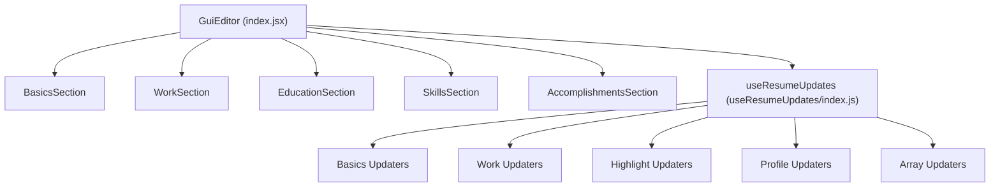
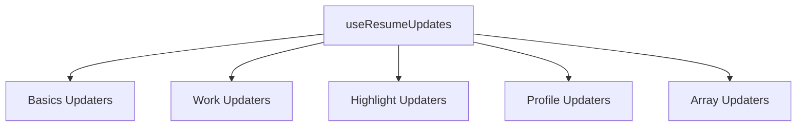
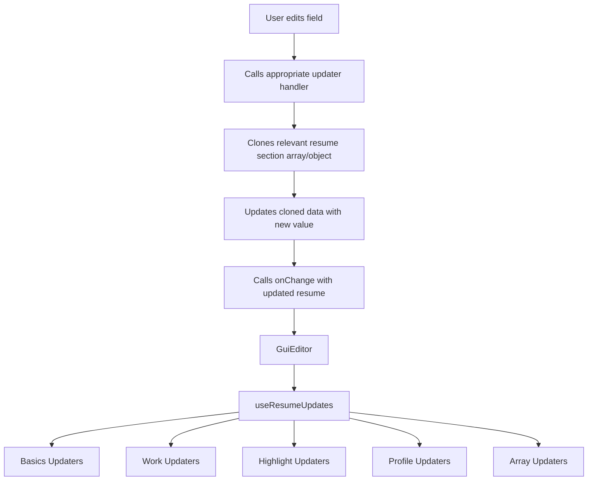
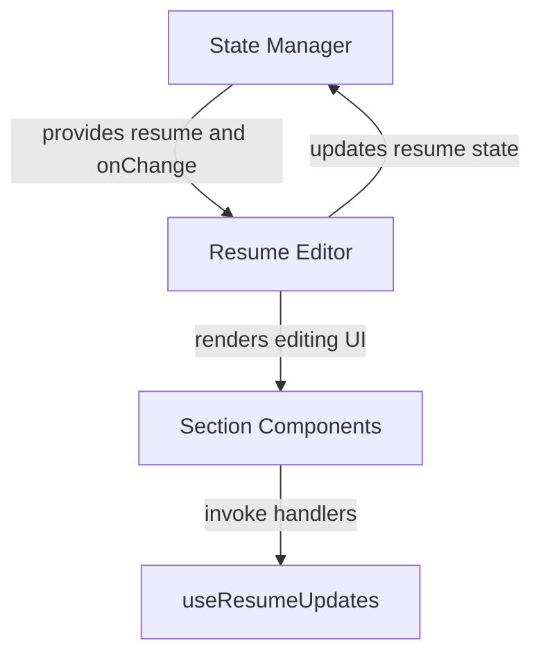

# Resume Editor

The Resume Editor subsystem provides a comprehensive set of React GUI components and hooks designed for editing various sections of a resume and managing the resume state. It offers fine-grained update handlers for different resume sections, enabling seamless state synchronization and user interaction within a resume editing application.

## Purpose and Scope

This page documents the internal mechanisms of the Resume Editor subsystem, focusing on its core React components and the hooks that manage resume state updates. It covers the architecture and implementation of the editor UI sections, update handlers for resume data, and the orchestration of these parts to provide a cohesive editing experience.

This documentation does not cover the rendering or preview of resumes outside the editor context, nor does it address persistence or backend integration. For rendering the resume preview, see the Resume Preview subsystem. For data persistence and API interactions, see the Data Layer subsystem.

## Architecture Overview

The Resume Editor subsystem is composed of a top-level `GuiEditor` component that orchestrates multiple section components such as Basics, Work, Education, Skills, and Accomplishments. Each section receives a set of update handlers created by the `useResumeUpdates` hook, which consolidates specialized updater functions for different resume parts.



**Diagram: Component and updater hook relationships in the Resume Editor subsystem**

Sources: `apps/registry/app/components/GuiEditor/index.jsx:10-22`, `apps/registry/app/components/GuiEditor/useResumeUpdates/index.js:7-21`

## GuiEditor Component

**Purpose:** Serves as the root GUI component that renders all resume editing sections and provides them with unified update handlers.

**Primary file:** `apps/registry/app/components/GuiEditor/index.jsx:10-22`

The `GuiEditor` function component accepts the current `resume` state and an `onChange` callback to propagate updates. It invokes the `useResumeUpdates` hook to generate a comprehensive set of handlers for updating resume data. These handlers are passed down to each section component.

The component renders the following sections in order: Basics, Work, Education, Skills, and Accomplishments, each receiving the current resume state and the handlers.

**Key behaviors:**
- Calls `useResumeUpdates` with the current resume and onChange callback to create update handlers. `index.jsx:11`
- Renders all major resume sections as child components, passing down state and handlers. `apps/registry/app/components/GuiEditor/index.jsx:13-21`

Sources: `apps/registry/app/components/GuiEditor/index.jsx:10-22`

## useResumeUpdates Hook

**Purpose:** Aggregates specialized updater functions for different resume sections into a single handlers object.

**Primary file:** `apps/registry/app/components/GuiEditor/useResumeUpdates/index.js:7-21`

This hook composes updater functions from several modules: basics, work, highlights, profiles, and generic array updaters. It returns a merged object containing all these handlers, enabling components to update any part of the resume state consistently.

| Field           | Type     | Purpose                                                                                  |
|-----------------|----------|------------------------------------------------------------------------------------------|
| basicsUpdaters  | Object   | Handlers for updating basic resume fields and location.                                 |
| workUpdaters    | Object   | Handlers for managing work experience entries.                                          |
| highlightUpdaters | Object | Handlers for managing highlights within work experience entries.                         |
| profileUpdaters | Object   | Handlers for managing social profiles under basics.                                     |
| arrayUpdaters   | Object   | Generic handlers for updating, adding, and removing items in array-based resume sections.|



**Key behaviors:**
- Creates and merges updater functions from multiple specialized modules. `apps/registry/app/components/GuiEditor/useResumeUpdates/index.js:7-21`
- Ensures all resume editing components receive a consistent and complete set of handlers. `apps/registry/app/components/GuiEditor/useResumeUpdates/index.js:7-21`

Sources: `apps/registry/app/components/GuiEditor/useResumeUpdates/index.js:7-21`

## Work Section and Updaters

### WorkSection Component

**Purpose:** Renders the work experience section of the resume editor, allowing editing of each job entry and its highlights.

**Primary file:** `apps/registry/app/components/GuiEditor/WorkSection.jsx:6-42`

The `WorkSection` component receives the resume and handlers, destructuring specific work-related handlers such as `updateWorkExperience`, `addWorkExperience`, `removeWorkExperience`, and highlight handlers. It renders editable fields for each work experience entry and its highlights.

**Key behaviors:**
- Maps over the `work` array in the resume, rendering each job with editable fields. `apps/registry/app/components/GuiEditor/WorkSection.jsx:20-40`
- Supports adding, updating, and removing work experience entries and their highlights via handlers. `apps/registry/app/components/GuiEditor/WorkSection.jsx:7-14`

Sources: `apps/registry/app/components/GuiEditor/WorkSection.jsx:6-42`

### Work Updaters

**Purpose:** Provides functions to update, add, and remove work experience entries in the resume state.

**Primary file:** `apps/registry/app/components/GuiEditor/useResumeUpdates/workUpdaters.js:17-42`

The `createWorkUpdaters` factory function returns handlers scoped to the current resume and onChange callback. It manages immutable updates to the `work` array by cloning and modifying copies before invoking `onChange`.

| Method              | Purpose                                                                                      |
|---------------------|----------------------------------------------------------------------------------------------|
| updateWorkExperience | Updates a specific field of a work experience entry at a given index.                        |
| addWorkExperience    | Appends a new work experience entry using a predefined template.                             |
| removeWorkExperience | Removes a work experience entry at a specified index.                                       |

```js
const updateWorkExperience = (index, field, value) => {
  const newWork = [...(resume.work || [])];
  newWork[index] = { ...newWork[index], [field]: value };
  onChange({ ...resume, work: newWork });
};
```

**Key behaviors:**
- Clones the existing work array to maintain immutability before updates. `apps/registry/app/components/GuiEditor/useResumeUpdates/workUpdaters.js:18-22`
- Adds a new work entry using a constant template to ensure consistent structure. `apps/registry/app/components/GuiEditor/useResumeUpdates/workUpdaters.js:24-29`
- Removes an entry by splicing the cloned array and updating state. `apps/registry/app/components/GuiEditor/useResumeUpdates/workUpdaters.js:31-35`

Sources: `apps/registry/app/components/GuiEditor/useResumeUpdates/workUpdaters.js:17-42`

### Highlight Updaters

**Purpose:** Manages the highlights array within individual work experience entries.

**Primary file:** `apps/registry/app/components/GuiEditor/useResumeUpdates/highlightUpdaters.js:5-32`

This module provides handlers to add, update, and remove highlights for a specific work experience entry. It clones the work array and the highlights array inside the targeted work entry to maintain immutability.

| Method          | Purpose                                                                                  |
|-----------------|------------------------------------------------------------------------------------------|
| addHighlight    | Adds an empty highlight string to the highlights array of a specified work entry.       |
| updateHighlight | Updates a highlight string at a given index within a work entry.                         |
| removeHighlight | Removes a highlight at a specified index within a work entry.                           |

```js
const addHighlight = (workIndex) => {
  const newWork = [...(resume.work || [])];
  newWork[workIndex] = {
    ...newWork[workIndex],
    highlights: [...(newWork[workIndex].highlights || []), ''],
  };
  onChange({ ...resume, work: newWork });
};
```

**Key behaviors:**
- Ensures deep cloning of nested highlights arrays to avoid mutating original state. `apps/registry/app/components/GuiEditor/useResumeUpdates/highlightUpdaters.js:6-13`
- Updates highlights by index with new values, triggering state updates. `apps/registry/app/components/GuiEditor/useResumeUpdates/highlightUpdaters.js:15-19`
- Removes highlights by splicing the cloned highlights array. `apps/registry/app/components/GuiEditor/useResumeUpdates/highlightUpdaters.js:21-25`

Sources: `apps/registry/app/components/GuiEditor/useResumeUpdates/highlightUpdaters.js:5-32`

## Profile Updaters

**Purpose:** Provides handlers to update, add, and remove social profile entries under the basics section of the resume.

**Primary file:** `apps/registry/app/components/GuiEditor/useResumeUpdates/profileUpdaters.js:11-51`

The `createProfileUpdaters` function returns handlers that operate on the `basics.profiles` array. It clones the profiles array before any mutation to preserve immutability.

| Method        | Purpose                                                                                   |
|---------------|-------------------------------------------------------------------------------------------|
| updateProfiles | Updates a field of a profile entry at a specified index.                                 |
| addProfile     | Adds a new profile entry using a predefined template.                                    |
| removeProfile  | Removes a profile entry at a given index.                                                |

**Key behaviors:**
- Clones the profiles array before updates to maintain immutable state. `apps/registry/app/components/GuiEditor/useResumeUpdates/profileUpdaters.js:12-22`
- Adds new profiles with a constant template to ensure consistent default values. `apps/registry/app/components/GuiEditor/useResumeUpdates/profileUpdaters.js:24-32`
- Removes profiles by splicing the cloned array and updating the resume state. `apps/registry/app/components/GuiEditor/useResumeUpdates/profileUpdaters.js:34-44`

Sources: `apps/registry/app/components/GuiEditor/useResumeUpdates/profileUpdaters.js:11-51`

## Basics Updaters

**Purpose:** Manages updates to the basic information and location fields in the resume.

**Primary file:** `apps/registry/app/components/GuiEditor/useResumeUpdates/basicsUpdaters.js:5-33`

This module provides two handlers: one for updating top-level basics fields and another for nested location fields. Both handlers create new objects to preserve immutability.

| Method         | Purpose                                                                                   |
|----------------|-------------------------------------------------------------------------------------------|
| updateBasics   | Updates a top-level field in the basics section.                                          |
| updateLocation | Updates a nested field within the basics.location object.                                |

```js
const updateLocation = (field, value) => {
  onChange({
    ...resume,
    basics: {
      ...resume.basics,
      location: {
        ...resume.basics?.location,
        [field]: value,
      },
    },
  });
};
```

**Key behaviors:**
- Performs shallow cloning of basics and location objects to avoid direct mutation. `apps/registry/app/components/GuiEditor/useResumeUpdates/basicsUpdaters.js:16-27`
- Supports granular updates to nested location fields without overwriting unrelated data. `apps/registry/app/components/GuiEditor/useResumeUpdates/basicsUpdaters.js:16-27`

Sources: `apps/registry/app/components/GuiEditor/useResumeUpdates/basicsUpdaters.js:5-33`

## Array Updaters

**Purpose:** Provides generic handlers for updating, adding, and removing items in any array-based section of the resume.

**Primary file:** `apps/registry/app/components/GuiEditor/useResumeUpdates/arrayUpdaters.js:6-31`

This module abstracts common array operations for sections like education, skills, projects, languages, and others. It clones the target array before mutation and updates the resume state accordingly.

| Method          | Purpose                                                                                   |
|-----------------|-------------------------------------------------------------------------------------------|
| updateArrayItem | Updates a field of an item at a specific index in a named section array.                  |
| addArrayItem    | Adds a new item to a named section array using a provided template.                       |
| removeArrayItem | Removes an item at a specified index from a named section array.                         |

**Key behaviors:**
- Clones the target array before any mutation to maintain immutability. `apps/registry/app/components/GuiEditor/useResumeUpdates/arrayUpdaters.js:7-11`
- Supports flexible updates across multiple resume sections by section name. `apps/registry/app/components/GuiEditor/useResumeUpdates/arrayUpdaters.js:6-31`
- Adds new items using templates to ensure consistent default structure. `apps/registry/app/components/GuiEditor/useResumeUpdates/arrayUpdaters.js:13-18`

Sources: `apps/registry/app/components/GuiEditor/useResumeUpdates/arrayUpdaters.js:6-31`

## Section Components Overview

Each major resume section is implemented as a React component that receives the current resume state and the update handlers. These components use the handlers to mutate their respective parts of the resume state.

- **BasicsSection** manages the basics fields, location, and profiles. It destructures handlers like `updateBasics`, `updateLocation`, `updateProfiles`, `addProfile`, and `removeProfile`. `apps/registry/app/components/GuiEditor/BasicsSection.jsx:5-26`
- **WorkSection** manages work experience entries and their highlights, using handlers for work and highlight updates. `apps/registry/app/components/GuiEditor/WorkSection.jsx:6-42`
- **EducationSection** manages education and volunteer sections, using generic array updaters. `apps/registry/app/components/GuiEditor/EducationSection.jsx:6-13`
- **SkillsSection** manages skills, references, projects, languages, and interests sections, all using generic array updaters. `apps/registry/app/components/GuiEditor/SkillsSection.jsx:11-21`
- **AccomplishmentsSection** manages awards, certificates, and publications, using generic array updaters. `apps/registry/app/components/GuiEditor/AccomplishmentsSection.jsx:9-23`

Each section component passes down relevant handlers to nested form components for fine-grained editing.

Sources: Various section files in `apps/registry/app/components/GuiEditor/`

## How It Works

The editing flow begins when the `GuiEditor` component receives the current resume state and an `onChange` callback. It calls `useResumeUpdates` to create a unified handlers object that merges updater functions for all resume sections.

When a user edits a field in any section, the corresponding handler is invoked. For example, editing a work experience field calls `updateWorkExperience`, which clones the work array, updates the specific entry, and calls `onChange` with the new resume state.

Adding or removing entries in array-based sections uses the generic array updaters or specialized updaters (e.g., for work or profiles), which clone the relevant arrays, perform the mutation, and propagate the updated resume state.

This design ensures immutable state updates, enabling React to efficiently re-render only the affected components. The separation of concerns between UI components and updater hooks allows for modularity and easier maintenance.



**Diagram: Data flow from user interaction through updater handlers to resume state update**

Sources: `apps/registry/app/components/GuiEditor/index.jsx:10-22`, `apps/registry/app/components/GuiEditor/useResumeUpdates/index.js:7-21`, `apps/registry/app/components/GuiEditor/useResumeUpdates/workUpdaters.js:17-42`

## Key Relationships

The Resume Editor subsystem depends on the resume data model and the `onChange` callback provided by a higher-level state manager or container component. It exposes a modular editing interface that downstream components, such as resume preview or export modules, consume as updated resume data.



**Diagram: Integration of Resume Editor with external state management and UI components**

Sources: `apps/registry/app/components/GuiEditor/index.jsx:10-22`