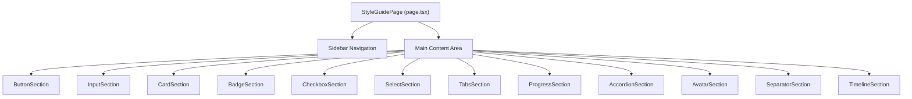
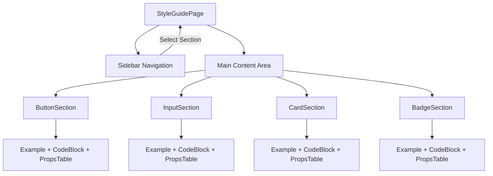
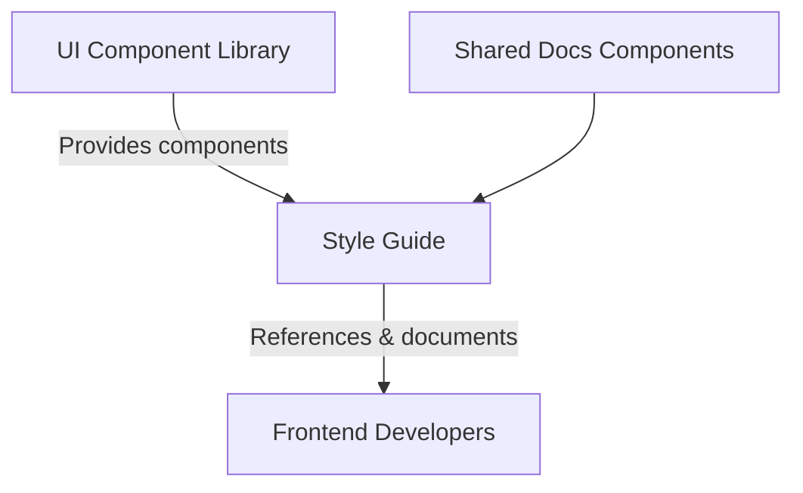
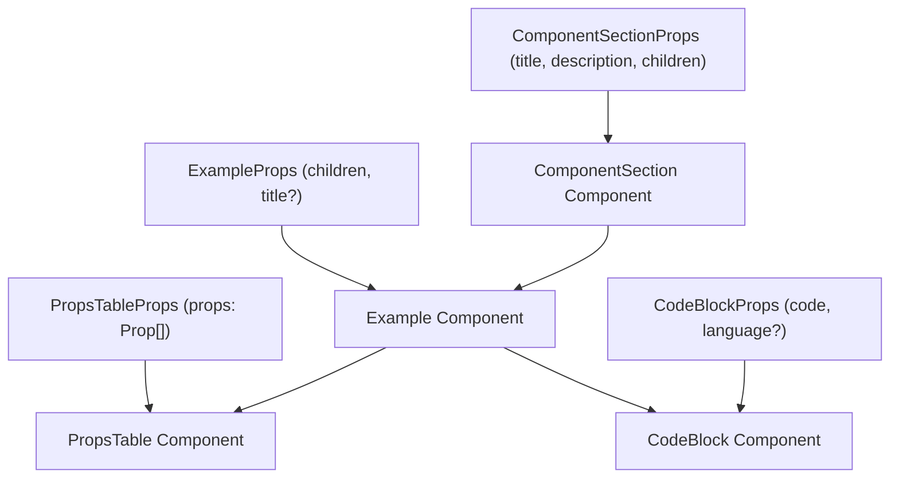

# Style Guide

The Style Guide module provides a comprehensive reference for UI components and design system elements used within the JSON Resume Registry application. It serves as a centralized showcase and documentation for reusable components such as buttons, inputs, cards, badges, and more, demonstrating their usage, variants, and best practices. This module does not cover the underlying implementation details of the components themselves but focuses on their presentation and prop interfaces.

For component implementation details, see the UI Components page. For design tokens and theming, see the Design System page.

## Architecture Overview

The Style Guide is structured as a single-page application with a sidebar navigation listing all component categories. Selecting a category dynamically renders the corresponding section showcasing that component's variants, usage examples, and prop tables.

**Diagram: Component layout and navigation flow within the Style Guide page**

Sources: `apps/registry/app/style-guide/page.tsx:21-107`

## StyleGuidePage

**Purpose**: Acts as the root container for the style guide UI, managing navigation state and rendering the selected component section.

**Primary file**: `apps/registry/app/style-guide/page.tsx:21-107`

The `StyleGuidePage` function component maintains an internal state `activeSection` to track which component category is currently displayed. It defines an ordered list of sections, each with an `id`, `label`, and a React component reference. The sidebar renders buttons for each section, highlighting the active one. Clicking a button updates the active section state.

The main content area conditionally renders the component section matching the active section. This dynamic rendering ensures only one section is visible at a time, optimizing performance and user focus.

Key behaviors:
- Maintains navigation state for component categories (`activeSection`) with React's `useState`.
- Renders a sticky sidebar with scrollable navigation buttons.
- Dynamically renders the selected component section based on user interaction.
- Provides a consistent page layout with header, sidebar, and main content area.
- Displays package information for context.

Relationships:
- Depends on individual component section modules (e.g., `ButtonSection`, `InputSection`) for rendering content.
- Uses shared UI primitives like `Card` for sidebar styling.

Sources: `apps/registry/app/style-guide/page.tsx:21-107`

## ButtonSection

**Purpose**: Demonstrates the Button component's variants, sizes, states, and usage patterns with accessibility considerations.

**Primary file**: `apps/registry/app/style-guide/sections/ButtonSection.tsx:10-153`

The `ButtonSection` component organizes button examples into titled subsections using the `Example` wrapper. It shows visual variants such as default, secondary, destructive, outline, ghost, and link styles. Size variations include small, default, large, and icon-only buttons. Disabled states are demonstrated with both default and secondary variants.

It also illustrates the `asChild` prop pattern, allowing buttons to render as child elements like links, enabling semantic navigation without nesting interactive elements improperly.

A prop table lists the key props with types, defaults, and descriptions, supporting developer understanding and usage.

Key behaviors:
- Renders multiple button variants and sizes for visual comparison.
- Shows disabled states to illustrate interaction blocking.
- Demonstrates `asChild` usage for wrapping navigation elements.
- Provides a detailed props table for developer reference.
- Includes best practices and accessibility notes emphasizing native button semantics and keyboard navigation.

Sources: `apps/registry/app/style-guide/sections/ButtonSection.tsx:10-153`

## InputSection

**Purpose**: Showcases form input components including text inputs and textareas with various states and accessibility features.

**Primary file**: `apps/registry/app/style-guide/sections/InputSection.tsx:10-169`

The `InputSection` presents basic input fields for text, email, and password types, with placeholders. It includes labeled inputs demonstrating proper accessibility with `label` elements linked via `htmlFor`. Disabled input states are shown to indicate non-interactive fields.

Textarea components are displayed with different row counts to illustrate multi-line input. Error states are demonstrated with red border styling and inline error messages.

Separate prop tables for `Input` and `Textarea` components enumerate supported props, their types, defaults, and descriptions.

Best practices emphasize pairing inputs with labels, using appropriate input types, providing clear placeholders, and showing inline validation errors. It explicitly discourages using placeholders as label replacements.

Key behaviors:
- Displays multiple input types with consistent styling.
- Demonstrates accessibility best practices with labels.
- Shows disabled and error states for inputs.
- Provides prop tables for both input and textarea components.
- Highlights recommended usage patterns and common pitfalls.

Sources: `apps/registry/app/style-guide/sections/InputSection.tsx:10-169`

## CardSection

**Purpose**: Illustrates the Card component and its subcomponents for grouping related content with consistent styling.

**Primary file**: `apps/registry/app/style-guide/sections/CardSection.tsx:10-176`

The `CardSection` demonstrates basic cards with content, cards with headers including titles and descriptions, and cards with action buttons. It also shows a grid layout of multiple cards to illustrate layout possibilities.

A prop table lists the main Card-related components: `Card`, `CardHeader`, `CardTitle`, and `CardContent`, describing their roles.

Best practices recommend using cards for grouping related information, adding padding to content areas, using headers for titles and descriptions, keeping content concise, and avoiding deep nesting of cards beyond two levels.

Key behaviors:
- Renders cards with and without headers.
- Shows cards containing action buttons.
- Demonstrates grid layouts of cards.
- Provides a prop table for card-related components.
- Lists best practices for card usage and layout.

Sources: `apps/registry/app/style-guide/sections/CardSection.tsx:10-176`

## BadgeSection

**Purpose**: Displays Badge components as small status indicators for labels, counts, and tags with various visual styles.

**Primary file**: `apps/registry/app/style-guide/sections/BadgeSection.tsx:9-114`

The `BadgeSection` shows badge variants including default, secondary, destructive, and outline styles. It presents common use cases such as status indicators (e.g., Active, Pending), count badges (e.g., Notifications with counts), and skill tags.

A prop table documents the `variant` and `className` props with their types and defaults.

Best practices emphasize using badges for status and counts, keeping text short, consistent variant usage, and avoiding clickable badges or overuse to prevent visual clutter.

Key behaviors:
- Renders multiple badge variants for visual comparison.
- Demonstrates badges in typical use cases.
- Provides a prop table for badge customization.
- Lists best practices to maintain clarity and usability.

Sources: `apps/registry/app/style-guide/sections/BadgeSection.tsx:9-114`

## PropsTable

**Purpose**: Renders a tabular display of component props including name, type, default value, and description.

**Primary file**: `apps/registry/app/style-guide/components/PropsTable.tsx:12-55`

The `PropsTable` function receives a list of prop descriptors and outputs a styled HTML table. Each row shows the prop name in code style, the type in a smaller purple font, the default value if present in green, or a dash if absent, and a textual description.

This component standardizes prop documentation presentation across all style guide sections.

Key behaviors:
- Accepts an array of prop objects with name, type, default, and description.
- Renders a responsive table with styled headers and rows.
- Highlights default values distinctly.
- Supports consistent prop documentation formatting.

Sources: `apps/registry/app/style-guide/components/PropsTable.tsx:12-55`

## CodeBlock

**Purpose**: Displays formatted source code snippets with syntax highlighting and a copy-to-clipboard button.

**Primary file**: `apps/registry/app/style-guide/components/CodeBlock.tsx:11-35`

The `CodeBlock` component renders a preformatted code block with a dark background and light text. It includes a button that copies the code snippet to the clipboard and temporarily changes its label to confirm the copy action.

Key behaviors:
- Renders code with syntax highlighting for the specified language (default `tsx`).
- Provides a copy button that updates UI state on success.
- Uses React state to manage copy feedback timing.
- Positioned copy button appears on hover for unobtrusive UI.

Sources: `apps/registry/app/style-guide/components/CodeBlock.tsx:11-35`

## Example

**Purpose**: Wraps example content with an optional title and consistent styling for demonstration purposes.

**Primary file**: `apps/registry/app/style-guide/components/Example.tsx:8-19`

The `Example` component optionally renders a title above a bordered, padded container that holds example UI elements. This visually separates examples from surrounding content and standardizes layout.

Key behaviors:
- Conditionally renders a title if provided.
- Wraps children in a styled container with border and padding.
- Used extensively in style guide sections to present usage examples.

Sources: `apps/registry/app/style-guide/components/Example.tsx:8-19`

## How It Works

The Style Guide page initializes with the `StyleGuidePage` component, which sets the default active section to "buttons". It renders a sidebar navigation listing all component categories. Each button in the sidebar updates the `activeSection` state on click.

The main content area listens to `activeSection` and renders the corresponding section component. Each section component (e.g., `ButtonSection`, `InputSection`) uses the `ComponentSection` wrapper to provide a title and description, then renders multiple `Example` components showcasing different variants and states of the component.

Each example is paired with a `CodeBlock` showing the JSX source for the example, enabling developers to see usage patterns directly. Prop tables rendered by `PropsTable` provide detailed prop information for each component.

This modular design allows easy addition of new component sections by adding entries to the `sections` array in `StyleGuidePage` and creating corresponding section components.

**Diagram: Data flow and component rendering orchestration within the Style Guide**

Sources: `apps/registry/app/style-guide/page.tsx:21-107`, `apps/registry/app/style-guide/sections/ButtonSection.tsx:10-153`, `apps/registry/app/style-guide/sections/InputSection.tsx:10-169`, `apps/registry/app/style-guide/sections/CardSection.tsx:10-176`, `apps/registry/app/style-guide/sections/BadgeSection.tsx:9-114`

## Key Relationships

The Style Guide depends on the UI component library (`@repo/ui`) for the actual implementation of buttons, inputs, cards, badges, and other primitives. It acts as a consumer and demonstrator of these components rather than implementing them.

It also depends on shared utility components like `ComponentSection`, `Example`, `CodeBlock`, and `PropsTable` to standardize documentation layout and presentation.

Downstream, the Style Guide serves as a reference for frontend developers integrating UI components into application pages, ensuring consistent usage and adherence to design guidelines.

**Relationships between the Style Guide and adjacent subsystems**

Sources: `apps/registry/app/style-guide/page.tsx:21-107`

## Supplemental Documentation for Style Guide Component Props Interfaces

This supplement documents the TypeScript interfaces defining the props for key React components used in the style guide UI. These interfaces specify the shape and expected data for components that render property tables, code examples, component sections, and code blocks with copy functionality. This documentation focuses exclusively on the props interfaces, omitting the components’ rendering logic already covered elsewhere.

### `PropsTableProps` (interface) in apps/registry/app/style-guide/components/PropsTable.tsx

| Field | Type | Purpose |
|-------|------|---------|
| `props` | `Prop[]` | An array of `Prop` objects describing the properties to display in the props table. Each `Prop` includes the name, type, optional default value, and description of a component prop. This array drives the rows rendered in the table. `apps/registry/app/style-guide/components/PropsTable.tsx:8-10` |

The `PropsTableProps` interface encapsulates the data contract for the `PropsTable` component, which renders a tabular view of component props. The `props` array must be fully specified; omitting it is not allowed. Each entry in the array is a `Prop` interface instance, which defines the metadata for a single prop.

The `Prop` interface (defined in the same file) has the following shape:

| Field | Type | Purpose |
|-------|------|---------|
| `name` | `string` | The identifier of the prop, used as the key and displayed in the table. Required. |
| `type` | `string` | The TypeScript type annotation of the prop, shown in the table to indicate expected values. Required. |
| `default?` | `string` (optional) | The default value for the prop, if any. If omitted, the table renders a placeholder indicating no default. |
| `description` | `string` | A textual explanation of the prop’s purpose and usage. Required. |

This interface design ensures that the props table can present a comprehensive, human-readable summary of component props, including type information and defaults where applicable. The optional `default` field allows omission when no default exists, which the component handles gracefully.

Sources: `apps/registry/app/style-guide/components/PropsTable.tsx:1-10`

---

### `ExampleProps` (interface) in apps/registry/app/style-guide/components/Example.tsx

| Field | Type | Purpose |
|-------|------|---------|
| `children` | `ReactNode` | The React elements or nodes to render inside the example container. This is the main content of the example block and is required. |
| `title?` | `string` (optional) | An optional heading displayed above the example content. If omitted, no title is rendered. |

The `ExampleProps` interface defines the props contract for the `Example` component, which visually groups example code or UI snippets with an optional title. The `children` prop is required and accepts any valid React node(s), allowing flexible content. The optional `title` string enables a concise label or description for the example, improving clarity in the style guide.

This interface’s simplicity reflects the component’s role as a presentational wrapper with minimal configuration. The optionality of `title` supports use cases where a heading is unnecessary or redundant.

Sources: `apps/registry/app/style-guide/components/Example.tsx:3-6`

---

### `ComponentSectionProps` (interface) in apps/registry/app/style-guide/components/ComponentSection.tsx

| Field | Type | Purpose |
|-------|------|---------|
| `title` | `string` | The main heading text for the component section card. This is required and rendered prominently. |
| `description` | `string` | A descriptive paragraph providing context or explanation for the component section. Required. |
| `children` | `ReactNode` | The content to render inside the card body, typically examples, props tables, or other subcomponents. Required. |

`ComponentSectionProps` defines the props for the `ComponentSection` component, which organizes style guide content into visually distinct cards with a header and body. The `title` and `description` fields provide structured metadata displayed in the card header, while `children` contains the main content.

All fields are required, enforcing that every component section has a clear title, explanatory text, and content. This design supports consistent layout and accessibility by ensuring semantic structure.

Sources: `apps/registry/app/style-guide/components/ComponentSection.tsx:4-8`

---

### `CodeBlockProps` (interface) in apps/registry/app/style-guide/components/CodeBlock.tsx

| Field | Type | Purpose |
|-------|------|---------|
| `code` | `string` | The source code text to display inside the code block. This is required and forms the main content. |
| `language?` | `string` (optional) | The programming language identifier for syntax highlighting. Defaults to `'tsx'` if omitted. |

The `CodeBlockProps` interface specifies the input for the `CodeBlock` component, which renders formatted source code with a copy-to-clipboard button. The `code` string is mandatory and contains the raw code to display. The optional `language` string allows specifying the language for syntax highlighting purposes, defaulting to TypeScript React (`tsx`) when not provided.

This interface supports extensibility for other languages while maintaining a sensible default. The component internally manages copy state and UI feedback, so the props focus solely on content and language.

Sources: `apps/registry/app/style-guide/components/CodeBlock.tsx:6-9`

---

## How These Interfaces Fit Together

These props interfaces collectively define the data contracts for core style guide UI components:

- `PropsTableProps` drives the rendering of detailed prop metadata tables, essential for documenting component APIs.
- `ExampleProps` wraps arbitrary example content with optional titling, enabling clear demonstration of usage patterns.
- `ComponentSectionProps` structures the style guide into titled, descriptive cards that group related content.
- `CodeBlockProps` provides the raw code and language context for syntax-highlighted blocks with copy functionality.

Together, these interfaces enable a modular, composable style guide UI where sections contain examples and props tables, and code blocks are embedded with interactive copy controls. Their explicit typing ensures consistent data flow and predictable rendering behavior.

**Diagram: Data flow and composition relationships among style guide props interfaces and components**

Sources: `apps/registry/app/style-guide/components/PropsTable.tsx:8-10`, `apps/registry/app/style-guide/components/Example.tsx:3-6`, `apps/registry/app/style-guide/components/ComponentSection.tsx:4-8`, `apps/registry/app/style-guide/components/CodeBlock.tsx:6-9`

---