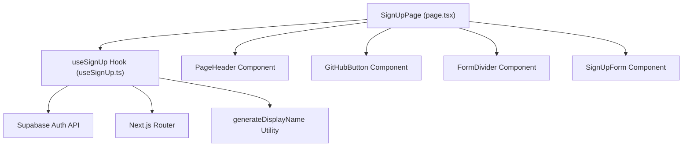
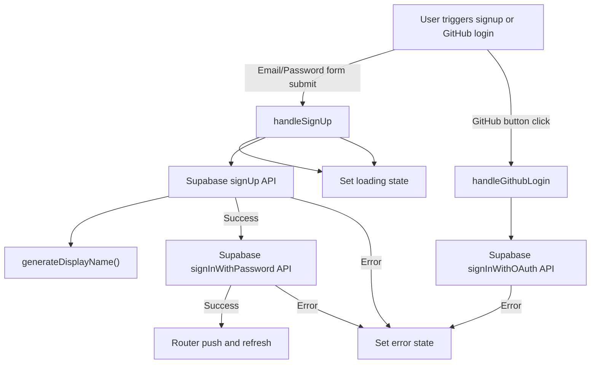
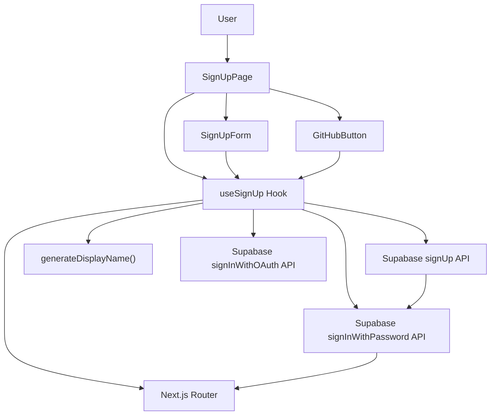
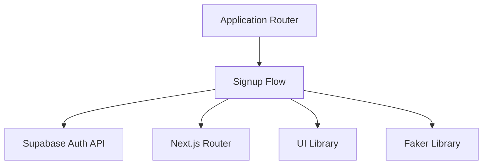

# Signup Flow

The Signup Flow module orchestrates user registration within the application, providing UI components, hooks, and utilities to handle email/password signup, OAuth via GitHub, and automatic display name generation. It manages user input, communicates with the authentication backend, and presents feedback on loading and error states.

## Purpose and Scope

This page documents the internal mechanisms enabling user signup, including the main signup page component, form components, hooks managing state and side effects, and utilities for generating user display names. It does not cover login flows, password recovery, or user profile management beyond initial registration. For authentication backend details, see the Supabase integration documentation. For UI styling and shared components, see the UI library documentation.

## Architecture Overview

The Signup Flow integrates React components with Supabase authentication via a custom hook. The main entry point is the `SignUpPage` component, which composes UI elements and delegates state management and side effects to the `useSignUp` hook. The hook handles asynchronous signup and OAuth login, invoking Supabase APIs and routing on success. UI components such as `SignUpForm`, `GitHubButton`, `PageHeader`, and `FormDivider` provide structured user interaction points.

**Diagram: Component and hook relationships in the Signup Flow**

Sources: `apps/registry/app/signup/page.tsx:12-42`, `apps/registry/app/signup/hooks/useSignUp.ts:6-74`, `apps/registry/app/signup/components/index.ts:3-20`, `apps/registry/app/signup/utils/generateDisplayName.ts:12-17`

---

## SignUpPage Component

**Purpose:** The `SignUpPage` React component serves as the root UI container for the signup flow, assembling the page layout, invoking the signup hook for state and behavior, and rendering child components for user interaction.

**Primary file:** `apps/registry/app/signup/page.tsx:12-42`

### Properties and Methods

`SignUpPage` is a function component with no props. It internally calls the `useSignUp` hook, destructuring the following state and handlers:

| Property         | Type                          | Purpose                                                                                   | Source                          |
|------------------|-------------------------------|-------------------------------------------------------------------------------------------|--------------------------------|
| `email`          | `string`                      | Current email input value                                                                 | `apps/registry/app/signup/page.tsx:14-20`               |
| `password`       | `string`                      | Current password input value                                                              | `apps/registry/app/signup/page.tsx:14-20`               |
| `loading`        | `boolean`                     | Indicates whether a signup or login operation is in progress                              | `apps/registry/app/signup/page.tsx:14-20`               |
| `error`          | `string \| null`              | Error message to display if signup or login fails                                        | `apps/registry/app/signup/page.tsx:14-20`               |
| `setEmail`       | `(value: string) => void`     | Setter function to update the email state                                                | `apps/registry/app/signup/page.tsx:14-20`               |
| `setPassword`    | `(value: string) => void`     | Setter function to update the password state                                             | `apps/registry/app/signup/page.tsx:14-20`               |
| `handleSignUp`   | `(e: React.FormEvent) => void`| Event handler for form submission to trigger email/password signup                       | `apps/registry/app/signup/page.tsx:14-20`               |
| `handleGithubLogin` | `() => Promise<void>`        | Event handler to initiate GitHub OAuth login                                            | `apps/registry/app/signup/page.tsx:14-20`               |

### Rendered Structure

- A full viewport height container centers a `Card` component with padding and max width.
- Inside the card:
  - `PageHeader` renders the page title and a link to the login page.
  - `GitHubButton` triggers OAuth login on click.
  - `FormDivider` visually separates OAuth from email signup.
  - `SignUpForm` renders controlled inputs for email and password, displays errors, and submits signup.

### Key behaviors

- Delegates all state and side effects to `useSignUp`, maintaining separation of concerns.
- Passes loading and error states down to `SignUpForm` for user feedback.
- Uses Next.js router to navigate after successful signup (via `useSignUp`).
- Supports both OAuth and traditional email/password signup flows.

Sources: `apps/registry/app/signup/page.tsx:12-42`

---

## useSignUp Hook

**Purpose:** Encapsulates all state management and side effects related to user signup, including form input state, loading and error states, interaction with Supabase authentication APIs, and navigation upon success.

**Primary file:** `apps/registry/app/signup/hooks/useSignUp.ts:6-74`

### State Variables

| State       | Type               | Purpose                                                                                   | Source                         |
|-------------|--------------------|-------------------------------------------------------------------------------------------|-------------------------------|
| `email`     | `string`           | Holds the current email input value                                                      | `apps/registry/app/signup/hooks/useSignUp.ts:10-12`           |
| `password`  | `string`           | Holds the current password input value                                                   | `apps/registry/app/signup/hooks/useSignUp.ts:13-15`           |
| `loading`   | `boolean`          | Indicates whether a signup or login operation is in progress                             | `apps/registry/app/signup/hooks/useSignUp.ts:16-18`           |
| `error`     | `string \| null`   | Holds the error message if any operation fails                                           | `apps/registry/app/signup/hooks/useSignUp.ts:19-21`           |

### Functions

| Function           | Signature                                  | Purpose                                                                                     | Source                         |
|--------------------|--------------------------------------------|---------------------------------------------------------------------------------------------|-------------------------------|
| `handleSignUp`     | `async (e: React.FormEvent) => Promise<void>` | Handles form submission for email/password signup, creates user, signs in, and redirects   | `apps/registry/app/signup/hooks/useSignUp.ts:23-53`           |
| `handleGithubLogin`| `async () => Promise<void>`                 | Initiates GitHub OAuth login via Supabase                                                   | `apps/registry/app/signup/hooks/useSignUp.ts:55-69`           |

### Detailed Behavior

- `handleSignUp`:
  - Prevents default form submission behavior.
  - Sets `loading` to true and clears previous errors.
  - Calls `supabase.auth.signUp` with email, password, and a generated display name from `generateDisplayName`.
  - Throws on signup error.
  - Calls `supabase.auth.signInWithPassword` to authenticate the user immediately after signup.
  - Throws on signin error.
  - On success, navigates to the root path `/` and refreshes the router.
  - Catches errors, setting the error message state appropriately.
  - Resets `loading` to false regardless of outcome.

- `handleGithubLogin`:
  - Calls `supabase.auth.signInWithOAuth` with GitHub as the provider and scopes `read:user gist`.
  - Throws on error.
  - Catches errors and sets the error message state.

- Both handlers use `instanceof Error` to safely extract error messages.

- The hook returns all state variables and setters, plus the handlers, enabling full control from the consuming component.

### Key behaviors

- Ensures atomic signup and immediate signin for email/password flow.
- Generates a unique display name for new users using the utility function.
- Supports OAuth login with GitHub, requesting specific scopes.
- Manages loading and error states to provide responsive UI feedback.
- Uses Next.js router for client-side navigation after signup.

**Flow of signup and OAuth login handling in `useSignUp`**

Sources: `apps/registry/app/signup/hooks/useSignUp.ts:6-74`, `apps/registry/app/signup/utils/generateDisplayName.ts:12-17`

---

## generateDisplayName Utility

**Purpose:** Produces a unique, human-readable display name string for new users by combining a color, a first name, and an animal type.

**Primary file:** `apps/registry/app/signup/utils/generateDisplayName.ts:12-17`

### Behavior

- Uses the `faker` library to generate:
  - A human-readable color name (`faker.color.human()`).
  - A first name (`faker.person.firstName()`).
  - An animal type (`faker.animal.type()`).
- Concatenates these three strings without spaces or separators.
- Returns the resulting string, e.g., `"BlueJohnDog"`.

### Key behaviors

- Ensures display names are unique and memorable without user input.
- Avoids collisions by randomizing all three components.
- Used during signup to populate the `display_name` user metadata.

Sources: `apps/registry/app/signup/utils/generateDisplayName.ts:12-17`

---

## SignUpForm Component and SignUpFormProps Interface

**Purpose:** Renders the email and password input fields, displays validation errors and loading state, and handles form submission for user signup.

**Primary file:** `apps/registry/app/signup/components/SignUpForm.tsx:4-67`

### SignUpFormProps Interface

| Field             | Type                                  | Purpose                                                                                   | Source                          |
|-------------------|-------------------------------------|-------------------------------------------------------------------------------------------|--------------------------------|
| `email`           | `string`                            | Current email input value, controlled by parent                                           | `apps/registry/app/signup/components/SignUpForm.tsx:4-12`          |
| `password`        | `string`                            | Current password input value, controlled by parent                                        | `apps/registry/app/signup/components/SignUpForm.tsx:4-12`          |
| `loading`         | `boolean`                           | Indicates if form submission is in progress                                              | `apps/registry/app/signup/components/SignUpForm.tsx:4-12`          |
| `error`           | `string \| null`                   | Error message to display under the form                                                 | `apps/registry/app/signup/components/SignUpForm.tsx:4-12`          |
| `onEmailChange`   | `(value: string) => void`           | Callback to update email state on input change                                           | `apps/registry/app/signup/components/SignUpForm.tsx:4-12`          |
| `onPasswordChange`| `(value: string) => void`           | Callback to update password state on input change                                        | `apps/registry/app/signup/components/SignUpForm.tsx:4-12`          |
| `onSubmit`        | `(e: React.FormEvent) => void`      | Form submission handler                                                                  | `apps/registry/app/signup/components/SignUpForm.tsx:4-12`          |

### Rendered Structure and Behavior

- Renders a `<form>` with `onSubmit` bound to the passed handler.
- Contains two input fields:
  - Email input with type `email`, required, and controlled by `email` and `onEmailChange`.
  - Password input with type `password`, required, and controlled by `password` and `onPasswordChange`.
- Inputs use the `Input` component from the shared UI library.
- Displays an error message below inputs if `error` is non-null, styled in red and centered.
- Submit button:
  - Disabled when `loading` is true.
  - Displays "Creating account..." when loading, otherwise "Create account".
  - Uses the `Button` component from the UI library.

### Key behaviors

- Fully controlled inputs ensure synchronization with parent state.
- Prevents multiple submissions by disabling the button during loading.
- Provides immediate visual feedback on errors.
- Uses semantic HTML and accessibility best practices (e.g., `label` with `sr-only` for screen readers).

Sources: `apps/registry/app/signup/components/SignUpForm.tsx:4-67`

---

## PageHeader Component

**Purpose:** Displays the signup page title and a link to the login page for existing users.

**Primary file:** `apps/registry/app/signup/components/PageHeader.tsx:3-20`

### Rendered Structure

- A heading `<h2>` with the text "Create your account", centered and styled prominently.
- A paragraph `
` below the heading with a link to `/login` labeled "sign in to your existing account".
- The link uses Next.js `Link` component with styling for hover and focus states.

### Key behaviors

- Provides clear navigation for users who already have an account.
- Uses semantic HTML and accessible link text.
- Styled for visual hierarchy and clarity.

Sources: `apps/registry/app/signup/components/PageHeader.tsx:3-20`

---

## GitHubButton Component and GitHubButtonProps Interface

**Purpose:** Renders a button to initiate GitHub OAuth login with an icon and accessible labeling.

**Primary file:** `apps/registry/app/signup/components/GitHubButton.tsx:4-20`

### GitHubButtonProps Interface

| Field   | Type          | Purpose                                  | Source                          |
|---------|---------------|------------------------------------------|--------------------------------|
| `onClick` | `() => void` | Callback invoked when the button is clicked | `apps/registry/app/signup/components/GitHubButton.tsx:4-6`          |

### Rendered Structure and Behavior

- Renders a `Button` component with:
  - `type="button"` to prevent form submission.
  - `variant="outline"` styling.
  - Full width (`w-full`).
  - `onClick` handler bound to the passed callback.
- Includes a GitHub icon (`Github` from `lucide-react`) with margin.
- Button label: "Continue with GitHub".

### Key behaviors

- Provides a clear call to action for OAuth login.
- Uses accessible button semantics.
- Delegates click handling to parent via props.

Sources: `apps/registry/app/signup/components/GitHubButton.tsx:4-20`

---

## FormDivider Component

**Purpose:** Visually separates the OAuth login option from the email/password signup form with a horizontal line and label.

**Primary file:** `apps/registry/app/signup/components/FormDivider.tsx:3-16`

### Rendered Structure and Behavior

- Uses a `Separator` component from the UI library to render a full-width horizontal line.
- Overlays a centered label "Or continue with email" with uppercase styling and muted foreground color.
- The label has a background matching the page to visually break the line.

### Key behaviors

- Improves UI clarity by separating alternative signup methods.
- Uses absolute positioning to overlay text on the separator line.
- Styled for subtlety and accessibility.

Sources: `apps/registry/app/signup/components/FormDivider.tsx:3-16`

---

## How It Works: End-to-End Signup Flow

The signup flow begins when the user navigates to the signup page, rendering the `SignUpPage` component. This component calls the `useSignUp` hook to obtain state and handlers for managing user input and authentication.

1. **User Interaction:**
   - The user may click the "Continue with GitHub" button, triggering `handleGithubLogin`.
   - Alternatively, the user fills the email and password fields in `SignUpForm` and submits the form, triggering `handleSignUp`.

2. **Email/Password Signup (`handleSignUp`):**
   - Prevents default form submission.
   - Sets loading state to true and clears previous errors.
   - Calls `supabase.auth.signUp` with the email, password, and a generated display name from `generateDisplayName`.
   - If signup fails, sets the error message and stops.
   - If signup succeeds, immediately calls `supabase.auth.signInWithPassword` to authenticate the user.
   - If signin fails, sets the error message.
   - On successful signin, navigates to the home page (`/`) and refreshes the router.
   - Resets loading state.

3. **GitHub OAuth Login (`handleGithubLogin`):**
   - Calls `supabase.auth.signInWithOAuth` with GitHub provider and scopes.
   - If an error occurs, sets the error message.
   - The OAuth flow redirects externally; no immediate navigation occurs in code.

4. **UI Feedback:**
   - The `SignUpForm` disables inputs and submit button during loading.
   - Displays error messages below the form fields.
   - The `PageHeader` provides navigation to login for existing users.
   - The `FormDivider` visually separates OAuth and email signup.

**Flowchart of user signup and OAuth login orchestration**

Sources: `apps/registry/app/signup/page.tsx:12-42`, `apps/registry/app/signup/hooks/useSignUp.ts:6-74`, `apps/registry/app/signup/utils/generateDisplayName.ts:12-17`

---

## Key Relationships

The Signup Flow depends on the following subsystems:

- **Supabase Authentication API:** Provides backend user management, signup, signin, and OAuth integration. The hook directly calls Supabase client methods for these operations.
- **Next.js Router:** Used for client-side navigation after successful signup to redirect users to the home page.
- **UI Library (`@repo/ui`):** Supplies reusable UI components such as `Card`, `Button`, `Input`, and `Separator` for consistent styling and behavior.
- **Faker Library:** Used by `generateDisplayName` to create unique display names combining colors, first names, and animal types.

The Signup Flow is consumed by the application routing layer as the entry point for user registration. It exposes no external API beyond the default export of `SignUpPage`.

**Dependency graph showing Signup Flow's connections to adjacent subsystems**

Sources: `apps/registry/app/signup/hooks/useSignUp.ts:6-74`, `apps/registry/app/signup/page.tsx:12-42`