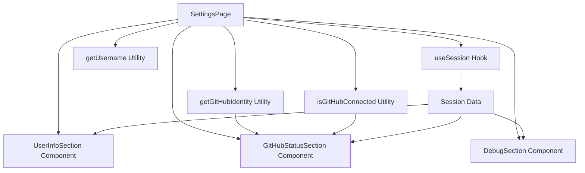
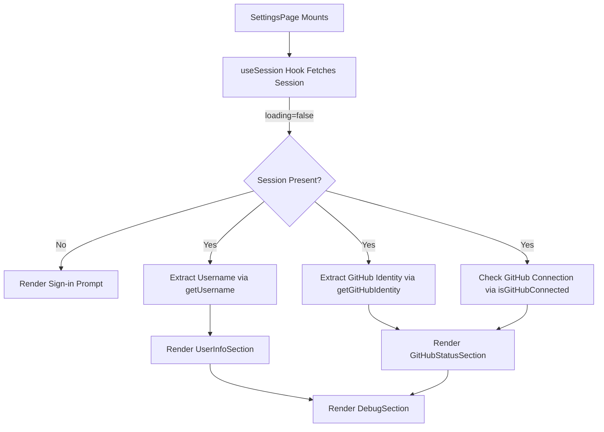
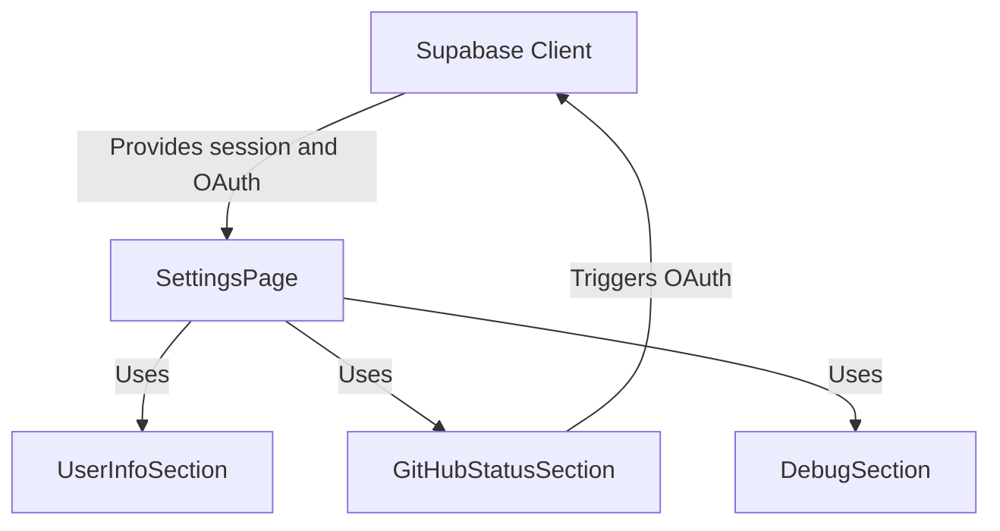

# Settings

The Settings module manages the user settings page within the application, handling user session retrieval, user identity extraction, and GitHub connection status display. It integrates UI components that present user information, GitHub OAuth status, and debug metadata, orchestrating these elements based on session state and authentication details.

## Purpose and Scope

This page documents the internal mechanisms behind the user settings interface, including session management hooks, utilities for extracting user and GitHub identity data, and UI components rendering user info, GitHub connection status, and debug information. It does not cover authentication flows outside the settings context or the broader application routing and state management.

For session management details, see the Session Management page. For OAuth integration specifics, see the OAuth Providers page.

## Architecture Overview

The Settings module orchestrates session retrieval, user identity extraction, and UI rendering through a combination of hooks, utility functions, and React components. The main entry point is the `SettingsPage` component, which uses the `useSession` hook to obtain session data, then derives user and GitHub identity information via utility functions. This data feeds into three main UI sections: user info, GitHub connection status, and debug metadata.

**Diagram: Data flow and component relationships within the Settings module**

Sources: `apps/registry/app/settings/page.tsx:16-56`, `apps/registry/app/settings/hooks/useSession.ts:4-23`, `apps/registry/app/settings/utils/getUsername.ts:5-10`, `apps/registry/app/settings/utils/getGitHubIdentity.ts:4-19`, `apps/registry/app/settings/components/UserInfoSection.tsx:1-36`, `apps/registry/app/settings/components/GitHubStatusSection.tsx:5-74`, `apps/registry/app/settings/components/DebugSection.tsx:3-39`

## SettingsPage Component

**Purpose:**  
The `SettingsPage` React component serves as the root UI for the user settings page, coordinating session state retrieval, user identity extraction, and rendering of user-related sections including GitHub connection status and debug information.

**Primary file:** `apps/registry/app/settings/page.tsx:16-56`

### Properties and Internal Variables

- `session` (`any | null`): The current authenticated user session obtained from the `useSession` hook.
- `loading` (`boolean`): Indicates whether the session data is still being fetched.
- `username` (`string | undefined`): The username extracted from the session's user metadata via `getUsername`.
- `githubIdentity` (`any | undefined`): The GitHub identity object extracted from the session's identities array via `getGitHubIdentity`.
- `connected` (`boolean`): Flag indicating if the user is connected to GitHub, determined by `isGitHubConnected`.

### Behavior and Rendering Logic

- Initially, the component invokes `useSession` to asynchronously fetch the current session.
- While loading, it renders a simple "Loading..." message.
- If no session exists (user not signed in), it renders a prompt to sign in.
- Once a valid session is available, it extracts the username and GitHub identity.
- It renders a container with a heading and a `Card` component containing three vertically spaced sections:
  - `UserInfoSection` with email, username, user ID, and last sign-in timestamp.
  - `GitHubStatusSection` with GitHub connection status, identity, and session data.
  - `DebugSection` displaying raw JSON debug information for GitHub identity, user metadata, and app metadata.

### Failure Modes and Edge Cases

- If session retrieval fails or returns null, the user is prompted to sign in.
- If the username is absent in user metadata, the username section is omitted gracefully.
- If the GitHub identity is missing or the user is not connected, the GitHub status section reflects this state.
- The component assumes `session.user` and nested properties exist when `session` is truthy; no explicit null checks beyond that are performed.

Sources: `apps/registry/app/settings/page.tsx:16-56`

## useSession Hook

**Purpose:**  
`useSession` is a React hook that asynchronously fetches and exposes the current user session along with a loading state.

**Primary file:** `apps/registry/app/settings/hooks/useSession.ts:4-23`

### Behavior

- Initializes local state: `session` as `null` and `loading` as `true`.
- On mount, asynchronously calls `supabase.auth.getSession()` to retrieve the current session.
- If a session is returned, updates the `session` state.
- Sets `loading` to `false` after the fetch completes regardless of success.
- Returns an object `{ session, loading }` to consumers.

### Failure Modes

- If the Supabase client fails to fetch the session (network error or internal error), `session` remains `null` and `loading` becomes `false`.
- No retry or error reporting mechanism is implemented within this hook.

Sources: `apps/registry/app/settings/hooks/useSession.ts:4-23`

## getUsername Utility

**Purpose:**  
Extracts a username string from the session's user metadata, prioritizing `user_name` and falling back to `preferred_username`.

**Primary file:** `apps/registry/app/settings/utils/getUsername.ts:5-10`

### Behavior

- Accesses `session.user.user_metadata`.
- Returns the value of `user_name` if present.
- Otherwise, returns `preferred_username` if present.
- Returns `undefined` if neither field exists.

### Edge Cases

- Handles missing or undefined `user_metadata` gracefully by returning `undefined`.
- Does not validate the format or type of the username fields.

Sources: `apps/registry/app/settings/utils/getUsername.ts:5-10`

## getGitHubIdentity Utility

**Purpose:**  
Finds and returns the GitHub identity object from the session's `user.identities` array.

**Primary file:** `apps/registry/app/settings/utils/getGitHubIdentity.ts:4-8`

### Behavior

- Accesses `session.user.identities`, expected to be an array.
- Uses `Array.find` to locate the first identity with `provider === 'github'`.
- Returns the found identity object or `undefined` if none matches.

### Failure Modes

- If `identities` is missing or not an array, returns `undefined`.
- Does not validate the structure of the identity object beyond the `provider` field.

Sources: `apps/registry/app/settings/utils/getGitHubIdentity.ts:4-8`

## isGitHubConnected Utility

**Purpose:**  
Determines whether the user is connected to GitHub by checking for any identity with provider 'github'.

**Primary file:** `apps/registry/app/settings/utils/getGitHubIdentity.ts:13-19`

### Behavior

- Accesses `session.user.identities`.
- Uses `Array.some` to check if any identity has `provider === 'github'`.
- Returns `true` if found, otherwise `false`.

### Edge Cases

- Returns `false` if `identities` is missing or empty.
- Does not check token validity or expiration, only presence of GitHub identity.

Sources: `apps/registry/app/settings/utils/getGitHubIdentity.ts:13-19`

## UserInfoSection Component

**Purpose:**  
Renders user-specific information including email, GitHub username (if available), user ID, and last sign-in timestamp.

**Primary file:** `apps/registry/app/settings/components/UserInfoSection.tsx:1-36`

### UserInfoSectionProps Interface

| Field      | Type       | Purpose                                                |
|------------|------------|--------------------------------------------------------|
| email      | `string`   | The user's email address, required for display.       |
| username   | `string?`  | Optional GitHub username extracted from user metadata.|
| userId     | `string`   | Unique identifier of the user.                         |
| lastSignIn | `string`   | ISO timestamp string representing the last sign-in time.|

### Rendering Details

- Displays the email unconditionally.
- Conditionally renders the GitHub username section only if `username` is defined.
- Displays the user ID.
- Converts the `lastSignIn` ISO string to a localized date-time string for display.
- Uses semantic headings (`h2`) with consistent styling for section titles.
- Groups sections vertically with spacing.

### Edge Cases

- If `username` is undefined or empty, the GitHub username section is omitted.
- Assumes `lastSignIn` is a valid ISO date string; invalid dates will render as `Invalid Date`.

Sources: `apps/registry/app/settings/components/UserInfoSection.tsx:1-36`

## GitHubStatusSection Component

**Purpose:**  
Displays the user's GitHub connection status, token availability, and provides a button to reconnect GitHub OAuth with gist access if needed.

**Primary file:** `apps/registry/app/settings/components/GitHubStatusSection.tsx:5-74`

### GitHubStatusSectionProps Interface

| Field          | Type    | Purpose                                                  |
|----------------|---------|----------------------------------------------------------|
| isConnected    | `boolean` | Indicates if the user is currently connected to GitHub. |
| githubIdentity | `any`   | The GitHub identity object extracted from session.      |
| session        | `any`   | The full user session object for token inspection.       |

### Key Behaviors

- If `isConnected` is `false`, renders a red warning message indicating no GitHub connection.
- If connected:
  - Displays a green confirmation message.
  - Shows whether an access token is available on the GitHub identity.
  - Displays presence of various tokens:
    - `provider_token` on the session object.
    - `provider_token` inside `session.user.app_metadata`.
    - `provider_token` on the GitHub identity.
  - If the GitHub identity lacks an `access_token`, renders a "Reconnect GitHub with Gist Access" button.
- The reconnect button triggers `handleReconnect`, which initiates a Supabase OAuth sign-in flow with GitHub requesting the `gist` scope and offline access.
- Errors during OAuth reconnection are logged via a centralized logger.

### Failure Modes and Edge Cases

- The component assumes `session` and `githubIdentity` are non-null when `isConnected` is true.
- Token presence checks are boolean and do not validate token freshness or permissions.
- The reconnect flow redirects back to the settings page upon completion.
- If OAuth sign-in fails, the error is logged but no UI feedback is provided.

Sources: `apps/registry/app/settings/components/GitHubStatusSection.tsx:5-74`

## DebugSection Component

**Purpose:**  
Renders raw JSON debug information for GitHub identity, user metadata, and app metadata to assist in troubleshooting and inspection.

**Primary file:** `apps/registry/app/settings/components/DebugSection.tsx:3-39`

### DebugSectionProps Interface

| Field          | Type | Purpose                                         |
|----------------|------|-------------------------------------------------|
| githubIdentity | `any` | Raw GitHub identity object for debugging.      |
| userMetadata   | `any` | User metadata object from the session.          |
| appMetadata    | `any` | Application metadata object from the session.  |

### Rendering Details

- Displays three collapsible scrollable areas, each 40 units high, with rounded borders and light background.
- Each area contains pretty-printed JSON of the respective data.
- Sections are titled "GitHub Identity," "User Metadata," and "App Metadata."
- Uses a `ScrollArea` component to constrain vertical space and enable scrolling.

### Edge Cases

- Handles undefined or null props by rendering JSON `null`.
- Does not sanitize or redact any sensitive information; all data is exposed as-is.

Sources: `apps/registry/app/settings/components/DebugSection.tsx:3-39`

## How It Works

The Settings page lifecycle begins with the `SettingsPage` component mounting. It calls the `useSession` hook, which asynchronously fetches the current user session from Supabase. While loading, the UI shows a loading indicator. Once the session is available, `SettingsPage` extracts the username using `getUsername`, the GitHub identity using `getGitHubIdentity`, and determines GitHub connection status via `isGitHubConnected`.

The page then renders three main sections:

- `UserInfoSection` receives the user's email, username, user ID, and last sign-in timestamp, rendering these details with conditional display of the username.
- `GitHubStatusSection` receives the GitHub connection flag, identity, and session. It displays connection status, token availability, and offers a reconnect button if the GitHub access token is missing. The reconnect triggers an OAuth flow requesting gist access and offline tokens.
- `DebugSection` receives raw GitHub identity, user metadata, and app metadata, rendering them as formatted JSON in scrollable containers for inspection.

**Diagram: End-to-end data flow and rendering logic of the Settings page**

Sources: `apps/registry/app/settings/page.tsx:16-56`, `apps/registry/app/settings/hooks/useSession.ts:4-23`, `apps/registry/app/settings/utils/getUsername.ts:5-10`, `apps/registry/app/settings/utils/getGitHubIdentity.ts:4-19`, `apps/registry/app/settings/components/UserInfoSection.tsx:1-36`, `apps/registry/app/settings/components/GitHubStatusSection.tsx:5-74`, `apps/registry/app/settings/components/DebugSection.tsx:3-39`

## Key Relationships

The Settings module depends on the Supabase client for session management and OAuth flows. It relies on utility functions to parse session data and extract identity information. The UI components depend on the session and identity data to render user-specific information and connection status.

Downstream, the Settings page feeds user input and OAuth reconnection attempts back into the authentication system via Supabase. The debug section exposes internal metadata that may assist developers diagnosing authentication or identity issues.

**Relationships between Settings module and authentication infrastructure**

Sources: `apps/registry/app/settings/page.tsx:16-56`, `apps/registry/app/settings/hooks/useSession.ts:4-23`, `apps/registry/app/settings/components/GitHubStatusSection.tsx:5-74`