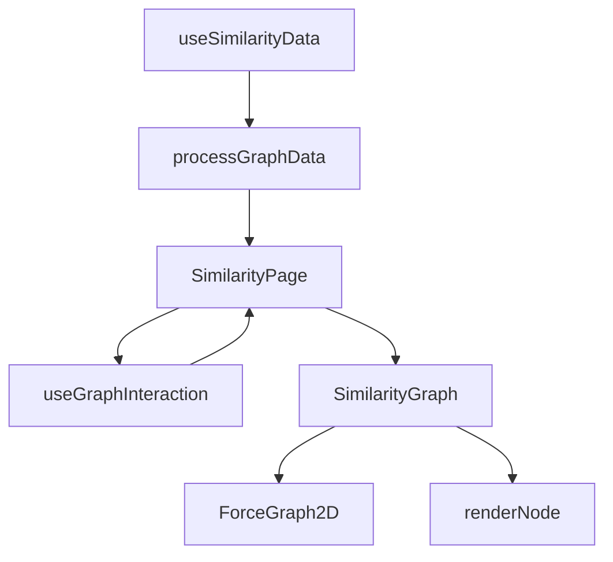
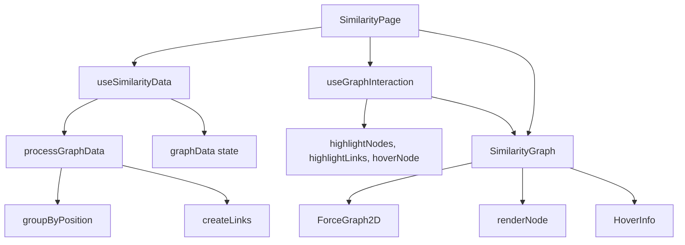
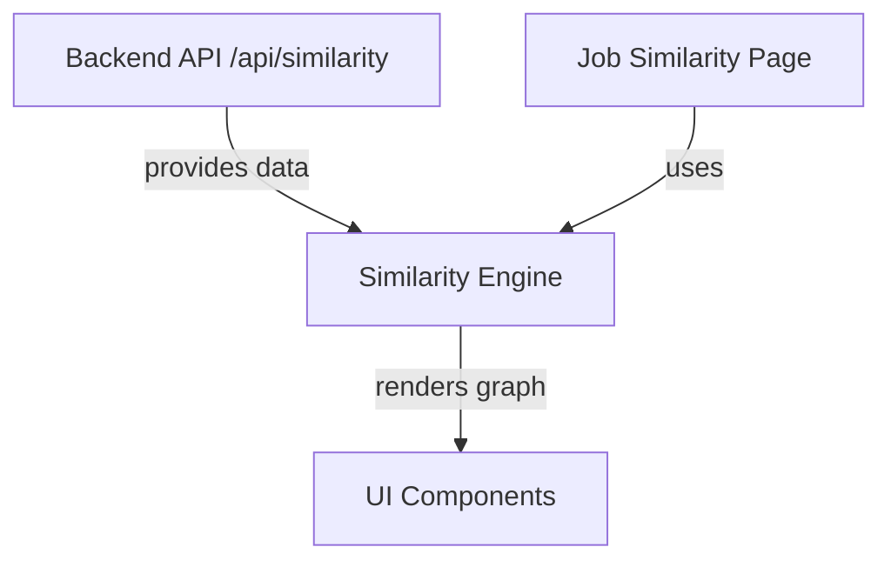

# Similarity Engine

The Similarity Engine subsystem provides the components, hooks, utilities, and clustering algorithms necessary to build and interact with a similarity graph. This graph visualizes relationships between entities (such as job positions or resumes) based on content similarity, enabling exploration of clusters and connections through an interactive network visualization.

## Purpose and Scope

This page documents the internal mechanisms that power the similarity graph visualization, including data fetching and processing, graph rendering, interaction handling, and link creation based on similarity thresholds. It covers the core React components, hooks, and utility functions involved in constructing and displaying the graph, as well as the algorithms used to cluster and link nodes.

This page does not cover the clustering algorithms in detail, which are documented separately, nor does it cover the job similarity subsystem that builds on top of this engine. For clustering algorithms, see the Clustering Algorithms page. For job similarity-specific components, see the Job Similarity page.

## Architecture Overview

The Similarity Engine orchestrates data fetching, processing, and rendering through a pipeline of hooks and components. Data is fetched asynchronously, processed into nodes and links, and passed to a force-directed graph component for rendering. User interactions such as hover and click are managed via hooks that update highlight states and trigger UI responses.

**Diagram: Data flow and component interaction in the Similarity Engine**

Sources: `apps/registry/app/similarity/page.js:9-46`, `apps/registry/app/similarity/SimilarityModule/hooks/useSimilarityData.js:8-34`, `apps/registry/app/similarity/SimilarityModule/hooks/useGraphInteraction.js:8-41`, `apps/registry/app/similarity/SimilarityModule/components/SimilarityGraph.js:20-65`, `apps/registry/app/similarity/SimilarityModule/utils/dataProcessing.js:9-19,47-77`, `apps/registry/app/similarity/SimilarityModule/utils/nodeRenderer.js:10-49`

## SimilarityPage Component

**Purpose**: Acts as the top-level React component for the similarity graph page, coordinating data fetching, interaction state, and rendering the graph UI.

**Primary file**: `apps/registry/app/similarity/page.js:9-46`

The `SimilarityPage` component uses the `useSimilarityData` hook to fetch and process graph data asynchronously. It then uses `useGraphInteraction` to manage user interaction state such as hovered nodes and highlighted links. Based on loading and error states, it conditionally renders loading or error UI components.

When data is ready, it renders the `SimilarityGraph` component, passing down the graph data and interaction handlers. The page includes a header and explanatory text describing the graph's purpose.

**Key behaviors:**
- Fetches similarity graph data on mount using `useSimilarityData`. `apps/registry/app/similarity/page.js:10-10`
- Manages hover and click interaction state via `useGraphInteraction`. `apps/registry/app/similarity/page.js:11-17`
- Renders loading or error states based on fetch status. `apps/registry/app/similarity/page.js:19-26`
- Passes interaction handlers and highlight state to the graph visualization component. `apps/registry/app/similarity/page.js:28-44`

## useSimilarityData Hook

**Purpose**: Fetches raw similarity data from the backend API, processes it into graph nodes and links, and exposes loading and error states.

**Primary file**: `apps/registry/app/similarity/SimilarityModule/hooks/useSimilarityData.js:8-34`

This hook initializes state variables for graph data, loading, and error. On mount, it asynchronously fetches similarity data from `/api/similarity`. Upon successful fetch, it processes the raw data using `processGraphData` to group items by position, create nodes, and generate links based on similarity thresholds.

Errors during fetch or processing are caught and stored in the error state. Loading state is updated accordingly.

**Key behaviors:**
- Fetches similarity data from a fixed API endpoint. `apps/registry/app/similarity/SimilarityModule/hooks/useSimilarityData.js:16-20`
- Processes raw data into graph structure with nodes and links. `apps/registry/app/similarity/SimilarityModule/hooks/useSimilarityData.js:21-22`
- Handles fetch errors and updates error state. `apps/registry/app/similarity/SimilarityModule/hooks/useSimilarityData.js:23-26`
- Exposes `graphData`, `loading`, and `error` for consumer components. `apps/registry/app/similarity/SimilarityModule/hooks/useSimilarityData.js:9-11`

## useGraphInteraction Hook

**Purpose**: Manages user interaction state for the similarity graph, including hovered nodes, highlighted nodes and links, and click handling.

**Primary file**: `apps/registry/app/similarity/SimilarityModule/hooks/useGraphInteraction.js:8-41`

This hook maintains sets of highlighted nodes and links, as well as the currently hovered node. It provides callback handlers for node hover and click events.

On hover, it highlights the hovered node and all links connected to it by filtering the graph's links. On click, it opens a new browser tab to a URL based on the clicked node's first username, if available.

**Key behaviors:**
- Tracks highlighted nodes and links as sets for efficient membership checks. `apps/registry/app/similarity/SimilarityModule/hooks/useGraphInteraction.js:9-11`
- Updates highlight sets on node hover, highlighting connected links. `apps/registry/app/similarity/SimilarityModule/hooks/useGraphInteraction.js:13-26`
- Opens external link on node click if usernames exist. `apps/registry/app/similarity/SimilarityModule/hooks/useGraphInteraction.js:28-32`
- Returns interaction state and handlers for use by UI components. `apps/registry/app/similarity/SimilarityModule/hooks/useGraphInteraction.js:33-41`

## SimilarityGraph Component

**Purpose**: Renders the interactive force-directed similarity graph using the `react-force-graph-2d` library, applying custom styling and interaction handlers.

**Primary file**: `apps/registry/app/similarity/SimilarityModule/components/SimilarityGraph.js:20-65`

The component receives graph data, highlight sets, hover state, and event handlers as props. It configures the force graph with node colors and sizes, link widths and colors, and physics parameters from a shared configuration.

Node rendering is delegated to the `renderNode` function, which draws nodes and labels on the canvas. The component also renders a `HoverInfo` overlay showing details for the hovered node.

**Key behaviors:**
- Passes custom node and link styling based on highlight state. `apps/registry/app/similarity/SimilarityModule/components/SimilarityGraph.js:28-50`
- Uses `renderNode` to draw nodes with dynamic sizing and labels. `apps/registry/app/similarity/SimilarityModule/components/SimilarityGraph.js:33-49`
- Configures physics parameters for force simulation. `apps/registry/app/similarity/SimilarityModule/components/SimilarityGraph.js:52-62`
- Renders hover information overlay for the currently hovered node. `apps/registry/app/similarity/SimilarityModule/components/SimilarityGraph.js:63-64`

## renderNode Utility

**Purpose**: Custom canvas renderer for graph nodes, drawing circles and labels with dynamic sizing and highlight-based styling.

**Primary file**: `apps/registry/app/similarity/SimilarityModule/utils/nodeRenderer.js:10-49`

This function draws a circle for each node at its coordinates, scaling size inversely with global zoom level. If the node is highlighted, it draws a label above the node with a white translucent background and the node's ID and count.

The label font size scales with node size but has a minimum size to ensure readability. The highlight color overrides the node's base color when active.

**Key behaviors:**
- Scales node size inversely with global zoom to maintain visibility. `apps/registry/app/similarity/SimilarityModule/utils/nodeRenderer.js:14-15`
- Draws node circle with fill color depending on highlight state. `apps/registry/app/similarity/SimilarityModule/utils/nodeRenderer.js:16-20`
- Draws label background and text only for highlighted nodes. `apps/registry/app/similarity/SimilarityModule/utils/nodeRenderer.js:22-48`
- Renders node count in smaller font below the label. `apps/registry/app/similarity/SimilarityModule/utils/nodeRenderer.js:44-48`

## Data Processing Utilities

### groupByPosition Function

**Purpose**: Groups raw data items by their `position` property, aggregating items into arrays keyed by position.

**Primary file**: `apps/registry/app/similarity/SimilarityModule/utils/dataProcessing.js:9-19`

The function iterates over the input data array, extracting the `position` field from each item. It creates or appends to an array in a dictionary keyed by position, returning this dictionary of grouped items.

### createLinks Function

**Purpose**: Generates similarity links between nodes based on average cosine similarity of their embeddings, filtered by a configured threshold.

**Primary file**: `apps/registry/app/similarity/SimilarityModule/utils/dataProcessing.js:47-77`

This function iterates over all pairs of nodes, computing the average cosine similarity between all pairs of embeddings from the two nodes. If the average similarity exceeds the configured threshold, it creates a link object with source, target, and similarity value.

The function uses nested loops and accumulates similarity sums and counts to compute averages. Links represent edges in the similarity graph.

**Key behaviors:**
- Groups raw data by position for node creation. `apps/registry/app/similarity/SimilarityModule/utils/dataProcessing.js:10-18`
- Computes average similarity between node embedding groups. `apps/registry/app/similarity/SimilarityModule/utils/dataProcessing.js:54-64`
- Filters links by a global similarity threshold. `apps/registry/app/similarity/SimilarityModule/utils/dataProcessing.js:49-50`
- Returns an array of link objects for graph rendering. `apps/registry/app/similarity/SimilarityModule/utils/dataProcessing.js:75-76`

## How It Works

The Similarity Engine operates as a pipeline from raw data to interactive graph visualization:

1. **Data Fetching**: The `SimilarityPage` component calls `useSimilarityData` on mount, which fetches raw similarity data from the backend API endpoint `/api/similarity`. This data consists of items with position labels and embeddings. (`useSimilarityData`)

2. **Data Processing**: The raw data is passed to `processGraphData` (not fully shown but implied), which groups items by position using `groupByPosition`. It then creates graph nodes representing each position group and their aggregated embeddings. Links between nodes are created by `createLinks` based on average cosine similarity exceeding a threshold. (`groupByPosition`, `createLinks`)

3. **State Setup**: The processed graph data (nodes and links) is stored in state within `useSimilarityData` and returned to `SimilarityPage`.

4. **Interaction State**: `SimilarityPage` invokes `useGraphInteraction` with the graph data to manage interaction state: hovered node, highlighted nodes, and highlighted links. Hovering a node highlights it and its connected links; clicking opens a related URL. (`useGraphInteraction`)

5. **Rendering**: `SimilarityPage` renders `SimilarityGraph` with the graph data and interaction state. `SimilarityGraph` uses the `react-force-graph-2d` library to render the force-directed graph, applying custom node and link styling based on highlight state. Nodes are drawn with the `renderNode` function, which scales node size and draws labels for highlighted nodes. (`SimilarityGraph`, `renderNode`)

6. **User Interaction**: User hover and click events propagate through handlers from `useGraphInteraction`, updating highlight sets and triggering UI updates.

**Diagram: End-to-end data and interaction flow in the Similarity Engine**

Sources: `apps/registry/app/similarity/page.js:9-46`, `apps/registry/app/similarity/SimilarityModule/hooks/useSimilarityData.js:8-34`, `apps/registry/app/similarity/SimilarityModule/hooks/useGraphInteraction.js:8-41`, `apps/registry/app/similarity/SimilarityModule/components/SimilarityGraph.js:20-65`, `apps/registry/app/similarity/SimilarityModule/utils/dataProcessing.js:9-19,47-77`, `apps/registry/app/similarity/SimilarityModule/utils/nodeRenderer.js:10-49`

## Key Relationships

The Similarity Engine depends on:

- Backend API `/api/similarity` for raw similarity data.
- The `react-force-graph-2d` library for force-directed graph rendering.
- Shared configuration constants (`GRAPH_CONFIG`) for styling and thresholds.
- Utility functions such as `cosineSimilarity` (implied) for similarity calculations.

It provides graph data and interaction state to UI components that render and manage the similarity graph. It is consumed by higher-level pages such as the job similarity interface, which builds on this engine to provide domain-specific clustering and filtering.

**Relationships between Similarity Engine and adjacent subsystems**

Sources: `apps/registry/app/similarity/page.js:9-46`