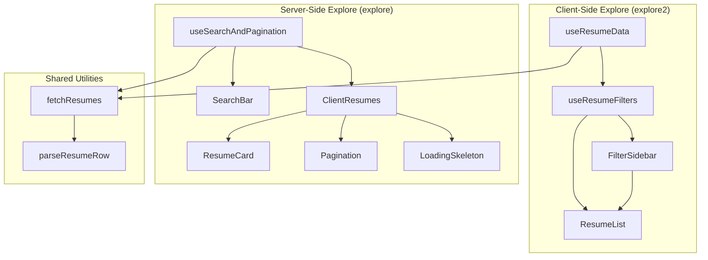
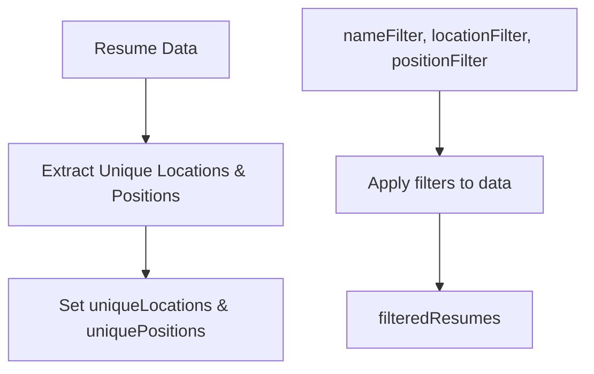
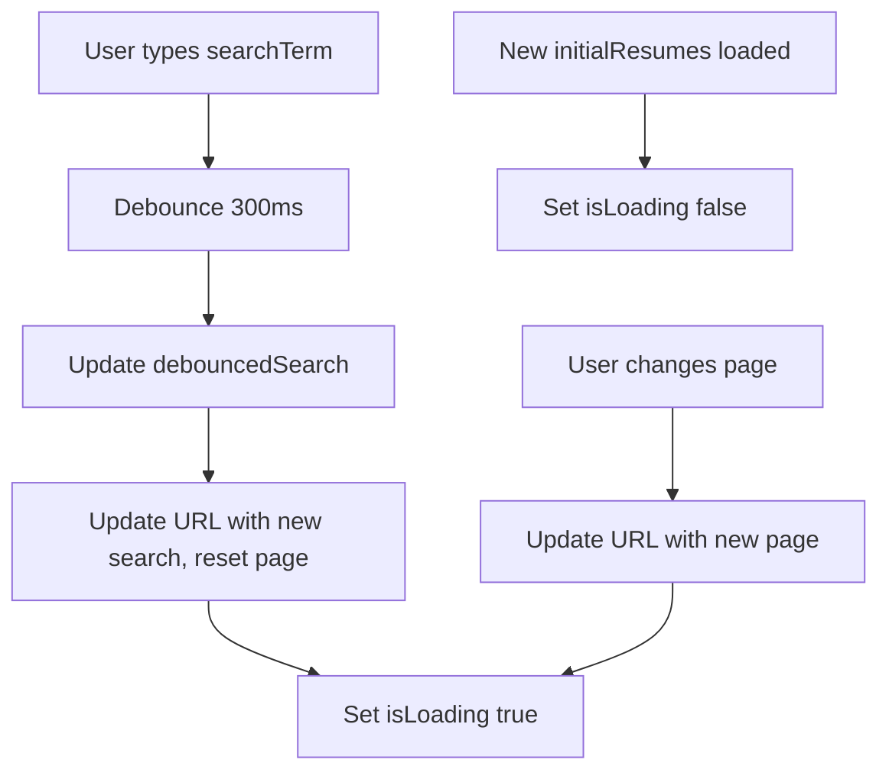
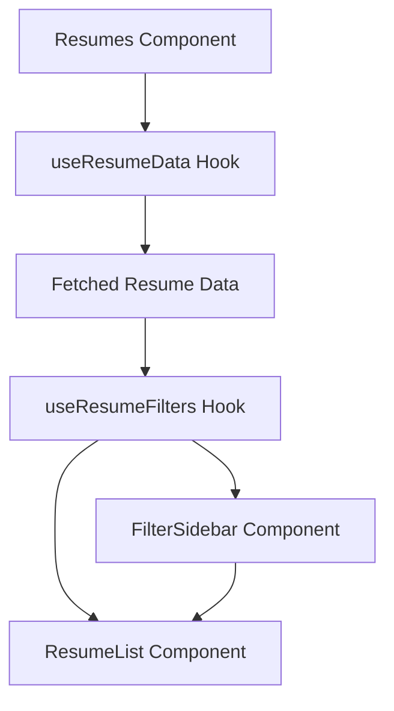
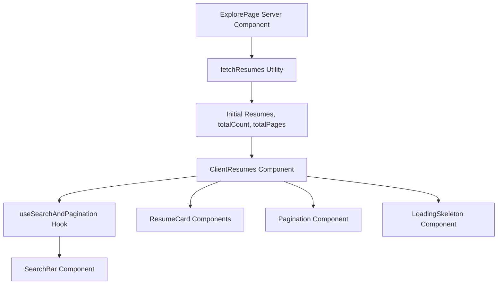
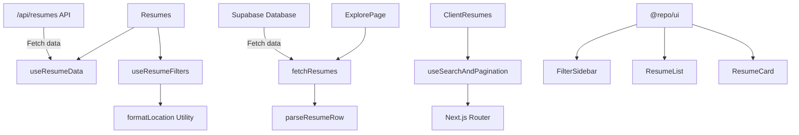
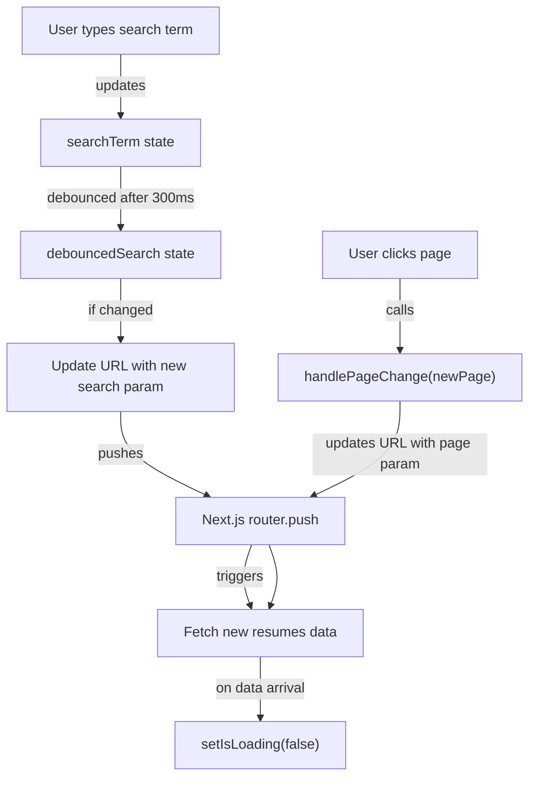
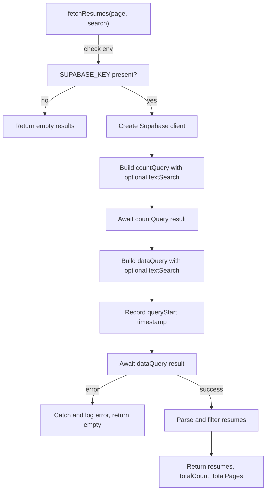
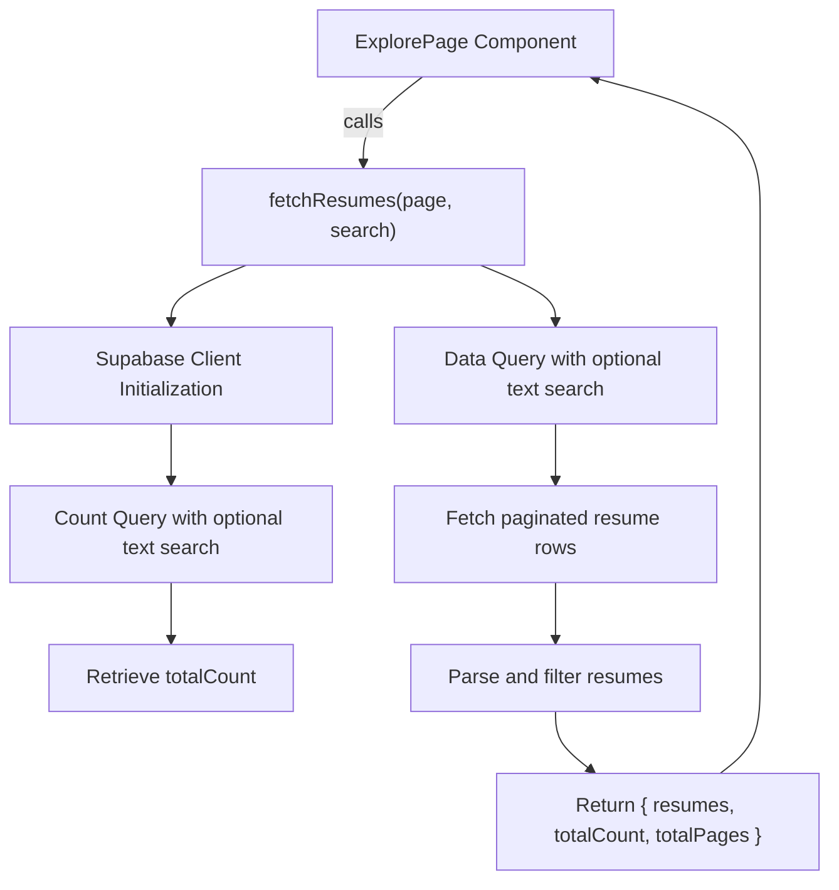

# Explore Module

The Explore Module provides the core functionality for browsing, filtering, and paginating professional resumes stored in the JSON Resume Registry. It supports client-side filtering by name, location, and position, as well as server-driven search and pagination. The module integrates UI components for displaying resumes, filter controls, search bars, and loading states, orchestrating data fetching and user interaction.

## Purpose and Scope

This page documents the internal mechanisms of the Explore Module responsible for resume exploration features, including data fetching, filtering, pagination, and UI rendering. It covers the React components, hooks, and utility functions that implement these features in both the client-driven (`explore2`) and server-driven (`explore`) variants.

It does not cover the backend API implementation beyond the client-side fetching logic, nor does it document unrelated UI components or global application state management. For the server-side resume fetching logic, see the fetchResumes utility. For client-side search and pagination hooks, see the useSearchAndPagination hook documentation.

## Architecture Overview

The Explore Module consists of two main exploration variants:

- The `explore2` variant uses client-side data fetching and filtering with React hooks (`useResumeData`, `useResumeFilters`) and renders a filter sidebar and resume list.
- The `explore` variant uses server-side pagination and search with URL-driven state, managed by `useSearchAndPagination`, and renders search bars, paginated resume cards, and loading skeletons.

Both variants share utility functions for parsing and fetching resumes and UI components for displaying resumes and filters.



**Diagram: High-level component and hook relationships in the Explore Module**

Sources: `apps/registry/app/explore2/page.js:9-42`, `apps/registry/app/explore/ClientResumes.js:9-44`, `apps/registry/app/explore/ExploreModule/utils/fetchResumes.js:6-79`

---

## Resumes Component

**Purpose:** Implements the client-side resume exploration interface by fetching resume data, applying client-side filters, and rendering filter controls alongside the filtered resume list.

**Primary file:** `apps/registry/app/explore2/page.js:9-42`

The `Resumes` component orchestrates data fetching and filtering using two hooks: `useResumeData` and `useResumeFilters`. It renders a loading spinner while data loads, then displays a sidebar with filter controls and a scrollable list of filtered resumes.

### Members and Behavior

| Member | Type | Purpose |
|--------|------|---------|
| `data` | `Array` | Raw resume data fetched from the API, managed by `useResumeData`. `apps/registry/app/explore2/page.js:10` |
| `loading` | `boolean` | Loading state indicating whether resume data is being fetched. `apps/registry/app/explore2/page.js:10` |
| `nameFilter` | `string` | Current filter string for resume names. `apps/registry/app/explore2/page.js:11` |
| `setNameFilter` | `function` | Setter function to update the name filter. `apps/registry/app/explore2/page.js:11` |
| `locationFilter` | `string` | Current filter string for resume locations. `apps/registry/app/explore2/page.js:11` |
| `setLocationFilter` | `function` | Setter function to update the location filter. `apps/registry/app/explore2/page.js:11` |
| `positionFilter` | `string` | Current filter string for resume positions. `apps/registry/app/explore2/page.js:11` |
| `setPositionFilter` | `function` | Setter function to update the position filter. `apps/registry/app/explore2/page.js:11` |
| `filteredResumes` | `Array` | Resumes filtered according to the current filter values. `apps/registry/app/explore2/page.js:11` |
| `uniqueLocations` | `Array` | Unique location strings extracted from all resumes, used to populate location filter options. `apps/registry/app/explore2/page.js:11` |
| `uniquePositions` | `Array` | Unique position strings extracted from all resumes, used to populate position filter options. `apps/registry/app/explore2/page.js:11` |

### Behavior Summary

- Calls `useResumeData` to fetch up to 500 resumes from the API.
- Passes fetched data to `useResumeFilters` to derive filter state and filtered results.
- Displays a full-page loading spinner while data is loading.
- Renders a sidebar with filter inputs bound to filter state setters.
- Renders a scrollable list of filtered resumes.
- Uses layout styling to place sidebar and list side-by-side.

Sources: `apps/registry/app/explore2/page.js:9-42`

---

## useResumeData Hook

**Purpose:** Fetches resume data asynchronously from the API endpoint `/api/resumes?limit=500` and manages loading state.

**Primary file:** `apps/registry/app/explore2/Explore2Module/hooks/useResumeData.js:5-25`

### Members

| Member | Type | Purpose |
|--------|------|---------|
| `data` | `Array` | Holds the fetched resume data. Initially empty. `apps/registry/app/explore2/Explore2Module/hooks/useResumeData.js:6` |
| `loading` | `boolean` | Indicates whether the fetch operation is in progress. Initially `true`. `apps/registry/app/explore2/Explore2Module/hooks/useResumeData.js:7` |
| `fetchData` | `async function` | Internal async function that performs the HTTP GET request and updates state. `apps/registry/app/explore2/Explore2Module/hooks/useResumeData.js:10-19` |
| `response` | `AxiosResponse` | Holds the HTTP response from the API call. `apps/registry/app/explore2/Explore2Module/hooks/useResumeData.js:12` |

### Behavior

- On mount, triggers `fetchData` to asynchronously request resume data.
- Uses Axios to GET `/api/resumes?limit=500`.
- On success, sets `data` to the response payload and `loading` to false.
- On failure, logs the error and sets `loading` to false.
- Returns an object with `data` and `loading` for consumption by components.

Sources: `apps/registry/app/explore2/Explore2Module/hooks/useResumeData.js:5-25`

---

## useResumeFilters Hook

**Purpose:** Manages filter state and applies client-side filtering logic to resume data, extracting unique filter options and producing filtered results.

**Primary file:** `apps/registry/app/explore2/Explore2Module/hooks/useResumeFilters.js:4-63`

### State Variables

| State Variable | Type | Purpose |
|----------------|------|---------|
| `nameFilter` | `string` | Filter string for matching resume names. `apps/registry/app/explore2/Explore2Module/hooks/useResumeFilters.js:5` |
| `setNameFilter` | `function` | Setter for `nameFilter`. `apps/registry/app/explore2/Explore2Module/hooks/useResumeFilters.js:5` |
| `locationFilter` | `string` | Filter string for matching resume locations. `apps/registry/app/explore2/Explore2Module/hooks/useResumeFilters.js:6` |
| `setLocationFilter` | `function` | Setter for `locationFilter`. `apps/registry/app/explore2/Explore2Module/hooks/useResumeFilters.js:6` |
| `positionFilter` | `string` | Filter string for matching resume positions. `apps/registry/app/explore2/Explore2Module/hooks/useResumeFilters.js:7` |
| `setPositionFilter` | `function` | Setter for `positionFilter`. `apps/registry/app/explore2/Explore2Module/hooks/useResumeFilters.js:7` |
| `filteredResumes` | `Array` | Resumes filtered according to current filter values. `apps/registry/app/explore2/Explore2Module/hooks/useResumeFilters.js:8` |
| `setFilteredResumes` | `function` | Setter for `filteredResumes`. `apps/registry/app/explore2/Explore2Module/hooks/useResumeFilters.js:8` |
| `uniqueLocations` | `Array` | Unique location strings extracted from all resumes. `apps/registry/app/explore2/Explore2Module/hooks/useResumeFilters.js:9` |
| `setUniqueLocations` | `function` | Setter for `uniqueLocations`. `apps/registry/app/explore2/Explore2Module/hooks/useResumeFilters.js:9` |
| `uniquePositions` | `Array` | Unique position strings extracted from all resumes. `apps/registry/app/explore2/Explore2Module/hooks/useResumeFilters.js:10` |
| `setUniquePositions` | `function` | Setter for `uniquePositions`. `apps/registry/app/explore2/Explore2Module/hooks/useResumeFilters.js:10` |

### Internal Variables and Logic

| Variable | Type | Purpose |
|----------|------|---------|
| `locations` | `Set<string>` | Extracted unique formatted locations from resume data. `apps/registry/app/explore2/Explore2Module/hooks/useResumeFilters.js:16-18` |
| `positions` | `Set<string>` | Extracted unique positions from all work entries in resume data. `apps/registry/app/explore2/Explore2Module/hooks/useResumeFilters.js:21-25` |
| `nameMatch` | `boolean` | Result of case-insensitive substring match of resume name against `nameFilter`. `apps/registry/app/explore2/Explore2Module/hooks/useResumeFilters.js:33-35` |
| `locationMatch` | `boolean` | True if `locationFilter` is empty or resume location matches filter case-insensitively. `apps/registry/app/explore2/Explore2Module/hooks/useResumeFilters.js:36-40` |
| `positionMatch` | `boolean` | True if `positionFilter` is empty or any work position matches filter case-insensitively. `apps/registry/app/explore2/Explore2Module/hooks/useResumeFilters.js:41-46` |

### Behavior

- On data change, extracts unique locations and positions to populate filter dropdowns.
- On any filter or data change, applies filters to produce `filteredResumes`.
- Filtering logic:
  - Name filter matches if resume name includes the filter string (case-insensitive).
  - Location filter matches if empty or formatted location includes filter string.
  - Position filter matches if empty or any work position includes filter string.
- Returns all filter states, setters, filtered results, and unique filter options.



**Filtering flow from raw data to filtered results with unique filter options extraction**

Sources: `apps/registry/app/explore2/Explore2Module/hooks/useResumeFilters.js:4-63`

---

## ResumeList Component

**Purpose:** Renders a scrollable list of resume cards with animated hover effects, linking each to the user's dashboard.

**Primary file:** `apps/registry/app/explore2/Explore2Module/components/ResumeList.js:14-60`

### Props

| Prop | Type | Purpose |
|------|------|---------|
| `resumes` | `Array` | Array of resume objects to display. Each resume includes fields like `name`, `location`, `image`, `work`, and `username`. `apps/registry/app/explore2/Explore2Module/components/ResumeList.js:14` |

### Behavior

- Wraps the list in a scrollable container constrained to 80vh height.
- Maps over `resumes` to render each as a card inside a `motion.div` for hover scaling and fade-in animation.
- Each card links to the user's dashboard page at `/${username}/dashboard`.
- Displays the resume name, formatted location, avatar image, and the first work position and company if available.
- Uses UI components from `@repo/ui` for consistent styling.

Sources: `apps/registry/app/explore2/Explore2Module/components/ResumeList.js:14-60`

---

## LoadingSpinner Component

**Purpose:** Displays a full-screen loading spinner centered vertically and horizontally.

**Primary file:** `apps/registry/app/explore2/Explore2Module/components/LoadingSpinner.js:3-9`

### Behavior

- Uses the `Loader2` icon from `lucide-react` with a spinning animation.
- Centers the spinner in a flex container filling the viewport height.

Sources: `apps/registry/app/explore2/Explore2Module/components/LoadingSpinner.js:3-9`

---

## FilterSidebar Component

**Purpose:** Provides UI controls for filtering resumes by name, location, and position, with dropdowns populated from unique values.

**Primary file:** `apps/registry/app/explore2/Explore2Module/components/FilterSidebar.js:14-84`

### Props

| Prop | Type | Purpose |
|------|------|---------|
| `nameFilter` | `string` | Current value of the name filter input. `apps/registry/app/explore2/Explore2Module/components/FilterSidebar.js:14` |
| `onNameChange` | `function` | Callback invoked with new name filter string on input change. `apps/registry/app/explore2/Explore2Module/components/FilterSidebar.js:14` |
| `locationFilter` | `string` | Current selected location filter value. `apps/registry/app/explore2/Explore2Module/components/FilterSidebar.js:14` |
| `onLocationChange` | `function` | Callback invoked with new location filter value on selection change. `apps/registry/app/explore2/Explore2Module/components/FilterSidebar.js:14` |
| `positionFilter` | `string` | Current selected position filter value. `apps/registry/app/explore2/Explore2Module/components/FilterSidebar.js:14` |
| `onPositionChange` | `function` | Callback invoked with new position filter value on selection change. `apps/registry/app/explore2/Explore2Module/components/FilterSidebar.js:14` |
| `uniqueLocations` | `Array` | Array of unique location strings to populate location dropdown. `apps/registry/app/explore2/Explore2Module/components/FilterSidebar.js:14` |
| `uniquePositions` | `Array` | Array of unique position strings to populate position dropdown. `apps/registry/app/explore2/Explore2Module/components/FilterSidebar.js:14` |

### Behavior

- Renders a fixed-width sidebar card with three filter controls:
  - Text input for name filtering.
  - Select dropdown for location filtering, with options for all locations plus unique locations.
  - Select dropdown for position filtering, with options for all positions plus unique positions.
- The "All Locations" and "All Positions" options have a placeholder value `"asdsd"` which appears to be a placeholder or bug (should be empty string or similar to represent no filter).
- Calls respective callbacks on user input or selection changes.
- Uses UI components from `@repo/ui` for consistent styling.

Sources: `apps/registry/app/explore2/Explore2Module/components/FilterSidebar.js:14-84`

---

## ClientResumes Component

**Purpose:** Implements server-driven resume exploration with search and pagination, rendering search bar, resume cards, loading skeletons, and pagination controls.

**Primary file:** `apps/registry/app/explore/ClientResumes.js:9-44`

### Props

| Prop | Type | Purpose |
|------|------|---------|
| `initialResumes` | `Array` | Array of resumes initially loaded for the current page and search term. `apps/registry/app/explore/ClientResumes.js:9` |
| `currentPage` | `number` | Current page number for pagination. `apps/registry/app/explore/ClientResumes.js:9` |
| `totalPages` | `number` | Total number of pages available. `apps/registry/app/explore/ClientResumes.js:9` |
| `currentSearch` | `string` | Current search term string. `apps/registry/app/explore/ClientResumes.js:9` |

### Internal State and Callbacks

| Variable | Type | Purpose |
|----------|------|---------|
| `searchTerm` | `string` | Current search input value, managed by `useSearchAndPagination`. `apps/registry/app/explore/ClientResumes.js:15` |
| `setSearchTerm` | `function` | Setter for `searchTerm`. `apps/registry/app/explore/ClientResumes.js:15` |
| `isLoading` | `boolean` | Loading state indicating whether new data is being fetched. `apps/registry/app/explore/ClientResumes.js:15` |
| `handlePageChange` | `function` | Callback to change the current page, triggering navigation and data fetch. `apps/registry/app/explore/ClientResumes.js:16` |

### Behavior

- Uses `useSearchAndPagination` hook to manage search input debouncing, URL updates, and loading state.
- Renders a `SearchBar` component bound to `searchTerm` and `isLoading`.
- Displays either a loading skeleton or a grid of `ResumeCard` components depending on `isLoading`.
- Renders a `Pagination` component with current page, total pages, loading state, and page change handler.
- Pagination and search updates cause URL changes that trigger server-side data fetching.

Sources: `apps/registry/app/explore/ClientResumes.js:9-44`

---

## useSearchAndPagination Hook

**Purpose:** Manages search input debouncing, URL query parameter synchronization, loading state, and pagination navigation for server-driven resume exploration.

**Primary file:** `apps/registry/app/explore/ClientResumesModule/hooks/useSearchAndPagination.js:4-58`

### Parameters

| Parameter | Type | Purpose |
|-----------|------|---------|
| `currentSearch` | `string` | Initial search term from URL or server. `apps/registry/app/explore/ClientResumesModule/hooks/useSearchAndPagination.js:4` |
| `currentPage` | `number` | Initial page number from URL or server. `apps/registry/app/explore/ClientResumesModule/hooks/useSearchAndPagination.js:4` |
| `initialResumes` | `Array` | Initial resumes loaded for the current search and page. `apps/registry/app/explore/ClientResumesModule/hooks/useSearchAndPagination.js:4` |

### State Variables

| Variable | Type | Purpose |
|----------|------|---------|
| `searchTerm` | `string` | Controlled search input value. `apps/registry/app/explore/ClientResumesModule/hooks/useSearchAndPagination.js:12` |
| `setSearchTerm` | `function` | Setter for `searchTerm`. `apps/registry/app/explore/ClientResumesModule/hooks/useSearchAndPagination.js:12` |
| `debouncedSearch` | `string` | Debounced search term used to update URL and trigger fetch. `apps/registry/app/explore/ClientResumesModule/hooks/useSearchAndPagination.js:13` |
| `setDebouncedSearch` | `function` | Setter for `debouncedSearch`. `apps/registry/app/explore/ClientResumesModule/hooks/useSearchAndPagination.js:13` |
| `isLoading` | `boolean` | Indicates if a new fetch is in progress. `apps/registry/app/explore/ClientResumesModule/hooks/useSearchAndPagination.js:14` |

### Other Variables

| Variable | Type | Purpose |
|----------|------|---------|
| `router` | `NextRouter` | Next.js router instance for navigation. `apps/registry/app/explore/ClientResumesModule/hooks/useSearchAndPagination.js:9` |
| `pathname` | `string` | Current pathname from Next.js router. `apps/registry/app/explore/ClientResumesModule/hooks/useSearchAndPagination.js:10` |
| `searchParams` | `URLSearchParams` | Current URL search parameters. `apps/registry/app/explore/ClientResumesModule/hooks/useSearchAndPagination.js:11` |
| `timer` | `number` | Timeout ID for debouncing search input. `apps/registry/app/explore/ClientResumesModule/hooks/useSearchAndPagination.js:18-20` |
| `params` | `URLSearchParams` | Mutable copy of URL search parameters for navigation updates. `apps/registry/app/explore/ClientResumesModule/hooks/useSearchAndPagination.js:30`, `42` |

### Behavior

- Debounces `searchTerm` changes with a 300ms delay before updating `debouncedSearch`.
- When `debouncedSearch` differs from `currentSearch`, updates URL query parameters:
  - Sets or deletes the `search` parameter.
  - Deletes the `page` parameter to reset pagination on new search.
- Provides `handlePageChange` to update the `page` parameter in the URL and trigger navigation.
- Sets `isLoading` to true on URL updates and resets it to false when new `initialResumes` arrive.
- Uses Next.js router's `push` method for client-side navigation without full reload.



**Flow of search input debouncing, URL synchronization, and loading state management**

Sources: `apps/registry/app/explore/ClientResumesModule/hooks/useSearchAndPagination.js:4-58`

---

## ResumeCard Component

**Purpose:** Displays a single resume summary card with avatar, name, location, label, and links to the resume and dashboard pages.

**Primary file:** `apps/registry/app/explore/ClientResumesModule/components/ResumeCard.js:13-82`

### Props

| Prop | Type | Purpose |
|------|------|---------|
| `resume` | `Object` | Resume object containing fields such as `username`, `name`, `label`, `image`, and `location`. `apps/registry/app/explore/ClientResumesModule/components/ResumeCard.js:13` |

### Internal Variables

| Variable | Type | Purpose |
|----------|------|---------|
| `locationString` | `string` | Concatenated string of city, region, and country code from resume location, separated by commas. `apps/registry/app/explore/ClientResumesModule/components/ResumeCard.js:14-20` |

### Behavior

- Renders a card with:
  - Avatar image or fallback initial.
  - Name or username as the title.
  - Optional label with briefcase icon.
  - Location string with map pin icon.
- Footer contains two outline buttons linking to:
  - The public resume page (`/${username}`).
  - The user's dashboard (`/${username}/dashboard`).
- Uses UI components from `@repo/ui` and icons from `lucide-react`.
- Applies hover shadow and transition effects.

Sources: `apps/registry/app/explore/ClientResumesModule/components/ResumeCard.js:13-82`

---

## Pagination Component

**Purpose:** Renders pagination controls with previous, next, and page number buttons, handling disabled states and loading.

**Primary file:** `apps/registry/app/explore/ClientResumesModule/components/Pagination.js:4-49`

### Props

| Prop | Type | Purpose |
|------|------|---------|
| `currentPage` | `number` | Current active page number. `apps/registry/app/explore/ClientResumesModule/components/Pagination.js:4` |
| `totalPages` | `number` | Total number of pages available. `apps/registry/app/explore/ClientResumesModule/components/Pagination.js:4` |
| `isLoading` | `boolean` | Indicates if data is loading, disables buttons accordingly. `apps/registry/app/explore/ClientResumesModule/components/Pagination.js:4` |
| `onPageChange` | `function` | Callback invoked with new page number when a page button is clicked. `apps/registry/app/explore/ClientResumesModule/components/Pagination.js:4` |

### Internal Variables

| Variable | Type | Purpose |
|----------|------|---------|
| `pageNumbers` | `Array<number|string>` | Array of page numbers and ellipsis strings for pagination display, generated by `getPageNumbers`. `apps/registry/app/explore/ClientResumesModule/components/Pagination.js:12` |

### Behavior

- Returns `null` if `totalPages` is 1 or less.
- Renders "Previous" and "Next" buttons, disabled at boundaries or when loading.
- Renders page number buttons, highlighting the current page.
- Ellipsis (`"..."`) buttons are disabled and non-interactive.
- Clicking a page number calls `onPageChange` with that page number.

Sources: `apps/registry/app/explore/ClientResumesModule/components/Pagination.js:4-49`

---

## parseResumeRow Utility

**Purpose:** Parses a raw database row containing a JSON resume string into a normalized resume object with fallback values.

**Primary file:** `apps/registry/app/explore/ExploreModule/utils/parseResume.js:4-37`

### Parameters

| Parameter | Type | Purpose |
|-----------|------|---------|
| `row` | `Object` | Database row with fields `username`, `resume` (JSON string), `updated_at`, and `created_at`. `apps/registry/app/explore/ExploreModule/utils/parseResume.js:6` |

### Returns

| Return Type | Description |
|-------------|-------------|
| `Object` | Parsed resume object with fields: `username`, `label`, `image`, `name`, `location`, `updated_at`, `created_at`. If parsing fails, returns a fallback object with error label and default gravatar image. |

### Behavior

- Attempts to parse the `resume` JSON string.
- Extracts `label`, `image`, `name`, and `location` from the parsed resume's `basics` section.
- If no image is provided, generates a gravatar URL based on the email or defaults to a retro style.
- On JSON parse error, logs the error with username and returns a fallback object:
  - `label` set to "Error parsing resume".
  - `image` set to default gravatar.
  - `name` set to username.
  - `location` set to null.
- Preserves `updated_at` and `created_at` timestamps from the row.

Sources: `apps/registry/app/explore/ExploreModule/utils/parseResume.js:4-37`

---

## fetchResumes Utility

**Purpose:** Fetches paginated resumes from the Supabase database with optional full-text search, parses and filters results, and returns pagination metadata.

**Primary file:** `apps/registry/app/explore/ExploreModule/utils/fetchResumes.js:6-79`

### Parameters

| Parameter | Type | Purpose |
|-----------|------|---------|
| `page` | `number` | Page number to fetch, defaults to 1. `apps/registry/app/explore/ExploreModule/utils/fetchResumes.js:6` |
| `search` | `string` | Optional search string for full-text search on the resume JSON field. `apps/registry/app/explore/ExploreModule/utils/fetchResumes.js:6` |

### Returns

| Return Type | Description |
|-------------|-------------|
| `Promise<Object>` | Resolves to an object containing: `resumes` (array of parsed resumes), `totalCount` (number), and `totalPages` (number). Returns empty results on error or missing environment variables. |

### Behavior

- Returns empty results immediately if `SUPABASE_KEY` environment variable is missing (e.g., during build time).
- Creates a Supabase client using `SUPABASE_URL` and `SUPABASE_KEY`.
- Constructs a count query on the `resumes` table with exact count and head-only selection.
- If a non-empty search string is provided, applies a full-text search filter on the `resume` JSON column using English configuration and websearch syntax.
- Executes the count query to get `totalCount`.
- Constructs a data query on the `resumes` table with the same search filter if applicable.
- Orders results by `created_at` descending.
- Applies range limits based on `page` and `ITEMS_PER_PAGE` constant.
- Executes the data query and throws on error.
- Logs query duration for performance monitoring.
- Parses each row using `parseResumeRow`.
- Filters out resumes with `meta.public` explicitly set to `false`.
- Logs parsing duration and filtered count.
- Calculates `totalPages` based on `totalCount` and `ITEMS_PER_PAGE`.
- Returns the parsed resumes, total count, and total pages.
- On any error, logs the error and returns empty results.

Sources: `apps/registry/app/explore/ExploreModule/utils/fetchResumes.js:6-79`

---

## HeroSection Component

**Purpose:** Displays a visually styled hero section with a title, description, and summary statistics about the resume collection.

**Primary file:** `apps/registry/app/explore/ExploreModule/components/HeroSection.jsx:3-39`

### Props

| Prop | Type | Purpose |
|------|------|---------|
| `totalCount` | `number` | Total number of resumes available, displayed in the hero stats. `apps/registry/app/explore/ExploreModule/components/HeroSection.jsx:3` |

### Behavior

- Renders a large heading "Explore JSON Resumes" with gradient text.
- Shows a descriptive paragraph about discovering professional resumes.
- Displays three stats with icons:
  - Number of resumes (formatted with commas).
  - "Global Community" label.
  - "Open Source" label.
- Uses absolute positioned blurred circles for background decoration.
- Uses icons from `lucide-react`.

Sources: `apps/registry/app/explore/ExploreModule/components/HeroSection.jsx:3-39`

---

## Summary of Other Symbols

- `{ data, loading }` in `explore2/page.js` are state variables from `useResumeData` representing fetched resume data and loading state. `apps/registry/app/explore2/page.js:10`
- The destructured object with filters and filtered results in `explore2/page.js` is returned from `useResumeFilters` and manages filter states and filtered resume list. `apps/registry/app/explore2/page.js:11-21`
- Variables like `locations`, `positions`, `nameMatch`, `locationMatch`, and `positionMatch` in `useResumeFilters` are internal helpers for extracting unique filter options and applying filter logic. `apps/registry/app/explore2/Explore2Module/hooks/useResumeFilters.js:16-46`
- `response` in `useResumeData` is the Axios HTTP response object from the API call. `apps/registry/app/explore2/Explore2Module/hooks/useResumeData.js:12`
- Variables like `searchTerm`, `setSearchTerm`, `isLoading`, and `handlePageChange` in `ClientResumes` are state and handlers from `useSearchAndPagination` for managing search input and pagination. `apps/registry/app/explore/ClientResumes.js:15-16`
- `router`, `pathname`, `searchParams`, and `timer` in `useSearchAndPagination` are Next.js navigation utilities and debounce timer for managing URL synchronization and delayed search updates. `apps/registry/app/explore/ClientResumesModule/hooks/useSearchAndPagination.js:9-20`
- `params` in `useSearchAndPagination` are mutable URLSearchParams objects used to update query parameters for search and pagination. `apps/registry/app/explore/ClientResumesModule/hooks/useSearchAndPagination.js:30,42`
- `locationString` in `ResumeCard` concatenates city, region, and country code into a display string for location. `apps/registry/app/explore/ClientResumesModule/components/ResumeCard.js:14-20`
- `pageNumbers` in `Pagination` is an array of page numbers and ellipsis strings generated by `getPageNumbers` to render pagination buttons. `apps/registry/app/explore/ClientResumesModule/components/Pagination.js:12`
- `SUPABASE_URL`, `ITEMS_PER_PAGE`, and `METADATA` are constants defining the Supabase endpoint, pagination size, and page metadata respectively. `apps/registry/app/explore/ExploreModule/constants/index.js:1-14`
- `SearchStatus` component displays a textual summary of the current search results count and query. `apps/registry/app/explore/ExploreModule/components/SearchStatus.jsx:1-13`
- `metadata` and `dynamic` in `explore/page.js` configure page metadata and dynamic rendering mode for Next.js. `apps/registry/app/explore/page.js:9-10`
- `ExplorePage` is the server-rendered page component that fetches resumes using `fetchResumes` and renders the hero, search status, and client resumes components. `apps/registry/app/explore/page.js:12-32`

---

## How It Works

The Explore Module supports two exploration modes: client-side filtering (`explore2`) and server-side search with pagination (`explore`).

### Client-Side Filtering Flow (`explore2`)



1. The `Resumes` component mounts and calls `useResumeData` to fetch up to 500 resumes from the API.
2. While loading, a `LoadingSpinner` is displayed.
3. Once data is fetched, `useResumeFilters` extracts unique locations and positions, and applies filters based on user input.
4. The `FilterSidebar` renders inputs and dropdowns bound to filter state setters.
5. The `ResumeList` renders the filtered resumes with animated cards linking to user dashboards.
6. User interactions update filter states, triggering re-filtering and UI updates.

### Server-Side Search and Pagination Flow (`explore`)



1. The server-rendered `ExplorePage` receives URL query parameters for `page` and `search`.
2. It calls `fetchResumes` with these parameters to retrieve paginated resume data and metadata.
3. The `HeroSection` and `SearchStatus` display summary information.
4. The `ClientResumes` component initializes with the fetched data and uses `useSearchAndPagination` to manage search input, debouncing, URL synchronization, and loading state.
5. The `SearchBar` allows users to enter search terms, which update the URL after debouncing.
6. Pagination controls update the page query parameter in the URL.
7. URL changes trigger server-side data fetching, and the component displays loading skeletons while waiting.
8. Resumes are displayed as `ResumeCard` components with links to public resumes and dashboards.

---

## Key Relationships

The Explore Module depends on:

- The backend API endpoint `/api/resumes` for client-side data fetching.
- Supabase database access via `fetchResumes` for server-side data retrieval.
- Utility functions like `parseResumeRow` for normalizing resume data.
- UI component library `@repo/ui` for consistent styling of cards, inputs, buttons, and layout.
- Next.js navigation hooks (`useRouter`, `useSearchParams`, `usePathname`) for URL synchronization and client-side routing.
- External libraries such as `axios` for HTTP requests and `lucide-react` for icons.

It is consumed by the main Explore page (`ExplorePage`) and the client-side `Resumes` component, which provide the user-facing resume exploration experience.



**Relationships between Explore Module components and external dependencies**

Sources: `apps/registry/app/explore2/page.js:9-42`, `apps/registry/app/explore/ClientResumes.js:9-44`, `apps/registry/app/explore/ExploreModule/utils/fetchResumes.js:6-79`

## explore-module (supplement)

This module orchestrates the fetching, filtering, and display of resume data within the explore2 feature of the registry app. It provides hooks for data retrieval and filtering, and components for rendering filtered results with user-driven filters. This supplement documents the internal state variables and hooks managing filters and data, as well as client-side search and pagination state used in a related component.

---

### `{
    nameFilter,
    setNameFilter,
    locationFilter,
    setLocationFilter,
    positionFilter,
    setPositionFilter,
    filteredResumes,
    uniqueLocations,
    uniquePositions,
  }` (variable) in apps/registry/app/explore2/page.js

**What it is**: A destructured object returned from the `useResumeFilters` hook, representing the current filter states, setters, filtered results, and unique filter options derived from the resume data.

**Context**: Used inside the `Resumes` component to manage and apply filters on the fetched resume data.

| Property          | Type                         | Purpose                                                                                          | Source                              |
|-------------------|------------------------------|------------------------------------------------------------------------------------------------|-----------------------------------|
| `nameFilter`      | `string`                     | Current filter string for matching resume names (case-insensitive substring match).            | `apps/registry/app/explore2/page.js:11-21` |
| `setNameFilter`   | `(string) => void`            | Setter function to update `nameFilter`.                                                        | `apps/registry/app/explore2/page.js:11-21` |
| `locationFilter`  | `string`                     | Current filter string for matching resume locations (case-insensitive substring match).        | `apps/registry/app/explore2/page.js:11-21` |
| `setLocationFilter` | `(string) => void`          | Setter function to update `locationFilter`.                                                    | `apps/registry/app/explore2/page.js:11-21` |
| `positionFilter`  | `string`                     | Current filter string for matching positions in work history (case-insensitive substring match). | `apps/registry/app/explore2/page.js:11-21` |
| `setPositionFilter` | `(string) => void`          | Setter function to update `positionFilter`.                                                    | `apps/registry/app/explore2/page.js:11-21` |
| `filteredResumes` | `Array<Object>`              | Array of resumes filtered according to the current filter values.                              | `apps/registry/app/explore2/page.js:11-21` |
| `uniqueLocations` | `Array<string>`              | Array of unique location strings extracted from all resumes, used to populate location filter options. | `apps/registry/app/explore2/page.js:11-21` |
| `uniquePositions` | `Array<string>`              | Array of unique position titles extracted from all resumes' work histories, used for position filter options. | `apps/registry/app/explore2/page.js:11-21` |

**Usage Notes**:  
- The filters are case-insensitive substring matches.  
- `filteredResumes` updates reactively when any filter or the underlying data changes.  
- `uniqueLocations` and `uniquePositions` are recalculated only when the underlying data changes, ensuring filter dropdowns reflect available options.  

Sources: `apps/registry/app/explore2/page.js:11-21`

---

### `[nameFilter, setNameFilter]` (variable) in apps/registry/app/explore2/Explore2Module/hooks/useResumeFilters.js

**What it is**: A React state tuple managing the current name filter string and its setter function.

| Element         | Type                | Purpose                                                                                      | Source                                      |
|-----------------|---------------------|----------------------------------------------------------------------------------------------|---------------------------------------------|
| `nameFilter`    | `string`            | Holds the current filter string for matching resume names.                                  | `apps/registry/app/explore2/Explore2Module/hooks/useResumeFilters.js:5` |
| `setNameFilter` | `(string) => void`   | Updates the `nameFilter` state, triggering re-filtering of resumes.                         | `apps/registry/app/explore2/Explore2Module/hooks/useResumeFilters.js:5` |

**Behavior**:  
- Initialized to an empty string, meaning no filtering by name initially.  
- Updates to `nameFilter` cause the filtering effect to re-run, updating `filteredResumes`.  

Sources: `apps/registry/app/explore2/Explore2Module/hooks/useResumeFilters.js:5`

---

### `[locationFilter, setLocationFilter]` (variable) in apps/registry/app/explore2/Explore2Module/hooks/useResumeFilters.js

**What it is**: A React state tuple managing the current location filter string and its setter function.

| Element           | Type                | Purpose                                                                                      | Source                                        |
|-------------------|---------------------|----------------------------------------------------------------------------------------------|-----------------------------------------------|
| `locationFilter`  | `string`            | Holds the current filter string for matching resume locations.                              | `apps/registry/app/explore2/Explore2Module/hooks/useResumeFilters.js:6` |
| `setLocationFilter` | `(string) => void` | Updates the `locationFilter` state, triggering re-filtering of resumes.                     | `apps/registry/app/explore2/Explore2Module/hooks/useResumeFilters.js:6` |

**Behavior**:  
- Initialized to an empty string, disabling location filtering initially.  
- Filtering logic treats an empty `locationFilter` as a wildcard (matches all).  

Sources: `apps/registry/app/explore2/Explore2Module/hooks/useResumeFilters.js:6`

---

### `[positionFilter, setPositionFilter]` (variable) in apps/registry/app/explore2/Explore2Module/hooks/useResumeFilters.js

**What it is**: A React state tuple managing the current position filter string and its setter function.

| Element           | Type                | Purpose                                                                                      | Source                                        |
|-------------------|---------------------|----------------------------------------------------------------------------------------------|-----------------------------------------------|
| `positionFilter`  | `string`            | Holds the current filter string for matching positions in resumes' work histories.          | `apps/registry/app/explore2/Explore2Module/hooks/useResumeFilters.js:7` |
| `setPositionFilter` | `(string) => void` | Updates the `positionFilter` state, triggering re-filtering of resumes.                     | `apps/registry/app/explore2/Explore2Module/hooks/useResumeFilters.js:7` |

**Behavior**:  
- Initialized to an empty string, disabling position filtering initially.  
- Filtering logic treats an empty `positionFilter` as a wildcard (matches all).  

Sources: `apps/registry/app/explore2/Explore2Module/hooks/useResumeFilters.js:7`

---

### `[filteredResumes, setFilteredResumes]` (variable) in apps/registry/app/explore2/Explore2Module/hooks/useResumeFilters.js

**What it is**: A React state tuple holding the array of resumes filtered according to the current filter criteria and its setter.

| Element           | Type                | Purpose                                                                                      | Source                                        |
|-------------------|---------------------|----------------------------------------------------------------------------------------------|-----------------------------------------------|
| `filteredResumes` | `Array<Object>`     | The subset of resumes matching all active filters (`nameFilter`, `locationFilter`, `positionFilter`). | `apps/registry/app/explore2/Explore2Module/hooks/useResumeFilters.js:8` |
| `setFilteredResumes` | `(Array<Object>) => void` | Updates the filtered resumes state.                                                        | `apps/registry/app/explore2/Explore2Module/hooks/useResumeFilters.js:8` |

**Behavior**:  
- Updated reactively whenever any filter or the underlying data changes.  
- Filtering applies all active filters conjunctively (AND logic).  
- Uses case-insensitive substring matching for name and location.  
- For position, matches if any work entry's position includes the filter string.  

Sources: `apps/registry/app/explore2/Explore2Module/hooks/useResumeFilters.js:8`, `33-46`

---

### `[uniqueLocations, setUniqueLocations]` (variable) in apps/registry/app/explore2/Explore2Module/hooks/useResumeFilters.js

**What it is**: A React state tuple holding the array of unique location strings extracted from the resume data and its setter.

| Element           | Type                | Purpose                                                                                      | Source                                        |
|-------------------|---------------------|----------------------------------------------------------------------------------------------|-----------------------------------------------|
| `uniqueLocations` | `Array<string>`     | Unique, formatted location strings derived from all resumes, used to populate location filter options. | `apps/registry/app/explore2/Explore2Module/hooks/useResumeFilters.js:9` |
| `setUniqueLocations` | `(Array<string>) => void` | Updates the unique locations state.                                                        | `apps/registry/app/explore2/Explore2Module/hooks/useResumeFilters.js:9` |

**Behavior**:  
- Computed once per data change using a Set to ensure uniqueness.  
- Uses `formatLocation` utility to normalize location strings before uniqueness check.  
- Empty data array results in no update.  

Sources: `apps/registry/app/explore2/Explore2Module/hooks/useResumeFilters.js:16-18`

---

### `[uniquePositions, setUniquePositions]` (variable) in apps/registry/app/explore2/Explore2Module/hooks/useResumeFilters.js

**What it is**: A React state tuple holding the array of unique position titles extracted from all resumes' work histories and its setter.

| Element           | Type                | Purpose                                                                                      | Source                                        |
|-------------------|---------------------|----------------------------------------------------------------------------------------------|-----------------------------------------------|
| `uniquePositions` | `Array<string>`     | Unique position titles aggregated from all resumes' work entries, used to populate position filter options. | `apps/registry/app/explore2/Explore2Module/hooks/useResumeFilters.js:10` |
| `setUniquePositions` | `(Array<string>) => void` | Updates the unique positions state.                                                        | `apps/registry/app/explore2/Explore2Module/hooks/useResumeFilters.js:10` |

**Behavior**:  
- Computed once per data change using a Set to ensure uniqueness.  
- Flattens all `work` arrays from resumes before extracting positions.  
- Skips resumes without `work` entries.  

Sources: `apps/registry/app/explore2/Explore2Module/hooks/useResumeFilters.js:21-25`

---

### `[data, setData]` (variable) in apps/registry/app/explore2/Explore2Module/hooks/useResumeData.js

**What it is**: A React state tuple holding the array of resume data fetched from the backend API and its setter.

| Element   | Type            | Purpose                                                                                      | Source                                      |
|-----------|-----------------|----------------------------------------------------------------------------------------------|---------------------------------------------|
| `data`    | `Array<Object>` | Holds the array of resume objects fetched from the `/api/resumes?limit=500` endpoint.       | `apps/registry/app/explore2/Explore2Module/hooks/useResumeData.js:6` |
| `setData` | `(Array<Object>) => void` | Updates the resume data state.                                                        | `apps/registry/app/explore2/Explore2Module/hooks/useResumeData.js:6` |

**Behavior**:  
- Initially empty array.  
- Populated asynchronously on mount by `fetchData` function.  
- On fetch failure, remains empty and logs error.  

Sources: `apps/registry/app/explore2/Explore2Module/hooks/useResumeData.js:5-25`

---

### `[loading, setLoading]` (variable) in apps/registry/app/explore2/Explore2Module/hooks/useResumeData.js

**What it is**: A React state tuple indicating whether the resume data is currently being fetched and its setter.

| Element    | Type      | Purpose                                                                                      | Source                                      |
|------------|-----------|----------------------------------------------------------------------------------------------|---------------------------------------------|
| `loading`  | `boolean` | True while the resume data fetch is in progress; false once data is loaded or fetch fails.   | `apps/registry/app/explore2/Explore2Module/hooks/useResumeData.js:7` |
| `setLoading` | `(boolean) => void` | Updates the loading state.                                                              | `apps/registry/app/explore2/Explore2Module/hooks/useResumeData.js:7` |

**Behavior**:  
- Initialized to `true` to indicate loading on mount.  
- Set to `false` after successful or failed fetch.  
- Controls conditional rendering of loading spinner in `Resumes` component.  

Sources: `apps/registry/app/explore2/Explore2Module/hooks/useResumeData.js:5-25`

---

### `{ searchTerm, setSearchTerm, isLoading, handlePageChange }` (variable) in apps/registry/app/explore/ClientResumes.js

**What it is**: A destructured object returned from the `useSearchAndPagination` hook managing client-side search input, loading state, and pagination controls for the `ClientResumes` component.

| Property         | Type                 | Purpose                                                                                      | Source                              |
|------------------|----------------------|----------------------------------------------------------------------------------------------|-----------------------------------|
| `searchTerm`     | `string`             | Current search string entered by the user for filtering resumes client-side.                 | `apps/registry/app/explore/ClientResumes.js:15-16` |
| `setSearchTerm`  | `(string) => void`    | Setter function to update the `searchTerm`.                                                 | `apps/registry/app/explore/ClientResumes.js:15-16` |
| `isLoading`      | `boolean`            | Indicates whether the resumes are currently loading due to search or pagination changes.    | `apps/registry/app/explore/ClientResumes.js:15-16` |
| `handlePageChange` | `(pageNumber: number) => void` | Callback to change the current page of resumes displayed.                                  | `apps/registry/app/explore/ClientResumes.js:15-16` |

**Behavior**:  
- `searchTerm` and `setSearchTerm` control the search input state in the `SearchBar` component.  
- `isLoading` toggles display between `LoadingSkeleton` and actual resume cards.  
- `handlePageChange` updates the current page, triggering data reload or re-render.  
- The hook `useSearchAndPagination` encapsulates the logic for managing these states and effects based on initial props and user interaction.  

Sources: `apps/registry/app/explore/ClientResumes.js:15-16`

---

## How It Works: Filtering and Data Flow in explore2

1. **Data Fetching**: On mount, `useResumeData` triggers an asynchronous fetch to `/api/resumes?limit=500` using `axios`. It sets `loading` to true initially, then updates `data` with the fetched resumes or logs an error and sets `loading` to false on failure.

2. **Filter Initialization**: The `Resumes` component receives `data` and `loading` from `useResumeData`. It passes `data` to `useResumeFilters`, which initializes filter states (`nameFilter`, `locationFilter`, `positionFilter`) and filtered results state.

3. **Unique Filter Options Extraction**: When `data` changes, `useResumeFilters` extracts unique locations and positions:
   - Locations are normalized via `formatLocation` and collected into a Set to ensure uniqueness.
   - Positions are extracted by flattening all `work` arrays and collecting unique position titles.

4. **Filtering Logic**: On any change to filters or data, `useResumeFilters` applies conjunctive filtering:
   - `nameFilter` matches if the resume's `name` includes the filter string (case-insensitive).
   - `locationFilter` matches if empty or if the formatted location includes the filter string.
   - `positionFilter` matches if empty or if any work entry's position includes the filter string.

5. **Rendering**:  
   - If `loading` is true, `Resumes` renders a `LoadingSpinner`.  
   - Otherwise, it renders a `FilterSidebar` with current filter states and setters, and a `ResumeList` with the filtered resumes.

This flow ensures that the UI reflects the latest data and user filter selections, with efficient recalculation of unique filter options and filtered results.

Sources:  
`apps/registry/app/explore2/page.js:9-42`  
`apps/registry/app/explore2/Explore2Module/hooks/useResumeFilters.js:4-63`  
`apps/registry/app/explore2/Explore2Module/hooks/useResumeData.js:5-25`

---

## Summary Table of State Variables and Hooks

| Symbol                                                                 | Description                                                                                              | Location                                           |
|------------------------------------------------------------------------|----------------------------------------------------------------------------------------------------------|---------------------------------------------------|
| `{ nameFilter, setNameFilter, locationFilter, setLocationFilter, positionFilter, setPositionFilter, filteredResumes, uniqueLocations, uniquePositions }` | Filter states, setters, filtered results, and unique filter options from `useResumeFilters` hook.        | `apps/registry/app/explore2/page.js:11-21`        |
| `[nameFilter, setNameFilter]`                                          | React state tuple for name filter string and setter.                                                     | `apps/registry/app/explore2/Explore2Module/hooks/useResumeFilters.js:5` |
| `[locationFilter, setLocationFilter]`                                  | React state tuple for location filter string and setter.                                                 | `apps/registry/app/explore2/Explore2Module/hooks/useResumeFilters.js:6` |
| `[positionFilter, setPositionFilter]`                                  | React state tuple for position filter string and setter.                                                 | `apps/registry/app/explore2/Explore2Module/hooks/useResumeFilters.js:7` |
| `[filteredResumes, setFilteredResumes]`                                | React state tuple for filtered resumes array and setter.                                                | `apps/registry/app/explore2/Explore2Module/hooks/useResumeFilters.js:8` |
| `[uniqueLocations, setUniqueLocations]`                                | React state tuple for unique location strings and setter.                                               | `apps/registry/app/explore2/Explore2Module/hooks/useResumeFilters.js:9` |
| `[uniquePositions, setUniquePositions]`                                | React state tuple for unique position strings and setter.                                               | `apps/registry/app/explore2/Explore2Module/hooks/useResumeFilters.js:10` |
| `[data, setData]`                                                      | React state tuple for fetched resume data array and setter.                                            | `apps/registry/app/explore2/Explore2Module/hooks/useResumeData.js:6`   |
| `[loading, setLoading]`                                                | React state tuple for loading boolean and setter during data fetch.                                    | `apps/registry/app/explore2/Explore2Module/hooks/useResumeData.js:7`   |
| `{ searchTerm, setSearchTerm, isLoading, handlePageChange }`           | Search and pagination state and handlers for client-side resume list in `ClientResumes`.                | `apps/registry/app/explore/ClientResumes.js:15-16`                     |

---

## Client-Side Search and Pagination State

The client-side hook `useSearchAndPagination` manages search input, debouncing, loading state, and pagination navigation. It integrates with Next.js navigation hooks to synchronize URL parameters with internal state.

### `[searchTerm, setSearchTerm]`

- **Type**: `[string, React.Dispatch<React.SetStateAction<string>>]`
- **Purpose**: Holds the current raw search input string entered by the user and provides a setter to update it.
- **Behavior**:  
  - Initialized with the current search query from the URL (`currentSearch`).
  - Updates immediately as the user types.
  - Triggers a debounced effect that updates `debouncedSearch` after a 300ms delay.
- **Usage**: Used as the controlled input value for search fields, allowing immediate UI responsiveness while deferring expensive operations until the user pauses typing.
- **Failure modes**: Rapid input changes clear and reset the debounce timer, preventing premature query updates.
- **Source**: `apps/registry/app/explore/ClientResumesModule/hooks/useSearchAndPagination.js:12-13`

### `[debouncedSearch, setDebouncedSearch]`

- **Type**: `[string, React.Dispatch<React.SetStateAction<string>>]`
- **Purpose**: Stores the debounced version of the search term, updated only after the user stops typing for 300ms.
- **Behavior**:  
  - Updated via a `setTimeout` in a `useEffect` hook that resets on every `searchTerm` change.
  - When `debouncedSearch` changes and differs from the current URL search parameter, triggers a URL update and sets loading state.
- **Usage**: Acts as the canonical search term used to trigger data fetching and URL synchronization.
- **Failure modes**: If the debounce timer is cleared prematurely (e.g., component unmount), the update is canceled.
- **Source**: `apps/registry/app/explore/ClientResumesModule/hooks/useSearchAndPagination.js:13-21`

### `[isLoading, setIsLoading]`

- **Type**: `[boolean, React.Dispatch<React.SetStateAction<boolean>>]`
- **Purpose**: Tracks whether a data fetch or navigation update is in progress.
- **Behavior**:  
  - Set to `true` when the debounced search term changes and triggers a URL push.
  - Set to `true` when the page changes via `handlePageChange`.
  - Reset to `false` when new resume data arrives (`initialResumes` changes).
- **Usage**: Used to display loading indicators in the UI during asynchronous operations.
- **Failure modes**: If `initialResumes` does not update after navigation, loading state may remain stuck.
- **Source**: `apps/registry/app/explore/ClientResumesModule/hooks/useSearchAndPagination.js:14-15, 48-52`

## Server-Side Resume Fetching Query Components

The `fetchResumes` function constructs and executes Supabase queries to retrieve resumes matching a search term, including total count and paginated data. It logs query durations and filters out non-public resumes.

### `supabase`

- **Type**: Supabase client instance (`ReturnType<typeof createClient>`)
- **Purpose**: Provides the database client configured with the Supabase URL and API key for querying the resumes table.
- **Behavior**:  
  - Created per invocation using `createClient` with environment variables.
  - Used to build and execute queries for count and data retrieval.
- **Failure modes**: If `SUPABASE_KEY` is missing, the function returns empty results immediately.
- **Source**: `apps/registry/app/explore/ExploreModule/utils/fetchResumes.js:13`

### `countQuery`

- **Type**: Supabase query builder instance
- **Purpose**: Constructs a query to count the total number of resumes matching the optional search term.
- **Behavior**:  
  - Starts as a `.select('*', { count: 'exact', head: true })` query on the `resumes` table.
  - If a non-empty search term is provided, applies a full-text search filter on the `resume` column using English language configuration and websearch syntax.
- **Usage**: Executes to retrieve an exact count without fetching data rows.
- **Failure modes**: If the search term is malformed or the text search fails, the count query may error.
- **Source**: `apps/registry/app/explore/ExploreModule/utils/fetchResumes.js:16-23`

### `{ count: totalCount }`

- **Type**: Object destructuring assignment from count query result
- **Purpose**: Extracts the exact count of matching resumes from the count query response.
- **Behavior**:  
  - `totalCount` is a number representing the total matching resumes.
  - Defaults to 0 if the count is undefined or null.
- **Usage**: Used to calculate pagination metadata such as total pages.
- **Failure modes**: If the count query fails or returns null, `totalCount` falls back to 0.
- **Source**: `apps/registry/app/explore/ExploreModule/utils/fetchResumes.js:27`

### `dataQuery`

- **Type**: Supabase query builder instance
- **Purpose**: Constructs a query to fetch a page of resume data matching the optional search term.
- **Behavior**:  
  - Starts as a `.select('*')` query on the `resumes` table.
  - Applies the same full-text search filter as `countQuery` if a non-empty search term is provided.
  - Orders results by `created_at` descending.
  - Applies `.range()` to paginate results based on the requested page and a constant page size (`ITEMS_PER_PAGE`).
- **Usage**: Executes to retrieve the actual resume data for the current page.
- **Failure modes**: Query errors propagate and cause the function to catch and log errors.
- **Source**: `apps/registry/app/explore/ExploreModule/utils/fetchResumes.js:30-38`

### `queryStart`

- **Type**: Number (timestamp in milliseconds)
- **Purpose**: Records the start time immediately before executing the data query.
- **Usage**: Used to measure the duration of the database query for performance logging.
- **Source**: `apps/registry/app/explore/ExploreModule/utils/fetchResumes.js:39`

### `{ data, error }`

- **Type**: Object destructuring from the data query result
- **Purpose**: Holds the fetched resume data array and any error returned by Supabase.
- **Behavior**:  
  - `data` is an array of raw resume rows or `null` if no data returned.
  - `error` is an error object if the query failed.
- **Failure modes**: If `error` is present, the function throws to trigger the catch block.
- **Source**: `apps/registry/app/explore/ExploreModule/utils/fetchResumes.js:40-42`

### `queryDuration`

- **Type**: Number (milliseconds)
- **Purpose**: Measures the elapsed time between `queryStart` and immediately after the data query completes.
- **Usage**: Logged for debugging and performance monitoring.
- **Source**: `apps/registry/app/explore/ExploreModule/utils/fetchResumes.js:46`

---

## How It Works: Search and Pagination Flow



**Diagram: Client-side search input debouncing, URL synchronization, and pagination navigation flow**

Sources: `apps/registry/app/explore/ClientResumesModule/hooks/useSearchAndPagination.js:4-58`

- The user input updates `searchTerm` immediately.
- A 300ms debounce timer updates `debouncedSearch` to avoid excessive URL updates and data fetching.
- When `debouncedSearch` changes, the URL is updated with the new search parameter, resetting the page parameter.
- Pagination changes update the URL with the new page number.
- URL changes trigger data fetching (outside this hook) and loading state is managed accordingly.
- Loading state resets when new resume data arrives, preventing stale loading indicators.

---

## How It Works: Resume Fetching Query Flow



**Diagram: Server-side resume fetching including count and paginated data queries with error handling**

Sources: `apps/registry/app/explore/ExploreModule/utils/fetchResumes.js:6-79`

- The function first checks for the presence of the Supabase API key, returning empty results if absent.
- It creates a Supabase client instance for querying.
- A count query is constructed and executed to determine the total number of matching resumes.
- A data query is constructed with the same search filter, ordered by creation date, and paginated.
- Query execution time is measured and logged.
- The raw data is parsed and filtered to exclude resumes marked as non-public.
- The function returns the filtered resumes along with pagination metadata.
- Errors during querying or parsing are caught, logged, and result in empty data returns.

---

## `useSearchAndPagination`

**Purpose**: Manages client-side search input state, debouncing, loading state, and pagination URL synchronization for the explore resumes module.

**Primary file**: `apps/registry/app/explore/ClientResumesModule/hooks/useSearchAndPagination.js:4-58`

| Field / Variable | Type | Purpose |
|------------------|------|---------|
| `router` | Next.js router instance | Provides navigation methods to update URL parameters and trigger page changes. `apps/registry/app/explore/ClientResumesModule/hooks/useSearchAndPagination.js:9` |
| `pathname` | string | Current URL pathname used as base for navigation updates. `apps/registry/app/explore/ClientResumesModule/hooks/useSearchAndPagination.js:10` |
| `searchParams` | URLSearchParams | Current URL query parameters used to read and modify search and page parameters. `apps/registry/app/explore/ClientResumesModule/hooks/useSearchAndPagination.js:11` |
| `[searchTerm, setSearchTerm]` | `[string, function]` | Raw search input state and setter, updated immediately on user input. `apps/registry/app/explore/ClientResumesModule/hooks/useSearchAndPagination.js:12` |
| `[debouncedSearch, setDebouncedSearch]` | `[string, function]` | Debounced search term state, updated after 300ms delay to reduce query frequency. `apps/registry/app/explore/ClientResumesModule/hooks/useSearchAndPagination.js:13` |
| `[isLoading, setIsLoading]` | `[boolean, function]` | Loading state flag indicating whether a fetch or navigation is in progress. `apps/registry/app/explore/ClientResumesModule/hooks/useSearchAndPagination.js:14` |
| `timer` | `number` (timeout ID) | Internal debounce timer ID used to clear and reset the debounce delay. `apps/registry/app/explore/ClientResumesModule/hooks/useSearchAndPagination.js:18-20` |
| `params` | `URLSearchParams` | Temporary mutable copy of current URL search parameters used to build new URLs on search or page changes. `apps/registry/app/explore/ClientResumesModule/hooks/useSearchAndPagination.js:30, 42` |
| `handlePageChange` | `(newPage: number) => void` | Updates the URL with a new page parameter and sets loading state to true. `apps/registry/app/explore/ClientResumesModule/hooks/useSearchAndPagination.js:40-45` |

**Key behaviors:**

- Initializes `searchTerm` and `debouncedSearch` with the current URL search parameter to keep UI and URL in sync.
- Uses a 300ms debounce timer to delay updating `debouncedSearch` after user input, preventing excessive URL updates.
- When `debouncedSearch` changes and differs from the current URL, updates the URL search parameter and resets the page parameter, triggering a navigation.
- Provides a `handlePageChange` callback that updates the URL with a new page number and sets loading state.
- Resets loading state to false when new resume data arrives, preventing stale loading indicators.
- Uses Next.js router's `push` method to update the URL without full page reloads.

**Relationships:**

- Depends on Next.js navigation hooks (`useRouter`, `usePathname`, `useSearchParams`) for URL and routing state.
- Interacts with resume data fetching logic indirectly by updating URL parameters that trigger data reloads.
- Provides state and callbacks consumed by UI components for search input and pagination controls.

Sources: `apps/registry/app/explore/ClientResumesModule/hooks/useSearchAndPagination.js:4-58`

---

## `supabase`

**Purpose**: Instantiates a Supabase client configured with the project URL and API key to perform database queries.

**Primary file**: `apps/registry/app/explore/ExploreModule/utils/fetchResumes.js:13`

- Created on each invocation of `fetchResumes` using `createClient(SUPABASE_URL, process.env.SUPABASE_KEY)`.
- Used as the entry point for all database operations on the `resumes` table.
- Requires environment variable `SUPABASE_KEY` to be present; otherwise, `fetchResumes` returns empty results immediately.
- Encapsulates connection details and authentication for Supabase.

Sources: `apps/registry/app/explore/ExploreModule/utils/fetchResumes.js:13`

---

## `countQuery`

**Purpose**: Builds a Supabase query to count the total number of resumes matching an optional full-text search term.

**Primary file**: `apps/registry/app/explore/ExploreModule/utils/fetchResumes.js:16-23`

- Starts as `supabase.from('resumes').select('*', { count: 'exact', head: true })` to request an exact count without fetching rows.
- If a non-empty search string is provided, applies `.textSearch('resume', search.trim(), { config: 'english', type: 'websearch' })` to filter resumes by full-text search.
- Executes with `await` to retrieve the count.
- The count is extracted from the response's `count` property.

Sources: `apps/registry/app/explore/ExploreModule/utils/fetchResumes.js:16-23`

---

## `{ count: totalCount }`

**Purpose**: Destructures the count property from the count query result to obtain the total number of matching resumes.

**Primary file**: `apps/registry/app/explore/ExploreModule/utils/fetchResumes.js:27`

- `totalCount` is a number representing the exact count of resumes matching the search criteria.
- Defaults to 0 if the count is `null` or `undefined`.
- Used to calculate pagination metadata such as total pages.

Sources: `apps/registry/app/explore/ExploreModule/utils/fetchResumes.js:27`

---

## `dataQuery`

**Purpose**: Constructs a Supabase query to fetch a paginated list of resumes matching an optional search term.

**Primary file**: `apps/registry/app/explore/ExploreModule/utils/fetchResumes.js:30-38`

- Starts as `supabase.from('resumes').select('*')` to fetch all resume columns.
- Applies the same full-text search filter as `countQuery` if the search term is non-empty.
- Orders results by `created_at` descending to show newest resumes first.
- Uses `.range()` to limit results to the requested page slice, based on `ITEMS_PER_PAGE`.
- Executed with `await` to retrieve data rows and error information.

Sources: `apps/registry/app/explore/ExploreModule/utils/fetchResumes.js:30-38`

---

## `queryStart`

**Purpose**: Records the timestamp immediately before executing the data query to measure query duration.

**Primary file**: `apps/registry/app/explore/ExploreModule/utils/fetchResumes.js:39`

- Captured using `Date.now()` to get milliseconds since epoch.
- Used later to calculate elapsed time for performance logging.

Sources: `apps/registry/app/explore/ExploreModule/utils/fetchResumes.js:39`

---

## `{ data, error }`

**Purpose**: Holds the result of the data query, including the fetched resume rows and any error encountered.

**Primary file**: `apps/registry/app/explore/ExploreModule/utils/fetchResumes.js:40-42`

- `data` is an array of raw resume objects or `null` if no data was returned.
- `error` is an error object if the query failed.
- If `error` is present, `fetchResumes` throws to be caught and logged.
- If `data` is `null`, an explicit error is thrown to avoid silent failures.

Sources: `apps/registry/app/explore/ExploreModule/utils/fetchResumes.js:40-42`

---

## `queryDuration`

**Purpose**: Measures the elapsed time in milliseconds taken to execute the data query.

**Primary file**: `apps/registry/app/explore/ExploreModule/utils/fetchResumes.js:46`

- Calculated as `Date.now() - queryStart`.
- Logged via the `logger.debug` method with context including page and search term.
- Provides insight into database query performance and potential bottlenecks.

Sources: `apps/registry/app/explore/ExploreModule/utils/fetchResumes.js:46`

## `parseStart` (variable) in apps/registry/app/explore/ExploreModule/utils/fetchResumes.js

**Purpose:**  
`parseStart` records the timestamp immediately before the parsing and filtering of raw resume data begins. It marks the start of the CPU-bound transformation phase where raw database rows are converted into structured resume objects.

**Context and Usage:**  
Within the `fetchResumes` async function, after the raw data is successfully fetched from Supabase, `parseStart` is assigned the current time in milliseconds via `Date.now()`. This timestamp is used to measure the duration of the parsing step, which involves mapping each raw row through `parseResumeRow` and filtering out resumes marked as non-public.

**Example excerpt:**

```js
const parseStart = Date.now();
const resumes = data
  .map(parseResumeRow)
  .filter((resume) => resume.meta?.public !== false);
```

**Behavior and Tradeoffs:**  
- Capturing `parseStart` immediately before parsing ensures that the timing metric excludes network latency and database query time, isolating the cost of local data transformation.  
- The filtering step removes any resumes explicitly marked as private (`meta.public === false`), ensuring only public resumes are returned. This filtering is synchronous and occurs in-memory.  
- If the data array is large, this parsing phase can be a performance bottleneck; the timing metric helps identify such cases for optimization.

**Failure Modes:**  
- If `data` is `null` or `undefined`, the parsing phase is skipped because an error is thrown earlier.  
- The timestamp itself is a simple number and cannot fail, but inaccurate system clocks could skew duration measurements.

Sources: `apps/registry/app/explore/ExploreModule/utils/fetchResumes.js:56-59`

---

## `parseDuration` (variable) in apps/registry/app/explore/ExploreModule/utils/fetchResumes.js

**Purpose:**  
`parseDuration` measures the elapsed time in milliseconds taken to parse and filter the raw resume data after it is fetched from the database.

**Context and Usage:**  
Immediately after the parsing and filtering completes, `parseDuration` is computed by subtracting `parseStart` from the current time. This duration is logged for debugging and performance monitoring purposes.

**Example excerpt:**

```js
const parseDuration = Date.now() - parseStart;
logger.debug(
  { duration: parseDuration, count: resumes.length },
  'Parsed and filtered resumes'
);
```

**Behavior and Tradeoffs:**  
- This metric provides insight into the CPU cost of transforming raw database rows into the application's internal resume representation.  
- Logging this duration alongside the count of parsed resumes helps correlate processing time with data volume, facilitating performance tuning.  
- The duration excludes database query time and network latency, focusing solely on local processing overhead.

**Failure Modes:**  
- If the parsing step throws an error, this duration is never computed or logged.  
- The duration is a simple numeric difference and does not account for asynchronous delays or event loop blocking outside the parsing code.

Sources: `apps/registry/app/explore/ExploreModule/utils/fetchResumes.js:61-62`

---

## `{ resumes, totalCount, totalPages }` (variable) in apps/registry/app/explore/page.js

**Purpose:**  
This destructured object represents the core data returned by the `fetchResumes` function and consumed by the Explore page component to render the list of resumes and pagination controls.

**Context and Usage:**  
Within the `ExplorePage` async function, the `fetchResumes` function is called with the current page number and search query. The returned object is destructured into `resumes`, `totalCount`, and `totalPages` for use in rendering the UI.

**Example excerpt:**

```js
const { resumes, totalCount, totalPages } = await fetchResumes(page, search);
```

**Field Descriptions:**

| Field       | Type           | Purpose                                                                                       |
|-------------|----------------|-----------------------------------------------------------------------------------------------|
| `resumes`   | `Array<Object>`| An array of parsed resume objects, each representing a public resume filtered from the data.  |
| `totalCount`| `number`       | The total number of resumes matching the search criteria in the database, unpaginated.        |
| `totalPages`| `number`       | The total number of pages available, calculated as `Math.ceil(totalCount / ITEMS_PER_PAGE)`.  |

**Behavior and Tradeoffs:**  
- `resumes` contains only resumes that passed the public visibility filter and were parsed successfully.  
- `totalCount` reflects the exact count of matching resumes, obtained via a separate count query with the same search filter.  
- `totalPages` is computed client-side to enable pagination UI; it rounds up to ensure partial pages are accounted for.  
- If the environment lacks the Supabase key or an error occurs during fetching, all three fields default to empty or zero values, ensuring the UI can handle empty states gracefully.

**Failure Modes:**  
- If the database query fails or returns no data, `resumes` will be an empty array, and counts will be zero.  
- Pagination parameters are sanitized by defaulting to page 1 if invalid or missing.  
- The search parameter is trimmed and checked for emptiness before applying text search filters to avoid unnecessary query complexity.

**Integration:**  
- These values feed into the `HeroSection` (for total count display), `SearchStatus` (for search feedback), and `ClientResumes` (for paginated resume rendering) components within the Explore page.  
- Changes in `totalCount` and `totalPages` directly affect pagination controls and user navigation.

Sources: `apps/registry/app/explore/page.js:13-15`

---

## How It Works: Resume Fetching and Parsing Flow



**Diagram: Data flow from ExplorePage through fetchResumes to parsed resume data**

Sources: `apps/registry/app/explore/page.js:12-15`, `apps/registry/app/explore/ExploreModule/utils/fetchResumes.js:6-79`

- The `ExplorePage` component initiates the flow by extracting pagination and search parameters from the URL and invoking `fetchResumes`.  
- `fetchResumes` creates a Supabase client using environment variables and performs two queries: one for the total count of matching resumes and one for the paginated data rows.  
- Both queries apply a full-text search filter if a non-empty search string is provided, using Supabase's `textSearch` with English language configuration and websearch syntax.  
- After fetching the data rows, the function records `parseStart`, maps each raw row through `parseResumeRow` to convert it into a structured resume object, and filters out resumes marked as private.  
- The elapsed time for parsing (`parseDuration`) is logged for performance monitoring.  
- Finally, the function returns an object containing the filtered resumes, the total count, and the total number of pages based on a fixed items-per-page constant.  
- The `ExplorePage` component consumes this data to render the UI, including hero statistics, search status, and the paginated list of resumes.

---