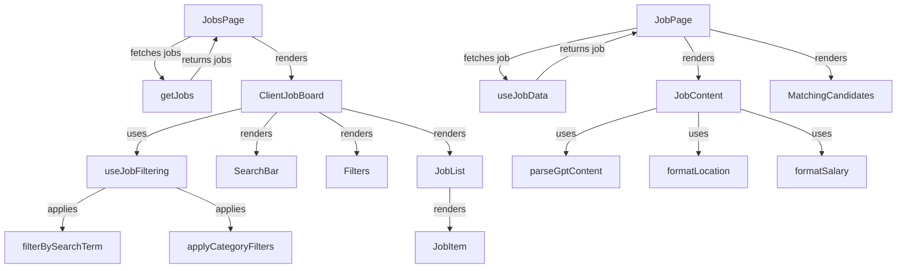
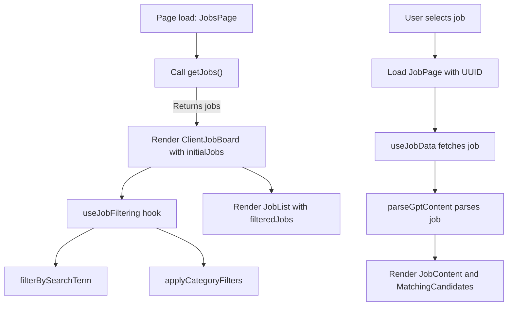
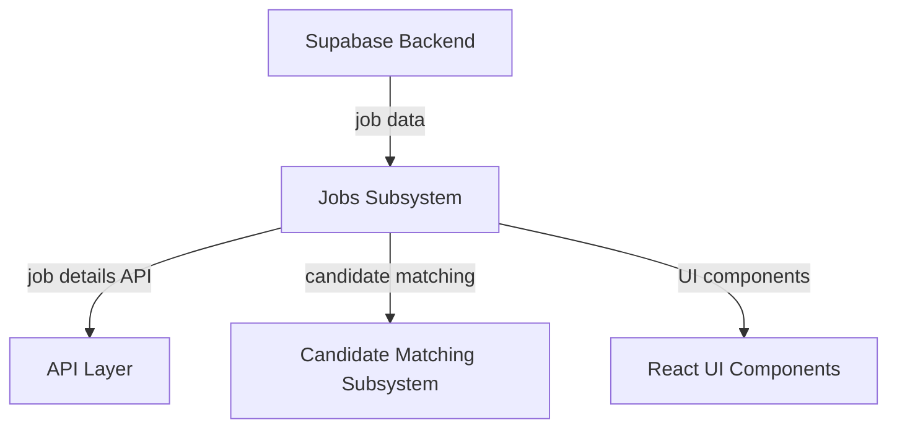
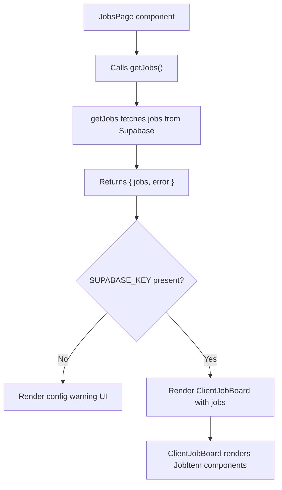

# Jobs Subsystem

The Jobs Subsystem manages job listings, filtering, detailed job views, and candidate matching components within the registry application. It integrates with a Supabase backend to fetch job data, applies client-side filtering and search, and renders detailed job information with associated candidate matches.

## Purpose and Scope

This page documents the internal mechanisms of the Jobs Subsystem, including job data fetching, client-side filtering and search, job detail rendering, and related utility functions for parsing and categorizing job data. It does not cover candidate matching logic beyond its invocation in the job detail view. For candidate matching, see the Candidate Matching subsystem documentation. For UI layout and loading states, see the UI Components documentation.

## Architecture Overview

The subsystem is composed of server-side data fetching from Supabase, client-side filtering hooks, and React components for rendering job lists and job details. The main entry points are the `JobsPage` for the job board overview and `JobPage` for individual job details. Filtering is managed by the `useJobFiltering` hook, which applies search and category filters. Job content parsing and categorization utilities support filtering and display.



**Diagram: Component and data flow relationships within the Jobs Subsystem**

Sources: `apps/registry/app/jobs/page.js:12-82`, `apps/registry/app/jobs/ClientJobBoard.old.js:10-58`, `apps/registry/app/jobs/ClientJobBoardModule/hooks/useJobFiltering/index.js:12-47`, `apps/registry/app/jobs/[uuid]/page.js:18-51`, `apps/registry/app/jobs/JobDetailModule/hooks/useJobData.js:5-27`

## Job Data Fetching

### getJobs

**Purpose:** Fetches recent job listings from the Supabase backend, filtering out jobs without valid GPT content and ordering by posting date.

**Primary file:** `apps/registry/app/jobs/page.js:12-41`

The `getJobs` function asynchronously queries the Supabase `jobs` table for entries posted within the last four months. It excludes jobs where the `gpt_content` field is null or marked as `'FAILED'`. The results are ordered descending by the `posted_at` timestamp. If the environment variable `SUPABASE_KEY` is missing, it returns an empty job list immediately. Errors during fetching are logged and result in an empty list with the error returned.

```js
async function getJobs() {
  if (!process.env.SUPABASE_KEY) {
    return { jobs: [], error: null };
  }

  try {
    const supabase = createClient(supabaseUrl, process.env.SUPABASE_KEY);
    const fourMonthsAgo = new Date();
    fourMonthsAgo.setMonth(fourMonthsAgo.getMonth() - 4);

    const { data: jobs, error } = await supabase
      .from('jobs')
      .select('*')
      .gte('posted_at', fourMonthsAgo.toISOString())
      .not('gpt_content', 'is', null)
      .not('gpt_content', 'eq', 'FAILED')
      .order('posted_at', { ascending: false });

    if (error) {
      logger.error({ error: error.message }, 'Error fetching jobs:');
      return { jobs: [], error };
    }

    return { jobs: jobs || [], error: null };
  } catch (error) {
    logger.error({ error: error.message }, 'Error:');
    return { jobs: [], error };
  }
}
```

**Key behaviors:**
- Returns an empty list if the Supabase API key is missing, preventing unauthorized queries.  
- Filters jobs to only those posted within the last four months to keep listings current.  
- Excludes jobs with missing or failed GPT content to ensure data quality.  
- Logs errors with context for operational monitoring.  
- Uses Supabase client created with environment credentials for secure access.

Sources: `apps/registry/app/jobs/page.js:12-41`

### JobsPage

**Purpose:** Server-side React component that fetches jobs and renders the job board overview page.

**Primary file:** `apps/registry/app/jobs/page.js:43-82`

`JobsPage` calls `getJobs` to retrieve job listings. If the Supabase key is missing, it renders a configuration error message. Otherwise, it renders a page with a heading and a `ClientJobBoard` component wrapped in a React Suspense fallback spinner for loading states.

**Key behaviors:**
- Handles missing configuration gracefully with a user-facing message.  
- Uses Suspense to defer rendering of the job board until data is ready.  
- Passes initial jobs to the client-side job board component for filtering and display.

Sources: `apps/registry/app/jobs/page.js:43-82`

## Client-Side Job Filtering

### ClientJobBoard

**Purpose:** React component managing client-side job filtering, search, and rendering of the filtered job list.

**Primary file:** `apps/registry/app/jobs/ClientJobBoard.old.js:10-58`

`ClientJobBoard` initializes its state with the `initialJobs` prop. It uses the `useJobFiltering` hook to manage filtered jobs, search term, filters, and filter options. It renders a `SearchBar` for text input, a `Filters` panel for category filters, and a `JobList` displaying filtered jobs. It also provides a clear filters button when filters are active.

```js
const ClientJobBoard = ({ initialJobs }) => {
  const [jobs] = useState(initialJobs);

  const {
    filteredJobs,
    searchTerm,
    setSearchTerm,
    filters,
    setFilters,
    filterOptions,
    clearFilters,
    activeFilterCount,
  } = useJobFiltering(jobs);

  return (
    <div className="flex flex-col md:flex-row gap-6">
      <div className="w-full md:w-80">
        <SearchBar searchTerm={searchTerm} setSearchTerm={setSearchTerm} />
        <div className="sticky top-4">
          <Filters
            filters={filters}
            setFilters={setFilters}
            filterOptions={filterOptions}
            clearFilters={clearFilters}
            activeFilterCount={activeFilterCount}
          />
        </div>
      </div>
      <div className="flex-1">
        <div className="flex justify-between items-center mb-4">
          <p className="text-sm text-gray-600">
            {filteredJobs.length} {filteredJobs.length === 1 ? 'job' : 'jobs'} found
          </p>
          {activeFilterCount > 0 && (
            <button
              onClick={clearFilters}
              className="text-sm text-blue-600 hover:text-blue-800 flex items-center"
            >
              Clear all filters
              <X className="w-4 h-4 ml-1" />
            </button>
          )}
        </div>
        <JobList jobs={filteredJobs} />
      </div>
    </div>
  );
};
```

**Key behaviors:**
- Maintains internal state for search term and category filters.  
- Computes filtered job list reactively on changes to search or filters.  
- Provides UI controls for search input and filter toggling.  
- Displays count of filtered jobs and a clear filters button when applicable.

Sources: `apps/registry/app/jobs/ClientJobBoard.old.js:10-58`

### useJobFiltering

**Purpose:** Custom React hook that applies search and category filters to a job list and manages filter state.

**Primary file:** `apps/registry/app/jobs/ClientJobBoardModule/hooks/useJobFiltering/index.js:12-47`

`useJobFiltering` accepts a list of jobs and returns filtered jobs along with state and setters for search term and filters. It uses helper functions `filterBySearchTerm` and `applyCategoryFilters` to reduce the job list. It also provides filter options derived from the job data, a function to clear filters, and a count of active filters.

```js
const useJobFiltering = (jobs) => {
  const [filteredJobs, setFilteredJobs] = useState(jobs);
  const [searchTerm, setSearchTerm] = useState('');
  const [filters, setFilters] = useState(DEFAULT_FILTERS);

  const filterOptions = useFilterOptions(jobs);

  useEffect(() => {
    let result = jobs;

    // Apply search filter
    result = filterBySearchTerm(result, searchTerm);

    // Apply category filters
    result = applyCategoryFilters(result, filters);

    setFilteredJobs(result);
  }, [searchTerm, filters, jobs]);

  const clearFilters = () => {
    setFilters(DEFAULT_FILTERS);
  };

  const activeFilterCount = Object.values(filters).filter(Boolean).length;

  return {
    filteredJobs,
    searchTerm,
    setSearchTerm,
    filters,
    setFilters,
    filterOptions,
    clearFilters,
    activeFilterCount,
  };
};
```

**Key behaviors:**
- Filters jobs by search term using `filterBySearchTerm`.  
- Applies category filters such as location, salary, job type, and experience.  
- Updates filtered job list reactively on input changes.  
- Provides a mechanism to reset all filters to defaults.  
- Computes the count of active filters for UI display.

Sources: `apps/registry/app/jobs/ClientJobBoardModule/hooks/useJobFiltering/index.js:12-47`

## Job Detail View

### JobPage

**Purpose:** React component rendering a detailed view of a single job, including job content and matching candidates.

**Primary file:** `apps/registry/app/jobs/[uuid]/page.js:18-51`

`JobPage` uses the `useJobData` hook to fetch job data by UUID. It handles loading and not-found states with dedicated components. Once loaded, it parses GPT content for structured job details, formats location, salary, and posted date, and renders the `JobContent` component. It also renders a `MatchingCandidates` component to show candidates matched to the job.

```js
function JobPage({ params }) {
  const router = useRouter();
  const { job, loading } = useJobData(params.uuid);

  if (loading) return <LoadingState />;
  if (!job) return <NotFoundState onBack={() => router.push('/jobs')} />;

  const gptContent = parseGptContent(job);
  const locationString = formatLocation(gptContent.location);
  const salary = formatSalary(gptContent.salary);
  const postedDate = formatDate(job.created_at);

  return (
    <div className="min-h-screen bg-gray-50">
      <div className="max-w-4xl mx-auto p-8">
        <motion.div
          initial={{ opacity: 0, y: 20 }}
          animate={{ opacity: 1, y: 0 }}
          transition={{ duration: 0.5 }}
        >
          <BackButton onClick={() => router.push('/jobs')} />
          <JobContent
            gptContent={gptContent}
            locationString={locationString}
            salary={salary}
            postedDate={postedDate}
            job={job}
          />
          <MatchingCandidates jobId={params.uuid} />
        </motion.div>
      </div>
    </div>
  );
}
```

**Key behaviors:**
- Fetches job data asynchronously by UUID.  
- Displays loading and not-found states appropriately.  
- Parses and formats job metadata for display.  
- Provides navigation back to the job board.  
- Integrates candidate matching display for the job.

Sources: `apps/registry/app/jobs/[uuid]/page.js:18-51`

### useJobData

**Purpose:** React hook that fetches job data from the API by UUID and manages loading state.

**Primary file:** `apps/registry/app/jobs/JobDetailModule/hooks/useJobData.js:5-27`

`useJobData` uses React state to hold the job object and loading flag. It triggers an effect on UUID change to fetch job data from `/api/jobs/{uuid}` via Axios. Errors are logged, and loading state is updated accordingly.

```js
const useJobData = (uuid) => {
  const [job, setJob] = useState(null);
  const [loading, setLoading] = useState(true);

  useEffect(() => {
    const fetchJob = async () => {
      try {
        const { data } = await axios.get(`/api/jobs/${uuid}`);
        setJob(data);
      } catch (error) {
        logger.error({ error: error.message }, 'Error fetching job:');
      } finally {
        setLoading(false);
      }
    };

    if (uuid) {
      fetchJob();
    }
  }, [uuid]);

  return { job, loading };
};
```

**Key behaviors:**
- Fetches job data on UUID change.  
- Manages loading state for UI feedback.  
- Logs errors without throwing to avoid breaking UI.  
- Returns null job if fetch fails or UUID is missing.

Sources: `apps/registry/app/jobs/JobDetailModule/hooks/useJobData.js:5-27`

## Job Content Parsing and Formatting

### parseGptContent

**Purpose:** Parses the GPT-generated JSON content from a job record, returning an object or empty on failure.

**Primary file:** `apps/registry/app/jobs/JobDetailModule/utils/jobFormatters.js:1-10`

The function returns an empty object if the `gpt_content` field is missing or marked as `'FAILED'`. It attempts to parse the JSON string, returning an empty object if parsing fails.

```js
const parseGptContent = (job) => {
  if (!job?.gpt_content || job.gpt_content === 'FAILED') {
    return {};
  }
  try {
    return JSON.parse(job.gpt_content);
  } catch {
    return {};
  }
};
```

**Key behaviors:**
- Guards against missing or invalid GPT content.  
- Returns a parsed object for downstream use in filtering and display.

Sources: `apps/registry/app/jobs/JobDetailModule/utils/jobFormatters.js:1-10`

### categorizeSalary

**Purpose:** Categorizes a salary string into predefined salary ranges or labels.

**Primary file:** `apps/registry/app/jobs/ClientJobBoardModule/utils/categorization/categorizeSalary.js:8-34`

The function normalizes the salary string and checks for the keyword "competitive". It extracts the first number found and uses it to assign a salary range category. It handles both numeric and "k" suffixed values.

```js
const categorizeSalary = (salary) => {
  if (!salary) return 'Not Specified';

  const normalized = normalizeString(salary);

  if (normalized.includes('competitive')) return 'Competitive';

  const numbers = salary.match(/\d+/g);
  if (!numbers) return 'Not Specified';

  const firstNumber = parseInt(numbers[0], 10);

  if (normalized.includes('k')) {
    if (firstNumber < 50) return 'Under $50k';
    if (firstNumber < 100) return '$50k - $100k';
    if (firstNumber < 150) return '$100k - $150k';
    if (firstNumber < 200) return '$150k - $200k';
    return '$200k+';
  }

  if (firstNumber < 50000) return 'Under $50k';
  if (firstNumber < 100000) return '$50k - $100k';
  if (firstNumber < 150000) return '$100k - $150k';
  if (firstNumber < 200000) return '$150k - $200k';
  return '$200k+';
};
```

**Key behaviors:**
- Returns "Not Specified" if salary is missing or unparseable.  
- Detects "competitive" keyword as a special category.  
- Parses numeric salary values and maps to ranges with thresholds.  
- Supports both raw numbers and "k" suffixed shorthand.

Sources: `apps/registry/app/jobs/ClientJobBoardModule/utils/categorization/categorizeSalary.js:8-34`

## How It Works

The Jobs Subsystem operates through a sequence of data fetching, filtering, and rendering stages:



**Execution flow through the Jobs Subsystem from job board load to job detail rendering**

Sources: `apps/registry/app/jobs/page.js:12-82`, `apps/registry/app/jobs/ClientJobBoard.old.js:10-58`, `apps/registry/app/jobs/ClientJobBoardModule/hooks/useJobFiltering/index.js:12-47`, `apps/registry/app/jobs/[uuid]/page.js:18-51`, `apps/registry/app/jobs/JobDetailModule/hooks/useJobData.js:5-27`

- The `JobsPage` component initiates by calling `getJobs`, which queries the Supabase backend for recent jobs with valid GPT content.  
- The fetched jobs are passed to `ClientJobBoard`, which initializes filtering state via `useJobFiltering`.  
- `useJobFiltering` applies the search term filter and category filters to produce a filtered job list.  
- The filtered jobs are rendered in a `JobList` component, with UI controls for search and filters.  
- When a user selects a job, the `JobPage` component loads, invoking `useJobData` to fetch detailed job data by UUID.  
- The job's GPT content is parsed for structured details, which are formatted and passed to `JobContent` for rendering.  
- The `MatchingCandidates` component is rendered alongside to show candidates matched to the job.

## Key Relationships

The Jobs Subsystem depends on the Supabase backend for job data storage and retrieval. It integrates with the API layer for fetching individual job details. The subsystem uses React state and hooks extensively for client-side filtering and UI state management. It connects to candidate matching components to display relevant candidates for each job. The subsystem also relies on utility modules for parsing and categorizing job data, which support filtering and display logic.



**Relationships of the Jobs Subsystem with backend, API, candidate matching, and UI components**

Sources: `apps/registry/app/jobs/page.js:12-41`, `apps/registry/app/jobs/[uuid]/page.js:18-51`, `apps/registry/app/jobs/JobDetailModule/hooks/useJobData.js:5-27`

## `dynamicParams` (variable) in apps/registry/app/jobs/page.js

**Purpose**: Configures the Next.js route to always treat route parameters as dynamic, forcing the route to be rendered on every request rather than statically generated at build time.

**Details**:  
- Declared as a constant boolean with the value `true`.  
- Exported to be consumed by Next.js routing system.  
- Ensures that the jobs page does not statically cache parameters, enabling dynamic fetching and rendering of job listings on each request.  
- This is critical because job data changes frequently and must reflect the latest state without stale caching.

**Usage Context**:  
Used in the jobs page route configuration to override Next.js default static generation behavior, ensuring fresh data on every page load.

Sources: `apps/registry/app/jobs/page.js:9`


## `revalidate` (variable) in apps/registry/app/jobs/page.js

**Purpose**: Controls the Next.js Incremental Static Regeneration (ISR) revalidation interval for the jobs page.

**Details**:  
- Declared as a constant with the value `0`.  
- Exported to Next.js to specify that the page should never be statically cached and should always be revalidated on every request.  
- Setting `revalidate` to `0` disables ISR, effectively forcing server-side rendering on each request.  
- This aligns with `dynamicParams = true` to ensure the job board always shows the most current data.

**Usage Context**:  
Works in tandem with `dynamicParams` to disable static caching for the jobs page, critical for up-to-date job listings.

Sources: `apps/registry/app/jobs/page.js:10`


## `{ jobs }` (variable) in apps/registry/app/jobs/page.js

**Purpose**: Holds the array of job listings fetched from the Supabase backend, used as initial data for rendering the jobs page.

**Details**:  
- Destructured from the resolved object returned by the asynchronous `getJobs()` function.  
- Contains an array of job objects representing active job postings filtered by recency and content validity.  
- Passed as a prop (`initialJobs`) to the client-side `ClientJobBoard` component for rendering.  
- If the Supabase key is missing or an error occurs, this defaults to an empty array, ensuring the UI can handle empty states gracefully.

**Usage Context**:  
Used in the server component `JobsPage` to provide initial job data for the client job board interface.

Sources: `apps/registry/app/jobs/page.js:23-29, 44`


## `JobsLoading` (function) in apps/registry/app/jobs/loading.js

**Purpose**: Provides a React component that renders a loading skeleton UI while job data is being fetched asynchronously.

**Details**:  
- Default export of the module.  
- Returns the `JobsLoadingSkeleton` component imported from a shared UI components library.  
- Used as a suspense fallback in the jobs page to indicate loading state to users.  
- Minimal implementation focused purely on rendering the loading placeholder without side effects.

**Usage Context**:  
Used by Next.js suspense boundaries to display a loading state during asynchronous data fetching on the jobs page.

Sources: `apps/registry/app/jobs/loading.js:3-5`


## `Home` (function) in apps/registry/app/jobs/layout.js

**Purpose**: Acts as a simple React layout component that renders its children without additional markup or logic.

**Details**:  
- Declared as a client component (`'use client'` directive).  
- Accepts a `children` prop and returns it directly.  
- Serves as a placeholder layout for the jobs route, enabling composition of nested routes or components.  
- No side effects or state management.

**Usage Context**:  
Wraps the jobs page content, allowing future extension or layout customization without altering the page component.

Sources: `apps/registry/app/jobs/layout.js:3-5`


## `JobsError` (function) in apps/registry/app/jobs/error.js

**Purpose**: Provides a React error boundary component that catches and displays errors occurring during job data fetching or rendering.

**Details**:  
- Declared as a client component (`'use client'` directive).  
- Accepts `error` and `reset` props, where `error` is the caught error object and `reset` is a callback to retry loading.  
- Uses a `useEffect` hook to log detailed error information (message, stack, digest, context) to a centralized logger when the component mounts or the error changes.  
- Renders a user-friendly error message with options to reload the jobs or navigate home.  
- In development mode, displays the error message in a styled debug panel for easier troubleshooting.  
- Uses UI components from the shared `@repo/ui` library for buttons and styling.

**Key Behaviors**:  
- Logs error details immediately upon error boundary activation.  
- Provides user controls to recover from errors without full page reload.  
- Differentiates UI between production and development environments for error visibility.

Sources: `apps/registry/app/jobs/error.js:7-47`


## `searchLower` (variable) in apps/registry/app/jobs/ClientJobBoardModule/hooks/useJobFiltering/searchFilter.js

**Purpose**: Stores the lowercase version of the search term used to filter job listings by text matching.

**Details**:  
- Derived from the input `searchTerm` string by calling `.toLowerCase()`.  
- Used to perform case-insensitive matching against multiple job content fields such as title, company, description, requirements, and responsibilities.  
- Ensures consistent filtering regardless of user input case.  
- Scoped within the `filterBySearchTerm` function.

**Usage Context**:  
Used internally in the search filtering hook to normalize the search term for efficient and accurate filtering.

Sources: `apps/registry/app/jobs/ClientJobBoardModule/hooks/useJobFiltering/searchFilter.js:9`


## `jobLocation` (variable) in apps/registry/app/jobs/ClientJobBoardModule/hooks/useJobFiltering/categoryFilter.js

**Purpose**: Represents the normalized location string extracted from a job's parsed content, used for location-based filtering.

**Details**:  
- Obtained by calling the utility function `getLocationString` with the parsed GPT content of a job.  
- Used within the `applyCategoryFilters` function to categorize and filter jobs by location.  
- Enables matching jobs against location filters by converting raw location data into a consistent format.  
- Scoped inside the filtering callback for each job.

**Usage Context**:  
Used to apply location category filters on job listings, supporting user queries by geographic criteria.

Sources: `apps/registry/app/jobs/ClientJobBoardModule/hooks/useJobFiltering/categoryFilter.js:26`


## `now` (variable) in apps/registry/app/jobs/ClientJobBoardModule/components/JobItem.jsx

**Purpose**: Captures the current date and time at the moment of rendering a job item, used for calculating relative posting dates.

**Details**:  
- Instantiated as a `Date` object representing the current timestamp.  
- Used to compute the difference in time between the job's posted date and the current time.  
- Enables relative date formatting such as "Today", "Yesterday", or "X days ago".  
- Scoped within the `formatDate` helper function.

**Usage Context**:  
Used to display human-readable relative dates for job postings in the UI.

Sources: `apps/registry/app/jobs/ClientJobBoardModule/components/JobItem.jsx:9`


## `diffTime` (variable) in apps/registry/app/jobs/ClientJobBoardModule/components/JobItem.jsx

**Purpose**: Represents the absolute time difference in milliseconds between the current time and the job posting date.

**Details**:  
- Calculated as the absolute value of the difference between `now` and the parsed job posting date.  
- Used to derive the number of days elapsed since the job was posted.  
- Supports conditional logic in `formatDate` to determine appropriate relative date labels.  
- Scoped within the `formatDate` helper function.

**Usage Context**:  
Forms the basis for relative date display in job listings, improving user comprehension of posting recency.

Sources: `apps/registry/app/jobs/ClientJobBoardModule/components/JobItem.jsx:10`


## How It Works: Jobs Page Data Flow



**Diagram: Data flow from server-side job fetching to client-side rendering on the jobs page**

Sources: `apps/registry/app/jobs/page.js:12-82`

## jobs-subsystem (supplement)

This supplement documents additional symbols from the jobs subsystem that were omitted in the initial generation. It covers key UI components and utility variables related to job listings, filtering, and detailed job views. The focus is on internal mechanisms, data flows, and component interactions within the client job board and job detail modules.

## `diffDays` (variable) in apps/registry/app/jobs/ClientJobBoardModule/components/JobItem.jsx

**Purpose:**  
`diffDays` calculates the number of full days elapsed between the current date and a given job posting date, used to display human-readable relative posting times.

**Details:**  
- Derived by computing the absolute difference in milliseconds between `now` (current date) and `date` (job posting date), then converting to days by dividing by the number of milliseconds in a day (`1000 * 60 * 60 * 24`).
- Rounded up using `Math.ceil` to count partial days as full days.
- Used within the `formatDate` function to determine relative labels such as "Today," "Yesterday," or "X days/weeks/months ago."
- Falls back to a localized date string if the posting is older than a year.

**Edge Cases:**  
- If `dateString` is falsy, `formatDate` returns "Date not specified."
- Zero or one day difference returns special strings ("Today" or "Yesterday").
- Larger differences are bucketed into weeks, months, or full date formats.

Sources: `apps/registry/app/jobs/ClientJobBoardModule/components/JobItem.jsx:8-11`

---

## `handleClick` (variable) in apps/registry/app/jobs/ClientJobBoardModule/components/JobItem.jsx

**Purpose:**  
`handleClick` is an event handler that navigates the user to the detailed job page when a job item is clicked.

**Details:**  
- Defined as an arrow function capturing lexical `router` from `useRouter` hook.
- Calls `router.push` with the URL path `/jobs/${job.uuid}`, where `job.uuid` uniquely identifies the job.
- Bound to the root `<div>` of the `JobItem` component as an `onClick` handler.
- Enables the entire job card to be clickable, improving UX by making navigation intuitive.

**Failure Modes:**  
- If `job.uuid` is missing or malformed, navigation will lead to an invalid route.
- No error handling is implemented; navigation failures rely on Next.js router behavior.

Sources: `apps/registry/app/jobs/ClientJobBoardModule/components/JobItem.jsx:26-34`

---

## `updateFilter` (variable) in apps/registry/app/jobs/ClientJobBoardModule/components/Filters.jsx

**Purpose:**  
`updateFilter` updates the current filter state by merging a new key-value pair into the existing filters.

**Details:**  
- Defined as an arrow function taking `key` (string) and `value` (string).
- Calls `setFilters` with a function updater that shallow merges the previous filter object with the new key-value pair.
- Ensures immutability of the filters state by creating a new object.
- Used as a callback passed to each `FilterSection` component to handle changes in individual filter categories.

**Usage:**  
- Enables dynamic updates to filters such as job type, experience, location, salary, and company.
- Supports clearing filters by passing an empty string as `value`.

Sources: `apps/registry/app/jobs/ClientJobBoardModule/components/Filters.jsx:17-19`

---

## `FilterSection` (variable) in apps/registry/app/jobs/ClientJobBoardModule/components/FilterSection.jsx

**Purpose:**  
`FilterSection` renders a single filter category UI with a dropdown selector and a clear button.

**Props:**

| Prop       | Type               | Purpose                                                                                      |
|------------|--------------------|----------------------------------------------------------------------------------------------|
| `title`    | `string`           | The display name of the filter category (e.g., "Job Type").                                 |
| `options`  | `string[]`         | Array of selectable filter options for this category.                                       |
| `value`    | `string`           | Currently selected filter value; empty string means no filter applied.                       |
| `onChange` | `(value: string) => void` | Callback invoked when the filter selection changes.                                        |
| `icon`     | `React.Component`  | Icon component to display alongside the filter title.                                       |

**Behavior:**

- Returns `null` if `options` is empty or undefined, preventing rendering empty filter sections.
- Renders a `<select>` dropdown with an "All {title}s" default option and options mapped from `options`.
- When a value is selected, calls `onChange` with the new value.
- Displays a clear button (`X` icon) when a filter is active (`value` is non-empty), which resets the filter on click.
- Uses `Button` component with `variant="ghost"` and `size="icon"` for the clear button, positioned absolutely inside the select container.

**Edge Cases:**

- Handles empty or missing options gracefully by not rendering.
- The clear button is only visible when a filter is active.

Sources: `apps/registry/app/jobs/ClientJobBoardModule/components/FilterSection.jsx:4-46`

---

## `Home` (function) in apps/registry/app/jobs/[uuid]/layout.js

**Purpose:**  
`Home` is a client-side React component that serves as a layout wrapper for job detail pages.

**Details:**  
- Defined as a default export function component.
- Accepts a single `children` prop, which represents nested React nodes.
- Returns the `children` directly without additional markup or logic.
- Marked with `'use client'` directive, indicating it runs on the client side in Next.js.
- Acts as a pass-through layout component, potentially for future extension or consistent layout structure.

Sources: `apps/registry/app/jobs/[uuid]/layout.js:3-5`

---

## `JobHeader` (variable) in apps/registry/app/jobs/JobDetailModule/components/JobHeader.jsx

**Purpose:**  
`JobHeader` renders the top section of a job detail page, displaying the job title, company, location, salary, posting date, and job type with associated icons.

**Props:**

| Prop           | Type     | Purpose                                                                                   |
|----------------|----------|-------------------------------------------------------------------------------------------|
| `title`        | `string` | The job title; falls back to "Untitled Position" if falsy.                               |
| `company`      | `string` | Company name; defaults to "Company not specified" if falsy.                              |
| `locationString`| `string` | Location description; optional, only rendered if truthy.                                |
| `salary`       | `string` | Salary information; optional, only rendered if truthy.                                  |
| `postedDate`   | `string` | Human-readable posting date string (e.g., "3 days ago").                                |
| `jobType`      | `string` | Job type label (e.g., "Full-time"); optional, rendered as a badge if truthy.             |

**Structure and Behavior:**

- Uses flexbox to layout two main sections: left with title and company/location/salary info, right with posting date and job type badge.
- Icons from `lucide-react` visually represent company (`Building`), location (`MapPin`), salary (`DollarSign`), posting date (`Clock`), and job type (`BriefcaseIcon`).
- Posting date and job type are aligned vertically on the right side.
- Job type is rendered as a pill-shaped badge with blue background and icon.
- All text fields have fallback strings to handle missing data gracefully.

**Edge Cases:**

- Missing or empty props do not break layout; fallback strings ensure UI consistency.
- Location, salary, and job type are optional and conditionally rendered.

Sources: `apps/registry/app/jobs/JobDetailModule/components/JobHeader.jsx:9-56`

---

## `ApplySection` (variable) in apps/registry/app/jobs/JobDetailModule/components/ApplySection.jsx

**Purpose:**  
`ApplySection` renders the application call-to-action area on a job detail page, providing buttons to apply either via the company website or email.

**Props:**

| Prop         | Type     | Purpose                                                                                  |
|--------------|----------|------------------------------------------------------------------------------------------|
| `jobUrl`     | `string` | URL to the company's job application page; if present, renders a link button.            |
| `contactEmail`| `string` | Email address for application; used if `jobUrl` is absent.                              |
| `jobTitle`   | `string` | Job title used in the email subject line; defaults to "Position" if falsy.               |

**Behavior:**

- Displays a heading and descriptive text encouraging application.
- If `jobUrl` is provided, renders a styled anchor link opening in a new tab with `rel="noopener noreferrer"`.
- If `jobUrl` is missing, renders a mailto link with subject line "Application for {jobTitle}".
- Buttons have consistent styling with blue background, white text, and hover/focus states.
- The mailto link encodes the job title in the email subject for clarity.

**Edge Cases:**

- If both `jobUrl` and `contactEmail` are missing or empty, the component renders only the heading and description without an actionable button.
- Email subject defaults to "Position" if `jobTitle` is falsy.

Sources: `apps/registry/app/jobs/JobDetailModule/components/ApplySection.jsx:1-33`

---

## `SkillsSection` (variable) in apps/registry/app/jobs/JobDetailModule/components/JobSections/SkillsSection.jsx

**Purpose:**  
`SkillsSection` displays a list of required skills grouped by categories on the job detail page.

**Props:**

| Prop    | Type                         | Purpose                                                        |
|---------|------------------------------|----------------------------------------------------------------|
| `skills`| `Array<{ name?: string, keywords?: string[] }>` | Array of skill groups, each with an optional name and keywords.|

**Behavior:**

- Returns `null` if `skills` is falsy or an empty array, preventing rendering empty sections.
- Renders a section heading "Required Skills".
- Iterates over `skills` array, rendering each skill group:
  - If `name` is present, renders it as a subheading.
  - Renders each keyword as a pill-shaped badge with blue styling.
- Uses flex-wrap and gap styling to layout skill badges responsively.

**Edge Cases:**

- Skill groups without a `name` render only their keywords.
- Skill groups with empty or missing `keywords` render only the group name.
- Handles empty or missing `skills` gracefully by not rendering.

Sources: `apps/registry/app/jobs/JobDetailModule/components/JobSections/SkillsSection.jsx:1-29`

---

## `ResponsibilitiesSection` (variable) in apps/registry/app/jobs/JobDetailModule/components/JobSections/ResponsibilitiesSection.jsx

**Purpose:**  
`ResponsibilitiesSection` renders a bulleted list of key responsibilities for the job.

**Props:**

| Prop              | Type       | Purpose                                |
|-------------------|------------|--------------------------------------|
| `responsibilities` | `string[]` | Array of responsibility descriptions.|

**Behavior:**

- Returns `null` if `responsibilities` is falsy or empty.
- Renders a section heading "Key Responsibilities".
- Maps each responsibility string to a list item with a blue check-circle icon.
- Uses flexbox to align icon and text, ensuring consistent spacing and vertical alignment.

**Edge Cases:**

- Empty or missing `responsibilities` results in no rendering.
- Responsibility strings are rendered verbatim; no sanitization or formatting applied.

Sources: `apps/registry/app/jobs/JobDetailModule/components/JobSections/ResponsibilitiesSection.jsx:3-18`

---

## `RequirementsSection` (variable) in apps/registry/app/jobs/JobDetailModule/components/JobSections/RequirementsSection.jsx

**Purpose:**  
`RequirementsSection` renders a bulleted list of job requirements.

**Props:**

| Prop           | Type       | Purpose                           |
|----------------|------------|---------------------------------|
| `requirements` | `string[]` | Array of requirement descriptions.|

**Behavior:**

- Returns `null` if `requirements` is falsy or empty.
- Renders a section heading "Requirements".
- Maps each requirement string to a list item with a green check-circle icon.
- Uses flexbox for icon and text alignment, mirroring `ResponsibilitiesSection` style but with green icon color.

**Edge Cases:**

- Empty or missing `requirements` results in no rendering.
- Requirement strings are rendered as-is without additional formatting.

Sources: `apps/registry/app/jobs/JobDetailModule/components/JobSections/RequirementsSection.jsx:3-18`

---

## `ExperienceSection` (variable)

**Purpose:** Renders the "Experience Level" section of a job detail page, displaying the experience requirement as a styled text block.

**Primary file:** `apps/registry/app/jobs/JobDetailModule/components/JobSections/ExperienceSection.jsx:1-9`

This React functional component accepts a single prop `experience` (string or falsy). It returns `null` if `experience` is falsy (undefined or null), indicating no experience data to display. Otherwise, it renders a container `<div>` with a heading "Experience Level" and a paragraph showing the experience string styled with gray text.

The component uses an arrow function, capturing lexical `this` (though `this` is not used). It is a named export, imported with destructuring.

**Key behaviors:**
- Returns `null` if `experience` is falsy, preventing empty section rendering.
- Displays the experience text verbatim without transformation.
- Uses semantic HTML with a heading and paragraph for accessibility and styling consistency.

**Example usage:**
```jsx
<ExperienceSection experience="Mid Level" />
```

Sources: `apps/registry/app/jobs/JobDetailModule/components/JobSections/ExperienceSection.jsx:1-9`

---

## `DescriptionSection` (variable)

**Purpose:** Renders the "About This Role" section, displaying the job description with line breaks converted to HTML `<br />` elements.

**Primary file:** `apps/registry/app/jobs/JobDetailModule/components/JobSections/DescriptionSection.jsx:1-14`

This React functional component receives a `description` string prop. It returns `null` if `description` is falsy (undefined or null). When present, it renders a container `<div>` with a heading and a `<div>` that injects the description as HTML using `dangerouslySetInnerHTML`. The description string replaces newline characters (`\n`) with `<br />` tags to preserve line breaks visually.

This component uses an arrow function and is a named export.

**Key behaviors:**
- Returns `null` if `description` is falsy, avoiding empty section rendering.
- Converts newlines to HTML line breaks for proper formatting.
- Uses `dangerouslySetInnerHTML` to inject sanitized HTML; assumes input is safe or sanitized upstream.
- Provides semantic structure with heading and content container.

**Example usage:**
```jsx
<DescriptionSection description={"This role involves:\n- Developing features\n- Collaborating with teams"} />
```

Sources: `apps/registry/app/jobs/JobDetailModule/components/JobSections/DescriptionSection.jsx:1-14`

---

## `CultureSection` (variable)

**Purpose:** Renders the "Company Culture" section, displaying a textual description of the employer's culture.

**Primary file:** `apps/registry/app/jobs/JobDetailModule/components/JobSections/CultureSection.jsx:1-9`

This React functional component accepts a `culture` string prop. It returns `null` if `culture` is falsy (undefined or null). When provided, it renders a container `<div>` with a heading and a paragraph showing the culture text styled in gray.

It is a named export implemented as an arrow function.

**Key behaviors:**
- Omits rendering if `culture` is falsy.
- Displays culture text verbatim.
- Uses semantic HTML with heading and paragraph.

**Example usage:**
```jsx
<CultureSection culture="We foster innovation and collaboration." />
```

Sources: `apps/registry/app/jobs/JobDetailModule/components/JobSections/CultureSection.jsx:1-9`

---

## `BenefitsSection` (variable)

**Purpose:** Renders the "Benefits & Perks" section, displaying a list of benefits with icons and styled layout.

**Primary file:** `apps/registry/app/jobs/JobDetailModule/components/JobSections/BenefitsSection.jsx:3-21`

This React functional component receives a `benefits` prop, expected to be an array of strings. It returns `null` if `benefits` is falsy or an empty array, preventing rendering of an empty list.

When benefits are present, it renders a container `<div>` with a heading and a responsive grid `<ul>` of benefit items. Each benefit is rendered as a list item with a green check-circle icon (from the `lucide-react` package) and the benefit text styled in gray. The grid uses CSS classes to adapt from single-column on small screens to two columns on medium screens.

**Key behaviors:**
- Returns `null` if `benefits` is falsy or empty.
- Maps each benefit string to a styled list item with an icon.
- Uses a responsive grid layout for better UX on different screen sizes.
- Imports and uses an external icon component for visual clarity.

**Example usage:**
```jsx
<BenefitsSection benefits={["Health insurance", "401(k) matching", "Remote work options"]} />
```

Sources: `apps/registry/app/jobs/JobDetailModule/components/JobSections/BenefitsSection.jsx:3-21`

---

## `AdditionalSection` (variable)

**Purpose:** Renders the "Additional Information" section, displaying supplementary job details as text.

**Primary file:** `apps/registry/app/jobs/JobDetailModule/components/JobSections/AdditionalSection.jsx:1-9`

This React functional component accepts an `additional` string prop. It returns `null` if `additional` is falsy (undefined or null). When present, it renders a container `<div>` with a heading and a paragraph showing the additional information styled in gray.

It is a named export implemented as an arrow function.

**Key behaviors:**
- Omits rendering if `additional` is falsy.
- Displays additional information verbatim.
- Uses semantic HTML with heading and paragraph.

**Example usage:**
```jsx
<AdditionalSection additional="This position requires occasional travel." />
```

Sources: `apps/registry/app/jobs/JobDetailModule/components/JobSections/AdditionalSection.jsx:1-9`

---

## `parseJobContent` (variable)

**Purpose:** Parses the GPT-generated content string from a job object into a JavaScript object, or returns an empty object if parsing is not possible.

**Primary file:** `apps/registry/app/jobs/ClientJobBoardModule/utils/jobParser.js:6-11`

This named export is a synchronous arrow function that accepts a `job` object parameter, expected to have a `gpt_content` property. If `gpt_content` exists and is not the string `'FAILED'`, it parses the JSON string and returns the resulting object. Otherwise, it returns an empty object.

**Key behaviors:**
- Returns parsed JSON object from `job.gpt_content` if valid.
- Returns empty object if `gpt_content` is missing or equals `'FAILED'`.
- Does not throw on invalid JSON; assumes valid JSON or `'FAILED'` sentinel only.

**Example usage:**
```js
const parsed = parseJobContent(job);
```

Sources: `apps/registry/app/jobs/ClientJobBoardModule/utils/jobParser.js:6-11`

---

## `getLocationString` (variable)

**Purpose:** Constructs a human-readable location string by concatenating city, region, and country code from parsed GPT content.

**Primary file:** `apps/registry/app/jobs/ClientJobBoardModule/utils/jobParser.js:18-26`

This named export is a synchronous arrow function accepting a `gptContent` object, expected to have a nested `location` object with optional `city`, `region`, and `countryCode` string properties. It filters out any falsy values and joins the remaining parts with commas and spaces.

**Key behaviors:**
- Omits any missing or falsy location parts.
- Produces a string in the format `"City, Region, CountryCode"` or a subset thereof.
- Returns an empty string if all parts are missing.

**Example usage:**
```js
const locationStr = getLocationString(parsedContent);
```

Sources: `apps/registry/app/jobs/ClientJobBoardModule/utils/jobParser.js:18-26`

---

## `categorizeLocation` (variable)

**Purpose:** Categorizes a location string into standardized location categories such as "Remote", "Hybrid", or "On-site", or returns the original string if it appears fully qualified.

**Primary file:** `apps/registry/app/jobs/ClientJobBoardModule/utils/categorization/categorizeLocation.js:8-22`

This named export is a synchronous arrow function that accepts a `location` string. It returns `'Not Specified'` if the input is falsy. If the string contains commas, it assumes the location is already in a full `"City, Region, Country"` format and returns it unchanged.

Otherwise, it normalizes the string (lowercase, trimmed, etc.) using the imported `normalizeString` helper and checks for keywords:

- Includes `'remote'` → returns `'Remote'`
- Includes `'hybrid'` → returns `'Hybrid'`
- Includes `'onsite'` or `'office'` → returns `'On-site'`

If none match, it returns the original input string.

**Key behaviors:**
- Handles falsy input by returning `'Not Specified'`.
- Detects explicit location strings by presence of commas.
- Uses normalized string matching for keyword detection.
- Returns original input if no category keywords match.

**Example usage:**
```js
const category = categorizeLocation("Remote");
```

Sources: `apps/registry/app/jobs/ClientJobBoardModule/utils/categorization/categorizeLocation.js:8-22`

---

## `categorizeJobType` (variable)

**Purpose:** Categorizes a job type string into standard job type categories such as "Full-time", "Contract", or "Internship".

**Primary file:** `apps/registry/app/jobs/ClientJobBoardModule/utils/categorization/categorizeJobType.js:8-22`

This named export is a synchronous arrow function accepting a `type` string. It normalizes the string using `normalizeString` and checks for substrings corresponding to known job types:

- `'contract'` → `'Contract'`
- `'fulltime'` or `'full'` → `'Full-time'`
- `'parttime'` or `'part'` → `'Part-time'`
- `'intern'` → `'Internship'`
- `'temp'` → `'Temporary'`
- `'hybrid'` → `'Hybrid'`
- `'remote'` → `'Remote'`

If none match, it returns `'Other'`.

**Key behaviors:**
- Uses normalized string matching for robust keyword detection.
- Returns `'Other'` if no known job type keywords are found.
- Covers common employment types and work arrangements.

**Example usage:**
```js
const jobType = categorizeJobType("Full Time");
```

Sources: `apps/registry/app/jobs/ClientJobBoardModule/utils/categorization/categorizeJobType.js:8-22`

---

## `categorizeExperience` (variable)

**Purpose:** Categorizes an experience level string into standardized experience categories such as "Entry Level", "Senior Level", or "Manager".

**Primary file:** `apps/registry/app/jobs/ClientJobBoardModule/utils/categorization/categorizeExperience.js:8-25`

This named export is a synchronous arrow function accepting an `exp` string. It normalizes the string using `normalizeString` and matches substrings to known experience levels:

- `'entry'` or `'junior'` → `'Entry Level'`
- `'mid'` or `'intermediate'` → `'Mid Level'`
- `'senior'` or `'sr'` → `'Senior Level'`
- `'lead'` or `'principal'` → `'Lead'`
- `'manager'` or `'head'` → `'Manager'`
- `'exec'` or `'director'` → `'Executive'`

If no match is found, it returns `'Not Specified'`.

**Key behaviors:**
- Uses normalized string matching for flexible keyword detection.
- Covers a broad range of experience levels from entry to executive.
- Returns `'Not Specified'` when input does not match known categories.

**Example usage:**
```js
const experienceCategory = categorizeExperience("Senior Developer");
```

Sources: `apps/registry/app/jobs/ClientJobBoardModule/utils/categorization/categorizeExperience.js:8-25`

---