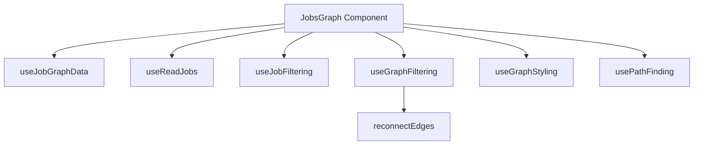
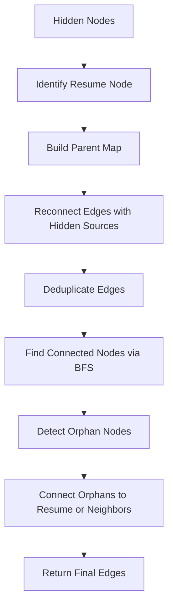
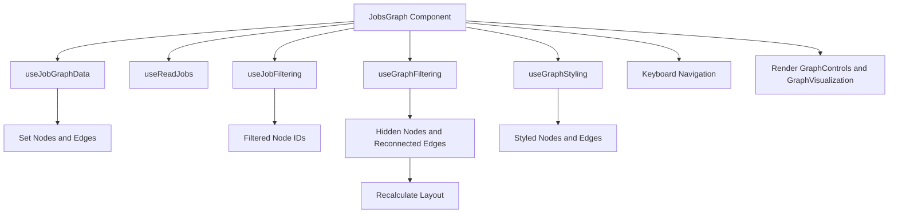
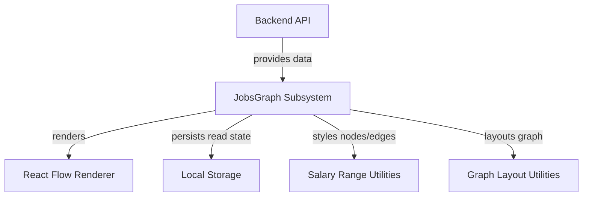

# Jobs Graph

The Jobs Graph subsystem provides a comprehensive visualization and interaction layer for job data structured as a graph. It supports dynamic filtering, styling, and navigation of job nodes and their relationships, enabling users to explore job opportunities and their connections effectively.

## Purpose and Scope

This page documents the internal mechanisms behind the Jobs Graph feature, focusing on graph visualization, job filtering, node and edge styling, and interaction hooks. It covers the core React component `JobsGraph`, its supporting hooks for data fetching, filtering, styling, and graph reconnection logic. It does not cover unrelated UI components like job detail panels or external API implementations.

For job data fetching and transformation, see the Data Fetching and Conversion pages. For UI components related to job details and controls, see the Job Detail Panel and Graph Controls pages.

## Architecture Overview

The Jobs Graph subsystem orchestrates job data retrieval, graph construction, filtering, styling, and user interaction. The main entry point is the `JobsGraph` React component, which uses several custom hooks to manage state and behavior:

- `useJobGraphData` fetches and converts job graph data into React Flow nodes and edges.
- `useReadJobs` manages read/unread job state persisted in local storage.
- `useJobFiltering` applies textual and remote-only filters to job nodes.
- `useGraphFiltering` hides filtered or read nodes and reconnects edges to maintain graph integrity.
- `useGraphStyling` applies visual styles to nodes and edges based on job attributes and filter states.
- `usePathFinding` identifies paths from selected nodes to the resume node for highlighting.
- `reconnectEdges` repairs graph connectivity when nodes are hidden.

**Diagram: Core components and hooks in the Jobs Graph subsystem and their relationships**

Sources: `apps/registry/app/[username]/jobs-graph/page.js:21-130`, `apps/registry/app/[username]/jobs-graph/hooks/useJobGraphData.js:11-47`, `apps/registry/app/[username]/jobs-graph/hooks/useReadJobs.js:8-35`, `apps/registry/app/[username]/jobs-graph/hooks/useJobFiltering.js:35-89`, `apps/registry/app/[username]/jobs-graph/hooks/useGraphFiltering.js:19-133`, `apps/registry/app/[username]/jobs-graph/hooks/useGraphStyling.js:40-118`, `apps/registry/app/[username]/jobs-graph/hooks/usePathFinding.js:8-45`, `apps/registry/app/[username]/jobs-graph/utils/graphReconnection.js:13-206`

## JobsGraph Component

**Purpose:** The primary React component rendering the job graph visualization, managing state for nodes, edges, filters, selections, and coordinating all hooks for data, filtering, styling, and interaction.

**Primary file:** `apps/registry/app/[username]/jobs-graph/page.js:21-130`

The `JobsGraph` component initializes React Flow state for nodes and edges and UI state for selected nodes, filter text, salary gradient toggle, remote-only filter, and visibility of hidden nodes. It uses the following custom hooks:

- `useJobGraphData` to fetch job graph data and populate nodes and edges.
- `useReadJobs` to track which jobs have been marked as read.
- `useJobFiltering` to produce a filtered set of nodes based on text and remote-only filters.
- `useSalaryRange` (not detailed here) to compute salary ranges for styling.
- `usePathFinding` to find paths from nodes to the resume node.
- `useGraphFiltering` to hide filtered or read nodes and reconnect edges.
- `useGraphStyling` to apply styles to visible nodes and edges.
- `useKeyboardNavigation` (not detailed here) to enable keyboard-based graph navigation.

The component conditionally renders a loading animation while data is loading or no nodes exist. Once loaded, it renders graph controls and the graph visualization itself, passing styled nodes and edges, event handlers, and state.

The `handleNodeClick` callback updates the selected node state when a node is clicked.

**Key behaviors:**
- Initializes and manages React Flow nodes and edges state. `apps/registry/app/[username]/jobs-graph/page.js:25-26`
- Coordinates data fetching and state updates via custom hooks. `apps/registry/app/[username]/jobs-graph/page.js:37-41`
- Applies filtering and styling hooks to produce visible, styled graph elements. `apps/registry/app/[username]/jobs-graph/page.js:47-74`
- Enables keyboard navigation and node selection. `apps/registry/app/[username]/jobs-graph/page.js:86-88`
- Renders loading state and main graph UI components. `apps/registry/app/[username]/jobs-graph/page.js:90-130`

## useJobGraphData Hook

**Purpose:** Fetches job graph data from the backend API, converts it into React Flow nodes and edges, and manages loading state.

**Primary file:** `apps/registry/app/[username]/jobs-graph/hooks/useJobGraphData.js:11-47`

This hook accepts a username and setters for nodes and edges. It fetches data from `/api/jobs-graph?username=...` asynchronously, retrieving raw graph data, a job info map, and all jobs. It converts the raw graph data into React Flow format using `convertToReactFlowFormat` and updates the nodes and edges state accordingly.

It manages local state for the raw jobs, job info map, and loading status. Errors during fetching are logged but do not throw.

**Key behaviors:**
- Fetches job graph data on username change. `apps/registry/app/[username]/jobs-graph/hooks/useJobGraphData.js:17-39`
- Converts raw graph data to React Flow nodes and edges. `apps/registry/app/[username]/jobs-graph/hooks/useJobGraphData.js:28-31`
- Updates React Flow state and loading indicators. `apps/registry/app/[username]/jobs-graph/hooks/useJobGraphData.js:37-47`

## useReadJobs Hook

**Purpose:** Tracks which jobs have been marked as read by the user, persisting this state in local storage keyed by username.

**Primary file:** `apps/registry/app/[username]/jobs-graph/hooks/useReadJobs.js:8-35`

This hook initializes a `Set` of read job keys from local storage on mount. It provides a `markJobAsRead` callback that adds a job's key to the set and updates local storage accordingly.

Keys are constructed as `${username}_${jobId}` to namespace per user.

**Key behaviors:**
- Loads read job keys from local storage on username change. `apps/registry/app/[username]/jobs-graph/hooks/useReadJobs.js:13-15`
- Marks jobs as read and persists updates to local storage. `apps/registry/app/[username]/jobs-graph/hooks/useReadJobs.js:20-32`

## useJobFiltering Hook

**Purpose:** Produces a filtered set of job nodes based on textual search and remote-only filters.

**Primary file:** `apps/registry/app/[username]/jobs-graph/hooks/useJobFiltering.js:35-89`

This hook accepts filter text, job info map, and a remote-only flag. It returns a `Set` of node IDs that match the filters.

Filtering logic includes:
- Case-insensitive substring matching against job title, company, location, and description.
- Remote-only filtering based on job location and remote keywords.

**Key behaviors:**
- Converts filter text to lowercase for case-insensitive matching. `apps/registry/app/[username]/jobs-graph/hooks/useJobFiltering.js:50-51`
- Checks remote status using keywords and location fields. `apps/registry/app/[username]/jobs-graph/hooks/useJobFiltering.js:9-26`
- Returns a set of node IDs passing all active filters. `apps/registry/app/[username]/jobs-graph/hooks/useJobFiltering.js:35-89`

## usePathFinding Hook

**Purpose:** Provides a function to find the path of edges from any node up to the resume node in the graph.

**Primary file:** `apps/registry/app/[username]/jobs-graph/hooks/usePathFinding.js:8-45`

The hook returns a `findPathToResume` callback that, given edges and a start node ID, recursively traverses parent edges to find a path to the resume node. It returns a set of edge IDs that form this path.

The resume node is identified by `node.data.isResume`.

**Key behaviors:**
- Recursively traverses edges from target to source to find resume node. `apps/registry/app/[username]/jobs-graph/hooks/usePathFinding.js:14-36`
- Tracks visited nodes to avoid cycles. `apps/registry/app/[username]/jobs-graph/hooks/usePathFinding.js:11-12`
- Returns a set of edge IDs representing the path. `apps/registry/app/[username]/jobs-graph/hooks/usePathFinding.js:41-42`

## useGraphStyling Hook

**Purpose:** Applies visual styling to nodes and edges based on job attributes, filter states, and path highlighting.

**Primary file:** `apps/registry/app/[username]/jobs-graph/hooks/useGraphStyling.js:40-118`

This hook accepts visible nodes and edges, job info, user state (read, interested), filter states, and path-finding function. It returns styled nodes and edges for rendering.

Node styling includes:
- Opacity dimming for filtered-out nodes when not hidden.
- Custom node type assignment.
- Salary level calculation for color gradients.
- Read and interested status flags.

Edge styling includes:
- Animation and style changes for edges on the path to the resume node.

**Key behaviors:**
- Dims nodes that are filtered out but not hidden. `apps/registry/app/[username]/jobs-graph/hooks/useGraphStyling.js:59-105`
- Calculates salary level for color coding. `apps/registry/app/[username]/jobs-graph/hooks/useGraphStyling.js:8-38`
- Animates edges that are part of the path to the resume node. `apps/registry/app/[username]/jobs-graph/hooks/useGraphStyling.js:107-115`

## useGraphFiltering Hook

**Purpose:** Filters out nodes and edges based on active filters, read status, salary range, and time range, and reconnects edges to maintain graph connectivity.

**Primary file:** `apps/registry/app/[username]/jobs-graph/hooks/useGraphFiltering.js:19-133`

This hook computes which nodes should be hidden based on:
- Time range filtering (e.g., last 1 month).
- Active text and remote filters.
- Read job status.
- Salary range filtering and presence of salary data.

Hidden nodes are removed from the visible set. Edges are reconnected using the `reconnectEdges` utility to ensure graph connectivity despite hidden nodes. The graph layout is recalculated on the filtered graph.

**Key behaviors:**
- Hides nodes outside the time range or filtered/read/salary criteria. `apps/registry/app/[username]/jobs-graph/hooks/useGraphFiltering.js:35-90`
- Uses `reconnectEdges` to repair edges after node removal. `apps/registry/app/[username]/jobs-graph/hooks/useGraphFiltering.js:102-120`
- Recalculates layout for visible nodes and edges. `apps/registry/app/[username]/jobs-graph/hooks/useGraphFiltering.js:113-116`

## reconnectEdges Utility

**Purpose:** Repairs graph connectivity by reconnecting edges when nodes are hidden, ensuring no orphan nodes remain disconnected from the resume node.

**Primary file:** `apps/registry/app/[username]/jobs-graph/utils/graphReconnection.js:13-206`

This function takes the full edge list, a set of hidden node IDs, the node list, and optionally nearest neighbor data. It performs the following:

- Identifies the resume node as the root.
- Builds a parent map from edges.
- For edges with hidden sources, finds the best visible connection via nearest neighbors or ancestor traversal.
- Deduplicates edges to avoid duplicates after reconnection.
- Performs a breadth-first search to find all nodes connected to the resume node.
- Detects orphan nodes (visible but disconnected) and connects them to the resume node or best visible neighbor.
- Returns the final set of edges maintaining graph connectivity.

**Key behaviors:**
- Logs detailed statistics about reconnection operations. `apps/registry/app/[username]/jobs-graph/utils/graphReconnection.js:22-50`
- Uses nearest neighbors for intelligent reconnection fallback. `apps/registry/app/[username]/jobs-graph/utils/graphReconnection.js:54-77`
- Ensures no visible node remains disconnected from the resume node. `apps/registry/app/[username]/jobs-graph/utils/graphReconnection.js:142-180`
- Deduplicates edges to prevent redundant connections. `apps/registry/app/[username]/jobs-graph/utils/graphReconnection.js:130-138`

**Diagram: Edge reconnection process to maintain graph connectivity after node filtering**

Sources: `apps/registry/app/[username]/jobs-graph/utils/graphReconnection.js:13-206`

## How It Works

The Jobs Graph feature starts with the `JobsGraph` component, which receives a username parameter. It invokes `useJobGraphData` to fetch raw job graph data from the backend API. This data includes nodes, edges, and detailed job information. The raw graph is converted into React Flow format nodes and edges and stored in component state.

Simultaneously, `useReadJobs` loads the set of jobs the user has marked as read from local storage. The component tracks UI state for filters (text, remote-only), salary gradient display, and visibility of hidden nodes.

`useJobFiltering` applies the textual and remote-only filters to the job info, producing a set of node IDs that match the criteria. This set is passed to `useGraphFiltering`, which determines which nodes to hide based on filtering, read status, salary range, and time range. Hidden nodes are removed from the visible set.

To maintain graph connectivity despite hidden nodes, `useGraphFiltering` calls `reconnectEdges`. This function reconnects edges from hidden sources to visible nodes using nearest neighbor heuristics or ancestor traversal, ensuring no visible node becomes orphaned. It also connects orphan nodes directly to the resume node if no better connection exists.

After reconnection, the graph layout is recalculated for the visible nodes and edges.

`useGraphStyling` then applies visual styles to the visible nodes and edges. Nodes are dimmed if filtered out but not hidden, and salary levels are computed for color gradients. Edges on the path from the selected node to the resume node are animated and styled distinctly.

The component enables keyboard navigation for node selection and marking jobs as read.

Finally, the component renders graph controls for filtering and toggling display options, and the graph visualization with styled nodes and edges.

**Diagram: Data flow and orchestration in the Jobs Graph component**

Sources: `apps/registry/app/[username]/jobs-graph/page.js:21-130`, `apps/registry/app/[username]/jobs-graph/hooks/useJobGraphData.js:11-47`, `apps/registry/app/[username]/jobs-graph/hooks/useReadJobs.js:8-35`, `apps/registry/app/[username]/jobs-graph/hooks/useJobFiltering.js:35-89`, `apps/registry/app/[username]/jobs-graph/hooks/useGraphFiltering.js:19-133`, `apps/registry/app/[username]/jobs-graph/hooks/useGraphStyling.js:40-118`

## Key Relationships

The Jobs Graph subsystem depends on backend APIs to provide job graph data and job details. It relies on React Flow for graph rendering and interaction. It connects to local storage for persisting read job state.

Downstream, it feeds styled graph data to UI components rendering nodes and edges, and to keyboard navigation handlers. It interacts with salary range utilities and graph layout utilities for visual consistency.

**Relationships between Jobs Graph and adjacent subsystems**

Sources: `apps/registry/app/[username]/jobs-graph/page.js:21-130`