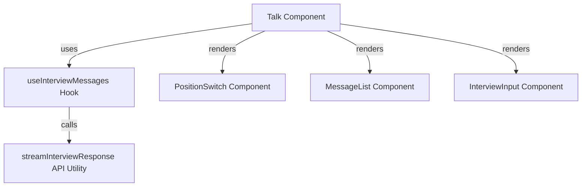
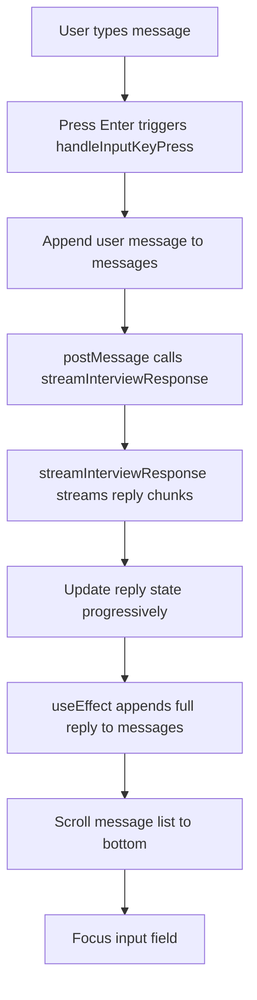
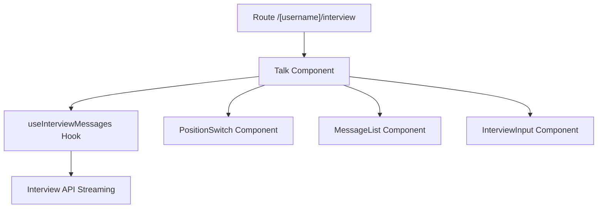

# Interview Subsystem

The Interview Subsystem implements an interactive interview experience between two roles: an interviewer and a candidate. It manages conversational state, user input, and streaming AI-generated responses to simulate a live interview. The subsystem includes UI components, hooks for state management, API utilities for streaming responses, and styled components for consistent presentation.

## Purpose and Scope

This page documents the internal mechanisms of the Interview Subsystem, covering the React components, hooks, styles, constants, and API utilities that enable the interview interaction. It explains how messages flow between the user interface and the backend streaming API, how role switching is handled, and how UI state synchronizes with asynchronous responses.

This page does not cover the backend API implementation beyond the client-side streaming interface. For broader UI layout and routing, see the Layout and Routing subsystem. For AI response generation details, see the AI Integration subsystem.

## Architecture Overview

The Interview Subsystem orchestrates user input, role state, message history, and streaming responses through a combination of React components and hooks. The main entry point is the `Talk` component, which uses the `useInterviewMessages` hook to manage message state and streaming. The `PositionSwitch` component toggles between interviewer and candidate roles, resetting messages accordingly. The `MessageList` renders the conversation history, and `InterviewInput` handles user text input. The streaming API utility `streamInterviewResponse` fetches and decodes server-sent chunks, updating the UI progressively.



**Diagram: Component and hook relationships within the Interview Subsystem**

Sources: `apps/registry/app/[username]/interview/page.js:10-64`, `apps/registry/app/[username]/interview/InterviewModule/hooks/useInterviewMessages.js:7-91`, `apps/registry/app/[username]/interview/InterviewModule/utils/interviewApi.js:1-44`

## Talk Component

**Purpose:** The `Talk` component is the root React client component that manages the interview session state, including the current role (interviewer or candidate), message history, and user input handlers. It composes the UI by rendering role toggling, message display, and input components.

**Primary file:** `apps/registry/app/[username]/interview/page.js:10-64`

| Field/Variable | Type | Purpose |
|----------------|------|---------|
| `params` | Object | React server component params containing `username` for the interviewee. `apps/registry/app/[username]/interview/page.js:10` |
| `username` | string | Extracted from `params` via React's `use` hook; identifies the interviewee. `apps/registry/app/[username]/interview/page.js:11` |
| `showAbout` | boolean | Local state controlling display of an about section (currently unused, always false). `apps/registry/app/[username]/interview/page.js:12` |
| `position` | string | Current role, either `INTERVIEWER` or `CANDIDATE`. `apps/registry/app/[username]/interview/page.js:13` |
| `setPosition` | function | Setter for `position`. `apps/registry/app/[username]/interview/page.js:13` |
| `messages` | array | Array of message objects representing the conversation history. `apps/registry/app/[username]/interview/page.js:15-25` |
| `setMessages` | function | Setter for `messages`. `apps/registry/app/[username]/interview/page.js:15-25` |
| `text` | string | Current input text from the user. `apps/registry/app/[username]/interview/page.js:15-25` |
| `reply` | string | Current streaming reply text from the AI. `apps/registry/app/[username]/interview/page.js:15-25` |
| `replying` | boolean|null | Flag indicating if a reply is being streamed; `null` means no reply in progress. `apps/registry/app/[username]/interview/page.js:15-25` |
| `bottomRef` | React ref | Ref to the bottom of the message list for auto-scrolling. `apps/registry/app/[username]/interview/page.js:15-25` |
| `textInput` | React ref | Ref to the input element for focus management. `apps/registry/app/[username]/interview/page.js:15-25` |
| `handleInputChange` | function | Handler for input text changes. `apps/registry/app/[username]/interview/page.js:15-25` |
| `handleInputKeyPress` | function | Handler for key press events in the input, triggers message posting on Enter. `apps/registry/app/[username]/interview/page.js:15-25` |
| `togglePosition` | function | Toggles the role between interviewer and candidate, resetting messages accordingly. `apps/registry/app/[username]/interview/page.js:27-37` |
| `initialMessage` | object | The initial message set when toggling position, differs by role. `apps/registry/app/[username]/interview/page.js:28-34` |

**Key behaviors:**
- Extracts `username` from route parameters using React's experimental `use` hook for server component data. `apps/registry/app/[username]/interview/page.js:11`
- Maintains role state (`position`) and toggles it with `togglePosition`, resetting messages to a role-appropriate greeting. `apps/registry/app/[username]/interview/page.js:27-37`
- Delegates message state and input handling to `useInterviewMessages` hook, passing `username` and `position`. `apps/registry/app/[username]/interview/page.js:15-25`
- Conditionally renders the `PositionSwitch`, `MessageList`, and `InterviewInput` components when `showAbout` is false. `apps/registry/app/[username]/interview/page.js:39-62`

**How It Works:**

1. On mount, `Talk` extracts the `username` from the route parameters.
2. It initializes the role state to `CANDIDATE` and sets `showAbout` to false.
3. It calls `useInterviewMessages` with `username` and `position` to obtain message state and handlers.
4. The `togglePosition` function switches the role and resets the message list to a single greeting message appropriate for the new role.
5. The UI renders:
   - `PositionSwitch` to toggle roles.
   - `MessageList` to display the conversation.
   - `InterviewInput` to accept user input.
6. User input triggers handlers from `useInterviewMessages` to update messages and stream AI replies.

Sources: `apps/registry/app/[username]/interview/page.js:10-64`

## useInterviewMessages Hook

**Purpose:** Encapsulates the interview message state management, including message history, input text, streaming AI replies, and related UI refs. It handles posting messages, streaming responses, and synchronizing message updates.

**Primary file:** `apps/registry/app/[username]/interview/InterviewModule/hooks/useInterviewMessages.js:7-91`

| Field/Variable | Type | Purpose |
|----------------|------|---------|
| `initialMessage` | object | Initial message based on role: interviewer greets candidate or vice versa. `apps/registry/app/[username]/interview/InterviewModule/hooks/useInterviewMessages.js:8-14` |
| `messages` | array | State array of message objects representing the conversation. `apps/registry/app/[username]/interview/InterviewModule/hooks/useInterviewMessages.js:16` |
| `setMessages` | function | Setter for `messages`. `apps/registry/app/[username]/interview/InterviewModule/hooks/useInterviewMessages.js:16` |
| `text` | string | Current user input text. `apps/registry/app/[username]/interview/InterviewModule/hooks/useInterviewMessages.js:17` |
| `setText` | function | Setter for `text`. `apps/registry/app/[username]/interview/InterviewModule/hooks/useInterviewMessages.js:17` |
| `reply` | string | Current AI reply text being streamed. `apps/registry/app/[username]/interview/InterviewModule/hooks/useInterviewMessages.js:18` |
| `setReply` | function | Setter for `reply`. `apps/registry/app/[username]/interview/InterviewModule/hooks/useInterviewMessages.js:18` |
| `replying` | boolean|null | Flag indicating if a reply is in progress; `null` means idle. `apps/registry/app/[username]/interview/InterviewModule/hooks/useInterviewMessages.js:19` |
| `setReplying` | function | Setter for `replying`. `apps/registry/app/[username]/interview/InterviewModule/hooks/useInterviewMessages.js:19` |
| `bottomRef` | React ref | Ref to the bottom of the message list for scrolling. `apps/registry/app/[username]/interview/InterviewModule/hooks/useInterviewMessages.js:20` |
| `textInput` | React ref | Ref to the input element for focus control. `apps/registry/app/[username]/interview/InterviewModule/hooks/useInterviewMessages.js:21` |
| `postMessage` | async function | Posts the current input text to the interview API, streams the response, and updates `reply`. `apps/registry/app/[username]/interview/InterviewModule/hooks/useInterviewMessages.js:23-40` |
| `prompt` | string | The prompt text sent to the API, taken from `text` at post time. `apps/registry/app/[username]/interview/InterviewModule/hooks/useInterviewMessages.js:25` |
| `handleInputChange` | function | Updates `text` state on input change events. `apps/registry/app/[username]/interview/InterviewModule/hooks/useInterviewMessages.js:42-44` |
| `handleInputKeyPress` | function | On Enter key, appends user message to `messages`, triggers `postMessage`, and clears input. `apps/registry/app/[username]/interview/InterviewModule/hooks/useInterviewMessages.js:46-59` |

**Key behaviors:**
- Initializes conversation with a single greeting message from the opposite role to the current position. `apps/registry/app/[username]/interview/InterviewModule/hooks/useInterviewMessages.js:8-14`
- Maintains message history, user input text, and streaming reply state with React state hooks. `apps/registry/app/[username]/interview/InterviewModule/hooks/useInterviewMessages.js:16-21`
- `postMessage` asynchronously calls `streamInterviewResponse` with the last 6 messages and the current prompt, updating `reply` progressively via a callback. `apps/registry/app/[username]/interview/InterviewModule/hooks/useInterviewMessages.js:23-40`
- On receiving a full reply, appends the AI's message to `messages` with the opposite role to the current position. `apps/registry/app/[username]/interview/InterviewModule/hooks/useInterviewMessages.js:54-59`
- Automatically scrolls the message list to the bottom when `messages` update. `apps/registry/app/[username]/interview/InterviewModule/hooks/useInterviewMessages.js:61-66`
- Focuses the input field after a reply is appended. `apps/registry/app/[username]/interview/InterviewModule/hooks/useInterviewMessages.js:54-59`

**How It Works:**

1. On initialization, sets `messages` to a single greeting from the opposite role.
2. `handleInputChange` updates `text` as the user types.
3. On Enter key press (`handleInputKeyPress`), appends the user's message to `messages`, clears `text`, and calls `postMessage`.
4. `postMessage` sets `replying` to true and calls `streamInterviewResponse` with the prompt and recent messages.
5. `streamInterviewResponse` streams chunks of the AI-generated reply, invoking a callback to update `reply` progressively.
6. When streaming completes, `replying` is set to false.
7. A `useEffect` hook detects when a reply is ready and appends it to `messages` with the opposite role.
8. Another `useEffect` scrolls the message list to the bottom on every message update.

Sources: `apps/registry/app/[username]/interview/InterviewModule/hooks/useInterviewMessages.js:7-91`

## streamInterviewResponse Function

**Purpose:** Performs a POST request to the `/api/interview` endpoint with the current interview context, then streams the response body incrementally, decoding and accumulating chunks, and invoking a callback with the progressively built reply.

**Primary file:** `apps/registry/app/[username]/interview/InterviewModule/utils/interviewApi.js:1-44`

| Variable | Type | Purpose |
|----------|------|---------|
| `response` | Response | Fetch API response object from the POST request. `apps/registry/app/[username]/interview/InterviewModule/utils/interviewApi.js:8-19` |
| `data` | ReadableStream | The response body stream from `response.body`. `apps/registry/app/[username]/interview/InterviewModule/utils/interviewApi.js:25` |
| `reader` | ReadableStreamDefaultReader | Reader to read chunks from the response stream. `apps/registry/app/[username]/interview/InterviewModule/utils/interviewApi.js:30` |
| `decoder` | TextDecoder | UTF-8 decoder to convert Uint8Array chunks to strings. `apps/registry/app/[username]/interview/InterviewModule/utils/interviewApi.js:31` |
| `done` | boolean | Flag indicating if the stream reading is complete. `apps/registry/app/[username]/interview/InterviewModule/utils/interviewApi.js:32` |
| `fullReply` | string | Accumulates the full decoded reply text. `apps/registry/app/[username]/interview/InterviewModule/utils/interviewApi.js:33` |
| `{ value, done: doneReading }` | object | Result of each `reader.read()` call, containing chunk data and done flag. `apps/registry/app/[username]/interview/InterviewModule/utils/interviewApi.js:36` |
| `chunkValue` | string | Decoded string chunk from the current read value. `apps/registry/app/[username]/interview/InterviewModule/utils/interviewApi.js:38` |

**Key behaviors:**
- Sends a POST request with JSON body containing `username`, `prompt`, `position`, and recent messages. `apps/registry/app/[username]/interview/InterviewModule/utils/interviewApi.js:8-19`
- Throws an error if the response status is not OK. `apps/registry/app/[username]/interview/InterviewModule/utils/interviewApi.js:20-22`
- Reads the response body as a stream, decoding chunks with `TextDecoder`. `apps/registry/app/[username]/interview/InterviewModule/utils/interviewApi.js:25-38`
- Accumulates the decoded chunks into `fullReply` and calls `onChunk` callback with the current accumulated reply after each chunk. `apps/registry/app/[username]/interview/InterviewModule/utils/interviewApi.js:33-40`
- Returns the full accumulated reply string after the stream completes. `apps/registry/app/[username]/interview/InterviewModule/utils/interviewApi.js:41-43`

**How It Works:**

1. Constructs a POST request to `/api/interview` with interview context in JSON.
2. Awaits the response and checks for HTTP success.
3. Obtains the response body stream and creates a reader.
4. Enters a loop reading chunks asynchronously until done.
5. Decodes each chunk and appends it to `fullReply`.
6. Invokes `onChunk` callback with the updated `fullReply` after each chunk.
7. Returns the full reply string when the stream ends.

Sources: `apps/registry/app/[username]/interview/InterviewModule/utils/interviewApi.js:1-44`

## PositionSwitch Component

**Purpose:** Provides a UI toggle between the two interview roles: interviewer and candidate. It visually indicates the current role and triggers a callback when toggled.

**Primary file:** `apps/registry/app/[username]/interview/InterviewModule/components/PositionSwitch.js:4-15`

| Prop | Type | Purpose |
|------|------|---------|
| `position` | string | Current role, either `INTERVIEWER` or `CANDIDATE`. `apps/registry/app/[username]/interview/InterviewModule/components/PositionSwitch.js:4-15` |
| `onToggle` | function | Callback invoked when the user clicks to toggle roles. `apps/registry/app/[username]/interview/InterviewModule/components/PositionSwitch.js:4-15` |

**Key behaviors:**
- Renders two clickable options labeled "Interviewer" and "Candidate".
- Highlights the active role with distinct background and text colors.
- Calls `onToggle` when either option is clicked, allowing the parent to switch roles.

Sources: `apps/registry/app/[username]/interview/InterviewModule/components/PositionSwitch.js:4-15`

## MessageList Component

**Purpose:** Renders the list of interview messages, including the conversation history and any currently streaming reply, with role-based labels.

**Primary file:** `apps/registry/app/[username]/interview/InterviewModule/components/MessageList.js:10-43`

| Prop | Type | Purpose |
|------|------|---------|
| `messages` | array | Array of message objects to render. `apps/registry/app/[username]/interview/InterviewModule/components/MessageList.js:10-43` |
| `replying` | boolean|null | Indicates if a reply is currently streaming. `apps/registry/app/[username]/interview/InterviewModule/components/MessageList.js:10-43` |
| `reply` | string | The current streaming reply text. `apps/registry/app/[username]/interview/InterviewModule/components/MessageList.js:10-43` |
| `position` | string | Current user role to determine label inversion for replies. `apps/registry/app/[username]/interview/InterviewModule/components/MessageList.js:10-43` |
| `bottomRef` | React ref | Ref to an empty div at the bottom for auto-scrolling. `apps/registry/app/[username]/interview/InterviewModule/components/MessageList.js:10-43` |

**Key behaviors:**
- Maps over `messages` to render each with the sender's role capitalized and message content.
- Displays the streaming reply as a message from the opposite role to the current position.
- Uses a `bottomRef` div to enable smooth scrolling to the latest message.

**How It Works:**

1. Iterates over `messages`, rendering each with a label showing the capitalized role (`Interviewer` or `Candidate`).
2. If `replying` is true, appends a message showing the current `reply` text from the opposite role.
3. The `bottomRef` div is placed at the end to allow scrolling into view on message updates.

Sources: `apps/registry/app/[username]/interview/InterviewModule/components/MessageList.js:10-43`

## InterviewInput Component

**Purpose:** Renders the input area for the user to type messages, including role-specific helper text and input field with controlled state and event handlers.

**Primary file:** `apps/registry/app/[username]/interview/InterviewModule/components/InterviewInput.js:4-43`

| Prop | Type | Purpose |
|------|------|---------|
| `username` | string | The interviewee's username, used in helper links. `apps/registry/app/[username]/interview/InterviewModule/components/InterviewInput.js:4-43` |
| `position` | string | Current role to determine helper text and input behavior. `apps/registry/app/[username]/interview/InterviewModule/components/InterviewInput.js:4-43` |
| `text` | string | Controlled input text value. `apps/registry/app/[username]/interview/InterviewModule/components/InterviewInput.js:4-43` |
| `replying` | boolean|null | Disables input and shows "Thinking..." placeholder when true. `apps/registry/app/[username]/interview/InterviewModule/components/InterviewInput.js:4-43` |
| `textInput` | React ref | Ref to the input element for focus management. `apps/registry/app/[username]/interview/InterviewModule/components/InterviewInput.js:4-43` |
| `onInputChange` | function | Handler for input change events. `apps/registry/app/[username]/interview/InterviewModule/components/InterviewInput.js:4-43` |
| `onKeyPress` | function | Handler for key press events, triggers message send on Enter. `apps/registry/app/[username]/interview/InterviewModule/components/InterviewInput.js:4-43` |

**Key behaviors:**
- Displays a helper message with a link to the interviewee's profile, customized by role.
- Disables input and shows "Thinking..." when a reply is streaming.
- Uses controlled input with `text` value and `onInputChange` handler.
- Supports submitting messages on Enter key via `onKeyPress`.

Sources: `apps/registry/app/[username]/interview/InterviewModule/components/InterviewInput.js:4-43`

## Constants: Roles

**Purpose:** Defines string constants representing the two interview roles to ensure consistent usage across the subsystem.

**Primary file:** `apps/registry/app/[username]/interview/InterviewModule/constants/roles.js:1-2`

| Constant | Value | Purpose |
|----------|-------|---------|
| `INTERVIEWER` | `'interviewer'` | Represents the interviewer role. `apps/registry/app/[username]/interview/InterviewModule/constants/roles.js:1` |
| `CANDIDATE` | `'candidate'` | Represents the candidate role. `apps/registry/app/[username]/interview/InterviewModule/constants/roles.js:2` |

Sources: `apps/registry/app/[username]/interview/InterviewModule/constants/roles.js:1-2`

## Utility: capitalizeFirstLetter

**Purpose:** Capitalizes the first letter of a string, used for display of role labels.

**Primary file:** `apps/registry/app/[username]/interview/InterviewModule/utils/textUtils.js:1-3`

**Behavior:**
- Takes a string and returns a new string with the first character uppercased and the rest unchanged.

Sources: `apps/registry/app/[username]/interview/InterviewModule/utils/textUtils.js:1-3`

## Styled Components

The subsystem uses styled-components for consistent styling of UI elements. These are re-exported from `StyledComponents.js` and include:

| Component | Purpose |
|-----------|---------|
| `Switch` | Container for the role toggle switch, fixed position centered horizontally. `apps/registry/app/[username]/interview/InterviewModule/styles/Switch.js:3-13` |
| `Option` | Individual toggle option styled with active and hover states. `apps/registry/app/[username]/interview/InterviewModule/styles/Switch.js:15-35` |
| `MessagesContainer` | Wrapper for the message list area with padding and max width. `apps/registry/app/[username]/interview/InterviewModule/styles/Messages.js:3-10` |
| `Messages` | Container for the messages with bottom padding for input space. `apps/registry/app/[username]/interview/InterviewModule/styles/Messages.js:12-15` |
| `Message` | Individual message container with padding and flex layout. `apps/registry/app/[username]/interview/InterviewModule/styles/Messages.js:17-22` |
| `Name` | Label for message sender name, right-aligned and bold. `apps/registry/app/[username]/interview/InterviewModule/styles/Messages.js:24-30` |
| `InputContainer` | Fixed container at bottom for input area with background color. `apps/registry/app/[username]/interview/InterviewModule/styles/InputContainer.js:3-14` |
| `Input` | Styled input field with padding, font size, and disabled state styling. `apps/registry/app/[username]/interview/InterviewModule/styles/Input.js:3-20` |
| `Helper` | Small helper text with link styling for the input area. `apps/registry/app/[username]/interview/InterviewModule/styles/Helper.js:3-17` |

Sources:  
`apps/registry/app/[username]/interview/InterviewModule/styles/Switch.js:3-35`  
`apps/registry/app/[username]/interview/InterviewModule/styles/Messages.js:3-30`  
`apps/registry/app/[username]/interview/InterviewModule/styles/InputContainer.js:3-14`  
`apps/registry/app/[username]/interview/InterviewModule/styles/Input.js:3-20`  
`apps/registry/app/[username]/interview/InterviewModule/styles/Helper.js:3-17`

## How It Works: End-to-End Interview Flow



**Diagram: Data flow from user input through streaming response to UI update**

Sources:  
`apps/registry/app/[username]/interview/page.js:10-64`  
`apps/registry/app/[username]/interview/InterviewModule/hooks/useInterviewMessages.js:7-91`  
`apps/registry/app/[username]/interview/InterviewModule/utils/interviewApi.js:1-44`

1. The user types a message in the `InterviewInput` component.
2. On pressing Enter, `handleInputKeyPress` appends the message to `messages` and calls `postMessage`.
3. `postMessage` invokes `streamInterviewResponse` with the prompt and recent messages.
4. `streamInterviewResponse` fetches the API and reads the response stream chunk-by-chunk.
5. Each chunk is decoded and appended to `reply` state via a callback.
6. When streaming completes, a `useEffect` hook appends the full reply as a new message from the opposite role.
7. The message list scrolls to show the latest messages.
8. The input field regains focus for further typing.

## Key Relationships

The Interview Subsystem depends on:

- The `/api/interview` backend endpoint for AI-generated interview responses.
- React's experimental `use` hook for server component parameter extraction.
- The `uuid` library for generating unique message IDs.
- Styled-components for UI styling.
- Constants defining roles (`INTERVIEWER`, `CANDIDATE`) for consistent role management.

It is consumed primarily by the route handler for `/[username]/interview`, which renders the `Talk` component as the main interactive interview interface.



**Relationships between routing, components, hooks, and API**

Sources:  
`apps/registry/app/[username]/interview/page.js:10-64`  
`apps/registry/app/[username]/interview/InterviewModule/hooks/useInterviewMessages.js:7-91`  
`apps/registry/app/[username]/interview/InterviewModule/utils/interviewApi.js:1-44`

## `{ username }` (variable) in apps/registry/app/[username]/interview/page.js

**Purpose**: Extracts the dynamic route parameter `username` from the Next.js route parameters to identify the current interview session's user context.

**Details**:  
- Obtained via destructuring from the `params` object passed as a prop to the `Talk` component.  
- The `use` hook from React is used to unwrap the `params` object, enabling synchronous access to the `username` parameter.  
- This variable serves as a key identifier for fetching and posting interview messages scoped to the specific user.  
- It is passed down to hooks and components that require user context, such as `useInterviewMessages` and `InterviewInput`.

**Example**:  
```js
const { username } = use(params);
```

**Context**: The `username` parameter is critical for multi-user support, ensuring that interview conversations are isolated per user. It is a string representing the username from the URL path segment `[username]`.  
Sources: `apps/registry/app/[username]/interview/page.js:11`


## `[showAbout]` (variable) in apps/registry/app/[username]/interview/page.js

**Purpose**: Controls the visibility of the "About" section or overlay in the interview UI.

**Details**:  
- Initialized as a React state variable with `useState(false)`, indicating the "About" section is hidden by default.  
- The variable is a boolean flag; its setter is not destructured or used, implying the "About" section is currently static and not toggled dynamically.  
- The `Talk` component conditionally renders the main interview interface only when `showAbout` is false.  
- This flag acts as a simple gate to switch between the interview UI and an informational or help screen.

**Example**:  
```js
const [showAbout] = useState(false);
...
{!showAbout && <InterviewUIComponents />}
```

**Context**: Although currently fixed to false, this state could be extended to enable toggling an informational overlay or help panel without unmounting the entire interview interface.  
Sources: `apps/registry/app/[username]/interview/page.js:12`


## `[position, setPosition]` (variable) in apps/registry/app/[username]/interview/page.js

**Purpose**: Tracks and updates the current role position in the interview, either `INTERVIEWER` or `CANDIDATE`.

**Details**:  
- Initialized with `useState(CANDIDATE)`, setting the default role to candidate.  
- `position` is a string constant representing the current role of the user in the interview session.  
- `setPosition` is the state setter function used to switch roles.  
- The `togglePosition` function uses `setPosition` to flip between `INTERVIEWER` and `CANDIDATE`, resetting the message history accordingly.  
- The role affects message content, UI rendering, and the behavior of the message posting logic.

**Example**:  
```js
const [position, setPosition] = useState(CANDIDATE);
...
setPosition(position === INTERVIEWER ? CANDIDATE : INTERVIEWER);
```

**Context**: The position state is central to the interview flow, determining the persona the user adopts and the initial greeting message. Switching position resets the conversation to a role-appropriate initial message.  
Sources: `apps/registry/app/[username]/interview/page.js:13`, `apps/registry/app/[username]/interview/page.js:27-37`


## `{
    messages,
    setMessages,
    text,
    reply,
    replying,
    bottomRef,
    textInput,
    handleInputChange,
    handleInputKeyPress,
  }` (variable) in apps/registry/app/[username]/interview/page.js

**Purpose**: Aggregates the interview messaging state and handlers from the `useInterviewMessages` hook, encapsulating message data, input state, and UI interaction logic.

**Details**:  
- `messages`: Array of message objects representing the conversation history. Each message includes `id`, `content`, and `position`.  
- `setMessages`: React state setter to update the `messages` array.  
- `text`: Current input text in the message input field.  
- `reply`: The streamed reply content from the interview API, updated asynchronously.  
- `replying`: Boolean or null indicating whether a reply is currently being streamed (`true`), idle (`false`), or uninitialized (`null`).  
- `bottomRef`: React ref pointing to the bottom of the message list, used for automatic scrolling.  
- `textInput`: React ref to the text input DOM element, used to manage focus.  
- `handleInputChange`: Event handler updating `text` state on input field changes.  
- `handleInputKeyPress`: Event handler detecting Enter key presses to submit messages.

**Example**:  
```js
const {
  messages,
  setMessages,
  text,
  reply,
  replying,
  bottomRef,
  textInput,
  handleInputChange,
  handleInputKeyPress,
} = useInterviewMessages(username, position);
```

**Context**: This destructured object represents the core reactive state and event handlers for the interview conversation UI. It abstracts away the complexity of message streaming, input management, and UI synchronization.  
Sources: `apps/registry/app/[username]/interview/page.js:15-25`


## `Home` (function) in apps/registry/app/[username]/interview/layout.js

**Purpose**: Provides a minimal layout wrapper for the interview pages, rendering its children without additional markup or logic.

**Details**:  
- A React functional component accepting `children` as props.  
- Returns a fragment containing the children, effectively a passthrough component.  
- Marked with `'use client'` directive, indicating client-side rendering.  
- Serves as a layout boundary in Next.js routing, enabling future extension or styling without changing page components.

**Example**:  
```js
export default function Home({ children }) {
  return <>{children}</>;
}
```

**Context**: This layout component currently does not modify or augment its children but establishes a structural placeholder for the interview route subtree.  
Sources: `apps/registry/app/[username]/interview/layout.js:3-5`


## `[messages, setMessages]` (variable) in apps/registry/app/[username]/interview/InterviewModule/hooks/useInterviewMessages.js

**Purpose**: Holds and updates the array of interview messages exchanged between the user and the system.

**Details**:  
- Initialized with a single `initialMessage` depending on the current `position`.  
- `messages` is an array of message objects, each with at least `id`, `content`, and `position` fields.  
- `setMessages` is the React state setter function to replace or append to the message list.  
- The message list is capped to the last 6 messages when passed to the streaming API, limiting context size.  
- Messages are appended both on user input submission and when streamed replies complete.

**Example**:  
```js
const [messages, setMessages] = useState([initialMessage]);
```

**Context**: This state is the authoritative source of the conversation history displayed in the UI and used as context for generating interview responses.  
Sources: `apps/registry/app/[username]/interview/InterviewModule/hooks/useInterviewMessages.js:16-16`


## `[text, setText]` (variable) in apps/registry/app/[username]/interview/InterviewModule/hooks/useInterviewMessages.js

**Purpose**: Tracks and updates the current text input value in the interview message input field.

**Details**:  
- `text` is a string representing the user's current input before submission.  
- `setText` updates the input value, typically in response to user typing or after message submission to clear the input.  
- The input field is controlled, with its value bound to `text`.  
- Reset to an empty string after the user submits a message (on Enter key press).

**Example**:  
```js
const [text, setText] = useState('');
...
setText('');
```

**Context**: This state enables controlled input behavior, ensuring the UI reflects the current user input and resets appropriately after sending messages.  
Sources: `apps/registry/app/[username]/interview/InterviewModule/hooks/useInterviewMessages.js:17-17`


## `[reply, setReply]` (variable) in apps/registry/app/[username]/interview/InterviewModule/hooks/useInterviewMessages.js

**Purpose**: Holds the current streamed reply content from the interview API and provides a setter to update it incrementally.

**Details**:  
- `reply` is a string accumulating the partial or complete response streamed from the backend.  
- `setReply` updates the reply string as new chunks arrive during streaming.  
- When a reply is completed, it is appended to the `messages` array as a new message from the opposite position.  
- Cleared to an empty string after appending to messages to prepare for the next reply.

**Example**:  
```js
const [reply, setReply] = useState('');
...
setReply(streamReply);
```

**Context**: This state manages asynchronous streaming of interview responses, allowing the UI to render partial replies in real time.  
Sources: `apps/registry/app/[username]/interview/InterviewModule/hooks/useInterviewMessages.js:18-18`


## `[replying, setReplying]` (variable) in apps/registry/app/[username]/interview/InterviewModule/hooks/useInterviewMessages.js

**Purpose**: Indicates the current status of reply streaming, tracking whether the system is awaiting or receiving a response.

**Details**:  
- `replying` is a boolean or null:  
  - `true` means a reply is currently being streamed.  
  - `false` means no reply is in progress.  
  - `null` indicates initial uninitialized state before any interaction.  
- `setReplying` updates this status flag.  
- Controls UI states such as disabling input or showing loading indicators during reply streaming.  
- Used as a dependency in effects to trigger message appending when streaming completes.

**Example**:  
```js
const [replying, setReplying] = useState(null);
...
setReplying(true);
...
setReplying(false);
```

**Context**: This state synchronizes the asynchronous reply streaming lifecycle with the UI and message state updates.  
Sources: `apps/registry/app/[username]/interview/InterviewModule/hooks/useInterviewMessages.js:19-19`