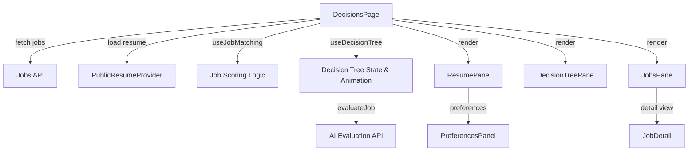
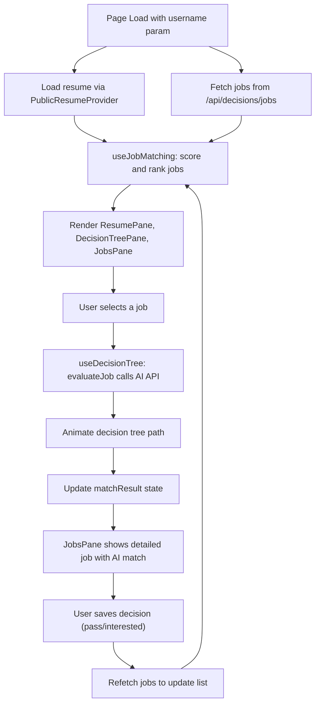
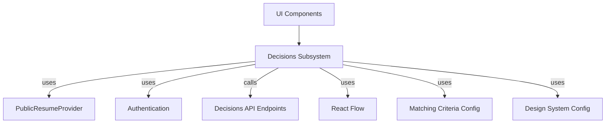

# Decisions Subsystem

The Decisions Subsystem implements AI-powered job matching, decision tree visualization, and user interface components to assist candidates in evaluating job opportunities. It integrates candidate resumes, job data, and user preferences to score and rank jobs, visualize decision criteria, and capture user decisions. This subsystem orchestrates data fetching, scoring logic, decision tree state management, and UI rendering to provide an interactive decision support experience.

For job scoring and criteria, see the Matching Criteria configuration. For decision tree visualization and layout, see the Decision Tree configuration. For UI components, see the ResumePane, DecisionTreePane, JobsPane, JobDetail, and PreferencesPanel components.

## Purpose and Scope

This page documents the internal mechanisms of the Decisions Subsystem, including job fetching, scoring, decision tree state and animation, and UI integration. It covers the core hooks, configuration, and components that implement the decision-making features. It does not cover authentication, resume editing, or external API implementations beyond the decision evaluation endpoints.

For job scoring rules and weights, see the Matching Criteria page. For decision tree layout and rendering, see the Decision Tree Configuration page. For UI components and interaction, see the UI Components page.

## Architecture Overview

The subsystem consists of three main layers: data fetching and state management, decision logic and scoring, and UI rendering. The `DecisionsPage` component orchestrates data loading, hooks for job matching and decision tree state, and renders the three-pane layout. The `useJobMatching` hook scores and ranks jobs based on candidate resume and preferences. The `useDecisionTree` hook manages the decision tree nodes, edges, and AI evaluation animation. The UI components render the resume, decision tree, and ranked jobs with detailed views and preference controls.

**Diagram: High-level component and data flow in the Decisions Subsystem**

Sources: `apps/registry/app/[username]/decisions/page.js:23-239`, `apps/registry/app/[username]/decisions/hooks/useJobMatching.js:12-47`, `apps/registry/app/[username]/decisions/hooks/useDecisionTree.js:28-531`

## DecisionsPage Component

**Purpose**: The main page component that coordinates data fetching, state management, job ranking, decision tree evaluation, and renders the three-pane layout for resume, decision tree, and job matches.

**Primary file**: `apps/registry/app/[username]/decisions/page.js:23-239`

| Field / Variable | Type | Purpose |
|------------------|------|---------|
| `username` | `string` | Extracted from route params; identifies the user whose decisions page is shown. `apps/registry/app/[username]/decisions/page.js:24` |
| `user` | `object|null` | Authenticated user object from `useAuth` hook; may be null if unauthenticated. `apps/registry/app/[username]/decisions/page.js:25` |
| `{ resume, loading: resumeLoading, error: resumeError }` | `{object, boolean, string|null}` | Candidate resume data and loading/error states from `usePublicResume` provider. `apps/registry/app/[username]/decisions/page.js:26-30` |
| `[jobs, setJobs]` | `[Array, function]` | State for the list of jobs fetched from the backend. `apps/registry/app/[username]/decisions/page.js:31` |
| `[selectedJob, setSelectedJob]` | `[object|null, function]` | Currently selected job for detailed view or evaluation. `apps/registry/app/[username]/decisions/page.js:32` |
| `[jobsLoading, setJobsLoading]` | `[boolean, function]` | Loading state for job fetching. `apps/registry/app/[username]/decisions/page.js:33` |
| `[jobsError, setJobsError]` | `[string|null, function]` | Error message if job fetching fails. `apps/registry/app/[username]/decisions/page.js:34` |
| `[preferences, setPreferences]` | `[object, function]` | User preferences for evaluation criteria, keyed by criterion id. `apps/registry/app/[username]/decisions/page.js:35` |
| `fetchJobs` | `async function` | Fetches jobs from `/api/decisions/jobs` with username and userId, limits to 10 jobs, handles errors and updates state. `apps/registry/app/[username]/decisions/page.js:39-71` |
| `rankedJobs` | `Array` | Jobs ranked and scored by `useJobMatching` hook based on resume and preferences. `apps/registry/app/[username]/decisions/page.js:79` |
| `{ nodes, edges, onNodesChange, onEdgesChange, evaluateJob, matchResult }` | `object` | Decision tree state and handlers from `useDecisionTree` hook. `apps/registry/app/[username]/decisions/page.js:82-89` |
| `handleSelectJob` | `function` | Callback to select a job, update state, and trigger evaluation of the selected job. `apps/registry/app/[username]/decisions/page.js:92-100` |
| `refetchJobs` | `async function` | Refetches jobs from backend after a decision is made, resets selection and updates state. `apps/registry/app/[username]/decisions/page.js:103-128` |
| `handlePreferencesChange` | `function` | Updates preferences state and re-evaluates the selected job with new preferences. `apps/registry/app/[username]/decisions/page.js:131-144` |

### Behavior and Flow

- On mount and whenever `username` or `user` changes, `fetchJobs` is invoked to load jobs from the backend API, filtering out jobs already decided by the user.
- The `useJobMatching` hook ranks jobs by scoring them against the candidate's resume and current preferences.
- The `useDecisionTree` hook manages the decision tree nodes, edges, and evaluation animation state.
- Selecting a job triggers `handleSelectJob`, which sets the selected job and calls `evaluateJob` to run AI evaluation and animate the decision path.
- After a decision is saved (pass/interested), `refetchJobs` reloads jobs to reflect updated state and clears the selection.
- Preference changes update the preferences state and trigger re-evaluation of the current job if any.

### UI Layout

- Left pane (25% width): `ResumePane` displays candidate resume and preferences panel.
- Center pane (50% width): `DecisionTreePane` renders the interactive decision tree visualization.
- Right pane (25% width): `JobsPane` shows ranked jobs or detailed job view with AI match results.

Sources: `apps/registry/app/[username]/decisions/page.js:23-239`

## useJobMatching Hook

**Purpose**: Scores and ranks jobs against a candidate's resume and preferences, providing both a ranked list and on-demand scoring function.

**Primary file**: `apps/registry/app/[username]/decisions/hooks/useJobMatching.js:12-47`

| Field / Variable | Type | Purpose |
|------------------|------|---------|
| `rankedJobs` | `Array` | Memoized array of jobs scored and sorted descending by match score. `apps/registry/app/[username]/decisions/hooks/useJobMatching.js:14-30` |
| `scoreJob` | `function` | Memoized function to score a single job on demand, returning score details and outcome. `apps/registry/app/[username]/decisions/hooks/useJobMatching.js:33-41` |

### Behavior

- `rankedJobs` is recalculated whenever `resume`, `jobs`, or `preferences` change.
- Each job is scored using `scoreCandidateForJob` with the candidate resume and preferences.
- The outcome is determined by `determineOutcome` based on the score breakdown.
- Jobs are sorted by descending score.
- `scoreJob` allows scoring a single job independently, useful for on-demand evaluation.

Sources: `apps/registry/app/[username]/decisions/hooks/useJobMatching.js:12-47`

## useDecisionTree Hook

**Purpose**: Manages the state, layout, and AI evaluation animation of the decision tree visualization, reflecting job matching criteria and user preferences.

**Primary file**: `apps/registry/app/[username]/decisions/hooks/useDecisionTree.js:28-531`

| Field / Variable | Type | Purpose |
|------------------|------|---------|
| `nodes` | `Array` | Current decision tree nodes with position, style, and visibility. `apps/registry/app/[username]/decisions/hooks/useDecisionTree.js:29` |
| `edges` | `Array` | Current edges connecting nodes, including bridge edges that skip hidden nodes. `apps/registry/app/[username]/decisions/hooks/useDecisionTree.js:30` |
| `onNodesChange` | `function` | Handler for node state changes (e.g., position updates). `apps/registry/app/[username]/decisions/hooks/useDecisionTree.js:29` |
| `onEdgesChange` | `function` | Handler for edge state changes. `apps/registry/app/[username]/decisions/hooks/useDecisionTree.js:30` |
| `matchResult` | `object|null` | Current AI evaluation result including outcome, score, and reasoning. `apps/registry/app/[username]/decisions/hooks/useDecisionTree.js:31` |
| `resetHighlights` | `function` | Resets all node and edge styles to default, clearing animations and highlights. `apps/registry/app/[username]/decisions/hooks/useDecisionTree.js:88-110` |
| `updateNodeColor` | `function` | Updates a node's color style based on pass/fail status. `apps/registry/app/[username]/decisions/hooks/useDecisionTree.js:113-127` |
| `highlightEdge` | `function` | Highlights and animates a specific edge with a given color. `apps/registry/app/[username]/decisions/hooks/useDecisionTree.js:130-149` |
| `evaluateJob` | `async function` | Performs AI evaluation of a candidate-job pair, fetches decisions from backend, and triggers animation of the decision path. `apps/registry/app/[username]/decisions/hooks/useDecisionTree.js:152-215` |
| `animateAIPath` | `function` | Animates the decision tree path based on AI evaluation results, updating node colors, edge highlights, and final match outcome. `apps/registry/app/[username]/decisions/hooks/useDecisionTree.js:218-520` |

### Behavior

- On preferences change, nodes are marked hidden or visible based on mapped preference keys, and layout is recalculated to exclude hidden nodes.
- Bridge edges are created to connect visible nodes, skipping hidden nodes to maintain graph continuity.
- `resetHighlights` clears all animations and resets node/edge styles.
- `evaluateJob` sends the candidate resume, job, and preferences to the AI evaluation API, handles loading and error states, and calls `animateAIPath` with the results.
- `animateAIPath` processes each criterion's evaluation result, colors nodes green/orange/red based on pass/partial/fail, highlights edges along the decision path, and computes a final score and outcome bucket.
- The animation logic handles complex branching, including partial skill matches, location/timezone fallback, and availability/salary checks.
- The final match result is stored in `matchResult` for UI consumption.

### Internal Helpers and Constants

- `nodeToPreferenceMap` maps node IDs to preference keys to control visibility.
- The animation logic uses constants for node IDs and color codes from the design system.
- The hook uses React Flow's `useNodesState` and `useEdgesState` for graph state management.

Sources: `apps/registry/app/[username]/decisions/hooks/useDecisionTree.js:28-531`

## Matching Criteria Configuration

**Purpose**: Defines the scoring weights, criteria check functions, and overall scoring logic used to evaluate candidate-job matches.

**Primary file**: `apps/registry/app/[username]/decisions/config/matchingCriteria.js:7-396`

| Field / Function | Type | Purpose |
|------------------|------|---------|
| `WEIGHTS` | `object` | Numeric weights summing to 100 for each criterion, controlling scoring impact. `apps/registry/app/[username]/decisions/config/matchingCriteria.js:7-16` |
| `checks` | `object` | Collection of functions implementing individual criteria checks, returning pass/fail, reason, and score. `apps/registry/app/[username]/decisions/config/matchingCriteria.js:21-269` |
| `calculateYearsOfExperience` | `function` | Computes total years of experience from candidate's work history. `apps/registry/app/[username]/decisions/config/matchingCriteria.js:274-291` |
| `scoreCandidateForJob` | `function` | Aggregates criteria checks and computes total score and breakdown, respecting user preferences. `apps/registry/app/[username]/decisions/config/matchingCriteria.js:297-371` |
| `determineOutcome` | `function` | Maps score and breakdown to a match outcome category: strongMatch, possibleMatch, or noMatch. `apps/registry/app/[username]/decisions/config/matchingCriteria.js:376-396` |

### Criteria Checks

- `coreSkills`: Verifies candidate has all required skills; hard gate with full pass/fail. Scores 40 points if passed.
- `experience`: Checks if candidate's years of experience meet minimum; heavy penalty if failed. Scores 20 points.
- `location`: Matches candidate and job locations, allowing remote jobs to pass automatically. Scores 8 points.
- `timezone`: Checks timezone compatibility if location fails and timezone preference enabled. Scores 6 points.
- `workRights`: Verifies candidate's work authorization; hard gate always enabled. Scores 8 points.
- `availability`: Checks candidate availability within required timeframe; always enabled. Scores 8 points.
- `salary`: Verifies candidate salary expectations align with job range; scores 5 points.
- `bonusSkills`: Checks overlap of candidate skills with bonus skills; scores 5 points.

### Scoring Logic

- Criteria respect user preferences for enabling/disabling.
- Hard gates (`coreSkills`, `workRights`) cause immediate rejection if failed.
- Experience failure results in likely rejection but partial score retained.
- Location and timezone checks are conditional and additive.
- Availability and salary failures downgrade to possible match.
- Bonus skills add to score but do not block matching.
- Final score is clamped between 0 and 100.
- Outcome determination uses score thresholds and hard gate passes.

Sources: `apps/registry/app/[username]/decisions/config/matchingCriteria.js:7-396`

## Decision Tree Configuration

**Purpose**: Defines the nodes, edges, layout, and styling for the decision tree visualization used in the decision-making UI.

**Primary file**: `apps/registry/app/[username]/decisions/config/decisionTree.js:11-458`

| Field / Function | Type | Purpose |
|------------------|------|---------|
| `NODE_IDS` | `object` | Constants for node IDs representing decision criteria and outcomes. `apps/registry/app/[username]/decisions/config/decisionTree.js:11-24` |
| `dagreGraph` | `object` | Dagre graph instance configured for top-to-bottom layout with spacing parameters. `apps/registry/app/[username]/decisions/config/decisionTree.js:27` |
| `nodeStyle` | `function` | Generates style objects for nodes based on kind (default, title, success, warn, danger). `apps/registry/app/[username]/decisions/config/decisionTree.js:39-93` |
| `baseNodes` | `Array` | Array of nodes with IDs, labels, styles, and types (default or output) without positions. `apps/registry/app/[username]/decisions/config/decisionTree.js:96-163` |
| `createEdge` | `function` | Helper to create edge objects with styling, labels, and arrow markers. `apps/registry/app/[username]/decisions/config/decisionTree.js:166-197` |
| `baseEdges` | `Array` | Array of edges connecting nodes with labels representing decision outcomes. `apps/registry/app/[username]/decisions/config/decisionTree.js:200-246` |
| `getLayoutedNodes` | `function` | Applies dagre layout to base nodes and edges, returning nodes with calculated positions. `apps/registry/app/[username]/decisions/config/decisionTree.js:249-279` |
| `initialNodes` | `Array` | Nodes with positions calculated by `getLayoutedNodes`. `apps/registry/app/[username]/decisions/config/decisionTree.js:282-282` |
| `initialEdges` | `Array` | Base edges as defined. `apps/registry/app/[username]/decisions/config/decisionTree.js:283-283` |
| `recalculateLayout` | `function` | Recalculates layout for visible nodes only, pins outcome nodes to bottom rank. `apps/registry/app/[username]/decisions/config/decisionTree.js:291-366` |
| `createBridgeEdges` | `function` | Creates edges that skip hidden nodes to maintain connectivity in the graph. `apps/registry/app/[username]/decisions/config/decisionTree.js:375-441` |
| `reactFlowOptions` | `object` | Configuration options for React Flow component controlling zoom, interaction, and edge defaults. `apps/registry/app/[username]/decisions/config/decisionTree.js:444-458` |

### Behavior

- Nodes represent decision criteria (skills, experience, location, etc.) and outcomes (strong match, possible match, reject).
- Edges represent decision paths with labels indicating yes/no or conditional branches.
- Dagre layout arranges nodes top-to-bottom with spacing and pins outcome nodes at the bottom.
- When preferences hide nodes, layout recalculates only visible nodes.
- Bridge edges connect visible nodes by skipping hidden nodes to preserve graph flow.
- Node styles reflect decision states (default, success, warning, danger).
- React Flow options disable node dragging and selection for a controlled visualization.

Sources: `apps/registry/app/[username]/decisions/config/decisionTree.js:11-458`

## UI Components

### ResumePane

**Purpose**: Displays the candidate's resume details and provides access to the preferences panel.

**Primary file**: `apps/registry/app/[username]/decisions/components/ResumePane.jsx:12-295`

- Shows candidate basics (name, label, summary, contact info).
- Calculates and displays years of experience from work history.
- Lists skills, work experience (up to 3 entries), education, languages, certifications, and links.
- Includes the `PreferencesPanel` component for user to adjust evaluation criteria.
- Handles empty or missing resume gracefully with a placeholder message.

Sources: `apps/registry/app/[username]/decisions/components/ResumePane.jsx:12-295`

### DecisionTreePane

**Purpose**: Renders the decision tree visualization using React Flow with nodes and edges from state.

**Primary file**: `apps/registry/app/[username]/decisions/components/DecisionTreePane.jsx:12-64`

- Receives nodes, edges, and change handlers as props.
- Configured with custom background, controls, and minimap.
- Uses React Flow options to disable node dragging and selection.
- Styles nodes based on their computed styles from the decision tree hook.

Sources: `apps/registry/app/[username]/decisions/components/DecisionTreePane.jsx:12-64`

### JobsPane

**Purpose**: Displays the ranked list of job matches or detailed view of a selected job.

**Primary file**: `apps/registry/app/[username]/decisions/components/JobsPane.jsx:22-194`

- Shows a list of jobs with title, company, location, salary, skills, and match score badge.
- Supports toggling between list and detail view.
- Highlights the selected job and shows loading animation during evaluation.
- Handles empty job list and loading states with appropriate UI.
- Clicking a job switches to detail view rendered by `JobDetail`.

Sources: `apps/registry/app/[username]/decisions/components/JobsPane.jsx:22-194`

### JobDetail

**Purpose**: Provides an expanded view of a selected job with AI match summary, job details, and decision actions.

**Primary file**: `apps/registry/app/[username]/decisions/components/JobDetail.jsx:22-481`

- Displays job title, company, description, required and bonus skills, and job requirements.
- Shows AI match analysis with animated loading state or detailed criteria breakdown.
- Allows user to mark job as "Pass" or "Interested", saving decision via API.
- Includes a back button to return to the job list.
- Handles saving state and error feedback for decision actions.

Sources: `apps/registry/app/[username]/decisions/components/JobDetail.jsx:22-481`

### PreferencesPanel

**Purpose**: Allows the user to customize evaluation criteria preferences, enabling/disabling criteria and adjusting values.

**Primary file**: `apps/registry/app/[username]/decisions/components/PreferencesPanel.jsx:56-354`

- Loads preferences from backend on mount; falls back to defaults on error or unauthenticated.
- Displays toggles and controls for criteria such as salary range, location, remote work, skills, experience, and timezone.
- Saves preference changes asynchronously to backend and notifies parent via callback.
- Supports range sliders for numeric criteria and boolean toggles for others.
- Shows loading and unauthenticated states with appropriate messages.

Sources: `apps/registry/app/[username]/decisions/components/PreferencesPanel.jsx:56-354`

## How It Works

The Decisions Subsystem operates as follows:

- On page load, the candidate's resume is loaded via `PublicResumeProvider` and jobs are fetched from the backend API filtered by username and user ID.
- The `useJobMatching` hook scores and ranks the fetched jobs against the resume and user preferences.
- The UI renders three panes: resume with preferences, decision tree visualization, and ranked jobs list.
- When the user selects a job, `handleSelectJob` triggers `evaluateJob` in the `useDecisionTree` hook.
- `evaluateJob` sends the candidate, job, and preferences to the AI evaluation API endpoint.
- The AI response contains detailed decisions per criterion, which `animateAIPath` uses to update node colors and animate edges along the decision path.
- The final match outcome and score are stored in `matchResult` and displayed in the job detail pane.
- The user can save a decision (pass or interested), which triggers a backend update and refetch of jobs to refresh the list and clear selection.

Sources: `apps/registry/app/[username]/decisions/page.js:23-239`, `apps/registry/app/[username]/decisions/hooks/useDecisionTree.js:152-520`

## Key Relationships

The Decisions Subsystem depends on:

- `PublicResumeProvider` for loading candidate resume data.
- Authentication state from `useAuth` to identify the current user.
- Backend API endpoints `/api/decisions/jobs`, `/api/decisions/evaluate`, and `/api/decisions/decision` for job data, AI evaluation, and decision saving.
- React Flow library for rendering and managing the decision tree graph.
- Matching Criteria configuration for scoring logic and criteria definitions.
- Design System configuration for consistent styling and colors.

It provides:

- An interactive UI for candidates to explore job matches and understand decision criteria.
- Scored and ranked job lists based on AI-powered evaluation.
- Decision tree visualization that animates the evaluation path and highlights pass/fail states.
- User preference controls to customize evaluation criteria.

**Relationships to adjacent subsystems**

Sources: `apps/registry/app/[username]/decisions/page.js:23-239`, `apps/registry/app/[username]/decisions/hooks/useDecisionTree.js:28-531`