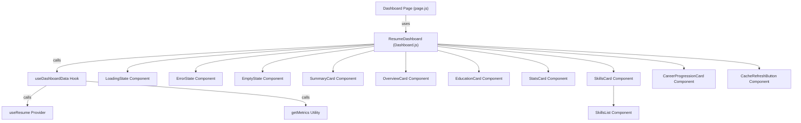
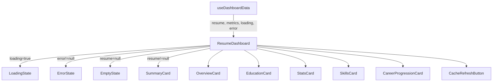
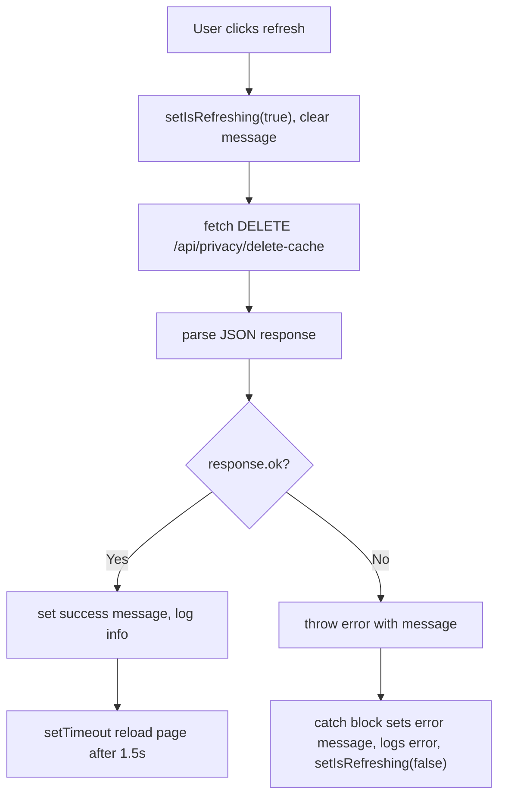
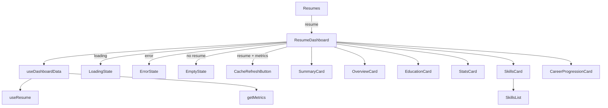
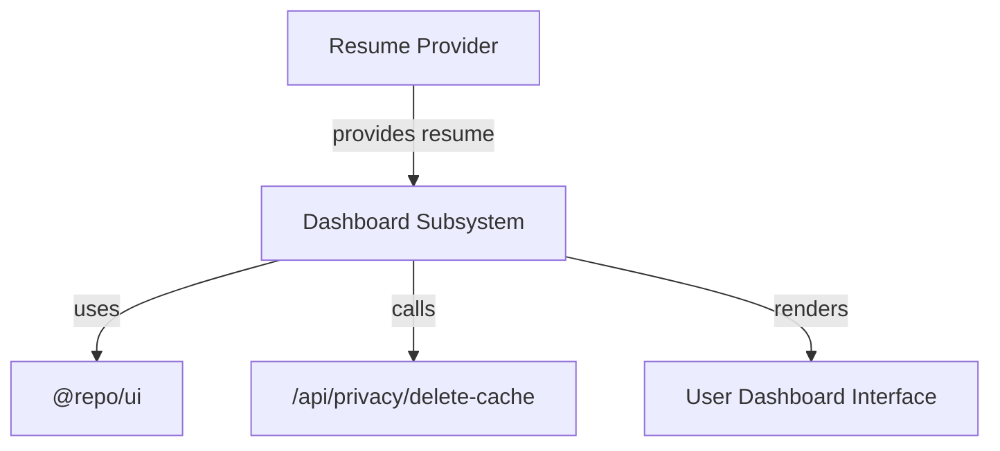

# Dashboard Subsystem

The Dashboard Subsystem manages the rendering and data orchestration of the user metrics and statistics dashboard within the user registry application. It integrates resume data fetching, metric computation, and UI presentation through a collection of React components, hooks, and utilities. This subsystem is responsible for displaying a comprehensive overview of a user's professional profile, including summaries, skills, education, career progression, and various aggregated statistics.

## Purpose and Scope

This page documents the internal mechanisms of the Dashboard Subsystem, covering the dashboard page component, its layout, data hooks, and all UI components that compose the dashboard interface. It explains how resume data is fetched, processed into metrics, and rendered into a rich, interactive dashboard experience. It does not cover the underlying resume data provider implementation or the API endpoints for cache management beyond their invocation here.

For resume data provisioning, see the Resume Provider subsystem. For UI primitives and shared components, see the UI Components library documentation.

## Architecture Overview

The Dashboard Subsystem is composed of a client-side React page (`page.js`) that fetches resume data via a context provider, then delegates rendering to the `ResumeDashboard` component. `ResumeDashboard` uses the `useDashboardData` hook to obtain resume and computed metrics, and conditionally renders loading, error, or empty states. When data is available, it renders a collection of cards representing different aspects of the user's profile and metrics. A `CacheRefreshButton` allows clearing cached resume data to force fresh reloads.



**Diagram: Component and data flow relationships within the Dashboard Subsystem**

Sources: `apps/registry/app/[username]/dashboard/page.js:8-28`, `apps/registry/app/[username]/dashboard/Dashboard.js:15-51`, `apps/registry/app/[username]/dashboard/DashboardModule/hooks/useDashboardData.js:8-19`, `apps/registry/app/[username]/dashboard/DashboardModule/components/*.js`

## Dashboard Page and Container

The `Resumes` component in `page.js` serves as the entry point for the dashboard UI. It uses the `useResume` hook from the Resume Provider context to fetch the current user's resume data asynchronously.

| Symbol | Type | Purpose |
|--------|------|---------|
| `Container` | `styled.div` | Styled container with base font size for dashboard content. `apps/registry/app/[username]/dashboard/page.js:8-10` |
| `Resumes` | `React.FC` | Client component that fetches resume data and conditionally renders loading, error, or the main dashboard. `apps/registry/app/[username]/dashboard/page.js:12-28` |
| `{ resume, loading, error }` | `object` | Destructured state from `useResume` hook representing fetched resume, loading status, and error message if any. `apps/registry/app/[username]/dashboard/page.js:13` |

**Key behaviors:**
- `Resumes` renders a loading message while resume data is being fetched. `apps/registry/app/[username]/dashboard/page.js:14-16`
- On error, it displays the error message inside the container. `apps/registry/app/[username]/dashboard/page.js:18-20`
- When data is ready, it renders the `ResumeDashboard` component passing the resume as a prop. `apps/registry/app/[username]/dashboard/page.js:22-27`

## Dashboard Layout Wrapper

The `Home` component in `layout.js` is a minimal client wrapper that renders its children without additional layout or styling.

| Symbol | Type | Purpose |
|--------|------|---------|
| `Home` | `React.FC` | Layout component that renders children as-is, enabling client-side rendering context. `apps/registry/app/[username]/dashboard/layout.js:3-5` |

## Dashboard Data Hook

The `useDashboardData` hook centralizes fetching resume data and computing dashboard metrics.

| Symbol | Type | Purpose |
|--------|------|---------|
| `useDashboardData` | `function` | Custom React hook that returns resume data, computed metrics, loading, and error states. `apps/registry/app/[username]/dashboard/DashboardModule/hooks/useDashboardData.js:8-19` |
| `{ resume, loading, error }` | `object` | Destructured state from `useResume` provider. `apps/registry/app/[username]/dashboard/DashboardModule/hooks/useDashboardData.js:9` |
| `metrics` | `object|null` | Computed metrics derived from the resume via `getMetrics`, or `null` if no resume is present. `apps/registry/app/[username]/dashboard/DashboardModule/hooks/useDashboardData.js:11` |

**Key behaviors:**
- Calls `useResume` to obtain resume data and loading/error states. `apps/registry/app/[username]/dashboard/DashboardModule/hooks/useDashboardData.js:9`
- Computes metrics only if resume data is available, otherwise returns `null` for metrics. `apps/registry/app/[username]/dashboard/DashboardModule/hooks/useDashboardData.js:11`
- Returns an object containing `resume`, `metrics`, `loading`, and `error` for consumption by dashboard components.

## ResumeDashboard Component

`ResumeDashboard` is the core dashboard component orchestrating data presentation. It uses `useDashboardData` to retrieve resume and metrics, then conditionally renders UI states or a set of cards summarizing the user's profile.

| Symbol | Type | Purpose |
|--------|------|---------|
| `ResumeDashboard` | `React.FC` | Main dashboard component rendering loading, error, empty states, and detailed metric cards. `apps/registry/app/[username]/dashboard/Dashboard.js:15-51` |
| `{ resume, metrics, loading, error }` | `object` | Destructured data from `useDashboardData` hook. `apps/registry/app/[username]/dashboard/Dashboard.js:16` |

**Key behaviors:**
- Renders `LoadingState` component while data is loading. `apps/registry/app/[username]/dashboard/Dashboard.js:18-20`
- Renders `ErrorState` with error message if an error occurs. `apps/registry/app/[username]/dashboard/Dashboard.js:22-24`
- Renders `EmptyState` if no resume data is found (null or undefined). `apps/registry/app/[username]/dashboard/Dashboard.js:26-28`
- When data is available, renders:
  - `CacheRefreshButton` for clearing cached resume data.
  - `SummaryCard` displaying the resume summary text.
  - A grid containing `OverviewCard`, `EducationCard`, and `StatsCard` showing aggregated metrics.
  - `SkillsCard` listing the user's skills.
  - `CareerProgressionCard` visualizing career progression timeline. `apps/registry/app/[username]/dashboard/Dashboard.js:30-50`

**How It Works:**



**Diagram: Data flow and conditional rendering in ResumeDashboard**

Sources: `apps/registry/app/[username]/dashboard/Dashboard.js:15-51`, `apps/registry/app/[username]/dashboard/DashboardModule/hooks/useDashboardData.js:8-19`

## Dashboard State Components

These components represent the dashboard's transient UI states:

| Component | Purpose | Source |
|-----------|---------|--------|
| `LoadingState` | Displays a loading message while dashboard data is fetched. `apps/registry/app/[username]/dashboard/DashboardModule/components/LoadingState.js:4-6` |
| `ErrorState` | Displays an error message when dashboard data fails to load. Accepts `error` string prop. `apps/registry/app/[username]/dashboard/DashboardModule/components/ErrorState.js:5-7` |
| `EmptyState` | Displays a message when no resume data is found. `apps/registry/app/[username]/dashboard/DashboardModule/components/EmptyState.js:4-6` |

## SummaryCard Component

`SummaryCard` renders the user's resume summary text inside a styled card with an icon header.

| Symbol | Type | Purpose |
|--------|------|---------|
| `SummaryCard` | `function` | Displays the resume summary text in a card UI. Accepts `summary` string prop. `apps/registry/app/[username]/dashboard/DashboardModule/components/SummaryCard.js:8-22` |

## OverviewCard Component

`OverviewCard` presents key aggregated metrics about the user's experience, projects, skills, and certifications in a grid layout.

| Symbol | Type | Purpose |
|--------|------|---------|
| `OverviewCard` | `function` | Displays total experience, projects, skills, and certifications metrics. Accepts `metrics` object prop. `apps/registry/app/[username]/dashboard/DashboardModule/components/OverviewCard.js:8-41` |

**Fields displayed:**

| Metric | Description |
|--------|-------------|
| `totalExperience` | Object with `years` and `months` representing total professional experience duration. |
| `totalProjects` | Number of projects completed. |
| `totalSkills` | Number of distinct skills listed. |
| `totalCertifications` | Number of certifications, defaults to 0 if undefined. |

**Key behaviors:**
- Formats experience as "X y Y m" combining years and months. `apps/registry/app/[username]/dashboard/DashboardModule/components/OverviewCard.js:18-27`
- Displays metrics in a 2x2 grid with labels and bold numeric values. `apps/registry/app/[username]/dashboard/DashboardModule/components/OverviewCard.js:12-40`

## EducationCard Component

`EducationCard` shows the highest education level attained by the user.

| Symbol | Type | Purpose |
|--------|------|---------|
| `EducationCard` | `function` | Displays the highest education level as a bold heading with a subtitle. Accepts `educationLevel` string prop. `apps/registry/app/[username]/dashboard/DashboardModule/components/EducationCard.js:8-23` |

## StatsCard Component

`StatsCard` presents job-related statistics including total jobs held and average job duration.

| Symbol | Type | Purpose |
|--------|------|---------|
| `StatsCard` | `function` | Displays total jobs and average job duration metrics. Accepts `metrics` object prop. `apps/registry/app/[username]/dashboard/DashboardModule/components/StatsCard.js:8-31` |

**Fields displayed:**

| Metric | Description |
|--------|-------------|
| `totalJobs` | Number of jobs held. |
| `averageJobDuration` | Object with `years` and `months` representing average duration per job. |

**Key behaviors:**
- Formats average job duration as "Xy Ym" string. `apps/registry/app/[username]/dashboard/DashboardModule/components/StatsCard.js:22-29`
- Displays metrics in a 2-column grid with labels and bold numeric values. `apps/registry/app/[username]/dashboard/DashboardModule/components/StatsCard.js:12-30`

## SkillsCard and SkillsList Components

`SkillsCard` wraps the `SkillsList` component inside a styled card, displaying the user's skills grouped by categories.

| Symbol | Type | Purpose |
|--------|------|---------|
| `SkillsCard` | `function` | Card container for skills display. Accepts `skills` array prop. `apps/registry/app/[username]/dashboard/DashboardModule/components/SkillsCard.js:8-23` |
| `SkillsList` | `function` | Renders a list of skill categories, each with level and keywords badges. Accepts `skills` array prop. `apps/registry/app/[username]/dashboard/DashboardModule/components/SkillsList.js:7-33` |

**SkillsList behavior:**
- Returns a message if no skills are provided or the array is empty. `apps/registry/app/[username]/dashboard/DashboardModule/components/SkillsList.js:9-11`
- For each skill object, renders:
  - Skill name as a heading.
  - Optional skill level as a subtitle.
  - Keywords as a collection of badges. `apps/registry/app/[username]/dashboard/DashboardModule/components/SkillsList.js:13-32`

## CareerProgressionCard Component

`CareerProgressionCard` visualizes the user's career progression as a list of jobs with durations and progress bars.

| Symbol | Type | Purpose |
|--------|------|---------|
| `CareerProgressionCard` | `function` | Displays career progression timeline with job titles, durations, and progress bars. Accepts `careerProgression` array prop. `apps/registry/app/[username]/dashboard/DashboardModule/components/CareerProgressionCard.js:8-43` |

**Fields in `careerProgression` array elements:**

| Field | Type | Purpose |
|-------|------|---------|
| `title` | `string` | Job title. |
| `duration` | `{ years: number|string, months: number|string }` | Duration of the job in years and months. |

**Key behaviors:**
- Maps each job to a flex container showing title, duration text, and a progress bar.
- Progress bar value is computed as `(years + months/12) * 5` to scale duration visually. `apps/registry/app/[username]/dashboard/DashboardModule/components/CareerProgressionCard.js:34-41`

## CacheRefreshButton Component

`CacheRefreshButton` provides a UI control to clear cached resume data, forcing a fresh fetch from the source.

| Symbol | Type | Purpose |
|--------|------|---------|
| `CacheRefreshButton` | `function` | Button component that triggers cache clearing via API call and reloads the page on success. `apps/registry/app/[username]/dashboard/DashboardModule/components/CacheRefreshButton.js:11-77` |
| `[isRefreshing, setIsRefreshing]` | `React state` | Boolean state tracking whether the cache clearing operation is in progress. `apps/registry/app/[username]/dashboard/DashboardModule/components/CacheRefreshButton.js:12` |
| `[message, setMessage]` | `React state` | Object or null representing the status message to display after cache clearing attempt. `apps/registry/app/[username]/dashboard/DashboardModule/components/CacheRefreshButton.js:13` |
| `handleRefresh` | `async function` | Async function that performs the cache clearing HTTP DELETE request and manages UI state accordingly. `apps/registry/app/[username]/dashboard/DashboardModule/components/CacheRefreshButton.js:15-49` |
| `response` | `Response` | The HTTP response object returned from the cache clearing API call. `apps/registry/app/[username]/dashboard/DashboardModule/components/CacheRefreshButton.js:20-22` |
| `data` | `object` | Parsed JSON payload from the cache clearing API response. `apps/registry/app/[username]/dashboard/DashboardModule/components/CacheRefreshButton.js:24` |

**Key behaviors:**
- Disables the button and shows a loading label while the cache clearing request is in progress. `apps/registry/app/[username]/dashboard/DashboardModule/components/CacheRefreshButton.js:50-56`
- Sends a DELETE request to `/api/privacy/delete-cache` to clear cached resume data. `apps/registry/app/[username]/dashboard/DashboardModule/components/CacheRefreshButton.js:19-25`
- On success, displays a success message and reloads the page after 1.5 seconds to fetch fresh data. `apps/registry/app/[username]/dashboard/DashboardModule/components/CacheRefreshButton.js:27-36`
- On failure, logs the error and displays an error message without reloading. `apps/registry/app/[username]/dashboard/DashboardModule/components/CacheRefreshButton.js:37-47`
- Shows a small explanatory note below the button about clearing cached data. `apps/registry/app/[username]/dashboard/DashboardModule/components/CacheRefreshButton.js:60-66`

**handleRefresh function flow:**



**Diagram: Cache clearing request lifecycle and UI state transitions**

Sources: `apps/registry/app/[username]/dashboard/DashboardModule/components/CacheRefreshButton.js:11-77`

## How It Works: End-to-End Dashboard Rendering Flow

The dashboard rendering begins at the `Resumes` component in `page.js`, which uses the `useResume` hook to asynchronously fetch the user's resume data. While loading, it renders a simple loading message; on error, it displays the error. Once the resume is available, it renders the `ResumeDashboard` component.

`ResumeDashboard` invokes the `useDashboardData` hook, which internally calls `useResume` again and computes derived metrics by passing the resume to the `getMetrics` utility. This hook returns the resume, computed metrics, loading, and error states.

`ResumeDashboard` conditionally renders one of the following:

- `LoadingState` if loading is true.
- `ErrorState` if an error exists.
- `EmptyState` if resume is null or undefined.
- The full dashboard UI if resume and metrics are present.

The dashboard UI consists of:

- A `CacheRefreshButton` that allows the user to clear cached resume data and reload the page.
- A `SummaryCard` showing the resume summary text.
- A grid containing `OverviewCard`, `EducationCard`, and `StatsCard` presenting aggregated metrics.
- A `SkillsCard` that renders a categorized list of skills via `SkillsList`.
- A `CareerProgressionCard` that visualizes job history with progress bars.

Each card component receives the relevant slice of data as props and renders it with consistent styling and iconography.



**Diagram: Complete data and component flow for dashboard rendering**

Sources: `apps/registry/app/[username]/dashboard/page.js:12-28`, `apps/registry/app/[username]/dashboard/Dashboard.js:15-51`, `apps/registry/app/[username]/dashboard/DashboardModule/hooks/useDashboardData.js:8-19`

## Key Relationships

The Dashboard Subsystem depends on the Resume Provider context for fetching user resume data and on the `getMetrics` utility for computing aggregated statistics. It uses shared UI components from the `@repo/ui` library for consistent card layouts, buttons, badges, and progress bars. The cache clearing functionality interacts with the backend API endpoint `/api/privacy/delete-cache` to invalidate cached resume data.

Downstream, the dashboard UI serves as the primary interface for users to view their professional profile metrics and summaries. It is embedded within the user registry application under the `[username]/dashboard` route.



**Relationships between Dashboard Subsystem and adjacent systems**

Sources: `apps/registry/app/[username]/dashboard/page.js:12-28`, `apps/registry/app/[username]/dashboard/DashboardModule/components/CacheRefreshButton.js:15-49`

## `DashboardLoading` (function) in apps/registry/app/[username]/dashboard/loading.js

**Purpose**:  
`DashboardLoading` serves as the default loading state component for the user dashboard route, rendering a placeholder skeleton UI while the actual dashboard content asynchronously loads.

**Primary file**:  
`apps/registry/app/[username]/dashboard/loading.js:3-5`

### Description

`DashboardLoading` is a React functional component exported as the default export from its module. It encapsulates the rendering of a single child component, `DashboardLoadingSkeleton`, which provides the visual skeleton placeholder during data fetching or route transition delays.

This component does not accept any props or parameters and does not maintain internal state. It is a pure function with no side effects beyond rendering. The function uses JSX syntax to return the `DashboardLoadingSkeleton` component directly.

### Implementation details

- The component imports `DashboardLoadingSkeleton` from a relative path `../../components/LoadingSkeleton`, indicating that the skeleton UI is a shared or reusable component within the dashboard feature area.
- The function is a standard function declaration, not an arrow function, but since it has no use of `this`, the distinction is irrelevant here.
- It is a synchronous function returning a React element; it does not return a Promise or use async/await.
- The module uses ES Module syntax with a default export, so callers import it as `import DashboardLoading from '...'`.
- There are no parameters or destructured inputs, so no shape documentation is required.
- The component does not handle any error states or fallback logic itself; it delegates all loading UI concerns to `DashboardLoadingSkeleton`.
- The module contains no top-level side effects; the import statement and export are the only top-level code.

### Role in the system

`DashboardLoading` acts as the designated loading UI for the dashboard route in the Next.js app structure, specifically under the dynamic `[username]` route segment. This aligns with Next.js conventions where a `loading.js` file exports a component to display during suspense or route-level data fetching.

By isolating the loading UI into a dedicated component, the system cleanly separates loading state representation from the main dashboard content. This modularity allows the loading skeleton to be updated independently and reused if needed.

### Failure modes and edge cases

- Since `DashboardLoading` is a simple wrapper, it does not handle errors or fallback beyond what `DashboardLoadingSkeleton` provides.
- If `DashboardLoadingSkeleton` fails to render or throws, this component will not catch or recover from that error.
- The component assumes that the parent routing or suspense mechanism will mount and unmount it appropriately during loading phases.
- No props or context are passed, so it cannot adapt its UI based on loading progress or error details.

### Example excerpt

```js
export default function DashboardLoading() {
  return <DashboardLoadingSkeleton />;
}
```

### Relationships

- Depends on `DashboardLoadingSkeleton` from `../../components/LoadingSkeleton` for the actual UI.
- Consumed by the Next.js routing system as the loading state for the dashboard route under `[username]`.
- Does not depend on any external state or context.

---

Sources: `apps/registry/app/[username]/dashboard/loading.js:3-5`