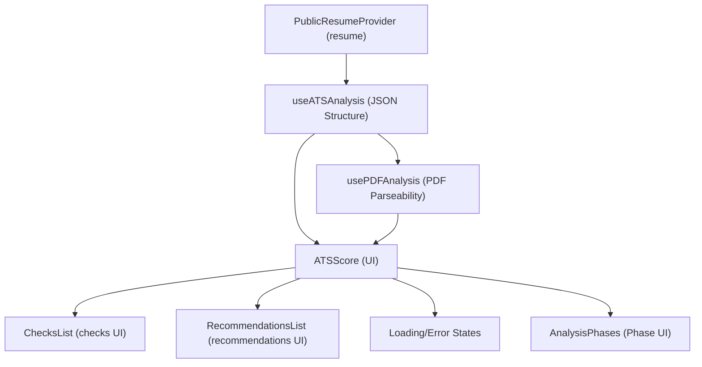
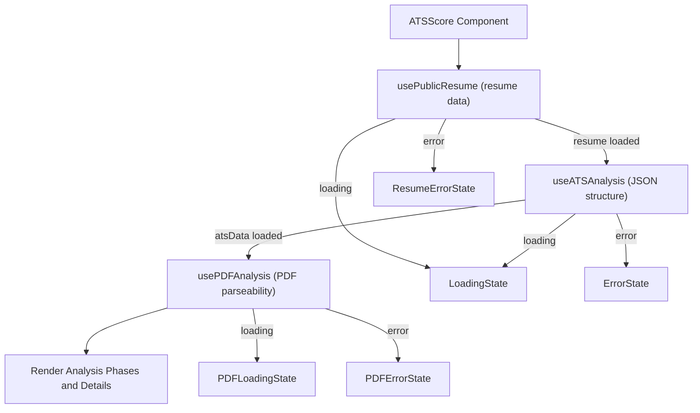
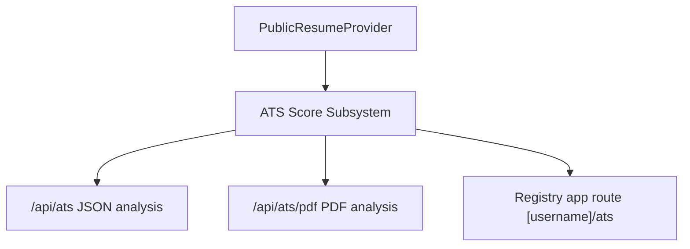
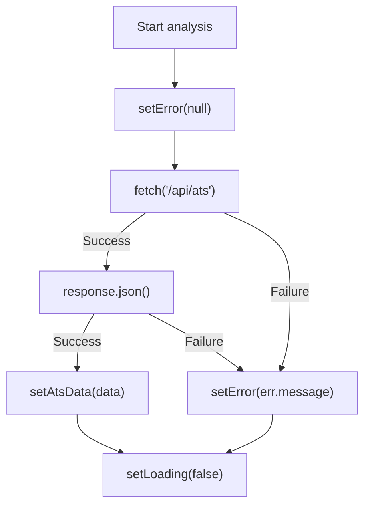

# ATS Score Subsystem

The ATS Score Subsystem evaluates resumes for compatibility with Applicant Tracking Systems (ATS) through a two-phase analysis: JSON structure validation and PDF parseability testing. It provides detailed scoring, checks, and recommendations to help optimize resumes for ATS parsing. This subsystem integrates resume data fetching, asynchronous analysis hooks, and UI components for presenting results and states.

## Purpose and Scope

This page documents the internal mechanisms of the ATS Score Subsystem responsible for analyzing resumes for ATS compatibility. It covers the core React components, hooks for asynchronous analysis, and UI elements for displaying scores, checks, and recommendations. It does not cover the underlying API implementations or the resume data provider beyond their interfaces.

For the resume data provider, see the Public Resume Provider documentation. For PDF generation and ATS backend APIs, see the respective API subsystem documentation.

## Architecture Overview

The subsystem orchestrates a two-phase analysis pipeline triggered by resume data availability. The first phase analyzes the JSON structure of the resume, producing ATS-specific metrics and recommendations. The second phase generates a PDF from the resume and tests its parseability by simulating an ATS upload. Both phases expose loading and error states, which the UI components consume to render appropriate feedback.



**Diagram: Data flow and component relationships in the ATS Score Subsystem**

Sources: `apps/registry/app/[username]/ats/ATSScore.js:22-81`, `apps/registry/app/[username]/ats/hooks/useATSAnalysis.js:9-52`, `apps/registry/app/[username]/ats/hooks/usePDFAnalysis.js:11-61`, `apps/registry/app/[username]/ats/components/LoadingStates.jsx:5-58`, `apps/registry/app/[username]/ats/components/AnalysisPhases.jsx:4-42`

## ATSScore Component

**Purpose**: The main React client component that coordinates resume data retrieval, triggers ATS and PDF analyses, and renders the full ATS compatibility report with loading and error states.  
**Primary files**: `apps/registry/app/[username]/ats/ATSScore.js:22-81`

| Field / Variable | Type | Purpose |
|------------------|------|---------|
| `username` | `string` | Extracted from route params, identifies the user whose resume is analyzed. `apps/registry/app/[username]/ats/ATSScore.js:23-23` |
| `resume` | `object|null` | Resume data fetched from `usePublicResume`. `null` indicates no resume loaded. `apps/registry/app/[username]/ats/ATSScore.js:24-28` |
| `resumeLoading` | `boolean` | Indicates if resume data is loading. `apps/registry/app/[username]/ats/ATSScore.js:24-28` |
| `resumeError` | `string|null` | Error message if resume loading failed. `null` means no error. `apps/registry/app/[username]/ats/ATSScore.js:24-28` |
| `atsData` | `object|null` | Result of JSON structure ATS analysis, including score, rating, checks, and recommendations. `null` if analysis not complete. `apps/registry/app/[username]/ats/ATSScore.js:31-35` |
| `atsLoading` | `boolean` | Indicates if ATS JSON analysis is in progress. `apps/registry/app/[username]/ats/ATSScore.js:31-35` |
| `atsError` | `string|null` | Error message if ATS JSON analysis failed. `null` means no error. `apps/registry/app/[username]/ats/ATSScore.js:31-35` |
| `pdfData` | `object|null` | Result of PDF parseability analysis, including score and rating. `null` if analysis not complete. `apps/registry/app/[username]/ats/ATSScore.js:38-42` |
| `pdfLoading` | `boolean` | Indicates if PDF parseability analysis is in progress. `apps/registry/app/[username]/ats/ATSScore.js:38-42` |
| `pdfError` | `string|null` | Error message if PDF parseability analysis failed. `null` means no error. `apps/registry/app/[username]/ats/ATSScore.js:38-42` |

### Key behaviors

- Extracts `username` from route parameters using React's `use` hook.  
- Retrieves resume data and loading/error states from `usePublicResume`.  
- Invokes `useATSAnalysis` with the resume to perform JSON structure analysis asynchronously.  
- Invokes `usePDFAnalysis` with resume, ATS data, and username to perform PDF parseability analysis asynchronously.  
- Renders loading states if resume or ATS JSON analysis is in progress.  
- Renders error states if resume loading or ATS JSON analysis fails.  
- Renders a no-resume state if no resume is found.  
- Renders an analyzing state if ATS data is not yet available after resume load.  
- Displays a two-phase analysis report: JSON structure phase and PDF parseability phase, each with scores and summaries.  
- Displays detailed checks and grouped recommendations from ATS data.  
- Uses modular components for loading states, analysis phases, checks list, and recommendations list.  

Sources: `apps/registry/app/[username]/ats/ATSScore.js:22-81`

## useATSAnalysis Hook

**Purpose**: Performs asynchronous ATS JSON structure analysis on the provided resume, managing loading and error states.  
**Primary files**: `apps/registry/app/[username]/ats/hooks/useATSAnalysis.js:9-52`

| Field / Variable | Type | Purpose |
|------------------|------|---------|
| `atsData` | `object|null` | Holds the ATS analysis result including score, rating, checks, and recommendations. `null` if not analyzed yet. `apps/registry/app/[username]/ats/hooks/useATSAnalysis.js:10-10` |
| `loading` | `boolean` | True while the analysis request is in progress. `apps/registry/app/[username]/ats/hooks/useATSAnalysis.js:11-11` |
| `error` | `string|null` | Holds error message if analysis fails; `null` otherwise. `apps/registry/app/[username]/ats/hooks/useATSAnalysis.js:12-12` |
| `analyzeResume` | `async function` | Internal async function that posts resume JSON to `/api/ats` and updates state accordingly. `apps/registry/app/[username]/ats/hooks/useATSAnalysis.js:15-46` |
| `response` | `Response` | The fetch API response object from the POST request. `apps/registry/app/[username]/ats/hooks/useATSAnalysis.js:22-28` |
| `data` | `object` | Parsed JSON response from the API containing ATS analysis results. `apps/registry/app/[username]/ats/hooks/useATSAnalysis.js:34-34` |

### Key behaviors

- Triggers analysis whenever the `resume` object changes.  
- Skips analysis if `resume` is falsy (null or undefined).  
- Posts the resume JSON to `/api/ats` endpoint with `Content-Type: application/json`.  
- Throws an error if the response status is not OK, capturing the status text.  
- Parses JSON response and updates `atsData` state with the analysis result.  
- Logs debug information including score and rating on success.  
- Catches and logs errors, updating the `error` state with the error message.  
- Manages `loading` state to reflect request lifecycle.  

Sources: `apps/registry/app/[username]/ats/hooks/useATSAnalysis.js:9-52`

## usePDFAnalysis Hook

**Purpose**: Performs asynchronous PDF parseability analysis by generating a PDF from the resume and testing its ATS parseability, managing loading and error states.  
**Primary files**: `apps/registry/app/[username]/ats/hooks/usePDFAnalysis.js:11-61`

| Field / Variable | Type | Purpose |
|------------------|------|---------|
| `pdfData` | `object|null` | Holds the PDF analysis result including score, rating, and summary. `null` if not analyzed yet. `apps/registry/app/[username]/ats/hooks/usePDFAnalysis.js:12-12` |
| `loading` | `boolean` | True while the PDF analysis request is in progress. `apps/registry/app/[username]/ats/hooks/usePDFAnalysis.js:13-13` |
| `error` | `string|null` | Holds error message if PDF analysis fails; `null` otherwise. `apps/registry/app/[username]/ats/hooks/usePDFAnalysis.js:14-14` |
| `analyzePDF` | `async function` | Internal async function that posts resume and username to `/api/ats/pdf` and updates state accordingly. `apps/registry/app/[username]/ats/hooks/usePDFAnalysis.js:17-55` |
| `response` | `Response` | The fetch API response object from the POST request. `apps/registry/app/[username]/ats/hooks/usePDFAnalysis.js:24-34` |
| `data` | `object` | Parsed JSON response from the API containing PDF parseability analysis results. `apps/registry/app/[username]/ats/hooks/usePDFAnalysis.js:40-40` |

### Key behaviors

- Triggers analysis whenever `resume`, `atsData`, or `username` change.  
- Skips analysis if either `resume` or `atsData` is falsy.  
- Posts JSON payload including `resume`, `username`, and a fixed theme `"professional"` to `/api/ats/pdf`.  
- Throws an error if the response status is not OK, capturing the status text.  
- Parses JSON response and updates `pdfData` state with the analysis result.  
- Logs debug information including score and rating on success.  
- Catches and logs errors, updating the `error` state with the error message.  
- Manages `loading` state to reflect request lifecycle.  

Sources: `apps/registry/app/[username]/ats/hooks/usePDFAnalysis.js:11-61`

## Loading and Error State Components

**Purpose**: Provide reusable React components to represent various loading and error states during ATS and PDF analyses.  
**Primary files**: `apps/registry/app/[username]/ats/components/LoadingStates.jsx:5-58`

### Components

| Component | Purpose |
|-----------|---------|
| `LoadingState` | Displays a generic loading message during resume ATS compatibility analysis. `apps/registry/app/[username]/ats/components/LoadingStates.jsx:5-9` |
| `ErrorState` | Displays a generic error message during ATS analysis with the error text. `apps/registry/app/[username]/ats/components/LoadingStates.jsx:11-17` |
| `ResumeErrorState` | Displays an error message specific to resume loading failures. `apps/registry/app/[username]/ats/components/LoadingStates.jsx:19-25` |
| `NoResumeState` | Displays a message indicating no resume was found. `apps/registry/app/[username]/ats/components/LoadingStates.jsx:27-29` |
| `AnalyzingState` | Displays a generic "Analyzing..." message when analysis is in progress but no data yet. `apps/registry/app/[username]/ats/components/LoadingStates.jsx:31-33` |
| `PDFLoadingState` | Displays a detailed loading state for PDF parseability analysis with spinner and step description. `apps/registry/app/[username]/ats/components/LoadingStates.jsx:35-49` |
| `PDFErrorState` | Displays an error message specific to PDF analysis failures with error details. `apps/registry/app/[username]/ats/components/LoadingStates.jsx:51-58` |

### Key behaviors

- Each component returns a styled div with appropriate text and icons.  
- `PDFLoadingState` and `PDFErrorState` use distinct background colors and layouts to differentiate PDF-specific states.  
- Error components accept an `error` prop to display the error message.  
- Loading components show animated spinners where applicable.  

Sources: `apps/registry/app/[username]/ats/components/LoadingStates.jsx:5-58`

## Analysis Phases Components

**Purpose**: Render the two distinct phases of ATS analysis—JSON structure and PDF parseability—with scores and summaries.  
**Primary files**: `apps/registry/app/[username]/ats/components/AnalysisPhases.jsx:4-42`

### Components

| Component | Purpose |
|-----------|---------|
| `JSONStructurePhase` | Displays the JSON structure analysis phase with a title, description, and score display. `apps/registry/app/[username]/ats/components/AnalysisPhases.jsx:4-20` |
| `PDFParseabilityPhase` | Displays the PDF parseability test phase with a title, description, and conditional rendering of loading, error, or score display states. `apps/registry/app/[username]/ats/components/AnalysisPhases.jsx:22-42` |

### Key behaviors

- Both phases use the `ScoreDisplay` component to visualize scores and ratings.  
- `PDFParseabilityPhase` conditionally renders `PDFLoadingState` or `PDFErrorState` based on loading and error props.  
- Provides contextual descriptions explaining each phase's role in the analysis.  

Sources: `apps/registry/app/[username]/ats/components/AnalysisPhases.jsx:4-42`

## ScoreDisplay Component and Helpers

**Purpose**: Visually represent an ATS score with color-coded text, background, and a circular progress indicator.  
**Primary files**: `apps/registry/app/[username]/ats/ATSScoreModule/components/ScoreDisplay.js:8-78`

| Function / Variable | Purpose |
|---------------------|---------|
| `getScoreColor(score)` | Returns a Tailwind CSS text color class based on numeric score thresholds. `apps/registry/app/[username]/ats/ATSScoreModule/components/ScoreDisplay.js:8-14` |
| `getScoreBgColor(score)` | Returns a Tailwind CSS background color class based on numeric score thresholds. `apps/registry/app/[username]/ats/ATSScoreModule/components/ScoreDisplay.js:19-25` |
| `ScoreDisplay` | React component that renders the score, rating, summary, and a circular SVG progress indicator with dynamic stroke offset and color. `apps/registry/app/[username]/ats/ATSScoreModule/components/ScoreDisplay.js:30-78` |

### ScoreDisplay internal variables

| Variable | Purpose |
|----------|---------|
| `scoreColor` | CSS class for text color derived from `getScoreColor(score)`. `apps/registry/app/[username]/ats/ATSScoreModule/components/ScoreDisplay.js:31-31` |
| `scoreBgColor` | CSS class for background color derived from `getScoreBgColor(score)`. `apps/registry/app/[username]/ats/ATSScoreModule/components/ScoreDisplay.js:32-32` |
| `circumference` | Circumference of the circular progress ring (2πr with r=70). `apps/registry/app/[username]/ats/ATSScoreModule/components/ScoreDisplay.js:33-33` |
| `strokeDashoffset` | SVG stroke dash offset calculated to represent the score percentage visually. `apps/registry/app/[username]/ats/ATSScoreModule/components/ScoreDisplay.js:34-34` |

### Key behaviors

- Uses score thresholds to assign semantic colors for accessibility and clarity.  
- Renders a large numeric score with a percentage ring that animates according to the score.  
- Displays a rating label and a textual summary below the score.  
- The circular progress ring uses two SVG circles: a gray background and a colored foreground with stroke dash offset.  
- The component is responsive, arranging content vertically on small screens and horizontally on larger screens.  

Sources: `apps/registry/app/[username]/ats/ATSScoreModule/components/ScoreDisplay.js:8-78`

## RecommendationsList and RecommendationCard Components

**Purpose**: Display a grouped list of recommendations for improving ATS compatibility, sorted by severity, with detailed cards for each recommendation.  
**Primary files**: `apps/registry/app/[username]/ats/ATSScoreModule/components/RecommendationsList.js:8-137`

| Function / Variable | Purpose |
|---------------------|---------|
| `getSeverityColor(severity)` | Returns CSS classes for background, text, and border colors based on severity level (`critical`, `warning`, `info`). `apps/registry/app/[username]/ats/ATSScoreModule/components/RecommendationsList.js:8-19` |
| `getSeverityIcon(severity)` | Returns an SVG icon element corresponding to the severity level. `apps/registry/app/[username]/ats/ATSScoreModule/components/RecommendationsList.js:24-59` |
| `RecommendationCard` | React component rendering a single recommendation with severity badge, category, message, and optional fix instructions. `apps/registry/app/[username]/ats/ATSScoreModule/components/RecommendationsList.js:64-98` |
| `RecommendationsList` | React component that groups recommendations by severity, sorts them, and renders a list of `RecommendationCard`s or a no-recommendations message. `apps/registry/app/[username]/ats/ATSScoreModule/components/RecommendationsList.js:103-137` |

### RecommendationCard internal variables

| Variable | Purpose |
|----------|---------|
| `severityColor` | CSS classes for severity badge and background derived from `getSeverityColor`. `apps/registry/app/[username]/ats/ATSScoreModule/components/RecommendationsList.js:65-65` |
| `severityIcon` | SVG icon element derived from `getSeverityIcon`. `apps/registry/app/[username]/ats/ATSScoreModule/components/RecommendationsList.js:66-66` |

### RecommendationsList internal variables

| Variable | Purpose |
|----------|---------|
| `grouped` | Object mapping severity levels to arrays of recommendations, grouping them by severity. `apps/registry/app/[username]/ats/ATSScoreModule/components/RecommendationsList.js:105-110` |
| `severityOrder` | Array defining the order of severity levels for display: `['critical', 'warning', 'info']`. `apps/registry/app/[username]/ats/ATSScoreModule/components/RecommendationsList.js:112-112` |
| `sortedSeverities` | Filtered array of severities present in the grouped recommendations, preserving order. `apps/registry/app/[username]/ats/ATSScoreModule/components/RecommendationsList.js:113-113` |

### Key behaviors

- Groups recommendations by severity, defaulting missing severity to `info`.  
- Sorts severity groups to display critical issues first, then warnings, then informational messages.  
- Each recommendation card shows severity badge, optional category, message, and fix instructions if present.  
- Displays a friendly message if no recommendations exist.  
- Uses semantic colors and icons for severity to improve visual scanning.  

Sources: `apps/registry/app/[username]/ats/ATSScoreModule/components/RecommendationsList.js:8-137`

## ChecksList and CheckCard Components

**Purpose**: Render a list of individual ATS checks with pass/fail status, scores, progress bars, and issue details.  
**Primary files**: `apps/registry/app/[username]/ats/ATSScoreModule/components/ChecksList.js:8-112`

| Function / Variable | Purpose |
|---------------------|---------|
| `getCheckIcon(passed)` | Returns an SVG icon representing pass (green check) or warning (yellow exclamation) based on boolean `passed`. `apps/registry/app/[username]/ats/ATSScoreModule/components/ChecksList.js:8-38` |
| `CheckCard` | React component rendering a single check with name, score, progress bar, and up to three issue messages. `apps/registry/app/[username]/ats/ATSScoreModule/components/ChecksList.js:43-99` |
| `ChecksList` | React component rendering a grid of `CheckCard`s for all checks provided. `apps/registry/app/[username]/ats/ATSScoreModule/components/ChecksList.js:104-112` |

### CheckCard internal variables

| Variable | Purpose |
|----------|---------|
| `percentage` | Integer percentage score calculated as `(check.score / check.maxScore) * 100`. `apps/registry/app/[username]/ats/ATSScoreModule/components/ChecksList.js:44-44` |
| `hasIssues` | Boolean indicating if the check has any associated issues. `apps/registry/app/[username]/ats/ATSScoreModule/components/ChecksList.js:45-45` |

### Key behaviors

- Displays a green check icon if the check passed, or a yellow warning icon if not.  
- Shows the raw score and maximum score alongside a percentage score with color-coded text.  
- Renders a horizontal progress bar reflecting the percentage score, colored green or yellow based on pass status.  
- Lists up to three issues with bullet points; if more than three, indicates how many additional issues exist.  
- Uses a responsive grid layout for multiple checks.  

Sources: `apps/registry/app/[username]/ats/ATSScoreModule/components/ChecksList.js:8-112`

## Loading Component

**Purpose**: Provides a full-screen centered loading spinner and message displayed during initial resume ATS compatibility analysis.  
**Primary files**: `apps/registry/app/[username]/ats/loading.js:1-12`

### Key behaviors

- Renders a spinning circular border animation using Tailwind CSS classes.  
- Centers the spinner and message vertically and horizontally in the viewport.  
- Displays the message: "Analyzing resume for ATS compatibility...".  

Sources: `apps/registry/app/[username]/ats/loading.js:1-12`

## ATSLayout Component and username Variable

**Purpose**: Server component that wraps children with `PublicResumeProvider` scoped to the username extracted from route parameters.  
**Primary files**: `apps/registry/app/[username]/ats/layout.js:3-9`

| Variable | Type | Purpose |
|----------|------|---------|
| `username` | `string` | Extracted asynchronously from `params` object, used to scope the resume provider. `apps/registry/app/[username]/ats/layout.js:4-4` |

### Key behaviors

- Awaits `params` to extract `username` asynchronously.  
- Wraps children components with `PublicResumeProvider` passing the `username` prop.  
- Enables downstream components to access public resume data scoped to the username.  

Sources: `apps/registry/app/[username]/ats/layout.js:3-9`

## How It Works

The ATS Score Subsystem operates as a React client-side pipeline triggered by the presence of resume data for a given username. The entry point is the `ATSScore` component, which receives the username from route parameters and accesses resume data via the `usePublicResume` hook.

1. **Resume Loading**: `usePublicResume` asynchronously fetches the public resume for the username. While loading, `ATSScore` renders `LoadingState`. If loading fails, it renders `ResumeErrorState`. If no resume is found, it renders `NoResumeState`.

2. **ATS JSON Structure Analysis**: Once the resume is available, `ATSScore` invokes `useATSAnalysis` passing the resume object. This hook asynchronously posts the resume JSON to the `/api/ats` endpoint. While the request is pending, `ATSScore` renders `LoadingState`. On success, it receives `atsData` containing a score, rating, checks, and recommendations. On failure, it renders `ErrorState`.

3. **PDF Parseability Analysis**: After receiving `atsData`, `ATSScore` invokes `usePDFAnalysis` with the resume, `atsData`, and username. This hook posts to `/api/ats/pdf` with the resume and username to generate a PDF and simulate ATS parsing. It manages its own loading and error states, which `ATSScore` surfaces via `PDFLoadingState` and `PDFErrorState`.

4. **Rendering Analysis Results**: When both analyses complete successfully, `ATSScore` renders the two-phase analysis UI:
   - `JSONStructurePhase` displays the JSON structure score and summary.
   - `PDFParseabilityPhase` displays the PDF parseability score or loading/error states.
   - `ChecksList` renders detailed individual checks with pass/fail status and issues.
   - `RecommendationsList` renders grouped recommendations with severity badges and fix instructions.

5. **User Feedback**: Throughout, the subsystem provides clear feedback on loading, errors, and analysis progress, ensuring the user understands the current state.



**Diagram: Call and data flow through the ATS Score Subsystem**

Sources: `apps/registry/app/[username]/ats/ATSScore.js:22-81`, `apps/registry/app/[username]/ats/hooks/useATSAnalysis.js:9-52`, `apps/registry/app/[username]/ats/hooks/usePDFAnalysis.js:11-61`

## Key Relationships

The ATS Score Subsystem depends on the Public Resume Provider for fetching resume data scoped by username. It relies on backend API endpoints `/api/ats` and `/api/ats/pdf` for performing the JSON structure and PDF parseability analyses, respectively. The subsystem exposes UI components consumed by the registry app's route for `[username]/ats`.



**Relationships between ATS Score Subsystem and adjacent components**

Sources: `apps/registry/app/[username]/ats/layout.js:3-9`, `apps/registry/app/[username]/ats/ATSScore.js:22-81`

## `{ username }` (variable) in apps/registry/app/[username]/ats/layout.js

**Purpose**: Extracts the `username` parameter from the routing context to provide it downstream via context providers.  
**Primary file**: `apps/registry/app/[username]/ats/layout.js:4`  

This variable is destructured from the `params` object passed as a prop to the `ATSLayout` component. It represents the dynamic segment of the route corresponding to a user's unique identifier. The `username` is awaited from `params` (which is an async object in Next.js routing) and then passed as a prop to the `PublicResumeProvider` component, which wraps the children components. This enables all nested components to access the public resume data scoped to this username.

**Key behaviors:**
- Extracted asynchronously from route parameters to ensure the correct user context.  
- Passed to `PublicResumeProvider` to scope resume data fetching and caching.  
- Enables multi-user isolation of resume and ATS analysis data within the same app route hierarchy.

Sources: `apps/registry/app/[username]/ats/layout.js:3-9`

---

## `{ username }` (variable) in apps/registry/app/[username]/ats/ATSScore.js

**Purpose**: Represents the current user's username, extracted from the route parameters to scope all resume and ATS analysis operations.  
**Primary file**: `apps/registry/app/[username]/ats/ATSScore.js:23`  

Within the `ATSScore` React component, `username` is obtained by calling React's experimental `use()` hook on the `params` prop. This usage reflects Next.js 13+ conventions where route parameters are passed as async objects. The `username` variable is then used as an identifier for API calls and UI components that require user-specific context.

**Key behaviors:**
- Used as a key parameter in API requests for PDF generation and ATS analysis.  
- Passed to UI components such as `PublicViewBanner` to display user-specific information.  
- Acts as a stable identifier throughout the component lifecycle for data fetching hooks.

Sources: `apps/registry/app/[username]/ats/ATSScore.js:22-24`

---

## `{
    resume,
    loading: resumeLoading,
    error: resumeError,
  }` (variable) in apps/registry/app/[username]/ats/ATSScore.js

**Purpose**: Holds the public resume data and its loading and error states, sourced from the `usePublicResume` context hook.  
**Primary file**: `apps/registry/app/[username]/ats/ATSScore.js:24-28`  

This destructured object is returned by the `usePublicResume` hook, which accesses the resume data provided by `PublicResumeProvider`. It contains:

| Field          | Type           | Purpose                                                                                   |
|----------------|----------------|-------------------------------------------------------------------------------------------|
| `resume`       | `Object|null`  | The parsed resume JSON object or `null` if not loaded or unavailable.                     |
| `resumeLoading`| `boolean`      | Indicates whether the resume data is currently being fetched or processed.                |
| `resumeError`  | `string|null`  | Holds an error message string if fetching or parsing the resume failed; otherwise `null`. |

**Key behaviors:**
- Controls rendering flow in `ATSScore` by gating analysis phases until resume data is ready.  
- Errors in resume fetching cause early UI error states to be rendered.  
- Loading state prevents premature analysis calls and UI flicker.

Sources: `apps/registry/app/[username]/ats/ATSScore.js:24-28`

---

## `[pdfData, setPdfData]` (variable) in apps/registry/app/[username]/ats/hooks/usePDFAnalysis.js

**Purpose**: State tuple managing the PDF analysis result data within the `usePDFAnalysis` hook.  
**Primary file**: `apps/registry/app/[username]/ats/hooks/usePDFAnalysis.js:12`  

`pdfData` holds the current PDF analysis result object or `null` if analysis has not completed or failed. `setPdfData` is the React state setter function to update this value asynchronously.

| Variable  | Type                      | Purpose                                                                                  |
|-----------|---------------------------|------------------------------------------------------------------------------------------|
| `pdfData` | `Object|null`             | Stores the PDF parseability analysis result or `null` if not available.                  |
| `setPdfData` | `(value: Object|null) => void` | Updates the `pdfData` state with new analysis results or resets it to `null`.           |

**Key behaviors:**
- Updated upon successful completion of the PDF analysis API call.  
- Reset to `null` when input dependencies change or analysis restarts.  
- Drives UI updates in components consuming this hook.

Sources: `apps/registry/app/[username]/ats/hooks/usePDFAnalysis.js:12`

---

## `[loading, setLoading]` (variable) in apps/registry/app/[username]/ats/hooks/usePDFAnalysis.js

**Purpose**: State tuple managing the loading status of the PDF analysis operation within the `usePDFAnalysis` hook.  
**Primary file**: `apps/registry/app/[username]/ats/hooks/usePDFAnalysis.js:13`  

`loading` is a boolean indicating whether the PDF analysis is currently in progress. `setLoading` is the setter function to toggle this state.

| Variable  | Type                | Purpose                                                        |
|-----------|---------------------|----------------------------------------------------------------|
| `loading` | `boolean`           | True when PDF analysis is running; false otherwise.            |
| `setLoading` | `(value: boolean) => void` | Updates the loading state flag.                              |

**Key behaviors:**
- Set to `true` immediately before starting the async PDF analysis.  
- Reset to `false` after analysis completes or errors out.  
- Controls UI loading indicators and disables redundant calls.

Sources: `apps/registry/app/[username]/ats/hooks/usePDFAnalysis.js:13`

---

## `[error, setError]` (variable) in apps/registry/app/[username]/ats/hooks/usePDFAnalysis.js

**Purpose**: State tuple managing the error message resulting from the PDF analysis operation within the `usePDFAnalysis` hook.  
**Primary file**: `apps/registry/app/[username]/ats/hooks/usePDFAnalysis.js:14`  

`error` holds a string describing the error encountered during PDF analysis or `null` if no error occurred. `setError` updates this state.

| Variable  | Type            | Purpose                                                        |
|-----------|-----------------|----------------------------------------------------------------|
| `error`   | `string|null`   | Error message string if PDF analysis failed; otherwise `null`. |
| `setError`| `(value: string|null) => void` | Updates the error state.                                  |

**Key behaviors:**
- Cleared to `null` before each analysis attempt.  
- Set to the error message if the fetch request fails or returns a non-OK status.  
- Drives error UI states and logging.

Sources: `apps/registry/app/[username]/ats/hooks/usePDFAnalysis.js:14`

---

## `[atsData, setAtsData]` (variable) in apps/registry/app/[username]/ats/hooks/useATSAnalysis.js

**Purpose**: State tuple managing the ATS JSON structure analysis result data within the `useATSAnalysis` hook.  
**Primary file**: `apps/registry/app/[username]/ats/hooks/useATSAnalysis.js:10`  

`atsData` stores the analysis result object or `null` if analysis has not completed or failed. `setAtsData` is the setter function to update this state.

| Variable  | Type                      | Purpose                                                                                  |
|-----------|---------------------------|------------------------------------------------------------------------------------------|
| `atsData` | `Object|null`             | Stores the ATS JSON structure analysis result or `null` if not available.                |
| `setAtsData` | `(value: Object|null) => void` | Updates the `atsData` state with new analysis results or resets it to `null`.           |

**Key behaviors:**
- Updated upon successful completion of the ATS analysis API call.  
- Reset to `null` when the resume input changes or analysis restarts.  
- Drives UI updates in components consuming this hook.

Sources: `apps/registry/app/[username]/ats/hooks/useATSAnalysis.js:10`

---

## `[loading, setLoading]` (variable) in apps/registry/app/[username]/ats/hooks/useATSAnalysis.js

**Purpose**: State tuple managing the loading status of the ATS JSON structure analysis operation within the `useATSAnalysis` hook.  
**Primary file**: `apps/registry/app/[username]/ats/hooks/useATSAnalysis.js:11`  

`loading` is a boolean indicating whether the ATS analysis is currently in progress. `setLoading` is the setter function to toggle this state.

| Variable  | Type                | Purpose                                                        |
|-----------|---------------------|----------------------------------------------------------------|
| `loading` | `boolean`           | True when ATS analysis is running; false otherwise.            |
| `setLoading` | `(value: boolean) => void` | Updates the loading state flag.                              |

**Key behaviors:**
- Set to `true` immediately before starting the async ATS analysis.  
- Reset to `false` after analysis completes or errors out.  
- Controls UI loading indicators and disables redundant calls.

Sources: `apps/registry/app/[username]/ats/hooks/useATSAnalysis.js:11`

## `[error, setError]` (variable) in apps/registry/app/[username]/ats/hooks/useATSAnalysis.js

**Introduction**  
The `[error, setError]` state tuple is part of the React hook `useATSAnalysis`, managing error state during the asynchronous analysis of resume data against an Applicant Tracking System (ATS) API. It captures and exposes any failure encountered during the network request or data processing phases, enabling the consuming component to react accordingly.

### Purpose  
To hold and update the error state representing any failure encountered during the ATS analysis process, allowing the UI or other consumers to detect and respond to errors.

### Primary file  
- `apps/registry/app/[username]/ats/hooks/useATSAnalysis.js:12-12`

### Data structure

| Field  | Type                      | Purpose                                                                                  |
|--------|---------------------------|------------------------------------------------------------------------------------------|
| `error`  | `string \| null`           | Holds the error message string when an error occurs; `null` indicates no error present.  |
| `setError` | `(value: string \| null) => void` | State setter function to update the `error` value. Used internally to clear or set errors. |

### Behavior and lifecycle

- Initially, `error` is set to `null`, signaling no error condition at the start of the hook's lifecycle.
- When the `analyzeResume` async function initiates, `setError(null)` is called to clear any previous error state before starting a new analysis cycle.
- If the fetch request to the `/api/ats` endpoint fails (non-OK HTTP response) or if JSON parsing throws, the catch block captures the error.
- The error message string (`err.message`) is extracted and passed to `setError`, updating the `error` state with a descriptive failure reason.
- This error state persists until the next analysis cycle clears it or the component unmounts.
- The `error` state is returned from the hook, allowing consumers to conditionally render error messages or trigger error handling workflows.

### Failure modes and edge cases

- Network failures, server errors, or unexpected response formats cause `error` to be set.
- If the `resume` argument is falsy, the analysis is skipped, and `error` remains `null`.
- The error message is always a string derived from the caught exception's `message` property, ensuring consistent error reporting.
- No retries or fallback mechanisms are implemented; the error state reflects the last failure only.

### Example usage snippet

```js
const { error } = useATSAnalysis(resume);

if (error) {
  console.error("ATS analysis error:", error);
  // Render error UI or trigger fallback logic
}
```

### How `[error, setError]` fits in `useATSAnalysis`

The error state is a critical part of the hook's contract, signaling to consumers when the asynchronous ATS analysis fails. It works in tandem with `loading` and `atsData` states to provide a comprehensive status snapshot of the analysis operation.



**Diagram: Error state lifecycle within the ATS analysis hook**

Sources: `apps/registry/app/[username]/ats/hooks/useATSAnalysis.js:12-12, 15-46`