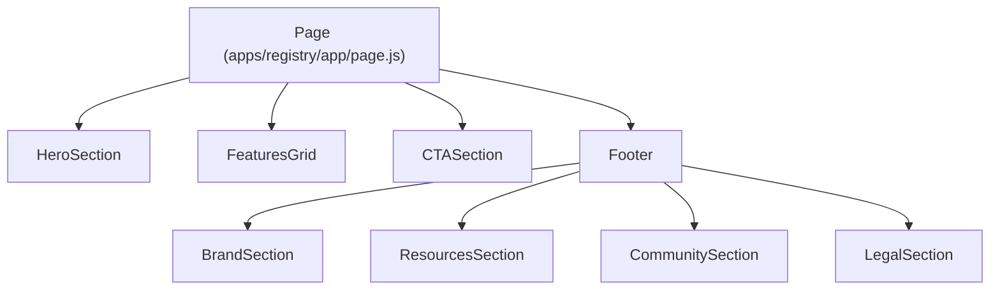
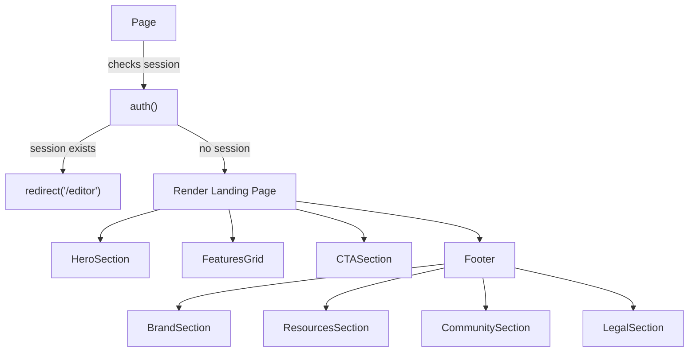
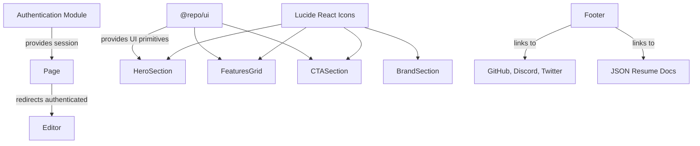

# Landing Page

The landing page subsystem orchestrates the main entry point of the JSON Resume Registry web application. It assembles the hero banner, feature highlights, call-to-action prompts, and footer into a cohesive user interface that introduces the platform’s value proposition and guides users toward authentication or exploration. This documentation covers the components and data structures that compose the landing page, their interactions, and the rendering logic. It does not cover the authentication backend, editor interface, or other unrelated UI modules.

For authentication flow details, see the Authentication subsystem documentation. For UI component design patterns, see the UI Components library documentation.

## Architecture Overview

The landing page is composed of four major UI components: `HeroSection`, `FeaturesGrid`, `CTASection`, and `Footer`. These components are imported and rendered by the async server component `Page`, which first checks the user session and redirects authenticated users to the editor. The `Footer` itself is a composite of four subcomponents managing branding, resources, community links, and legal information.

**Diagram: Component composition and rendering flow of the landing page**

Sources: `apps/registry/app/page.js:10-25`, `apps/registry/app/LandingPageModule/components/HeroSection.jsx:5-66`, `apps/registry/app/LandingPageModule/components/FeaturesGrid.jsx:4-31`, `apps/registry/app/LandingPageModule/components/CTASection.jsx:5-58`, `apps/registry/app/LandingPageModule/components/Footer/index.jsx:6-19`

## Page Component and Session Handling

**Purpose:** The `Page` function serves as the server-side entry point for the landing page route. It manages user session detection and conditional redirection before rendering the landing page UI components.

**Primary file:** `apps/registry/app/page.js:10-25`

| Field     | Type       | Purpose                                                                                   |
|-----------|------------|-------------------------------------------------------------------------------------------|
| `session` | `object|null` | Holds the authenticated user session data resolved asynchronously from `auth()`. `null` if no session exists. |

**Key behaviors:**
- Invokes `auth()` asynchronously to retrieve the current user session state. `session` is assigned the resolved session object or `null` if unauthenticated. `apps/registry/app/page.js:11`
- Redirects authenticated users to `/editor` immediately, preventing access to the landing page. This ensures logged-in users bypass the marketing UI. `apps/registry/app/page.js:13-15`
- Renders the landing page UI by composing `HeroSection`, `FeaturesGrid`, `CTASection`, and `Footer` inside a vertically stacked container with a background gradient. `apps/registry/app/page.js:17-24`

**How It Works:**

1. The server receives a request for the landing page.
2. `Page` asynchronously calls `auth()` to check if a user session exists.
3. If `session` is truthy, `redirect('/editor')` is called, terminating the response with a redirect.
4. If no session exists, the landing page UI components are rendered in order.
5. The rendered HTML is sent to the client.

Sources: `apps/registry/app/page.js:10-25`

## Features Data Structure

**Purpose:** The `features` array defines the set of key platform features showcased in the landing page’s features grid. Each entry encapsulates iconography, textual content, and styling metadata for a single feature.

**Primary file:** `apps/registry/app/LandingPageModule/data/features.js:10-53`

| Field       | Type             | Purpose                                                                                     |
|-------------|------------------|---------------------------------------------------------------------------------------------|
| `icon`      | `JSX.Element`    | React element rendering an SVG icon representing the feature, styled with color and size.   |
| `title`     | `string`         | The headline text summarizing the feature.                                                 |
| `description` | `string`       | A brief explanatory text describing the feature’s benefit or function.                      |
| `color`     | `string`         | Tailwind CSS background color class applied to the icon container for visual distinction.   |

**Entries:**

| Title               | Description                                                                                  | Icon Component | Color Class       |
|---------------------|----------------------------------------------------------------------------------------------|----------------|-------------------|
| Open Source Standard | Community-driven resume data standard used globally by developers.                           | `Globe2`       | `bg-blue-500/10`  |
| Multiple Themes      | Variety of professional themes with an API to create custom themes.                         | `PaintBucket`  | `bg-purple-500/10`|
| Instant Sharing      | Share resumes via simple URLs for job applications and social profiles.                      | `Share2`       | `bg-green-500/10` |
| AI Powered          | AI tools provide smart suggestions and improvements for resume content.                      | `Wand2`        | `bg-amber-500/10` |
| GitHub Integration   | Store and update resumes as GitHub Gists, integrating with developer workflows.              | `Github`       | `bg-gray-500/10`  |
| JSON Schema          | Use a simple JSON schema to ensure structured and portable resume data.                      | `FileJson`     | `bg-red-500/10`   |

**Key behaviors:**
- Each feature’s icon is a Lucide React icon component with fixed size and color. `apps/registry/app/LandingPageModule/data/features.js:10-53`
- The color field controls the background highlight behind the icon, reinforcing visual grouping. 
- The array order determines the layout order in the features grid.

Sources: `apps/registry/app/LandingPageModule/data/features.js:10-53`

## HeroSection Component

**Purpose:** `HeroSection` renders the topmost banner of the landing page, presenting the platform’s tagline, version badge, descriptive text, and primary call-to-action buttons for authentication and schema exploration.

**Primary file:** `apps/registry/app/LandingPageModule/components/HeroSection.jsx:5-66`

| Element              | Description                                                                                   |
|----------------------|-----------------------------------------------------------------------------------------------|
| Background overlays  | Two blurred circular gradients positioned top-left and bottom-right for visual depth.         |
| Badge                | A pulsing "v1.0 Beta" badge indicating the current release status.                            |
| Heading              | Large, gradient-text headline: "Your Resume as Code".                                        |
| Description paragraph | Explains the platform’s function: turning GitHub Gists into standardized resumes.             |
| Primary buttons      | Two buttons: "Continue with GitHub" (login) and "View Schema" (external link).                |
| Stats                | Two small info blocks showing "10,000+ Developers" and "Open Source" with icons.              |

**Key behaviors:**
- Uses absolute positioning and CSS gradients to create layered background effects. `apps/registry/app/LandingPageModule/components/HeroSection.jsx:7-20`
- The version badge animates with a pulse to draw attention. `apps/registry/app/LandingPageModule/components/HeroSection.jsx:21-23`
- The main heading uses background-clip and gradient text for a visually striking effect. `apps/registry/app/LandingPageModule/components/HeroSection.jsx:24-29`
- The description includes emphasized text to highlight version control as a key concept. `apps/registry/app/LandingPageModule/components/HeroSection.jsx:30-35`
- The primary buttons use the `Button` component from the UI library with icon adornments and hover scaling transitions. The GitHub button links internally to `/login`, while the schema button links externally with safe `noopener noreferrer` attributes. `apps/registry/app/LandingPageModule/components/HeroSection.jsx:36-54`
- The stats section uses small icons from Lucide React and concise text to convey community size and open source status. `apps/registry/app/LandingPageModule/components/HeroSection.jsx:55-65`

Sources: `apps/registry/app/LandingPageModule/components/HeroSection.jsx:5-66`

## FeaturesGrid Component

**Purpose:** `FeaturesGrid` renders the grid layout presenting all platform features defined in the `features` array, each as a card with icon, title, and description.

**Primary file:** `apps/registry/app/LandingPageModule/components/FeaturesGrid.jsx:4-31`

| Element        | Description                                                                                  |
|----------------|----------------------------------------------------------------------------------------------|
| Container      | Responsive grid container with 1 to 3 columns depending on viewport width.                    |
| Cards         | Each feature is rendered inside a `Card` component with hover shadow and transform effects.  |
| Icon container | Colored background circle behind the icon, scaling up on hover.                              |
| Card header    | Contains icon, title, and description with consistent spacing and typography.                |

**Key behaviors:**
- Maps over the `features` array to render each feature card dynamically. `apps/registry/app/LandingPageModule/components/FeaturesGrid.jsx:11-29`
- Cards have no border and use a smooth shadow transition on hover for visual feedback. `apps/registry/app/LandingPageModule/components/FeaturesGrid.jsx:13-15`
- The icon container uses the `color` property from each feature to set background color and applies a scale transform on hover. `apps/registry/app/LandingPageModule/components/FeaturesGrid.jsx:17-21`
- Titles and descriptions use the UI library’s `CardTitle` and `CardDescription` components for consistent styling. `apps/registry/app/LandingPageModule/components/FeaturesGrid.jsx:22-28`

Sources: `apps/registry/app/LandingPageModule/components/FeaturesGrid.jsx:4-31`

## CTASection Component

**Purpose:** `CTASection` provides a prominent call-to-action panel encouraging users to start using the platform or explore the JSON schema, reinforcing the platform’s value proposition.

**Primary file:** `apps/registry/app/LandingPageModule/components/CTASection.jsx:5-58`

| Element             | Description                                                                                   |
|---------------------|-----------------------------------------------------------------------------------------------|
| Card container      | Gradient background card with layered translucent grid and pulse animation overlays.          |
| Join badge          | Pulsing green dot with "Join 10,000+ developers" text to indicate community size.             |
| Heading             | Large, gradient-text headline prompting readiness to standardize resumes.                     |
| Description paragraph| Explains benefits of version-controlled, shareable resumes for developers.                    |
| Buttons             | Two large buttons: "Get Started with GitHub" (internal login link) and "Explore the Schema" (external link). |

**Key behaviors:**
- Uses absolute-positioned background layers with grid and gradient patterns to create a textured, animated backdrop. `apps/registry/app/LandingPageModule/components/CTASection.jsx:7-15`
- The join badge uses a small green circle with pulse animation to attract attention. `apps/registry/app/LandingPageModule/components/CTASection.jsx:17-22`
- The heading uses background-clip and gradient text for emphasis. `apps/registry/app/LandingPageModule/components/CTASection.jsx:23-27`
- The description paragraph uses muted text color and centered layout for readability. `apps/registry/app/LandingPageModule/components/CTASection.jsx:28-33`
- Buttons use the UI library’s `Button` component with icons and hover scaling. The GitHub button links internally to `/login` with an arrow icon, while the schema button links externally with safe attributes. Both buttons are full width on small screens and auto width on larger screens. `apps/registry/app/LandingPageModule/components/CTASection.jsx:34-56`

Sources: `apps/registry/app/LandingPageModule/components/CTASection.jsx:5-58`

## Footer Component and Subsections

**Purpose:** The `Footer` component composes the landing page footer by aggregating branding, resource links, community links, and legal information into a structured layout.

**Primary file:** `apps/registry/app/LandingPageModule/components/Footer/index.jsx:6-19`

| Subcomponent       | Role                                                                                         |
|--------------------|----------------------------------------------------------------------------------------------|
| `BrandSection`     | Displays the platform logo, description, and social media icons.                             |
| `ResourcesSection` | Lists external resource links like schema, themes, getting started, and API documentation.  |
| `CommunitySection` | Lists community-related links such as GitHub, Discord, Twitter, and blog.                    |
| `LegalSection`     | Displays copyright notice and legal links (privacy policy, terms of service).                |

**Key behaviors:**
- The footer uses a translucent white background with a blur effect and a top border for separation. `apps/registry/app/LandingPageModule/components/Footer/index.jsx:7-9`
- The main content area uses a 4-column grid on medium screens, collapsing to a single column on smaller viewports. `apps/registry/app/LandingPageModule/components/Footer/index.jsx:10-17`
- The `LegalSection` is rendered below the grid with a top border and flex layout for responsive alignment. `apps/registry/app/LandingPageModule/components/Footer/index.jsx:18-19`

Sources: `apps/registry/app/LandingPageModule/components/Footer/index.jsx:6-19`

### BrandSection

**Purpose:** Renders the JSON Resume brand identity, including logo, description, and social media links.

**Primary file:** `apps/registry/app/LandingPageModule/components/Footer/BrandSection.jsx:4-43`

| Element           | Description                                                                                   |
|-------------------|-----------------------------------------------------------------------------------------------|
| Logo and title    | Combines the `FileJson` icon with the text "JSON Resume" styled as a bold, large font.        |
| Description       | Short paragraph describing the initiative’s mission to standardize resumes in JSON format.    |
| Social links      | Icon links to GitHub, Twitter, and Discord with hover color transitions.                      |

**Key behaviors:**
- Uses Lucide React icons for the logo and social media icons. `apps/registry/app/LandingPageModule/components/Footer/BrandSection.jsx:4-43`
- Social icons link externally with `noopener noreferrer` for security. `apps/registry/app/LandingPageModule/components/Footer/BrandSection.jsx:30-42`
- Social icons use the `TwitterIcon` and `DiscordIcon` SVG components defined locally. `apps/registry/app/LandingPageModule/components/Footer/icons.jsx:1-11`

Sources: `apps/registry/app/LandingPageModule/components/Footer/BrandSection.jsx:4-43`, `apps/registry/app/LandingPageModule/components/Footer/icons.jsx:1-11`

### ResourcesSection

**Purpose:** Lists key external resources related to the JSON Resume project.

**Primary file:** `apps/registry/app/LandingPageModule/components/Footer/ResourcesSection.jsx:1-26`

| Constant          | Role                                                                                         |
|-------------------|----------------------------------------------------------------------------------------------|
| `RESOURCE_LINKS`  | Array of objects with `href` and `label` for schema, themes, getting started, and API docs.  |

**Key behaviors:**
- Renders a heading "Resources" and a vertical list of links. `apps/registry/app/LandingPageModule/components/Footer/ResourcesSection.jsx:8-26`
- Links use muted text color with hover color transitions. `apps/registry/app/LandingPageModule/components/Footer/ResourcesSection.jsx:15-24`

Sources: `apps/registry/app/LandingPageModule/components/Footer/ResourcesSection.jsx:1-26`

### CommunitySection

**Purpose:** Provides links to community platforms and content related to JSON Resume.

**Primary file:** `apps/registry/app/LandingPageModule/components/Footer/CommunitySection.jsx:1-26`

| Constant          | Role                                                                                         |
|-------------------|----------------------------------------------------------------------------------------------|
| `COMMUNITY_LINKS` | Array of objects with `href` and `label` for GitHub, Discord, Twitter, and Blog.             |

**Key behaviors:**
- Renders a heading "Community" and a vertical list of links. `apps/registry/app/LandingPageModule/components/Footer/CommunitySection.jsx:8-26`
- Links use muted text color with hover color transitions. `apps/registry/app/LandingPageModule/components/Footer/CommunitySection.jsx:15-24`

Sources: `apps/registry/app/LandingPageModule/components/Footer/CommunitySection.jsx:1-26`

### LegalSection

**Purpose:** Displays copyright and legal policy links at the bottom of the footer.

**Primary file:** `apps/registry/app/LandingPageModule/components/Footer/LegalSection.jsx:1-28`

| Constant      | Role                                                                                         |
|--------------|----------------------------------------------------------------------------------------------|
| `LEGAL_LINKS` | Array of objects with `href` and `label` for privacy policy and terms of service pages.      |

**Key behaviors:**
- Renders a top border and flex container with copyright text and legal links. `apps/registry/app/LandingPageModule/components/Footer/LegalSection.jsx:6-28`
- The copyright text dynamically uses the current year. `apps/registry/app/LandingPageModule/components/Footer/LegalSection.jsx:10-14`
- Legal links use muted text color with hover color transitions. `apps/registry/app/LandingPageModule/components/Footer/LegalSection.jsx:15-26`

Sources: `apps/registry/app/LandingPageModule/components/Footer/LegalSection.jsx:1-28`

### TwitterIcon and DiscordIcon

**Purpose:** Provide SVG icon components for Twitter and Discord used in the footer’s social links.

**Primary file:** `apps/registry/app/LandingPageModule/components/Footer/icons.jsx:1-11`

| Icon Name    | Description                                                                                  |
|--------------|----------------------------------------------------------------------------------------------|
| `TwitterIcon` | SVG path representing the Twitter logo, sized 20x20 pixels, filled with current text color. |
| `DiscordIcon` | SVG path representing the Discord logo, sized 20x20 pixels, filled with current text color. |

**Key behaviors:**
- Both icons are functional components returning SVG elements with fixed width and height. `apps/registry/app/LandingPageModule/components/Footer/icons.jsx:1-11`
- The SVG paths are hardcoded and optimized for minimal size. 

Sources: `apps/registry/app/LandingPageModule/components/Footer/icons.jsx:1-11`

## How It Works: Landing Page Rendering Flow

The landing page rendering begins with the `Page` async server component. Upon invocation, it calls the `auth()` function to retrieve the current user session. If a session exists, the user is redirected to the `/editor` route, bypassing the landing page UI.

If no session is present, `Page` returns a React fragment containing the following components in order:

1. `HeroSection` renders the top banner with branding, version badge, headline, description, and primary buttons for login and schema exploration.
2. `FeaturesGrid` maps over the `features` array to render a responsive grid of feature cards, each with an icon, title, and description.
3. `CTASection` displays a call-to-action card encouraging users to join the platform or explore the schema, with prominent buttons.
4. `Footer` composes the footer area by rendering `BrandSection`, `ResourcesSection`, `CommunitySection`, and `LegalSection` in a grid layout with legal links below.

**Diagram: Landing page rendering flow with session check and component composition**

Sources: `apps/registry/app/page.js:10-25`, `apps/registry/app/LandingPageModule/components/HeroSection.jsx:5-66`, `apps/registry/app/LandingPageModule/components/FeaturesGrid.jsx:4-31`, `apps/registry/app/LandingPageModule/components/CTASection.jsx:5-58`, `apps/registry/app/LandingPageModule/components/Footer/index.jsx:6-19`

## Key Relationships

The landing page subsystem depends on the authentication module (`auth()`), the UI component library (`@repo/ui`), and the Lucide React icon set for visual elements. It exports a default async React server component `Page` that integrates these dependencies to produce the landing page UI.

Downstream, the landing page redirects authenticated users to the editor subsystem, indicating a clear boundary between marketing and application functionality.

The footer components link externally to community platforms (GitHub, Discord, Twitter) and official JSON Resume resources, establishing connections to the broader ecosystem.

**Relationships between landing page components and adjacent subsystems**

Sources: `apps/registry/app/page.js:10-25`, `apps/registry/app/LandingPageModule/components/Footer/BrandSection.jsx:4-43`