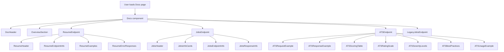
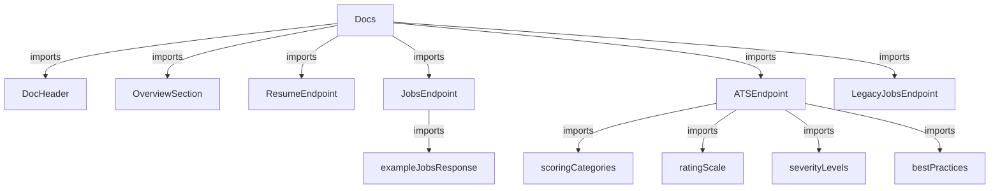

# Documentation Site

This module composes the documentation site for the JSON Resume API, integrating multiple endpoint documentation components and data examples into a cohesive user interface. It serves as the central aggregation point for API overview, resume retrieval, job recommendations, legacy compatibility, and ATS compatibility analysis documentation.

## Purpose and Scope

This page documents the core React components and data structures that render the JSON Resume API documentation site. It covers the composition of the main documentation page, the detailed endpoint documentation components, example data used for illustrating API responses, and the ATS compatibility scoring system. It does not cover the backend API implementations, data persistence, or AI processing logic.

For the API backend and AI matching mechanisms, see the Job Matching Engine page. For frontend UI components unrelated to documentation, see the UI Components page.

## Architecture Overview

The documentation site is structured as a React component tree rooted at the `Docs` function component. It imports and renders several major documentation sections as child components:

```mermaid
flowchart TD
    Docs["Docs (page.js)"] --> DocHeader["DocHeader (DocHeader.jsx)"]
    Docs --> OverviewSection["OverviewSection (OverviewSection.jsx)"]
    Docs --> ResumeEndpoint["ResumeEndpoint (ResumeEndpoint.jsx)"]
    Docs --> JobsEndpoint["JobsEndpoint (JobsEndpoint.jsx)"]
    Docs --> ATSEndpoint["ATSEndpoint (ATSEndpoint/index.jsx)"]
    Docs --> LegacyJobsEndpoint["LegacyJobsEndpoint (LegacyJobsEndpoint.jsx)"]

    ResumeEndpoint --> ResumeHeader["Header (ResumeEndpoint/Header.jsx)"]
    ResumeEndpoint --> ResumeEndpointInfo["EndpointInfo (ResumeEndpoint/EndpointInfo.jsx)"]
    ResumeEndpoint --> ResumeExamples["Examples (ResumeEndpoint/Examples.jsx)"]
    ResumeEndpoint --> ResumeErrorResponses["ErrorResponses (ResumeEndpoint/ErrorResponses.jsx)"]

    JobsEndpoint --> JobsHeader["Header (JobsEndpoint/Header.jsx)"]
    JobsEndpoint --> JobsInfoCards["InfoCards (JobsEndpoint/InfoCards.jsx)"]
    JobsEndpoint --> JobsEndpointInfo["EndpointInfo (JobsEndpoint/EndpointInfo.jsx)"]
    JobsEndpoint --> JobsResponseInfo["ResponseInfo (JobsEndpoint/ResponseInfo.jsx)"]

    ATSEndpoint --> ATSRequestExample["RequestExample (ATSEndpoint/CodeExamples.jsx)"]
    ATSEndpoint --> ATSResponseExample["ResponseExample (ATSEndpoint/CodeExamples.jsx)"]
    ATSEndpoint --> ATSUsageExample["UsageExample (ATSEndpoint/CodeExamples.jsx)"]
    ATSEndpoint --> ATSScoringTable["ScoringTable (ATSEndpoint/ScoringTable.jsx)"]
    ATSEndpoint --> ATSRatingScale["RatingScale (ATSEndpoint/Ratings.jsx)"]
    ATSEndpoint --> ATSSeverityLevels["SeverityLevels (ATSEndpoint/Ratings.jsx)"]
    ATSEndpoint --> ATSBestPractices["BestPractices (ATSEndpoint/BestPractices.jsx)"]

```

**Diagram: Component hierarchy and composition of the JSON Resume API documentation site**

Sources: `apps/registry/app/docs/page.js:8-27`, `apps/registry/app/docs/components/DocHeader.jsx:1-29`, `apps/registry/app/docs/components/OverviewSection.jsx:1-29`, `apps/registry/app/docs/components/ResumeEndpoint.jsx:1-17`, `apps/registry/app/docs/components/JobsEndpoint.jsx:1-17`, `apps/registry/app/docs/components/LegacyJobsEndpoint.jsx:1-78`, `apps/registry/app/docs/components/ATSEndpoint/index.jsx:6-46`

## Docs Component

**Purpose**: Serves as the root React component for the documentation site, orchestrating the layout and rendering all major documentation sections in a single scrollable page.

**Primary file**: `apps/registry/app/docs/page.js:8-27`

**Key behaviors:**
- Renders a container with consistent padding and max width for readability.
- Embeds the following components in order: `DocHeader`, `OverviewSection`, `ResumeEndpoint`, `JobsEndpoint`, `ATSEndpoint`, and `LegacyJobsEndpoint`.
- Applies a light gray background and white content cards with shadow for visual separation.

This component does not manage any state or data fetching; it purely composes static documentation components.

## DocHeader Component

**Purpose**: Displays the main title and introductory description of the JSON Resume API documentation, including a highlighted summary of API capabilities.

**Primary file**: `apps/registry/app/docs/components/DocHeader.jsx:1-29`

| Element | Type | Purpose |
|---------|------|---------|
| `<h1>` | JSX Element | Main page title "JSON Resume API Documentation" |
| `
` | JSX Element | Introductory paragraph describing the API's scope and features |
| `
` | JSX Element | Highlight box listing key API capabilities such as retrieving resumes, job recommendations, and integration options |

**Key behaviors:**
- Uses semantic HTML headings and paragraphs for accessibility.
- Highlights key API features in a blue tinted box with border accent.
- Text content is static and does not depend on props or state.

## OverviewSection Component

**Purpose**: Provides essential API usage information including the base URL, authentication policy, and rate limiting guidelines.

**Primary file**: `apps/registry/app/docs/components/OverviewSection.jsx:1-29`

| Element | Type | Purpose |
|---------|------|---------|
| `<h2>` | JSX Element | Section headings for "Base URL", "Authentication", and "Rate Limiting" |
| `
` | JSX Element | Displays the base URL in a monospace green-on-black style block |
| `
` | JSX Element | Descriptions of authentication (none required) and rate limiting policies |

**Key behaviors:**
- Emphasizes the public accessibility of all endpoints.
- Advises on respectful usage and caching strategies for high-volume clients.
- Uses color-coded blocks for visual clarity.

## ResumeEndpoint Component

**Purpose**: Aggregates the documentation subsections for the Resume API endpoint, including header, endpoint details, example requests/responses, and error cases.

**Primary file**: `apps/registry/app/docs/components/ResumeEndpoint.jsx:1-17`

**Key behaviors:**
- Imports and renders four subcomponents: `Header`, `EndpointInfo`, `Examples`, and `ErrorResponses`.
- Each subcomponent documents a distinct aspect of the resume retrieval API.

### ResumeEndpoint Subcomponents

#### Header (ResumeEndpoint/Header.jsx)

**Purpose**: Introduces the Resume Endpoints section with a detailed explanation of the core resume retrieval API.

**Primary file**: `apps/registry/app/docs/components/ResumeEndpoint/Header.jsx:1-32`

| Element | Type | Purpose |
|---------|------|---------|
| `<h1>` | JSX Element | Section title "Resume Endpoints" |
| `<h2>` | JSX Element | Subsection title "Get Resume" |
| `
` | JSX Element | Description of the endpoint's ability to retrieve resume data in multiple formats |
| `
` | JSX Element | Green info box listing use cases such as displaying resumes, generating PDFs, and extracting data |

**Key behaviors:**
- Explains the endpoint as the core of the JSON Resume platform.
- Highlights supported output formats: JSON, HTML, PDF, and themes.
- Emphasizes structured data access for diverse applications.

#### EndpointInfo (ResumeEndpoint/EndpointInfo.jsx)

**Purpose**: Details the endpoint URL patterns, parameters, query options, and advanced schema validation bypass.

**Primary file**: `apps/registry/app/docs/components/ResumeEndpoint/EndpointInfo.jsx:1-77`

| Field | Type | Purpose |
|-------|------|---------|
| Endpoint URLs | string | `GET /api/{username}` and `GET /api/{username}.{format}` endpoint patterns |
| Parameters | object | `username` (required), `format` (optional) specifying output format |
| Query Parameters | object | `theme` (optional) to override resume theme, `gistname` (optional) to specify gist filename |
| Schema Validation Bypass | boolean flag | `meta.skipValidation` allows skipping JSON Resume schema validation for experimental resumes |

**Key behaviors:**
- Supports multiple output formats via URL extension.
- Allows theme customization via query parameters.
- Provides an escape hatch for non-standard resumes with a validation bypass flag.
- Warns about potential rendering issues when bypassing validation.

#### Examples (ResumeEndpoint/Examples.jsx)

**Purpose**: Provides example HTTP requests and sample JSON response illustrating the resume endpoint usage.

**Primary file**: `apps/registry/app/docs/components/ResumeEndpoint/Examples.jsx:1-57`

| Element | Type | Purpose |
|---------|------|---------|
| Example Requests | JSX Elements | Three GET requests showing default, JSON, and PDF formats |
| Response Description | JSX Element | Explains the response format behavior for each output type |
| Example JSON Response | JSX Element | Preformatted JSON snippet showing typical resume data structure |

**Key behaviors:**
- Demonstrates URL patterns for retrieving resumes.
- Shows a realistic JSON response with basics, work, education, and skills sections.
- Clarifies default HTML rendering vs raw JSON and PDF generation.

#### ErrorResponses (ResumeEndpoint/ErrorResponses.jsx)

**Purpose**: Lists possible error responses for the resume endpoint.

**Primary file**: `apps/registry/app/docs/components/ResumeEndpoint/ErrorResponses.jsx:1-21`

| HTTP Status | Description |
|-------------|-------------|
| 400 Bad Request | Invalid username or unsupported format |
| 404 Not Found | Resume not found for the specified username |

**Key behaviors:**
- Enumerates client and server error cases.
- Uses red tinted box for error emphasis.

## JobsEndpoint Component

**Purpose**: Aggregates the documentation subsections for the Jobs API endpoint, including header, informational cards, endpoint details, and response format.

**Primary file**: `apps/registry/app/docs/components/JobsEndpoint.jsx:1-17`

**Key behaviors:**
- Imports and renders four subcomponents: `Header`, `InfoCards`, `EndpointInfo`, and `ResponseInfo`.
- Each subcomponent documents a distinct aspect of the job recommendations API.

### JobsEndpoint Subcomponents

#### Header (JobsEndpoint/Header.jsx)

**Purpose**: Introduces the Jobs Endpoints section with a description of the AI-powered job recommendation API.

**Primary file**: `apps/registry/app/docs/components/JobsEndpoint/Header.jsx:1-19`

| Element | Type | Purpose |
|---------|------|---------|
| `<h1>` | JSX Element | Section title "Jobs Endpoints" |
| `<h2>` | JSX Element | Subsection title "Get Relevant Jobs (New)" |
| `
` | JSX Element | Description of AI-based job matching using resume analysis |

**Key behaviors:**
- Emphasizes machine learning analysis of resume content.
- Highlights extraction of skills and experience for matching.
- Describes matching against a current job postings database.

#### InfoCards (JobsEndpoint/InfoCards.jsx)

**Purpose**: Provides informational cards explaining how the job matching works and typical use cases.

**Primary file**: `apps/registry/app/docs/components/JobsEndpoint/InfoCards.jsx:1-33`

| Card | Content Summary |
|------|-----------------|
| How it works | GPT-4 summary generation, semantic embeddings, vector similarity search, freshness of jobs |
| Use Cases | Job recommendation engines, career guidance, recruitment integrations, personal automation |

**Key behaviors:**
- Details the AI pipeline steps.
- Lists practical applications for the endpoint.

#### EndpointInfo (JobsEndpoint/EndpointInfo.jsx)

**Purpose**: Specifies the endpoint URL, required parameters, and example request for the jobs API.

**Primary file**: `apps/registry/app/docs/components/JobsEndpoint/EndpointInfo.jsx:1-30`

| Field | Type | Purpose |
|-------|------|---------|
| Endpoint URL | string | `GET /api/{username}/jobs` |
| Parameters | object | `username` (required) specifying the user to find jobs for |
| Example Request | string | `GET /api/thomasdavis/jobs` |

**Key behaviors:**
- Defines RESTful endpoint pattern.
- Requires existing resume for the username.

#### ResponseInfo (JobsEndpoint/ResponseInfo.jsx)

**Purpose**: Describes the response format for the jobs endpoint, including example data and field definitions.

**Primary file**: `apps/registry/app/docs/components/JobsEndpoint/ResponseInfo.jsx:3-43`

| Field | Type | Purpose |
|-------|------|---------|
| jobId | number | Unique identifier for the job posting |
| score | number | AI-calculated relevance score (0-1 scale) |
| url | string | Direct link to the original job posting |
| raw | string | JSON string containing full job description and metadata |

**Key behaviors:**
- Returns up to 500 job recommendations sorted by relevance.
- Includes full job description content for client rendering.
- Uses `exampleJobsResponse` as the canonical example dataset.

## exampleJobsResponse Variable

**Purpose**: Provides a detailed example array of job recommendation objects used in documentation to illustrate the jobs endpoint response format.

**Primary file**: `apps/registry/app/docs/data/exampleData.js:1-66`

This variable is an array of job objects, each with the following fields:

| Field | Type | Purpose |
|-------|------|---------|
| jobId | number | Unique job posting identifier |
| score | number | AI relevance score between 0 and 1 |
| url | string | URL to the original job posting |
| raw | string (JSON) | Stringified JSON object containing detailed job info |

Each `raw` JSON object includes:

| Field | Type | Purpose |
|-------|------|---------|
| title | string | Job title |
| company | string | Company name |
| location | object | Location details with fields: address, city, region, postalCode, countryCode |
| position | string | Position title |
| type | string | Employment type (e.g., Contract, Full-time) |
| salary | string | Salary information (may be empty) |
| date | string | Posting date in YYYY-MM format |
| remote | string | Remote work status (e.g., Full) |
| description | string | Full job description text |
| responsibilities | array of strings | List of job responsibilities |
| qualifications | array of strings | Required qualifications |
| skills | array of objects | Skill entries with `name`, `level`, and `keywords` array |
| experience | string | Experience level (e.g., Senior) |
| application | string (optional) | URL for application |

**Key behaviors:**
- Demonstrates the nested structure of job data.
- Shows variability in location completeness.
- Includes rich skill metadata with levels and keywords.
- Supports optional application URLs.

## LegacyJobsEndpoint Component

**Purpose**: Documents the legacy job recommendations endpoint that uses query parameters instead of RESTful URLs, maintained for backward compatibility.

**Primary file**: `apps/registry/app/docs/components/LegacyJobsEndpoint.jsx:1-78`

**Key behaviors:**
- Describes the endpoint `GET /api/relevant-jobs?username={username}`.
- Explains that it provides the same AI-powered job matching as the new endpoint.
- Recommends migration to the new RESTful endpoint for better caching and conventions.
- Lists required query parameter `username`.
- Provides example request and response format.
- Enumerates error responses: 400 Bad Request, 404 Not Found, 500 Internal Server Error.
- Uses orange tinted box for migration notice.

## ATS Endpoint Components

The ATS (Applicant Tracking System) compatibility analysis endpoint provides detailed resume scoring and recommendations to improve automated screening success.

### ATSEndpoint Component

**Purpose**: Aggregates the ATS compatibility analysis documentation, including endpoint description, scoring, examples, ratings, severity levels, best practices, and usage.

**Primary file**: `apps/registry/app/docs/components/ATSEndpoint/index.jsx:6-46`

**Key behaviors:**
- Renders a section with a header and description.
- Documents the `POST /api/ats` endpoint.
- Includes subcomponents for request/response examples, scoring table, rating scale, severity levels, best practices, and usage example.
- Provides a URL pattern for viewing detailed ATS scores per user.

### Request and Response Examples

**requestBodyExample** (`apps/registry/app/docs/components/ATSEndpoint/examples.js:5-23`)

- JSON structure showing a resume object with basics, work, education, skills, and optional theme.
- Demonstrates the expected POST request body for ATS analysis.

**responseExample** (`apps/registry/app/docs/components/ATSEndpoint/examples.js:25-62`)

- JSON response showing overall score, rating, summary, detailed checks with scores and issues, and recommendations.
- Illustrates severity levels and fix suggestions for resume issues.

**usageExample** (`apps/registry/app/docs/components/ATSEndpoint/examples.js:64-77`)

- JavaScript snippet demonstrating fetching a resume and posting it to the ATS endpoint.
- Logs the ATS score and number of recommendations.

### Scoring Data

**scoringCategories** (`apps/registry/app/docs/components/ATSEndpoint/data.js:5-41`)

| Category | Points | Description |
|----------|--------|-------------|
| Contact Information | 20 | Completeness and validity of name, email, phone, location |
| Work Experience | 20 | Presence of company names, job titles, dates, descriptions, highlights |
| Education | 15 | Institution names, degrees, study areas |
| Skills | 15 | Skill categories, keyword count, variety |
| Keywords & Content | 15 | Summary length, highlights count, overall word count |
| Date Formatting | 10 | Consistent date formats, no missing dates |
| Theme Compatibility | 5 | Use of ATS-friendly themes |

**ratingScale** (`apps/registry/app/docs/components/ATSEndpoint/data.js:43-64`)

- Five rating levels from "Excellent (90-100)" to "Needs Improvement (0-39)" with descriptions of ATS optimization quality.

**severityLevels** (`apps/registry/app/docs/components/ATSEndpoint/data.js:66-83`)

- Three severity levels: Critical (missing required fields), Warning (missing recommended fields), Info (optimization suggestions).
- Each level includes a color class for UI display.

**bestPractices** (`apps/registry/app/docs/components/ATSEndpoint/data.js:85-95`)

- List of tips for ATS success, including standard headings, keywords, avoiding complex formatting, consistent dates, achievements, and ATS-friendly themes.

### ScoringTable Component

**Purpose**: Renders a table summarizing the ATS scoring categories, points, and what each category checks.

**Primary file**: `apps/registry/app/docs/components/ATSEndpoint/ScoringTable.jsx:3-43`

**Key behaviors:**
- Maps over `scoringCategories` to render rows.
- Uses semantic table markup with headers for category, points, and description.

### Ratings Components

**RatingScale** and **SeverityLevels** (`apps/registry/app/docs/components/ATSEndpoint/Ratings.jsx:3-37`)

- Render lists describing the rating scale and severity levels with appropriate styling.

### CodeExamples Components

**RequestExample**, **ResponseExample**, **UsageExample** (`apps/registry/app/docs/components/ATSEndpoint/CodeExamples.jsx:3-40`)

- Render preformatted code blocks showing request body, response, and example usage respectively.
- Use imported example strings for content.

### BestPractices Component

**Purpose**: Displays a styled list of best practices for optimizing resumes for ATS compatibility.

**Primary file**: `apps/registry/app/docs/components/ATSEndpoint/BestPractices.jsx:3-38`

**Key behaviors:**
- Uses a blue info box with icon.
- Lists best practices imported from data.

## How It Works: Documentation Site Composition

The documentation site renders as a single-page React application composed of multiple modular components, each responsible for a distinct section of the API documentation.

**Diagram: Data flow and component rendering sequence for the documentation site**

Sources: `apps/registry/app/docs/page.js:8-27`, `apps/registry/app/docs/components/ResumeEndpoint.jsx:1-17`, `apps/registry/app/docs/components/JobsEndpoint.jsx:1-17`, `apps/registry/app/docs/components/ATSEndpoint/index.jsx:6-46`, `apps/registry/app/docs/components/LegacyJobsEndpoint.jsx:1-78`

- The `Docs` component acts as the root container, rendering all documentation sections in order.
- Each endpoint section (`ResumeEndpoint`, `JobsEndpoint`, `ATSEndpoint`, `LegacyJobsEndpoint`) imports and renders its own header, endpoint details, examples, and error or response information.
- The `exampleJobsResponse` variable provides a realistic dataset for illustrating the jobs endpoint response.
- The ATS endpoint documentation includes detailed scoring categories, rating scales, severity levels, and best practices, all rendered through dedicated components.
- The legacy jobs endpoint is documented separately to highlight migration guidance and backward compatibility.

## Key Relationships

The documentation site depends on static data and modular React components to present API details. It does not interact with backend services directly but relies on example data (`exampleJobsResponse`) to illustrate responses.

**Relationships between documentation components and data sources**

Sources: `apps/registry/app/docs/page.js:8-27`, `apps/registry/app/docs/data/exampleData.js:1-66`, `apps/registry/app/docs/components/ATSEndpoint/data.js:5-95`