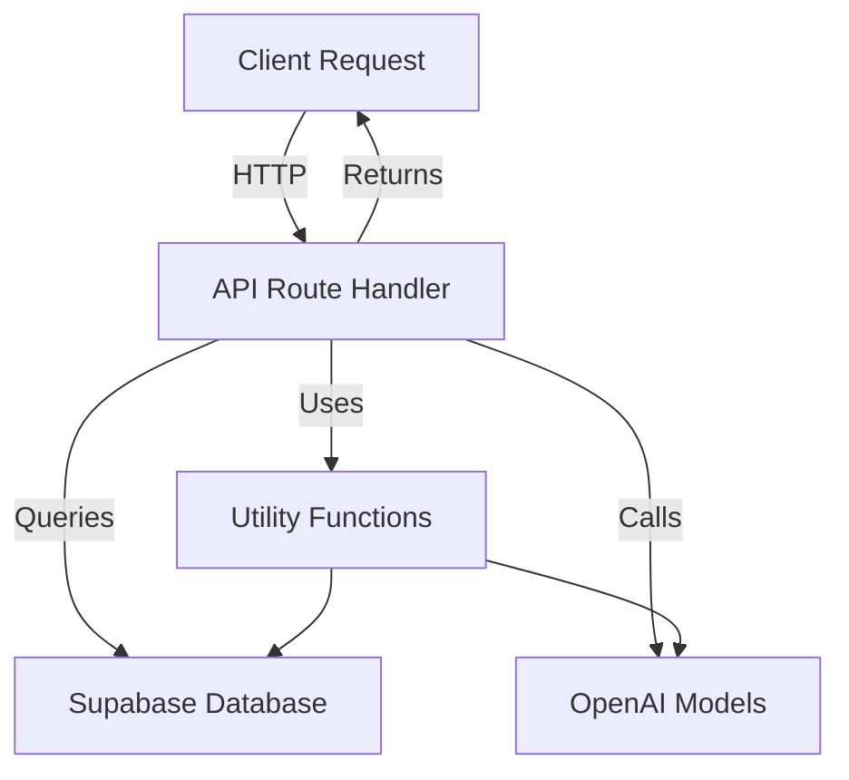
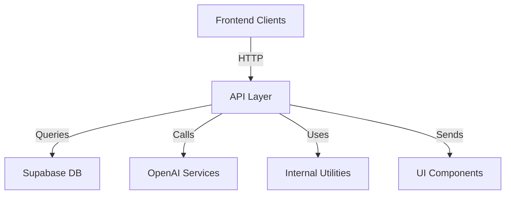

# API Layer

The API Layer implements the backend route handlers and utility functions that power core features such as authentication, resume management, job matching, pathways, chat interactions, and report generation. It interfaces primarily with Supabase for data storage and retrieval, and OpenAI for AI-driven text generation and embeddings. This layer orchestrates data flow between client requests, database queries, AI models, and response formatting.

## Purpose and Scope

This page documents the internal mechanisms of the API route handlers and utilities responsible for authentication, resumes, jobs, pathways, chat, and reports. It covers the key API endpoints, their data flows, and integration with AI and database services. It does not cover frontend UI components, client-side logic, or external services beyond Supabase and OpenAI. For authentication specifics, see the Auth API documentation. For resume formatting and rendering, see the Resume Formatter subsystem.

## Architecture Overview

The API Layer is organized into route handlers grouped by domain (e.g., `/api/jobs`, `/api/resumes`, `/api/pathways`). Each handler typically performs authentication, fetches or updates data in Supabase, optionally invokes OpenAI models for text generation or embeddings, and returns structured JSON or streamed responses. Utilities support embedding creation, job matching, resume patching, and analytics computations.

**Diagram: High-level data flow in the API Layer**

Sources: `apps/registry/pages/api/*.js`, `apps/registry/app/api/v1/*.js`

---

## Resume Suggestions API

The resume suggestions endpoints provide AI-generated feedback on user resumes, leveraging OpenAI models to analyze JSON Resume data and return improvement advice.

### `/api/suggestions.js` Handler

- **Purpose**: Generates brief, structured suggestions for improving a user's resume based on JSON Resume data.
- **File**: `apps/registry/pages/api/suggestions.js:5-63`

**How it works**:
- Receives a POST request with `{ username }` in the body.
- Lazily loads Supabase client and fetches the user's resume JSON from the `resumes` table.
- Converts the resume JSON to YAML for readability.
- Constructs a detailed system prompt instructing the AI to provide specific, brief, structured feedback on the resume.
- Calls `generateText` with the GPT-4o model, passing the prompt as system message.
- Returns the AI-generated text response or an error JSON.

**Key variables**:
- `username`: The target user's username.
- `resume`: Parsed JSON resume from database.
- `content`: YAML string of the resume.
- `prompt`: Multi-line string with instructions for the AI.
- `text`: AI-generated suggestions.

**Failure modes**:
- Missing or invalid username results in database query failure.
- AI call failures return HTTP 500 with error message.

Sources: `apps/registry/pages/api/suggestions.js:5-63`

### `/api/suggestions-beta.js` Handler

- **Purpose**: Enhanced suggestions endpoint supporting configurable brevity and sentiment, and structured JSON output via AI tool calls.
- **File**: `apps/registry/pages/api/suggestions-beta.js:22-160`

**How it works**:
- Accepts POST with `{ username, brevity, sentiment }`.
- Fetches resume JSON from Supabase.
- Converts resume to YAML.
- Builds a prompt array with base instructions plus modifiers based on `brevity` (terse/moderate/verbose) and `sentiment` (modest/factual/beginner).
- Calls `generateText` with GPT-4o model and a tool schema `jsonresumeSuggestion` that expects structured suggestions keyed by JSON Resume schema paths.
- If the AI returns a tool call, extracts and returns the structured suggestions.
- Otherwise, falls back to returning plain text.

**Key variables**:
- `BREVITY`: Enum for verbosity levels.
- `prompt`: Array of prompt strings concatenated for system message.
- `result`: AI response object with possible tool calls.
- `toolCall`: First tool call extracted from AI response.

**Failure modes**:
- Missing username defaults to 'thomasdavis'.
- AI tool call may not be invoked; fallback to text response.
- Errors return HTTP 500 with error message.

Sources: `apps/registry/pages/api/suggestions-beta.js:22-160`

---

## Job Matching and Embeddings

Several endpoints generate semantic embeddings from resumes and match them against job postings using vector similarity and AI reranking.

### `/api/relevant-jobs.js` Handler

- **Purpose**: Returns a list of jobs most relevant to a user's resume by embedding similarity.
- **File**: `apps/registry/pages/api/relevant-jobs.js:4-123`

**How it works**:
- Accepts GET with `username` query parameter.
- Fetches the user's resume JSON from Supabase.
- Generates a natural language professional summary of the resume using GPT-4o-mini.
- Creates a 3072-dimensional embedding vector from the summary.
- Calls a Supabase RPC `match_jobs_v5` to find jobs with embeddings similar to the resume embedding.
- Fetches full job data for matched job IDs.
- Sorts jobs by similarity score descending.
- Returns up to 500 jobs with job ID, similarity score, URL, and raw GPT content.
- Sets HTTP cache headers for CDN caching.

**Key variables**:
- `resumeDescription`: AI-generated resume summary.
- `embedding`: Padded embedding vector.
- `documents`: Raw matched job documents with similarity.
- `jobsResult`: Final job list with metadata.

**Failure modes**:
- Missing username returns 400.
- Missing OpenAI API key throws error.
- Database or AI errors return 500.

Sources: `apps/registry/pages/api/relevant-jobs.js:4-123`

### `/api/jobs.js` Handler

- **Purpose**: Similar to `/api/relevant-jobs`, matches jobs to a user's resume with additional filtering and logging.
- **File**: `apps/registry/pages/api/jobs.js:8-131`

**How it works**:
- Accepts POST with `{ username }`.
- Fetches resume JSON and generates professional summary and embedding.
- Calls Supabase RPC to match jobs.
- Fetches full job data and enriches with similarity scores.
- Logs date range and validity of job posting dates.
- Filters jobs to those posted within last 60 days.
- Returns filtered jobs sorted by similarity.

**Key variables**:
- `jobsWithSimilarity`: Jobs enriched with similarity scores.
- `validDates`: Valid job posting dates.
- `filteredJobs`: Jobs filtered by recency.

**Failure modes**:
- Database errors return 500.
- No resume found returns 404.

Sources: `apps/registry/pages/api/jobs.js:8-131`

### `/api/jobs-graph.js` Handler

- **Purpose**: Provides a graph representation of job matches for visualization and analysis.
- **File**: `apps/registry/pages/api/jobs-graph.js:12-67`

**How it works**:
- Accepts GET with `username` query.
- Fetches resume, generates description, embedding, and matches jobs.
- Splits matched jobs into top 10 most relevant and others.
- Builds graph data with nodes and links connecting resume and jobs.
- Builds a job info map with parsed job content and salary data.
- Returns graph data, job info map, and job lists.

**Key variables**:
- `graphData`: Nodes and links representing resume and jobs.
- `jobInfoMap`: Map of job UUIDs to parsed content.
- `topJobs`, `otherJobs`: Partitioned job lists.

Sources: `apps/registry/pages/api/jobs-graph.js:12-67`

### Job Matching Utilities

- `matchJobs(embedding)` — Matches jobs by embedding similarity using Supabase RPC and returns sorted jobs with similarity scores. `apps/registry/pages/api/jobs-graph/matchJobs.js:6-45`
- `generateResumeDescription(resume)` — Generates a professional summary from resume JSON using AI. `apps/registry/pages/api/jobs-graph/generateResumeDescription.js:9-26`
- `fetchResumeData(username)` — Fetches and parses resume JSON from Supabase. `apps/registry/pages/api/jobs-graph/fetchResumeData.js:6-26`
- `createEmbedding(text)` — Creates a padded embedding vector from text using AI SDK. `apps/registry/pages/api/jobs-graph/createEmbedding.js:9-30`
- `buildGraphData(username, resume, topJobs, otherJobs)` — Builds graph nodes and links for jobs and resume. `apps/registry/pages/api/jobs-graph/buildGraphData.js:11-115`
- `buildJobInfoMap(jobs)` — Creates a map of job UUIDs to parsed job content and salary info. `apps/registry/pages/api/jobs-graph/buildGraphData.js:122-144`

Sources: `apps/registry/pages/api/jobs-graph/*.js`

---

## OpenAI Streaming API

### `OpenAIStream(payload)`

- **Purpose**: Wraps OpenAI completion API to provide a streaming response compatible with ReadableStream.
- **File**: `apps/registry/pages/api/openAIStream.js:3-55`

**How it works**:
- Sends a POST request to OpenAI completions endpoint with the given payload.
- Uses `eventsource-parser` to parse streaming SSE events from OpenAI.
- Filters out initial newlines to avoid empty chunks.
- Enqueues decoded text chunks into a ReadableStream.
- Closes stream on `[DONE]` event or errors.

**Internal members**:
- `encoder` and `decoder`: Text encoder/decoder for UTF-8.
- `counter`: Tracks number of chunks emitted to skip initial newlines.
- `res`: Fetch response from OpenAI.
- `stream`: ReadableStream instance with `start` method.
- `onParse(event)`: SSE event handler parsing JSON and enqueuing text.

**Failure modes**:
- JSON parse errors cause stream error.
- Network failures propagate as stream errors.

Sources: `apps/registry/pages/api/openAIStream.js:3-55`

---

## Cover Letter Generation API

### `/api/letter.js` Handler

- **Purpose**: Generates a cover letter for a user applying to a job, using their resume and optional job description.
- **File**: `apps/registry/pages/api/letter.js:10-79`

**How it works**:
- Accepts POST with `{ username, jobDescription, tone }`.
- Fetches user's resume JSON from Supabase.
- Constructs a prompt including the resume JSON and optional job description.
- Instructs AI to write a short cover letter in the specified tone, formatted in Markdown.
- Calls OpenAI GPT-4o with temperature 0.85.
- Sends a Discord notification about feature usage asynchronously.
- Returns generated cover letter text or error JSON.

**Key variables**:
- `resumeString`: JSON stringified resume.
- `prompt`: Array of prompt parts concatenated.
- `text`: AI-generated cover letter.

**Failure modes**:
- Missing username or resume returns error.
- Discord notification failures are logged but do not affect response.

Sources: `apps/registry/pages/api/letter.js:10-79`

---

## Job State Management API

### `/api/job-states/route.js`

- **Purpose**: Manages job state metadata (e.g., read, interested, hidden) for users.
- **File**: `apps/registry/app/api/job-states/route.js:5-185`

**How it works**:
- `GET` accepts `username` or `userId` query, fetches job states from Supabase, returns map of job IDs to states.
- `POST` accepts JSON body with `username` or `userId`, `jobId`, and `state` (or null to delete).
- Validates inputs and state values.
- Resolves user ID from username if needed.
- Inserts, updates, or deletes job state records in Supabase.
- Returns success or error JSON.

**Key constants**:
- `VALID_STATES`: Allowed states are `'read'`, `'interested'`, `'hidden'`.

**Failure modes**:
- Missing parameters return 400.
- Database errors return 500.
- Unknown user returns 404.

Sources: `apps/registry/app/api/job-states/route.js:5-185`

---

## Pathways Preferences API

### `/api/pathways/preferences.js` Handler

- **Purpose**: Fetches and updates user preferences for the pathways job search experience.
- **File**: `apps/registry/pages/api/pathways/preferences.js:8-91`

**How it works**:
- Accepts GET with `userId` query to load preferences from Supabase.
- Returns default preferences if none found.
- Accepts POST with preference fields to upsert preferences.
- Fields include filter text, salary gradient toggle, remote-only toggle, time range, and viewport settings.
- Returns success or error JSON.

**Failure modes**:
- Missing `userId` returns 400.
- Database errors return 500.
- Handles no rows found gracefully.

Sources: `apps/registry/pages/api/pathways/preferences.js:8-91`

---

## Pathways Conversations API

### `/api/pathways/conversations/route.js`

- **Purpose**: Manages user conversations in the pathways chat, supporting pagination and storage limits.
- **File**: `apps/registry/app/api/pathways/conversations/route.js:4-197`

**How it works**:
- `GET` accepts `sessionId` or `userId`, with pagination params `limit` and `offset`.
- Fetches conversation and returns paginated messages sorted newest-last.
- `POST` accepts conversation messages and optional resume snapshot.
- Caps stored messages to 100 to prevent unbounded growth.
- Inserts or updates conversation in Supabase.
- `DELETE` removes conversation for user or session.

**Failure modes**:
- Missing identifiers returns 400.
- Database errors return 500.

Sources: `apps/registry/app/api/pathways/conversations/route.js:4-197`

---

## Pathways Resume API

### `/api/pathways/resume/route.js`

- **Purpose**: CRUD operations on user resumes with support for patch diffs and history tracking.
- **File**: `apps/registry/app/api/pathways/resume/route.js:13-160`

**How it works**:
- `GET` fetches resume by `userId` or `sessionId`.
- `POST` creates a new resume or applies patch diffs if `diff` and `replace` flags are present.
- `PATCH` applies diffs to existing resume, saving change history.
- `DELETE` removes resume and all history.
- Uses helper functions to validate identifiers, build queries, apply diffs, and save history.

**Failure modes**:
- Missing identifiers returns 400.
- Invalid JSON or diff returns 400.
- Database errors return 500.

Sources: `apps/registry/app/api/pathways/resume/route.js:13-160`

---

## Pathways Match Insights API

### `/api/pathways/match-insights/route.js`

- **Purpose**: Generates and caches AI-powered insights explaining why a user is a good fit for a job.
- **File**: `apps/registry/app/api/pathways/match-insights/route.js:13-138`

**How it works**:
- `POST` accepts `{ userId, jobId, resume, job }`.
- Checks rate limits.
- Computes hashes of resume and job to check cache.
- If cached insights exist and hashes match, returns cached data.
- Otherwise, calls AI with a structured prompt and schema to generate insights.
- Upserts insights into Supabase cache.
- `GET` fetches cached insights by `userId` and `jobId`.

**Key utilities**:
- `hashContent`: MD5 hash of JSON content for cache validation.
- `insightsSchema`: Zod schema defining expected insight structure.
- `SYSTEM_PROMPT` and `buildInsightsPrompt`: AI prompt templates.

**Failure modes**:
- Missing parameters return 400.
- Cache miss triggers AI call.
- AI or DB errors return 500.

Sources: `apps/registry/app/api/pathways/match-insights/route.js:13-138`, `apps/registry/app/api/pathways/match-insights/insightsConfig.js:3-96`

---

## Job Matching Helpers

### `matchingHelpers.js`

- **Purpose**: Provides vector operations, embedding generation, and job matching logic with reranking.
- **File**: `apps/registry/app/api/v1/jobs/matchingHelpers.js:6-293`

**Key functions**:
- `getSupabase()`: Returns Supabase client.
- `normalize(vec)`: Normalizes a vector to unit length.
- `interpolate(vecA, vecB, alpha)`: Weighted blend of two vectors, normalized.
- `subtractDirection(vec, negVec, weight)`: Subtracts a weighted negative vector for feedback adjustment.
- `timeDecayScore(similarity, postedAt)`: Applies exponential decay boost based on job posting age.
- `generateHydeEmbedding(resumeText)`: Generates a hypothetical ideal job posting embedding (HyDE) for better matching.
- `averageEmbeddings(embeddings)`: Computes average normalized embedding from a list.
- `getResumeEmbedding(resume)`: Extracts text from resume and generates embedding.
- `rerankJobs(jobs, resumeText, searchPrompt)`: Uses AI to rerank jobs in batches based on resume and search context.
- `matchJobs(params)`: Fetches matched jobs from Supabase, filters, optionally reranks, and returns sorted results.

**Failure modes**:
- Throws on missing API keys or DB errors.
- Reranking failures fallback to vector similarity order.

Sources: `apps/registry/app/api/v1/jobs/matchingHelpers.js:6-293`

---

## Global Remote Job Classification

### `globalRemote.js`

- **Purpose**: Classifies "Full" remote jobs as globally remote or region-restricted using heuristics and AI.
- **File**: `apps/registry/app/api/v1/jobs/globalRemote.js:5-102`

**How it works**:
- Caches classification results in-memory.
- For each full remote job:
  - Checks location text for global keywords or regional restrictions.
  - If ambiguous, batches jobs and calls AI to classify as global or restricted.
- Marks non-full-remote jobs as not global.

**Failure modes**:
- AI classification failures mark jobs with null global_remote.
- Cache persists only in warm server instances.

Sources: `apps/registry/app/api/v1/jobs/globalRemote.js:5-102`

---

## Job Graph Construction

### `graphBuilder.js`

- **Purpose**: Builds a job similarity graph using VP-tree nearest neighbor search for efficient layout.
- **File**: `apps/registry/app/api/pathways/jobs/graphBuilder.js:6-195`

**How it works**:
- Parses and pre-normalizes job embeddings.
- Normalizes resume embedding.
- Sorts jobs by similarity to resume.
- Selects primary jobs (top N) connected directly to resume node.
- Uses VP-tree to find nearest neighbors for secondary jobs, limiting children per node.
- Builds nodes and links arrays with job metadata and similarity scores.
- Ensures graph connectivity by reconnecting orphan nodes.
- Computes nearest neighbors for each job.
- Returns graph data with nodes, links, nearest neighbors, and top branches.

**Key constants**:
- `PRIMARY_BRANCHES`: Number of primary connections to resume.
- `MAX_CHILDREN_PER_NODE`: Limit on children per node.
- `SECONDARY_SEARCH_K`: Number of neighbors to consider for secondary jobs.

Sources: `apps/registry/app/api/pathways/jobs/graphBuilder.js:6-195`

### `vpTree.js`

- **Purpose**: Implements a vantage-point tree for fast k-nearest neighbor queries on pre-normalized embeddings.
- **File**: `apps/registry/app/api/pathways/jobs/vpTree.js:6-100`

**Key methods**:
- `constructor(points)`: Builds VP-tree recursively.
- `_build(points)`: Recursive tree construction using median distance threshold.
- `kNearest(query, k, allowedIds)`: Returns top-k nearest neighbors by cosine similarity.
- `_search(node, query, k, heap, allowedIds)`: Recursive search with branch pruning.

**Failure modes**:
- Handles empty or single-point trees gracefully.
- Prunes search branches using triangle inequality.

Sources: `apps/registry/app/api/pathways/jobs/vpTree.js:6-100`

### `graphConnectivity.js`

- **Purpose**: Ensures all graph nodes are reachable from the root by reconnecting orphan subgraphs.
- **File**: `apps/registry/app/api/pathways/jobs/graphConnectivity.js:9-76`

**How it works**:
- Builds adjacency list from links.
- Performs BFS from root node to find reachable nodes.
- Identifies orphan nodes and reconnects them to root with similarity-weighted links.
- Logs orphan count and connectivity stats.

Sources: `apps/registry/app/api/pathways/jobs/graphConnectivity.js:9-76`

---

## Candidate Matching API

### `/api/candidates.js` Handler

- **Purpose**: Fetches candidates matched to a job by embedding similarity and formats their data.
- **File**: `apps/registry/pages/api/candidates.js:6-49`

**How it works**:
- Requires `jobId` query parameter.
- Fetches job data and embedding from Supabase.
- Calls `matchResumes` to find matching resumes by embedding similarity.
- Formats matched candidates with gravatar fallback images.
- Returns candidates list and job metadata.

Sources: `apps/registry/pages/api/candidates.js:6-49`

### `matchResumes(supabase, embedding)`

- Calls Supabase RPC `match_resumes_v5` with embedding to find similar resumes.
- Returns matches or error object.

Sources: `apps/registry/pages/api/candidates/matchResumes.js:1-17`

### `formatCandidates(matches)`

- Parses resume JSON for each match.
- Extracts user info: username, similarity, label, image, name, location, skills, headline.
- Uses gravatar for fallback images.
- Handles parse errors gracefully.

Sources: `apps/registry/pages/api/candidates/formatCandidates.js:3-45`

---

## Chat API

### `/api/chat/route.js`

- **Purpose**: Handles chat interactions with AI assistant for resume editing.
- **File**: `apps/registry/app/api/chat/route.js:9-41`

**How it works**:
- Accepts POST with chat messages and current resume state.
- Calls OpenAI GPT-4 with system prompt and resume context.
- Uses `RESUME_TOOL_SCHEMA` to enable structured resume update suggestions.
- Processes AI response to detect tool calls and returns suggested changes or text.

Sources: `apps/registry/app/api/chat/route.js:9-41`

### `processToolResponse(result)`

- Checks if AI response includes tool calls.
- If `update_resume` tool called, extracts changes and explanation.
- Returns JSON with message and suggested changes.
- Otherwise returns plain text message.

Sources: `apps/registry/app/api/chat/utils/processToolResponse.js:3-21`

---

## Resume Formatting and Themes

### `/api/themes.js` Handler

- **Purpose**: Provides URLs for all available resume themes.
- **File**: `apps/registry/pages/api/themes.js:3-12`

**How it works**:
- Imports `THEMES` object from template formatter.
- Constructs URLs for each theme pointing to the user's resume with that theme.
- Returns a JSON object mapping theme names to URLs.

Sources: `apps/registry/pages/api/themes.js:3-12`

### `/api/theme/[theme].js` Handler

- **Purpose**: Renders a resume using a specified theme.
- **File**: `apps/registry/pages/api/theme/[theme].js:4-10`

**How it works**:
- Accepts POST with `{ theme, resume }`.
- Uses template formatter to render resume with the theme.
- Returns rendered content.

Sources: `apps/registry/pages/api/theme/[theme].js:4-10`

---

## Resume Export API

### `/api/export.js` Handler

- **Purpose**: Expands a search prompt into a professional profile and returns matching resumes.
- **File**: `apps/registry/pages/api/export.js:7-70`

**How it works**:
- Accepts GET with `prompt` and optional `limit`.
- Calls AI to expand prompt into detailed profile description.
- Creates embedding from expanded prompt.
- Calls Supabase RPC `match_resumes_v5` with embedding.
- Returns matched resumes with similarity scores and parsed JSON.

Sources: `apps/registry/pages/api/export.js:7-70`

---

## Rate Limiting Utility

### `rateLimit.js`

- **Purpose**: Implements a simple in-memory sliding window rate limiter per IP.
- **File**: `apps/registry/app/api/pathways/rateLimit.js:6-69`

**How it works**:
- Maintains a map of IP addresses to arrays of request timestamps.
- Cleans expired timestamps every 5 minutes.
- `checkRateLimit(ip)` returns if IP is limited and remaining requests.
- `rateLimitResponse(request)` returns a 429 Response if limited, else null.

Sources: `apps/registry/app/api/pathways/rateLimit.js:6-69`

---

## Speech and Transcription APIs

### `/api/transcribe/route.js`

- **Purpose**: Transcribes audio files to text using Whisper model.
- **File**: `apps/registry/app/api/transcribe/route.js:8-52`

**How it works**:
- Accepts POST with multipart form containing audio file.
- Validates file presence and size (max 25MB).
- Calls Whisper transcription model.
- Returns transcription text, language, and duration.

Sources: `apps/registry/app/api/transcribe/route.js:8-52`

### `/api/speech/route.js`

- **Purpose**: Generates speech audio from text using TTS model.
- **File**: `apps/registry/app/api/speech/route.js:8-74`

**How it works**:
- Accepts POST with `{ text, voice }`.
- Validates text presence and length (max 4096 chars).
- Validates voice against allowed list.
- Calls TTS model to generate audio.
- Extracts audio data from various formats.
- Returns audio binary with appropriate headers.

Sources: `apps/registry/app/api/speech/route.js:8-74`

---

## Resume Patch Helpers

### `resumeHelpers.js`

- **Purpose**: Provides helper functions to query, insert, validate, and patch resumes with history tracking.
- **File**: `apps/registry/app/api/pathways/resume/resumeHelpers.js:6-135`

**Key functions**:
- `buildUserQuery(supabase, table, { userId, sessionId })`: Builds Supabase query filtered by user/session.
- `buildInsertData(data, { userId, sessionId })`: Adds user/session ID to insert data.
- `validateIdentifier({ sessionId, userId })`: Validates presence of user/session ID.
- `applyResumePatch(supabase, params)`: Applies diff patch or creates new resume, saves history.
- `createResumeWithHistory(supabase, params)`: Inserts new resume and initial history.
- `saveHistory(supabase, params)`: Inserts a history record for resume changes.

Sources: `apps/registry/app/api/pathways/resume/resumeHelpers.js:6-135`

---

## Job Feedback APIs

### `/api/pathways/feedback/route.js`

- **Purpose**: Saves and retrieves user feedback on jobs with sentiment.
- **File**: `apps/registry/app/api/pathways/feedback/route.js:5-82`

**How it works**:
- `POST` accepts `{ userId, jobId, feedback, sentiment, jobTitle, jobCompany }`.
- Inserts feedback record with sentiment (default 'dismissed').
- `GET` fetches feedback by `userId` and optional `jobId`.

Sources: `apps/registry/app/api/pathways/feedback/route.js:5-82`

### `/api/pathways/feedback/batch/route.js`

- **Purpose**: Batch saves multiple job feedback entries.
- **File**: `apps/registry/app/api/pathways/feedback/batch/route.js:8-48`

**How it works**:
- Accepts `{ userId, feedbacks }` where feedbacks is an array of feedback objects.
- Inserts all feedbacks in a single batch.

Sources: `apps/registry/app/api/pathways/feedback/batch/route.js:8-48`

---

## Job States Batch API

### `/api/job-states/batch/route.js`

- **Purpose**: Batch updates multiple job states for a user.
- **File**: `apps/registry/app/api/job-states/batch/route.js:13-119`

**How it works**:
- Accepts `{ username, updates }` where updates is an array of `{ jobId, state }`.
- Validates states and user existence.
- Separates deletes (state=null) and upserts.
- Performs batch delete and upsert operations in Supabase.

Sources: `apps/registry/app/api/job-states/batch/route.js:13-119`

---

## Job Details API

### `/api/jobs/[id]/route.js`

- **Purpose**: Manages individual job details, including state updates, enrichment, and retrieval.
- **File**: `apps/registry/app/api/v1/jobs/[id]/route.js:17-239`

**How it works**:
- `PUT` updates job state with sentiment and optional feedback.
- `PATCH` enriches job metadata with dossier research, only filling empty fields.
- `GET` fetches full job details, including parsed GPT content and user state.

**Validation**:
- Validates state values.
- Parses and merges job content safely.

Sources: `apps/registry/app/api/v1/jobs/[id]/route.js:17-239`

---

## Summary

The API Layer orchestrates user requests through a combination of database queries, AI model calls, and business logic to provide resume suggestions, job matching, chat interactions, and analytics. It uses Supabase as the primary data store and OpenAI for natural language processing and embeddings. The system supports streaming responses, structured AI tool calls, and complex graph-based job visualizations. Rate limiting and caching mechanisms ensure scalability and responsiveness.

## Key Relationships

The API Layer depends on:

- Supabase for persistent storage of resumes, jobs, feedback, and preferences.
- OpenAI for AI-powered text generation, embeddings, and speech.
- Internal utility modules for vector math, graph building, and resume patching.
- Frontend clients that consume these APIs for user interaction.

It feeds data and insights into frontend components, analytics dashboards, and job search experiences.

**Relationships between API Layer and adjacent systems**

Sources: `apps/registry/pages/api/*.js`, `apps/registry/app/api/v1/*.js`