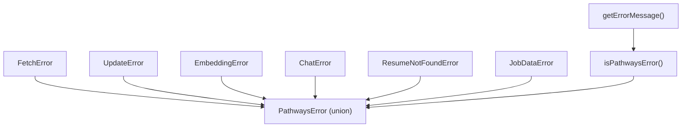
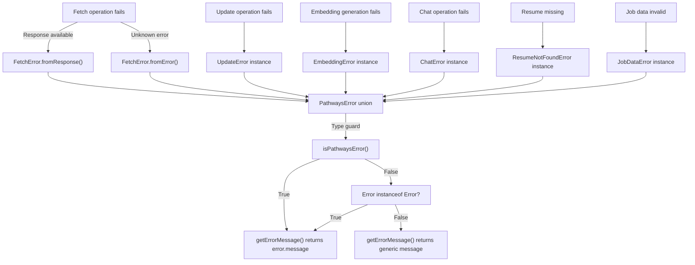
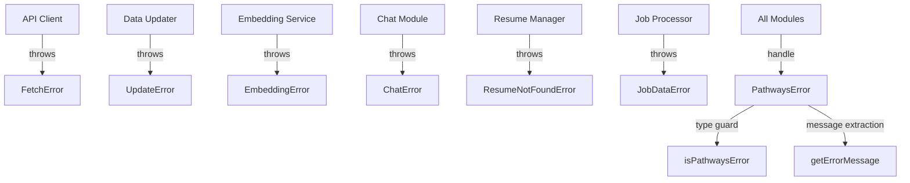

# Error Handling

This module defines a comprehensive error handling framework for the Pathways application, encapsulating distinct failure modes encountered during API interactions, data updates, embedding generation, chat operations, and domain-specific conditions like missing resumes or invalid job data. It provides strongly typed error classes with immutable properties, factory methods for error construction from external inputs, a union type for exhaustive error handling, and utility functions for error identification and user-friendly message extraction.

## Purpose and Scope

This page documents the error classes, type aliases, and utility functions that constitute the error handling subsystem within the Pathways application. It covers the definition and usage of domain-specific error types, their construction patterns, and mechanisms for type narrowing and message extraction. It does not cover error handling strategies outside of this module, such as global error boundaries, logging infrastructure, or error recovery workflows. For error reporting and telemetry, see the Observability page. For API client error handling patterns, see the API Client Integration page.

## Architecture Overview

The error handling subsystem centralizes all error representations related to Pathways operations, enabling consistent error propagation and handling across the application layers. It exports six distinct error classes, each extending a tagged error base to provide discriminated union capabilities. A union type `PathwaysError` aggregates these classes for exhaustive type checking. Two utility functions, `isPathwaysError` and `getErrorMessage`, provide runtime type narrowing and message extraction respectively.



**Diagram: Core error classes and utility functions composing the Pathways error handling subsystem**

Sources: `apps/registry/app/pathways/errors/index.ts:1-105`

## Tagged Error Classes

Each error class extends `Data.TaggedError`, a generic base that tags the error with a unique string literal type, enabling discriminated union behavior. All error classes have immutable (`readonly`) properties, ensuring error instances are immutable after construction. Optional properties are explicitly marked with `?`, indicating they may be absent and must be handled accordingly.

### FetchError

**Purpose:** Represents failures during data fetching from external APIs, capturing the request URL, HTTP status, and error message.

**Primary file:** `apps/registry/app/pathways/errors/index.ts:6-25`

| Field   | Type          | Purpose                                                                                   |
|---------|---------------|-------------------------------------------------------------------------------------------|
| message | `string`      | Human-readable error message describing the fetch failure.                               |
| url     | `string`      | The URL that was being fetched when the error occurred.                                  |
| status? | `number`      | Optional HTTP status code returned by the server, if available.                          |

`FetchError` provides two static factory methods for construction:

| Method           | Returns    | Purpose                                                                                  |
|------------------|------------|------------------------------------------------------------------------------------------|
| `fromResponse`   | `FetchError` | Creates an instance from a `Response` object, extracting status and statusText.          |
| `fromError`      | `FetchError` | Creates an instance from an unknown error, extracting the message if it is an `Error`.   |

```typescript
static fromResponse(url: string, response: Response): FetchError {
  return new FetchError({
    message: `Failed to fetch: ${response.statusText}`,
    url,
    status: response.status,
  });
}

static fromError(url: string, error: unknown): FetchError {
  return new FetchError({
    message: error instanceof Error ? error.message : 'Unknown fetch error',
    url,
  });
}
```

**Key behaviors:**
- `fromResponse` extracts HTTP status and status text to provide detailed failure context. `apps/registry/app/pathways/errors/index.ts:11-17`
- `fromError` safely handles unknown error types, defaulting to a generic message when the error is not an instance of `Error`. `apps/registry/app/pathways/errors/index.ts:19-24`
- Instances are tagged with `'FetchError'` for discriminated union narrowing. `apps/registry/app/pathways/errors/index.ts:6-25`

### UpdateError

**Purpose:** Captures failures occurring during data update operations, including the entity being updated and optional additional details.

**Primary file:** `apps/registry/app/pathways/errors/index.ts:30-34`

| Field   | Type          | Purpose                                                                                   |
|---------|---------------|-------------------------------------------------------------------------------------------|
| message | `string`      | Describes the update failure.                                                            |
| entity  | `string`      | Identifies the entity involved in the update operation.                                  |
| details?| `unknown`    | Optional additional context or metadata about the failure, type-opaque.                   |

**Key behaviors:**
- Provides a generic container for update-related errors with extensible details. `apps/registry/app/pathways/errors/index.ts:30-34`
- Tagged as `'UpdateError'` for type discrimination.

### EmbeddingError

**Purpose:** Represents errors encountered during embedding generation, optionally linked to a specific resume.

**Primary file:** `apps/registry/app/pathways/errors/index.ts:39-42`

| Field    | Type          | Purpose                                                                                  |
|----------|---------------|------------------------------------------------------------------------------------------|
| message  | `string`      | Describes the embedding failure.                                                        |
| resumeId?| `string`      | Optional identifier of the resume related to the embedding operation.                    |

**Key behaviors:**
- Captures embedding-specific failures with optional domain linkage. `apps/registry/app/pathways/errors/index.ts:39-42`
- Tagged as `'EmbeddingError'`.

### ChatError

**Purpose:** Encapsulates errors arising from chat or AI operations, including recoverability status.

**Primary file:** `apps/registry/app/pathways/errors/index.ts:47-50`

| Field       | Type     | Purpose                                                                                  |
|-------------|----------|------------------------------------------------------------------------------------------|
| message     | `string` | Describes the chat operation failure.                                                   |
| recoverable | `boolean`| Indicates whether the error is recoverable, guiding retry or fallback logic.             |

**Key behaviors:**
- Differentiates recoverable from unrecoverable chat errors for conditional handling. `apps/registry/app/pathways/errors/index.ts:47-50`
- Tagged as `'ChatError'`.

### ResumeNotFoundError

**Purpose:** Signals that a resume for a given username was not found.

**Primary file:** `apps/registry/app/pathways/errors/index.ts:55-59`

| Field    | Type     | Purpose                                                                                  |
|----------|----------|------------------------------------------------------------------------------------------|
| username | `string` | The username for which the resume was not found.                                        |

**Key behaviors:**
- Provides a domain-specific error for missing resume lookups. `apps/registry/app/pathways/errors/index.ts:55-59`
- Tagged as `'ResumeNotFoundError'`.

### JobDataError

**Purpose:** Represents invalid or malformed job data errors, optionally linked to a job ID.

**Primary file:** `apps/registry/app/pathways/errors/index.ts:64-67`

| Field   | Type          | Purpose                                                                                  |
|---------|---------------|------------------------------------------------------------------------------------------|
| message | `string`      | Describes the job data validation failure.                                              |
| jobId?  | `string`      | Optional identifier of the job related to the error.                                    |

**Key behaviors:**
- Captures validation or integrity errors in job data. `apps/registry/app/pathways/errors/index.ts:64-67`
- Tagged as `'JobDataError'`.

## PathwaysError Union Type

**Purpose:** Aggregates all error classes into a discriminated union type for exhaustive type checking and pattern matching.

**Primary file:** `apps/registry/app/pathways/errors/index.ts:72-78`

```typescript
export type PathwaysError =
  | FetchError
  | UpdateError
  | EmbeddingError
  | ChatError
  | ResumeNotFoundError
  | JobDataError;
```

This union enables exhaustive handling in switch statements or conditional branches, leveraging the tagged error discriminants.

## Type Guard: isPathwaysError

**Purpose:** Runtime type guard function that narrows an unknown value to `PathwaysError` by checking instance types.

**Primary file:** `apps/registry/app/pathways/errors/index.ts:83-92`

```typescript
export const isPathwaysError = (error: unknown): error is PathwaysError => {
  return (
    error instanceof FetchError ||
    error instanceof UpdateError ||
    error instanceof EmbeddingError ||
    error instanceof ChatError ||
    error instanceof ResumeNotFoundError ||
    error instanceof JobDataError
  );
};
```

**Key behaviors:**
- Uses `instanceof` checks for each error class to confirm membership in the `PathwaysError` union. `apps/registry/app/pathways/errors/index.ts:83-92`
- Enables safe type narrowing in callers without relying on string discriminants or manual property checks.

## Utility Function: getErrorMessage

**Purpose:** Extracts a user-friendly error message string from any error-like input, prioritizing `PathwaysError` instances.

**Primary file:** `apps/registry/app/pathways/errors/index.ts:97-105`

```typescript
export const getErrorMessage = (error: unknown): string => {
  if (isPathwaysError(error)) {
    return error.message;
  }
  if (error instanceof Error) {
    return error.message;
  }
  return 'An unexpected error occurred';
};
```

**Key behaviors:**
- Returns the `.message` property for all `PathwaysError` instances, preserving domain-specific messages. `apps/registry/app/pathways/errors/index.ts:97-105`
- Falls back to the standard `Error` message if the input is a native error.
- Provides a generic fallback string when the input is neither a `PathwaysError` nor an `Error`.

## How It Works

The error handling subsystem operates by defining a set of strongly typed error classes, each tagged with a unique string literal type via `Data.TaggedError`. This tagging enables discriminated union behavior, allowing exhaustive type checking and pattern matching on error instances.

When an error occurs during a fetch operation, the `FetchError` class is instantiated either via `fromResponse` when an HTTP response is available or `fromError` when an unknown error is caught. These factory methods extract relevant context such as the URL, HTTP status, and error message, encapsulating all details immutably.

Other error classes like `UpdateError`, `EmbeddingError`, `ChatError`, `ResumeNotFoundError`, and `JobDataError` are constructed directly with their respective properties, capturing domain-specific failure contexts.

The union type `PathwaysError` aggregates all these classes, enabling callers to exhaustively handle all known error types. The `isPathwaysError` function performs runtime type narrowing by checking the instance against each error class, allowing safe access to error properties without unsafe casts.

The `getErrorMessage` utility abstracts error message extraction by first checking if the error is a `PathwaysError` and returning its message, then falling back to native `Error` messages, and finally returning a generic fallback string. This function supports consistent user-facing error reporting regardless of error origin.



**Diagram: Error creation, union aggregation, type narrowing, and message extraction flow**

Sources: `apps/registry/app/pathways/errors/index.ts:6-105`

## Key Relationships

The error handling subsystem is foundational for all Pathways operations that can fail, providing typed error representations consumed by higher-level modules such as API clients, data persistence layers, embedding services, chat/AI components, and domain logic handling resumes and job data.



**Relationships to adjacent subsystems: error classes are instantiated by domain-specific modules and consumed by error handling and reporting layers**

Sources: `apps/registry/app/pathways/errors/index.ts:1-105`