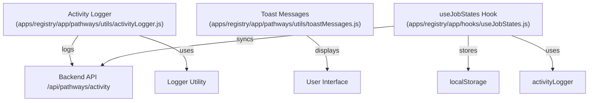
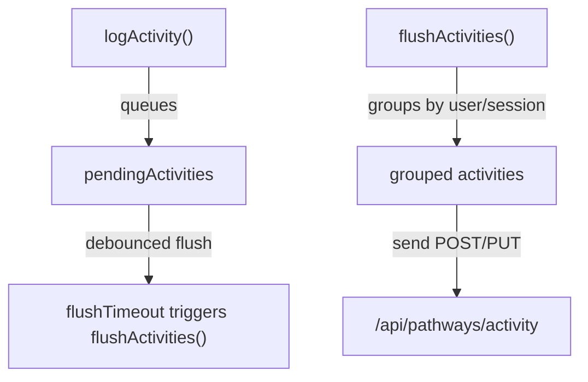
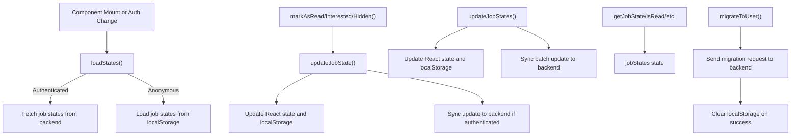
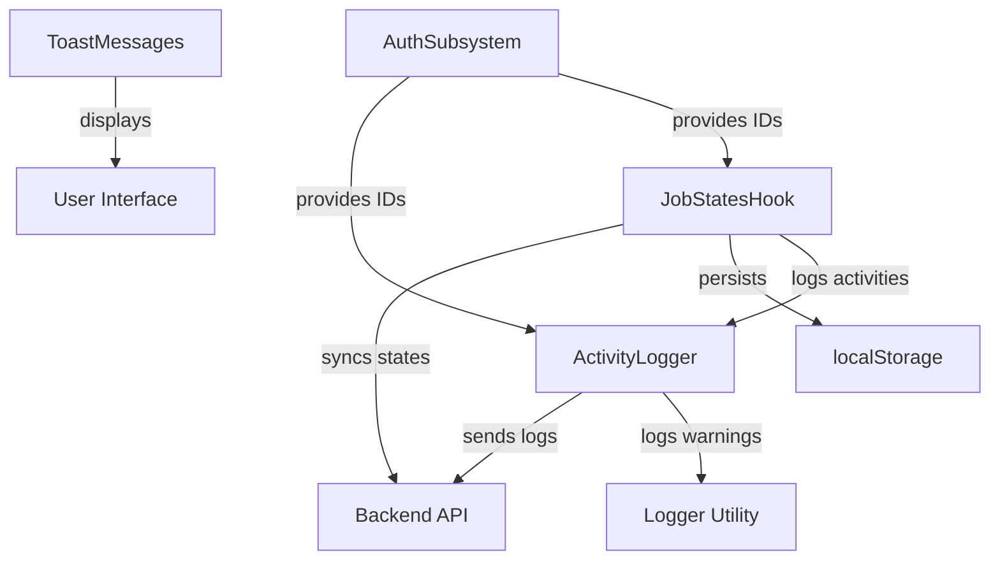

# Logging and Activity Tracking

This module provides comprehensive facilities for tracking user and system activities within the Pathways application. It includes utilities for batching and sending activity logs to the server, managing toast notifications for user feedback, and maintaining persistent job state information both locally and remotely. These components work together to capture meaningful user interactions, system events, and state changes, enabling analytics, debugging, and enhanced user experience.

## Purpose and Scope

This page documents the internal mechanisms for activity logging, toast message management, and job state tracking in Pathways. It covers the batching and dispatch of activity logs, toast message definitions for UI feedback, and the hook-based management of job states with synchronization between local storage and a backend service. It does not cover the UI components that consume these utilities or the backend API implementations.

For user settings management, see the Settings Management page. For UI feedback mechanisms, see the Toast Notifications page. For authentication and session management, see the Authentication subsystem.

## Architecture Overview

The subsystem consists of three primary components:

- **Activity Logger**: A utility that collects activity events, batches them by user/session, and sends them asynchronously to the server.
- **Toast Messages**: A centralized collection of toast notification definitions for success, error, info, and loading states.
- **Job States Hook**: A React hook that manages job state flags (read, interested, hidden) with persistence in localStorage for anonymous users and synchronization with a backend for authenticated users.



**Diagram: Component relationships and data flows for logging and activity tracking**

Sources: `apps/registry/app/pathways/utils/activityLogger.js:1-171`, `apps/registry/app/pathways/utils/toastMessages.js:1-90`, `apps/registry/app/hooks/useJobStates.js:1-330`

---

## Activity Logger

The activity logger provides a low-level, centralized mechanism to record user and system activities. It batches events to reduce network overhead and groups them by user or session before sending to the backend.

**Primary file:** `apps/registry/app/pathways/utils/activityLogger.js:1-171`

### Data Structures

| Field             | Type           | Purpose                                                                                      |
|-------------------|----------------|----------------------------------------------------------------------------------------------|
| `pendingActivities`| `Array<Object>`| Holds activities queued for batch sending. `activityLogger.js:8`                            |
| `flushTimeout`     | `TimeoutID`    | Timer handle for debouncing batch flushes. `activityLogger.js:9`                            |
| Activity Object    | `Object`       | Represents a single activity with `activityType`, `details`, `sessionId`, and `userId`.    |

### Key Behaviors

- **Batching and Debouncing**: Activities are queued in `pendingActivities` and flushed to the server every 500ms to optimize network usage. The flush is debounced using `flushTimeout` to avoid excessive requests. `apps/registry/app/pathways/utils/activityLogger.js:15-42`, `44-87`
- **Grouping by User or Session**: Before sending, activities are grouped by `userId` if present, otherwise by `sessionId`. This ensures coherent grouping of events per user or anonymous session. `apps/registry/app/pathways/utils/activityLogger.js:51-65`
- **Flexible Payloads**: Single activities are sent as POST requests with a simple payload; multiple activities are sent as PUT requests with an array payload. This optimizes server processing and aligns with REST semantics. `apps/registry/app/pathways/utils/activityLogger.js:69-77`
- **Session ID Retrieval**: If no session ID is provided, the logger attempts to retrieve it from localStorage under the key `pathways_session_id`. This supports anonymous user tracking. `apps/registry/app/pathways/utils/activityLogger.js:89-96`
- **Convenience Methods**: The exported `activityLogger` object provides named methods for common activity types (e.g., `messageSent`, `jobRead`, `error`) that internally call `logActivity` with appropriate parameters. This standardizes event logging across the app. `apps/registry/app/pathways/utils/activityLogger.js:101-171`

### How It Works

1. **Logging an Activity**: The `logActivity` function accepts an `activityType`, optional `details`, and optional `{ sessionId, userId }`. If no session or user ID is supplied, it attempts to read the session ID from localStorage. If neither is available, it logs a warning and aborts. Otherwise, it appends the activity to `pendingActivities`. `apps/registry/app/pathways/utils/activityLogger.js:15-42`

2. **Debounced Flush**: A 500ms debounce timer (`flushTimeout`) is reset on each new activity. When the timer expires, `flushActivities` is invoked. `apps/registry/app/pathways/utils/activityLogger.js:15-42`

3. **Flushing Activities**: `flushActivities` copies and clears `pendingActivities`. It groups activities by user or session ID into a map keyed by `userId` or `sessionId`. Each group is then sent to `/api/pathways/activity` as either a POST (single activity) or PUT (batch) request with JSON payload. Errors during fetch are logged but do not block further processing. `apps/registry/app/pathways/utils/activityLogger.js:44-87`

4. **Convenience Methods**: The `activityLogger` object exposes methods for specific event types, each slicing previews to 100 characters where applicable, and passing along session and user IDs. This abstraction simplifies consistent event logging. `apps/registry/app/pathways/utils/activityLogger.js:101-171`



**Diagram: Activity logging and batching flow**

Sources: `apps/registry/app/pathways/utils/activityLogger.js:15-87`, `101-171`

---

## Toast Messages

The toast messages module centralizes user feedback notifications for success, error, info, and loading states using the `sonner` toast library.

**Primary file:** `apps/registry/app/pathways/utils/toastMessages.js:1-90`

### Key Behaviors

- **Success Notifications**: Defined for events such as resume updates, conversation saves, job refreshes, and resume parsing. Each success toast includes a title and optional description or duration. `apps/registry/app/pathways/utils/toastMessages.js:5-22`
- **Error Notifications**: Covers failures like embedding errors, job fetch failures, speech generation errors, transcription failures, upload errors, and conversation load/save errors. Some include retry actions or dynamic messages. `apps/registry/app/pathways/utils/toastMessages.js:24-62`
- **Informational Notifications**: Used for long-running operations like embedding start and microphone permission requests, with appropriate durations and descriptions. `apps/registry/app/pathways/utils/toastMessages.js:64-74`
- **Loading Notifications**: Provides a generic loading toast with a customizable message and a dismiss function returned for manual control. `apps/registry/app/pathways/utils/toastMessages.js:76-87`

### Usage

Each toast message is a function that, when called, triggers a toast with predefined content and options. For example, `pathwaysToast.resumeUpdated()` shows a success toast with a description indicating saved changes.

### Data Structure

| Method Name         | Returns           | Purpose                                                   |
|---------------------|-------------------|-----------------------------------------------------------|
| `resumeUpdated()`   | `void`            | Shows success toast for resume update. `apps/registry/app/pathways/utils/toastMessages.js:5-9` |
| `jobsFetchError()`  | `void`            | Shows error toast with retry action for job fetch failure. `apps/registry/app/pathways/utils/toastMessages.js:30-37` |
| `loading(message)`  | `() => void`      | Shows loading toast with message; returns dismiss function. `apps/registry/app/pathways/utils/toastMessages.js:76-87` |

Sources: `apps/registry/app/pathways/utils/toastMessages.js:3-90`

---

## Job States Hook (`useJobStates`)

The `useJobStates` hook manages persistent state flags for jobs (read, interested, hidden), supporting both anonymous and authenticated users. It synchronizes state between localStorage and a backend service, handles optimistic updates, batch updates, and migration on user signup.

**Primary file:** `apps/registry/app/hooks/useJobStates.js:1-330`

### Purpose

To provide a unified interface for job state management that abstracts away storage details and synchronization, enabling consistent state tracking across sessions and devices.

### Data Structures

| Field/Variable       | Type                      | Purpose                                                                                     |
|---------------------|---------------------------|---------------------------------------------------------------------------------------------|
| `STORAGE_KEY_PREFIX` | `string`                  | Prefix for localStorage keys for job states. `useJobStates.js:4`                            |
| `jobStates`          | `Object<string, string>`  | Map of job IDs to their state (`read`, `interested`, `hidden`). `useJobStates.js:70`       |
| `isLoading`          | `boolean`                 | Indicates loading state of job states. `useJobStates.js:71`                                |
| `error`              | `string|null`             | Holds error message if loading fails. `useJobStates.js:72`                                 |

### Key Behaviors

- **LocalStorage Persistence**: For anonymous users, job states are loaded from and saved to localStorage under keys derived from the session ID. This ensures state persistence across page reloads. `apps/registry/app/hooks/useJobStates.js:11-27`, `34-54`
- **Backend Synchronization**: For authenticated users, job states are fetched from and updated to a backend API (`/api/job-states`). Updates are sent individually or in batches. `apps/registry/app/hooks/useJobStates.js:76-105`, `111-186`
- **Optimistic Updates**: State updates immediately reflect in local React state and localStorage before backend confirmation, improving UI responsiveness. Backend failures are logged but do not revert local state. `apps/registry/app/hooks/useJobStates.js:111-148`
- **Batch Updates**: Multiple job state changes can be applied atomically via `updateJobStates`, reducing network overhead. `apps/registry/app/hooks/useJobStates.js:151-186`
- **Convenience Methods**: Methods like `markAsRead`, `markAsInterested`, and `markAsHidden` wrap state updates and log corresponding activities via `activityLogger`. `apps/registry/app/hooks/useJobStates.js:189-216`
- **State Queries**: Functions `getJobState`, `isRead`, `isInterested`, and `isHidden` provide read access to job states. `apps/registry/app/hooks/useJobStates.js:222-240`
- **Sets for Filtering**: Memoized sets of job IDs per state enable efficient filtering in UI components. `apps/registry/app/hooks/useJobStates.js:243-271`
- **Migration on Signup**: The `migrateToUser` method transfers job states from localStorage to the backend when a user authenticates, then clears localStorage to avoid duplication. `apps/registry/app/hooks/useJobStates.js:274-299`

### How It Works

1. **Initialization and Loading**: On mount or when authentication status changes, the hook loads job states. If authenticated, it fetches from the backend API; otherwise, it loads from localStorage keyed by session ID. Errors during fetch fall back to localStorage loading. `apps/registry/app/hooks/useJobStates.js:76-105`

2. **Updating Single Job State**: The `updateJobState` function updates the local `jobStates` state optimistically, persists the new state to localStorage, and attempts to sync with the backend if authenticated. If the new state is `null`, the job state is removed. `apps/registry/app/hooks/useJobStates.js:111-148`

3. **Batch Updating Job States**: The `updateJobStates` function applies multiple job state changes at once, updating local state and localStorage, then syncing with the backend in a single batch request. `apps/registry/app/hooks/useJobStates.js:151-186`

4. **Convenience Methods**: `markAsRead`, `markAsInterested`, and `markAsHidden` call `updateJobState` with the respective state and log the activity using `activityLogger`. `unmarkJob` and `clearJobState` remove the job state. `apps/registry/app/hooks/useJobStates.js:189-225`

5. **Querying Job States**: `getJobState` returns the current state for a job ID or `null` if none. `isRead`, `isInterested`, and `isHidden` return booleans for each state. `apps/registry/app/hooks/useJobStates.js:222-240`

6. **Filtering Sets**: Memoized sets of job IDs per state enable efficient UI filtering without recomputation on every render. `apps/registry/app/hooks/useJobStates.js:243-271`

7. **Migration**: When a user signs up or logs in, `migrateToUser` sends a request to migrate local job states to the backend, then clears localStorage to prevent stale data. It returns a success status and error message if applicable. `apps/registry/app/hooks/useJobStates.js:274-299`



**Diagram: Lifecycle and operations of the useJobStates hook**

Sources: `apps/registry/app/hooks/useJobStates.js:69-330`

---

## Settings Hook (`useSettings`)

The `useSettings` hook manages user preferences related to text-to-speech and auto-apply behavior, persisting them in localStorage.

**Primary file:** `apps/registry/app/hooks/useSettings.js:1-30`

### Key Behaviors

- **Initial Load**: On mount, attempts to load saved settings from localStorage key `resume-ai-settings`. If parsing fails, logs an error and retains defaults. `apps/registry/app/hooks/useSettings.js:5-15`
- **State Management**: Maintains `settings` state with default values `{ ttsEnabled: true, autoApplyChanges: false }`. `apps/registry/app/hooks/useSettings.js:5-8`
- **Update and Persist**: The `updateSettings` function merges new settings into current state, updates React state, and saves the combined settings back to localStorage. `apps/registry/app/hooks/useSettings.js:23-27`

### Data Structure

| Field       | Type    | Purpose                                        |
|-------------|---------|------------------------------------------------|
| `settings`  | `Object`| Holds user preferences for TTS and auto-apply. `apps/registry/app/hooks/useSettings.js:5-8` |
| `updateSettings` | `Function` | Updates settings state and persists to localStorage. `apps/registry/app/hooks/useSettings.js:23-27` |

Sources: `apps/registry/app/hooks/useSettings.js:1-30`

---

## Symbol Details

### `pendingActivities` (variable)

An array holding activity objects queued for batch sending to the server. Activities accumulate here until flushed by a debounced timer.

`apps/registry/app/pathways/utils/activityLogger.js:8`

### `flushTimeout` (variable)

A timer handle used to debounce the flushing of pending activities. Reset on each new logged activity to batch events within 500ms windows.

`apps/registry/app/pathways/utils/activityLogger.js:9`

### `logActivity` (function)

Logs an activity event with batching and grouping logic.

- **Parameters**:
  - `activityType` (`string`): The type of activity being logged.
  - `details` (`Object`, optional): Additional data describing the activity.
  - `options` (`Object`, optional): Contains optional `sessionId` and `userId` strings.
- **Behavior**:
  - Determines effective session and user IDs, falling back to localStorage for session ID.
  - If neither ID is available, logs a warning and aborts.
  - Appends the activity to `pendingActivities`.
  - Resets the debounce timer `flushTimeout` to call `flushActivities` after 500ms.
- **Side Effects**: Mutates `pendingActivities` and manages `flushTimeout`.

`apps/registry/app/pathways/utils/activityLogger.js:15-42`

### `effectiveSessionId` (variable)

Local variable inside `logActivity` representing the resolved session ID, either passed explicitly or retrieved from localStorage.

`apps/registry/app/pathways/utils/activityLogger.js:21`

### `effectiveUserId` (variable)

Local variable inside `logActivity` representing the resolved user ID passed explicitly or undefined.

`apps/registry/app/pathways/utils/activityLogger.js:22`

### `flushActivities` (function)

Flushes all queued activities by grouping them by user or session and sending them to the backend.

- **Behavior**:
  - Returns immediately if no pending activities.
  - Copies and clears `pendingActivities`.
  - Groups activities by `userId` if present, else by `sessionId`.
  - For each group:
    - If only one activity, sends a POST request with a simple payload.
    - If multiple activities, sends a PUT request with an array payload.
  - Logs errors from fetch failures.
- **Side Effects**: Clears `pendingActivities` and triggers network requests.

`apps/registry/app/pathways/utils/activityLogger.js:44-87`

### `batch` (variable)

A local copy of the current `pendingActivities` array at the time of flushing.

`apps/registry/app/pathways/utils/activityLogger.js:47`

### `grouped` (variable)

An object mapping user/session keys to grouped activity data, including `sessionId`, `userId`, and an array of activities.

`apps/registry/app/pathways/utils/activityLogger.js:51-65`

### `key` (variable)

The grouping key used in `grouped`, derived from `userId` if present, otherwise `sessionId`.

`apps/registry/app/pathways/utils/activityLogger.js:52`

### `body` (variable)

The JSON payload sent to the backend for each group of activities. It is either a single activity object or a batch object containing multiple activities.

`apps/registry/app/pathways/utils/activityLogger.js:69-77`

### `getStoredSessionId` (function)

Retrieves the session ID from localStorage under the key `pathways_session_id`.

- Returns `string|null`: The stored session ID or `null` if unavailable or in non-browser environments.
- Catches and suppresses errors accessing localStorage.

`apps/registry/app/pathways/utils/activityLogger.js:89-96`

### `activityLogger` (variable)

An object exposing convenience methods for logging common activity types. Each method calls `logActivity` with appropriate parameters and truncates previews to 100 characters.

| Method Name           | Purpose                                                  |
|-----------------------|----------------------------------------------------------|
| `messageSent`         | Logs a message sent event with a preview snippet.        |
| `aiResponse`          | Logs an AI response event with a preview snippet.        |
| `toolInvoked`         | Logs invocation of a tool with its name and result.      |
| `resumeUpdated`       | Logs updates to resume sections with explanations.       |
| `resumeUploaded`      | Logs resume upload events with filename.                  |
| `jobRead`             | Logs when a job is marked as read with job ID and title. |
| `jobInterested`       | Logs when a job is marked as interested.                  |
| `jobHidden`           | Logs when a job is hidden.                                |
| `jobsRefreshed`       | Logs job refresh events with count of jobs found.        |
| `speechToggled`       | Logs toggling of speech synthesis with enabled state and voice. |
| `speechGenerated`     | Logs speech generation completion.                        |
| `recordingStarted`    | Logs start of audio recording.                            |
| `recordingCompleted`  | Logs completion of recording with duration.              |
| `transcriptionCompleted` | Logs transcription completion with preview snippet.   |
| `conversationCleared` | Logs clearing of conversation.                            |
| `sessionStarted`      | Logs start of a session.                                  |
| `userAuthenticated`   | Logs user authentication with username.                  |
| `error`               | Logs error events with message and endpoint.             |

`apps/registry/app/pathways/utils/activityLogger.js:101-171`

### `pathwaysToast` (variable)

An object defining toast notification functions for various user feedback scenarios, using the `sonner` toast library.

| Category       | Method Name          | Purpose                                                                                   |
|----------------|----------------------|-------------------------------------------------------------------------------------------|
| Success        | `resumeUpdated`      | Shows success toast for resume updates.                                                  |
|                | `conversationSaved`  | Shows success toast for conversation save.                                               |
|                | `conversationCleared`| Shows success toast for clearing conversation.                                           |
|                | `jobsRefreshed`      | Shows success toast indicating number of jobs found.                                    |
|                | `resumeParsed`       | Shows success toast for resume parsing with filename.                                   |
| Error          | `embeddingError`     | Shows error toast for resume analysis failure.                                          |
|                | `jobsFetchError`     | Shows error toast for job loading failure with retry action.                            |
|                | `speechError`        | Shows error toast for speech generation failure.                                        |
|                | `transcriptionError` | Shows error toast for transcription failure with optional message.                       |
|                | `uploadError`        | Shows error toast for resume upload failure with filename.                              |
|                | `conversationLoadError` | Shows error toast for conversation load failure.                                      |
|                | `conversationSaveError` | Shows error toast for conversation save failure.                                      |
|                | `apiError`           | Shows generic API error toast with optional message.                                   |
| Info           | `embeddingStarted`   | Shows info toast indicating resume analysis in progress.                               |
|                | `microphonePermission` | Shows info toast requesting microphone access.                                        |
| Loading        | `loading`            | Shows loading toast with custom message; returns dismiss function.                      |

`apps/registry/app/pathways/utils/toastMessages.js:3-90`

### `STORAGE_KEY_PREFIX` (variable)

A string constant prefix used to construct localStorage keys for job states, scoped by session ID.

`apps/registry/app/hooks/useJobStates.js:4`

### `getStorageKey` (variable)

Function that returns the localStorage key for job states given a session ID.

- **Parameters**: `sessionId` (string)
- **Returns**: `string` key in the format `${STORAGE_KEY_PREFIX}_${sessionId}`

`apps/registry/app/hooks/useJobStates.js:11`

### `loadFromLocalStorage` (variable)

Function that loads job states from localStorage for a given session ID.

- **Parameters**: `sessionId` (string)
- **Returns**: Parsed job states object `{ [jobId]: state }` or empty object on failure.
- Catches JSON parse errors and localStorage access errors.

`apps/registry/app/hooks/useJobStates.js:18-27`

### `stored` (variable)

Local variable inside `loadFromLocalStorage` holding the raw JSON string retrieved from localStorage.

`apps/registry/app/hooks/useJobStates.js:21`

### `saveToLocalStorage` (variable)

Function that saves job states to localStorage under the key derived from session ID.

- **Parameters**:
  - `sessionId` (string)
  - `states` (object): job states map
- Catches and logs errors accessing localStorage.

`apps/registry/app/hooks/useJobStates.js:34-41`

### `clearLocalStorage` (variable)

Function that removes job states from localStorage for a given session ID.

- **Parameters**: `sessionId` (string)
- Catches and logs errors accessing localStorage.

`apps/registry/app/hooks/useJobStates.js:47-54`

### `useJobStates` (function)

A React hook managing job states with local and remote persistence, migration, and activity logging.

- **Parameters**: An object with:
  - `sessionId` (string): Always present session identifier.
  - `username` (`string|null`): Username if authenticated.
  - `userId` (`string|null`): User UUID if authenticated.
  - `isAuthenticated` (`boolean`): Authentication status.
- **Returns**: An object exposing state, actions, queries, sets, and migration function.

| Returned Property    | Type                 | Purpose                                                                                   |
|---------------------|----------------------|-------------------------------------------------------------------------------------------|
| `jobStates`         | `Object<string,string>` | Current job states map.                                                                  |
| `isLoading`         | `boolean`            | Loading indicator for job states.                                                        |
| `error`             | `string|null`        | Error message if loading failed.                                                         |
| `updateJobState`    | `Function`           | Updates a single job's state with optimistic UI and persistence.                          |
| `updateJobStates`   | `Function`           | Batch updates multiple job states.                                                       |
| `markAsRead`        | `Function`           | Marks a job as read and logs activity.                                                   |
| `markAsInterested`  | `Function`           | Marks a job as interested and logs activity.                                             |
| `markAsHidden`      | `Function`           | Marks a job as hidden and logs activity.                                                 |
| `unmarkJob`         | `Function`           | Clears a job's state.                                                                     |
| `clearJobState`     | `Function`           | Alias for `unmarkJob`.                                                                    |
| `getJobState`       | `Function`           | Returns the state of a job or null if none.                                              |
| `isRead`            | `Function`           | Returns true if job is marked read.                                                      |
| `isInterested`      | `Function`           | Returns true if job is marked interested.                                                |
| `isHidden`          | `Function`           | Returns true if job is marked hidden.                                                    |
| `readJobIds`        | `Set<string>`        | Set of job IDs marked as read.                                                           |
| `interestedJobIds`  | `Set<string>`        | Set of job IDs marked as interested.                                                     |
| `hiddenJobIds`      | `Set<string>`        | Set of job IDs marked as hidden.                                                         |
| `migrateToUser`     | `Function`           | Migrates local job states to backend on user signup. Returns success status and error.    |

`apps/registry/app/hooks/useJobStates.js:69-330`

### `[jobStates, setJobStates]` (variable)

React state tuple holding the current job states map and its setter function.

`apps/registry/app/hooks/useJobStates.js:70`

### `[isLoading, setIsLoading]` (variable)

React state tuple for loading indicator and setter.

`apps/registry/app/hooks/useJobStates.js:71`

### `[error, setError]` (variable)

React state tuple for error message and setter.

`apps/registry/app/hooks/useJobStates.js:72`

### `loadStates` (variable)

Async function invoked on mount or auth change to load job states from backend or localStorage.

- Sets loading state and clears errors.
- Fetches from backend if authenticated; otherwise loads from localStorage.
- On fetch failure, falls back to localStorage.
- Updates state accordingly.

`apps/registry/app/hooks/useJobStates.js:76-105`

### `response` (variable)

Local variable holding the fetch response from the backend API during job states loading.

`apps/registry/app/hooks/useJobStates.js:83`

### `data` (variable)

Parsed JSON data from the backend response containing job states.

`apps/registry/app/hooks/useJobStates.js:87`

### `localStates` (variable)

Local variable holding job states loaded from localStorage, used both in loading and error fallback.

`apps/registry/app/hooks/useJobStates.js:91`, `99`

### `updateJobState` (variable)

Function to update a single job's state with optimistic UI update, localStorage persistence, and backend sync.

- Converts `jobId` to string.
- Updates React state by adding or deleting the job state.
- Saves updated state to localStorage.
- Sends POST request to backend if authenticated.
- Logs backend sync errors without reverting state.

`apps/registry/app/hooks/useJobStates.js:111-148`

### `jobIdStr` (variable)

Stringified job ID used as key in job states map.

`apps/registry/app/hooks/useJobStates.js:113`, `157`

### `newStates` (variable)

New job states object after applying updates.

`apps/registry/app/hooks/useJobStates.js:117`, `154`

### `updateJobStates` (variable)

Function to batch update multiple job states.

- Applies all updates to a copy of current job states.
- Updates React state and localStorage.
- Sends batch POST request to backend if authenticated.
- Logs errors without reverting state.

`apps/registry/app/hooks/useJobStates.js:151-186`

### `markAsRead` (variable)

Function marking a job as read, updating state and logging the activity.

`apps/registry/app/hooks/useJobStates.js:189-195`

### `markAsInterested` (variable)

Function marking a job as interested, updating state and logging the activity.

`apps/registry/app/hooks/useJobStates.js:197-203`

### `markAsHidden` (variable)

Function marking a job as hidden, updating state and logging the activity.

`apps/registry/app/hooks/useJobStates.js:205-211`

### `unmarkJob` (variable)

Function clearing the state of a job.

`apps/registry/app/hooks/useJobStates.js:213-216`

### `clearJobState` (variable)

Alias for `unmarkJob`.

`apps/registry/app/hooks/useJobStates.js:219`

### `getJobState` (variable)

Function returning the current state of a job or `null` if none.

`apps/registry/app/hooks/useJobStates.js:222-225`

### `isRead` (variable)

Function returning `true` if a job is marked as read.

`apps/registry/app/hooks/useJobStates.js:227-230`

### `isInterested` (variable)

Function returning `true` if a job is marked as interested.

`apps/registry/app/hooks/useJobStates.js:232-235`

### `isHidden` (variable)

Function returning `true` if a job is marked as hidden.

`apps/registry/app/hooks/useJobStates.js:237-240`

### `readJobIds` (variable)

Memoized set of job IDs marked as read, for efficient filtering.

`apps/registry/app/hooks/useJobStates.js:243-251`

### `interestedJobIds` (variable)

Memoized set of job IDs marked as interested.

`apps/registry/app/hooks/useJobStates.js:253-261`

### `hiddenJobIds` (variable)

Memoized set of job IDs marked as hidden.

`apps/registry/app/hooks/useJobStates.js:263-271`

### `migrateToUser` (variable)

Function to migrate job states from localStorage to backend on user signup.

- Sends POST request to `/api/job-states/migrate` with session and user IDs.
- On success, clears localStorage.
- Returns an object `{ success: boolean, error?: string }`.
- Logs errors on failure.

`apps/registry/app/hooks/useJobStates.js:274-299`

### `useSettings` (function)

React hook managing user settings with localStorage persistence.

- Initializes state with defaults `{ ttsEnabled: true, autoApplyChanges: false }`.
- Loads saved settings from localStorage on mount, logging errors on failure.
- Provides `updateSettings` function to merge and persist new settings.
- Returns `[settings, updateSettings]` tuple.

`apps/registry/app/hooks/useSettings.js:4-30`

### `[settings, setSettings]` (variable)

React state tuple holding current settings and setter.

`apps/registry/app/hooks/useSettings.js:5-8`

### `savedSettings` (variable)

Local variable holding parsed settings loaded from localStorage.

`apps/registry/app/hooks/useSettings.js:12`

### `updateSettings` (variable)

Function merging new settings into current state and persisting to localStorage.

`apps/registry/app/hooks/useSettings.js:23-27`

---

## Key Relationships

The logging and activity tracking subsystem interfaces with several adjacent components:

- **Backend APIs**: Activity logs and job states synchronize with backend endpoints (`/api/pathways/activity`, `/api/job-states`) for persistence and analytics.
- **LocalStorage**: Provides fallback and persistence for anonymous users, ensuring state continuity across sessions.
- **UI Components**: Consume toast messages and job state queries to provide user feedback and filtering.
- **Authentication**: Session and user IDs drive grouping and migration logic, linking anonymous and authenticated states.
- **Logger Utility**: Used for internal warning and error reporting within the activity logger and settings hook.



**Relationships between logging, storage, UI feedback, and authentication**

Sources: `apps/registry/app/pathways/utils/activityLogger.js:1-171`, `apps/registry/app/hooks/useJobStates.js:1-330`

## `updatedSettings` (variable) in apps/registry/app/hooks/useSettings.js

### Introduction

The `updatedSettings` variable is a transient object created within the `updateSettings` function inside the `useSettings` hook. It represents the merged state of the current settings and any new partial updates passed to the function. This variable plays a critical role in synchronizing the in-memory React state with persistent storage in `localStorage`, ensuring that user preferences persist across sessions.

### Purpose

`updatedSettings` serves as the authoritative, up-to-date settings object that combines the existing state with incoming changes before committing both to React state and browser storage. It guarantees consistency between the UI's reactive state and the serialized settings stored on the client.

### Location and Context

- Declared inside the `updateSettings` function, which itself is defined within the `useSettings` hook.
- Found at line 24 in `apps/registry/app/hooks/useSettings.js` (single-line declaration).
- Used immediately to update both React state and `localStorage`.

### Detailed Behavior

- Constructed by shallow-merging the current `settings` state object with the `newSettings` argument:
  
  ```js
  const updatedSettings = { ...settings, ...newSettings };
  ```

- This merge strategy ensures that only the keys provided in `newSettings` override existing values, while all other keys remain unchanged.
- The resulting `updatedSettings` object is then passed to `setSettings` to update React state, triggering re-renders where necessary.
- Simultaneously, `updatedSettings` is serialized to JSON and saved under the key `'resume-ai-settings'` in `localStorage`, persisting the changes beyond the current session.

### Failure Modes and Edge Cases

- Because `updatedSettings` is derived from the current `settings` state, if `settings` is stale due to asynchronous React state updates, there is a risk of overwriting concurrent changes. However, since `updateSettings` is synchronous and React state updates are batched, this risk is minimal in typical usage.
- The shallow merge does not deeply merge nested objects. If settings contain nested structures, partial updates to nested keys will overwrite entire nested objects rather than merging them. This design requires callers to provide fully formed nested objects if they intend to update nested settings.
- The function does not validate the shape or types of `newSettings`; malformed or unexpected keys will be merged and persisted without error, potentially causing inconsistent state downstream.
- The `localStorage.setItem` call can throw if the storage quota is exceeded or if the environment disallows access (e.g., private browsing modes). These exceptions are not caught within `updateSettings`, so callers should be aware of potential runtime errors.

### Example

Given the current state:

```js
settings = {
  ttsEnabled: true,
  autoApplyChanges: false,
};
```

Calling:

```js
updateSettings({ autoApplyChanges: true });
```

Results in:

```js
updatedSettings = {
  ttsEnabled: true,
  autoApplyChanges: true,
};
```

This merged object is then set as the new React state and saved to `localStorage`.

### Relationships

- `updatedSettings` depends on the current `settings` state and the `newSettings` argument provided by the caller.
- It is an internal helper variable, not exposed outside the `updateSettings` function.
- Its creation and use are tightly coupled with the `setSettings` state updater and the `localStorage` API.
- Changes to `updatedSettings` directly affect the reactive UI and persistent storage consistency.

### Sources

`apps/registry/app/hooks/useSettings.js:24`