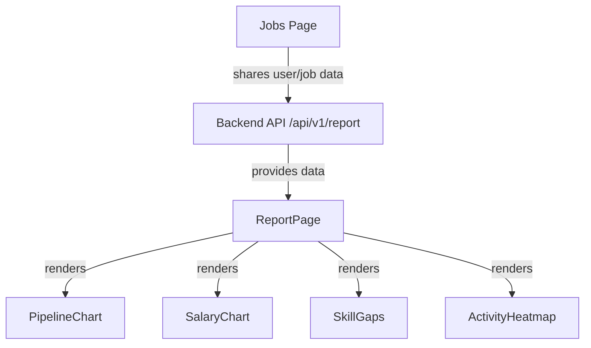

# Job Reports

This module provides components and utilities for generating detailed job-related reports and analytics within the user registry application. It aggregates data about job pipelines, salary distributions, skill gaps, market trends, and user activity to present comprehensive insights into job search progress and market positioning.

## Purpose and Scope

This page documents the internal mechanisms and components responsible for rendering job reports for a given user over selectable time ranges. It covers the main report page orchestration, key visualizations such as pipeline charts, salary analytics, skill gap analysis, and activity heatmaps. It does not cover job listing or job application submission workflows.

For job listing and application management, see the Jobs page. For user-specific job pipeline layouts, see the Report Layout page.

## Architecture Overview

The job reports subsystem is centered around the `ReportPage` component, which fetches report data from a backend API and orchestrates rendering of multiple specialized components. These components include visualizations of the job pipeline, salary data, skill gaps, market trends, and user activity timelines. The data flows from the API response into state managed by `ReportPage`, then is passed down as props to child components for rendering.

```mermaid
flowchart TD
    A["ReportPage"] --> B["API: /api/v1/report"]
    A --> C["DaysSelector"]
    A --> D["HeroSection"]
    A --> E["ApplicationNudge"]
    A --> F["PipelineChart"]
    A --> G["InsightsPanel"]
    A --> H["ActivityHeatmap"]
    A --> I["ActivityTimeline"]
    A --> J["SalaryChart"]
    A --> K["SalaryIntelligence"]
    A --> L["Archetypes"]
    A --> M["ReadinessRadar"]
    A --> N["BestMatchSimilar"]
    A --> O["AntiResume"]
    A --> P["DealBreakers"]
    A --> Q["SkillGaps"]
    A --> R["SkillAdjacency"]
    A --> S["MarketDrift"]
    A --> T["TopCompanies"]
    A --> U["RecentActivity"]
```

**Diagram: Component orchestration and data flow in the Job Reports subsystem**

Sources: `apps/registry/app/[username]/jobs/report/page.js:86-185`

---

## ReportPage: Main Report Orchestration

**Purpose:** Fetches job report data for a user and manages state for the report view, coordinating rendering of all report components.  
**Primary file:** `apps/registry/app/[username]/jobs/report/page.js:86-185`

The `ReportPage` component uses React hooks to manage state for the report data, loading status, error messages, and the selected time range (`days`). It extracts the `username` from route parameters and fetches report data from the backend API endpoint `/api/v1/report/{username}?days={days}`.

The fetch logic handles HTTP errors by parsing error messages from the response body and sets error state accordingly. While loading, it renders a `LoadingSkeleton` component; on error, it renders an `ErrorState` component with retry capability.

Once data is loaded, `ReportPage` renders a layout containing:

- A `DaysSelector` for choosing the report time window.
- A `HeroSection` summarizing pipeline and momentum data.
- An `ApplicationNudge` component highlighting application urgency.
- A grid of charts and panels including `PipelineChart`, `InsightsPanel`, `ActivityHeatmap`, `ActivityTimeline`, `SalaryChart`, `SalaryIntelligence`, `Archetypes`, `ReadinessRadar`, `BestMatchSimilar`, `AntiResume`, `DealBreakers`, `SkillGaps`, `SkillAdjacency`, `MarketDrift`, `TopCompanies`, and `RecentActivity`.
- A footer with report generation timestamp.

This component centralizes data fetching and error handling, passing the fetched data down to specialized components for visualization.

**Key behaviors:**
- Uses `useCallback` to memoize the fetch function based on `username` and `days` dependencies.  
- Handles HTTP errors gracefully by extracting error messages from JSON body or falling back to status code.  
- Renders loading, error, or report content conditionally based on state.  
- Supports dynamic report time window selection via `DaysSelector`.  
- Passes down all relevant data slices to child components for rendering.

Sources: `apps/registry/app/[username]/jobs/report/page.js:86-185`

---

## HeroSection: Pipeline Summary and Momentum

**Purpose:** Displays a summary of the user's job pipeline status and momentum label with color-coded indication.  
**Primary file:** `apps/registry/app/[username]/jobs/report/components/HeroSection.jsx:55-104`

`HeroSection` receives pipeline data, username, days, and momentum metrics. It derives a momentum label and corresponding color based on the momentum score. The component renders key pipeline stats and a momentum gauge to provide a quick overview of the user's job search progress.

**Key behaviors:**
- Extracts momentum label and maps it to a color scale for visual emphasis.  
- Presents pipeline counts such as total jobs, reviewed, interested, applied, etc.  
- Displays username and report duration for context.

Sources: `apps/registry/app/[username]/jobs/report/components/HeroSection.jsx:55-104`

---

## PipelineChart: Visualizing Job Pipeline Funnel

**Purpose:** Renders a vertical bar chart representing stages of the job pipeline funnel with conversion rates.  
**Primary file:** `apps/registry/app/[username]/jobs/report/components/PipelineChart.jsx:21-91`

`PipelineChart` constructs an array of pipeline stages including Available, Reviewed, Interested, Maybe, and Applied, filtering out stages with zero counts. It uses a bar chart with color-coded bars for each stage and labels showing conversion percentages between stages.

**Key behaviors:**
- Dynamically includes the "Available" stage only if there are jobs in the database.  
- Calculates and displays conversion rates between consecutive stages.  
- Uses consistent color scheme for pipeline stages.  
- Provides tooltips and labels for clarity.

Sources: `apps/registry/app/[username]/jobs/report/components/PipelineChart.jsx:21-91`

---

## ActivityHeatmap: Weekly Review Activity Visualization

**Purpose:** Displays a heatmap of daily job review activity grouped by weeks, indicating intensity of user engagement.  
**Primary file:** `apps/registry/app/[username]/jobs/report/components/ActivityHeatmap.jsx:17-105`

`ActivityHeatmap` processes a timeline of daily activity data, grouping days into weeks starting on Mondays. It calculates total reviews per day by summing interested, maybe, not interested, and applied counts. The heatmap uses color intensity to represent activity levels and includes a legend for interpretation.

**Key behaviors:**
- Groups timeline data into weeks for horizontal scrolling display.  
- Computes total reviews per day and overall active days count.  
- Applies color intensity classes based on review counts to visually encode activity.  
- Displays date range covered by the heatmap.

Sources: `apps/registry/app/[username]/jobs/report/components/ActivityHeatmap.jsx:17-105`

---

## SalaryChart: Salary Distribution Visualization

**Purpose:** Shows a comparative bar chart of salary distribution between market and user interested salaries.  
**Primary file:** `apps/registry/app/[username]/jobs/report/components/SalaryChart.jsx:22-114`

`SalaryChart` receives salary distribution data and renders a bar chart with two series: market salaries and user interested salaries. It displays median salary values for both groups and handles the case where no salary data is available by rendering an informative message.

**Key behaviors:**
- Checks for presence of salary data before rendering chart.  
- Displays median market and user salaries with formatted values.  
- Uses color-coded bars for market and interested salary distributions.  
- Includes grid, axes, tooltips, and legend for chart clarity.

Sources: `apps/registry/app/[username]/jobs/report/components/SalaryChart.jsx:22-114`

---

## SalaryIntelligence: Salary Percentile and Range Analysis

**Purpose:** Provides detailed percentile bars and range comparisons between market and user interested salaries.  
**Primary file:** `apps/registry/app/[username]/jobs/report/components/SalaryIntelligence.jsx:49-121`

`SalaryIntelligence` renders percentile bars for the user's target salary and market median salary, showing the relative position within the salary range. It calculates the percentage difference between user and market median salaries and displays it with color-coded positive or negative indication. It also shows the interquartile ranges for both market and user salaries.

**Key behaviors:**
- Conditionally renders based on availability of market and interested salary data.  
- Calculates and displays percentage difference between user and market medians.  
- Shows percentile bars with markers for min, p25, p50, p75, and max salary values.  
- Presents salary ranges in a compact, readable format.

Sources: `apps/registry/app/[username]/jobs/report/components/SalaryIntelligence.jsx:49-121`

---

## DealBreakers: Analysis of Reject and Accept Signals

**Purpose:** Visualizes deal breaker features and preferences with divergence scores indicating rejection or acceptance signals.  
**Primary file:** `apps/registry/app/[username]/jobs/report/components/DealBreakers.jsx:34-107`

`DealBreakers` renders a list of deal breaker items, each showing a feature-value pair and a horizontal bar segment representing the divergence score. Positive divergence indicates a reject signal, negative indicates accept. The component normalizes bar widths relative to the maximum absolute divergence value.

**Key behaviors:**
- Handles empty or missing deal breaker data by rendering a placeholder message.  
- Calculates maximum absolute divergence for proportional bar widths.  
- Uses color coding to differentiate reject and accept signals.  
- Displays divergence values with sign and color emphasis.

Sources: `apps/registry/app/[username]/jobs/report/components/DealBreakers.jsx:34-107`

---

## SkillGaps: Analysis of Top Demanded Skills and User Gaps

**Purpose:** Displays top demanded skills in the market and skills the user may be missing, with visual bars indicating demand counts.  
**Primary file:** `apps/registry/app/[username]/jobs/report/components/SkillGaps.jsx:31-104`

`SkillGaps` receives skill data including user skills, top demanded skills, and skill gaps. It renders two columns: one for top demanded skills highlighting those the user has, and one for skills the user lacks. Bars are scaled relative to the maximum demand or gap count.

**Key behaviors:**
- Converts user skills to lowercase set for case-insensitive matching.  
- Renders skill bars with different colors for user skills vs missing skills.  
- Handles empty data gracefully with informative messages.  
- Scales bar widths proportionally to demand counts.

Sources: `apps/registry/app/[username]/jobs/report/components/SkillGaps.jsx:31-104`

---

## How It Works: End-to-End Data Flow in Job Reports

The report generation begins when `ReportPage` mounts and extracts the `username` from route parameters. It initializes state for data, error, loading, and days (default 30). The `fetchReport` function is memoized with `useCallback` to fetch report data from `/api/v1/report/{username}?days={days}`.

Upon invocation, `fetchReport` sets loading state and clears errors. It performs a fetch request and checks the response status. If the response is not OK, it attempts to parse an error message from the JSON body and throws an error. On success, it parses the JSON report data and sets it into state.

The component conditionally renders a loading skeleton, error state with retry, or the full report UI. The report UI includes a `DaysSelector` allowing the user to change the report time window, triggering a refetch.

The loaded data is passed down to numerous child components:

- `HeroSection` summarizes pipeline and momentum.
- `ApplicationNudge` highlights application urgency.
- `PipelineChart` visualizes job pipeline stages.
- `InsightsPanel` shows momentum and remote work indices.
- `ActivityHeatmap` and `ActivityTimeline` visualize user activity over time.
- `SalaryChart` and `SalaryIntelligence` analyze salary distributions and percentiles.
- `Archetypes` and `ReadinessRadar` provide user archetype and readiness insights.
- `BestMatchSimilar` lists similar job matches.
- `AntiResume` and `DealBreakers` analyze deal breakers and anti-preferences.
- `SkillGaps` and `SkillAdjacency` analyze skill demands and co-occurrences.
- `MarketDrift` shows market trend changes.
- `TopCompanies` and `RecentActivity` display company rankings and recent user activity.

```mermaid
flowchart TD
    A["ReportPage"] -->|fetchReport| B["API /api/v1/report"]
    B -->|JSON data| A
    A --> C["DaysSelector"]
    A --> D["HeroSection"]
    A --> E["ApplicationNudge"]
    A --> F["PipelineChart"]
    A --> G["InsightsPanel"]
    A --> H["ActivityHeatmap"]
    A --> I["ActivityTimeline"]
    A --> J["SalaryChart"]
    A --> K["SalaryIntelligence"]
    A --> L["Archetypes"]
    A --> M["ReadinessRadar"]
    A --> N["BestMatchSimilar"]
    A --> O["AntiResume"]
    A --> P["DealBreakers"]
    A --> Q["SkillGaps"]
    A --> R["SkillAdjacency"]
    A --> S["MarketDrift"]
    A --> T["TopCompanies"]
    A --> U["RecentActivity"]
```

**Diagram: Data flow and component invocation in ReportPage**

Sources: `apps/registry/app/[username]/jobs/report/page.js:86-185`

---

## Key Relationships

The Job Reports subsystem depends on the backend API endpoint `/api/v1/report/{username}` to supply aggregated report data. It consumes user and job pipeline data from the registry domain and integrates with components rendering job listings and applications.

Downstream, the reports feed into user-facing dashboards and analytics views, providing insights that inform job search strategies and application priorities.

**Relationships between Job Reports, backend API, and Jobs Page**

Sources: `apps/registry/app/[username]/jobs/report/page.js:86-185`