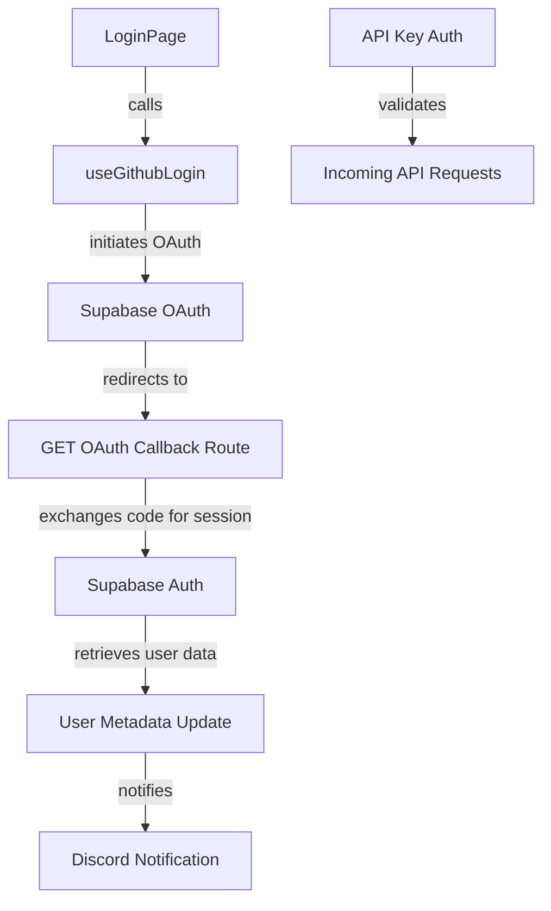
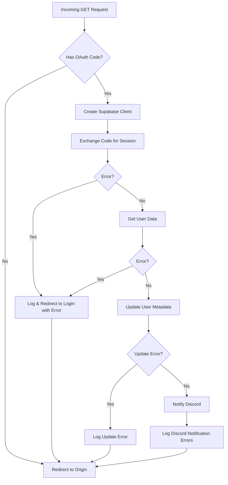
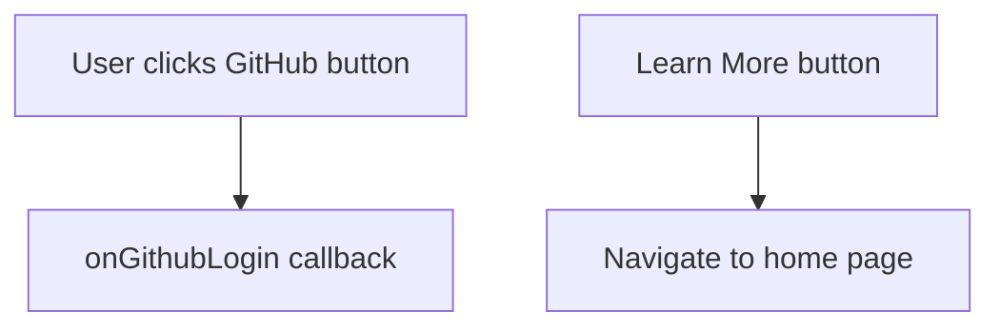
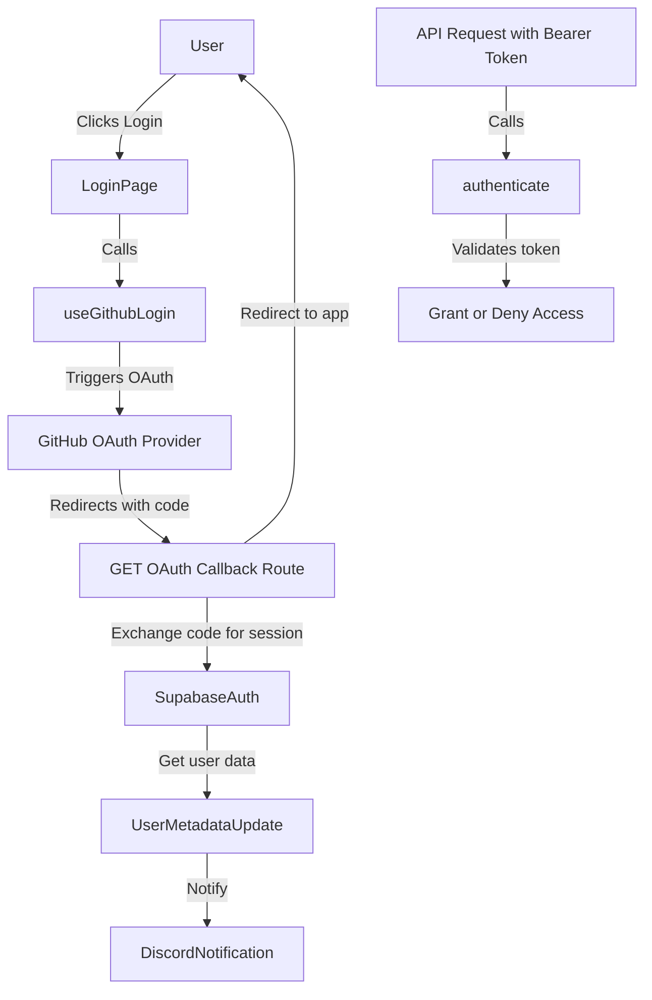
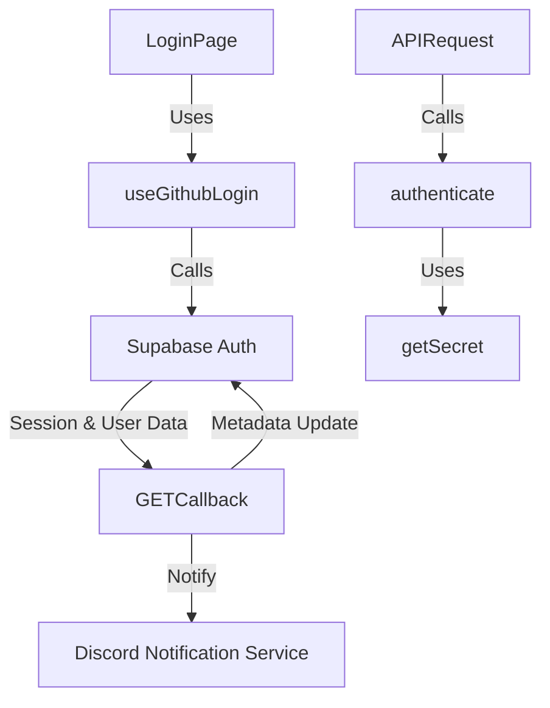

# Authentication

This module implements the authentication flow for user sign-in via GitHub OAuth, API key verification, and associated UI components for login. It handles OAuth callbacks, user session management, metadata enrichment, error reporting, and API key-based authentication without persistent storage. The login UI components provide a cohesive user experience with error display, branding, and terms acknowledgment.

## Purpose and Scope

This page documents the internal mechanisms enabling user authentication, including the OAuth callback handler, login page components, GitHub login hook, and API key authentication utilities. It covers the full lifecycle from OAuth code exchange to session creation, user metadata update, and Discord notification of new signups, as well as client-side login UI and API key verification logic.

It does not cover authorization, session persistence beyond Supabase, or user profile management beyond metadata updates. For API key generation and verification in the broader API context, see the API Authentication page. For UI styling and component primitives, see the UI Components page.

## Architecture Overview

The authentication subsystem integrates OAuth sign-in via Supabase, client-side login UI, and server-side API key verification. The OAuth callback route exchanges authorization codes for sessions, enriches user metadata, and triggers external notifications. The login page orchestrates UI components and hooks to initiate OAuth flows and display errors. API key authentication verifies bearer tokens using HMAC without database lookups.



**Diagram: Authentication subsystem components and their interactions**

Sources: `apps/registry/app/auth/callback/route.ts:7-87`, `apps/registry/app/login/page.tsx:12-32`, `apps/registry/app/login/components/useGithubLogin.ts:7-36`, `apps/registry/app/api/v1/auth.js:9-47`

## OAuth Callback Handler (`GET`)

**Purpose:**  
Handles the OAuth callback from GitHub by exchanging the authorization code for a session, retrieving and updating user metadata, and notifying Discord of new user signups. It redirects users back to the app or login page with error information on failure.

**Primary file:** `apps/registry/app/auth/callback/route.ts:7-87`

| Variable/Step | Type | Purpose |
|---------------|------|---------|
| `requestUrl` | `URL` | Parsed URL of the incoming request to extract query parameters. `apps/registry/app/auth/callback/route.ts:8-9` |
| `code` | `string \| null` | OAuth authorization code extracted from query parameters. `route.ts:9` |
| `cookieStore` | `RequestCookies` | Cookie store for managing Supabase session cookies. `route.ts:12` |
| `supabase` | `SupabaseClient` | Supabase client configured with cookie store for server-side auth operations. `route.ts:13` |
| `session` | `Session \| null` | Auth session obtained by exchanging the OAuth code. `apps/registry/app/auth/callback/route.ts:16-20` |
| `error` | `AuthError \| null` | Error returned from code exchange or user data retrieval. `apps/registry/app/auth/callback/route.ts:17-21`, `apps/registry/app/auth/callback/route.ts:26-31` |
| `userData` | `UserResponse` | User data retrieved from Supabase after session creation. `apps/registry/app/auth/callback/route.ts:25-29` |
| `updateError` | `AuthError \| null` | Error from updating user metadata. `apps/registry/app/auth/callback/route.ts:34-44` |
| `username` | `string` | GitHub username extracted from user metadata. `apps/registry/app/auth/callback/route.ts:46-47` |
| `avatarUrl` | `string` | User avatar URL from GitHub metadata. `apps/registry/app/auth/callback/route.ts:46-47` |

**How It Works:**  
1. Parses the incoming request URL to extract the OAuth `code` parameter.  
2. If `code` is present, creates a Supabase client with cookie support.  
3. Exchanges the code for a session via `supabase.auth.exchangeCodeForSession`.  
4. On error, logs and redirects to the login page with an error message.  
5. If session is obtained, fetches user data with `supabase.auth.getUser`.  
6. On failure to get user data, logs and redirects with an error.  
7. Updates user metadata with GitHub username, avatar URL, provider info.  
8. Logs any metadata update errors but does not abort the flow.  
9. Attempts to notify Discord of the new signup asynchronously; logs errors without failing the auth flow.  
10. Finally, redirects the user to the app origin regardless of outcome.



**Key behaviors:**  
- Exchanges OAuth code for a session using Supabase server-side client with cookie support. `apps/registry/app/auth/callback/route.ts:12-21`  
- Retrieves user data from Supabase to extract GitHub metadata for profile enrichment. `apps/registry/app/auth/callback/route.ts:24-31`  
- Updates user metadata with GitHub username, avatar URL, and provider identifiers. `apps/registry/app/auth/callback/route.ts:33-44`  
- Sends asynchronous Discord notification on new user signup; errors do not interrupt authentication. `apps/registry/app/auth/callback/route.ts:45-66`  
- Redirects to the app origin on all code paths, preserving user experience flow. `apps/registry/app/auth/callback/route.ts:68-69`

**Relationships:**  
- Depends on Supabase auth helpers and cookie management for session handling.  
- Integrates with Discord notification service for external signup alerts.  
- Redirects to login UI components on error conditions.

Sources: `apps/registry/app/auth/callback/route.ts:7-87`

## Login Page (`LoginPage`)

**Purpose:**  
Renders the login UI, orchestrating header, error alert, login buttons, and terms footer components. It manages the GitHub login flow via a custom hook and displays any authentication errors.

**Primary file:** `apps/registry/app/login/page.tsx:12-32`

**How It Works:**  
- Uses the `useGithubLogin` hook to obtain the `handleGithubLogin` function and any error state.  
- Renders a visually styled container with decorative backgrounds and a card component.  
- Inside the card, renders `LoginHeader` for branding and messaging.  
- Displays `ErrorAlert` if an error is present.  
- Renders `LoginButtons` passing `handleGithubLogin` as the GitHub login handler.  
- Renders `TermsFooter` to display terms of service and privacy policy links.

**Key behaviors:**  
- Manages error state from the GitHub login hook and passes it to the error alert component. `apps/registry/app/login/page.tsx:14-16`  
- Provides a consistent, accessible UI layout with responsive design and visual accents. `apps/registry/app/login/page.tsx:18-31`  
- Delegates login initiation to `handleGithubLogin` via button click. `page.tsx:28`

**Relationships:**  
- Depends on `useGithubLogin` for OAuth flow initiation and error management.  
- Composes UI components: `LoginHeader`, `ErrorAlert`, `LoginButtons`, and `TermsFooter`.

Sources: `apps/registry/app/login/page.tsx:12-32`

## GitHub Login Hook (`useGithubLogin`)

**Purpose:**  
Encapsulates the client-side logic to initiate GitHub OAuth login via Supabase, managing error state and redirect URL configuration.

**Primary file:** `apps/registry/app/login/components/useGithubLogin.ts:7-36`

| Member | Type | Purpose |
|--------|------|---------|
| `error` | `string \| null` | Holds the error message from the login attempt, or null if none. `useGithubLogin.ts:13` |
| `handleGithubLogin` | `() => Promise<void>` | Async function that triggers Supabase OAuth sign-in with GitHub, handling errors. `apps/registry/app/login/components/useGithubLogin.ts:15-34` |
| `getAppUrl` | `() => string` | Returns the app base URL from environment or window location for redirecting after login. `apps/registry/app/login/components/useGithubLogin.ts:7-10` |

**How It Works:**  
- Defines `getAppUrl` to determine the redirect URL after OAuth login, preferring `NEXT_PUBLIC_APP_URL` environment variable or falling back to `window.location.origin`.  
- Maintains an `error` state to capture any login errors.  
- `handleGithubLogin` calls `supabase.auth.signInWithOAuth` with GitHub provider, requesting scopes `read:user` and `gist`, and OAuth query parameters for offline access and consent prompt.  
- Sets the redirect URL to `${getAppUrl()}/editor`.  
- Catches and stores any errors from the sign-in attempt.

```mermaid
flowchart TD
    A[User clicks login] --> B[handleGithubLogin()]
    B --> C[Call supabase.auth.signInWithOAuth]
    C --> D{Error?}
    D -- Yes --> E[Set error state]
    D -- No --> F[Redirect to GitHub OAuth]
```

**Key behaviors:**  
- Constructs redirect URL dynamically based on environment or runtime context. `apps/registry/app/login/components/useGithubLogin.ts:7-10`  
- Initiates OAuth login with explicit scopes and consent prompt to ensure offline access tokens. `apps/registry/app/login/components/useGithubLogin.ts:15-27`  
- Captures and exposes error messages for UI display. `apps/registry/app/login/components/useGithubLogin.ts:28-34`

**Relationships:**  
- Depends on Supabase client instance for OAuth operations.  
- Used by `LoginPage` to provide login initiation and error state.

Sources: `apps/registry/app/login/components/useGithubLogin.ts:7-36`

## Login UI Components

### Terms Footer (`TermsFooter`)

**Purpose:**  
Displays a centered footer with links to the Terms of Service and Privacy Policy, informing users of legal agreements upon sign-in.

**Primary file:** `apps/registry/app/login/components/TermsFooter.tsx:5-26`

**How It Works:**  
- Renders a paragraph with small, gray text.  
- Includes Next.js `Link` components to `/terms` and `/privacy` with hover styles for emphasis.

**Key behaviors:**  
- Provides clickable links to legal documents with accessible styling. `apps/registry/app/login/components/TermsFooter.tsx:7-25`  
- Uses semantic HTML and Next.js routing for client-side navigation.

Sources: `apps/registry/app/login/components/TermsFooter.tsx:5-26`

### Login Header (`LoginHeader`)

**Purpose:**  
Renders the branded header section of the login page, including a secure login badge, app logo, title, welcome message, and description.

**Primary file:** `apps/registry/app/login/components/LoginHeader.tsx:6-28`

| Element | Purpose |
|---------|---------|
| `Badge` with pulse animation | Indicates "Secure GitHub Login" status visually. `apps/registry/app/login/components/LoginHeader.tsx:9-14` |
| `FileJson` icon | Represents the JSON Resume brand logo. `apps/registry/app/login/components/LoginHeader.tsx:15-18` |
| Title and subtitle | Display app name "JSON Resume" and welcome message. `apps/registry/app/login/components/LoginHeader.tsx:19-26` |

**How It Works:**  
- Uses UI primitives for consistent styling and animation.  
- Arranges elements vertically with spacing and center alignment.

Sources: `apps/registry/app/login/components/LoginHeader.tsx:6-28`

### Login Buttons (`LoginButtons`)

**Purpose:**  
Provides the primary login button for GitHub OAuth and a secondary button linking to a "Learn More" page, including visual separators and hover animations.

**Primary file:** `apps/registry/app/login/components/LoginButtons.tsx:7-50`

| Prop | Type | Purpose |
|------|------|---------|
| `onGithubLogin` | `() => void` | Callback invoked when the GitHub login button is clicked. `apps/registry/app/login/components/LoginButtons.tsx:7-9` |

**How It Works:**  
- Renders a large primary button with GitHub icon and right arrow, triggering `onGithubLogin` on click.  
- Displays a horizontal divider with text "New to JSON Resume?" centered above it.  
- Renders a secondary outlined button linking to the home page with "Learn More" label and arrow icon.  
- Applies hover scaling and transition animations for interactivity.



**Key behaviors:**  
- Triggers OAuth login flow via `onGithubLogin`. `apps/registry/app/login/components/LoginButtons.tsx:11-22`  
- Provides clear call-to-action for new users to explore the app. `apps/registry/app/login/components/LoginButtons.tsx:23-49`  
- Uses accessible button sizes and iconography for clarity.

Sources: `apps/registry/app/login/components/LoginButtons.tsx:7-50`

### Error Alert (`ErrorAlert`)

**Purpose:**  
Displays an error message in a styled alert box when an error string is provided; otherwise renders nothing.

**Primary file:** `apps/registry/app/login/components/ErrorAlert.tsx:3-11`

| Prop | Type | Purpose |
|------|------|---------|
| `error` | `string \| null` | The error message to display; if null, no UI is rendered. `apps/registry/app/login/components/ErrorAlert.tsx:3-4` |

**How It Works:**  
- Returns `null` if `error` is falsy.  
- Otherwise, renders a red-background box with the error message in red text.

Sources: `apps/registry/app/login/components/ErrorAlert.tsx:3-11`

## API Key Authentication (`authenticate`, `generateKey`, `getSecret`)

**Purpose:**  
Implements HMAC-based API key authentication for server requests without requiring a database table. Validates bearer tokens formatted as `jr_{username}_{hmac}` by recomputing the HMAC using a secret.

**Primary file:** `apps/registry/app/api/v1/auth.js:9-47`

| Function/Variable | Type | Purpose |
|-------------------|------|---------|
| `getSecret()` | `() => string \| undefined` | Retrieves the HMAC secret from the environment variable `SUPABASE_KEY`. `apps/registry/app/api/v1/auth.js:9-12` |
| `generateKey(username: string)` | `(string)` | Generates an API key for a username by computing a truncated SHA-256 HMAC. `apps/registry/app/api/v1/auth.js:17-24` |
| `hmac` | `crypto.Hmac` | The HMAC instance used internally in `generateKey`. `apps/registry/app/api/v1/auth.js:18-22` |
| `authenticate(request: Request)` | `Promise<{ username: string } \| null>` | Validates the Bearer token in the request's Authorization header and returns the username if valid. `apps/registry/app/api/v1/auth.js:30-47` |
| `authHeader` | `string \| null` | Extracted Authorization header from the request. `auth.js:31` |
| `key` | `string \| null` | The token string after removing "Bearer " prefix. `auth.js:34` |
| `match` | `RegExpMatchArray \| null` | Regex match result parsing username and HMAC from the key. `auth.js:38` |
| `username` | `string` | Extracted username from the token. `auth.js:41` |
| `expectedKey` | `string` | Recomputed API key for the username to verify authenticity. `auth.js:42` |

**How It Works:**  
- `getSecret` returns the secret key used for HMAC, sourced from `SUPABASE_KEY`.  
- `generateKey` creates an API key by HMAC-ing the username with the secret, taking the first 32 hex characters, and formatting as `jr_{username}_{hmac}`.  
- `authenticate` extracts the `Authorization` header, verifies it starts with "Bearer ", and parses the token.  
- It matches the token against the expected format and recomputes the expected key.  
- Returns `{ username }` if the token matches the expected key; otherwise returns `null`.

```mermaid
flowchart TD
    A[Incoming Request] --> B[Extract Authorization Header]
    B --> C{Header starts with Bearer?}
    C -- No --> D[Return null]
    C -- Yes --> E[Parse token into username and hmac]
    E --> F{Regex match success?}
    F -- No --> D
    F -- Yes --> G[Generate expected key for username]
    G --> H{Token matches expected key?}
    H -- No --> D
    H -- Yes --> I[Return { username }]
```

**Key behaviors:**  
- Uses environment secret for HMAC key derivation, ensuring no database dependency. `apps/registry/app/api/v1/auth.js:9-12`  
- Enforces strict token format and length for security. `apps/registry/app/api/v1/auth.js:38-42`  
- Returns null on any malformed or invalid token to reject unauthorized requests. `apps/registry/app/api/v1/auth.js:31-47`

**Relationships:**  
- Used by API routes requiring authentication via bearer tokens.  
- Complements OAuth-based authentication by supporting API key access.

Sources: `apps/registry/app/api/v1/auth.js:9-47`

## How It Works: End-to-End Authentication Flow



**This flowchart shows the user-initiated OAuth login flow from UI interaction through backend session creation and metadata update, alongside the API key authentication path for bearer token validation.**

Sources:  
`apps/registry/app/auth/callback/route.ts:7-87`,  
`apps/registry/app/login/page.tsx:12-32`,  
`apps/registry/app/login/components/useGithubLogin.ts:7-36`,  
`apps/registry/app/api/v1/auth.js:9-47`

## Key Relationships

The authentication subsystem depends on Supabase for OAuth session management and user data retrieval. It integrates with a Discord notification service to announce new user signups asynchronously. The login UI components depend on shared UI primitives and Next.js routing. API key authentication is a standalone mechanism used by API routes to verify bearer tokens without database lookups.



**Authentication subsystem dependencies and integration points**

Sources:  
`apps/registry/app/auth/callback/route.ts:7-87`,  
`apps/registry/app/login/components/useGithubLogin.ts:7-36`,  
`apps/registry/app/api/v1/auth.js:9-47`