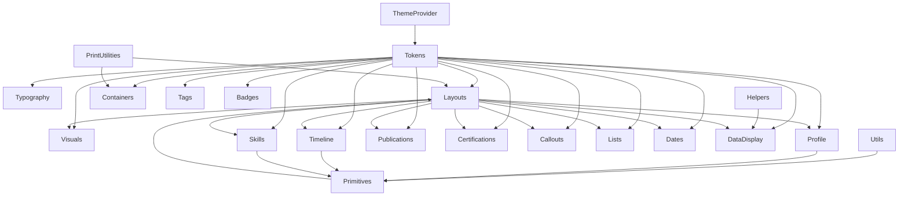

# Resume Core Library

The Resume Core Library provides a comprehensive set of React components, design tokens, utilities, and helpers for building ATS-friendly, visually appealing resume themes. It includes core UI elements such as typography, layouts, skills displays, publications, timelines, profile sections, and print utilities. The library emphasizes semantic HTML, accessibility, print optimization, and internationalization support.

## Purpose and Scope

This page documents the internal architecture and implementation details of the Resume Core Library, focusing on its core UI components, design tokens, utilities, and helper functions. It covers the structure and behavior of components used to build resume themes, including visual elements, typography, layouts, skills, timelines, profile sections, certifications, publications, and print-specific utilities.

This documentation does not cover external dependencies or integrations with resume data sources. For theme management, see the ThemeProvider page. For timeline-specific components, see the Timeline Components page. For skill-related components, see the Skills Components page.

## Architecture Overview

The Resume Core Library is organized into modular subsystems, each responsible for a specific aspect of resume UI or data processing. Components are implemented as styled React components with design tokens for consistent theming. Utilities provide safe URL handling and layout helpers. Calculation helpers analyze resume data for metrics and insights.

```mermaid
flowchart TD
    Tokens["Design Tokens (tokens/index.js)"] --> Typography["Typography Components"]
    Tokens --> Visuals["Visual Components"]
    Tokens --> Layouts["Layout Components"]
    Tokens --> Skills["Skills Components"]
    Tokens --> Timeline["Timeline Components"]
    Tokens --> Profile["Profile Components"]
    Tokens --> Publications["Publication Components"]
    Tokens --> Certifications["Certification Components"]
    Tokens --> Callouts["Callout Components"]
    Tokens --> Lists["List Components"]
    Tokens --> Dates["Date Components"]
    Tokens --> DataDisplay["Data Display Components"]
    Tokens --> Containers["Container Components"]
    Tokens --> Tags["Tag Components"]
    Tokens --> Badges["Badge Components"]
    Tokens --> Providers["ThemeProvider"]

    Utils["Utilities (utils/security.js, utils/Spacer.jsx, utils/Grid.jsx, utils/Flex.jsx, utils/Divider.jsx)"] --> Components["All UI Components"]

    Helpers["Calculation Helpers (helpers/calculations.js)"] --> Metrics["Metrics & Insights"]

    Providers --> Components
    Components --> Layouts
    Components --> Visuals
    Components --> Typography
    Components --> Skills
    Components --> Timeline
    Components --> Profile
    Components --> Publications
    Components --> Certifications
    Components --> Callouts
    Components --> Lists
    Components --> Dates
    Components --> DataDisplay
    Components --> Containers
    Components --> Tags
    Components --> Badges

    Layouts --> Visuals
    Layouts --> Typography
```

**Diagram: High-level component and subsystem relationships within the Resume Core Library**

Sources: `packages/resume-core/src/index.js:1-253`, `packages/resume-core/src/tokens/index.js:1-162`

---

## Design Tokens

**Purpose:** Centralized design tokens provide consistent theming and styling values across all components. They define typography, colors, spacing, layout constraints, border radii, and shadows.

**Primary file:** `packages/resume-core/src/tokens/index.js:1-162`

| Field       | Type   | Purpose                                                                                     |
|-------------|--------|---------------------------------------------------------------------------------------------|
| `typography`| Object | Defines fonts, font sizes, weights, and line heights used throughout the UI.                |
| `colors`    | Object | Defines primary, secondary, accent, background, and border colors as CSS variables.        |
| `spacing`   | Object | Defines spacing units for sections, items, tight spacing, and margins.                      |
| `layout`    | Object | Defines maximum content width and column gaps for grid layouts.                            |
| `radius`    | Object | Defines border-radius sizes for rounded corners.                                           |
| `shadows`   | Object | Defines shadow styles for subtle elevation effects.                                        |
| `rawTokens` | Object | Provides raw CSS values for fonts, sizes, weights, colors, spacing, and layout for non-CSS use cases like PDF generation. |

**Key behaviors:**
- Tokens are exposed as both CSS custom properties and JavaScript objects for flexible usage. `packages/resume-core/src/tokens/index.js:1-162`
- Raw tokens provide fallback values and are used in contexts where CSS variables are not available, such as server-side rendering or PDF generation. `packages/resume-core/src/tokens/index.js:96-162`

---

## Styled-Components Theme Interface

**Purpose:** Extends the `styled-components` DefaultTheme interface to include the Resume Core design tokens for type safety and theme-aware styling.

**Primary file:** `packages/resume-core/src/styled.d.ts:3-46`

| Field       | Type   | Purpose                                                                                     |
|-------------|--------|---------------------------------------------------------------------------------------------|
| `colors`    | Object | Optional color palette including primary, secondary, tertiary, text, link, accent, muted, and border colors. |
| `spacing`   | Object | Optional spacing tokens for section, item, small, and tight spacing.                        |
| `typography`| Object | Optional typography tokens including heading, body, small font sizes, line height, and font weights. |
| `radius`    | Object | Optional border radius sizes: small, medium, full.                                         |

**Key behaviors:**
- All fields are optional to allow partial theme overrides. `packages/resume-core/src/styled.d.ts:4-45`
- Enables theme-aware styled components to access consistent design tokens. 

---

## Visual Components

### DividerVariants

**Purpose:** Provides multiple styled horizontal divider variants including solid, dotted, dashed, gradient, thick, and decorative styles with optional icons.

**Primary file:** `packages/resume-core/src/visuals/DividerVariants.jsx:8-118`

| Component/Variable | Description                                                                                  |
|--------------------|----------------------------------------------------------------------------------------------|
| `Divider`          | Styled `
` element supporting variants with different heights and background styles.      |
| `DecorativeDivider`| Flex container with horizontal lines and a centered icon for decorative dividers.            |
| `Icon`             | Styled span for rendering the icon in decorative dividers.                                   |
| `DividerVariants`  | React component that selects the appropriate divider variant based on props.                 |

**Key behaviors:**
- `Divider` supports variants: `solid`, `dotted`, `dashed`, `gradient`, `thick`. Each variant adjusts height and background accordingly. `packages/resume-core/src/visuals/DividerVariants.jsx:8-51`
- `DecorativeDivider` renders two horizontal lines with a centered icon, used when `variant='decorative'`. `packages/resume-core/src/visuals/DividerVariants.jsx:53-76`
- `DividerVariants` component switches between `Divider` and `DecorativeDivider` based on the `variant` prop, passing color, spacing, and icon props. `packages/resume-core/src/visuals/DividerVariants.jsx:91-118`

---

### ColorBlock

**Purpose:** Renders a colored block section with optional rounded corners and margin for visual hierarchy and grouping.

**Primary file:** `packages/resume-core/src/visuals/ColorBlock.jsx:8-58`

| Component/Variable | Description                                                                                  |
|--------------------|----------------------------------------------------------------------------------------------|
| `Block`            | Styled div with padding, background color, optional border radius, and margin.               |
| `Content`          | Wrapper div for block content with relative positioning.                                    |
| `ColorBlock`       | React component that renders `Block` with passed props and wraps children in `Content`.     |

**Key behaviors:**
- Supports `color` prop for background color, defaulting to muted color. `packages/resume-core/src/visuals/ColorBlock.jsx:8-26`
- Supports `rounded` prop to apply medium border radius. `packages/resume-core/src/visuals/ColorBlock.jsx:8-26`
- Applies print-safe color adjustments and avoids page breaks inside the block. `packages/resume-core/src/visuals/ColorBlock.jsx:8-26`

---

### BorderAccent

**Purpose:** Adds decorative border accents to sections with configurable position, color, padding, and rounded corners.

**Primary file:** `packages/resume-core/src/visuals/BorderAccent.jsx:8-145`

| Component/Variable | Description                                                                                  |
|--------------------|----------------------------------------------------------------------------------------------|
| `Container`        | Styled div applying borders on specified edges or all edges with configurable color and padding. |
| `color`            | Variable for border color used in styled components.                                        |
| `Corner`           | Styled div rendering a corner accent with borders on two edges, positioned absolutely.      |
| `BorderAccent`     | React component rendering either corner accents or bordered container based on `position` prop.|

**Key behaviors:**
- Supports border positions: `left`, `right`, `top`, `bottom`, `all`, and `corners`. `packages/resume-core/src/visuals/BorderAccent.jsx:110-145`
- When `position='corners'`, renders four `Corner` components at each corner with border lines. `packages/resume-core/src/visuals/BorderAccent.jsx:110-145`
- Applies print-safe color adjustments and avoids page breaks inside the container. `packages/resume-core/src/visuals/BorderAccent.jsx:8-145`

---

### BackgroundPattern

**Purpose:** Renders a subtle background pattern overlay for visual interest with configurable pattern type and opacity.

**Primary file:** `packages/resume-core/src/visuals/BackgroundPattern.jsx:8-63`

| Component/Variable | Description                                                                                  |
|--------------------|----------------------------------------------------------------------------------------------|
| `Pattern`          | Styled div with absolute positioning and background-image based on pattern type (`dots`, `grid`, `diagonal`). |
| `BackgroundPattern`| React component rendering the `Pattern` with props for pattern type, opacity, and className.|

**Key behaviors:**
- Supports pattern types: `dots` (radial dots), `grid` (vertical and horizontal lines), and `diagonal` (repeating diagonal lines). `packages/resume-core/src/visuals/BackgroundPattern.jsx:8-47`
- Pattern opacity defaults to 0.05 for subtlety. `packages/resume-core/src/visuals/BackgroundPattern.jsx:8-63`
- Pattern is hidden in print media to avoid clutter. `packages/resume-core/src/visuals/BackgroundPattern.jsx:8-63`

---

## Security Utilities

### safeUrl

**Purpose:** Sanitizes URLs to prevent XSS attacks by blocking dangerous protocols and allowing only safe schemes or relative URLs.

**Primary file:** `packages/resume-core/src/utils/security.js:20-61`

| Variable           | Description                                                                                  |
|--------------------|----------------------------------------------------------------------------------------------|
| `trimmed`          | URL string trimmed of whitespace.                                                           |
| `dangerousProtocols`| Regex matching dangerous protocols (`javascript:`, `data:`, `vbscript:`, `file:`, `about:`). |
| `safeProtocols`    | Regex matching safe protocols (`http`, `https`, `mailto`, `tel`, `sms`, `ftp`).             |

**Key behaviors:**
- Returns `null` for invalid or dangerous URLs. `packages/resume-core/src/utils/security.js:20-61`
- Allows relative URLs starting with `/` or `.`. `packages/resume-core/src/utils/security.js:20-61`
- Converts URLs starting with `www.` or domain-like strings to `https://` prefixed URLs. `packages/resume-core/src/utils/security.js:20-61`
- Logs warnings for blocked or uncertain URLs. `packages/resume-core/src/utils/security.js:20-61`

---

### getLinkRel

**Purpose:** Returns appropriate `rel` attribute values for external links to improve security when opening in new tabs.

**Primary file:** `packages/resume-core/src/utils/security.js:75-86`

**Key behaviors:**
- Returns `'noopener noreferrer'` for HTTP(S) URLs opened in new tabs. `packages/resume-core/src/utils/security.js:75-86`
- Returns empty string for other URLs or when not opening in new tab. `packages/resume-core/src/utils/security.js:75-86`

---

### sanitizeHtml

**Purpose:** Escapes dangerous HTML characters to prevent XSS in rendered HTML content.

**Primary file:** `packages/resume-core/src/utils/security.js:99-110`

**Key behaviors:**
- Replaces `&`, `<`, `>`, `"`, and `'` with HTML entities. `packages/resume-core/src/utils/security.js:99-110`
- Returns empty string for invalid or non-string input. `packages/resume-core/src/utils/security.js:99-110`

---

### isExternalUrl

**Purpose:** Determines if a URL is external relative to the current site origin.

**Primary file:** `packages/resume-core/src/utils/security.js:123-155`

| Variable | Description                                                                                  |
|----------|----------------------------------------------------------------------------------------------|
| `urlObj` | URL object constructed from input URL and current origin for origin comparison.             |

**Key behaviors:**
- Returns `false` for relative URLs and special schemes like `mailto:` or `tel:`. `packages/resume-core/src/utils/security.js:123-155`
- Uses `window.location.origin` if no origin is provided and running in browser. `packages/resume-core/src/utils/security.js:123-155`
- Returns `true` if URL origin differs from current origin, or if URL is invalid. `packages/resume-core/src/utils/security.js:123-155`

---

## Typography Components

### Text

**Purpose:** Body text component with customizable size, weight, color, line height, and spacing.

**Primary file:** `packages/resume-core/src/typography/Text.jsx:8-40`

| Prop       | Type     | Description                                  |
|------------|----------|----------------------------------------------|
| `size`     | string   | Font size (CSS value or token).               |
| `weight`   | string   | Font weight (CSS value or token).             |
| `color`    | string   | Text color (CSS value or token).               |
| `lineHeight`| string  | Line height (CSS value or token).             |
| `spacing`  | string   | Bottom margin spacing (CSS value).            |
| `as`       | string   | HTML element to render as (default: `p`).    |

**Key behaviors:**
- Uses styled-components for styling with CSS variables fallback. `packages/resume-core/src/typography/Text.jsx:8-40`
- Supports custom HTML element via `as` prop. `packages/resume-core/src/typography/Text.jsx:8-40`

---

### SectionIntroParagraph

**Purpose:** Larger, softer paragraph designed to open sections with increased line height and optional max width.

**Primary file:** `packages/resume-core/src/typography/SectionIntroParagraph.jsx:24-60`

| Prop       | Type     | Description                                  |
|------------|----------|----------------------------------------------|
| `children` | ReactNode| Content to render.                            |
| `color`    | string   | Text color override.                          |
| `maxWidth` | string   | Maximum width constraint.                     |
| `as`       | string   | HTML element to render as (default: `p`).    |

**Key behaviors:**
- Applies opacity 0.95 for softer appearance, resets to 1 in print. `packages/resume-core/src/typography/SectionIntroParagraph.jsx:24-60`
- Avoids page breaks inside for print readability. `packages/resume-core/src/typography/SectionIntroParagraph.jsx:24-60`

---

### QuoteStripe

**Purpose:** Single-line pull-quote with left accent border and padding to prevent curly quote clipping.

**Primary file:** `packages/resume-core/src/typography/QuoteStripe.jsx:29-76`

| Prop         | Type     | Description                                  |
|--------------|----------|----------------------------------------------|
| `children`   | ReactNode| Quote content.                               |
| `accentColor`| string   | Color of left border accent.                 |
| `borderWidth`| string   | Width of left border (default: '3px').      |
| `fontStyle`  | string   | Font style (italic or normal).               |
| `paddingLeft`| string   | Left padding inside accent rule.             |

**Key behaviors:**
- Enforces single-line with `white-space: nowrap` and ellipsis overflow. `packages/resume-core/src/typography/QuoteStripe.jsx:29-76`
- Provides print optimization with color and border adjustments. `packages/resume-core/src/typography/QuoteStripe.jsx:29-76`

---

### Label

**Purpose:** Small inline label or caption text with optional uppercase styling.

**Primary file:** `packages/resume-core/src/typography/Label.jsx:8-36`

| Prop       | Type     | Description                                  |
|------------|----------|----------------------------------------------|
| `weight`   | string   | Font weight (CSS value or token).             |
| `color`    | string   | Text color (CSS value or token).               |
| `uppercase`| boolean  | Uppercase text transformation (default: false). |
| `as`       | string   | HTML element to render as (default: `span`). |

**Key behaviors:**
- Applies letter spacing when uppercase for improved readability. `packages/resume-core/src/typography/Label.jsx:8-36`

---

### HyphenationSafeParagraph

**Purpose:** Paragraph component with balanced hyphenation and language support for improved text flow and readability.

**Primary file:** `packages/resume-core/src/typography/HyphenationSafeParagraph.jsx:34-96`

| Prop       | Type     | Description                                  |
|------------|----------|----------------------------------------------|
| `children` | ReactNode| Content to render.                            |
| `lang`     | string   | Language code for hyphenation (default: 'en'). |
| `color`    | string   | Text color override.                          |
| `textAlign`| string   | Text alignment (default: 'left').            |
| `maxLines` | number   | Maximum lines before truncation.              |
| `as`       | string   | HTML element to render as (default: `p`).    |

**Key behaviors:**
- Enables CSS hyphenation with vendor prefixes. `packages/resume-core/src/typography/HyphenationSafeParagraph.jsx:34-96`
- Supports line clamping with ellipsis for truncation. `packages/resume-core/src/typography/HyphenationSafeParagraph.jsx:34-96`
- Disables hyphenation in print for cleaner output. `packages/resume-core/src/typography/HyphenationSafeParagraph.jsx:34-96`

---

### Heading

**Purpose:** Semantic heading component with configurable level, weight, color, and spacing.

**Primary file:** `packages/resume-core/src/typography/Heading.jsx:8-46`

| Prop       | Type     | Description                                  |
|------------|----------|----------------------------------------------|
| `level`    | number   | Heading level (1-6, default: 2).             |
| `weight`   | string   | Font weight (CSS value or token).             |
| `color`    | string   | Text color (CSS value or token).               |
| `spacing`  | string   | Bottom margin spacing.                         |
| `as`       | string   | HTML element to render as (overrides level). |

**Key behaviors:**
- Maps heading levels to font sizes for visual hierarchy. `packages/resume-core/src/typography/Heading.jsx:8-46`
- Uses semantic HTML tags for accessibility. `packages/resume-core/src/typography/Heading.jsx:8-46`

---

## Timeline Components

### TimelineSection

**Purpose:** Container for grouping timeline items with spacing and print-safe page break avoidance.

**Primary file:** `packages/resume-core/src/timeline/TimelineSection.jsx:8-19`

**Key behaviors:**
- Applies bottom margin and avoids page breaks inside for print. `packages/resume-core/src/timeline/TimelineSection.jsx:8-19`

---

### TimelineItem

**Purpose:** Individual timeline entry with optional vertical connector line and customizable marker.

**Primary file:** `packages/resume-core/src/timeline/TimelineItem.jsx:8-104`

| Prop         | Type     | Description                                  |
|--------------|----------|----------------------------------------------|
| `title`      | string   | Timeline item title.                          |
| `meta`       | string   | Metadata displayed alongside title.          |
| `showLine`   | boolean  | Whether to show vertical connector line (default: true). |
| `markerColor`| string   | Color of the circular marker.                 |
| `markerSize` | string   | Size of the marker circle.                     |
| `children`   | ReactNode| Description or content of the timeline item. |

**Key behaviors:**
- Renders a vertical line connecting items when `showLine` is true. `packages/resume-core/src/timeline/TimelineItem.jsx:8-104`
- Marker is a colored circle with border matching background for contrast. `packages/resume-core/src/timeline/TimelineItem.jsx:8-104`
- Supports flexible content with title, meta, and description. `packages/resume-core/src/timeline/TimelineItem.jsx:8-104`

---

### TimelineRuleMinimal

**Purpose:** Minimal vertical timeline with tick marks and labels for chronological display.

**Primary file:** `packages/resume-core/src/timeline/TimelineRuleMinimal.tsx:27-163`

| Interface            | Description                                  |
|----------------------|----------------------------------------------|
| `TimelineItem`       | Defines `date`, optional `label`, and optional `meta` for timeline entries. |
| `TimelineRuleMinimalProps` | Props including array of `items`, line color, tick height/width, and className. |

| Component/Variable | Description                                                                                  |
|--------------------|----------------------------------------------------------------------------------------------|
| `Container`        | Flex column container with gap and print-safe break avoidance.                              |
| `Rule`             | Vertical line styled with configurable color.                                              |
| `Item`             | Flex row with tick, date, and content.                                                     |
| `Tick`             | Small horizontal bar representing timeline tick mark with minimum height enforcement.      |
| `Date`             | Date label with small font size and muted color.                                           |
| `Content`          | Container for label and meta text.                                                        |
| `Label`            | Bold label text for timeline item.                                                        |
| `Meta`             | Muted meta text for additional info.                                                      |
| `TimelineRuleMinimal` | React component rendering the timeline rule with ticks and labels.                        |

**Key behaviors:**
- Enforces minimum tick height of 2pt for print visibility. `packages/resume-core/src/timeline/TimelineRuleMinimal.tsx:60-104`
- Supports custom line color and tick dimensions. `packages/resume-core/src/timeline/TimelineRuleMinimal.tsx:137-163`
- Avoids page breaks inside timeline container for print. `packages/resume-core/src/timeline/TimelineRuleMinimal.tsx:49-58`

---

### TimelineInline

**Purpose:** Compact inline date range display with typographically correct en dash and locale-aware formatting.

**Primary file:** `packages/resume-core/src/timeline/TimelineInline.tsx:34-200`

| Interface            | Description                                  |
|----------------------|----------------------------------------------|
| `TimelineInlineProps`| Props including startDate, optional endDate, format, locale, presentLabel, numberingSystem, and styling options. |

| Constant             | Description                                  |
|----------------------|----------------------------------------------|
| `EN_DASH`            | Unicode en dash character (U+2013).          |
| `NARROW_NO_BREAK_SPACE` | Unicode narrow no-break space (U+202F).    |

| Function             | Description                                  |
|----------------------|----------------------------------------------|
| `formatSingleDate`   | Formats a single date string or Date object using Intl.DateTimeFormat with locale and numbering system support. |
| `getPresentLabel`    | Returns localized label for ongoing positions ("Present") based on locale. |

| Component/Variable   | Description                                  |
|---------------------|----------------------------------------------|
| `InlineContainer`   | Styled span container with small font and tabular numbers. |
| `DateText`          | Styled span for date text.                   |
| `Separator`         | Styled span for the en dash separator.      |
| `TimelineInline`    | React component rendering formatted date range with proper separator and localization. |

**Key behaviors:**
- Uses en dash with narrow no-break spaces for typographic correctness. `packages/resume-core/src/timeline/TimelineInline.tsx:159-200`
- Supports multiple date formats (`short`, `long`, `numeric`) and locales. `packages/resume-core/src/timeline/TimelineInline.tsx:64-98`
- Displays localized "Present" label for ongoing roles. `packages/resume-core/src/timeline/TimelineInline.tsx:103-130`

---

## Skills Components

### SkillRating

**Purpose:** Visual rating component displaying skill proficiency as filled and unfilled dots.

**Primary file:** `packages/resume-core/src/skills/SkillRating.jsx:8-58`

| Component/Variable | Description                                                                                  |
|--------------------|----------------------------------------------------------------------------------------------|
| `Container`        | Flex container aligning skill name and rating dots.                                         |
| `SkillName`        | Text span for skill name.                                                                    |
| `RatingContainer`  | Flex container for rating dots.                                                             |
| `Dot`              | Circular dot styled as filled or unfilled based on rating.                                  |
| `SkillRating`      | React component rendering skill name and rating dots with configurable max and size.         |

**Key behaviors:**
- Supports custom max rating and dot size. `packages/resume-core/src/skills/SkillRating.jsx:41-58`
- Uses CSS variables for colors and print-safe adjustments. `packages/resume-core/src/skills/SkillRating.jsx:26-39`

---

### SkillPill

**Purpose:** Badge-style skill display with filled or outlined variants and size options.

**Primary file:** `packages/resume-core/src/skills/SkillPill.jsx:8-54`

| Component/Variable | Description                                                                                  |
|--------------------|----------------------------------------------------------------------------------------------|
| `Pill`             | Styled span with padding, background, border, color, and border-radius based on props.      |
| `SkillPill`        | React component rendering a skill badge with variant, size, rounded corners, and className. |

**Key behaviors:**
- Supports `filled` and `outlined` variants with corresponding colors and borders. `packages/resume-core/src/skills/SkillPill.jsx:8-35`
- Supports `small` and `medium` sizes with adjusted padding and font size. `packages/resume-core/src/skills/SkillPill.jsx:8-35`
- Rounded corners default to fully rounded pills, can be disabled. `packages/resume-core/src/skills/SkillPill.jsx:8-35`

---

### SkillGroup

**Purpose:** Displays a group of skills optionally categorized with customizable separators.

**Primary file:** `packages/resume-core/src/skills/SkillGroup.jsx:8-54`

| Component/Variable | Description                                                                                  |
|--------------------|----------------------------------------------------------------------------------------------|
| `Container`        | Wrapper div with bottom margin.                                                             |
| `Category`         | Heading for skill category.                                                                 |
| `Skills`           | Flex container wrapping skill items with gap.                                              |
| `Skill`            | Inline span for individual skill with separator after each except last.                     |
| `SkillGroup`       | React component rendering category title and list of skills with separators.                |

**Key behaviors:**
- Supports skills as strings or objects with `name` property. `packages/resume-core/src/skills/SkillGroup.jsx:36-54`
- Separator defaults to middle dot (`•`), customizable via prop. `packages/resume-core/src/skills/SkillGroup.jsx:36-54`

---

### SkillCloud

**Purpose:** Tag cloud style skill display with font size and background intensity based on skill level.

**Primary file:** `packages/resume-core/src/skills/SkillCloud.jsx:8-51`

| Component/Variable | Description                                                                                  |
|--------------------|----------------------------------------------------------------------------------------------|
| `Container`        | Flex container with wrapping and gap.                                                      |
| `SkillTag`         | Inline span with font size and background color intensity proportional to skill level.      |
| `SkillCloud`       | React component rendering skills as tags with weighted visual emphasis.                     |

**Key behaviors:**
- Normalizes skill levels to a 0-100 scale for visual weighting. `packages/resume-core/src/skills/SkillCloud.jsx:38-51`
- Supports skills as strings or objects with `name` and `level`. `packages/resume-core/src/skills/SkillCloud.jsx:38-51`

---

### SkillCategory

**Purpose:** Displays categorized skills in a hierarchical list with optional skill levels.

**Primary file:** `packages/resume-core/src/skills/SkillCategory.jsx:8-69`

| Component/Variable | Description                                                                                  |
|--------------------|----------------------------------------------------------------------------------------------|
| `Container`        | Wrapper div with bottom margin.                                                             |
| `CategoryTitle`    | Heading for skill category with bottom border.                                             |
| `SkillList`        | Unordered list of skills.                                                                   |
| `SkillItem`        | List item with skill name and optional level.                                              |
| `SkillName`        | Span for skill name.                                                                        |
| `SkillLevel`       | Span for skill level text with accent color.                                               |
| `SkillCategory`    | React component rendering category title and skill list with optional levels.              |

**Key behaviors:**
- Supports skills as strings or objects with `name` and `level`. `packages/resume-core/src/skills/SkillCategory.jsx:46-69`
- Displays skill levels only if `showLevel` is true and skill object has `level`. `packages/resume-core/src/skills/SkillCategory.jsx:46-69`

---

### SkillBar

**Purpose:** Horizontal bar visualization of skill proficiency with optional percentage label.

**Primary file:** `packages/resume-core/src/skills/SkillBar.jsx:8-64`

| Component/Variable | Description                                                                                  |
|--------------------|----------------------------------------------------------------------------------------------|
| `Container`        | Wrapper div with bottom margin.                                                             |
| `Label`            | Flex container showing skill name and optional percentage.                                 |
| `BarContainer`     | Background bar container with border radius.                                               |
| `BarFill`          | Colored fill bar representing skill level percentage.                                     |
| `SkillBar`         | React component rendering skill name, proficiency bar, and optional percentage text.       |

**Key behaviors:**
- Supports custom bar height, color, and showing percentage text. `packages/resume-core/src/skills/SkillBar.jsx:45-64`
- Animates bar width changes smoothly. `packages/resume-core/src/skills/SkillBar.jsx:45-64`

---

## Profile Components

### Avatar

**Purpose:** Displays a profile image or placeholder with configurable size, shape, and border.

**Primary file:** `packages/resume-core/src/profile/Avatar.jsx:8-64`

| Component/Variable | Description                                                                                  |
|--------------------|----------------------------------------------------------------------------------------------|
| `Image`            | Styled `` with size, border radius, border, and object-fit.                            |
| `Placeholder`      | Styled div showing initial letter if no image is provided.                                 |
| `Avatar`           | React component rendering image or placeholder with props for size, rounded corners, and border.|

**Key behaviors:**
- Falls back to first letter of `alt` text if no image or fallback provided. `packages/resume-core/src/profile/Avatar.jsx:37-64`
- Supports square or circular shapes via `rounded` prop. `packages/resume-core/src/profile/Avatar.jsx:8-64`
- Optional border around image or placeholder. `packages/resume-core/src/profile/Avatar.jsx:8-64`

---

### ProfileCard

**Purpose:** Composite card displaying profile information including name, title, summary, and avatar.

**Primary file:** `packages/resume-core/src/profile/ProfileCard.jsx:8-71`

| Component/Variable | Description                                                                                  |
|--------------------|----------------------------------------------------------------------------------------------|
| `Card`             | Flex container with configurable direction, padding, border, and border radius.             |
| `Info`             | Content container for textual information.                                                 |
| `Name`             | Large heading for full name.                                                               |
| `Title`            | Subheading for job title or role.                                                          |
| `Summary`          | Paragraph for profile summary or bio.                                                      |
| `ProfileCard`      | React component rendering avatar and profile information with layout control.               |

**Key behaviors:**
- Supports vertical or horizontal layout via `direction` prop. `packages/resume-core/src/profile/ProfileCard.jsx:51-71`
- Applies print-safe borders and avoids page breaks inside card. `packages/resume-core/src/profile/ProfileCard.jsx:8-71`

---

### SocialLinks

**Purpose:** Displays a list of social media or profile links with optional icons.

**Primary file:** `packages/resume-core/src/profile/SocialLinks.jsx:8-59`

| Component/Variable | Description                                                                                  |
|--------------------|----------------------------------------------------------------------------------------------|
| `Container`        | Flex container with wrapping and gap.                                                      |
| `Link`             | Styled anchor with padding, border, hover effects, and rounded corners.                     |
| `Icon`             | Inline flex container for icon or emoji.                                                  |
| `SocialLinks`      | React component rendering social profile links with optional icons and accessibility labels.|

**Key behaviors:**
- Links open in new tabs with `noopener noreferrer` for security. `packages/resume-core/src/profile/SocialLinks.jsx:42-59`
- Supports showing or hiding icons via `showIcon` prop. `packages/resume-core/src/profile/SocialLinks.jsx:42-59`

---

### ContactGrid

**Purpose:** Grid layout for displaying contact information with icons and links.

**Primary file:** `packages/resume-core/src/profile/ContactGrid.jsx:8-61`

| Component/Variable | Description                                                                                  |
|--------------------|----------------------------------------------------------------------------------------------|
| `Grid`             | CSS grid container with responsive columns and gap.                                        |
| `Item`             | Flex container for individual contact item with icon and text/link.                        |
| `Icon`             | Colored icon span.                                                                         |
| `Link`             | Styled anchor with hover color change.                                                    |
| `ContactGrid`      | React component rendering contact items with optional URLs and icons.                      |

**Key behaviors:**
- Supports clickable links opening in new tabs with security attributes. `packages/resume-core/src/profile/ContactGrid.jsx:44-61`
- Adapts font size and layout for print and small screens. `packages/resume-core/src/profile/ContactGrid.jsx:8-61`

---

## Data Display Components

### ProgressCircle

**Purpose:** Circular progress indicator showing a value relative to a maximum with optional label and value display.

**Primary file:** `packages/resume-core/src/data/ProgressCircle.jsx:8-79`

| Component/Variable | Description                                                                                  |
|--------------------|----------------------------------------------------------------------------------------------|
| `Container`        | Inline-flex container with vertical stacking.                                             |
| `Circle`           | SVG element rotated -90 degrees for progress arc.                                          |
| `Label`            | Text label below the circle.                                                               |
| `ProgressCircle`   | React component rendering SVG circles with stroke dash offset to visualize progress.       |

**Key behaviors:**
- Calculates radius and circumference based on size and stroke width. `packages/resume-core/src/data/ProgressCircle.jsx:25-79`
- Supports showing numeric progress value inside the circle. `packages/resume-core/src/data/ProgressCircle.jsx:25-79`
- Uses rounded stroke caps for smooth arc ends. `packages/resume-core/src/data/ProgressCircle.jsx:25-79`

---

### StatCard

**Purpose:** Card displaying a single statistic or metric with optional label and description.

**Primary file:** `packages/resume-core/src/data/StatCard.jsx:8-63`

| Component/Variable | Description                                                                                  |
|--------------------|----------------------------------------------------------------------------------------------|
| `Card`             | Container with padding, border, and border radius.                                         |
| `Value`            | Large, bold value text with configurable size and color.                                  |
| `Label`            | Smaller label text below the value.                                                       |
| `Description`      | Optional descriptive text below the label.                                                |
| `StatCard`         | React component rendering a metric card with value, label, and description.                |

**Key behaviors:**
- Supports text alignment via `align` prop. `packages/resume-core/src/data/StatCard.jsx:45-63`
- Applies print-safe borders and avoids page breaks inside card. `packages/resume-core/src/data/StatCard.jsx:8-63`

---

### MetricInline

**Purpose:** Inline bold numeric text styled consistently for embedding metrics within paragraphs.

**Primary file:** `packages/resume-core/src/data/MetricInline.jsx:15-58`

| Component/Variable | Description                                                                                  |
|--------------------|----------------------------------------------------------------------------------------------|
| `StyledMetric`     | Styled `<strong>` element with font weight and size variants.                              |
| `MetricInline`     | React component rendering inline metric text with size variants (`sm`, `md`, `lg`).        |

**Key behaviors:**
- Uses font weight instead of color for accessibility and print compatibility. `packages/resume-core/src/data/MetricInline.jsx:15-58`
- Supports three size variants affecting font weight and size. `packages/resume-core/src/data/MetricInline.jsx:15-58`

---

### MetricBullet and MetricBulletList

**Purpose:** Bullet points with leading bold metric tokens aligned for vertical rhythm, ideal for achievement lists.

**Primary file:** `packages/resume-core/src/data/MetricBullet.jsx:15-127`

| Component/Variable | Description                                                                                  |
|--------------------|----------------------------------------------------------------------------------------------|
| `BulletContainer`  | Styled list item container with spacing variants.                                          |
| `Metric`           | Bold metric text with alignment options (`left` or `right`).                              |
| `Content`          | Description text next to metric.                                                          |
| `Bullet`           | Bullet character styled with accent color.                                                |
| `MetricBullet`     | React component rendering a metric bullet with metric, description, alignment, and spacing.|
| `ListContainer`    | Styled unordered list container for multiple metric bullets.                              |
| `MetricBulletList` | React component rendering a list of `MetricBullet` children.                              |

**Key behaviors:**
- Supports metric alignment left or right with bullet placement accordingly. `packages/resume-core/src/data/MetricBullet.jsx:76-99`
- Supports tight or normal vertical spacing between bullets. `packages/resume-core/src/data/MetricBullet.jsx:76-99`
- `MetricBulletList` provides container with no default list styles. `packages/resume-core/src/data/MetricBullet.jsx:118-127`

---

### MetricBar

**Purpose:** Horizontal bar visualization with label and value, showing progress or proficiency.

**Primary file:** `packages/resume-core/src/data/MetricBar.jsx:8-91`

| Component/Variable | Description                                                                                  |
|--------------------|----------------------------------------------------------------------------------------------|
| `Container`        | Wrapper div with bottom margin.                                                             |
| `Header`           | Flex container with label and value aligned.                                               |
| `Label`            | Label text for the metric.                                                                 |
| `Value`            | Value text displayed alongside label.                                                     |
| `Bar`              | Background bar container with border radius.                                               |
| `Fill`             | Colored fill bar representing percentage value.                                           |
| `InnerLabel`       | Optional label inside the fill bar.                                                       |
| `MetricBar`        | React component rendering labeled horizontal bar with configurable height and color.       |

**Key behaviors:**
- Calculates fill width as percentage of `value` over `max`. `packages/resume-core/src/data/MetricBar.jsx:67-91`
- Supports showing label inside the fill bar. `packages/resume-core/src/data/MetricBar.jsx:67-91`

---

### KeyValueInline and KeyValue

**Purpose:** Inline display of key-value pairs separated by commas, optimized for metadata or technical specs.

**Primary file:** `packages/resume-core/src/data/KeyValueInline.jsx:18-148`

| Component/Variable | Description                                                                                  |
|--------------------|----------------------------------------------------------------------------------------------|
| `Container`        | Inline container with configurable font size and color.                                    |
| `KeyValuePair`     | Inline span wrapping a single key-value pair.                                              |
| `Key`              | Bold key label with no wrap before colon.                                                 |
| `Colon`            | Colon character with no wrap after key.                                                   |
| `Value`            | Inline block for value text.                                                              |
| `Separator`        | Comma separator between pairs.                                                            |
| `KeyValue`         | React component rendering a single key-value pair with key and value.                      |
| `KeyValueInline`   | React component rendering a list of key-value pairs or manual children with separators.    |

**Key behaviors:**
- Supports both array of pairs and manual children composition. `packages/resume-core/src/data/KeyValueInline.jsx:110-148`
- Prevents line breaks between key and colon for readability. `packages/resume-core/src/data/KeyValueInline.jsx:18-148`

---

### KPIChip and KPIChipLine

**Purpose:** Displays small text chips for key performance indicators in a horizontal row with optional dividers.

**Primary file:** `packages/resume-core/src/data/KPIChipLine.jsx:18-156`

| Component/Variable | Description                                                                                  |
|--------------------|----------------------------------------------------------------------------------------------|
| `ChipContainer`    | Flex container wrapping KPI chips with configurable gap and margin.                        |
| `Chip`             | Stroke-less pill-shaped chip with border and text styling.                                |
| `Divider`          | Optional divider character between chips.                                                 |
| `KPIChip`          | React component rendering a single KPI chip with size variants.                           |
| `KPIChipLine`      | React component rendering a row of KPI chips with optional dividers and spacing.          |

**Key behaviors:**
- Chips have transparent backgrounds for print optimization and high contrast. `packages/resume-core/src/data/KPIChipLine.jsx:18-156`
- Supports size variants `xs`, `sm`, and `md`. `packages/resume-core/src/data/KPIChipLine.jsx:18-156`
- Dividers between chips can be customized or disabled. `packages/resume-core/src/data/KPIChipLine.jsx:18-156`

---

## Utilities

### Divider

**Purpose:** Horizontal line separator with configurable thickness, color, and spacing.

**Primary file:** `packages/resume-core/src/utils/Divider.jsx:8-30`

| Component/Variable | Description                                                                                  |
|--------------------|----------------------------------------------------------------------------------------------|
| `StyledDivider`    | Styled `
` with configurable height, background color, and margin.                      |
| `Divider`          | React component rendering the styled divider with props for thickness, color, and spacing. |

**Key behaviors:**
- Defaults to 1px thickness and theme border color. `packages/resume-core/src/utils/Divider.jsx:8-30`
- Applies print-safe color adjustments. `packages/resume-core/src/utils/Divider.jsx:8-30`

---

### Spacer

**Purpose:** Empty space component for layout spacing with configurable width and height.

**Primary file:** `packages/resume-core/src/utils/Spacer.jsx:8-16`

| Component/Variable | Description                                                                                  |
|--------------------|----------------------------------------------------------------------------------------------|
| `StyledSpacer`     | Styled div with configurable width and height, prevents shrinking.                         |
| `Spacer`           | React component rendering the styled spacer with width and height props.                   |

**Key behaviors:**
- Defaults to full width and theme item spacing height. `packages/resume-core/src/utils/Spacer.jsx:8-16`

---

### Flex and Grid

**Purpose:** Simplified flex and grid container components aliasing layout components.

**Primary files:** `packages/resume-core/src/utils/Flex.jsx:8-26`, `packages/resume-core/src/utils/Grid.jsx:8-13`

**Key behaviors:**
- `Flex` exports `FlexLayout` for flexible box layouts. `packages/resume-core/src/utils/Flex.jsx:8-26`
- `Grid` exports `GridLayout` for responsive grid layouts. `packages/resume-core/src/utils/Grid.jsx:8-13`

---

## Theme Provider

**Purpose:** Provides theme context and applies global styles and CSS custom properties for theming.

**Primary file:** `packages/resume-core/src/providers/ThemeProvider.jsx:9-54`

| Variable           | Description                                                                                  |
|--------------------|----------------------------------------------------------------------------------------------|
| `ThemeContext`     | React context holding current theme and setter function.                                   |
| `GlobalStyles`     | Global CSS reset and base styles applied via styled-components.                            |
| `[currentTheme, setCurrentTheme]` | State hook holding current theme name and setter.                              |

| Function           | Description                                                                                  |
|--------------------|----------------------------------------------------------------------------------------------|
| `ThemeProvider`    | React component providing theme context, applying global styles, and setting `data-theme` attribute on document root. |
| `useTheme`         | Hook to access theme context, throws if used outside `ThemeProvider`.                      |

**Key behaviors:**
- Applies theme name as `data-theme` attribute on `<html>` for CSS variable scoping. `packages/resume-core/src/providers/ThemeProvider.jsx:30-46`
- Provides setter to change theme dynamically. `packages/resume-core/src/providers/ThemeProvider.jsx:30-46`
- Applies global box-sizing, font family, font size, line height, and colors. `packages/resume-core/src/providers/ThemeProvider.jsx:14-28`

---

## Calculations Helpers

**Purpose:** Pure functions to compute metrics and insights from JSON Resume data for display in themes.

**Primary file:** `packages/resume-core/src/helpers/calculations.js:19-428`

| Function                        | Returns                 | Purpose                                                                                   |
|--------------------------------|-------------------------|-------------------------------------------------------------------------------------------|
| `calculateTotalExperience`      | number                  | Total years of professional work experience, rounded to nearest year.                    |
| `calculateCurrentRoleExperience`| number                 | Years in current or most recent role, rounded to 1 decimal.                              |
| `countCompanies`                | number                  | Number of unique companies worked at.                                                   |
| `countProjects`                 | number                  | Total number of projects.                                                                |
| `countPublications`             | number                  | Total number of publications.                                                            |
| `countAwards`                   | number                  | Total number of awards.                                                                  |
| `countTotalSkills`              | number                  | Total number of skill keywords across all skill categories.                              |
| `countSkillCategories`          | number                  | Number of skill categories.                                                              |
| `countLanguages`                | number                  | Number of languages spoken.                                                              |
| `calculateVolunteerYears`       | number                  | Total years of volunteer experience.                                                    |
| `calculateEducationYears`       | number                  | Total years of education.                                                                |
| `getHighestDegree`              | string                  | Highest degree or study type attained.                                                  |
| `countCareerPositions`          | number                  | Number of distinct career positions held.                                               |
| `getCareerProgressionRate`      | number                  | Average years per position (career progression rate).                                   |
| `countTotalHighlights`          | number                  | Total number of highlights/achievements across work experience.                         |
| `getUniqueIndustries`           | Array<string>           | List of unique industries from work history.                                            |
| `getCurrentEmployer`            | Object|null             | Most recent or current employer object.                                                 |
| `isCurrentlyEmployed`           | boolean                 | Whether currently employed (any work entry without end date).                           |
| `calculateKeyMetrics`           | Array<Object>           | Aggregated key metrics for dashboard display (years experience, companies, projects, etc.)|

**Key behaviors:**
- Handles missing or empty arrays gracefully by returning zero or empty results. `packages/resume-core/src/helpers/calculations.js:19-428`
- Uses leap-year-aware year calculations (365.25 days). `packages/resume-core/src/helpers/calculations.js:19-33`
- Uses sets to count unique companies, positions, and industries. `packages/resume-core/src/helpers/calculations.js:67-73`, `257-265`, `312-318`
- Aggregates multiple metrics into a single array for dashboard use. `packages/resume-core/src/helpers/calculations.js:364-428`

---

## Key Relationships

The Resume Core Library depends on `styled-components` for styling and React for component composition. It exports a unified API surface from `src/index.js` that aggregates all subsystems. The ThemeProvider applies design tokens and global styles, enabling consistent theming across components.

Visual components such as dividers, color blocks, and border accents rely on design tokens for colors and spacing. Typography components use tokens for font sizes and weights. Layout components orchestrate the arrangement of visual and content components.

Calculation helpers consume raw resume JSON data and provide metrics to data display components like StatCard and KPIChipLine. Utilities like `safeUrl` and `isExternalUrl` ensure security in link handling, used by primitives like Link and ContactInfo.

Print utilities provide components that optimize resume rendering for physical print, including page headers, footers, breaks, and shadow emulation.

**Relationships between major subsystems and their dependencies**

Sources: `packages/resume-core/src/index.js:1-253`, `packages/resume-core/src/helpers/calculations.js:19-428`