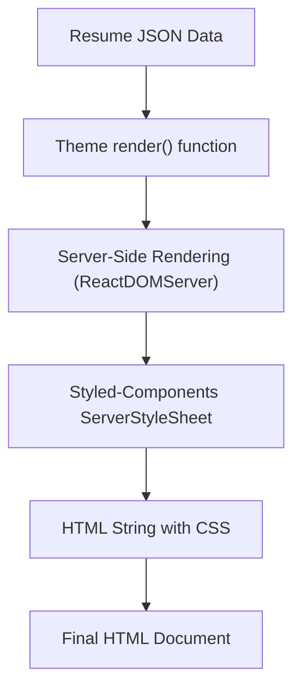
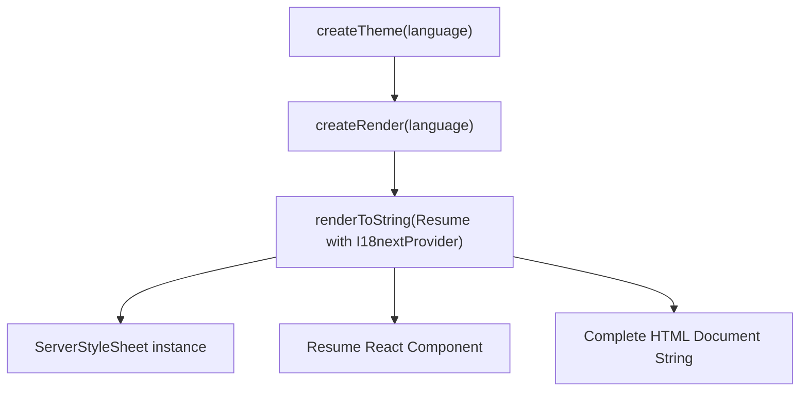
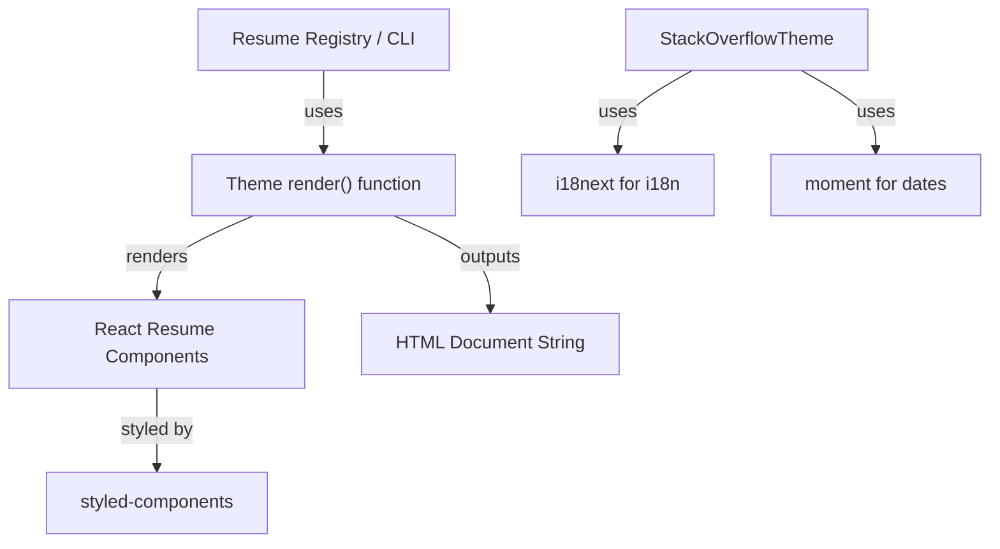

# Theme Packages

This documentation covers the internal implementation of various resume themes, focusing on their components, styles, and rendering configurations. It details the Stack Overflow theme's rendering pipeline and UI components, as well as the structure and styling of multiple JSON Resume themes such as Urban Techno, Tailwind, Tokyo Modernist, Professional, Marketing Narrative, London Bureau, Investor Brief, Government Standard, French Atelier, and others. Each theme provides a unique visual and structural approach to rendering resume data, using React components, styled-components, and server-side rendering techniques.

## Purpose and Scope

This page documents the internal architecture and implementation details of multiple resume themes used in the system. It explains how each theme renders resume data into styled HTML, the component hierarchies, styling strategies, and rendering pipelines. The focus is on the Stack Overflow theme's rendering mechanism and its UI components, along with representative examples from other themes to illustrate different design approaches.

This page does not cover the JSON Resume core specification or the data model itself, nor does it cover the registry or CLI tooling that selects or applies these themes. For the JSON Resume data model, see the JSON Resume specification documentation. For theme selection and registry, see the Theme Config and Registry subsystems.

## Architecture Overview

The themes are implemented as React component trees styled with styled-components or CSS-in-JS solutions. Each theme exports a `render` function that performs server-side rendering (SSR) of the resume React component tree into a complete HTML document string. The rendering process typically involves:

- Creating a styled-components `ServerStyleSheet` instance to collect CSS.
- Rendering the React resume component tree to a string with styles collected.
- Injecting the collected styles and additional head elements (fonts, meta tags) into a full HTML document.
- Returning the HTML string for consumption by the registry or other consumers.

The Stack Overflow theme uses `react-i18next` for internationalization and includes inline CSS styles. Other themes use Google Fonts and various CSS styling conventions to achieve their unique visual identities.



**Diagram: High-level rendering flow for resume themes**

Sources: `packages/themes/stackoverflow/src/createTheme.tsx:8-37`, `packages/themes/jsonresume-theme-urban-techno/index.jsx:5-24`, `packages/themes/jsonresume-theme-tailwind/src/index.jsx:5-27`

---

## Stack Overflow Theme Rendering Pipeline

**Purpose**: Provides a render function that converts resume JSON data into a fully styled HTML document string, supporting internationalization and styled-components CSS collection.

**Primary file**: `packages/themes/stackoverflow/src/createTheme.tsx:8-37`

### `createRender(language: Language): (resume: ResumeType) => string`

- Returns a render function configured for the specified language.
- The returned function accepts a `resume` object and returns a complete HTML string.
- Uses `ServerStyleSheet` from styled-components to collect CSS during SSR.
- Wraps the `Resume` React component with `I18nextProvider` for localization.
- Injects inline CSS styles and external font and icon stylesheets.
- Sets the HTML document title to the resume's `basics.name` or defaults to "Resume".

```tsx
const createRender = (language: Language) => (resume: ResumeType) => {
  const styleSheet = new ServerStyleSheet();
  const resumeHtml = renderToString(
    styleSheet.collectStyles(
      <I18nextProvider i18n={createI18N(language)}>
        <Resume {...resume} />
      </I18nextProvider>
    )
  );
  return `<!doctype html><html lang="en"><head>
    <meta charSet="UTF-8" />
    <meta
      name="viewport"
      content="width=device-width, initial-scale=1.0"
    />
    <title>${resume.basics?.name || 'Resume'}</title>
    <link
      rel="stylesheet"
      href="https://use.fontawesome.com/releases/v5.15.4/css/all.css"
      integrity="sha384-DyZ88mC6Up2uqS4h/KRgHuoeGwBcD4Ng9SiP4dIRy0EXTlnuz47vAwmeGwVChigm"
      crossOrigin="anonymous"
    />
    <style>${styles}</style>
  </head>
  <body>
  <div id="root">
  ${resumeHtml}
  </div></body>
      </html>`;
};
```

### `marginValue`

- A constant string `'0.8 cm'` used to define uniform margins for PDF rendering.

### `pdfRenderOptions`

- An object specifying margins for PDF rendering, using `marginValue` for all sides.

```ts
const pdfRenderOptions = {
  margin: {
    top: marginValue,
    bottom: marginValue,
    left: marginValue,
    right: marginValue,
  },
};
```

### `createTheme(language: Language = 'en')`

- Factory function returning an object with:
  - `pdfRenderOptions`: the margin configuration for PDF output.
  - `render`: the render function created by `createRender` for the specified language.

```ts
export const createTheme = (language: Language = 'en') => ({
  pdfRenderOptions,
  render: createRender(language),
});
```

**Key behaviors:**

- Supports internationalization by initializing i18next with the chosen language.
- Collects CSS styles during SSR to inline them in the HTML head.
- Provides consistent PDF margin settings for uniform page layout.
- Returns a render function that outputs a complete HTML document string.

Sources: `packages/themes/stackoverflow/src/createTheme.tsx:8-52`

---

## Stack Overflow Theme UI Components

The Stack Overflow theme UI is composed of React functional components that render sections of the resume. Each component uses translation hooks and date formatting helpers.

### `Work`

- Renders the "Work Experience" section.
- Displays each work item with position, company name, dates, location, keywords, URL, summary, and highlights.
- Uses the `MY` date helper to format dates as "MMM YYYY".
- Supports conditional rendering for missing fields.
- Uses `withTranslation` HOC for localization.

Key elements per work item:

- Date range: start and end dates, with "Current" if no end date.
- Position and company name.
- Location with map marker icon.
- Keywords as a list.
- URL with external link icon.
- Summary and highlights as text and bullet list.

Sources: `packages/themes/stackoverflow/src/Work.tsx:5-92`

### `Volunteer`

- Renders the "Volunteer" section.
- Similar structure to `Work` with organization, position, dates, URL, summary, and highlights.
- Uses `MY` date helper for date formatting.
- Uses `withTranslation` for localization.
- Returns null if no volunteer entries.

Sources: `packages/themes/stackoverflow/src/Volunteer.tsx:4-76`

### `Skills`

- Renders the "Skills" section.
- Displays skill name, level (with a visual bar), and keywords.
- Uses `withTranslation` for localization.
- Returns null if no skills.

Sources: `packages/themes/stackoverflow/src/Skills.tsx:4-33`

### `References`

- Renders the "References" section.
- Displays reference quotes and names.
- Uses `withTranslation` for localization.
- Returns null if no references.

Sources: `packages/themes/stackoverflow/src/References.tsx:4-27`

### `Publications`

- Renders the "Publications" section.
- Displays publication name (linked if URL present), publisher, release date (formatted with `DMY`), and summary.
- Uses `withTranslation` for localization.
- Returns null if no publications.

Sources: `packages/themes/stackoverflow/src/Publications.tsx:5-61`

### `Projects`

- Renders the "Projects" section.
- Displays project name, dates, URL, keywords, description, and highlights.
- Uses `MY` for date formatting.
- Uses `withTranslation` for localization.
- Returns null if no projects.

Sources: `packages/themes/stackoverflow/src/Projects.tsx:4-79`

### `Languages`

- Renders the "Languages" section.
- Displays language name and fluency level with a visual bar.
- Uses `withTranslation` for localization.
- Returns null if no languages.

Sources: `packages/themes/stackoverflow/src/Languages.tsx:4-35`

### `Interests`

- Renders the "Interests" section.
- Displays interest name and keywords.
- Uses `withTranslation` for localization.
- Returns null if no interests.

Sources: `packages/themes/stackoverflow/src/Interests.tsx:4-32`

### `Education`

- Renders the "Education" section.
- Displays institution, study type, area, dates (formatted with `Y`), courses, and score.
- Uses `withTranslation` for localization.
- Returns null if no education entries.

Sources: `packages/themes/stackoverflow/src/Education.tsx:5-69`

### `Certificates`

- Renders the "Certificates" section.
- Displays certificate name, issuer, date, and URL.
- Returns null if no certificates.

Sources: `packages/themes/stackoverflow/src/Certificates.tsx:4-50`

### `Basics`

- Renders the resume header with name, label, location, contact info, profiles, image, and summary.
- Uses subcomponents `Location`, `Contact`, and `Profile`.
- `Location` formats address components into a single span.
- `Contact` renders email, URL, and phone with icons and links.
- `Profile` renders social network profiles with icons and links.
- Supports conditional rendering for missing fields.

Sources: `packages/themes/stackoverflow/src/Basics.tsx:9-118`

### `Awards`

- Renders the "Awards" section.
- Displays award title, awarder, date (formatted with `Y`), and summary.
- Returns null if no awards.

Sources: `packages/themes/stackoverflow/src/Awards.tsx:5-38`

### `Resume`

- The root component assembling all sections.
- Renders `Basics` followed by all other sections conditionally if data exists.
- Passes appropriate props to each section component.

Sources: `packages/themes/stackoverflow/src/Resume.tsx:16-31`

---

## Date Helpers

Utility functions for formatting dates in the Stack Overflow theme.

- `MY(date: string): string` — Formats a date string as "MMM YYYY" (e.g., "Jan 2020").
- `Y(date: string): string` — Formats a date string as "YYYY" (e.g., "2020").
- `DMY(date: string): string` — Formats a date string as "D MMM YYYY" (e.g., "1 Jan 2020").

These use `moment` with flexible input formats.

Sources: `packages/themes/stackoverflow/src/dateHelpers.tsx:3-10`

---

## Urban Techno Theme

**Purpose**: Implements a developer-focused, high-contrast, two-column resume layout with bold typography and monochrome palette.

**Primary files**: `packages/themes/jsonresume-theme-urban-techno/src/Resume.jsx:16-199`, `packages/themes/jsonresume-theme-urban-techno/index.jsx:5-24`

### Architecture

- Uses styled-components for layout and styling.
- Two-column grid with sidebar for skills, languages, and interests.
- Main content area for summary, work experience, education, projects.
- Uses custom styled badges and lists for keywords and highlights.
- Safe URL handling for external links.
- Uses `DateRange` component for date display.

### Key styled components

- `Layout`: container with max width and font settings.
- `Header`: grid with name and contact info sections.
- `Sidebar`: left column with skills, languages, interests.
- `MainContent`: right column with main resume sections.
- `WorkGrid`: grid layout for work entries with date and content columns.
- `StyledBadge`, `StyledBadgeList`: styled keyword badges.
- `WorkHighlights`: bullet list with custom bullet style.

### Rendering flow

- Renders basics header with name, label, contact info, and profiles.
- Sidebar renders skills, languages, and interests if present.
- Main content renders summary, work experience, education, and projects.
- Each section conditionally renders based on data presence.

Sources: `packages/themes/jsonresume-theme-urban-techno/src/Resume.jsx:16-199`

---

## Tailwind Theme

**Purpose**: Provides a modern, utility-first styled resume using Tailwind CSS classes and React components.

**Primary files**: `packages/themes/jsonresume-theme-tailwind/src/index.jsx:6-27`, `packages/themes/jsonresume-theme-tailwind/src/ui/Resume.jsx:8-28`

### Architecture

- Uses `twind` for Tailwind CSS in SSR mode with virtual style sheet.
- The `render` function sets up `twind`, renders the `Resume` React component to HTML, and extracts styles.
- The `Resume` component composes sections: Hero, About, Work, Education, Skills, Projects.
- Components use Tailwind utility classes for layout and styling.
- Uses React Icons for social icons in Hero.

### Rendering flow

- `render` initializes a virtual style sheet and sets up `twind`.
- Renders `Resume` component to string with styles collected.
- Returns full HTML document with embedded styles and Google Fonts.

Sources: `packages/themes/jsonresume-theme-tailwind/src/index.jsx:6-27`, `packages/themes/jsonresume-theme-tailwind/src/ui/Resume.jsx:8-28`

---

## Tokyo Modernist Theme

**Purpose**: Minimal futurism theme with geometric precision and typographic focus, using Outfit font and magenta accents.

**Primary files**: `packages/themes/jsonresume-theme-tokyo-modernist/src/index.jsx:5-88`, `packages/themes/jsonresume-theme-tokyo-modernist/src/ui/Resume.jsx:35-246`

### Architecture

- Uses styled-components with precise grid and spacing.
- Header with large name and label, contact info styled with accent color.
- Sections for experience, skills, education, projects, volunteer, awards, publications, languages, interests, references.
- Uses custom styled components for layout and typography.
- Date ranges and highlights styled with subtle colors and spacing.

Sources: `packages/themes/jsonresume-theme-tokyo-modernist/src/ui/Resume.jsx:35-246`

---

## Professional Theme

**Purpose**: Clean, professional theme with serif typography and classic print-like layout.

**Primary files**: `packages/themes/jsonresume-theme-professional/src/index.jsx:5-96`, `packages/themes/jsonresume-theme-professional/src/ui/Resume.jsx:23-41`

### Architecture

- Uses styled-components with serif fonts (Latin Modern).
- Header with name, label, and contact info.
- Sections for summary, work, projects, education, certificates, publications, awards, volunteer, languages, skills, interests, references.
- Uses `Experience` component for work, volunteer, projects, awards, publications.
- Uses `OneLineList` for skills, languages, interests.
- Supports markdown rendering for summaries.

Sources: `packages/themes/jsonresume-theme-professional/src/ui/Resume.jsx:23-41`

---

## Marketing Narrative Theme

**Purpose**: Creative, persuasive theme with narrative emphasis and warm rose red tones.

**Primary files**: `packages/themes/jsonresume-theme-marketing-narrative/src/index.jsx:6-53`, `packages/themes/jsonresume-theme-marketing-narrative/src/Resume.jsx:241-277`

### Architecture

- Styled-components with warm color palette and narrative layout.
- Header with name, label, and contact info.
- Sections for work, skills, projects, education, volunteer, awards, publications, languages, interests, references.
- Uses story-like components with narrative text and achievements.
- Strong visual hierarchy with section titles and styled blocks.

Sources: `packages/themes/jsonresume-theme-marketing-narrative/src/Resume.jsx:241-277`

---

## London Bureau Theme

**Purpose**: Traditional professionalism with heritage feel, serif typography, and consistent rule dividers.

**Primary files**: `packages/themes/jsonresume-theme-london-bureau/index.jsx:6-24`, `packages/themes/jsonresume-theme-london-bureau/src/Resume.jsx:242-486`

### Architecture

- Styled-components with serif fonts and classic layout.
- Sidebar with skills, education, languages.
- Main content with work, projects, volunteer, awards, publications, interests, references.
- Uses grid and flex layouts with subtle borders and spacing.
- Date ranges and highlights styled with classic typography.

Sources: `packages/themes/jsonresume-theme-london-bureau/src/Resume.jsx:242-486`

---

## Investor Brief Theme

**Purpose**: Analytical, results-focused theme resembling a fund report with key metrics section.

**Primary files**: `packages/themes/jsonresume-theme-investor-brief/index.jsx:6-24`, `packages/themes/jsonresume-theme-investor-brief/src/Resume.jsx:228-553`

### Architecture

- Styled-components with clean corporate style.
- Header with name, label, and contact info.
- Summary and key metrics calculated from work and skills.
- Sections for experience, skills, projects, education, volunteer, awards, publications, languages, interests, references.
- Metrics include total years experience, companies, projects, and core skills count.

Sources: `packages/themes/jsonresume-theme-investor-brief/src/Resume.jsx:228-553`

---

## Government Standard Theme

**Purpose**: Formal, structured resume with serif typography and grayscale design for government contracts.

**Primary files**: `packages/themes/jsonresume-theme-government-standard/src/index.jsx:6-51`, `packages/themes/jsonresume-theme-government-standard/src/Resume.jsx:250-292`

### Architecture

- Styled-components with Times New Roman font and grayscale colors.
- Header with name, label, and contact info.
- Sections for summary, work, education, skills, projects, volunteer, awards, publications, languages, interests, references.
- Uses components for work, education, skills, projects, volunteer, awards, publications, languages, interests, references.
- Layout optimized for print with page breaks and consistent spacing.

Sources: `packages/themes/jsonresume-theme-government-standard/src/Resume.jsx:250-292`

---

## French Atelier Theme

**Purpose**: Artistic precision with editorial-inspired layout, high-contrast serif titles, and deep plum accents.

**Primary files**: `packages/themes/jsonresume-theme-french-atelier/index.jsx:6-24`, `packages/themes/jsonresume-theme-french-atelier/src/Resume.jsx:299-558`

### Architecture

- Styled-components with Playfair Display and Work Sans fonts.
- Header with name, label, and contact info styled with plum colors.
- Sections for work, education, skills, projects, volunteer, awards, publications, languages, interests, references.
- Uses left border and bullet styles for emphasis.
- Layout emphasizes typography and spacing for editorial feel.

Sources: `packages/themes/jsonresume-theme-french-atelier/src/Resume.jsx:299-558`

---

## Developer Mono Theme

**Purpose**: Technical, efficient theme with monospace headers and sans-serif body, code-style aesthetics.

**Primary files**: `packages/themes/jsonresume-theme-developer-mono/index.js:6-24`, `packages/themes/jsonresume-theme-developer-mono/src/Resume.jsx:211-475`

### Architecture

- Styled-components with JetBrains Mono font for headers.
- Header with name, label, and contact info.
- Sections for summary, work, skills, projects, education, volunteer, awards, publications, languages, interests, references.
- Uses monospace styling for skill keywords and code blocks.
- Clean layout with clear separation of sections.

Sources: `packages/themes/jsonresume-theme-developer-mono/src/Resume.jsx:211-475`

---

## Data-Driven Theme

**Purpose**: Analytical and factual theme prioritizing metrics and measurable results with geometric sans-serif typography.

**Primary files**: `packages/themes/jsonresume-theme-data-driven/src/index.jsx:11-33`, `packages/themes/jsonresume-theme-data-driven/src/ui/Resume.jsx:252-560`

### Architecture

- Styled-components with custom CSS variables for colors and fonts.
- Global styles reset margins and paddings.
- Header with name, label, contact info, and summary.
- Sections for work, education, skills, projects, volunteer, awards.
- Highlights and descriptions support bolding of numbers and percentages.
- Skills rendered as groups with badges.

Sources: `packages/themes/jsonresume-theme-data-driven/src/ui/Resume.jsx:252-560`

---

## Creative Studio Theme

**Purpose**: Artistic yet professional theme with rounded sans-serif typography and soft coral color accents.

**Primary files**: `packages/themes/jsonresume-theme-creative-studio/src/index.jsx:5-82`, `packages/themes/jsonresume-theme-creative-studio/src/ui/Resume.jsx:234-445`

### Architecture

- Styled-components with Nunito and Poppins fonts.
- Header with coral accent and rounded corners.
- Sections for work, volunteer, skills, education, publications, projects, languages, interests, references.
- Uses styled badges and cards with hover effects.
- Emphasizes readability and warm color palette.

Sources: `packages/themes/jsonresume-theme-creative-studio/src/ui/Resume.jsx:234-445`

---

## Consultant Polished Theme

**Purpose**: Elegant, structured resume with transitional serif headers and modern sans body, optimized for narrative-driven roles.

**Primary files**: `packages/themes/jsonresume-theme-consultant-polished/src/index.jsx:5-81`, `packages/themes/jsonresume-theme-consultant-polished/src/ui/Resume.jsx:26-44`

### Architecture

- Styled-components with Georgia and system fonts.
- Header with name, label, and contact info.
- Sections for summary, work, projects, education, certificates, publications, awards, volunteer, skills, languages, interests, references.
- Uses markdown rendering for summaries and descriptions.
- Clean layout with consistent spacing and typography.

Sources: `packages/themes/jsonresume-theme-consultant-polished/src/ui/Resume.jsx:26-44`

---

## How It Works: Stack Overflow Theme Rendering

The Stack Overflow theme rendering pipeline begins with the `createTheme` function, which accepts an optional language parameter defaulting to English. This function returns an object containing:

- `pdfRenderOptions`: a fixed margin configuration for PDF output.
- `render`: a render function tailored to the specified language.

The `render` function, created by `createRender(language)`, takes a resume JSON object and performs the following steps:

1. Instantiates a `ServerStyleSheet` from styled-components to collect CSS during rendering.
2. Uses `renderToString` from `react-dom/server` to render the React `Resume` component wrapped inside an `I18nextProvider` initialized with the specified language.
3. Collects all CSS styles generated during rendering.
4. Constructs a complete HTML document string including:
   - Meta tags for charset and viewport.
   - Title set to the resume's `basics.name` or "Resume" fallback.
   - External stylesheet link for FontAwesome icons.
   - Inline styles imported from a CSS file.
   - The rendered resume HTML inside a root div.

The `Resume` component composes the resume by rendering the `Basics` section followed by conditionally rendered sections for skills, work, projects, volunteer, education, awards, certificates, publications, languages, interests, and references.

Each section component (e.g., `Work`, `Volunteer`, `Skills`) uses `withTranslation` HOC to provide localized section titles and formats dates using helper functions (`MY`, `Y`, `DMY`) for consistent date display.



**Diagram: Stack Overflow theme rendering flow**

Sources: `packages/themes/stackoverflow/src/createTheme.tsx:8-52`, `packages/themes/stackoverflow/src/Resume.tsx:16-31`

---

## Key Relationships

The theme packages depend on:

- The JSON Resume data model for input data structure.
- React and ReactDOM for component rendering.
- Styled-components for CSS-in-JS styling and SSR CSS collection.
- i18next for internationalization in the Stack Overflow theme.
- Utility libraries such as `moment` for date formatting in Stack Overflow theme.
- External font and icon resources (Google Fonts, FontAwesome).

The themes expose a `render` function used by the resume registry or CLI to generate HTML output. The Stack Overflow theme additionally exposes `createTheme` for language-specific rendering and PDF margin configuration.



**Relationships between theme rendering and external dependencies**

Sources: `packages/themes/stackoverflow/src/createTheme.tsx:8-52`, `packages/themes/jsonresume-theme-tailwind/src/index.jsx:6-27`

---

## Symbols Documentation

## createRender (function)

Creates a render function for the Stack Overflow theme that produces a complete HTML document string from a resume JSON object, supporting internationalization and styled-components CSS collection.

- **Parameters**:
  - `language: Language` — Language code for localization (e.g., 'en', 'de').
- **Returns**: `(resume: ResumeType) => string` — A function that takes a resume object and returns an HTML string.

**Internal behavior**:
- Creates a new `ServerStyleSheet` instance.
- Uses `renderToString` to render the `Resume` component wrapped in `I18nextProvider` with the specified language.
- Collects styles during rendering.
- Returns a full HTML document string with meta tags, title, external FontAwesome stylesheet, inline CSS styles, and the rendered resume HTML.

Sources: `packages/themes/stackoverflow/src/createTheme.tsx:8-37`

---

## marginValue (variable)

A string constant `'0.8 cm'` used to specify uniform margin size for PDF rendering.

Sources: `packages/themes/stackoverflow/src/createTheme.tsx:39-39`

---

## pdfRenderOptions (variable)

An object defining margin settings for PDF rendering output, using `marginValue` for all sides (top, bottom, left, right).

```ts
{
  margin: {
    top: '0.8 cm',
    bottom: '0.8 cm',
    left: '0.8 cm',
    right: '0.8 cm',
  }
}
```

Sources: `packages/themes/stackoverflow/src/createTheme.tsx:40-47`

---

## createTheme (function)

Factory function to create the Stack Overflow theme object configured for a specific language.

- **Parameters**:
  - `language: Language` (optional, default `'en'`) — Language code for localization.
- **Returns**: Object with:
  - `pdfRenderOptions`: PDF margin configuration.
  - `render`: Render function for the specified language.

Sources: `packages/themes/stackoverflow/src/createTheme.tsx:49-52`

---

## MY (function)

Formats a date string into "MMM YYYY" format (e.g., "Jan 2020") using `moment`.

- **Parameters**:
  - `date: string` — Date string in 'YYYY-MM-DD', 'YYYY-MM', or 'YYYY' format.
- **Returns**: Formatted date string.

Sources: `packages/themes/stackoverflow/src/dateHelpers.tsx:3-4`

---

## Y (function)

Formats a date string into "YYYY" format (e.g., "2020") using `moment`.

- **Parameters**:
  - `date: string` — Date string in 'YYYY-MM-DD', 'YYYY-MM', or 'YYYY' format.
- **Returns**: Formatted year string.

Sources: `packages/themes/stackoverflow/src/dateHelpers.tsx:6-7`

---

## DMY (function)

Formats a date string into "D MMM YYYY" format (e.g., "1 Jan 2020") using `moment`.

- **Parameters**:
  - `date: string` — Date string in 'YYYY-MM-DD', 'YYYY-MM', or 'YYYY' format.
- **Returns**: Formatted date string.

Sources: `packages/themes/stackoverflow/src/dateHelpers.tsx:9-10`

---

## Work (variable)

React component rendering the "Work Experience" section for the Stack Overflow theme.

- **Props**:
  - `work: WorkItem[]` — Array of work experience entries.
  - `t: function` — Translation function from `react-i18next`.

**Rendering details**:
- Renders a section with a localized title and count.
- For each work item:
  - Displays start and end dates formatted with `MY`.
  - Shows position, company name, location with icon, keywords list, and URL link.
  - Renders summary and highlights as text and bullet list.
- Omits the section if no work items.

Sources: `packages/themes/stackoverflow/src/Work.tsx:5-92`

---

## VolunteerProps (interface)

Defines props for the `Volunteer` component.

| Field     | Type               | Purpose                                          |
|-----------|--------------------|-------------------------------------------------|
| volunteer | `VolunteerInterface[]` | Array of volunteer experience entries.          |

Sources: `packages/themes/stackoverflow/src/Volunteer.tsx:4-6`

---

## Volunteer (variable)

React component rendering the "Volunteer" section for the Stack Overflow theme.

- **Props**:
  - `volunteer: VolunteerInterface[]` — Array of volunteer entries.
  - `t: function` — Translation function.

**Rendering details**:
- Renders a section with localized title.
- For each volunteer entry:
  - Displays start and end dates formatted with `MY`.
  - Shows position, organization, URL link.
  - Renders summary and highlights.
- Returns null if no volunteer entries.

Sources: `packages/themes/stackoverflow/src/Volunteer.tsx:8-76`

---

## Skills (variable)

React component rendering the "Skills" section for the Stack Overflow theme.

- **Props**:
  - `skills: Skill[]` — Array of skill groups.
  - `t: function` — Translation function.

**Rendering details**:
- Renders a section with localized title.
- For each skill group:
  - Displays skill name and level with visual bar.
  - Lists keywords as bullet points.
- Returns null if no skills.

Sources: `packages/themes/stackoverflow/src/Skills.tsx:4-33`

---

## Resume (function)

Root React component assembling all resume sections for the Stack Overflow theme.

- **Parameters**:
  - `resume: ResumeProps` — Complete resume data object.

**Rendering details**:
- Renders `Basics` section with personal info.
- Conditionally renders sections for skills, work, projects, volunteer, education, awards, certificates, publications, languages, interests, references.
- Passes appropriate props to each section component.

Sources: `packages/themes/stackoverflow/src/Resume.tsx:16-31`

---

## References (variable)

React component rendering the "References" section for the Stack Overflow theme.

- **Props**:
  - `references: Reference[]` — Array of reference entries.
  - `t: function` — Translation function.

**Rendering details**:
- Renders a section with localized title.
- For each reference:
  - Displays quote and name.
- Returns null if no references.

Sources: `packages/themes/stackoverflow/src/References.tsx:4-27`

---

## Publications (variable)

React component rendering the "Publications" section for the Stack Overflow theme.

- **Props**:
  - `publications: Publication[]` — Array of publication entries.
  - `t: function` — Translation function.

**Rendering details**:
- Renders a section with localized title.
- For each publication:
  - Displays release date formatted with `DMY`.
  - Shows name (linked if URL present), publisher, and summary.
- Returns null if no publications.

Sources: `packages/themes/stackoverflow/src/Publications.tsx:5-61`

---

## Projects (variable)

React component rendering the "Projects" section for the Stack Overflow theme.

- **Props**:
  - `projects: Project[]` — Array of project entries.
  - `t: function` — Translation function.

**Rendering details**:
- Renders a section with localized title and count.
- For each project:
  - Displays name, dates formatted with `MY`.
  - Shows URL link, keywords, description, and highlights.
- Returns null if no projects.

Sources: `packages/themes/stackoverflow/src/Projects.tsx:4-79`

---

## Languages (variable)

React component rendering the "Languages" section for the Stack Overflow theme.

- **Props**:
  - `languages: Language[]` — Array of language entries.
  - `t: function` — Translation function.

**Rendering details**:
- Renders a section with localized title.
- For each language:
  - Displays language name and fluency level with visual bar.
- Returns null if no languages.

Sources: `packages/themes/stackoverflow/src/Languages.tsx:4-35`

---

## Interests (variable)

React component rendering the "Interests" section for the Stack Overflow theme.

- **Props**:
  - `interests: Interest[]` — Array of interest entries.
  - `t: function` — Translation function.

**Rendering details**:
- Renders a section with localized title.
- For each interest:
  - Displays interest name and keywords.
- Returns null if no interests.

Sources: `packages/themes/stackoverflow/src/Interests.tsx:4-32`

---

## Education (variable)

React component rendering the "Education" section for the Stack Overflow theme.

- **Props**:
  - `education: EducationProps[]` — Array of education entries.
  - `t: function` — Translation function.

**Rendering details**:
- Renders a section with localized title and count.
- For each education entry:
  - Displays institution, study type, area, dates formatted with `Y`.
  - Lists courses and score if present.
- Returns null if no education entries.

Sources: `packages/themes/stackoverflow/src/Education.tsx:5-69`

---

## Certificates (variable)

React component rendering the "Certificates" section for the Stack Overflow theme.

- **Props**:
  - `certificates: Certificate[]` — Array of certificate entries.
  - `t: function` — Translation function.

**Rendering details**:
- Renders a section with localized title.
- For each certificate:
  - Displays date, name, issuer, and URL link.
- Returns null if no certificates.

Sources: `packages/themes/stackoverflow/src/Certificates.tsx:4-50`

---

## Contact (function)

React component rendering contact information in the Stack Overflow theme.

- **Props**:
  - `email?: string`
  - `url?: string`
  - `phone?: string`

**Rendering details**:
- Renders email, website URL, and phone number with corresponding icons and links.
- Uses semantic HTML and accessibility attributes.
- Omits any contact field if missing.

Sources: `packages/themes/stackoverflow/src/Basics.tsx:25-60`

---

## Profile (function)

React component rendering a social profile item in the Stack Overflow theme.

- **Props**:
  - `network?: string`
  - `username?: string`
  - `url?: string`

**Rendering details**:
- Displays social network icon using FontAwesome classes.
- Shows username linked to URL if provided.
- Omits rendering if network is missing.

Sources: `packages/themes/stackoverflow/src/Basics.tsx:62-87`

---

## Basics (function)

React component rendering the resume header and basics section in the Stack Overflow theme.

- **Props**:
  - `name?: string`
  - `label?: string`
  - `location?: LocationProps`
  - `image?: string`
  - `profiles?: ProfileProps[]`
  - `summary?: string`
  - Other contact props (email, url, phone)

**Rendering details**:
- Renders header with image, name, label, location, contact info, and profiles.
- Renders summary section if present.
- Uses subcomponents `Location`, `Contact`, and `Profile`.
- Supports conditional rendering for missing fields.

Sources: `packages/themes/stackoverflow/src/Basics.tsx:89-118`

---

## Awards (variable)

React component rendering the "Awards" section for the Stack Overflow theme.

- **Props**:
  - `awards: Award[]` — Array of award entries.
  - `t: function` — Translation function.

**Rendering details**:
- Renders a section with localized title.
- For each award:
  - Displays date formatted with `Y`, title, awarder, and summary.
- Returns null if no awards.

Sources: `packages/themes/stackoverflow/src/Awards.tsx:5-38`

---

## WorkHighlights (variable)

Styled component for rendering bullet lists of highlights in the Stack Overflow theme.

- Styles list items with custom bullet symbols and spacing.

Sources: `packages/themes/jsonresume-theme-urban-techno/src/Resume.jsx:228-250`

---

## Resume (function) [Urban Techno]

Root React component for the Urban Techno theme assembling all resume sections.

- Accepts `resume` prop with all resume data.
- Renders header, sidebar with skills, languages, interests.
- Renders main content with summary, experience, education, projects.
- Uses styled-components for layout and typography.

Sources: `packages/themes/jsonresume-theme-urban-techno/src/Resume.jsx:16-199`

---

## render (variable) [Tailwind]

Render function for the Tailwind theme.

- Sets up `twind` virtual sheet for SSR.
- Renders `Resume` component to string with styles collected.
- Returns full HTML document with embedded styles and Google Fonts.

Sources: `packages/themes/jsonresume-theme-tailwind/src/index.jsx:6-27`

---

## ProjectCard (function) [Tailwind]

React component rendering a project card in the Tailwind theme.

- Displays project title linked if URL present.
- Shows description and tags (commented out in code).
- Uses `Card` and related styled components.

Sources: `packages/themes/jsonresume-theme-tailwind/src/ui/ProjectCard.jsx:9-51`

---

## Work (variable) [Tailwind]

React component rendering the "Work Experience" section in the Tailwind theme.

- Uses `Section` and `Card` components.
- Displays work name, dates, title, summary, and highlights.
- Highlights rendered as list items.

Sources: `packages/themes/jsonresume-theme-tailwind/src/ui/Work.jsx:4-52`

---

## HeroComponent (variable) [Tailwind]

React component rendering the hero section in the Tailwind theme.

- Displays name, label, location, email, phone, and social profiles.
- Uses icons from `react-icons`.
- Uses `Avatar` components for profile image.

Sources: `packages/themes/jsonresume-theme-tailwind/src/ui/Hero.jsx:11-78`

---

## Education (variable) [Tailwind]

React component rendering the "Education" section in the Tailwind theme.

- Uses `Section` and `Card` components.
- Displays institution name and dates.

Sources: `packages/themes/jsonresume-theme-tailwind/src/ui/Education.jsx:4-25`

---

## buttonVariants (variable)

Class Variance Authority (CVA) configuration for button styling in the Tailwind theme.

- Defines variants for button appearance (`default`, `destructive`, `outline`, `secondary`, `ghost`, `link`).
- Defines size variants (`default`, `sm`, `lg`, `icon`).
- Provides default variants.

Sources: `packages/themes/jsonresume-theme-tailwind/src/ui/Button.jsx:9-36`

---

## render (function) [Marketing Narrative]

Render function for the Marketing Narrative theme.

- Uses `ServerStyleSheet` for styled-components SSR.
- Renders `Resume` component to string with styles collected.
- Returns full HTML document with Google Fonts and global styles.
- Ensures proper cleanup by sealing the style sheet.

Sources: `packages/themes/jsonresume-theme-marketing-narrative/src/index.jsx:6-53`

---

## Header (variable) [Marketing Narrative]

Styled header component for the Marketing Narrative theme.

- Applies margin, padding, border, and background gradient.
- Includes decorative pseudo-elements for visual accents.

Sources: `packages/themes/jsonresume-theme-marketing-narrative/src/Resume.jsx:33-36`

---

## StyledContactInfo (variable) [Marketing Narrative]

Styled contact info component extending `ContactInfo` from `@jsonresume/core`.

- Styles links with rose red color and hover effects.
- Centers content and applies margin.

Sources: `packages/themes/jsonresume-theme-marketing-narrative/src/Resume.jsx:55-69`

---

## StyledSectionTitle (variable) [Marketing Narrative]

Styled section title component.

- Uses rose red color, uppercase text, and bottom border.
- Adds spacing and letter spacing for emphasis.

Sources: `packages/themes/jsonresume-theme-marketing-narrative/src/Resume.jsx:81-90`

---

## WorkSection (function) [Marketing Narrative]

React component rendering the "Professional Story" section.

- Renders each work item with position, company, dates, summary, and achievements.
- Uses styled components for layout and typography.
- Returns null if no work entries.

Sources: `packages/themes/jsonresume-theme-marketing-narrative/src/sections/WorkSection.jsx:16-45`

---

## SkillsSection (function) [Marketing Narrative]

React component rendering the "Toolkit" section.

- Renders skill categories with names and keywords.
- Returns null if no skills.

Sources: `packages/themes/jsonresume-theme-marketing-narrative/src/sections/SkillsSection.jsx:11-29`

---

## ProjectsSection (function) [Marketing Narrative]

React component rendering the "Featured Campaigns & Projects" section.

- Renders project name, description, and highlights.
- Returns null if no projects.

Sources: `packages/themes/jsonresume-theme-marketing-narrative/src/sections/ProjectsSection.jsx:12-33`

---

## VolunteerSection (function) [Marketing Narrative]

React component rendering the "Community Impact" section.

- Renders volunteer position, organization, dates, summary, and highlights.
- Returns null if no volunteer entries.

Sources: `packages/themes/jsonresume-theme-marketing-narrative/src/sections/OtherSections.jsx:25-56`

---

## AwardsSection (function) [Marketing Narrative]

React component rendering the "Recognition" section.

- Renders award title, awarder, date, and summary.
- Returns null if no awards.

Sources: `packages/themes/jsonresume-theme-marketing-narrative/src/sections/OtherSections.jsx:58-74`

---

## PublicationsSection (function) [Marketing Narrative]

React component rendering the "Published Work" section.

- Renders publication name, publisher, release date, and summary.
- Returns null if no publications.

Sources: `packages/themes/jsonresume-theme-marketing-narrative/src/sections/OtherSections.jsx:76-92`

---

## LanguagesSection (function) [Marketing Narrative]

React component rendering the "Languages" section.

- Renders language name and fluency.
- Returns null if no languages.

Sources: `packages/themes/jsonresume-theme-marketing-narrative/src/sections/OtherSections.jsx:94-110`

---

## InterestsSection (function) [Marketing Narrative]

React component rendering the "Interests & Passions" section.

- Renders interest name and keywords.
- Returns null if no interests.

Sources: `packages/themes/jsonresume-theme-marketing-narrative/src/sections/OtherSections.jsx:112-130`

---

## ReferencesSection (function) [Marketing Narrative]

React component rendering the "Testimonials" section.

- Renders reference name and quote.
- Returns null if no references.

Sources: `packages/themes/jsonresume-theme-marketing-narrative/src/sections/OtherSections.jsx:132-146`

---

## Summary

This page documents the internal structure and rendering mechanisms of multiple resume themes, with emphasis on the Stack Overflow theme's rendering pipeline and UI components. The Stack Overflow theme uses React, styled-components, and i18next for localization, rendering a complete HTML document with inline styles and external fonts/icons. It composes the resume from modular React components for each section, applying consistent date formatting and conditional rendering.

Other themes follow a similar SSR approach with React and styled-components or Tailwind CSS, each implementing unique visual styles and layouts. Themes vary in typography, color palettes, layout grids, and section organization, reflecting different professional aesthetics and use cases.

The rendering functions produce complete HTML documents ready for consumption by the resume registry or CLI tools, ensuring consistent styling and localization support. The modular component design allows easy extension and customization of individual resume sections.

This documentation provides a comprehensive understanding of how resume themes transform JSON resume data into styled, localized HTML presentations, supporting diverse professional branding needs.