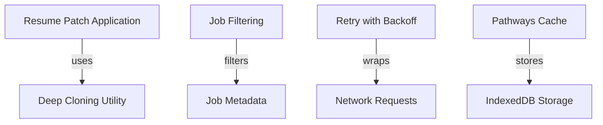
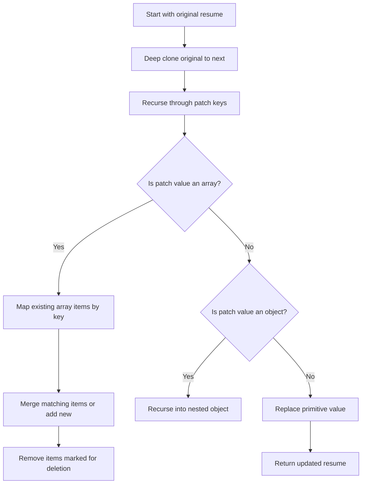
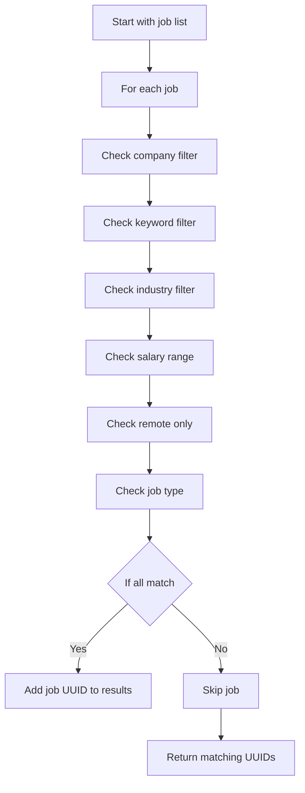
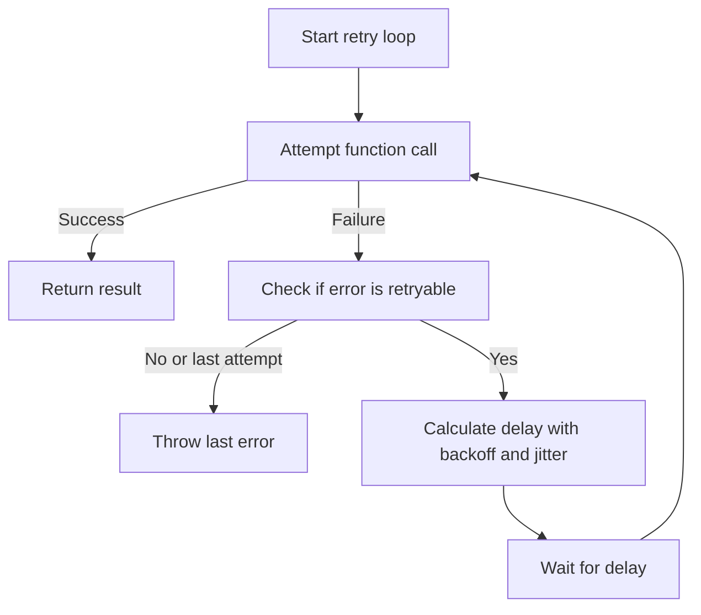
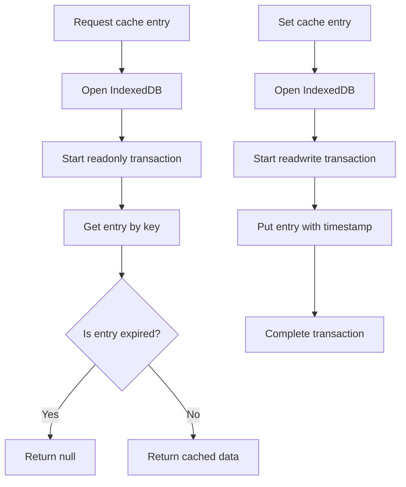
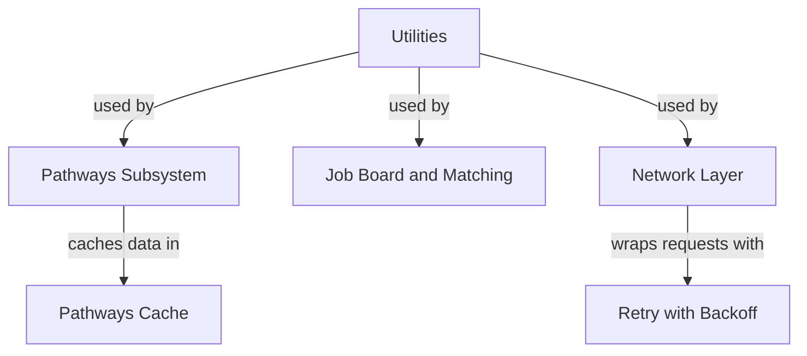

# Utilities

This page documents the general utility functions and helpers used across the project. These utilities cover diverse concerns such as resume data patching, job filtering, retry logic with backoff, and caching mechanisms for pathways data. The documented components are foundational to multiple subsystems, providing reusable logic for data transformation, filtering, error handling, and persistence.

For retry logic details, see the Retry Mechanism page. For pathways caching internals, see the Pathways Cache page. For job filtering specifics, see the Job Filtering page.

## Architecture Overview

The utilities subsystem provides foundational helper functions and modules that support higher-level application features. It includes:

- Resume patch application for merging user changes
- Job filtering based on criteria and job metadata
- Retry logic with exponential backoff for resilient network requests
- IndexedDB-based caching for pathways data

**Diagram: Core utility components and their roles within the system**

Sources: `apps/registry/app/pathways/utils/applyResumeChanges.js:20-133`, `apps/registry/app/pathways/utils/jobFilterMatcher.js:5-88`, `apps/registry/lib/retry.js:74-126`, `apps/registry/app/pathways/utils/pathwaysCache.js:52-100`

---

## Resume Patch Application

**Purpose:** Applies a set of changes (patches) to a previous resume object, merging arrays and objects intelligently to produce an updated resume state without mutating the original.

**Primary file:** `apps/registry/app/pathways/utils/applyResumeChanges.js:20-133`

This mechanism handles complex merging of nested resume data structures, including arrays of work experience, education, skills, profiles, and other resume sections. It supports deletion markers and preserves existing data where patches do not specify changes.

| Field | Type | Purpose |
|-------|------|---------|
| `prev` | Object | The original resume object before changes. |
| `changes` | Object | The patch object containing changes to apply. |
| `next` | Object | The resulting resume object after applying changes, cloned from `prev`. |

**Execution flow for applying resume changes with array merging and deletion support**

Sources: `apps/registry/app/pathways/utils/applyResumeChanges.js:20-133`

**Key behaviors:**
- Deep clones the original resume to avoid mutation of input data. `applyResumeChanges:21`
- Uses a key extraction function to identify unique items in arrays for merging or deletion. `applyResumeChanges:23-57`
- Supports deletion of array items via a `_delete` flag in patch objects. `applyResumeChanges:61-129`
- Recursively merges nested objects and replaces primitive values directly. `applyResumeChanges:59-129`

---

## Job Filtering

**Purpose:** Filters a list of jobs against a set of criteria, returning the UUIDs of jobs that match all specified filters.

**Primary file:** `apps/registry/app/pathways/utils/jobFilterMatcher.js:5-88`

This function evaluates multiple criteria including company names, keywords, industries, salary ranges, remote status, and job types. It uses normalized string matching and numeric comparisons to determine matches.

| Parameter | Type | Purpose |
|-----------|------|---------|
| `criteria` | Object | Filtering criteria including companies, keywords, industries, salaryMin, salaryMax, remoteOnly, jobTypes. |
| `jobs` | Array | Array of job objects to filter. |
| `jobInfo` | Object | Map of job UUIDs to detailed job metadata used for filtering. |
| Returns | Array | List of job UUIDs matching the criteria. |

**Flow of job filtering through multiple criteria**

Sources: `apps/registry/app/pathways/utils/jobFilterMatcher.js:5-88`

**Key behaviors:**
- Matches company names case-insensitively against criteria list. `jobFilterMatcher:14-17`
- Searches keywords in job title, description, and skills combined text. `jobFilterMatcher:23-33`
- Matches industries in job title, description, and company fields. `jobFilterMatcher:39-45`
- Filters by salary range using normalized salary fields; excludes jobs without salary info if range is specified. `jobFilterMatcher:51-56`
- Filters remote jobs by checking remote flags and location strings. `jobFilterMatcher:64-69`
- Matches job types case-insensitively against criteria list. `jobFilterMatcher:75-78`

---

## Retry with Backoff

**Purpose:** Executes an asynchronous function with retry attempts using exponential backoff and jitter, logging retry attempts and failures.

**Primary file:** `apps/registry/lib/retry.js:74-126`

This utility wraps any async function to automatically retry on retryable errors up to a maximum number of attempts. It calculates delays using exponential backoff with jitter to avoid thundering herd problems.

| Parameter | Type | Purpose |
|-----------|------|---------|
| `fn` | Function | The asynchronous function to execute with retries. |
| `options` | Object | Configuration options overriding defaults such as maxAttempts, baseDelay, maxDelay. |
| Returns | Promise | Resolves with the successful function result or rejects with the last error after all retries. |

**Retry logic flow with exponential backoff and jitter**

Sources: `apps/registry/lib/retry.js:74-126`

**Key behaviors:**
- Retries up to configured max attempts on retryable errors. `retryWithBackoff:74-126`
- Logs warnings on each failed attempt and info on eventual success after retries. `retryWithBackoff:78-100`
- Calculates delay using exponential backoff capped by max delay and adds random jitter. `retryWithBackoff:18-27`
- Throws the last error if all retry attempts fail. `retryWithBackoff:120-126`

---

## Pathways Cache

**Purpose:** Provides asynchronous IndexedDB-backed caching for pathways-related data such as embeddings and graph data, with TTL-based expiration.

**Primary file:** `apps/registry/app/pathways/utils/pathwaysCache.js:52-100`

This cache module manages storage and retrieval of data keyed by resume hashes. It transparently handles database opening, transactions, and TTL validation to avoid stale data usage.

| Constant | Value | Purpose |
|----------|-------|---------|
| `DB_NAME` | `'pathways_cache'` | IndexedDB database name. `pathwaysCache.js:6` |
| `DB_VERSION` | `1` | IndexedDB database version. `pathwaysCache.js:7` |
| `STORE_NAME` | `'cache'` | Object store name within the database. `pathwaysCache.js:8` |
| `CACHE_TTL` | `3600000` (1 hour) | Time-to-live for cache entries in milliseconds. `pathwaysCache.js:9` |

| Function | Purpose |
|----------|---------|
| `getCacheEntry(key)` | Retrieves a cache entry by key, returns null if not found or expired. `apps/registry/app/pathways/utils/pathwaysCache.js:52-83` |
| `setCacheEntry(key, data)` | Stores data in cache with current timestamp. `apps/registry/app/pathways/utils/pathwaysCache.js:85-100` |

**Flow of cache get and set operations with TTL validation**

Sources: `apps/registry/app/pathways/utils/pathwaysCache.js:52-100`

**Key behaviors:**
- Opens IndexedDB database and object store lazily on demand. `apps/registry/app/pathways/utils/pathwaysCache.js:30-50`
- Returns null for cache misses or entries older than TTL. `apps/registry/app/pathways/utils/pathwaysCache.js:52-83`
- Silently fails on set errors to avoid disrupting main flow. `apps/registry/app/pathways/utils/pathwaysCache.js:85-100`
- Uses a timestamp field to track entry age for expiration. `apps/registry/app/pathways/utils/pathwaysCache.js:52-100`

---

## Other Documented Symbols

The following symbols are simple constants, variables, or small functions that support the above major mechanisms or provide minor utilities. They are documented here for completeness.

### Logger

- `pino`: Imported logging library instance. `apps/registry/lib/logger.js:1-1`
- `logger`: Configured logger instance with custom settings. `apps/registry/lib/logger.js:14-44`

### Reserved Routes

- `RESERVED_ROUTES`: Array of reserved top-level route strings. `apps/registry/lib/reservedRoutes.js:7-21`
- `RESERVED_SUB_ROUTES`: Array of reserved sub-route strings. `apps/registry/lib/reservedRoutes.js:24-36`
- `isReservedUsername(username)`: Returns true if username matches any reserved route (case-insensitive). `apps/registry/lib/reservedRoutes.js:43-50`
- `isReservedSubRoute(path)`: Returns true if path matches any reserved sub-route (case-insensitive). `apps/registry/lib/reservedRoutes.js:57-64`
- `getReservedUsernameError(username)`: Returns an error message string for reserved usernames. `apps/registry/lib/reservedRoutes.js:71-73`

### Vector Utilities

- `cosineSimilarity(a, b)`: Computes cosine similarity between two numeric vectors. `apps/registry/app/utils/vectorUtils.js:12-20`
- `normalizeVector(vector)`: Returns a normalized vector with magnitude 1. `apps/registry/app/utils/vectorUtils.js:27-34`
- `getAverageEmbedding(embeddings)`: Computes element-wise average of multiple embeddings. `apps/registry/app/utils/vectorUtils.js:41-49`

### Formatters

- `formatLocation(location)`: Formats location object into a string with city, region, postal code, and country code. `apps/registry/app/utils/formatters.js:6-23`

### Pathways Cache Constants

- `DB_NAME`, `DB_VERSION`, `STORE_NAME`, `CACHE_TTL`: Constants defining IndexedDB database and cache TTL. `apps/registry/app/pathways/utils/pathwaysCache.js:6-9`

### Pathways Cache Helpers

- `hashResume(resume)`: Generates a hash integer from a resume object string representation. `apps/registry/app/pathways/utils/pathwaysCache.js:15-26`
- `getDB()`: Opens or returns cached IndexedDB database instance. `apps/registry/app/pathways/utils/pathwaysCache.js:30-50`
- `getCachedEmbedding(resumeHash)`, `setCachedEmbedding(resumeHash, embedding)`: Get/set cached embedding data. `apps/registry/app/pathways/utils/pathwaysCache.js:105-114`
- `getCachedGraphData(resumeHash)`, `setCachedGraphData(resumeHash, data)`: Get/set cached graph data. `apps/registry/app/pathways/utils/pathwaysCache.js:119-128`
- `clearPathwaysCache()`: Clears all entries in the pathways cache store. `apps/registry/app/pathways/utils/pathwaysCache.js:133-148`

### Retry Helpers

- `DEFAULT_RETRY_CONFIG`: Default configuration for retry attempts including maxAttempts and delays. `apps/registry/lib/retry.js:6-13`
- `calculateDelay(attempt, config)`: Computes delay with exponential backoff and jitter. `apps/registry/lib/retry.js:18-27`
- `isRetryableError(error, config)`: Determines if an error is retryable based on status codes and config. `apps/registry/lib/retry.js:32-59`
- `createRetryFetch(options)`: Wraps fetch with retry logic. `apps/registry/lib/retry.js:138-155`
- `createRetryAxios(axiosInstance, options)`: Wraps axios instance with retry logic. `apps/registry/lib/retry.js:169-183`

---

## Key Relationships

The utilities subsystem underpins multiple higher-level features:

- Resume patch application is used by pathways and resume editing components to merge user changes safely.
- Job filtering supports job board and matching candidate features by filtering job listings.
- Retry logic is used throughout network request layers to improve reliability.
- Pathways cache provides persistent storage for embeddings and graph data, accelerating pathways computations.

**Relationships showing how utilities support core subsystems**

Sources: `apps/registry/app/pathways/utils/applyResumeChanges.js:20-133`, `apps/registry/app/pathways/utils/jobFilterMatcher.js:5-88`, `apps/registry/lib/retry.js:74-126`, `apps/registry/app/pathways/utils/pathwaysCache.js:52-100`