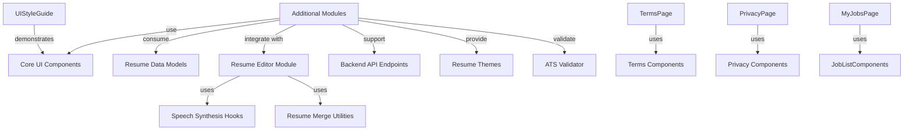

# Additional Modules

This page documents a collection of additional source files and utilities that support various features within the JSON Resume Registry application and its UI components. These modules include sample resume data, UI style guides, terms of service and privacy policy pages, job listing components, speech synthesis hooks, pagination utilities, error handling components, editor wrappers, resume merging utilities, resume themes, ATS validation logic, and API key management. The documented symbols cover both frontend React components and backend API data, as well as shared utilities and theme renderers.

## Purpose and Scope

This documentation covers the internal structure, purpose, and behavior of additional modules that provide sample data, UI components, legal pages, job-related UI, speech synthesis hooks, resume editing utilities, and resume themes. It explicitly excludes core resume parsing, editing logic, and main application routing, focusing instead on supporting modules and reusable components.

For UI components and styling, see the UI Components page. For resume editing and AI chat integration, see the Editor and AI Chat Handler pages. For resume theme implementations, see the Themes Overview page. For ATS validation, see the ATS Validator page.

## Architecture Overview

These modules form a loosely coupled set of utilities and UI components that enhance the user experience, provide sample data, and implement legal and privacy pages. They integrate with the core resume data flow and editor components, and some provide server-side API endpoints for sample resumes and API key management.

```mermaid
flowchart TD
  SampleData["Sample Resume Data"] --> ResumeAPI["Resume API Endpoint"]
  UIStyleGuide["UI Style Guide"] --> UIComponents["UI Components Library"]
  TermsPage["Terms of Service Page"] --> TermsSections["Terms Sections Components"]
  PrivacyPage["Privacy Policy Page"] --> PrivacySections["Privacy Sections Components"]
  JobListComponents["Job List Components"] --> MyJobsPage["My Jobs Page"]
  SpeechHooks["Speech Synthesis Hooks"] --> EditorAIChat["AI Chat Editor Module"]
  ResumeMergeUtils["Resume Merge Utilities"] --> Editor["Resume Editor"]
  ResumeThemes["Resume Themes"] --> ThemeRenderers["Theme Renderers"]
  ATSValidator["ATS Validator"] --> ResumeValidation["Resume Validation Pipeline"]
  ApiKeysPage["API Keys Management"] --> APIEndpoints["API Endpoints"]

  ResumeAPI -->|provides| SampleData
  MyJobsPage -->|uses| JobListComponents
  EditorAIChat -->|uses| SpeechHooks
  Editor -->|uses| ResumeMergeUtils
  ThemeRenderers -->|render| ResumeThemes
```

**Diagram: Component relationships and data flow among additional modules**

Sources: `apps/registry/pages/api/samples/resume.js:1-12`, `apps/registry/app/ui/page.js:3-85`, `apps/registry/app/terms/page.tsx:15-36`, `apps/registry/app/privacy/page.tsx:16-39`, `apps/registry/app/shared/JobListModule/components/JobHeader.jsx:10-52`, `apps/registry/app/my-jobs/page.js:6-280`, `apps/registry/app/hooks/useSpeech/index.js:6-84`, `apps/registry/app/components/ResumeEditorModule/utils/resumeMerge.js:2-66`, `packages/themes/jsonresume-theme-writers-portfolio/src/index.jsx:14-95`, `packages/ats-validator/src/index.js:19-559`, `apps/registry/app/api-keys/page.js:6-125`

---

## Sample Resume Data

### `basics`, `work`, `other`, and `resume` (apps/registry/pages/api/samples/resume.js:1-12)

**Purpose:** Provide structured sample resume data for API endpoints and testing.

- `basics`: Basic personal information including name, label, image URL, summary, contact details, and social profiles. (`apps/registry/pages/api/samples/resume/basics.js:1-29`)
- `work`: Array of work experience entries, each with position, company, dates, summary, highlights, and URLs. (`apps/registry/pages/api/samples/resume/work.js:1-124`)
- `other`: Additional resume sections such as education, skills, references, awards, interests, and projects. (`apps/registry/pages/api/samples/resume/other.js:1-88`)
- `resume`: Aggregated resume object combining `basics`, `work`, and `other` sections for export. (`apps/registry/pages/api/samples/resume.js:5-9`)

**Key behaviors:**
- The `resume` object merges `basics`, `work`, and other sections to form a complete JSON Resume sample.
- Work entries include pinned flags and detailed highlights for UI presentation.
- References and skills are structured with levels and keywords for display and filtering.

**Relationships:**
- Used by the `/api/samples/resume` API endpoint to serve sample resume data.
- Serves as mock data for UI components and theme renderers.

---

## UI Style Guide

### `UIStyleGuide` (apps/registry/app/ui/page.js:3-85)

**Purpose:** Demonstrate and document the visual styles and components available in the UI library.

**Structure:**
- Sections for Buttons, Cards, Form Elements, Badges, and Typography.
- Uses components from `@repo/ui` such as `Button`, `Card`, `Input`, `Badge`, and `Separator`.
- Showcases different button variants (`default`, `secondary`, `destructive`, `outline`, `ghost`).
- Displays card components with and without badges.
- Demonstrates form input styling and badge variants.
- Provides typography examples from headings (H1-H3) to paragraphs and muted text.

**Key behaviors:**
- Renders a responsive layout with spacing and typography consistent with the design system.
- Uses semantic HTML headings and sections for clarity.
- Serves as a live style reference for developers.

**Relationships:**
- Relies on the shared UI component library `@repo/ui`.
- Used as a reference page for frontend developers to ensure consistent styling.

---

## Terms of Service Pages

### `TermsPage` (apps/registry/app/terms/page.tsx:15-36)

**Purpose:** Render the Terms of Service page with structured legal content sections.

**Composition:**
- Uses `TermsHeader` for page title and last updated date.
- Wraps content inside a styled `Card` with `CardContent`.
- Includes multiple legal sections: `TermsIntro`, `UseLicense`, `Disclaimer`, `Limitations`, `UserContent`, `ServiceModifications`, `GoverningLaw`.
- Ends with a `ContactFooter` for user inquiries.

**Key behaviors:**
- Presents terms in numbered sections with clear titles.
- Uses reusable `TermsSection` components for consistent styling.
- Provides external contact link to GitHub Issues for feedback.

**Relationships:**
- Imports legal text sections from `termsSections.tsx`.
- Uses UI components from `@repo/ui` for layout and styling.

---

### Terms Sections (apps/registry/app/terms/sections/termsSections.tsx:5-83)

**Purpose:** Define individual sections of the Terms of Service content.

- Each section is a React functional component wrapping content inside `TermsSection`.
- Sections cover legal topics such as license, disclaimers, user content responsibilities, service modifications, and governing law.
- Content is static and uses semantic HTML paragraphs and lists.

---

### Terms Components

- `TermsSection` (apps/registry/app/terms/components/TermsSection.tsx:5-24): Wrapper component rendering a numbered section with a title and children.
- `TermsHeader` (apps/registry/app/terms/components/TermsHeader.tsx:3-12): Page header with title and last updated date.
- `ContactFooter` (apps/registry/app/terms/components/ContactFooter.tsx:5-32): Footer with contact instructions linking to GitHub Issues and a home navigation link.

---

## Privacy Policy Pages

### `PrivacyPage` (apps/registry/app/privacy/page.tsx:16-39)

**Purpose:** Render the Privacy Policy page with structured privacy content sections.

**Composition:**
- Uses `PrivacyHeader` for page title and last updated date.
- Wraps content inside a styled `Card` with `CardContent`.
- Includes multiple privacy sections: `InformationWeCollect`, `HowWeUseInfo`, `DataStorage`, `DataSharing`, `CookiesAndTracking`, `YourRights`, `DeleteCacheSection`, `ChildrensPrivacy`, `PolicyChanges`.
- Ends with a `ContactFooter` for user inquiries.

---

### Privacy Sections (apps/registry/app/privacy/sections/privacySections.tsx:5-93)

**Purpose:** Define individual sections of the Privacy Policy content.

- Each section is a React functional component wrapping content inside `PrivacySection`.
- Sections cover data collection, usage, storage, sharing, cookies, user rights, children’s privacy, and policy change notifications.

---

### Privacy Components

- `PrivacySection` (apps/registry/app/privacy/components/PrivacySection.tsx:5-24): Wrapper component rendering a numbered section with a title and children.
- `PrivacyHeader` (apps/registry/app/privacy/components/PrivacyHeader.tsx:3-10): Page header with title and last updated date.
- `DeleteCacheSection` (apps/registry/app/privacy/components/DeleteCacheSection.tsx:8-99): Interactive section allowing users to delete cached resume data with confirmation, status messages, and error handling.
- `ContactFooter` (apps/registry/app/privacy/components/ContactFooter.tsx:5-32): Footer with contact instructions linking to GitHub Issues and a home navigation link.

---

## Job Listing Components

### `JobHeader` (apps/registry/app/shared/JobListModule/components/JobHeader.jsx:10-52)

**Purpose:** Display key job metadata including title, company, salary, location, experience, remote status, and date.

**Details:**
- Uses icons from `lucide-react` for visual cues.
- Displays fallback text "Not available" when data is missing.
- Formats salary with locale-aware currency formatting.
- Shows location as city and country code.
- Supports remote status and posting date display.

---

### `JobDescription` (apps/registry/app/shared/JobListModule/components/JobDescription.jsx:10-37)

**Purpose:** Render a job card with expandable detailed description and related lists.

**Behavior:**
- Maintains internal `expanded` state toggled on click.
- Logs rendering debug information.
- Shows job header and truncated or full description based on expansion.
- When expanded, renders responsibilities, qualifications, skills, and job actions.

---

### `JobDescriptionText` (apps/registry/app/shared/JobListModule/components/JobDescriptionText.jsx:1-13)

**Purpose:** Render job description text truncated or fully expanded.

---

### `ResponsibilitiesList` and `QualificationsList` (apps/registry/app/shared/JobListModule/components/ResponsibilitiesList.jsx:3-23, apps/registry/app/shared/JobListModule/components/QualificationsList.jsx:3-23)

**Purpose:** Render lists of responsibilities or qualifications with icons.

---

### `SkillsList` (apps/registry/app/shared/JobListModule/components/SkillsList.jsx:3-38)

**Purpose:** Render a list of skill groups with level and keywords.

**Details:**
- Displays skill name and level with a star icon.
- Shows keywords as badges.
- Shows "Not available" if no skills or keywords.

---

### `JobActions` (apps/registry/app/shared/JobListModule/components/JobActions.jsx:4-27)

**Purpose:** Provide action buttons for making a cover letter, viewing the original job, and viewing job candidates.

**Details:**
- Buttons trigger callbacks or navigate to external/internal URLs.
- Uses `Button` component with variants and `Link` from Next.js.

---

## My Jobs Page and Job Cards

### `MyJobsPage` (apps/registry/app/my-jobs/page.js:143-280)

**Purpose:** Display a personalized list of job matches with filtering and state management.

**Key behaviors:**
- Uses authentication context to get current user.
- Fetches job matches from `/api/my-jobs` endpoint.
- Supports filtering by job state and remote-only jobs.
- Allows marking job states (interested, applied, maybe, not interested).
- Handles optimistic UI updates and rollback on failure.
- Displays loading, error, and empty states.
- Renders `JobCard` components for each filtered job.

---

### `JobCard` (apps/registry/app/my-jobs/page.js:36-114)

**Purpose:** Render a compact job summary card with similarity score, state badges, and skill tags.

**Details:**
- Formats salary and location for display.
- Shows similarity percentage and state with color-coded badges.
- Provides buttons to mark job state (interested, maybe, not interested).
- Displays job title, company, location, salary, type, and posting date.
- Shows up to six skill tags with overflow count.

---

### `Filters` (apps/registry/app/my-jobs/page.js:116-141)

**Purpose:** Render UI controls for filtering jobs by state and remote status.

---

## Speech Synthesis Hooks and Utilities

### `findEnglishVoice`, `loadVoices`, `retryLoadVoices` (apps/registry/app/hooks/useSpeech/voiceLoader.js:7-51)

**Purpose:** Manage loading and selection of English speech synthesis voices.

**Key behaviors:**
- Filters available voices for English (US or GB).
- Selects preferred voice (en-US if available).
- Logs voice loading and selection.
- Retries loading voices multiple times to handle browser async behavior.

---

### `useVoiceSetup` (apps/registry/app/hooks/useSpeech/useVoiceSetup.js:5-42)

**Purpose:** React hook to detect speech synthesis support and manage selected voice state.

**Key behaviors:**
- Detects browser support for speech synthesis.
- Loads voices and sets selected voice.
- Handles errors and logs warnings.
- Cleans up on unmount by cancelling speech synthesis.

---

### `createUtterance`, `speakWithWarmup` (apps/registry/app/hooks/useSpeech/speechEngine.js:7-46)

**Purpose:** Create configured speech synthesis utterances and speak them with a warmup workaround.

**Key behaviors:**
- Configures utterance with rate, pitch, and volume.
- Implements Chrome-specific warmup by speaking a silent utterance first.
- Handles speech end and error events with logging.

---

### `useSpeech` (apps/registry/app/hooks/useSpeech/index.js:6-84)

**Purpose:** React hook providing speech synthesis capabilities with state and error handling.

**Key behaviors:**
- Exposes `speak` function that returns a Promise resolving on speech end.
- Cancels ongoing speech before starting new utterance.
- Tracks speaking state.
- Provides `stop` function to cancel speech.
- Manages voice selection and error reporting.

---

## Resume Editing Utilities

### `mergeArrays` and `applyChanges` (apps/registry/app/components/ResumeEditorModule/utils/resumeMerge.js:2-66)

**Purpose:** Helper functions to intelligently merge arrays and apply changes to a resume object.

**Details:**
- `mergeArrays` merges two arrays by matching items on a key (default `name`) or date range.
- Supports deletion via `_delete` flag.
- Updates existing items or adds new ones.
- `applyChanges` applies changes to a resume object by merging arrays or shallow merging objects.

---

### `defaultResume` (apps/registry/app/components/ResumeEditorModule/data/defaultResume.js:1-30)

**Purpose:** Provides a default empty resume structure with all standard JSON Resume sections initialized.

---

### Editor Toolbar Components

- `ModeSelector` (apps/registry/app/components/ResumeEditorModule/components/EditorToolbar/ModeSelector.jsx:4-51): Navigation for switching editor modes (JSON, Form, AI Chat) with accessible buttons and icons.
- `ActionButtons` (apps/registry/app/components/ResumeEditorModule/components/EditorToolbar/ActionButtons.jsx:5-35): Buttons for viewing public resume and saving changes, with loading and disabled states.

---

## Navigation Links Configuration

### `NAV_LINKS` (apps/registry/app/components/MenuModule/constants/navLinks.js:14-53)

**Purpose:** Defines public navigation links with labels and icons for the main menu.

---

### `getAuthLinks` (apps/registry/app/components/MenuModule/constants/authLinks.js:7-28)

**Purpose:** Returns authenticated user navigation links based on username.

---

## Sample Resume Data for Editor

### `sampleResume` (apps/registry/app/components/EditorModule/data/sampleResume.js:1-143)

**Purpose:** Provides a detailed sample resume object for editor initialization and testing.

---

## Editor UI States

- `LoadingState` (apps/registry/app/components/EditorModule/components/LoadingState.js:4-34): Displays a loading card with animation while fetching resume data.
- `ErrorState` (apps/registry/app/components/EditorModule/components/ErrorState.js:4-30): Displays an error card with message when resume loading fails.
- `EditorContent` (apps/registry/app/components/EditorModule/components/EditorContent.js:8-31): Main editor content component that switches between loading, error, resume editor, and create resume UI states.

---

## Create Resume Module

- `useCreateResume` (apps/registry/app/components/CreateResumeModule/hooks/useCreateResume.js:5-21): Hook managing creation of a new resume gist with loading and error handling.
- `CreateResumeCard` (apps/registry/app/components/CreateResumeModule/components/CreateResumeCard.js:6-40): UI card prompting user to create a resume with a pre-filled template.
- `CreateResumeActions` (apps/registry/app/components/CreateResumeModule/components/CreateResumeActions.js:5-45): Buttons for creating a resume gist and exploring other resumes.

---

## AI Chat Editor Module

### `sendChatMessage` (apps/registry/app/components/AIChatEditorModule/utils/chatApi.js:1-20)

**Purpose:** Sends chat messages and current resume data to the backend API and returns AI-generated responses.

---

### `useMessageSubmit` (apps/registry/app/components/AIChatEditorModule/hooks/useChatHandler/useMessageSubmit.js:5-81)

**Purpose:** Hook to handle submitting user messages to AI chat, managing loading state, and processing AI responses.

**Key behaviors:**
- Adds user message to chat history.
- Sends recent context and resume to AI API.
- Adds assistant message with suggested changes.
- Applies changes automatically if enabled.
- Optionally triggers text-to-speech of AI response.
- Handles errors and logs them.

---

### `useApplyChanges` (apps/registry/app/components/AIChatEditorModule/hooks/useChatHandler/useApplyChanges.js:4-51)

**Purpose:** Hook to apply suggested changes to the resume and notify the user.

**Key behaviors:**
- Calls provided `onApplyChanges` callback with changes.
- Adds system messages indicating success or failure.
- Marks messages as having applied changes.

---

## API Keys Management

### `ApiKeysPage` (apps/registry/app/api-keys/page.js:6-125)

**Purpose:** UI page for generating API keys for authenticated users.

**Key behaviors:**
- Accepts GitHub username input.
- Sends POST request to `/api/v1/keys` to generate API key.
- Displays loading, error, and success states.
- Shows quick start instructions for CLI and Claude Code skill.

---

### `handleSubmit` (apps/registry/app/api-keys/page.js:12-35)

**Purpose:** Handles form submission for API key generation.

---

## Suggestions Page

### `Suggestions` (apps/registry/app/[username]apps/registry/app/ui/page.js:11-75)

**Purpose:** UI page to generate resume improvement suggestions based on selected focus.

**Key behaviors:**
- Allows user to select focus (general, spelling, grammar).
- Sends POST request to `/api/suggestions` with username and focus.
- Displays loading and rendered markdown suggestions.

---

## Cover Letter Generation

### `Letter` (apps/registry/app/[username]apps/registry/app/ui/page.js:10-51)

**Purpose:** UI page to generate cover letters combining resume and job description.

**Key behaviors:**
- Loads job description from URL or local storage.
- Allows user to select tone (formal, casual, sarcastic, funny, professional).
- Uses `useLetterGeneration` hook to generate letter.
- Renders `LetterForm` and `LetterPreview` components.

---

### `useLetterGeneration` (apps/registry/app/[username]apps/registry/app/[username]/letter/components/useLetterGeneration.js:5-38)

**Purpose:** Hook to manage cover letter generation API calls.

---

### `LetterForm` (apps/registry/app/[username]apps/registry/app/[username]/letter/components/LetterForm.jsx:5-42)

**Purpose:** Form UI for entering job description and selecting tone.

---

### `LetterPreview` (apps/registry/app/[username]apps/registry/app/[username]/letter/components/LetterPreview.jsx:6-22)

**Purpose:** Displays generated cover letter or loading state.

---

## Profile Layout Components

### `ProfileCard` (apps/registry/app/[username]apps/registry/app/[username]/ProfileLayoutModule/components/ProfileCard.jsx:5-44)

**Purpose:** Displays user profile card with avatar, name, label, location, and edit button.

---

### `NavigationMenu` (apps/registry/app/[username]apps/registry/app/[username]/ProfileLayoutModule/components/NavigationMenu.jsx:14-42)

**Purpose:** Navigation menu for user profile pages with active link highlighting.

---

### `AuthRequired` (apps/registry/app/[username]apps/registry/app/[username]/ProfileLayoutModule/components/AuthRequired.jsx:5-72)

**Purpose:** Displays authentication required message and login/switch account options.

---

## Supabase Client

### `supabase` (apps/registry/app/lib/supabase.ts:6-9)

**Purpose:** Initializes and exports a Supabase client instance for database and authentication operations.

---

## Styled Components Registry

### `StyledComponentsRegistry` (apps/registry/app/lib/registry.js:7-25)

**Purpose:** Provides server-side rendering support for styled-components in Next.js.

**Key behaviors:**
- Creates a single `ServerStyleSheet` instance.
- Uses `useServerInsertedHTML` to inject styles during SSR.
- Wraps children with `StyleSheetManager` on server.
- Returns children directly on client.

---

## Pagination Utility

### `getPageNumbers` (apps/registry/app/explore/ClientResumesModule/utils/paginationUtils.js:1-34)

**Purpose:** Generate an array of page numbers and ellipsis for pagination UI.

**Key behaviors:**
- Shows all pages if total pages ≤ 7.
- Otherwise, shows first page, last page, current page ±1, and ellipsis as needed.

---

## Error Pages

### `ErrorContent` (apps/registry/app/error/page.tsx:13-73)

**Purpose:** Renders error content with title, message, reserved routes list, and navigation buttons.

---

### `ErrorPage` (apps/registry/app/error/page.tsx:75-87)

**Purpose:** Suspense wrapper rendering `ErrorContent` with loading fallback.

---

## Editor Components

### `Page` (apps/registry/app/editor/page.js:3-5)

**Purpose:** Entry point rendering the client editor component.

---

### `EditorLoading` (apps/registry/app/editor/loading.js:3-5)

**Purpose:** Displays loading skeleton for editor.

---

### `EditorError` (apps/registry/app/editor/error.js:7-60)

**Purpose:** Error boundary UI for editor with retry and navigation options.

---

### `EditorWrapper` (apps/registry/app/editor/EditorWrapper.js:7-34)

**Purpose:** Wraps editor with resume provider and handles session and username resolution.

---

### `ClientEditor` (apps/registry/app/editor/ClientEditor.js:8-29)

**Purpose:** Client-side editor component that redirects unauthenticated users to login.

---

## Resume Themes

### Writer's Portfolio Theme

- `render` (packages/themes/jsonresume-theme-writers-portfolio/src/index.jsx:14-95): Server-side render function producing full HTML document with embedded styles and fonts.
- `Resume` (packages/themes/jsonresume-theme-writers-portfolio/src/Resume.jsx:16-512): React component rendering resume with literary serif typography and elegant layout.

### University First Theme

- `render` (packages/themes/jsonresume-theme-university-first/src/index.jsx:6-53): Server-side render function with Google Fonts and styles.
- `Resume` (packages/themes/jsonresume-theme-university-first/src/Resume.jsx:10-565): React component with blue header, card-style education and work items, monospace fonts for contact info.

### Two Column Modernist Theme

- `render` (packages/themes/jsonresume-theme-two-column-modernist/src/index.jsx:6-52): Server-side render function with grid layout and modern sans-serif fonts.
- `Resume` (packages/themes/jsonresume-theme-two-column-modernist/src/Resume.jsx:6-683): React component with left sidebar and right main content, structured sections for all resume parts.

### Sidebar Photo Strip Theme

- `render` (packages/themes/jsonresume-theme-sidebar-photo-strip/src/index.jsx:6-53): Server-side render function with dark sidebar and profile photo.
- `Resume` (packages/themes/jsonresume-theme-sidebar-photo-strip/src/Resume.jsx:10-497): React component with sidebar photo, contact info, skills, and main content.

### Sidebar Theme

- `render` (packages/themes/jsonresume-theme-sidebar/src/index.jsx:13-88): Server-side render function with dark sidebar and cream main content.
- `Resume` (packages/themes/jsonresume-theme-sidebar/src/Resume.jsx:17-588): React component with profile photo, contact, education, skills, work, projects, awards, references.

### Sales Hunter Theme

- `render` (packages/themes/jsonresume-theme-sales-hunter/src/index.jsx:6-53): Server-side render function with green accent and bold typography.
- `Resume` (packages/themes/jsonresume-theme-sales-hunter/src/Resume.jsx:10-455): React component with highlighted sections and enhanced highlights in work experience.

### Reference Theme

- `render` (packages/themes/jsonresume-theme-reference/src/index.jsx:43-259): Server-side render function with design tokens, structured output option, and JSX composition.
- `Resume` (packages/themes/jsonresume-theme-reference/src/Resume.jsx:24-379): React component demonstrating all JSON Resume schema sections with ATS-friendly markup.

### Creative Confidence Theme

- `css` (packages/themes/jsonresume-theme-creative-confidence/index.js:1-325): CSS string defining design tokens and styles for print and screen.
- `render` (packages/themes/jsonresume-theme-creative-confidence/index.js:327-634): Function rendering a full HTML resume with semantic sections and escape utilities.

---

## ATS Validator

### `validateATS` and related checks (packages/ats-validator/src/index.js:19-559)

**Purpose:** Analyze resume HTML for ATS compatibility using multiple validation rules.

**Key behaviors:**
- Checks semantic HTML structure, font usage, table layouts, single-column layout, heading structure, image accessibility, font sizes, and general accessibility.
- Aggregates scores and issues per category.
- Provides letter grade and recommendations based on score.
- Uses `cheerio` for HTML parsing.

---

## Utility Functions

### `cn` (packages/ui/src/lib/utils.js:4-6)

**Purpose:** Utility function combining class names using `clsx` and `tailwind-merge` for Tailwind CSS.

---

## Summary

This collection of modules provides foundational data, UI components, legal and privacy pages, job listing interfaces, speech synthesis hooks, resume editing utilities, theme renderers, ATS validation, and API key management. They integrate with core resume data and editing flows, supporting a rich user experience and compliance with legal and accessibility standards. The resume themes demonstrate diverse visual styles and layout strategies, while the ATS validator ensures resumes meet parsing requirements for applicant tracking systems.

## Key Relationships

These modules depend on core UI components (`@repo/ui`), React and styled-components for rendering, and backend API endpoints for data fetching and mutation. They are consumed by higher-level pages such as the editor, explore, and user profile pages, and provide reusable building blocks for resume presentation, editing, and validation.

**Relationships between additional modules and core subsystems**

Sources: `apps/registry/app/ui/page.js:3-85`, `apps/registry/app/terms/page.tsx:15-36`, `apps/registry/app/privacy/page.tsx:16-39`, `apps/registry/app/my-jobs/page.js:6-280`, `apps/registry/app/hooks/useSpeech/index.js:6-84`, `apps/registry/app/components/ResumeEditorModule/utils/resumeMerge.js:2-66`, `packages/themes/jsonresume-theme-reference/src/index.jsx:43-259`, `packages/ats-validator/src/index.js:19-559`