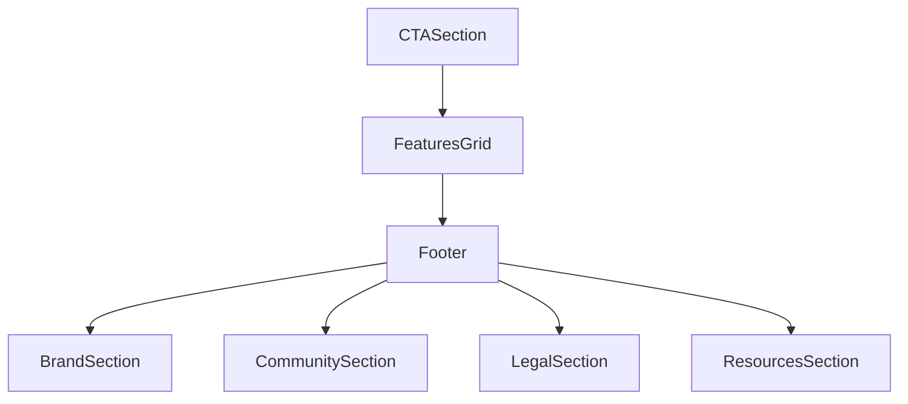
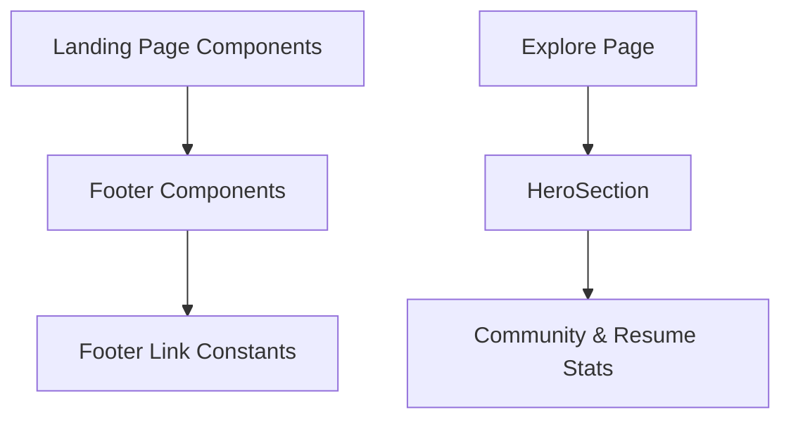

# Glossary

## Purpose and Scope

This page documents key terms, components, and constants used throughout the JSON Resume project, focusing on the landing page UI components and footer sections. It covers the main React components that structure the landing page and footer, as well as the link collections used in the footer. This page does not cover backend APIs, data models, or other unrelated UI modules. For UI components related to user profiles or job listings, see the Profile UI and Jobs UI pages.

## Architecture Overview

The landing page UI is composed of modular React components that render distinct sections such as calls to action, feature highlights, and footer content. The footer itself is subdivided into branded information, community links, legal links, and resource links. These components are implemented as functional React components using JSX and styled with Tailwind CSS classes. The link collections are defined as constant arrays of objects with `href` and `label` properties.

**Diagram: Component hierarchy and relationships for the landing page and footer UI**

Sources: `apps/registry/app/LandingPageModule/components/CTASection.jsx:5-58`, `apps/registry/app/LandingPageModule/components/FeaturesGrid.jsx:4-31`, `apps/registry/app/LandingPageModule/components/Footer/index.jsx:1-20`, `apps/registry/app/LandingPageModule/components/Footer/BrandSection.jsx:4-43`, `apps/registry/app/LandingPageModule/components/Footer/CommunitySection.jsx:8-26`, `apps/registry/app/LandingPageModule/components/Footer/LegalSection.jsx:6-28`, `apps/registry/app/LandingPageModule/components/Footer/ResourcesSection.jsx:8-26`

## Landing Page Components

### CTASection

The `CTASection` component renders a prominent call-to-action area encouraging developers to standardize their resumes using the JSON Resume schema. It features a headline, descriptive text, and two buttons: one to start with GitHub login and another linking to the JSON Resume schema documentation.

- Uses layered background gradients and animated pulse effects for visual emphasis.
- Buttons are styled for responsiveness and accessibility, with icons indicating GitHub and JSON file schema.
- The component is centered and constrained in width for readability.

Sources: `apps/registry/app/LandingPageModule/components/CTASection.jsx:5-58`

### FeaturesGrid

`FeaturesGrid` displays a grid of feature cards highlighting key benefits or capabilities of the JSON Resume project. Each card shows an icon, title, and description.

- Dynamically maps over a `features` array to render cards.
- Cards have hover effects that scale icons and add shadows.
- The grid layout adapts responsively from one to three columns depending on screen size.

Sources: `apps/registry/app/LandingPageModule/components/FeaturesGrid.jsx:4-31`

### HeroSection

The `HeroSection` component presents a large introductory banner for the Explore page, showing total resume count and emphasizing the global, open-source nature of the JSON Resume community.

- Uses background grid patterns and blurred colored circles for depth.
- Displays key stats with icons for users, global community, and open source.
- Text is styled with gradients and large font sizes for impact.

Sources: `apps/registry/app/explore/ExploreModule/components/HeroSection.jsx:3-39`

## Footer Components

### Footer

The `Footer` component composes the footer area by including the brand section, community links, legal links, and resource links. It organizes these subsections into a grid layout.

Sources: `apps/registry/app/LandingPageModule/components/Footer/index.jsx:1-20`

### BrandSection

`BrandSection` displays branding information about JSON Resume, including a logo icon, a brief description, and social media links to GitHub, Twitter, and Discord.

- Social links open in new tabs with appropriate `rel` attributes for security.
- Uses icons imported from the footer icons module.

Sources: `apps/registry/app/LandingPageModule/components/Footer/BrandSection.jsx:4-43`

### CommunitySection

`CommunitySection` renders a list of community-related links such as GitHub, Discord, Twitter, and the project blog.

- Links are styled with hover color transitions.
- The list is generated from the `COMMUNITY_LINKS` constant array.

Sources: `apps/registry/app/LandingPageModule/components/Footer/CommunitySection.jsx:8-26`

### LegalSection

`LegalSection` provides links to legal documents including Privacy Policy and Terms of Service.

- Displays the current year dynamically.
- Links are styled similarly to other footer links.
- Uses the `LEGAL_LINKS` constant array for link data.

Sources: `apps/registry/app/LandingPageModule/components/Footer/LegalSection.jsx:6-28`

### ResourcesSection

`ResourcesSection` lists resource links such as the JSON Resume schema, themes, getting started guide, and API documentation.

- Uses the `RESOURCE_LINKS` constant array.
- Styled consistently with other footer link lists.

Sources: `apps/registry/app/LandingPageModule/components/Footer/ResourcesSection.jsx:8-26`

## Footer Link Collections

These constants define the sets of links used in the footer subsections.

| Constant       | Purpose                                                                                  | Source File                                                  |
|---------------|------------------------------------------------------------------------------------------|--------------------------------------------------------------|
| `COMMUNITY_LINKS` | Array of objects representing community links with `href` and `label` for GitHub, Discord, Twitter, and Blog. | `apps/registry/app/LandingPageModule/components/Footer/CommunitySection.jsx:1-6` |
| `LEGAL_LINKS`     | Array of objects for legal links including Privacy Policy and Terms of Service.       | `apps/registry/app/LandingPageModule/components/Footer/LegalSection.jsx:1-4`     |
| `RESOURCE_LINKS`  | Array of objects for resource links including Schema, Themes, Getting Started, and API. | `apps/registry/app/LandingPageModule/components/Footer/ResourcesSection.jsx:1-6` |

## Glossary Table

| Type           | Kind       | Purpose                                                                                 | Source File                                                  |
|----------------|------------|-----------------------------------------------------------------------------------------|--------------------------------------------------------------|
| `CTASection`   | Component  | Renders the call-to-action section on the landing page encouraging resume standardization. | `apps/registry/app/LandingPageModule/components/CTASection.jsx:5-58` |
| `FeaturesGrid` | Component  | Displays a responsive grid of feature highlight cards on the landing page.              | `apps/registry/app/LandingPageModule/components/FeaturesGrid.jsx:4-31` |
| `HeroSection`  | Component  | Presents the hero banner for the Explore page showing community stats and messaging.    | `apps/registry/app/explore/ExploreModule/components/HeroSection.jsx:3-39` |
| `Footer`       | Component  | Composes the footer area by including brand, community, legal, and resource sections.   | `apps/registry/app/LandingPageModule/components/Footer/index.jsx:1-20` |
| `BrandSection` | Component  | Displays branding info and social media links in the footer.                            | `apps/registry/app/LandingPageModule/components/Footer/BrandSection.jsx:4-43` |
| `CommunitySection` | Component | Renders community-related links in the footer.                                         | `apps/registry/app/LandingPageModule/components/Footer/CommunitySection.jsx:8-26` |
| `LegalSection` | Component  | Provides legal document links and copyright notice in the footer.                       | `apps/registry/app/LandingPageModule/components/Footer/LegalSection.jsx:6-28` |
| `ResourcesSection` | Component | Lists resource links such as schema and API documentation in the footer.                | `apps/registry/app/LandingPageModule/components/Footer/ResourcesSection.jsx:8-26` |
| `COMMUNITY_LINKS` | Constant  | Defines community link URLs and labels for the footer.                                 | `apps/registry/app/LandingPageModule/components/Footer/CommunitySection.jsx:1-6` |
| `LEGAL_LINKS`  | Constant   | Defines legal link URLs and labels for the footer.                                      | `apps/registry/app/LandingPageModule/components/Footer/LegalSection.jsx:1-4` |
| `RESOURCE_LINKS` | Constant  | Defines resource link URLs and labels for the footer.                                  | `apps/registry/app/LandingPageModule/components/Footer/ResourcesSection.jsx:1-6` |

## Key Relationships

The landing page components depend on shared UI primitives such as `Card`, `Button`, and icon components imported from the footer icons module. The footer sections rely on constant arrays defining link targets and labels, centralizing link management. The landing page and footer components are composed together in the main landing page module to form the complete page UI. The Explore page's `HeroSection` connects to the broader community and resume data by displaying live counts and emphasizing open-source values.

**Relationships between landing page, footer, and explore page components**

Sources: `apps/registry/app/LandingPageModule/components/CTASection.jsx:5-58`, `apps/registry/app/LandingPageModule/components/Footer/index.jsx:1-20`, `apps/registry/app/explore/ExploreModule/components/HeroSection.jsx:3-39`