# @jsonresume/jobs

[](https://www.npmjs.com/package/@jsonresume/jobs)
[](./LICENSE)
[](https://nodejs.org)

Search Hacker News "Who is Hiring" jobs matched against your [JSON Resume](https://jsonresume.org). Jobs are semantically ranked using AI embeddings — your resume is compared against hundreds of monthly job postings to surface the best fits.


## Quick Start

**With a registry account:**

```bash
npx @jsonresume/jobs
```

The CLI walks you through login on first run — all you need is a resume hosted at [registry.jsonresume.org](https://registry.jsonresume.org).

**With a local resume file (no account needed):**

```bash
npx @jsonresume/jobs --resume ./resume.json
```

Or just drop a `resume.json` in your current directory and run `npx @jsonresume/jobs` — it's auto-detected.

## Prerequisites

- **Node.js** >= 18
- A [JSON Resume](https://jsonresume.org/schema/) — either hosted on the [registry](https://registry.jsonresume.org) or as a local `resume.json` file
- *(Optional)* `OPENAI_API_KEY` — enables AI summaries and batch ranking in the TUI

## Installation

Run directly with npx (no install needed):

```bash
npx @jsonresume/jobs
```

Or install globally:

```bash
npm install -g @jsonresume/jobs
jsonresume-jobs
```

## Authentication

On first run, the CLI prompts for your GitHub username, verifies your resume exists on the registry, generates an API key, and saves it to `~/.jsonresume/config.json`. Future runs skip straight to the TUI.

You can also authenticate manually:

```bash
# Via environment variable
export JSONRESUME_API_KEY=jr_yourname_xxxxx

# Generate a key via curl
curl -s -X POST https://registry.jsonresume.org/api/v1/keys \
  -H 'Content-Type: application/json' \
  -d '{"username":"YOUR_GITHUB_USERNAME"}'
```

To clear saved credentials:

```bash
npx @jsonresume/jobs logout
```

## Local Mode (No Account)

You don't need a registry account to use the TUI. If you have a `resume.json` file following the [JSON Resume schema](https://jsonresume.org/schema/), you can use it directly:

```bash
# Explicit path
npx @jsonresume/jobs --resume ./my-resume.json

# Auto-detect (looks for resume.json in current directory)
npx @jsonresume/jobs
```

In local mode:

- Job matching works the same way (your resume is sent to the server for embedding and vector search)
- **Marks are saved locally** to `~/.jsonresume/local-marks.json` instead of the server
- Filters and export work identically
- Custom search profiles are not available (they require a registry account for server-side storage)

This is useful if you want to try the tool without setting up a registry account, or if you prefer to keep your resume as a local file.

## Interactive TUI

The default command launches a full terminal interface for browsing and managing jobs.

```bash
npx @jsonresume/jobs
```

### Layout

The TUI has three main regions:

- **Header** — shows the app title, active search profile name, tab bar (All / New / Reviewed / Interested / Applied / Maybe / Passed) with live counts, and any active filter pills
- **Content area** — job list in list view, or a split-pane layout (40% compact list + 60% job detail) in detail view
- **Status bar** — context-sensitive keyboard hints, loading/reranking indicators, and toast notifications

### Features

- **Split-pane detail view** — press `Enter` to see a compact job list on the left and full details on the right; navigate jobs with `j`/`k` without leaving the detail panel
- **Tab-based views** — All / Interested / Applied / Maybe / Passed — always visible with live counts, cycle with `Tab`/`Shift+Tab`
- **Persistent filters** — remote, salary, keyword, date range — saved to disk per search profile and restored when you switch profiles
- **Custom search profiles** — targeted searches like "remote React jobs in climate tech" with AI-powered reranking via HyDE embeddings
- **Two-pass loading** — results appear instantly from vector search, then reshuffle when LLM reranking completes in the background
- **Batch operations** — select multiple jobs with `v`, then bulk-mark them all at once with `i`/`x`/`m`/`p`
- **Inline search** — press `n` to quickly filter visible jobs by keyword; press `Esc` to clear
- **Export** — press `e` to export your shortlist, applied, and maybe lists to a `job-hunt-YYYY-MM-DD.md` markdown file in the current directory
- **Toast notifications** — instant feedback on every action (marking, exporting, refreshing)
- **Help modal** — press `?` for a full keyboard reference organized by section
- **Dossier research** — press `c` to spawn a Claude Code CLI session that researches the company, role, and generates a comprehensive dossier with fit assessment, talking points, interview prep, and compensation context. Results stream live and are cached server-side so you can revisit them anytime. Supports switching between multiple dossiers without restarting. Requires [Claude Code](https://docs.anthropic.com/en/docs/claude-code) CLI installed
- **AI summaries** — press `Space` for a per-job AI summary, or `S` for a batch review of all visible jobs (requires `OPENAI_API_KEY`)
- **Vim-style navigation** — `j`/`k` to move, `g`/`G` to jump to first/last, `Ctrl+U`/`Ctrl+D` to page up/down
- **Responsive columns** — job list columns (score, title, company, location, salary) adapt to terminal width on resize
- **Smart filtering** — passed and dismissed jobs are excluded server-side with 5x over-fetch, so you always get a full set of fresh results
- **Cached results** — job data is cached locally for 2 hours to minimize API calls; press `R` to force a fresh fetch

### Keyboard Shortcuts

#### List View

| Key | Action |
|-----|--------|
| `j` / `↓` | Move down |
| `k` / `↑` | Move up |
| `g` / `G` | Jump to first / last job |
| `Ctrl+U` / `Ctrl+D` | Page up / page down |
| `Enter` | Open split-pane detail view |
| `i` | Mark interested |
| `x` | Mark applied |
| `m` | Mark maybe |
| `p` | Mark passed |
| `v` | Toggle batch selection (selected jobs shown with `●`) |
| `Tab` / `Shift+Tab` | Next / previous tab |
| `n` | Inline keyword search |
| `f` | Manage filters |
| `/` | Search profiles |
| `Space` | AI summary for current job |
| `c` | Research dossier via Claude Code CLI |
| `S` | AI batch review of visible jobs |
| `e` | Export shortlist to markdown |
| `R` | Force refresh (bypass cache) |
| `?` | Help modal |
| `q` | Quit |

#### Detail View (Split Pane)

| Key | Action |
|-----|--------|
| `j` / `k` | Navigate between jobs (updates detail pane) |
| `J` / `K` | Scroll detail content up / down |
| `o` | Open HN post in browser |
| `i` / `x` / `m` / `p` | Mark job state |
| `Space` | AI summary |
| `c` | Research dossier |
| `Esc` / `q` | Back to full list |

#### Filters Panel

| Key | Action |
|-----|--------|
| `j` / `k` | Navigate filters |
| `Enter` | Edit filter value |
| `a` | Add filter (remote, salary, keyword, days) |
| `d` | Delete selected filter |
| `Esc` | Close panel |

#### Search Profiles Panel

| Key | Action |
|-----|--------|
| `j` / `k` | Navigate profiles |
| `Enter` | Switch to selected profile |
| `n` | Create new search profile |
| `d` | Delete selected profile |
| `Esc` | Close panel |

### Job List Columns

In full-width list view, columns are:

| Column | Description |
|--------|-------------|
| Score | Cosine similarity (0.00–1.00) between your resume and the job |
| AI | LLM rerank score (1–10), shown only when a search profile triggers reranking |
| Title | Job title |
| Company | Company name |
| Location | City, country code, remote status |
| Salary | Parsed salary or `—` if not listed |
| Status | State icon: ⭐ interested, 📨 applied, ? maybe, ✗ passed |

In split-pane detail view, the left pane shows a compact list with just score, title, and status.

### Tab Views

| Tab | Shows |
|-----|-------|
| All | All jobs from the current search (excludes passed/dismissed) |
| New | Jobs with no state and no dossier — completely untouched |
| Reviewed | Jobs with a dossier but no decision yet |
| Interested | Jobs you marked with `i` |
| Applied | Jobs you marked with `x` |
| Maybe | Jobs you marked with `m` |
| Passed | Jobs you marked with `p` |

All tabs always appear in the header with their current count. Marking a job moves it between tabs instantly.

## CLI Commands

For scripting and pipelines, the CLI also supports direct commands:

```bash
npx @jsonresume/jobs search                              # Find matching jobs
npx @jsonresume/jobs search --remote --min-salary 150    # Remote, $150k+ salary
npx @jsonresume/jobs search --search "rust"              # Keyword filter
npx @jsonresume/jobs detail 181420                       # Full job details
npx @jsonresume/jobs mark 181420 interested              # Mark a job
npx @jsonresume/jobs me                                  # Your resume summary
npx @jsonresume/jobs update ./resume.json                # Update your resume
npx @jsonresume/jobs logout                              # Remove saved API key
npx @jsonresume/jobs help                                # All options
```

### Command Reference

| Command | Description |
|---------|-------------|
| *(default)* | Launch interactive TUI |
| `search` | Find matching jobs (table output) |
| `detail <id>` | Show full details for a job |
| `mark <id> <state>` | Set job state (see states below) |
| `me` | Show your resume summary |
| `update <file>` | Upload a new version of your resume |
| `logout` | Remove saved API key |
| `help` | Show help |

### Search Options

| Flag | Description |
|------|-------------|
| `--top N` | Number of results (default: 20, max: 100) |
| `--days N` | How far back to look (default: 30) |
| `--remote` | Remote jobs only |
| `--min-salary N` | Minimum salary in thousands (e.g. `150` = $150k) |
| `--search TERM` | Keyword filter (title, company, skills) |
| `--interested` | Show only jobs marked interested |
| `--applied` | Show only jobs marked applied |
| `--json` | Output raw JSON for piping |

### Mark States

| State | Icon | Meaning |
|-------|------|---------|
| `interested` | ⭐ | You want this job |
| `applied` | 📨 | You've applied |
| `maybe` | ? | Considering it |
| `not_interested` | ✗ | Not for you (hidden from future searches) |
| `dismissed` | 👁 | Hide from results (hidden from future searches) |

## Architecture



## API Reference

All endpoints live at `https://registry.jsonresume.org/api/v1`. Authenticated endpoints require a `Bearer` token in the `Authorization` header.

### Authentication

```bash
# Generate an API key (no auth required)
curl -s -X POST https://registry.jsonresume.org/api/v1/keys \
  -H 'Content-Type: application/json' \
  -d '{"username":"YOUR_GITHUB_USERNAME"}'
# → { "key": "jr_username_xxxxx", "username": "username" }

# Use in all subsequent requests
export JSONRESUME_API_KEY="jr_username_xxxxx"
AUTH="Authorization: Bearer $JSONRESUME_API_KEY"
```

### GET /api/v1/me

Returns your resume and profile.

```bash
curl -s -H "$AUTH" https://registry.jsonresume.org/api/v1/me
# → { "username": "...", "resume": { ... } }
```

### GET /api/v1/jobs

Get jobs matched to your resume via vector similarity.

| Param | Type | Default | Description |
|-------|------|---------|-------------|
| `top` | int | 20 | Number of results (max 100) |
| `days` | int | 30 | How far back to search |
| `remote` | bool | false | Remote jobs only |
| `min_salary` | int | 0 | Minimum salary in thousands (e.g. `150` = $150k) |
| `search` | string | | Keyword filter across all fields |
| `search_id` | uuid | | Use a saved search profile's embedding |
| `rerank` | bool | auto | LLM reranking (defaults to true when `search_id` is set) |

```bash
# Basic search
curl -s -H "$AUTH" "https://registry.jsonresume.org/api/v1/jobs?top=50&days=30"

# Remote jobs, $150k+, keyword filter
curl -s -H "$AUTH" "https://registry.jsonresume.org/api/v1/jobs?top=50&remote=true&min_salary=150&search=react"

# Using a search profile with reranking
curl -s -H "$AUTH" "https://registry.jsonresume.org/api/v1/jobs?top=50&search_id=UUID&rerank=true"
```

**Response:**
```json
{
  "jobs": [
    {
      "id": 237247,
      "uuid": "...",
      "title": "Full-Stack Engineer",
      "company": "Acme Corp",
      "location": { "city": "San Francisco", "countryCode": "US" },
      "remote": "Full",
      "salary": "$180k - $220k",
      "salary_usd": 180000,
      "experience": "Senior",
      "type": "Full-time",
      "description": "...",
      "skills": [{ "name": "React" }, { "name": "Node.js" }],
      "url": "https://news.ycombinator.com/item?id=...",
      "posted_at": "2026-03-01T...",
      "similarity": 0.654,
      "rerank_score": 8,
      "combined_score": 0.74,
      "state": "interested",
      "has_dossier": true
    }
  ],
  "total": 50
}
```

### POST /api/v1/jobs

Match jobs against a provided resume — **no auth required**. Useful for local mode or one-off queries.

```bash
curl -s -X POST https://registry.jsonresume.org/api/v1/jobs \
  -H 'Content-Type: application/json' \
  -d '{
    "resume": { "basics": { "name": "...", "label": "..." }, "skills": [...] },
    "top": 20,
    "days": 30,
    "remote": true
  }'
```

### GET /api/v1/jobs/:id

Full details for a single job including raw posting content.

```bash
curl -s -H "$AUTH" https://registry.jsonresume.org/api/v1/jobs/237247
```

### PUT /api/v1/jobs/:id

Mark a job's state.

| Body Param | Type | Description |
|------------|------|-------------|
| `state` | string | `interested`, `applied`, `maybe`, `not_interested`, or `dismissed` |
| `feedback` | string | Optional reason/notes |

```bash
# Mark as interested
curl -s -X PUT -H "$AUTH" -H 'Content-Type: application/json' \
  https://registry.jsonresume.org/api/v1/jobs/237247 \
  -d '{"state":"interested","feedback":"great remote role, strong tech stack"}'

# Mark as applied
curl -s -X PUT -H "$AUTH" -H 'Content-Type: application/json' \
  https://registry.jsonresume.org/api/v1/jobs/237247 \
  -d '{"state":"applied","feedback":"applied via email 2026-03-13"}'

# Pass on a job
curl -s -X PUT -H "$AUTH" -H 'Content-Type: application/json' \
  https://registry.jsonresume.org/api/v1/jobs/237247 \
  -d '{"state":"not_interested","feedback":"salary too low"}'
```

### GET /api/v1/jobs/:id/dossier

Fetch saved research dossier for a job.

```bash
curl -s -H "$AUTH" https://registry.jsonresume.org/api/v1/jobs/237247/dossier
# → { "content": "# Dossier\n\n## Compensation...", "created_at": "..." }
# → { "content": null } if no dossier exists
```

### PUT /api/v1/jobs/:id/dossier

Save or update a research dossier.

```bash
curl -s -X PUT -H "$AUTH" -H 'Content-Type: application/json' \
  https://registry.jsonresume.org/api/v1/jobs/237247/dossier \
  -d '{"content":"# Company Research\n\n..."}'
```

### PUT /api/v1/resume

Update your resume on the registry.

```bash
curl -s -X PUT -H "$AUTH" -H 'Content-Type: application/json' \
  https://registry.jsonresume.org/api/v1/resume \
  -d @resume.json
# → { "username": "...", "message": "Resume updated" }
```

### GET /api/v1/searches

List your saved search profiles.

```bash
curl -s -H "$AUTH" https://registry.jsonresume.org/api/v1/searches
# → { "searches": [{ "id": "uuid", "name": "Remote React", "prompt": "...", "filters": [...] }] }
```

### POST /api/v1/searches

Create a new search profile. The server generates a HyDE embedding from your prompt + resume.

```bash
curl -s -X POST -H "$AUTH" -H 'Content-Type: application/json' \
  https://registry.jsonresume.org/api/v1/searches \
  -d '{"name":"Remote React","prompt":"remote React roles at climate tech startups"}'
# → { "search": { "id": "uuid", "name": "Remote React", "prompt": "..." } }
```

### PUT /api/v1/searches/:id

Update a search profile's name or filters.

```bash
curl -s -X PUT -H "$AUTH" -H 'Content-Type: application/json' \
  https://registry.jsonresume.org/api/v1/searches/UUID \
  -d '{"name":"Updated Name","filters":[{"type":"remote"},{"type":"minSalary","value":"150"}]}'
```

### DELETE /api/v1/searches/:id

Delete a search profile.

```bash
curl -s -X DELETE -H "$AUTH" https://registry.jsonresume.org/api/v1/searches/UUID
# → { "ok": true }
```

### Example: Automated Job Application Workflow

Use the API to build your own automation — e.g., have Claude in Chrome review your "maybe" jobs and apply:

```bash
# 1. Get all jobs, filter to "maybe" state
JOBS=$(curl -s -H "$AUTH" "https://registry.jsonresume.org/api/v1/jobs?top=100" \
  | jq '[.jobs[] | select(.state == "maybe")]')

# 2. For each, get the full detail + dossier
for ID in $(echo $JOBS | jq -r '.[].id'); do
  DETAIL=$(curl -s -H "$AUTH" "https://registry.jsonresume.org/api/v1/jobs/$ID")
  DOSSIER=$(curl -s -H "$AUTH" "https://registry.jsonresume.org/api/v1/jobs/$ID/dossier")
  echo "$DETAIL" | jq '{title: .title, company: .company, url: .url}'
  # ... use the detail + dossier to apply, then mark as applied
  curl -s -X PUT -H "$AUTH" -H 'Content-Type: application/json' \
    "https://registry.jsonresume.org/api/v1/jobs/$ID" \
    -d '{"state":"applied","feedback":"auto-applied via script"}'
done
```

## How Ranking Works

The system uses a five-stage pipeline to match and rank jobs against your resume.

### Stage 1: Embedding Generation

Your JSON Resume is fetched from [registry.jsonresume.org](https://registry.jsonresume.org) and converted to text (label, summary, skills, work history). This text is embedded using OpenAI's `text-embedding-3-large` model into a 3072-dimensional vector.

Job postings from HN's monthly "Who is Hiring?" threads are parsed by GPT into structured data (title, company, skills, salary, remote, location) and embedded into the same vector space.

### Stage 2: Vector Similarity Search

Your resume embedding is compared against all job embeddings using cosine similarity via [pgvector](https://github.com/pgvector/pgvector). The top ~500 candidates are retrieved in ~200ms. This is purely semantic — it finds jobs that "sound like" your resume. Jobs you've already passed on or dismissed are excluded server-side (with 5x over-fetch to compensate) so you always get fresh results.

### Stage 3: Custom Search Profiles

When you create a search profile (e.g. "remote React roles at climate tech startups"), two techniques boost the prompt's influence:

**HyDE (Hypothetical Document Embedding):** Instead of naively blending your prompt into resume text, the system generates a hypothetical ideal job posting matching your preferences. This creates a document-to-document comparison, which is far more effective than query-to-document matching.

**Embedding Interpolation:** The resume and HyDE vectors are combined: `0.65 × hyde + 0.35 × resume`. This gives your search intent 65% influence on ranking, versus plain resume matching where the resume dominates ~80% of the signal.

### Stage 4: LLM Reranking

For custom searches, the top 30 vector results are re-scored by `gpt-4.1-mini`. Each job receives a 1–10 relevance score considering skill alignment, experience level, location fit, and your stated preferences.

The final score blends both signals: `0.4 × vector_score + 0.6 × llm_score`. This lets the LLM override semantic similarity — a job that's a great vector match but contradicts your preferences gets pushed down.

In the TUI, this runs as a two-pass load: jobs appear instantly from vector search, then reshuffle when reranking finishes in the background. The status bar shows "reranking..." while this is in progress.

### Stage 5: Client-side Filtering

After server-side ranking, the TUI applies local filters (remote only, minimum salary, keyword, days). Filters are persisted per search profile to `~/.jsonresume/filters.json`, so switching profiles restores each one's filters automatically.

## Claude Code Skill

This package includes a [Claude Code skill](https://docs.anthropic.com/en/docs/claude-code/skills) that turns job searching into a guided, AI-assisted experience.

### Install

```bash
mkdir -p ~/.claude/skills/jsonresume-hunt
cp node_modules/@jsonresume/jobs/skills/jsonresume-hunt/SKILL.md \
   ~/.claude/skills/jsonresume-hunt/SKILL.md
```

### Use

In Claude Code, type:

```
/jsonresume-hunt
/jsonresume-hunt remote React jobs over $150k
```

The skill interviews you about what you're looking for, runs multiple searches, researches top companies, does skill gap analysis, collects your decisions, and generates a markdown tracker with your shortlist and outreach drafts.

## Environment Variables

| Variable | Required | Description |
|----------|----------|-------------|
| `JSONRESUME_API_KEY` | No | API key (auto-generated on first run if not set) |
| `OPENAI_API_KEY` | No | Enables AI summaries and batch ranking in TUI |
| `JSONRESUME_BASE_URL` | No | API base URL override (default: `https://registry.jsonresume.org`) |

## Data Storage

All local data is stored under `~/.jsonresume/`:

| Path | Contents |
|------|----------|
| `~/.jsonresume/config.json` | API key and username (registry mode) |
| `~/.jsonresume/filters.json` | Saved filter presets per search profile |
| `~/.jsonresume/cache/` | Cached job results (auto-expires after 2 hours) |
| `~/.jsonresume/local-marks.json` | Job marks in local mode |

The export command writes `job-hunt-YYYY-MM-DD.md` to your current working directory.

## Contributing

This package is part of the [jsonresume.org](https://github.com/jsonresume/jsonresume.org) monorepo.

```bash
git clone https://github.com/jsonresume/jsonresume.org.git
cd jsonresume.org
pnpm install
node packages/job-search/bin/cli.js help
```

The TUI is built with [React Ink](https://github.com/vadimdemedes/ink) v6 using a `h()` helper (no JSX). Key source files:

| File | Purpose |
|------|---------|
| `bin/cli.js` | Entry point, CLI command routing |
| `src/auth.js` | Interactive login flow, API key management |
| `src/tui/App.js` | Main TUI orchestrator, view state, layout |
| `src/tui/Header.js` | Title bar, tab bar, filter pills |
| `src/tui/JobList.js` | Responsive job table with flexbox columns |
| `src/tui/JobDetail.js` | Full job detail view (standalone and split-pane) |
| `src/tui/StatusBar.js` | Key hints, loading state, toasts |
| `src/tui/useJobs.js` | Job fetching, caching, tab filtering |
| `src/tui/useAI.js` | AI summary, dossier research (Claude CLI), batch review |
| `src/tui/AIPanel.js` | Dossier/AI split-pane panel with scroll and export |
| `src/tui/useSearches.js` | Search profile CRUD |
| `src/filters.js` | Persistent filter storage per search profile |
| `src/export.js` | Markdown export |
| `src/localApi.js` | API client for local mode (no registry account) |
| `src/localState.js` | Local mark storage for local mode |
| `src/cache.js` | Local result caching with TTL |

See the repo root [CLAUDE.md](../../CLAUDE.md) for code standards and contribution guidelines.

## License

[MIT](./LICENSE)
